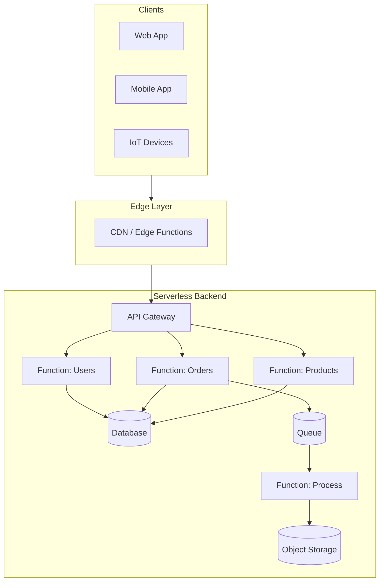
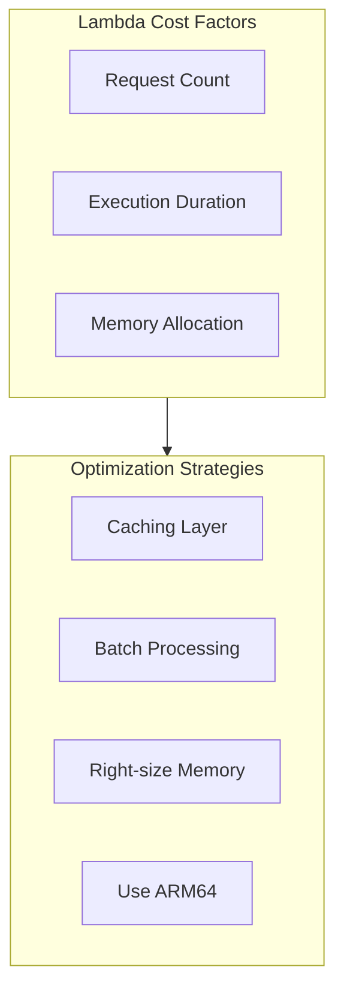

# Serverless Architecture

Serverless architecture allows you to build and run applications without thinking about servers. The cloud provider automatically manages the infrastructure, scaling, and availability, letting you focus purely on code.



## Serverless Models

<Tabs items={['FaaS', 'BaaS', 'Edge Computing']}>
  <Tab value="FaaS">
    ### Functions as a Service (FaaS)
    
    Execute code in response to events without managing servers.
    
    ```mermaid
    flowchart LR
        subgraph Triggers
            HTTP[HTTP Request]
            Schedule[Scheduled Event]
            Queue[Queue Message]
            Storage[Storage Event]
        end
        
        subgraph Runtime
            Cold[Cold Start] --> Warm[Warm Instance]
            Warm --> Execute[Execute Function]
            Execute --> Response[Return Response]
        end
        
        Triggers --> Runtime
    ```
    
    ```typescript title="functions/users.ts"
    // AWS Lambda with Hono
    import { Hono } from 'hono';
    import { handle } from 'hono/aws-lambda';
    
    const app = new Hono();
    
    app.get('/users/:id', async (c) => {
      const { id } = c.req.param();
      const user = await db.user.findUnique({ where: { id } });
      
      if (!user) {
        return c.json({ error: 'User not found' }, 404);
      }
      
      return c.json(user);
    });
    
    app.post('/users', async (c) => {
      const body = await c.req.json();
      const user = await db.user.create({ data: body });
      return c.json(user, 201);
    });
    
    // Export handler for AWS Lambda
    export const handler = handle(app);
    ```
    
    ```typescript title="functions/process-order.ts"
    // SQS Event Handler
    import type { SQSEvent } from 'aws-lambda';
    
    export const handler = async (event: SQSEvent) => {
      const results = await Promise.allSettled(
        event.Records.map(async (record) => {
          const order = JSON.parse(record.body);
          
          // Process the order
          await processOrder(order);
          
          // Send confirmation email
          await sendConfirmationEmail(order.userId, order.id);
          
          return { orderId: order.id, status: 'processed' };
        })
      );
      
      // Return failed messages for retry
      const failures = results
        .map((r, i) => r.status === 'rejected' ? event.Records[i].messageId : null)
        .filter(Boolean);
      
      return {
        batchItemFailures: failures.map(id => ({ itemIdentifier: id }))
      };
    };
    ```
  </Tab>
  
  <Tab value="BaaS">
    ### Backend as a Service (BaaS)
    
    Pre-built backend services like authentication, databases, and storage.
    
    ```mermaid
    flowchart TB
        Client[Client App]
        
        subgraph BaaS["Backend as a Service"]
            Auth[Authentication<br/>Clerk/Auth0]
            DB[Database<br/>Supabase/Firebase]
            Storage[Storage<br/>S3/Cloudflare R2]
            Search[Search<br/>Algolia/Meilisearch]
        end
        
        Client --> Auth
        Client --> DB
        Client --> Storage
        Client --> Search
    ```
    
    ```typescript title="lib/supabase.ts"
    // Supabase client setup
    import { createClient } from '@supabase/supabase-js';
    
    const supabase = createClient(
      process.env.SUPABASE_URL!,
      process.env.SUPABASE_ANON_KEY!
    );
    
    // Real-time subscription
    const subscribeToOrders = (userId: string, callback: (order: Order) => void) => {
      return supabase
        .channel('orders')
        .on(
          'postgres_changes',
          {
            event: 'INSERT',
            schema: 'public',
            table: 'orders',
            filter: `user_id=eq.${userId}`
          },
          (payload) => callback(payload.new as Order)
        )
        .subscribe();
    };
    
    // Database operations with RLS
    const getUserOrders = async (userId: string) => {
      const { data, error } = await supabase
        .from('orders')
        .select(`
          id,
          status,
          total,
          items:order_items(
            product:products(name, price),
            quantity
          )
        `)
        .eq('user_id', userId)
        .order('created_at', { ascending: false });
      
      if (error) throw error;
      return data;
    };
    ```
    
    ```typescript title="lib/auth.ts"
    // Clerk authentication integration
    import { clerkMiddleware, getAuth } from '@hono/clerk-auth';
    import { Hono } from 'hono';
    
    const app = new Hono();
    
    // Apply Clerk middleware
    app.use('*', clerkMiddleware());
    
    // Protected route
    app.get('/api/profile', async (c) => {
      const auth = getAuth(c);
      
      if (!auth?.userId) {
        return c.json({ error: 'Unauthorized' }, 401);
      }
      
      const user = await db.user.findUnique({
        where: { clerkId: auth.userId }
      });
      
      return c.json(user);
    });
    ```
  </Tab>
  
  <Tab value="Edge Computing">
    ### Edge Computing
    
    Run code at the network edge, closer to users for minimal latency.
    
    ```mermaid
    flowchart TB
        User[User Request]
        
        subgraph Edge["Edge Locations"]
            E1[Edge US-East]
            E2[Edge EU-West]
            E3[Edge Asia-Pacific]
        end
        
        subgraph Origin["Origin"]
            API[API Server]
            DB[(Database)]
        end
        
        User -->|Nearest| Edge
        Edge -->|Cache Miss| Origin
    ```
    
    ```typescript title="edge/middleware.ts"
    // Cloudflare Workers / Vercel Edge
    import { Hono } from 'hono';
    
    const app = new Hono();
    
    // Geolocation-based routing
    app.get('/api/pricing', async (c) => {
      const country = c.req.header('cf-ipcountry') || 'US';
      
      const pricing = await getPricingForRegion(country);
      
      return c.json(pricing, {
        headers: {
          'Cache-Control': 'public, max-age=3600',
          'CDN-Cache-Control': 'public, max-age=86400'
        }
      });
    });
    
    // A/B testing at the edge
    app.get('/api/experiment/:name', async (c) => {
      const { name } = c.req.param();
      const userId = c.req.header('x-user-id') || crypto.randomUUID();
      
      // Deterministic bucket assignment
      const bucket = hashToBucket(userId, name);
      const variant = bucket < 50 ? 'control' : 'treatment';
      
      return c.json({ 
        experiment: name,
        variant,
        config: await getExperimentConfig(name, variant)
      });
    });
    
    // Edge caching with stale-while-revalidate
    app.get('/api/products/:id', async (c) => {
      const { id } = c.req.param();
      const cacheKey = `product:${id}`;
      
      // Check edge cache
      const cached = await c.env.KV.get(cacheKey, 'json');
      if (cached) {
        // Revalidate in background
        c.executionCtx.waitUntil(revalidateProduct(c.env.KV, id));
        return c.json(cached);
      }
      
      const product = await fetchProduct(id);
      await c.env.KV.put(cacheKey, JSON.stringify(product), { expirationTtl: 3600 });
      
      return c.json(product);
    });
    
    export default app;
    ```
  </Tab>
</Tabs>

## AWS Lambda Patterns

<Tabs items={['REST API', 'Event Processing', 'Scheduled Tasks']}>
  <Tab value="REST API">
    ```typescript title="api/handler.ts"
    import { Hono } from 'hono';
    import { handle } from 'hono/aws-lambda';
    import { cors } from 'hono/cors';
    import { logger } from 'hono/logger';
    
    const app = new Hono();
    
    // Middleware
    app.use('*', logger());
    app.use('*', cors());
    
    // Routes
    app.route('/users', userRoutes);
    app.route('/orders', orderRoutes);
    app.route('/products', productRoutes);
    
    // Health check
    app.get('/health', (c) => c.json({ status: 'healthy' }));
    
    // Error handling
    app.onError((err, c) => {
      console.error('Error:', err);
      return c.json(
        { error: err.message },
        err instanceof HTTPException ? err.status : 500
      );
    });
    
    export const handler = handle(app);
    ```
    
    ```typescript title="api/routes/users.ts"
    import { Hono } from 'hono';
    import { zValidator } from '@hono/zod-validator';
    import { z } from 'zod';
    
    const userRoutes = new Hono();
    
    const createUserSchema = z.object({
      email: z.string().email(),
      name: z.string().min(2),
    });
    
    userRoutes.get('/:id', async (c) => {
      const { id } = c.req.param();
      const user = await userService.findById(id);
      
      if (!user) {
        return c.json({ error: 'User not found' }, 404);
      }
      
      return c.json(user);
    });
    
    userRoutes.post('/', zValidator('json', createUserSchema), async (c) => {
      const data = c.req.valid('json');
      const user = await userService.create(data);
      return c.json(user, 201);
    });
    
    export { userRoutes };
    ```
  </Tab>
  
  <Tab value="Event Processing">
    ```typescript title="functions/process-events.ts"
    import type { 
      SQSEvent, 
      S3Event, 
      DynamoDBStreamEvent 
    } from 'aws-lambda';
    
    // SQS Handler
    export const sqsHandler = async (event: SQSEvent) => {
      const batchItemFailures: { itemIdentifier: string }[] = [];
      
      for (const record of event.Records) {
        try {
          const message = JSON.parse(record.body);
          await processMessage(message);
        } catch (error) {
          console.error('Failed to process message:', error);
          batchItemFailures.push({ itemIdentifier: record.messageId });
        }
      }
      
      return { batchItemFailures };
    };
    
    // S3 Handler
    export const s3Handler = async (event: S3Event) => {
      for (const record of event.Records) {
        const bucket = record.s3.bucket.name;
        const key = decodeURIComponent(record.s3.object.key);
        
        if (record.eventName.startsWith('ObjectCreated')) {
          await processNewFile(bucket, key);
        } else if (record.eventName.startsWith('ObjectRemoved')) {
          await handleFileRemoval(bucket, key);
        }
      }
    };
    
    // DynamoDB Streams Handler
    export const dynamoHandler = async (event: DynamoDBStreamEvent) => {
      for (const record of event.Records) {
        if (record.eventName === 'INSERT') {
          const newItem = unmarshall(record.dynamodb!.NewImage!);
          await onItemCreated(newItem);
        } else if (record.eventName === 'MODIFY') {
          const oldItem = unmarshall(record.dynamodb!.OldImage!);
          const newItem = unmarshall(record.dynamodb!.NewImage!);
          await onItemUpdated(oldItem, newItem);
        } else if (record.eventName === 'REMOVE') {
          const oldItem = unmarshall(record.dynamodb!.OldImage!);
          await onItemDeleted(oldItem);
        }
      }
    };
    ```
  </Tab>
  
  <Tab value="Scheduled Tasks">
    ```typescript title="functions/scheduled.ts"
    import type { ScheduledEvent } from 'aws-lambda';
    
    // Daily cleanup task
    export const dailyCleanup = async (event: ScheduledEvent) => {
      console.log('Running daily cleanup at:', event.time);
      
      // Delete expired sessions
      const expiredSessions = await db.session.deleteMany({
        where: {
          expiresAt: { lt: new Date() }
        }
      });
      console.log(`Deleted ${expiredSessions.count} expired sessions`);
      
      // Archive old orders
      const oldOrders = await db.order.findMany({
        where: {
          status: 'completed',
          completedAt: { lt: subtractDays(new Date(), 90) }
        }
      });
      
      for (const order of oldOrders) {
        await archiveOrder(order);
      }
      console.log(`Archived ${oldOrders.length} old orders`);
      
      return { success: true };
    };
    
    // Hourly metrics aggregation
    export const aggregateMetrics = async (event: ScheduledEvent) => {
      const hourAgo = subtractHours(new Date(), 1);
      
      const metrics = await db.event.groupBy({
        by: ['type'],
        _count: { id: true },
        where: {
          createdAt: { gte: hourAgo }
        }
      });
      
      await db.hourlyMetrics.create({
        data: {
          hour: hourAgo,
          metrics: JSON.stringify(metrics)
        }
      });
      
      return { aggregated: metrics.length };
    };
    ```
  </Tab>
</Tabs>

## Project Structure

<Files>
  <Folder name="serverless-app" defaultOpen>
    <File name="package.json" />
    <File name="tsconfig.json" />
    <File name="sst.config.ts" />
    <Folder name="packages" defaultOpen>
      <Folder name="functions" defaultOpen>
        <Folder name="api">
          <File name="handler.ts" />
          <Folder name="routes">
            <File name="users.ts" />
            <File name="orders.ts" />
            <File name="products.ts" />
          </Folder>
        </Folder>
        <Folder name="events">
          <File name="order-processor.ts" />
          <File name="notification.ts" />
          <File name="image-processor.ts" />
        </Folder>
        <Folder name="scheduled">
          <File name="cleanup.ts" />
          <File name="reports.ts" />
        </Folder>
      </Folder>
      <Folder name="core">
        <File name="index.ts" />
        <Folder name="services">
          <File name="user.service.ts" />
          <File name="order.service.ts" />
        </Folder>
        <Folder name="database">
          <File name="client.ts" />
          <File name="schema.ts" />
        </Folder>
      </Folder>
    </Folder>
    <Folder name="stacks">
      <File name="api.ts" />
      <File name="database.ts" />
      <File name="storage.ts" />
      <File name="events.ts" />
    </Folder>
  </Folder>
</Files>

## Infrastructure as Code (SST)

```typescript title="sst.config.ts"
import type { SSTConfig } from 'sst';
import { Api } from './stacks/api';
import { Database } from './stacks/database';
import { Storage } from './stacks/storage';
import { Events } from './stacks/events';

export default {
  config(_input) {
    return {
      name: 'serverless-app',
      region: 'us-east-1',
    };
  },
  stacks(app) {
    app
      .stack(Database)
      .stack(Storage)
      .stack(Events)
      .stack(Api);
  },
} satisfies SSTConfig;
```

```typescript title="stacks/api.ts"
import { Api, Function, use, StackContext } from 'sst/constructs';
import { Database } from './database';
import { Storage } from './storage';

export function ApiStack({ stack }: StackContext) {
  const { table } = use(Database);
  const { bucket } = use(Storage);

  // API Gateway with Lambda
  const api = new Api(stack, 'Api', {
    defaults: {
      function: {
        bind: [table, bucket],
        timeout: '30 seconds',
        memorySize: '512 MB',
        environment: {
          TABLE_NAME: table.tableName,
          BUCKET_NAME: bucket.bucketName,
        },
      },
    },
    routes: {
      // User routes
      'GET /users/{id}': 'packages/functions/api/handler.handler',
      'POST /users': 'packages/functions/api/handler.handler',
      'PUT /users/{id}': 'packages/functions/api/handler.handler',
      
      // Order routes
      'GET /orders': 'packages/functions/api/handler.handler',
      'GET /orders/{id}': 'packages/functions/api/handler.handler',
      'POST /orders': 'packages/functions/api/handler.handler',
      
      // Product routes
      'GET /products': 'packages/functions/api/handler.handler',
      'GET /products/{id}': 'packages/functions/api/handler.handler',
    },
  });

  stack.addOutputs({
    ApiEndpoint: api.url,
  });

  return { api };
}
```

```typescript title="stacks/events.ts"
import { Queue, Function, Cron, use, StackContext } from 'sst/constructs';
import { Database } from './database';

export function EventsStack({ stack }: StackContext) {
  const { table } = use(Database);

  // Order processing queue
  const orderQueue = new Queue(stack, 'OrderQueue', {
    consumer: {
      function: {
        handler: 'packages/functions/events/order-processor.handler',
        bind: [table],
        timeout: '60 seconds',
      },
    },
  });

  // Notification queue with DLQ
  const notificationDLQ = new Queue(stack, 'NotificationDLQ');
  const notificationQueue = new Queue(stack, 'NotificationQueue', {
    consumer: {
      function: {
        handler: 'packages/functions/events/notification.handler',
        timeout: '30 seconds',
      },
    },
    cdk: {
      queue: {
        deadLetterQueue: {
          queue: notificationDLQ.cdk.queue,
          maxReceiveCount: 3,
        },
      },
    },
  });

  // Scheduled tasks
  new Cron(stack, 'DailyCleanup', {
    schedule: 'cron(0 2 * * ? *)', // 2 AM UTC daily
    job: {
      function: {
        handler: 'packages/functions/scheduled/cleanup.handler',
        bind: [table],
        timeout: '5 minutes',
      },
    },
  });

  new Cron(stack, 'HourlyReports', {
    schedule: 'rate(1 hour)',
    job: 'packages/functions/scheduled/reports.handler',
  });

  return { orderQueue, notificationQueue };
}
```

## Cold Start Optimization

<Callout type="warn">
  Cold starts can add 100ms-3s latency. Optimize for production workloads.
</Callout>

```typescript title="optimizations.ts"
// 1. Keep connections alive
let dbConnection: PrismaClient | null = null;

const getDbConnection = () => {
  if (!dbConnection) {
    dbConnection = new PrismaClient();
  }
  return dbConnection;
};

// 2. Initialize outside handler
const config = loadConfig();
const secrets = await loadSecrets();

export const handler = async (event: APIGatewayEvent) => {
  const db = getDbConnection();
  // Use pre-initialized config and secrets
  return processRequest(event, db, config);
};

// 3. Use lightweight dependencies
// Instead of: import AWS from 'aws-sdk';
// Use: import { DynamoDBClient } from '@aws-sdk/client-dynamodb';

// 4. Provisioned concurrency for critical paths
// In SST:
new Function(stack, 'CriticalFunction', {
  handler: 'handler.main',
  // Keep 5 instances warm
  currentVersionOptions: {
    provisionedConcurrentExecutions: 5,
  },
});

// 5. Use ARM64 for better price/performance
new Function(stack, 'OptimizedFunction', {
  handler: 'handler.main',
  architecture: 'arm_64',
  memorySize: '1024 MB', // More memory = more CPU
});
```

## Cost Optimization



| Strategy | Impact | Implementation |
|----------|--------|----------------|
| **ARM64** | 20% cheaper | Change architecture setting |
| **Right-size memory** | Variable | Profile and test |
| **Caching** | 50-90% fewer invocations | CloudFront, Redis |
| **Batch processing** | Fewer invocations | SQS batching |
| **Reserved concurrency** | Predictable costs | Set limits |

```typescript title="cost-optimized.ts"
// Batch SQS processing
export const handler = async (event: SQSEvent) => {
  // Process up to 10 messages per invocation
  const results = await Promise.all(
    event.Records.map(record => processRecord(record))
  );
  
  return {
    batchItemFailures: results
      .filter(r => !r.success)
      .map(r => ({ itemIdentifier: r.messageId }))
  };
};

// Response caching
const cachedHandler = async (event: APIGatewayEvent) => {
  const cacheKey = `${event.path}:${event.queryStringParameters}`;
  
  // Check cache
  const cached = await redis.get(cacheKey);
  if (cached) {
    return {
      statusCode: 200,
      body: cached,
      headers: { 'X-Cache': 'HIT' }
    };
  }
  
  // Generate response
  const response = await generateResponse(event);
  
  // Cache for 5 minutes
  await redis.setex(cacheKey, 300, JSON.stringify(response));
  
  return {
    statusCode: 200,
    body: JSON.stringify(response),
    headers: { 'X-Cache': 'MISS' }
  };
};
```

## When to Use Serverless

<Cards>
  <Card title="✅ Good For">
    - **Variable traffic** - Auto-scaling to zero
    - **Event-driven workloads** - Queues, webhooks, cron
    - **APIs with spiky traffic** - Pay per request
    - **Startups/MVPs** - No upfront infrastructure
    - **Microservices** - Independent deployment
    - **Background jobs** - Image processing, ETL
  </Card>
  <Card title="❌ Avoid When">
    - **Long-running processes** - 15 min Lambda limit
    - **Steady high traffic** - EC2 may be cheaper
    - **Low latency critical** - Cold starts add latency
    - **Stateful applications** - No persistent connections
    - **Large payloads** - 6MB sync, 256KB async limits
    - **Complex local development** - Harder to simulate
  </Card>
</Cards>

## Comparison with Other Architectures

| Aspect | Serverless | Containers | VMs |
|--------|------------|------------|-----|
| **Scaling** | Automatic, per-request | Manual or auto | Manual |
| **Cold Start** | 100ms-3s | None | None |
| **Pricing** | Per execution | Per second | Per hour |
| **Max Duration** | 15 min | Unlimited | Unlimited |
| **Ops Overhead** | Minimal | Medium | High |
| **Vendor Lock-in** | High | Medium | Low |

## Summary

Serverless architecture is ideal for:

1. **Event-driven workloads** - Natural fit for queues, webhooks, schedules
2. **Variable traffic** - Pay only for what you use
3. **Rapid development** - Focus on code, not infrastructure
4. **Microservices** - Each function is independently deployable

Key considerations:

- **Cold starts** - Use provisioned concurrency for critical paths
- **Timeouts** - Design for 15-minute max execution
- **State** - Use external stores (DynamoDB, Redis, S3)
- **Testing** - Invest in local development tooling
