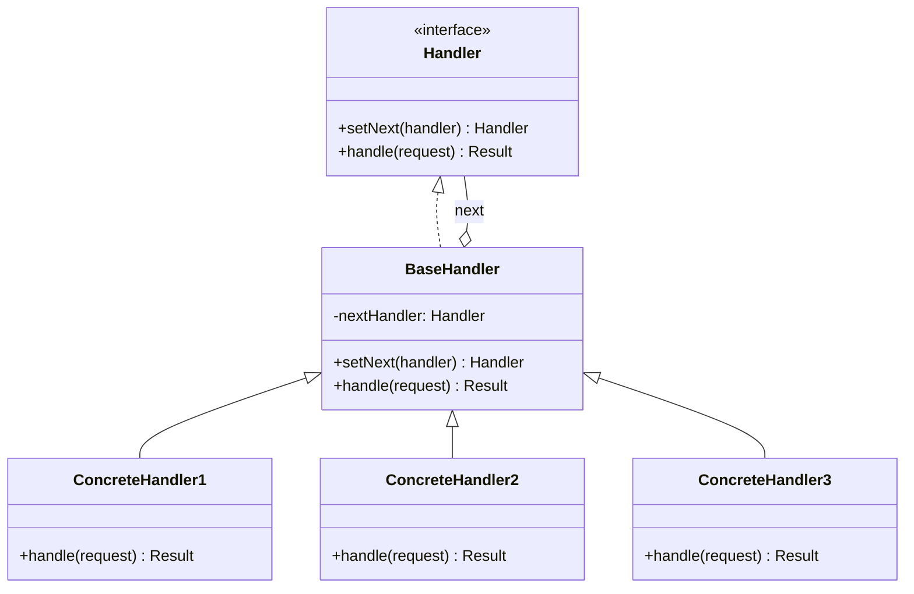
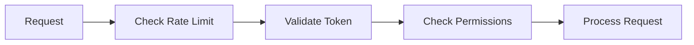
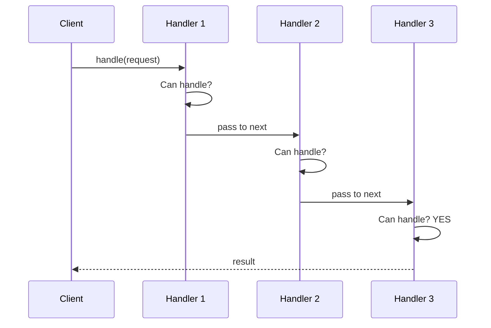
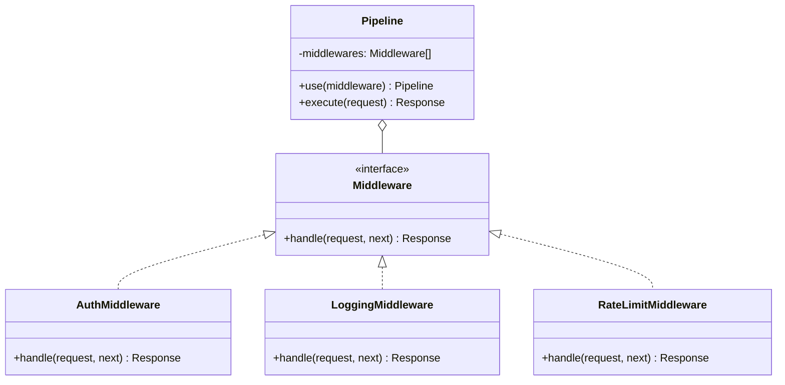

# Chain of Responsibility Pattern

## Intent

**Chain of Responsibility** is a behavioral design pattern that lets you pass requests along a chain of handlers. Upon receiving a request, each handler decides either to process the request or to pass it to the next handler in the chain.



---

## Problem It Solves

Imagine you're building an authentication system. Different checks need to happen in sequence:



Without the pattern, you'd have:
- Tightly coupled handlers
- Hard-coded processing order
- Difficult to add/remove steps

---

## Solution

Chain handlers together, each passing to the next:



---

## Structure



---

## Implementation

<Tabs items={["HTTP Middleware", "Validation Chain", "Event Processing", "Real-World: Support Tickets"]}>
  <Tab value="HTTP Middleware">
```typescript
/**
 * HTTP Request object
 */
interface Request {
  method: string;
  path: string;
  headers: Record<string, string>;
  body?: unknown;
  user?: { id: string; role: string };
}

/**
 * HTTP Response object
 */
interface Response {
  status: number;
  body: unknown;
  headers: Record<string, string>;
}

/**
 * Next function to call next middleware
 */
type NextFunction = () => Promise<Response>;

/**
 * Middleware handler interface
 * @description Each middleware can process request or pass to next
 */
type Middleware = (req: Request, next: NextFunction) => Promise<Response>;

/**
 * Creates a middleware pipeline
 * @description Chains middlewares in order, each can short-circuit or continue
 */
const createPipeline = (...middlewares: Middleware[]) => {
  return async (request: Request): Promise<Response> => {
    let index = 0;

    const next: NextFunction = async () => {
      if (index >= middlewares.length) {
        return { status: 404, body: "Not Found", headers: {} };
      }
      const middleware = middlewares[index++];
      return middleware(request, next);
    };

    return next();
  };
};

/**
 * Logging middleware - logs all requests
 */
const loggingMiddleware: Middleware = async (req, next) => {
  const start = Date.now();
  console.log(`→ ${req.method} ${req.path}`);
  
  const response = await next();
  
  console.log(`← ${req.method} ${req.path} ${response.status} (${Date.now() - start}ms)`);
  return response;
};

/**
 * Rate limiting middleware - limits requests per IP
 */
const createRateLimitMiddleware = (limit: number, windowMs: number): Middleware => {
  const requests = new Map<string, number[]>();

  return async (req, next) => {
    const ip = req.headers["x-forwarded-for"] || "unknown";
    const now = Date.now();
    const windowStart = now - windowMs;

    const ipRequests = (requests.get(ip) || []).filter(t => t > windowStart);
    
    if (ipRequests.length >= limit) {
      return {
        status: 429,
        body: { error: "Too many requests" },
        headers: { "Retry-After": String(Math.ceil(windowMs / 1000)) },
      };
    }

    ipRequests.push(now);
    requests.set(ip, ipRequests);

    return next();
  };
};

/**
 * Authentication middleware - validates JWT token
 */
const authMiddleware: Middleware = async (req, next) => {
  const authHeader = req.headers["authorization"];
  
  if (!authHeader?.startsWith("Bearer ")) {
    return {
      status: 401,
      body: { error: "Missing or invalid authorization header" },
      headers: {},
    };
  }

  const token = authHeader.slice(7);
  
  // Simulate token validation
  if (token === "valid-token") {
    req.user = { id: "user-123", role: "admin" };
    return next();
  }

  return {
    status: 401,
    body: { error: "Invalid token" },
    headers: {},
  };
};

/**
 * Authorization middleware - checks user permissions
 */
const createAuthzMiddleware = (requiredRole: string): Middleware => {
  return async (req, next) => {
    if (!req.user) {
      return { status: 401, body: { error: "Not authenticated" }, headers: {} };
    }

    if (req.user.role !== requiredRole && req.user.role !== "admin") {
      return { status: 403, body: { error: "Insufficient permissions" }, headers: {} };
    }

    return next();
  };
};

/**
 * Request handler - actual business logic
 */
const getUsersHandler: Middleware = async (req, _next) => {
  return {
    status: 200,
    body: { users: [{ id: "1", name: "John" }, { id: "2", name: "Jane" }] },
    headers: { "Content-Type": "application/json" },
  };
};

// Build the pipeline
const pipeline = createPipeline(
  loggingMiddleware,
  createRateLimitMiddleware(100, 60000),
  authMiddleware,
  createAuthzMiddleware("admin"),
  getUsersHandler
);

// Test the pipeline
const response = await pipeline({
  method: "GET",
  path: "/api/users",
  headers: { authorization: "Bearer valid-token" },
});

console.log("Response:", response);
//                       ^?
```
  </Tab>
  <Tab value="Validation Chain">
```ts
/**
 * Validation result
 */
interface ValidationResult {
  valid: boolean;
  errors: string[];
}

/**
 * Validator function type
 * @description Returns errors array, empty if valid
 */
type Validator<T> = (value: T) => string[];

/**
 * Creates a validation chain
 * @description Runs all validators and collects errors
 */
const createValidationChain = <T>(...validators: Validator<T>[]) => {
  return (value: T): ValidationResult => {
    const errors = validators.flatMap(validator => validator(value));
    return { valid: errors.length === 0, errors };
  };
};

// String validators
const required: Validator<string> = (value) =>
  value?.trim() ? [] : ["Value is required"];

const minLength = (min: number): Validator<string> => (value) =>
  value.length >= min ? [] : [`Must be at least ${min} characters`];

const maxLength = (max: number): Validator<string> => (value) =>
  value.length <= max ? [] : [`Must be at most ${max} characters`];

const pattern = (regex: RegExp, message: string): Validator<string> => (value) =>
  regex.test(value) ? [] : [message];

const emailValidator: Validator<string> = pattern(
  /^[^\s@]+@[^\s@]+\.[^\s@]+$/,
  "Invalid email format"
);

// Number validators
const minNum = (minVal: number): Validator<number> => (value) =>
  value >= minVal ? [] : [`Must be at least ${minVal}`];

const maxNum = (maxVal: number): Validator<number> => (value) =>
  value <= maxVal ? [] : [`Must be at most ${maxVal}`];

const integer: Validator<number> = (value) =>
  Number.isInteger(value) ? [] : ["Must be an integer"];

/**
 * Field validator for objects
 */
interface FieldValidator {
  field: string;
  validate: (value: unknown) => string[];
}

/**
 * Creates an object validator from field validators
 */
const createObjectValidator = (
  ...fieldValidators: FieldValidator[]
) => {
  return (obj: Record<string, unknown>): ValidationResult => {
    const errors: string[] = [];
    
    for (const { field, validate } of fieldValidators) {
      const value = obj[field];
      const fieldErrors = validate(value);
      errors.push(...fieldErrors.map(e => `${field}: ${e}`));
    }
    
    return { valid: errors.length === 0, errors };
  };
};

/**
 * Helper to create a field validator
 */
const field = <T>(
  name: string, 
  ...validators: Validator<T>[]
): FieldValidator => ({
  field: name,
  validate: (value) => {
    const chain = createValidationChain(...validators);
    return chain(value as T).errors;
  },
});

// Usage: User registration validation
const validateUser = createObjectValidator(
  field("username", required, minLength(3), maxLength(20)),
  field("email", required, emailValidator),
  field("password", 
    required,
    minLength(8),
    pattern(/[A-Z]/, "Must contain uppercase letter"),
    pattern(/[0-9]/, "Must contain a number"),
  ),
  field("age", minNum(18), maxNum(120), integer),
);

// Test validation
const validUser = {
  username: "john_doe",
  email: "john@example.com",
  password: "SecurePass123",
  age: 25,
};

const invalidUser = {
  username: "jo",
  email: "not-an-email",
  password: "weak",
  age: 15.5,
};

console.log("Valid user:", validateUser(validUser));
// { valid: true, errors: [] }

console.log("Invalid user:", validateUser(invalidUser));
// { valid: false, errors: [...] }
```
  </Tab>
  <Tab value="Event Processing">
```typescript
/**
 * Event types in the system
 */
type EventType = "user.created" | "user.updated" | "order.placed" | "payment.received";

/**
 * Base event structure
 */
interface Event {
  type: EventType;
  timestamp: Date;
  data: Record<string, unknown>;
}

/**
 * Event handler interface
 * @description Handler can process event and optionally pass to next
 */
interface EventHandler {
  /** Event types this handler cares about */
  handles: EventType[];
  /** Process the event */
  process: (event: Event) => Promise<void>;
}

/**
 * Event processing pipeline
 * @description Routes events to appropriate handlers in chain
 */
interface EventPipeline {
  /** Add handler to chain */
  addHandler: (handler: EventHandler) => void;
  /** Process event through chain */
  dispatch: (event: Event) => Promise<void>;
}

const createEventPipeline = (): EventPipeline => {
  const handlers: EventHandler[] = [];

  return {
    addHandler: (handler) => {
      handlers.push(handler);
    },

    dispatch: async (event) => {
      console.log(`\n[Pipeline] Dispatching ${event.type}`);
      
      for (const handler of handlers) {
        if (handler.handles.includes(event.type)) {
          await handler.process(event);
        }
      }
    },
  };
};

// Handlers
const loggingHandler: EventHandler = {
  handles: ["user.created", "user.updated", "order.placed", "payment.received"],
  process: async (event) => {
    console.log(`[Logger] ${event.type} at ${event.timestamp.toISOString()}`);
    console.log(`[Logger] Data:`, JSON.stringify(event.data));
  },
};

const analyticsHandler: EventHandler = {
  handles: ["user.created", "order.placed"],
  process: async (event) => {
    console.log(`[Analytics] Tracking ${event.type}`);
    // Send to analytics service
  },
};

const emailHandler: EventHandler = {
  handles: ["user.created", "order.placed", "payment.received"],
  process: async (event) => {
    if (event.type === "user.created") {
      console.log(`[Email] Sending welcome email to ${event.data.email}`);
    } else if (event.type === "order.placed") {
      console.log(`[Email] Sending order confirmation for order ${event.data.orderId}`);
    } else if (event.type === "payment.received") {
      console.log(`[Email] Sending receipt for payment ${event.data.paymentId}`);
    }
  },
};

const inventoryHandler: EventHandler = {
  handles: ["order.placed"],
  process: async (event) => {
    console.log(`[Inventory] Reserving items for order ${event.data.orderId}`);
    // Update inventory
  },
};

const notificationHandler: EventHandler = {
  handles: ["payment.received"],
  process: async (event) => {
    console.log(`[Notification] Push notification for payment ${event.data.paymentId}`);
  },
};

// Build pipeline
const pipeline = createEventPipeline();
pipeline.addHandler(loggingHandler);
pipeline.addHandler(analyticsHandler);
pipeline.addHandler(emailHandler);
pipeline.addHandler(inventoryHandler);
pipeline.addHandler(notificationHandler);

// Dispatch events
await pipeline.dispatch({
  type: "user.created",
  timestamp: new Date(),
  data: { userId: "123", email: "user@example.com" },
});

await pipeline.dispatch({
  type: "order.placed",
  timestamp: new Date(),
  data: { orderId: "456", items: ["item1", "item2"] },
});

await pipeline.dispatch({
  type: "payment.received",
  timestamp: new Date(),
  data: { paymentId: "789", amount: 99.99 },
});
```
  </Tab>
  <Tab value="Real-World: Support Tickets">
```ts
/**
 * Support ticket priority levels
 */
type Priority = "low" | "medium" | "high" | "critical";

/**
 * Support ticket structure
 */
interface SupportTicket {
  id: string;
  title: string;
  description: string;
  priority: Priority;
  category: "billing" | "technical" | "general" | "security";
  customerId: string;
  createdAt: Date;
  metadata: Record<string, unknown>;
}

/**
 * Handler result
 */
interface HandlerResult {
  handled: boolean;
  handler?: string;
  action?: string;
  escalatedTo?: string;
}

/**
 * Support handler interface
 */
interface SupportHandler {
  name: string;
  canHandle: (ticket: SupportTicket) => boolean;
  handle: (ticket: SupportTicket) => Promise<HandlerResult>;
}

/**
 * Support ticket chain
 */
const createSupportChain = (...handlers: SupportHandler[]) => {
  return async (ticket: SupportTicket): Promise<HandlerResult> => {
    for (const handler of handlers) {
      if (handler.canHandle(ticket)) {
        const result = await handler.handle(ticket);
        if (result.handled) {
          return result;
        }
      }
    }
    
    return {
      handled: false,
      escalatedTo: "management",
    };
  };
};

// Level 1: AI Bot
const aiBot: SupportHandler = {
  name: "AI Support Bot",
  canHandle: (ticket) => 
    ticket.priority === "low" && ticket.category === "general",
  handle: async (ticket) => {
    console.log(`[AI Bot] Auto-responding to ticket ${ticket.id}`);
    
    // Check knowledge base
    const knownIssues = ["password reset", "login help", "faq"];
    const isKnown = knownIssues.some(issue => 
      ticket.description.toLowerCase().includes(issue)
    );
    
    if (isKnown) {
      return {
        handled: true,
        handler: "AI Support Bot",
        action: "Sent automated response with solution",
      };
    }
    
    return { handled: false };
  },
};

// Level 2: Junior Support
const juniorSupport: SupportHandler = {
  name: "Junior Support Team",
  canHandle: (ticket) => 
    ["low", "medium"].includes(ticket.priority) &&
    ["general", "billing"].includes(ticket.category),
  handle: async (ticket) => {
    console.log(`[Junior Support] Handling ticket ${ticket.id}`);
    
    if (ticket.category === "billing") {
      return {
        handled: true,
        handler: "Junior Support Team",
        action: "Processed billing inquiry",
      };
    }
    
    return {
      handled: true,
      handler: "Junior Support Team",
      action: "Resolved general inquiry",
    };
  },
};

// Level 3: Senior Support
const seniorSupport: SupportHandler = {
  name: "Senior Support Team",
  canHandle: (ticket) => 
    ["medium", "high"].includes(ticket.priority) &&
    ticket.category === "technical",
  handle: async (ticket) => {
    console.log(`[Senior Support] Handling technical ticket ${ticket.id}`);
    
    return {
      handled: true,
      handler: "Senior Support Team",
      action: "Resolved technical issue with debugging",
    };
  },
};

// Level 4: Security Team
const securityTeam: SupportHandler = {
  name: "Security Response Team",
  canHandle: (ticket) => 
    ticket.category === "security" || ticket.priority === "critical",
  handle: async (ticket) => {
    console.log(`[Security Team] ALERT: Handling security ticket ${ticket.id}`);
    
    return {
      handled: true,
      handler: "Security Response Team",
      action: "Initiated security incident response protocol",
    };
  },
};

// Level 5: Engineering
const engineering: SupportHandler = {
  name: "Engineering Team",
  canHandle: (ticket) => 
    ticket.priority === "critical" && ticket.category === "technical",
  handle: async (ticket) => {
    console.log(`[Engineering] Critical issue escalated: ${ticket.id}`);
    
    return {
      handled: true,
      handler: "Engineering Team",
      action: "Created hotfix branch and investigating",
    };
  },
};

// Build the chain
const supportChain = createSupportChain(
  aiBot,
  juniorSupport,
  seniorSupport,
  securityTeam,
  engineering
);

// Test tickets
const tickets: SupportTicket[] = [
  {
    id: "T001",
    title: "How do I reset my password?",
    description: "I forgot my password, need password reset help",
    priority: "low",
    category: "general",
    customerId: "C001",
    createdAt: new Date(),
    metadata: {},
  },
  {
    id: "T002",
    title: "Billing discrepancy",
    description: "I was charged twice for my subscription",
    priority: "medium",
    category: "billing",
    customerId: "C002",
    createdAt: new Date(),
    metadata: {},
  },
  {
    id: "T003",
    title: "Application crashes on startup",
    description: "Getting error code 500 when opening the app",
    priority: "high",
    category: "technical",
    customerId: "C003",
    createdAt: new Date(),
    metadata: {},
  },
  {
    id: "T004",
    title: "Possible data breach",
    description: "Suspicious login activity detected on my account",
    priority: "critical",
    category: "security",
    customerId: "C004",
    createdAt: new Date(),
    metadata: {},
  },
];

// Process tickets
for (const ticket of tickets) {
  console.log(`\n=== Processing Ticket ${ticket.id}: ${ticket.title} ===`);
  const result = await supportChain(ticket);
  console.log("Result:", result);
}
```
  </Tab>
</Tabs>

---

## When to Use

<Accordions>
  <Accordion title="✅ Use Chain of Responsibility when...">
    - **Multiple handlers can process a request**: And you don't know which one in advance
    
    - **Processing order matters**: Handlers should execute in a specific sequence
    
    - **Handlers can short-circuit**: Some handlers may stop the chain
    
    - **Dynamic handler configuration**: Need to add/remove handlers at runtime
    
    - **Examples**: HTTP middleware, validation pipelines, logging chains
  </Accordion>
  
  <Accordion title="❌ Avoid Chain of Responsibility when...">
    - **Single handler always processes**: No need for a chain
    
    - **All handlers must execute**: Consider Composite or Observer instead
    
    - **Complex branching logic**: State machine might be better
  </Accordion>
</Accordions>

---

## Real-World Applications

| Framework/Library | Chain Usage |
|-------------------|-------------|
| **Express.js** | Middleware pipeline |
| **Koa.js** | Async middleware |
| **Redux** | Middleware chain |
| **DOM Events** | Event bubbling |
| **Java Servlet** | Filter chain |
| **ASP.NET Core** | Request pipeline |

---

## Summary

<Callout type="info">
  **Key Takeaway**: Chain of Responsibility decouples senders from receivers by giving multiple objects a chance to handle a request. It's perfect for middleware, validation, and event processing.
</Callout>

### Pros
- ✅ Reduced coupling between sender and receivers
- ✅ Single Responsibility: Each handler does one thing
- ✅ Open/Closed: Add handlers without changing existing code
- ✅ Flexible: Change chain order or composition at runtime

### Cons
- ❌ Request might go unhandled
- ❌ Hard to observe the chain flow
- ❌ Performance overhead with long chains
