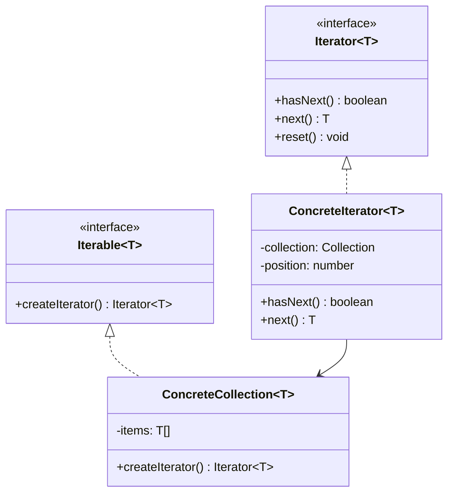
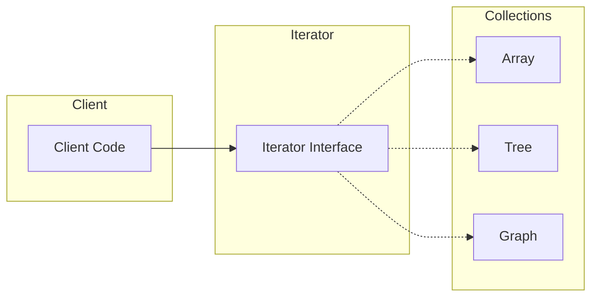

# Iterator Pattern

## Intent

**Iterator** is a behavioral design pattern that lets you traverse elements of a collection without exposing its underlying representation (list, stack, tree, etc.).



---

## Problem It Solves

Different collections have different traversal needs:
- Arrays: sequential access
- Trees: depth-first, breadth-first
- Graphs: various traversal orders
- Custom structures: domain-specific iteration

Without Iterator:
- Client code is coupled to collection structure
- Can't change collection without breaking clients
- Traversal logic scattered everywhere

---

## Solution

Extract traversal logic into separate iterator objects:



---

## TypeScript Iterators

TypeScript/JavaScript has built-in iterator support:

```typescript
/**
 * Custom iterable using Symbol.iterator
 * @description Makes any object usable in for...of loops
 */
interface Range {
  start: number;
  end: number;
  step: number;
  [Symbol.iterator]: () => Iterator<number>;
}

const createRange = (start: number, end: number, step = 1): Range => ({
  start,
  end,
  step,
  [Symbol.iterator]() {
    let current = start;
    return {
      next() {
        if ((step > 0 && current < end) || (step < 0 && current > end)) {
          const value = current;
          current += step;
          return { value, done: false };
        }
        return { value: undefined, done: true };
      },
    };
  },
});

// Usage with for...of
const range = createRange(1, 5);
for (const num of range) {
  console.log(num);
}
// Outputs: 1, 2, 3, 4

// Works with spread operator
const arr = [...createRange(0, 10, 2)];
console.log(arr); // [0, 2, 4, 6, 8]
```

---

## Implementation

<Tabs items={["Generator Functions", "Tree Traversal", "Paginated Data", "Real-World: Query Builder"]}>
  <Tab value="Generator Functions">
```typescript
/**
 * Generator-based iterators
 * @description Using TypeScript generators for clean iteration
 */

/**
 * Infinite sequence generator
 */
function* infiniteSequence(start = 0): Generator<number> {
  let n = start;
  while (true) {
    yield n++;
  }
}

/**
 * Fibonacci sequence generator
 */
function* fibonacci(): Generator<number> {
  let [a, b] = [0, 1];
  while (true) {
    yield a;
    [a, b] = [b, a + b];
  }
}

/**
 * Take first n elements from any iterator
 */
function* take<T>(iterator: Iterator<T>, count: number): Generator<T> {
  let taken = 0;
  while (taken < count) {
    const { value, done } = iterator.next();
    if (done) break;
    yield value;
    taken++;
  }
}

/**
 * Filter iterator
 */
function* filter<T>(
  iterator: Iterator<T>,
  predicate: (item: T) => boolean
): Generator<T> {
  while (true) {
    const { value, done } = iterator.next();
    if (done) break;
    if (predicate(value)) {
      yield value;
    }
  }
}

/**
 * Map iterator
 */
function* map<T, U>(
  iterator: Iterator<T>,
  transform: (item: T) => U
): Generator<U> {
  while (true) {
    const { value, done } = iterator.next();
    if (done) break;
    yield transform(value);
  }
}

/**
 * Zip two iterators
 */
function* zip<T, U>(
  iter1: Iterator<T>,
  iter2: Iterator<U>
): Generator<[T, U]> {
  while (true) {
    const result1 = iter1.next();
    const result2 = iter2.next();
    if (result1.done || result2.done) break;
    yield [result1.value, result2.value];
  }
}

/**
 * Flatten nested iterables
 */
function* flatten<T>(
  iterable: Iterable<Iterable<T>>
): Generator<T> {
  for (const inner of iterable) {
    yield* inner;
  }
}

// Usage
console.log("First 10 Fibonacci numbers:");
const fibs = [...take(fibonacci(), 10)];
console.log(fibs);
// [0, 1, 1, 2, 3, 5, 8, 13, 21, 34]

console.log("\nEven Fibonacci numbers under 100:");
const evenFibs = [
  ...take(
    filter(fibonacci(), n => n % 2 === 0 && n < 100),
    10
  )
];
console.log(evenFibs);
// [0, 2, 8, 34]

console.log("\nSquares of first 5 numbers:");
const squares = [...take(map(infiniteSequence(1), n => n * n), 5)];
console.log(squares);
// [1, 4, 9, 16, 25]

console.log("\nZipped:");
const zipped = [...zip(
  infiniteSequence(1)[Symbol.iterator]?.() ?? infiniteSequence(1),
  ["a", "b", "c"][Symbol.iterator]()
)];
console.log(zipped);
// [[1, "a"], [2, "b"], [3, "c"]]
```
  </Tab>
  <Tab value="Tree Traversal">
```typescript
/**
 * Tree node structure
 */
interface TreeNode<T> {
  value: T;
  children: TreeNode<T>[];
}

/**
 * Create a tree node
 */
const createNode = <T>(value: T, children: TreeNode<T>[] = []): TreeNode<T> => ({
  value,
  children,
});

/**
 * Tree with multiple traversal iterators
 */
interface Tree<T> {
  root: TreeNode<T> | null;
  /** Depth-first pre-order traversal */
  preOrder: () => Generator<T>;
  /** Depth-first post-order traversal */
  postOrder: () => Generator<T>;
  /** Breadth-first (level-order) traversal */
  levelOrder: () => Generator<T>;
  /** Iterate leaves only */
  leaves: () => Generator<T>;
}

const createTree = <T>(root: TreeNode<T> | null): Tree<T> => ({
  root,

  *preOrder() {
    if (!root) return;
    
    const stack: TreeNode<T>[] = [root];
    while (stack.length > 0) {
      const node = stack.pop()!;
      yield node.value;
      // Add children in reverse order for correct traversal
      for (let i = node.children.length - 1; i >= 0; i--) {
        stack.push(node.children[i]);
      }
    }
  },

  *postOrder() {
    function* traverse(node: TreeNode<T>): Generator<T> {
      for (const child of node.children) {
        yield* traverse(child);
      }
      yield node.value;
    }
    
    if (root) yield* traverse(root);
  },

  *levelOrder() {
    if (!root) return;
    
    const queue: TreeNode<T>[] = [root];
    while (queue.length > 0) {
      const node = queue.shift()!;
      yield node.value;
      queue.push(...node.children);
    }
  },

  *leaves() {
    function* findLeaves(node: TreeNode<T>): Generator<T> {
      if (node.children.length === 0) {
        yield node.value;
      } else {
        for (const child of node.children) {
          yield* findLeaves(child);
        }
      }
    }
    
    if (root) yield* findLeaves(root);
  },
});

// Build a tree:
//        1
//      / | \
//     2  3  4
//    /|     |
//   5 6     7

const root = createNode(1, [
  createNode(2, [
    createNode(5),
    createNode(6),
  ]),
  createNode(3),
  createNode(4, [
    createNode(7),
  ]),
]);

const tree = createTree(root);

console.log("Pre-order:", [...tree.preOrder()]);
// [1, 2, 5, 6, 3, 4, 7]

console.log("Post-order:", [...tree.postOrder()]);
// [5, 6, 2, 3, 7, 4, 1]

console.log("Level-order:", [...tree.levelOrder()]);
// [1, 2, 3, 4, 5, 6, 7]

console.log("Leaves:", [...tree.leaves()]);
// [5, 6, 3, 7]

// Use in for...of
console.log("\nIterating pre-order:");
for (const value of tree.preOrder()) {
  console.log(`  Node: ${value}`);
}
```
  </Tab>
  <Tab value="Paginated Data">
```typescript
/**
 * Paginated API response
 */
interface PaginatedResponse<T> {
  data: T[];
  page: number;
  pageSize: number;
  totalPages: number;
  totalItems: number;
  hasNext: boolean;
}

/**
 * Paginated data source
 */
interface PaginatedSource<T> {
  /** Fetch a specific page */
  fetchPage: (page: number, pageSize: number) => Promise<PaginatedResponse<T>>;
  /** Create async iterator for all items */
  iterate: (pageSize?: number) => AsyncGenerator<T>;
  /** Create async iterator for pages */
  iteratePages: (pageSize?: number) => AsyncGenerator<PaginatedResponse<T>>;
}

/**
 * Mock user data
 */
interface User {
  id: number;
  name: string;
  email: string;
}

/**
 * Create paginated API source
 */
const createUserApi = (): PaginatedSource<User> => {
  // Simulated database
  const allUsers: User[] = Array.from({ length: 47 }, (_, i) => ({
    id: i + 1,
    name: `User ${i + 1}`,
    email: `user${i + 1}@example.com`,
  }));

  return {
    async fetchPage(page, pageSize) {
      // Simulate API latency
      await new Promise(resolve => setTimeout(resolve, 100));
      
      const start = (page - 1) * pageSize;
      const data = allUsers.slice(start, start + pageSize);
      const totalPages = Math.ceil(allUsers.length / pageSize);
      
      return {
        data,
        page,
        pageSize,
        totalPages,
        totalItems: allUsers.length,
        hasNext: page < totalPages,
      };
    },

    async *iterate(pageSize = 10) {
      let page = 1;
      let hasNext = true;

      while (hasNext) {
        const response = await this.fetchPage(page, pageSize);
        
        for (const item of response.data) {
          yield item;
        }
        
        hasNext = response.hasNext;
        page++;
      }
    },

    async *iteratePages(pageSize = 10) {
      let page = 1;
      let hasNext = true;

      while (hasNext) {
        const response = await this.fetchPage(page, pageSize);
        yield response;
        
        hasNext = response.hasNext;
        page++;
      }
    },
  };
};

/**
 * Async utility: Take first n items
 */
async function* takeAsync<T>(
  iter: AsyncGenerator<T>,
  count: number
): AsyncGenerator<T> {
  let taken = 0;
  for await (const item of iter) {
    if (taken >= count) break;
    yield item;
    taken++;
  }
}

/**
 * Async utility: Filter items
 */
async function* filterAsync<T>(
  iter: AsyncGenerator<T>,
  predicate: (item: T) => boolean
): AsyncGenerator<T> {
  for await (const item of iter) {
    if (predicate(item)) {
      yield item;
    }
  }
}

/**
 * Collect async iterator to array
 */
async function collect<T>(iter: AsyncGenerator<T>): Promise<T[]> {
  const items: T[] = [];
  for await (const item of iter) {
    items.push(item);
  }
  return items;
}

// Usage
const api = createUserApi();

// Iterate through all users
console.log("All users (first 5):");
for await (const user of takeAsync(api.iterate(), 5)) {
  console.log(`  ${user.id}: ${user.name}`);
}

// Filter users with even IDs
console.log("\nUsers with even IDs (first 3):");
const evenUsers = await collect(
  takeAsync(
    filterAsync(api.iterate(), user => user.id % 2 === 0),
    3
  )
);
console.log(evenUsers);

// Iterate through pages
console.log("\nIterating pages:");
for await (const page of api.iteratePages(15)) {
  console.log(`  Page ${page.page}/${page.totalPages}: ${page.data.length} users`);
}
```
  </Tab>
  <Tab value="Real-World: Query Builder">
```ts
/**
 * Query builder with lazy evaluation
 */
interface QueryIterator<T> {
  /** Filter items */
  where: (predicate: (item: T) => boolean) => QueryIterator<T>;
  /** Map items */
  select: <U>(transform: (item: T) => U) => QueryIterator<U>;
  /** Take first n items */
  take: (count: number) => QueryIterator<T>;
  /** Skip first n items */
  skip: (count: number) => QueryIterator<T>;
  /** Order by key */
  orderBy: <K extends keyof T>(key: K, direction?: "asc" | "desc") => QueryIterator<T>;
  /** Get distinct items */
  distinct: () => QueryIterator<T>;
  /** Group by key */
  groupBy: <K extends keyof T>(key: K) => QueryIterator<{ key: T[K]; items: T[] }>;
  /** Execute and collect results */
  toArray: () => T[];
  /** Execute and get first item */
  first: () => T | undefined;
  /** Execute and count items */
  count: () => number;
  /** Check if any match */
  any: (predicate?: (item: T) => boolean) => boolean;
  /** Check if all match */
  all: (predicate: (item: T) => boolean) => boolean;
  /** Iterate */
  [Symbol.iterator]: () => Iterator<T>;
}

const createQuery = <T>(source: Iterable<T>): QueryIterator<T> => {
  const query: QueryIterator<T> = {
    where(predicate) {
      function* filter() {
        for (const item of source) {
          if (predicate(item)) yield item;
        }
      }
      return createQuery(filter());
    },

    select<U>(transform: (item: T) => U) {
      function* map() {
        for (const item of source) {
          yield transform(item);
        }
      }
      return createQuery(map());
    },

    take(count) {
      function* take() {
        let taken = 0;
        for (const item of source) {
          if (taken >= count) break;
          yield item;
          taken++;
        }
      }
      return createQuery(take());
    },

    skip(count) {
      function* skip() {
        let skipped = 0;
        for (const item of source) {
          if (skipped < count) {
            skipped++;
            continue;
          }
          yield item;
        }
      }
      return createQuery(skip());
    },

    orderBy<K extends keyof T>(key: K, direction: "asc" | "desc" = "asc") {
      const items = [...source];
      items.sort((a, b) => {
        const aVal = a[key];
        const bVal = b[key];
        const cmp = aVal < bVal ? -1 : aVal > bVal ? 1 : 0;
        return direction === "asc" ? cmp : -cmp;
      });
      return createQuery(items);
    },

    distinct() {
      function* distinct() {
        const seen = new Set<string>();
        for (const item of source) {
          const key = JSON.stringify(item);
          if (!seen.has(key)) {
            seen.add(key);
            yield item;
          }
        }
      }
      return createQuery(distinct());
    },

    groupBy<K extends keyof T>(key: K) {
      const groups = new Map<T[K], T[]>();
      for (const item of source) {
        const groupKey = item[key];
        const group = groups.get(groupKey) || [];
        group.push(item);
        groups.set(groupKey, group);
      }
      
      return createQuery(
        Array.from(groups.entries()).map(([k, items]) => ({ key: k, items }))
      );
    },

    toArray() {
      return [...source];
    },

    first() {
      for (const item of source) {
        return item;
      }
      return undefined;
    },

    count() {
      let count = 0;
      for (const _ of source) {
        count++;
      }
      return count;
    },

    any(predicate) {
      for (const item of source) {
        if (!predicate || predicate(item)) return true;
      }
      return false;
    },

    all(predicate) {
      for (const item of source) {
        if (!predicate(item)) return false;
      }
      return true;
    },

    [Symbol.iterator]() {
      return source[Symbol.iterator]();
    },
  };

  return query;
};

// Usage
interface Product {
  id: number;
  name: string;
  category: string;
  price: number;
  inStock: boolean;
}

const products: Product[] = [
  { id: 1, name: "Laptop", category: "Electronics", price: 999, inStock: true },
  { id: 2, name: "Phone", category: "Electronics", price: 699, inStock: true },
  { id: 3, name: "Tablet", category: "Electronics", price: 499, inStock: false },
  { id: 4, name: "Desk", category: "Furniture", price: 299, inStock: true },
  { id: 5, name: "Chair", category: "Furniture", price: 199, inStock: true },
  { id: 6, name: "Book", category: "Books", price: 29, inStock: true },
  { id: 7, name: "Notebook", category: "Books", price: 15, inStock: false },
];

// Complex query: Electronics in stock, sorted by price, top 2
const topElectronics = createQuery(products)
  .where(p => p.category === "Electronics")
  .where(p => p.inStock)
  .orderBy("price", "desc")
  .take(2)
  .select(p => ({ name: p.name, price: p.price }))
  .toArray();

console.log("Top 2 in-stock electronics:", topElectronics);
// [{ name: "Laptop", price: 999 }, { name: "Phone", price: 699 }]

// Group by category
const byCategory = createQuery(products)
  .groupBy("category")
  .select(g => ({
    category: g.key,
    count: g.items.length,
    totalValue: g.items.reduce((sum, p) => sum + p.price, 0),
  }))
  .orderBy("totalValue", "desc")
  .toArray();

console.log("\nProducts by category:", byCategory);

// Check conditions
const hasExpensive = createQuery(products).any(p => p.price > 500);
const allInStock = createQuery(products).all(p => p.inStock);
console.log("\nHas expensive (>$500):", hasExpensive);
console.log("All in stock:", allInStock);

// Lazy iteration
console.log("\nLazy iteration (first 3 products under $300):");
for (const product of createQuery(products).where(p => p.price < 300).take(3)) {
  console.log(`  ${product.name}: $${product.price}`);
}
```
  </Tab>
</Tabs>

---

## When to Use

<Accordions>
  <Accordion title="✅ Use Iterator when...">
    - **Hide collection structure**: Clients shouldn't know if it's array, tree, etc.
    
    - **Multiple traversal types**: Need different ways to iterate (pre-order, post-order)
    
    - **Lazy evaluation**: Process items one at a time without loading all
    
    - **Uniform interface**: Same iteration code for different collections
    
    - **Paginated data**: Fetch data incrementally
  </Accordion>
  
  <Accordion title="❌ Avoid Iterator when...">
    - **Simple arrays**: Built-in iteration is sufficient
    
    - **Random access needed**: Iterator is sequential
    
    - **Modification during iteration**: Can cause issues
  </Accordion>
</Accordions>

---

## Real-World Applications

| Technology | Iterator Usage |
|------------|---------------|
| **JavaScript** | `for...of`, generators, `Symbol.iterator` |
| **Java** | `Iterator`, `Iterable` interfaces |
| **C#** | `IEnumerable`, LINQ |
| **Python** | Iterators, generators |
| **Databases** | Cursors for result sets |
| **Streaming APIs** | Process data in chunks |

---

## Summary

<Callout type="info">
  **Key Takeaway**: Iterator provides uniform access to collection elements without exposing the underlying structure. TypeScript's generators make implementation elegant and memory-efficient.
</Callout>

### Pros
- ✅ Single Responsibility: Traversal logic separated from collection
- ✅ Open/Closed: New iterators without changing collection
- ✅ Parallel iteration: Multiple iterators on same collection
- ✅ Lazy evaluation: Memory efficient for large collections

### Cons
- ❌ Overkill for simple collections
- ❌ Less efficient than direct access for some algorithms
- ❌ Iterators can become stale if collection changes
