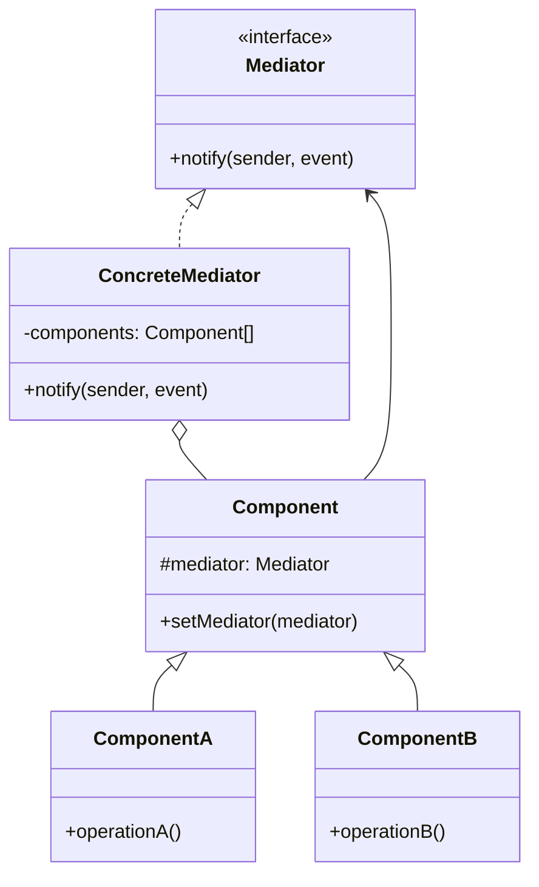
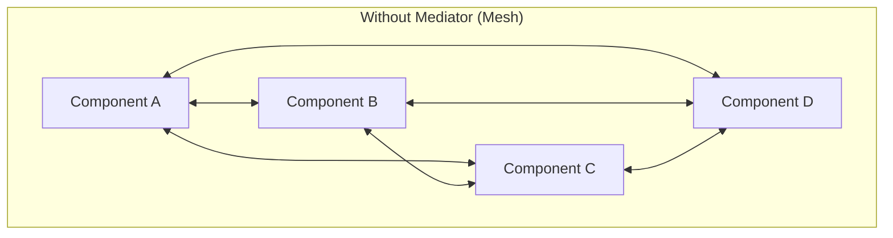
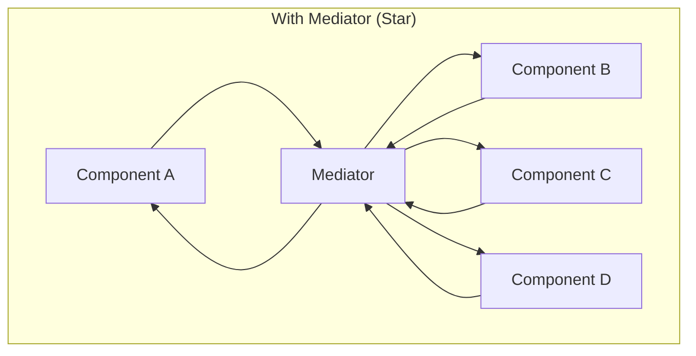

# Mediator Pattern

## Intent

**Mediator** is a behavioral design pattern that lets you reduce chaotic dependencies between objects. The pattern restricts direct communications between objects and forces them to collaborate only via a mediator object.



---

## Problem It Solves

When many objects need to communicate, you can end up with:



This creates tight coupling and makes changes difficult.

---

## Solution

Route all communications through a central mediator:



---

## Implementation

<Tabs items={["Chat Room", "UI Components", "Event Bus", "Real-World: Form Validation"]}>
  <Tab value="Chat Room">
```typescript
/**
 * Chat message
 */
interface ChatMessage {
  from: string;
  to?: string; // undefined = broadcast
  content: string;
  timestamp: Date;
}

/**
 * Chat mediator interface
 */
interface ChatMediator {
  /** Register a user */
  register: (user: ChatUser) => void;
  /** Send a message */
  send: (message: ChatMessage) => void;
  /** Get online users */
  getOnlineUsers: () => string[];
}

/**
 * Chat user interface
 */
interface ChatUser {
  name: string;
  /** Set the mediator */
  setMediator: (mediator: ChatMediator) => void;
  /** Send a message */
  send: (content: string, to?: string) => void;
  /** Receive a message */
  receive: (message: ChatMessage) => void;
}

/**
 * Create a chat user
 */
const createChatUser = (name: string): ChatUser => {
  let mediator: ChatMediator | null = null;

  return {
    name,
    
    setMediator(m) {
      mediator = m;
    },

    send(content, to) {
      if (!mediator) throw new Error("Not connected to chat room");
      
      mediator.send({
        from: name,
        to,
        content,
        timestamp: new Date(),
      });
    },

    receive(message) {
      const prefix = message.to ? "[Private]" : "[Public]";
      console.log(`${name} received ${prefix} from ${message.from}: ${message.content}`);
    },
  };
};

/**
 * Chat room mediator
 * @description Coordinates all communication between users
 */
const createChatRoom = (): ChatMediator => {
  const users = new Map<string, ChatUser>();
  const messageHistory: ChatMessage[] = [];

  return {
    register(user) {
      users.set(user.name, user);
      user.setMediator(this);
      
      // Notify others
      this.send({
        from: "System",
        content: `${user.name} has joined the chat`,
        timestamp: new Date(),
      });
    },

    send(message) {
      messageHistory.push(message);

      if (message.to) {
        // Private message
        const recipient = users.get(message.to);
        if (recipient) {
          recipient.receive(message);
        } else {
          console.log(`User ${message.to} not found`);
        }
      } else {
        // Broadcast to all except sender
        for (const [name, user] of users) {
          if (name !== message.from) {
            user.receive(message);
          }
        }
      }
    },

    getOnlineUsers() {
      return Array.from(users.keys());
    },
  };
};

// Usage
const chatRoom = createChatRoom();

const alice = createChatUser("Alice");
const bob = createChatUser("Bob");
const charlie = createChatUser("Charlie");

chatRoom.register(alice);
chatRoom.register(bob);
chatRoom.register(charlie);

console.log("\n--- Chat Demo ---\n");

// Broadcast message
alice.send("Hello everyone!");

// Private message
bob.send("Hey Alice, how are you?", "Alice");

// Another broadcast
charlie.send("Anyone up for coffee?");

console.log("\nOnline users:", chatRoom.getOnlineUsers());
//                             ^?
```
  </Tab>
  <Tab value="UI Components">
```typescript
/**
 * UI Component events
 */
type UIEvent = 
  | { type: "button_click"; buttonId: string }
  | { type: "input_change"; inputId: string; value: string }
  | { type: "dropdown_select"; dropdownId: string; value: string }
  | { type: "checkbox_toggle"; checkboxId: string; checked: boolean }
  | { type: "form_submit"; formData: Record<string, string> };

/**
 * UI Component interface
 */
interface UIComponent {
  id: string;
  setMediator: (mediator: UIMediator) => void;
  notify: (event: UIEvent) => void;
}

/**
 * UI Mediator interface
 */
interface UIMediator {
  register: (component: UIComponent) => void;
  notify: (sender: UIComponent, event: UIEvent) => void;
}

/**
 * Button component
 */
const createButton = (id: string, label: string): UIComponent & { click: () => void } => {
  let mediator: UIMediator | null = null;

  return {
    id,
    setMediator(m) { mediator = m; },
    notify(event) {
      if (event.type === "button_click" && event.buttonId === id) {
        console.log(`[Button ${id}] Clicked`);
      }
    },
    click() {
      if (mediator) {
        mediator.notify(this, { type: "button_click", buttonId: id });
      }
    },
  };
};

/**
 * Input component
 */
const createInput = (id: string): UIComponent & { 
  setValue: (value: string) => void;
  getValue: () => string;
  setEnabled: (enabled: boolean) => void;
} => {
  let mediator: UIMediator | null = null;
  let value = "";
  let enabled = true;

  return {
    id,
    setMediator(m) { mediator = m; },
    notify(event) {
      // Input can react to other events
    },
    setValue(v) {
      if (!enabled) return;
      value = v;
      console.log(`[Input ${id}] Value: "${v}"`);
      if (mediator) {
        mediator.notify(this, { type: "input_change", inputId: id, value: v });
      }
    },
    getValue: () => value,
    setEnabled(e) {
      enabled = e;
      console.log(`[Input ${id}] ${e ? "Enabled" : "Disabled"}`);
    },
  };
};

/**
 * Dropdown component
 */
const createDropdown = (id: string, options: string[]): UIComponent & {
  select: (value: string) => void;
  getValue: () => string;
} => {
  let mediator: UIMediator | null = null;
  let selected = "";

  return {
    id,
    setMediator(m) { mediator = m; },
    notify(event) {},
    select(value) {
      if (options.includes(value)) {
        selected = value;
        console.log(`[Dropdown ${id}] Selected: "${value}"`);
        if (mediator) {
          mediator.notify(this, { type: "dropdown_select", dropdownId: id, value });
        }
      }
    },
    getValue: () => selected,
  };
};

/**
 * Checkbox component
 */
const createCheckbox = (id: string): UIComponent & {
  toggle: () => void;
  isChecked: () => boolean;
} => {
  let mediator: UIMediator | null = null;
  let checked = false;

  return {
    id,
    setMediator(m) { mediator = m; },
    notify(event) {},
    toggle() {
      checked = !checked;
      console.log(`[Checkbox ${id}] ${checked ? "Checked" : "Unchecked"}`);
      if (mediator) {
        mediator.notify(this, { type: "checkbox_toggle", checkboxId: id, checked });
      }
    },
    isChecked: () => checked,
  };
};

/**
 * Form mediator - coordinates form components
 */
const createFormMediator = (): UIMediator & {
  getComponents: () => Map<string, UIComponent>;
} => {
  const components = new Map<string, UIComponent>();

  const mediator: UIMediator = {
    register(component) {
      components.set(component.id, component);
      component.setMediator(this);
    },

    notify(sender, event) {
      // Coordinate component interactions
      switch (event.type) {
        case "dropdown_select":
          // When country changes, update phone input placeholder
          if (event.dropdownId === "country") {
            const phoneInput = components.get("phone") as ReturnType<typeof createInput>;
            if (phoneInput) {
              const prefixes: Record<string, string> = {
                "US": "+1",
                "UK": "+44",
                "DE": "+49",
              };
              console.log(`  → Setting phone prefix for ${event.value}`);
            }
          }
          break;

        case "checkbox_toggle":
          // Toggle inputs based on checkbox
          if (event.checkboxId === "useShipping") {
            const shippingInput = components.get("shippingAddress") as ReturnType<typeof createInput>;
            if (shippingInput) {
              shippingInput.setEnabled(event.checked);
            }
          }
          break;

        case "button_click":
          // Submit form
          if (event.buttonId === "submit") {
            const formData: Record<string, string> = {};
            for (const [id, component] of components) {
              if ("getValue" in component) {
                formData[id] = (component as { getValue: () => string }).getValue();
              }
            }
            console.log("  → Form submitted:", formData);
          }
          break;
      }
    },
  };

  return {
    ...mediator,
    getComponents: () => components,
  };
};

// Usage
const formMediator = createFormMediator();

const countryDropdown = createDropdown("country", ["US", "UK", "DE"]);
const phoneInput = createInput("phone");
const useShipping = createCheckbox("useShipping");
const shippingAddress = createInput("shippingAddress");
const submitButton = createButton("submit", "Submit");

// Register all components
formMediator.register(countryDropdown);
formMediator.register(phoneInput);
formMediator.register(useShipping);
formMediator.register(shippingAddress);
formMediator.register(submitButton);

console.log("\n--- Form Interaction Demo ---\n");

// Simulate user interactions
countryDropdown.select("UK");
phoneInput.setValue("7700900000");
useShipping.toggle(); // Enable shipping
shippingAddress.setValue("123 Main St");
submitButton.click();
```
  </Tab>
  <Tab value="Event Bus">
```typescript
/**
 * Event payload
 */
type EventPayload = Record<string, unknown>;

/**
 * Event handler type
 */
type EventHandler<T = EventPayload> = (payload: T) => void | Promise<void>;

/**
 * Subscription handle
 */
interface Subscription {
  unsubscribe: () => void;
}

/**
 * Event bus (pub/sub mediator)
 * @description Decouples publishers from subscribers
 */
interface EventBus {
  /** Subscribe to an event */
  on: <T extends EventPayload>(event: string, handler: EventHandler<T>) => Subscription;
  /** Subscribe once */
  once: <T extends EventPayload>(event: string, handler: EventHandler<T>) => Subscription;
  /** Emit an event */
  emit: <T extends EventPayload>(event: string, payload: T) => Promise<void>;
  /** Remove all handlers for an event */
  off: (event: string) => void;
  /** Get subscriber count for an event */
  listenerCount: (event: string) => number;
}

const createEventBus = (): EventBus => {
  const handlers = new Map<string, Set<EventHandler>>();
  const onceHandlers = new WeakSet<EventHandler>();

  return {
    on(event, handler) {
      if (!handlers.has(event)) {
        handlers.set(event, new Set());
      }
      handlers.get(event)!.add(handler as EventHandler);
      
      return {
        unsubscribe() {
          handlers.get(event)?.delete(handler as EventHandler);
        },
      };
    },

    once(event, handler) {
      const wrappedHandler: EventHandler = async (payload) => {
        await handler(payload as never);
        handlers.get(event)?.delete(wrappedHandler);
      };
      
      return this.on(event, wrappedHandler);
    },

    async emit(event, payload) {
      const eventHandlers = handlers.get(event);
      if (!eventHandlers) return;

      const promises = Array.from(eventHandlers).map(handler =>
        Promise.resolve(handler(payload))
      );
      
      await Promise.all(promises);
    },

    off(event) {
      handlers.delete(event);
    },

    listenerCount(event) {
      return handlers.get(event)?.size ?? 0;
    },
  };
};

/**
 * Typed event bus for specific event types
 */
interface AppEvents {
  "user:login": { userId: string; email: string };
  "user:logout": { userId: string };
  "order:created": { orderId: string; amount: number; items: string[] };
  "order:shipped": { orderId: string; trackingNumber: string };
  "notification:send": { type: "email" | "push"; message: string; recipient: string };
  [key: string]: EventPayload; // Index signature for Record compatibility
}

type TypedEventBus<Events extends Record<string, EventPayload>> = {
  on: <K extends keyof Events>(event: K, handler: EventHandler<Events[K]>) => Subscription;
  emit: <K extends keyof Events>(event: K, payload: Events[K]) => Promise<void>;
};

const createTypedEventBus = <Events extends Record<string, EventPayload>>(): TypedEventBus<Events> => {
  const bus = createEventBus();
  return {
    on: (event, handler) => bus.on(event as string, handler),
    emit: (event, payload) => bus.emit(event as string, payload),
  };
};

// Usage
const appBus = createTypedEventBus<AppEvents>();

// Service: Analytics
appBus.on("user:login", ({ userId, email }) => {
  console.log(`[Analytics] User logged in: ${userId} (${email})`);
});

appBus.on("order:created", ({ orderId, amount }) => {
  console.log(`[Analytics] Order created: ${orderId} - $${amount}`);
});

// Service: Notifications
appBus.on("user:login", ({ email }) => {
  console.log(`[Notifications] Sending welcome email to ${email}`);
});

appBus.on("order:shipped", ({ orderId, trackingNumber }) => {
  console.log(`[Notifications] Sending shipping notification for ${orderId}`);
});

// Service: Inventory
appBus.on("order:created", ({ items }) => {
  console.log(`[Inventory] Reserving items: ${items.join(", ")}`);
});

console.log("\n--- Event Bus Demo ---\n");

// Simulate application events
await appBus.emit("user:login", { userId: "user-123", email: "alice@example.com" });
await appBus.emit("order:created", { orderId: "order-456", amount: 99.99, items: ["widget", "gadget"] });
await appBus.emit("order:shipped", { orderId: "order-456", trackingNumber: "TRACK123" });
```
  </Tab>
  <Tab value="Real-World: Form Validation">
```ts
/**
 * Field validation result
 */
interface ValidationResult {
  valid: boolean;
  errors: string[];
}

/**
 * Form field interface
 */
interface FormField {
  name: string;
  value: string;
  touched: boolean;
  errors: string[];
  setMediator: (mediator: FormMediator) => void;
  setValue: (value: string) => void;
  validate: () => ValidationResult;
  reset: () => void;
}

/**
 * Form mediator interface
 */
interface FormMediator {
  registerField: (field: FormField) => void;
  onFieldChange: (field: FormField) => void;
  validateAll: () => boolean;
  getFormData: () => Record<string, string>;
  isValid: () => boolean;
  reset: () => void;
}

/**
 * Validator function type
 */
type Validator = (value: string, formData: Record<string, string>) => string | null;

/**
 * Common validators
 */
const validators = {
  required: (message = "This field is required"): Validator => 
    (value) => value.trim() ? null : message,
  
  email: (message = "Invalid email"): Validator =>
    (value) => /^[^\s@]+@[^\s@]+\.[^\s@]+$/.test(value) ? null : message,
  
  minLength: (min: number, message?: string): Validator =>
    (value) => value.length >= min ? null : message || `Minimum ${min} characters`,
  
  maxLength: (max: number, message?: string): Validator =>
    (value) => value.length <= max ? null : message || `Maximum ${max} characters`,
  
  pattern: (regex: RegExp, message = "Invalid format"): Validator =>
    (value) => regex.test(value) ? null : message,
  
  matches: (fieldName: string, message?: string): Validator =>
    (value, formData) => value === formData[fieldName] 
      ? null 
      : message || `Must match ${fieldName}`,
};

/**
 * Create a form field
 */
const createFormField = (name: string, fieldValidators: Validator[]): FormField => {
  let mediator: FormMediator | null = null;
  let value = "";
  let touched = false;
  let errors: string[] = [];

  const field: FormField = {
    name,
    get value() { return value; },
    get touched() { return touched; },
    get errors() { return errors; },

    setMediator(m) {
      mediator = m;
    },

    setValue(v) {
      value = v;
      touched = true;
      if (mediator) {
        mediator.onFieldChange(this);
      }
    },

    validate() {
      const formData = mediator?.getFormData() ?? {};
      errors = fieldValidators
        .map(v => v(value, formData))
        .filter((e): e is string => e !== null);
      
      return { valid: errors.length === 0, errors };
    },

    reset() {
      value = "";
      touched = false;
      errors = [];
    },
  };

  return field;
};

/**
 * Create a form mediator
 */
const createFormMediator = (
  onValidChange?: (isValid: boolean) => void
): FormMediator => {
  const fields = new Map<string, FormField>();
  let lastValidState = false;

  const checkValidity = () => {
    const isValid = Array.from(fields.values()).every(f => f.validate().valid);
    if (isValid !== lastValidState && onValidChange) {
      onValidChange(isValid);
    }
    lastValidState = isValid;
    return isValid;
  };

  return {
    registerField(field) {
      fields.set(field.name, field);
      field.setMediator(this);
    },

    onFieldChange(field) {
      // Validate the changed field
      const result = field.validate();
      console.log(`[Field: ${field.name}] Value: "${field.value}" | Valid: ${result.valid}`);
      
      if (!result.valid) {
        console.log(`  Errors: ${result.errors.join(", ")}`);
      }

      // Check for cross-field dependencies
      // If password changes, re-validate confirmPassword
      if (field.name === "password") {
        const confirmField = fields.get("confirmPassword");
        if (confirmField?.touched) {
          confirmField.validate();
        }
      }

      // Update overall form validity
      checkValidity();
    },

    validateAll() {
      console.log("\n--- Validating All Fields ---");
      let allValid = true;
      
      for (const [name, field] of fields) {
        const result = field.validate();
        console.log(`  ${name}: ${result.valid ? "✓" : "✗ " + result.errors.join(", ")}`);
        if (!result.valid) allValid = false;
      }
      
      console.log(`\nForm valid: ${allValid}\n`);
      return allValid;
    },

    getFormData() {
      const data: Record<string, string> = {};
      for (const [name, field] of fields) {
        data[name] = field.value;
      }
      return data;
    },

    isValid() {
      return Array.from(fields.values()).every(f => f.validate().valid);
    },

    reset() {
      for (const field of fields.values()) {
        field.reset();
      }
    },
  };
};

// Usage: Registration form
const form = createFormMediator((isValid) => {
  console.log(`[Form] Valid state changed: ${isValid}`);
});

// Create fields with validators
const emailField = createFormField("email", [
  validators.required(),
  validators.email(),
]);

const passwordField = createFormField("password", [
  validators.required(),
  validators.minLength(8),
  validators.pattern(/[A-Z]/, "Must contain uppercase"),
  validators.pattern(/[0-9]/, "Must contain a number"),
]);

const confirmPasswordField = createFormField("confirmPassword", [
  validators.required(),
  validators.matches("password", "Passwords must match"),
]);

const usernameField = createFormField("username", [
  validators.required(),
  validators.minLength(3),
  validators.maxLength(20),
  validators.pattern(/^[a-zA-Z0-9_]+$/, "Only letters, numbers, and underscores"),
]);

// Register fields
form.registerField(emailField);
form.registerField(passwordField);
form.registerField(confirmPasswordField);
form.registerField(usernameField);

console.log("\n--- Form Interaction Demo ---\n");

// Simulate user input
usernameField.setValue("john_doe");
emailField.setValue("john@example.com");
passwordField.setValue("Secure123");
confirmPasswordField.setValue("Secure123");

// Validate all
const isFormValid = form.validateAll();

if (isFormValid) {
  console.log("Form data:", form.getFormData());
}

// Try invalid input
console.log("\n--- Testing Invalid Input ---\n");
confirmPasswordField.setValue("WrongPassword");
form.validateAll();
```
  </Tab>
</Tabs>

---

## When to Use

<Accordions>
  <Accordion title="✅ Use Mediator when...">
    - **Many-to-many communication**: Objects need to communicate with each other
    
    - **Reduce coupling**: Components shouldn't know about each other
    
    - **Centralize control**: Complex logic in one place
    
    - **Reuse components**: Same component, different contexts
    
    - **Examples**: Chat rooms, UI dialogs, air traffic control
  </Accordion>
  
  <Accordion title="❌ Avoid Mediator when...">
    - **Simple relationships**: Direct references are clearer
    
    - **Mediator becomes too complex**: Consider splitting into multiple mediators
    
    - **One-to-many communication**: Observer pattern might be better
  </Accordion>
</Accordions>

---

## Mediator vs Observer

| Aspect | Mediator | Observer |
|--------|----------|----------|
| **Communication** | Bidirectional | Unidirectional |
| **Coupling** | Colleagues know mediator | Subject doesn't know observers |
| **Control** | Centralized | Distributed |
| **Use Case** | Complex interactions | Event notification |

---

## Summary

<Callout type="info">
  **Key Takeaway**: Mediator centralizes complex communications between objects, reducing dependencies and making the system easier to maintain. It's essential for UI dialogs, chat systems, and any scenario with complex object interactions.
</Callout>

### Pros
- ✅ Reduces coupling between components
- ✅ Single Responsibility: Communication logic in one place
- ✅ Open/Closed: New components without changing mediator
- ✅ Easier to reuse components

### Cons
- ❌ Mediator can become a god object
- ❌ Mediator might become complex itself
- ❌ Single point of failure
