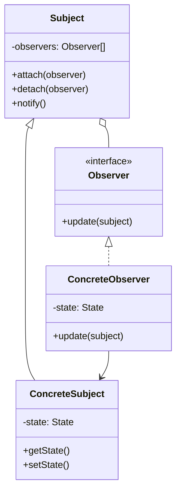
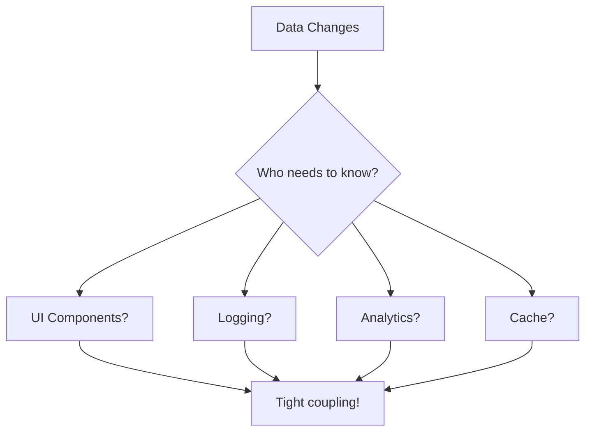
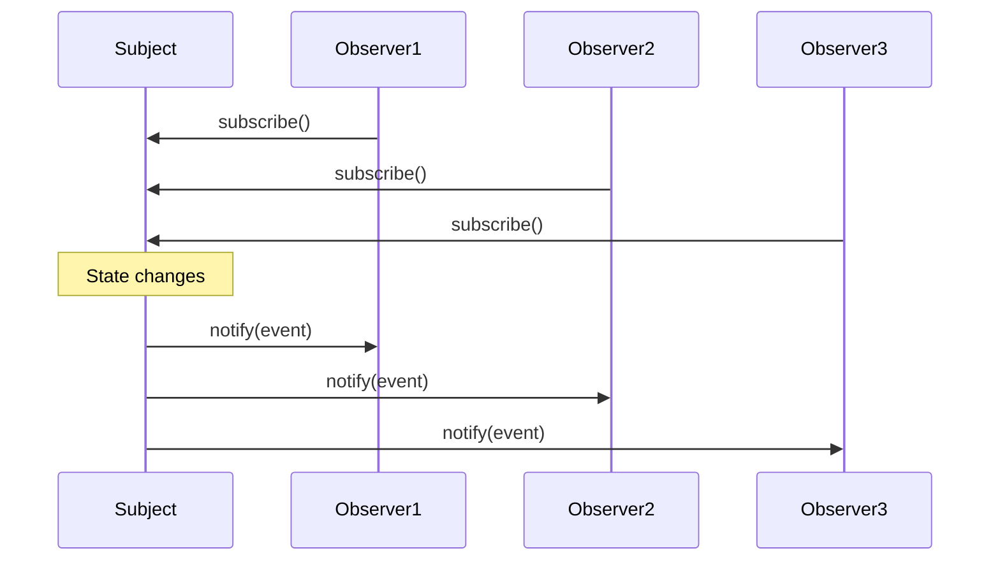

# Observer Pattern

## Intent

**Observer** is a behavioral design pattern that lets you define a subscription mechanism to notify multiple objects about any events that happen to the object they're observing. It establishes a one-to-many dependency between objects.



---

## Problem It Solves

When objects need to be notified about changes in other objects:



Without Observer, the subject must know all interested parties.

---

## Solution

Observers subscribe to subjects and receive notifications:



---

## Implementation

<Tabs items={["Event Emitter", "Reactive State", "DOM Events", "Real-World: Stock Ticker"]}>
  <Tab value="Event Emitter">
```typescript
/**
 * Event handler type
 */
type EventHandler<T = unknown> = (data: T) => void;

/**
 * Subscription handle
 */
interface Subscription {
  /** Unsubscribe from the event */
  unsubscribe: () => void;
}

/**
 * Type-safe event emitter interface
 */
interface TypedEmitter<Events extends Record<string, unknown>> {
  /** Subscribe to an event */
  on: <K extends keyof Events>(event: K, handler: EventHandler<Events[K]>) => Subscription;
  /** Subscribe once */
  once: <K extends keyof Events>(event: K, handler: EventHandler<Events[K]>) => Subscription;
  /** Emit an event */
  emit: <K extends keyof Events>(event: K, data: Events[K]) => void;
  /** Remove all handlers for an event */
  off: <K extends keyof Events>(event: K) => void;
  /** Get listener count */
  listenerCount: <K extends keyof Events>(event: K) => number;
}

/**
 * Create a type-safe event emitter
 * @description Observable subject that notifies subscribers
 */
const createEmitter = <Events extends Record<string, unknown>>(): TypedEmitter<Events> => {
  const handlers = new Map<keyof Events, Set<EventHandler>>();
  
  return {
    on(event, handler) {
      if (!handlers.has(event)) {
        handlers.set(event, new Set());
      }
      handlers.get(event)!.add(handler as EventHandler);
      
      return {
        unsubscribe: () => {
          handlers.get(event)?.delete(handler as EventHandler);
        },
      };
    },

    once(event, handler) {
      const wrapper: EventHandler<Events[typeof event]> = (data) => {
        handler(data);
        handlers.get(event)?.delete(wrapper as EventHandler);
      };
      
      return this.on(event, wrapper);
    },

    emit(event, data) {
      const eventHandlers = handlers.get(event);
      if (eventHandlers) {
        for (const handler of eventHandlers) {
          handler(data);
        }
      }
    },

    off(event) {
      handlers.delete(event);
    },

    listenerCount(event) {
      return handlers.get(event)?.size ?? 0;
    },
  };
};

// Define event types
interface UserEvents {
  "login": { userId: string; timestamp: Date };
  "logout": { userId: string };
  "profileUpdate": { userId: string; changes: string[] };
  [key: string]: unknown; // Index signature for Record compatibility
}

// Usage
const userEmitter = createEmitter<UserEvents>();

// Subscribe to events
const loginSub = userEmitter.on("login", ({ userId, timestamp }) => {
  console.log(`[Auth] User ${userId} logged in at ${timestamp.toISOString()}`);
});

userEmitter.on("login", ({ userId }) => {
  console.log(`[Analytics] Tracking login for ${userId}`);
});

userEmitter.once("login", () => {
  console.log("[Welcome] First login detected!");
});

userEmitter.on("logout", ({ userId }) => {
  console.log(`[Session] Cleaning up session for ${userId}`);
});

console.log("\n--- Event Emitter Demo ---\n");

// Emit events
userEmitter.emit("login", { userId: "user-123", timestamp: new Date() });
const loginCount = userEmitter.listenerCount("login");
//    ^?
console.log(`Login listeners: ${loginCount}`);

// Emit again (once handler won't fire)
console.log("\nSecond login:");
userEmitter.emit("login", { userId: "user-123", timestamp: new Date() });

// Unsubscribe
loginSub.unsubscribe();
console.log(`\nAfter unsubscribe, login listeners: ${userEmitter.listenerCount("login")}`);

// Logout
userEmitter.emit("logout", { userId: "user-123" });
```
  </Tab>
  <Tab value="Reactive State">
```typescript
/**
 * Reactive value that notifies on changes
 */
interface Observable<T> {
  /** Get current value */
  get: () => T;
  /** Set new value */
  set: (value: T) => void;
  /** Update based on previous value */
  update: (updater: (prev: T) => T) => void;
  /** Subscribe to changes */
  subscribe: (callback: (value: T, prev: T) => void) => () => void;
}

/**
 * Create an observable value
 * @description Reactive primitive that notifies subscribers on change
 */
const createObservable = <T>(initial: T): Observable<T> => {
  let value = initial;
  const subscribers = new Set<(value: T, prev: T) => void>();

  return {
    get: () => value,

    set(newValue) {
      if (newValue !== value) {
        const prev = value;
        value = newValue;
        for (const callback of subscribers) {
          callback(value, prev);
        }
      }
    },

    update(updater) {
      this.set(updater(value));
    },

    subscribe(callback) {
      subscribers.add(callback);
      return () => subscribers.delete(callback);
    },
  };
};

/**
 * Read-only subscribable (covariant in T)
 */
interface Subscribable<out T> {
  subscribe: (callback: (value: T, prev: T) => void) => () => void;
}

/**
 * Computed observable that derives from others
 */
interface Computed<T> {
  get: () => T;
  subscribe: (callback: (value: T) => void) => () => void;
}

const createComputed = <T>(
  compute: () => T,
  dependencies: Subscribable<unknown>[]
): Computed<T> => {
  let cachedValue = compute();
  const subscribers = new Set<(value: T) => void>();

  // Subscribe to dependencies
  for (const dep of dependencies) {
    dep.subscribe(() => {
      const newValue = compute();
      if (newValue !== cachedValue) {
        cachedValue = newValue;
        for (const callback of subscribers) {
          callback(cachedValue);
        }
      }
    });
  }

  return {
    get: () => cachedValue,
    subscribe(callback) {
      subscribers.add(callback);
      return () => subscribers.delete(callback);
    },
  };
};

/**
 * Effect that runs when dependencies change
 */
const createEffect = (
  effect: () => void | (() => void),
  dependencies: Subscribable<unknown>[]
): (() => void) => {
  let cleanup: (() => void) | void;
  
  const run = () => {
    if (cleanup) cleanup();
    cleanup = effect();
  };

  // Run initially
  run();

  // Subscribe to dependencies
  const unsubscribes = dependencies.map(dep => dep.subscribe(run));

  // Return cleanup function
  return () => {
    if (cleanup) cleanup();
    for (const unsub of unsubscribes) {
      unsub();
    }
  };
};

// Usage: Shopping Cart
interface CartItem {
  id: string;
  name: string;
  price: number;
  quantity: number;
}

console.log("\n--- Reactive State Demo ---\n");

// Observable state
const cartItems = createObservable<CartItem[]>([]);
const discount = createObservable<number>(0);

// Computed values
const subtotal = createComputed(
  () => cartItems.get().reduce((sum, item) => sum + item.price * item.quantity, 0),
  [cartItems]
);

const total = createComputed(
  () => {
    const sub = subtotal.get();
    const disc = discount.get();
    return sub * (1 - disc / 100);
  },
  [cartItems, discount] // Note: subtotal changes when cartItems changes
);

const itemCount = createComputed(
  () => cartItems.get().reduce((sum, item) => sum + item.quantity, 0),
  [cartItems]
);

// Effects
createEffect(() => {
  console.log(`Cart updated: ${itemCount.get()} items`);
}, [cartItems]);

createEffect(() => {
  const t = total.get();
  //    ^?
  console.log(`Total: $${t.toFixed(2)}`);
}, [cartItems, discount]);

// Add items
cartItems.update(items => [
  ...items,
  { id: "1", name: "Widget", price: 25, quantity: 2 },
]);

cartItems.update(items => [
  ...items,
  { id: "2", name: "Gadget", price: 50, quantity: 1 },
]);

// Apply discount
console.log("\nApplying 10% discount:");
discount.set(10);

// Update quantity
console.log("\nUpdating quantity:");
cartItems.update(items => 
  items.map(item => 
    item.id === "1" ? { ...item, quantity: 3 } : item
  )
);
```
  </Tab>
  <Tab value="DOM Events">
```typescript
/**
 * Custom event target with type safety
 */
interface CustomEventMap {
  "click": { x: number; y: number; target: string };
  "hover": { target: string; entered: boolean };
  "input": { target: string; value: string };
  "submit": { formId: string; data: Record<string, string> };
  [key: string]: object; // Index signature for Record compatibility
}

type EventCallback<T> = (event: T & { type: string; timestamp: Date }) => void;

/**
 * Event dispatcher (simulating DOM events)
 */
interface EventDispatcher<Events extends Record<string, object>> {
  addEventListener: <K extends keyof Events>(
    type: K,
    callback: EventCallback<Events[K]>,
    options?: { once?: boolean; capture?: boolean }
  ) => void;
  
  removeEventListener: <K extends keyof Events>(
    type: K,
    callback: EventCallback<Events[K]>
  ) => void;
  
  dispatchEvent: <K extends keyof Events>(
    type: K,
    data: Events[K]
  ) => void;
}

const createEventDispatcher = <Events extends Record<string, object>>(): EventDispatcher<Events> => {
  const listeners = new Map<keyof Events, Set<{ callback: EventCallback<unknown>; once: boolean }>>();
  const captureListeners = new Map<keyof Events, Set<{ callback: EventCallback<unknown>; once: boolean }>>();

  return {
    addEventListener(type, callback, options = {}) {
      const target = options.capture ? captureListeners : listeners;
      
      if (!target.has(type)) {
        target.set(type, new Set());
      }
      
      target.get(type)!.add({
        callback: callback as EventCallback<unknown>,
        once: options.once ?? false,
      });
    },

    removeEventListener(type, callback) {
      for (const target of [listeners, captureListeners]) {
        const typeListeners = target.get(type);
        if (typeListeners) {
          for (const listener of typeListeners) {
            if (listener.callback === callback) {
              typeListeners.delete(listener);
              break;
            }
          }
        }
      }
    },

    dispatchEvent(type, data) {
      const event = {
        ...data,
        type: type as string,
        timestamp: new Date(),
      };

      // Capture phase
      const captureSet = captureListeners.get(type);
      if (captureSet) {
        for (const listener of captureSet) {
          listener.callback(event);
          if (listener.once) captureSet.delete(listener);
        }
      }

      // Bubble phase
      const bubbleSet = listeners.get(type);
      if (bubbleSet) {
        for (const listener of bubbleSet) {
          listener.callback(event);
          if (listener.once) bubbleSet.delete(listener);
        }
      }
    },
  };
};

// Usage
const dispatcher = createEventDispatcher<CustomEventMap>();

console.log("\n--- DOM-like Events Demo ---\n");

// Add listeners
dispatcher.addEventListener("click", (event) => {
  console.log(`Click at (${event.x}, ${event.y}) on ${event.target}`);
});

dispatcher.addEventListener("click", (event) => {
  console.log(`[Analytics] Click tracked on ${event.target}`);
});

dispatcher.addEventListener("hover", (event) => {
  const action = event.entered ? "entered" : "left";
  console.log(`Mouse ${action} ${event.target}`);
});

dispatcher.addEventListener("input", (event) => {
  console.log(`Input on ${event.target}: "${event.value}"`);
});

dispatcher.addEventListener("submit", (event) => {
  console.log(`Form ${event.formId} submitted:`, event.data);
}, { once: true });

// Dispatch events
dispatcher.dispatchEvent("click", { x: 100, y: 200, target: "button#submit" });
dispatcher.dispatchEvent("hover", { target: "nav.menu", entered: true });
dispatcher.dispatchEvent("input", { target: "input#email", value: "user@example.com" });
dispatcher.dispatchEvent("submit", { 
  formId: "login-form", 
  data: { email: "user@example.com", password: "****" } 
});

// This won't trigger the submit handler (it was once)
console.log("\nSecond submit (once handler removed):");
dispatcher.dispatchEvent("submit", { 
  formId: "login-form", 
  data: { email: "other@example.com", password: "****" } 
});
```
  </Tab>
  <Tab value="Real-World: Stock Ticker">
```ts
/**
 * Stock quote data
 */
interface StockQuote {
  symbol: string;
  price: number;
  change: number;
  changePercent: number;
  volume: number;
  timestamp: Date;
}

/**
 * Stock update event
 */
interface StockUpdate {
  type: "price" | "volume" | "trade";
  quote: StockQuote;
  previousPrice?: number;
}

/**
 * Stock observer interface
 */
interface StockObserver {
  onUpdate: (update: StockUpdate) => void;
}

/**
 * Stock ticker (Subject)
 */
interface StockTicker {
  // Stock management
  addStock: (symbol: string, initialPrice: number) => void;
  removeStock: (symbol: string) => void;
  updatePrice: (symbol: string, price: number) => void;
  
  // Observer management
  subscribe: (symbol: string, observer: StockObserver) => () => void;
  subscribeAll: (observer: StockObserver) => () => void;
  
  // Data access
  getQuote: (symbol: string) => StockQuote | undefined;
  getAllQuotes: () => StockQuote[];
}

const createStockTicker = (): StockTicker => {
  const stocks = new Map<string, StockQuote>();
  const symbolObservers = new Map<string, Set<StockObserver>>();
  const globalObservers = new Set<StockObserver>();

  const notifyObservers = (symbol: string, update: StockUpdate) => {
    // Notify symbol-specific observers
    const observers = symbolObservers.get(symbol);
    if (observers) {
      for (const observer of observers) {
        observer.onUpdate(update);
      }
    }

    // Notify global observers
    for (const observer of globalObservers) {
      observer.onUpdate(update);
    }
  };

  return {
    addStock(symbol, initialPrice) {
      const quote: StockQuote = {
        symbol,
        price: initialPrice,
        change: 0,
        changePercent: 0,
        volume: 0,
        timestamp: new Date(),
      };
      stocks.set(symbol, quote);
      console.log(`Added stock: ${symbol} @ $${initialPrice}`);
    },

    removeStock(symbol) {
      stocks.delete(symbol);
      symbolObservers.delete(symbol);
    },

    updatePrice(symbol, newPrice) {
      const quote = stocks.get(symbol);
      if (!quote) return;

      const previousPrice = quote.price;
      const change = newPrice - previousPrice;
      const changePercent = (change / previousPrice) * 100;

      const updatedQuote: StockQuote = {
        ...quote,
        price: newPrice,
        change,
        changePercent,
        volume: quote.volume + Math.floor(Math.random() * 1000),
        timestamp: new Date(),
      };

      stocks.set(symbol, updatedQuote);

      notifyObservers(symbol, {
        type: "price",
        quote: updatedQuote,
        previousPrice,
      });
    },

    subscribe(symbol, observer) {
      if (!symbolObservers.has(symbol)) {
        symbolObservers.set(symbol, new Set());
      }
      symbolObservers.get(symbol)!.add(observer);

      return () => {
        symbolObservers.get(symbol)?.delete(observer);
      };
    },

    subscribeAll(observer) {
      globalObservers.add(observer);
      return () => globalObservers.delete(observer);
    },

    getQuote(symbol) {
      return stocks.get(symbol);
    },

    getAllQuotes() {
      return Array.from(stocks.values());
    },
  };
};

/**
 * Price alert observer
 */
const createPriceAlert = (
  symbol: string,
  targetPrice: number,
  direction: "above" | "below",
  callback: (quote: StockQuote) => void
): StockObserver => ({
  onUpdate({ quote }) {
    if (quote.symbol !== symbol) return;

    const triggered = direction === "above"
      ? quote.price >= targetPrice
      : quote.price <= targetPrice;

    if (triggered) {
      callback(quote);
    }
  },
});

/**
 * Portfolio tracker observer
 */
const createPortfolioTracker = (
  holdings: Map<string, number> // symbol -> quantity
): StockObserver & { getPortfolioValue: () => number } => {
  let portfolioValue = 0;
  const prices = new Map<string, number>();

  const updateValue = () => {
    portfolioValue = 0;
    for (const [symbol, quantity] of holdings) {
      const price = prices.get(symbol) ?? 0;
      portfolioValue += price * quantity;
    }
  };

  return {
    onUpdate({ quote }) {
      if (holdings.has(quote.symbol)) {
        prices.set(quote.symbol, quote.price);
        updateValue();
        console.log(`[Portfolio] ${quote.symbol}: ${holdings.get(quote.symbol)} shares @ $${quote.price.toFixed(2)}`);
        console.log(`[Portfolio] Total value: $${portfolioValue.toFixed(2)}`);
      }
    },
    getPortfolioValue: () => portfolioValue,
  };
};

/**
 * Price logger observer
 */
const createPriceLogger = (): StockObserver => ({
  onUpdate({ quote, previousPrice }) {
    const arrow = quote.change >= 0 ? "↑" : "↓";
    const color = quote.change >= 0 ? "green" : "red";
    console.log(
      `[${quote.timestamp.toLocaleTimeString()}] ${quote.symbol}: ` +
      `$${quote.price.toFixed(2)} ${arrow} ` +
      `(${quote.changePercent >= 0 ? "+" : ""}${quote.changePercent.toFixed(2)}%)`
    );
  },
});

// Usage
const ticker = createStockTicker();

console.log("\n--- Stock Ticker Demo ---\n");

// Add stocks
ticker.addStock("AAPL", 150.00);
ticker.addStock("GOOGL", 2800.00);
ticker.addStock("MSFT", 300.00);

// Create observers
const priceLogger = createPriceLogger();
const portfolio = createPortfolioTracker(new Map([
  ["AAPL", 10],
  ["GOOGL", 2],
  ["MSFT", 5],
]));

// Subscribe
ticker.subscribeAll(priceLogger);
ticker.subscribeAll(portfolio);

// Price alerts
const appleAlert = createPriceAlert("AAPL", 155, "above", (quote) => {
  console.log(`🚨 ALERT: ${quote.symbol} is above $155!`);
});
ticker.subscribe("AAPL", appleAlert);

console.log("\n--- Price Updates ---\n");

// Simulate price updates
ticker.updatePrice("AAPL", 152.50);
ticker.updatePrice("GOOGL", 2825.00);
ticker.updatePrice("AAPL", 156.00); // Triggers alert
ticker.updatePrice("MSFT", 305.50);

console.log("\n--- Final Portfolio Value ---");
console.log(`Total: $${portfolio.getPortfolioValue().toFixed(2)}`);
```
  </Tab>
</Tabs>

---

## When to Use

<Accordions>
  <Accordion title="✅ Use Observer when...">
    - **One-to-many dependencies**: Multiple objects depend on one object's state
    
    - **Loose coupling needed**: Subjects shouldn't know about observers
    
    - **Dynamic subscriptions**: Observers added/removed at runtime
    
    - **Event systems**: UI events, notification systems
    
    - **Real-time updates**: Stock tickers, chat, live feeds
  </Accordion>
  
  <Accordion title="❌ Avoid Observer when...">
    - **Simple relationships**: Direct references are clearer
    
    - **Order matters**: Observer order is typically undefined
    
    - **Performance critical**: Notification overhead too high
    
    - **Memory concerns**: Forgotten subscriptions cause leaks
  </Accordion>
</Accordions>

---

## Push vs Pull

| Aspect | Push (Active) | Pull (Passive) |
|--------|--------------|----------------|
| **Data Flow** | Subject sends data | Observer requests data |
| **Coupling** | Observer knows data format | Subject exposes accessors |
| **Efficiency** | Send only what's needed | Observer gets what it needs |
| **Use Case** | Known data requirements | Varying data requirements |

---

## Memory Management

<Callout type="warn">
  **Common pitfall**: Forgetting to unsubscribe causes memory leaks!
  
  Always:
  - Store unsubscribe functions
  - Clean up in component unmount/destroy
  - Use weak references where appropriate
  - Consider automatic cleanup patterns
</Callout>

---

## Summary

<Callout type="info">
  **Key Takeaway**: Observer defines a one-to-many dependency between objects, enabling automatic notification of state changes. It's the foundation of reactive programming and event systems.
</Callout>

### Pros
- ✅ Loose coupling between subject and observers
- ✅ Open/Closed: Add observers without modifying subject
- ✅ Establishes relationships at runtime
- ✅ Enables broadcast communication

### Cons
- ❌ Observers notified in undefined order
- ❌ Memory leaks if not unsubscribed
- ❌ Unexpected updates (cascading changes)
- ❌ Can be complex to debug
