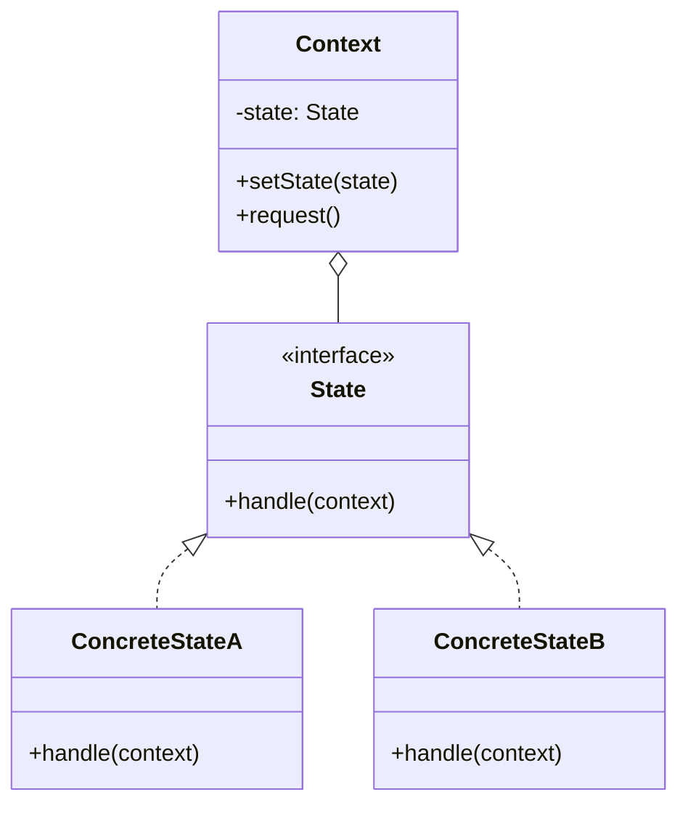
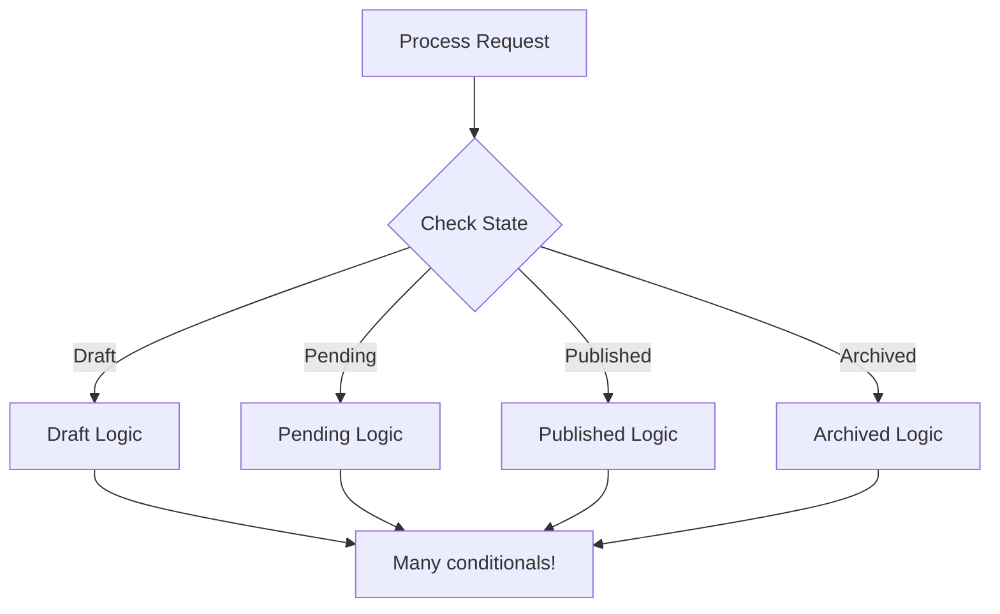
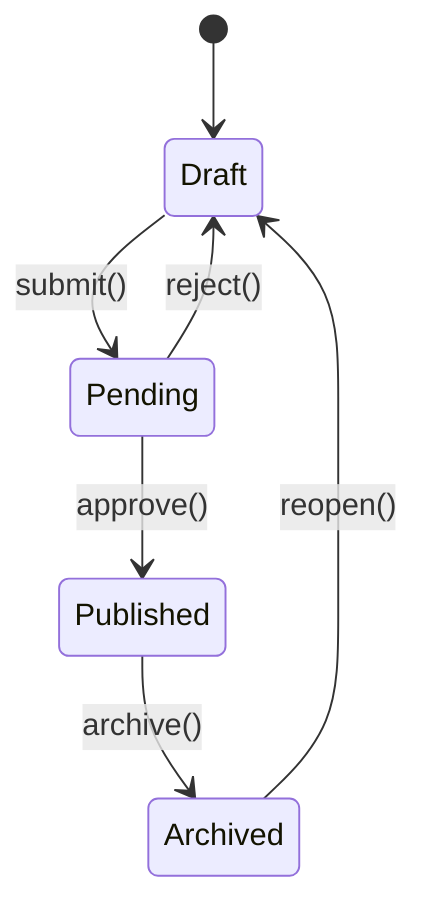

# State Pattern

## Intent

**State** is a behavioral design pattern that lets an object alter its behavior when its internal state changes. It appears as if the object changed its class. The pattern extracts state-related behaviors into separate state classes.



---

## Problem It Solves

Objects with state-dependent behavior often use conditionals:



Adding new states requires modifying existing code everywhere.

---

## Solution

Encapsulate each state in its own object:



Each state handles its own transitions and behavior.

---

## Implementation

<Tabs items={["Vending Machine", "Document Workflow", "Connection State", "Real-World: Order Processing"]}>
  <Tab value="Vending Machine">
```typescript
/**
 * Vending machine context interface
 */
interface VendingMachine {
  insertCoin: (amount: number) => void;
  selectProduct: (productId: string) => void;
  dispense: () => void;
  refund: () => void;
  getBalance: () => number;
  getState: () => string;
}

/**
 * Vending machine state interface
 */
interface VendingState {
  name: string;
  insertCoin: (context: VendingMachineContext, amount: number) => void;
  selectProduct: (context: VendingMachineContext, productId: string) => void;
  dispense: (context: VendingMachineContext) => void;
  refund: (context: VendingMachineContext) => void;
}

/**
 * Internal context for state management
 */
interface VendingMachineContext {
  balance: number;
  selectedProduct: string | null;
  products: Map<string, { name: string; price: number; stock: number }>;
  setState: (state: VendingState) => void;
  getState: () => VendingState;
}

/**
 * Idle state - waiting for coins
 */
const idleState: VendingState = {
  name: "Idle",
  
  insertCoin(context, amount) {
    context.balance += amount;
    console.log(`Inserted $${amount.toFixed(2)}. Balance: $${context.balance.toFixed(2)}`);
    context.setState(hasMoneyState);
  },
  
  selectProduct(context, productId) {
    console.log("Please insert coins first");
  },
  
  dispense(context) {
    console.log("Please select a product first");
  },
  
  refund(context) {
    console.log("No money to refund");
  },
};

/**
 * Has money state - coins inserted
 */
const hasMoneyState: VendingState = {
  name: "HasMoney",
  
  insertCoin(context, amount) {
    context.balance += amount;
    console.log(`Inserted $${amount.toFixed(2)}. Balance: $${context.balance.toFixed(2)}`);
  },
  
  selectProduct(context, productId) {
    const product = context.products.get(productId);
    
    if (!product) {
      console.log("Product not found");
      return;
    }
    
    if (product.stock === 0) {
      console.log(`${product.name} is out of stock`);
      return;
    }
    
    if (context.balance < product.price) {
      console.log(`Insufficient funds. Need $${(product.price - context.balance).toFixed(2)} more`);
      return;
    }
    
    context.selectedProduct = productId;
    console.log(`Selected: ${product.name}`);
    context.setState(dispensingState);
  },
  
  dispense(context) {
    console.log("Please select a product first");
  },
  
  refund(context) {
    console.log(`Refunding $${context.balance.toFixed(2)}`);
    context.balance = 0;
    context.setState(idleState);
  },
};

/**
 * Dispensing state - product selected
 */
const dispensingState: VendingState = {
  name: "Dispensing",
  
  insertCoin(context, amount) {
    console.log("Please wait, dispensing product...");
  },
  
  selectProduct(context, productId) {
    console.log("Please wait, dispensing product...");
  },
  
  dispense(context) {
    const product = context.products.get(context.selectedProduct!);
    if (!product) return;
    
    product.stock -= 1;
    context.balance -= product.price;
    
    console.log(`Dispensing: ${product.name}`);
    
    if (context.balance > 0) {
      console.log(`Change: $${context.balance.toFixed(2)}`);
      context.balance = 0;
    }
    
    context.selectedProduct = null;
    context.setState(idleState);
  },
  
  refund(context) {
    console.log("Cannot refund while dispensing");
  },
};

/**
 * Create a vending machine
 */
const createVendingMachine = (): VendingMachine => {
  const context: VendingMachineContext = {
    balance: 0,
    selectedProduct: null,
    products: new Map([
      ["A1", { name: "Cola", price: 1.50, stock: 5 }],
      ["A2", { name: "Chips", price: 1.25, stock: 3 }],
      ["B1", { name: "Candy", price: 0.75, stock: 10 }],
    ]),
    setState(state) {
      currentState = state;
      console.log(`[State → ${state.name}]`);
    },
    getState() {
      return currentState;
    },
  };

  let currentState: VendingState = idleState;

  return {
    insertCoin: (amount) => currentState.insertCoin(context, amount),
    selectProduct: (id) => currentState.selectProduct(context, id),
    dispense: () => currentState.dispense(context),
    refund: () => currentState.refund(context),
    getBalance: () => context.balance,
    getState: () => currentState.name,
  };
};

// Usage
const machine = createVendingMachine();

console.log("\n--- Vending Machine Demo ---\n");

// Try without money
machine.selectProduct("A1");

// Insert coins
machine.insertCoin(1.00);
machine.insertCoin(0.25);
machine.insertCoin(0.25);

// Select product
machine.selectProduct("A1");

// Dispense
machine.dispense();

const finalState = machine.getState();
//    ^?
console.log(`\nFinal state: ${finalState}`);
console.log(`Balance: $${machine.getBalance().toFixed(2)}`);
```
  </Tab>
  <Tab value="Document Workflow">
```typescript
/**
 * Document data
 */
interface DocumentData {
  id: string;
  title: string;
  content: string;
  author: string;
  createdAt: Date;
  updatedAt: Date;
  publishedAt?: Date;
}

/**
 * Document context for state management
 */
interface DocumentContext {
  data: DocumentData;
  setState: (state: DocumentState) => void;
  getState: () => DocumentState;
}

/**
 * Document state interface
 */
interface DocumentState {
  name: string;
  edit: (context: DocumentContext, content: string) => void;
  submit: (context: DocumentContext) => void;
  approve: (context: DocumentContext) => void;
  reject: (context: DocumentContext, reason: string) => void;
  publish: (context: DocumentContext) => void;
  archive: (context: DocumentContext) => void;
}

/**
 * Draft state - document being written
 */
const draftState: DocumentState = {
  name: "Draft",
  
  edit(context, content) {
    context.data.content = content;
    context.data.updatedAt = new Date();
    console.log(`Document edited: "${content.substring(0, 30)}..."`);
  },
  
  submit(context) {
    if (!context.data.content.trim()) {
      console.log("Cannot submit empty document");
      return;
    }
    console.log("Document submitted for review");
    context.setState(pendingReviewState);
  },
  
  approve(context) {
    console.log("Cannot approve: Document not submitted");
  },
  
  reject(context, reason) {
    console.log("Cannot reject: Document not submitted");
  },
  
  publish(context) {
    console.log("Cannot publish: Document must be approved first");
  },
  
  archive(context) {
    console.log("Document archived (discarded)");
    context.setState(archivedState);
  },
};

/**
 * Pending review state
 */
const pendingReviewState: DocumentState = {
  name: "Pending Review",
  
  edit(context, content) {
    console.log("Cannot edit: Document is pending review");
  },
  
  submit(context) {
    console.log("Document already submitted");
  },
  
  approve(context) {
    console.log("Document approved!");
    context.setState(approvedState);
  },
  
  reject(context, reason) {
    console.log(`Document rejected: ${reason}`);
    context.setState(draftState);
  },
  
  publish(context) {
    console.log("Cannot publish: Document must be approved first");
  },
  
  archive(context) {
    console.log("Cannot archive: Document is pending review");
  },
};

/**
 * Approved state
 */
const approvedState: DocumentState = {
  name: "Approved",
  
  edit(context, content) {
    console.log("Warning: Editing approved document returns it to draft");
    context.data.content = content;
    context.data.updatedAt = new Date();
    context.setState(draftState);
  },
  
  submit(context) {
    console.log("Document already approved");
  },
  
  approve(context) {
    console.log("Document already approved");
  },
  
  reject(context, reason) {
    console.log(`Document approval revoked: ${reason}`);
    context.setState(draftState);
  },
  
  publish(context) {
    context.data.publishedAt = new Date();
    console.log("Document published!");
    context.setState(publishedState);
  },
  
  archive(context) {
    console.log("Document archived");
    context.setState(archivedState);
  },
};

/**
 * Published state
 */
const publishedState: DocumentState = {
  name: "Published",
  
  edit(context, content) {
    console.log("Cannot edit published document. Create a new version.");
  },
  
  submit(context) {
    console.log("Document already published");
  },
  
  approve(context) {
    console.log("Document already published");
  },
  
  reject(context, reason) {
    console.log("Cannot reject: Document is published");
  },
  
  publish(context) {
    console.log("Document already published");
  },
  
  archive(context) {
    console.log("Document unpublished and archived");
    context.setState(archivedState);
  },
};

/**
 * Archived state
 */
const archivedState: DocumentState = {
  name: "Archived",
  
  edit(context, content) {
    console.log("Cannot edit archived document");
  },
  
  submit(context) {
    console.log("Cannot submit: Document is archived");
  },
  
  approve(context) {
    console.log("Cannot approve: Document is archived");
  },
  
  reject(context, reason) {
    console.log("Cannot reject: Document is archived");
  },
  
  publish(context) {
    console.log("Cannot publish: Document is archived");
  },
  
  archive(context) {
    console.log("Document already archived");
  },
};

/**
 * Document interface
 */
interface Document {
  edit: (content: string) => void;
  submit: () => void;
  approve: () => void;
  reject: (reason: string) => void;
  publish: () => void;
  archive: () => void;
  getState: () => string;
  getData: () => DocumentData;
}

/**
 * Create a document with state management
 */
const createDocument = (title: string, author: string): Document => {
  let currentState: DocumentState = draftState;
  
  const context: DocumentContext = {
    data: {
      id: `doc_${Date.now()}`,
      title,
      content: "",
      author,
      createdAt: new Date(),
      updatedAt: new Date(),
    },
    setState(state) {
      currentState = state;
      console.log(`[Document state → ${state.name}]`);
    },
    getState: () => currentState,
  };

  return {
    edit: (content) => currentState.edit(context, content),
    submit: () => currentState.submit(context),
    approve: () => currentState.approve(context),
    reject: (reason) => currentState.reject(context, reason),
    publish: () => currentState.publish(context),
    archive: () => currentState.archive(context),
    getState: () => currentState.name,
    getData: () => ({ ...context.data }),
  };
};

// Usage
const doc = createDocument("Design Patterns Guide", "John Doe");

console.log("\n--- Document Workflow Demo ---\n");

// Write content
doc.edit("This is the initial content of our design patterns guide...");

// Try to publish without approval
doc.publish();

// Submit for review
doc.submit();

// Try to edit while pending
doc.edit("Trying to make changes...");

// Reject
doc.reject("Needs more examples");

// Edit and resubmit
doc.edit("Updated content with more examples and explanations...");
doc.submit();

// Approve and publish
doc.approve();
doc.publish();

console.log(`\nFinal state: ${doc.getState()}`);
console.log(`Published at: ${doc.getData().publishedAt}`);
```
  </Tab>
  <Tab value="Connection State">
```typescript
/**
 * Connection events
 */
type ConnectionEvent = 
  | { type: "connect" }
  | { type: "disconnect" }
  | { type: "error"; error: Error }
  | { type: "data"; payload: unknown };

/**
 * Connection context
 */
interface ConnectionContext {
  url: string;
  retryCount: number;
  maxRetries: number;
  data: unknown[];
  setState: (state: ConnectionState) => void;
  emit: (event: string, data?: unknown) => void;
}

/**
 * Connection state interface
 */
interface ConnectionState {
  name: string;
  connect: (context: ConnectionContext) => Promise<void>;
  disconnect: (context: ConnectionContext) => void;
  send: (context: ConnectionContext, data: unknown) => void;
  handleError: (context: ConnectionContext, error: Error) => void;
}

/**
 * Disconnected state
 */
const disconnectedState: ConnectionState = {
  name: "Disconnected",
  
  async connect(context) {
    console.log(`Connecting to ${context.url}...`);
    context.setState(connectingState);
    
    // Simulate connection attempt
    await new Promise(r => setTimeout(r, 500));
    
    // Simulate success (in real code, this would be actual connection logic)
    const success = Math.random() > 0.3;
    
    if (success) {
      context.retryCount = 0;
      context.setState(connectedState);
      context.emit("connected");
    } else {
      connectingState.handleError(context, new Error("Connection failed"));
    }
  },
  
  disconnect(context) {
    console.log("Already disconnected");
  },
  
  send(context, data) {
    console.log("Cannot send: Not connected");
  },
  
  handleError(context, error) {
    console.log(`Error while disconnected: ${error.message}`);
  },
};

/**
 * Connecting state
 */
const connectingState: ConnectionState = {
  name: "Connecting",
  
  async connect(context) {
    console.log("Already connecting...");
  },
  
  disconnect(context) {
    console.log("Connection cancelled");
    context.setState(disconnectedState);
  },
  
  send(context, data) {
    console.log("Cannot send: Still connecting");
  },
  
  handleError(context, error) {
    console.log(`Connection error: ${error.message}`);
    
    if (context.retryCount < context.maxRetries) {
      context.retryCount++;
      console.log(`Retrying... (${context.retryCount}/${context.maxRetries})`);
      context.setState(reconnectingState);
    } else {
      console.log("Max retries reached");
      context.setState(disconnectedState);
      context.emit("error", error);
    }
  },
};

/**
 * Connected state
 */
const connectedState: ConnectionState = {
  name: "Connected",
  
  async connect(context) {
    console.log("Already connected");
  },
  
  disconnect(context) {
    console.log("Disconnecting...");
    context.setState(disconnectedState);
    context.emit("disconnected");
  },
  
  send(context, data) {
    console.log(`Sending: ${JSON.stringify(data)}`);
    context.data.push({ sent: data, timestamp: new Date() });
    context.emit("sent", data);
  },
  
  handleError(context, error) {
    console.log(`Connection error: ${error.message}`);
    context.setState(reconnectingState);
  },
};

/**
 * Reconnecting state
 */
const reconnectingState: ConnectionState = {
  name: "Reconnecting",
  
  async connect(context) {
    await new Promise(r => setTimeout(r, 1000 * context.retryCount));
    
    console.log(`Reconnecting to ${context.url}...`);
    
    // Simulate reconnection
    const success = Math.random() > 0.5;
    
    if (success) {
      context.retryCount = 0;
      context.setState(connectedState);
      context.emit("reconnected");
    } else {
      connectingState.handleError(context, new Error("Reconnection failed"));
    }
  },
  
  disconnect(context) {
    console.log("Reconnection cancelled");
    context.retryCount = 0;
    context.setState(disconnectedState);
  },
  
  send(context, data) {
    console.log("Cannot send: Reconnecting...");
  },
  
  handleError(context, error) {
    connectingState.handleError(context, error);
  },
};

/**
 * Connection interface
 */
interface Connection {
  connect: () => Promise<void>;
  disconnect: () => void;
  send: (data: unknown) => void;
  getState: () => string;
  onEvent: (event: string, handler: (data?: unknown) => void) => void;
}

/**
 * Create a connection with state management
 */
const createConnection = (url: string, maxRetries = 3): Connection => {
  let currentState: ConnectionState = disconnectedState;
  const eventHandlers = new Map<string, ((data?: unknown) => void)[]>();
  
  const context: ConnectionContext = {
    url,
    retryCount: 0,
    maxRetries,
    data: [],
    setState(state) {
      currentState = state;
      console.log(`[Connection state → ${state.name}]`);
    },
    emit(event, data) {
      const handlers = eventHandlers.get(event);
      if (handlers) {
        for (const handler of handlers) {
          handler(data);
        }
      }
    },
  };

  return {
    connect: () => currentState.connect(context),
    disconnect: () => currentState.disconnect(context),
    send: (data) => currentState.send(context, data),
    getState: () => currentState.name,
    onEvent(event, handler) {
      if (!eventHandlers.has(event)) {
        eventHandlers.set(event, []);
      }
      eventHandlers.get(event)!.push(handler);
    },
  };
};

// Usage
const connection = createConnection("wss://api.example.com");

console.log("\n--- Connection State Demo ---\n");

// Set up event handlers
connection.onEvent("connected", () => console.log("✓ Connected event"));
connection.onEvent("disconnected", () => console.log("✗ Disconnected event"));
connection.onEvent("reconnected", () => console.log("↻ Reconnected event"));
connection.onEvent("error", (err) => console.log(`! Error: ${err}`));

// Connect
await connection.connect();

// Try sending if connected
if (connection.getState() === "Connected") {
  connection.send({ type: "hello", message: "Hello, server!" });
  connection.send({ type: "data", value: 42 });
}

// Disconnect
connection.disconnect();

console.log(`\nFinal state: ${connection.getState()}`);
```
  </Tab>
  <Tab value="Real-World: Order Processing">
```ts
/**
 * Order data
 */
interface OrderData {
  id: string;
  items: { productId: string; name: string; quantity: number; price: number }[];
  customerId: string;
  shippingAddress: string;
  total: number;
  createdAt: Date;
  paidAt?: Date;
  shippedAt?: Date;
  deliveredAt?: Date;
  cancelledAt?: Date;
}

/**
 * Order context
 */
interface OrderContext {
  data: OrderData;
  setState: (state: OrderState) => void;
  notify: (event: string, data?: unknown) => void;
}

/**
 * Order state interface
 */
interface OrderState {
  name: string;
  pay: (context: OrderContext, paymentInfo: { method: string; transactionId: string }) => Promise<void>;
  ship: (context: OrderContext, trackingNumber: string) => void;
  deliver: (context: OrderContext) => void;
  cancel: (context: OrderContext, reason: string) => void;
  refund: (context: OrderContext) => Promise<void>;
}

/**
 * Created state - order just placed
 */
const createdState: OrderState = {
  name: "Created",
  
  async pay(context, paymentInfo) {
    console.log(`Processing payment via ${paymentInfo.method}...`);
    await new Promise(r => setTimeout(r, 500));
    
    context.data.paidAt = new Date();
    console.log(`Payment successful: ${paymentInfo.transactionId}`);
    context.setState(paidState);
    context.notify("payment_received", { orderId: context.data.id });
  },
  
  ship(context, trackingNumber) {
    console.log("Cannot ship: Payment not received");
  },
  
  deliver(context) {
    console.log("Cannot deliver: Order not shipped");
  },
  
  cancel(context, reason) {
    context.data.cancelledAt = new Date();
    console.log(`Order cancelled: ${reason}`);
    context.setState(cancelledState);
    context.notify("order_cancelled", { orderId: context.data.id, reason });
  },
  
  async refund(context) {
    console.log("Cannot refund: No payment to refund");
  },
};

/**
 * Paid state - payment received
 */
const paidState: OrderState = {
  name: "Paid",
  
  async pay(context, paymentInfo) {
    console.log("Order already paid");
  },
  
  ship(context, trackingNumber) {
    context.data.shippedAt = new Date();
    console.log(`Order shipped with tracking: ${trackingNumber}`);
    context.setState(shippedState);
    context.notify("order_shipped", { orderId: context.data.id, trackingNumber });
  },
  
  deliver(context) {
    console.log("Cannot deliver: Order not shipped");
  },
  
  cancel(context, reason) {
    // Can still cancel before shipping, but need refund
    context.data.cancelledAt = new Date();
    console.log(`Order cancelled before shipping: ${reason}`);
    console.log("Initiating refund...");
    context.setState(cancelledState);
    context.notify("refund_initiated", { orderId: context.data.id });
  },
  
  async refund(context) {
    console.log("Processing refund...");
    await new Promise(r => setTimeout(r, 500));
    context.data.cancelledAt = new Date();
    context.setState(cancelledState);
    context.notify("refund_completed", { orderId: context.data.id });
  },
};

/**
 * Shipped state - in transit
 */
const shippedState: OrderState = {
  name: "Shipped",
  
  async pay(context, paymentInfo) {
    console.log("Order already paid");
  },
  
  ship(context, trackingNumber) {
    console.log("Order already shipped");
  },
  
  deliver(context) {
    context.data.deliveredAt = new Date();
    console.log("Order delivered!");
    context.setState(deliveredState);
    context.notify("order_delivered", { orderId: context.data.id });
  },
  
  cancel(context, reason) {
    console.log("Cannot cancel: Order already shipped. Request return instead.");
  },
  
  async refund(context) {
    console.log("Cannot refund shipped order. Wait for delivery and request return.");
  },
};

/**
 * Delivered state
 */
const deliveredState: OrderState = {
  name: "Delivered",
  
  async pay(context, paymentInfo) {
    console.log("Order already paid");
  },
  
  ship(context, trackingNumber) {
    console.log("Order already delivered");
  },
  
  deliver(context) {
    console.log("Order already delivered");
  },
  
  cancel(context, reason) {
    console.log("Cannot cancel: Order already delivered. Request return.");
  },
  
  async refund(context) {
    // Refund after delivery (return process)
    console.log("Processing return and refund...");
    await new Promise(r => setTimeout(r, 500));
    context.setState(returnedState);
    context.notify("return_completed", { orderId: context.data.id });
  },
};

/**
 * Cancelled state
 */
const cancelledState: OrderState = {
  name: "Cancelled",
  
  async pay(context, paymentInfo) {
    console.log("Cannot pay: Order is cancelled");
  },
  
  ship(context, trackingNumber) {
    console.log("Cannot ship: Order is cancelled");
  },
  
  deliver(context) {
    console.log("Cannot deliver: Order is cancelled");
  },
  
  cancel(context, reason) {
    console.log("Order already cancelled");
  },
  
  async refund(context) {
    console.log("Refund already processed");
  },
};

/**
 * Returned state
 */
const returnedState: OrderState = {
  name: "Returned",
  
  async pay(context, paymentInfo) {
    console.log("Cannot pay: Order was returned");
  },
  
  ship(context, trackingNumber) {
    console.log("Cannot ship: Order was returned");
  },
  
  deliver(context) {
    console.log("Cannot deliver: Order was returned");
  },
  
  cancel(context, reason) {
    console.log("Cannot cancel: Order was returned");
  },
  
  async refund(context) {
    console.log("Refund already completed for returned order");
  },
};

/**
 * Order interface
 */
interface Order {
  pay: (paymentInfo: { method: string; transactionId: string }) => Promise<void>;
  ship: (trackingNumber: string) => void;
  deliver: () => void;
  cancel: (reason: string) => void;
  refund: () => Promise<void>;
  getState: () => string;
  getData: () => OrderData;
}

/**
 * Create an order
 */
const createOrder = (
  items: OrderData["items"],
  customerId: string,
  shippingAddress: string
): Order => {
  let currentState: OrderState = createdState;
  
  const context: OrderContext = {
    data: {
      id: `order_${Date.now()}`,
      items,
      customerId,
      shippingAddress,
      total: items.reduce((sum, item) => sum + item.price * item.quantity, 0),
      createdAt: new Date(),
    },
    setState(state) {
      currentState = state;
      console.log(`[Order ${context.data.id} → ${state.name}]`);
    },
    notify(event, data) {
      console.log(`📧 Event: ${event}`, data);
    },
  };

  return {
    pay: (info) => currentState.pay(context, info),
    ship: (tracking) => currentState.ship(context, tracking),
    deliver: () => currentState.deliver(context),
    cancel: (reason) => currentState.cancel(context, reason),
    refund: () => currentState.refund(context),
    getState: () => currentState.name,
    getData: () => ({ ...context.data }),
  };
};

// Usage
console.log("\n--- Order Processing Demo ---\n");

const order = createOrder(
  [
    { productId: "prod-1", name: "TypeScript Book", quantity: 1, price: 49.99 },
    { productId: "prod-2", name: "Coffee Mug", quantity: 2, price: 14.99 },
  ],
  "customer-123",
  "123 Main St, City, Country"
);

console.log("Order created:", order.getData());

// Try to ship without payment
order.ship("TRACK123");

// Pay for order
await order.pay({ method: "credit_card", transactionId: "txn_abc123" });

// Ship order
order.ship("TRACK-XYZ-789");

// Deliver
order.deliver();

// Try to cancel after delivery
order.cancel("Changed my mind");

console.log("\nFinal order state:", order.getState());
console.log("Order data:", order.getData());
```
  </Tab>
</Tabs>

---

## When to Use

<Accordions>
  <Accordion title="✅ Use State when...">
    - **State-dependent behavior**: Object behaves differently based on state
    
    - **Many conditionals**: Replace large switch/if-else chains
    
    - **State transitions**: Clear transition rules between states
    
    - **State explosion**: Too many state combinations
    
    - **Examples**: Workflows, connections, game entities
  </Accordion>
  
  <Accordion title="❌ Avoid State when...">
    - **Few states**: Simple boolean or enum is enough
    
    - **No behavior difference**: States only store data
    
    - **Simple transitions**: No complex logic needed
  </Accordion>
</Accordions>

---

## State vs Strategy

| Aspect | State | Strategy |
|--------|-------|----------|
| **Purpose** | Object behavior based on state | Interchangeable algorithms |
| **Awareness** | States may know about each other | Strategies are independent |
| **Transitions** | States can trigger transitions | Strategies don't transition |
| **Coupling** | Context knows current state | Context uses one strategy |

---

## Summary

<Callout type="info">
  **Key Takeaway**: State pattern encapsulates state-specific behavior into separate objects, making state transitions explicit and the code more maintainable than large conditional blocks.
</Callout>

### Pros
- ✅ Single Responsibility: State-specific code in one place
- ✅ Open/Closed: Add states without changing context
- ✅ Explicit transitions: State changes are clear
- ✅ Eliminates conditionals: No big switch statements

### Cons
- ❌ Overkill for few states
- ❌ Many small classes/objects
- ❌ States may need context access
