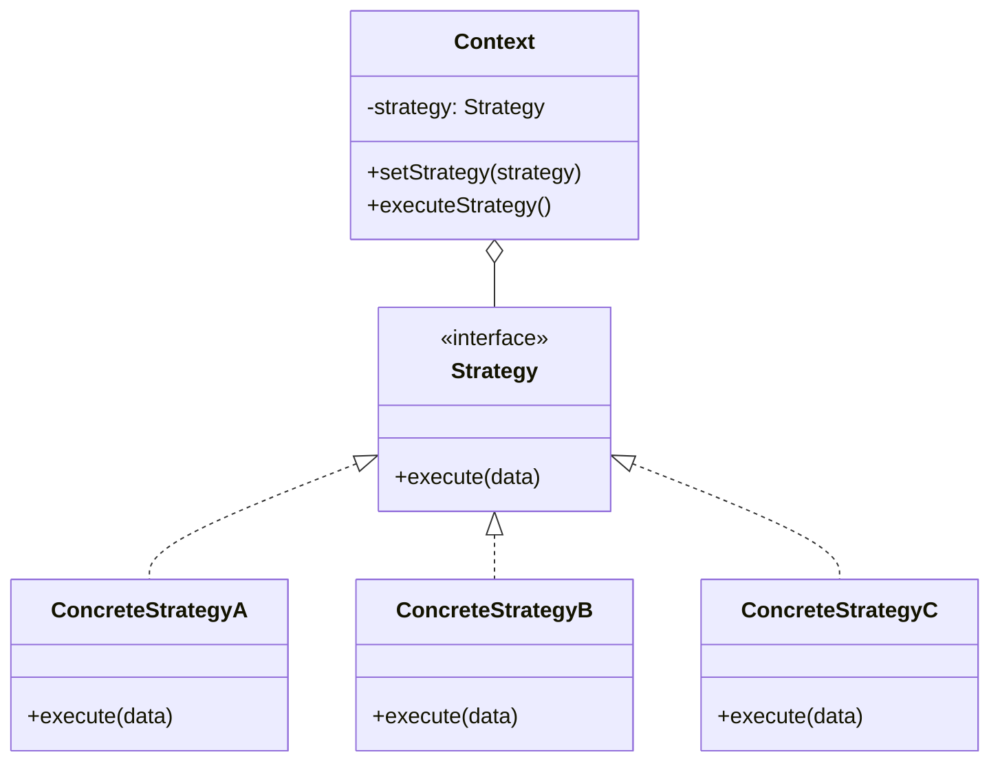
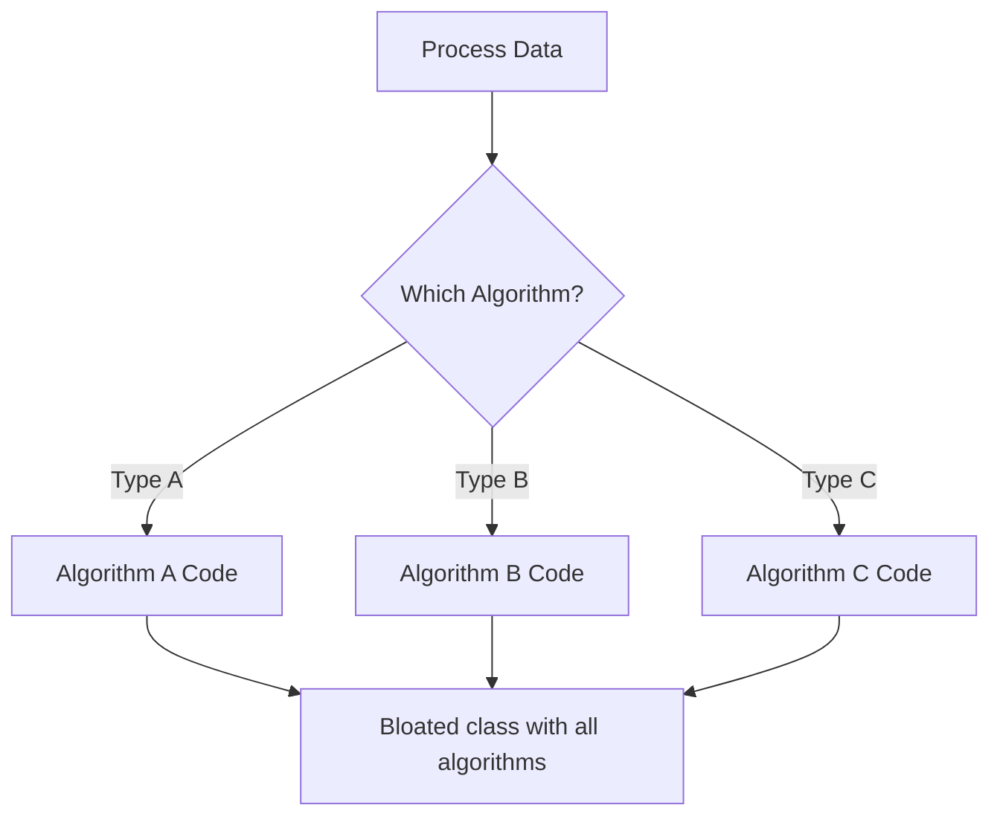
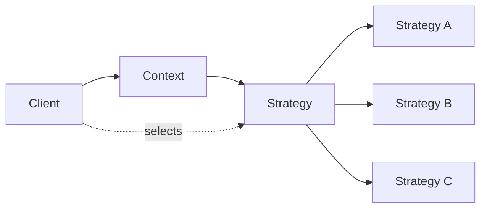

# Strategy Pattern

## Intent

**Strategy** is a behavioral design pattern that lets you define a family of algorithms, put each of them into a separate class or function, and make their objects interchangeable. It enables selecting an algorithm at runtime.



---

## Problem It Solves

When you have multiple algorithms for the same task:



The code becomes bloated and hard to maintain.

---

## Solution

Extract algorithms into separate strategy objects:



The context delegates to the current strategy.

---

## Implementation

<Tabs items={["Payment Processing", "Sorting Algorithms", "Compression", "Real-World: Shipping Calculator"]}>
  <Tab value="Payment Processing">
```typescript
/**
 * Payment result
 */
interface PaymentResult {
  success: boolean;
  transactionId?: string;
  error?: string;
  fee: number;
}

/**
 * Payment details
 */
interface PaymentDetails {
  amount: number;
  currency: string;
  customerId: string;
  metadata?: Record<string, string>;
}

/**
 * Payment strategy interface
 */
interface PaymentStrategy {
  name: string;
  validate: (details: PaymentDetails) => boolean;
  process: (details: PaymentDetails) => Promise<PaymentResult>;
  calculateFee: (amount: number) => number;
}

/**
 * Credit card payment strategy
 */
const createCreditCardStrategy = (apiKey: string): PaymentStrategy => ({
  name: "Credit Card",
  
  validate(details) {
    return details.amount > 0 && details.amount <= 10000;
  },
  
  calculateFee(amount) {
    return amount * 0.029 + 0.30; // 2.9% + $0.30
  },
  
  async process(details) {
    console.log(`[Credit Card] Processing $${details.amount}...`);
    await new Promise(r => setTimeout(r, 500));
    
    return {
      success: true,
      transactionId: `cc_${Date.now()}`,
      fee: this.calculateFee(details.amount),
    };
  },
});

/**
 * PayPal payment strategy
 */
const createPayPalStrategy = (clientId: string): PaymentStrategy => ({
  name: "PayPal",
  
  validate(details) {
    return details.amount > 0 && details.amount <= 25000;
  },
  
  calculateFee(amount) {
    return amount * 0.034 + 0.49; // 3.4% + $0.49
  },
  
  async process(details) {
    console.log(`[PayPal] Processing $${details.amount}...`);
    await new Promise(r => setTimeout(r, 700));
    
    return {
      success: true,
      transactionId: `pp_${Date.now()}`,
      fee: this.calculateFee(details.amount),
    };
  },
});

/**
 * Crypto payment strategy
 */
const createCryptoStrategy = (walletAddress: string): PaymentStrategy => ({
  name: "Cryptocurrency",
  
  validate(details) {
    return details.amount > 0; // No upper limit
  },
  
  calculateFee(amount) {
    return 1.00; // Flat $1 network fee
  },
  
  async process(details) {
    console.log(`[Crypto] Processing $${details.amount}...`);
    await new Promise(r => setTimeout(r, 2000)); // Blockchain is slower
    
    return {
      success: true,
      transactionId: `btc_${Date.now()}`,
      fee: this.calculateFee(details.amount),
    };
  },
});

/**
 * Bank transfer strategy
 */
const createBankTransferStrategy = (): PaymentStrategy => ({
  name: "Bank Transfer",
  
  validate(details) {
    return details.amount >= 100; // Minimum $100
  },
  
  calculateFee(amount) {
    return Math.min(amount * 0.005, 5); // 0.5% capped at $5
  },
  
  async process(details) {
    console.log(`[Bank Transfer] Processing $${details.amount}...`);
    await new Promise(r => setTimeout(r, 300));
    
    return {
      success: true,
      transactionId: `ach_${Date.now()}`,
      fee: this.calculateFee(details.amount),
    };
  },
});

/**
 * Payment processor (Context)
 * @description Processes payments using configurable strategies
 */
interface PaymentProcessor {
  setStrategy: (strategy: PaymentStrategy) => void;
  getStrategy: () => PaymentStrategy | null;
  process: (details: PaymentDetails) => Promise<PaymentResult>;
  previewFee: (amount: number) => number;
}

const createPaymentProcessor = (): PaymentProcessor => {
  let currentStrategy: PaymentStrategy | null = null;

  return {
    setStrategy(strategy) {
      currentStrategy = strategy;
      console.log(`Payment method set to: ${strategy.name}`);
    },

    getStrategy() {
      return currentStrategy;
    },

    async process(details) {
      if (!currentStrategy) {
        return { success: false, error: "No payment method selected", fee: 0 };
      }

      if (!currentStrategy.validate(details)) {
        return { 
          success: false, 
          error: `Invalid payment for ${currentStrategy.name}`, 
          fee: 0 
        };
      }

      return currentStrategy.process(details);
    },

    previewFee(amount) {
      if (!currentStrategy) return 0;
      return currentStrategy.calculateFee(amount);
    },
  };
};

// Usage
const processor = createPaymentProcessor();

// Available strategies
const creditCard = createCreditCardStrategy("sk_test_xxx");
const paypal = createPayPalStrategy("client_xxx");
const crypto = createCryptoStrategy("0x123...");
const bankTransfer = createBankTransferStrategy();

const paymentDetails: PaymentDetails = {
  amount: 99.99,
  currency: "USD",
  customerId: "cust_123",
};

console.log("\n--- Payment Processing Demo ---\n");

// Compare fees
console.log("Fee comparison for $99.99:");
console.log(`  Credit Card: $${creditCard.calculateFee(99.99).toFixed(2)}`);
console.log(`  PayPal: $${paypal.calculateFee(99.99).toFixed(2)}`);
console.log(`  Crypto: $${crypto.calculateFee(99.99).toFixed(2)}`);
console.log(`  Bank Transfer: $${bankTransfer.calculateFee(99.99).toFixed(2)}`);

// Process with credit card
console.log("\n--- Processing with Credit Card ---\n");
processor.setStrategy(creditCard);
const result1 = await processor.process(paymentDetails);
console.log("Result:", result1);
//                     ^?

// Switch to PayPal
console.log("\n--- Processing with PayPal ---\n");
processor.setStrategy(paypal);
const result2 = await processor.process({ ...paymentDetails, amount: 150 });
console.log("Result:", result2);
```
  </Tab>
  <Tab value="Sorting Algorithms">
```typescript
/**
 * Comparison function type
 */
type Comparator<T> = (a: T, b: T) => number;

/**
 * Sorting strategy interface
 */
interface SortingStrategy<T> {
  name: string;
  sort: (array: T[], compare: Comparator<T>) => T[];
  complexity: { best: string; average: string; worst: string };
  stable: boolean;
}

/**
 * Bubble sort strategy
 */
const bubbleSort = <T>(): SortingStrategy<T> => ({
  name: "Bubble Sort",
  complexity: { best: "O(n)", average: "O(n²)", worst: "O(n²)" },
  stable: true,
  
  sort(array, compare) {
    const result = [...array];
    const n = result.length;
    
    for (let i = 0; i < n - 1; i++) {
      let swapped = false;
      for (let j = 0; j < n - i - 1; j++) {
        if (compare(result[j], result[j + 1]) > 0) {
          [result[j], result[j + 1]] = [result[j + 1], result[j]];
          swapped = true;
        }
      }
      if (!swapped) break;
    }
    
    return result;
  },
});

/**
 * Quick sort strategy
 */
const quickSort = <T>(): SortingStrategy<T> => ({
  name: "Quick Sort",
  complexity: { best: "O(n log n)", average: "O(n log n)", worst: "O(n²)" },
  stable: false,
  
  sort(array, compare) {
    if (array.length <= 1) return [...array];
    
    const pivot = array[Math.floor(array.length / 2)];
    const left = array.filter(x => compare(x, pivot) < 0);
    const middle = array.filter(x => compare(x, pivot) === 0);
    const right = array.filter(x => compare(x, pivot) > 0);
    
    return [
      ...this.sort(left, compare),
      ...middle,
      ...this.sort(right, compare),
    ];
  },
});

/**
 * Merge sort strategy
 */
const mergeSort = <T>(): SortingStrategy<T> => ({
  name: "Merge Sort",
  complexity: { best: "O(n log n)", average: "O(n log n)", worst: "O(n log n)" },
  stable: true,
  
  sort(array, compare) {
    if (array.length <= 1) return [...array];
    
    const mid = Math.floor(array.length / 2);
    const left = this.sort(array.slice(0, mid), compare);
    const right = this.sort(array.slice(mid), compare);
    
    // Merge
    const result: T[] = [];
    let i = 0, j = 0;
    
    while (i < left.length && j < right.length) {
      if (compare(left[i], right[j]) <= 0) {
        result.push(left[i++]);
      } else {
        result.push(right[j++]);
      }
    }
    
    return [...result, ...left.slice(i), ...right.slice(j)];
  },
});

/**
 * Insertion sort strategy
 */
const insertionSort = <T>(): SortingStrategy<T> => ({
  name: "Insertion Sort",
  complexity: { best: "O(n)", average: "O(n²)", worst: "O(n²)" },
  stable: true,
  
  sort(array, compare) {
    const result = [...array];
    
    for (let i = 1; i < result.length; i++) {
      const key = result[i];
      let j = i - 1;
      
      while (j >= 0 && compare(result[j], key) > 0) {
        result[j + 1] = result[j];
        j--;
      }
      result[j + 1] = key;
    }
    
    return result;
  },
});

/**
 * Sorter context
 */
interface Sorter<T> {
  setStrategy: (strategy: SortingStrategy<T>) => void;
  sort: (array: T[], compare?: Comparator<T>) => T[];
  getInfo: () => { name: string; complexity: { best: string; average: string; worst: string }; stable: boolean } | null;
}

const createSorter = <T>(): Sorter<T> => {
  let strategy: SortingStrategy<T> | null = null;
  
  const defaultCompare: Comparator<T> = (a, b) => {
    if (a < b) return -1;
    if (a > b) return 1;
    return 0;
  };

  return {
    setStrategy(s) {
      strategy = s;
    },

    sort(array, compare = defaultCompare) {
      if (!strategy) {
        throw new Error("No sorting strategy set");
      }
      return strategy.sort(array, compare);
    },

    getInfo() {
      if (!strategy) return null;
      return {
        name: strategy.name,
        complexity: strategy.complexity,
        stable: strategy.stable,
      };
    },
  };
};

// Usage
const sorter = createSorter<number>();
const testArray = [64, 34, 25, 12, 22, 11, 90];

console.log("\n--- Sorting Strategies Demo ---\n");
console.log("Original:", testArray);

// Test each strategy
const strategies = [
  bubbleSort<number>(),
  insertionSort<number>(),
  quickSort<number>(),
  mergeSort<number>(),
];

for (const strategy of strategies) {
  sorter.setStrategy(strategy);
  const sorted = sorter.sort([...testArray]);
  const info = sorter.getInfo();
  console.log(`\n${info?.name}:`);
  console.log(`  Result: [${sorted.join(", ")}]`);
  console.log(`  Complexity: ${info?.complexity.average}`);
  console.log(`  Stable: ${info?.stable}`);
}

// Custom comparator (descending)
console.log("\n--- Custom Comparator (Descending) ---\n");
sorter.setStrategy(mergeSort());
const descending = sorter.sort(testArray, (a, b) => b - a);
console.log("Descending:", descending);
```
  </Tab>
  <Tab value="Compression">
```typescript
/**
 * Compression result
 */
interface CompressionResult {
  data: Uint8Array;
  originalSize: number;
  compressedSize: number;
  ratio: number;
  algorithm: string;
}

/**
 * Compression strategy interface
 */
interface CompressionStrategy {
  name: string;
  compress: (data: string) => CompressionResult;
  decompress: (data: Uint8Array) => string;
  getLevel: () => number;
  setLevel: (level: number) => void;
}

/**
 * Simple RLE (Run-Length Encoding) compression
 */
const createRLEStrategy = (): CompressionStrategy => {
  let level = 1; // Not used in RLE, but for interface consistency
  
  return {
    name: "RLE",
    
    getLevel: () => level,
    setLevel: (l) => { level = l; },
    
    compress(data) {
      const encoder = new TextEncoder();
      const original = encoder.encode(data);
      
      // Simple RLE: count consecutive characters
      let compressed = "";
      let count = 1;
      
      for (let i = 0; i < data.length; i++) {
        if (data[i] === data[i + 1]) {
          count++;
        } else {
          compressed += count > 1 ? `${count}${data[i]}` : data[i];
          count = 1;
        }
      }
      
      const result = encoder.encode(compressed);
      
      return {
        data: result,
        originalSize: original.length,
        compressedSize: result.length,
        ratio: result.length / original.length,
        algorithm: this.name,
      };
    },
    
    decompress(data) {
      const decoder = new TextDecoder();
      const str = decoder.decode(data);
      
      let result = "";
      let count = "";
      
      for (const char of str) {
        if (/\d/.test(char)) {
          count += char;
        } else {
          const times = count ? parseInt(count) : 1;
          result += char.repeat(times);
          count = "";
        }
      }
      
      return result;
    },
  };
};

/**
 * LZ77-like compression (simplified)
 */
const createLZ77Strategy = (): CompressionStrategy => {
  let windowSize = 255;
  
  return {
    name: "LZ77",
    
    getLevel: () => Math.floor(windowSize / 85), // 1-3
    setLevel: (level) => { windowSize = level * 85; },
    
    compress(data) {
      const encoder = new TextEncoder();
      const original = encoder.encode(data);
      
      // Simplified: Just demonstrate the concept
      const tokens: number[] = [];
      let i = 0;
      
      while (i < data.length) {
        let bestMatch = { offset: 0, length: 0 };
        const windowStart = Math.max(0, i - windowSize);
        
        // Look for matches in window
        for (let j = windowStart; j < i; j++) {
          let length = 0;
          while (
            i + length < data.length &&
            data[j + length] === data[i + length] &&
            length < 15 // Max match length
          ) {
            length++;
          }
          
          if (length > bestMatch.length) {
            bestMatch = { offset: i - j, length };
          }
        }
        
        if (bestMatch.length >= 3) {
          // Store as: [flag=1, offset, length]
          tokens.push(1, bestMatch.offset, bestMatch.length);
          i += bestMatch.length;
        } else {
          // Store as: [flag=0, char]
          tokens.push(0, data.charCodeAt(i));
          i++;
        }
      }
      
      const result = new Uint8Array(tokens);
      
      return {
        data: result,
        originalSize: original.length,
        compressedSize: result.length,
        ratio: result.length / original.length,
        algorithm: this.name,
      };
    },
    
    decompress(data) {
      let result = "";
      let i = 0;
      
      while (i < data.length) {
        if (data[i] === 0) {
          result += String.fromCharCode(data[i + 1]);
          i += 2;
        } else {
          const offset = data[i + 1];
          const length = data[i + 2];
          const start = result.length - offset;
          for (let j = 0; j < length; j++) {
            result += result[start + j];
          }
          i += 3;
        }
      }
      
      return result;
    },
  };
};

/**
 * No compression (passthrough)
 */
const createNoCompressionStrategy = (): CompressionStrategy => ({
  name: "None",
  getLevel: () => 0,
  setLevel: () => {},
  
  compress(data) {
    const encoder = new TextEncoder();
    const bytes = encoder.encode(data);
    
    return {
      data: bytes,
      originalSize: bytes.length,
      compressedSize: bytes.length,
      ratio: 1,
      algorithm: this.name,
    };
  },
  
  decompress(data) {
    return new TextDecoder().decode(data);
  },
});

/**
 * Compressor context
 */
interface Compressor {
  setStrategy: (strategy: CompressionStrategy) => void;
  compress: (data: string) => CompressionResult;
  decompress: (data: Uint8Array) => string;
  setLevel: (level: number) => void;
}

const createCompressor = (): Compressor => {
  let strategy: CompressionStrategy = createNoCompressionStrategy();

  return {
    setStrategy(s) {
      strategy = s;
      console.log(`Compression set to: ${s.name}`);
    },

    compress(data) {
      return strategy.compress(data);
    },

    decompress(data) {
      return strategy.decompress(data);
    },

    setLevel(level) {
      strategy.setLevel(level);
    },
  };
};

// Usage
const compressor = createCompressor();

const testData = "AAABBBCCCCCDDDDDDEEEEEEEFFFFFFFF";
console.log("\n--- Compression Strategies Demo ---\n");
console.log(`Original: "${testData}" (${testData.length} bytes)\n`);

const strategies = [
  createNoCompressionStrategy(),
  createRLEStrategy(),
  createLZ77Strategy(),
];

for (const strategy of strategies) {
  compressor.setStrategy(strategy);
  const result = compressor.compress(testData);
  const decompressed = compressor.decompress(result.data);
  
  console.log(`${result.algorithm}:`);
  console.log(`  Compressed: ${result.compressedSize} bytes`);
  console.log(`  Ratio: ${(result.ratio * 100).toFixed(1)}%`);
  console.log(`  Decompressed matches: ${decompressed === testData}`);
  console.log();
}
```
  </Tab>
  <Tab value="Real-World: Shipping Calculator">
```ts
/**
 * Package dimensions and weight
 */
interface Package {
  weight: number; // kg
  length: number; // cm
  width: number;  // cm
  height: number; // cm
}

/**
 * Shipping address
 */
interface ShippingAddress {
  country: string;
  state: string;
  city: string;
  postalCode: string;
  isResidential: boolean;
}

/**
 * Shipping quote
 */
interface ShippingQuote {
  carrier: string;
  service: string;
  price: number;
  estimatedDays: number;
  tracking: boolean;
  insurance: boolean;
}

/**
 * Shipping strategy interface
 */
interface ShippingStrategy {
  carrier: string;
  calculateRate: (pkg: Package, from: ShippingAddress, to: ShippingAddress) => ShippingQuote[];
  isAvailable: (from: ShippingAddress, to: ShippingAddress) => boolean;
}

/**
 * Calculate volumetric weight
 */
const volumetricWeight = (pkg: Package, divisor = 5000): number => {
  return (pkg.length * pkg.width * pkg.height) / divisor;
};

/**
 * Get billable weight
 */
const billableWeight = (pkg: Package): number => {
  return Math.max(pkg.weight, volumetricWeight(pkg));
};

/**
 * UPS shipping strategy
 */
const createUPSStrategy = (): ShippingStrategy => ({
  carrier: "UPS",
  
  isAvailable(from, to) {
    // UPS available in most countries
    return true;
  },
  
  calculateRate(pkg, from, to) {
    const weight = billableWeight(pkg);
    const isInternational = from.country !== to.country;
    const baseRate = isInternational ? 25 : 8;
    
    return [
      {
        carrier: "UPS",
        service: "Ground",
        price: baseRate + weight * 1.5,
        estimatedDays: isInternational ? 7 : 5,
        tracking: true,
        insurance: false,
      },
      {
        carrier: "UPS",
        service: "Express",
        price: baseRate * 2 + weight * 3,
        estimatedDays: isInternational ? 3 : 2,
        tracking: true,
        insurance: true,
      },
      {
        carrier: "UPS",
        service: "Next Day Air",
        price: baseRate * 4 + weight * 5,
        estimatedDays: 1,
        tracking: true,
        insurance: true,
      },
    ];
  },
});

/**
 * FedEx shipping strategy
 */
const createFedExStrategy = (): ShippingStrategy => ({
  carrier: "FedEx",
  
  isAvailable(from, to) {
    return true;
  },
  
  calculateRate(pkg, from, to) {
    const weight = billableWeight(pkg);
    const isInternational = from.country !== to.country;
    const baseRate = isInternational ? 28 : 9;
    
    const quotes: ShippingQuote[] = [
      {
        carrier: "FedEx",
        service: "Ground",
        price: baseRate + weight * 1.4,
        estimatedDays: isInternational ? 8 : 5,
        tracking: true,
        insurance: false,
      },
      {
        carrier: "FedEx",
        service: "Express Saver",
        price: baseRate * 1.8 + weight * 2.8,
        estimatedDays: isInternational ? 4 : 3,
        tracking: true,
        insurance: false,
      },
      {
        carrier: "FedEx",
        service: "Priority Overnight",
        price: baseRate * 3.5 + weight * 4.5,
        estimatedDays: 1,
        tracking: true,
        insurance: true,
      },
    ];
    
    // FedEx offers SmartPost for residential
    if (to.isResidential) {
      quotes.unshift({
        carrier: "FedEx",
        service: "SmartPost",
        price: baseRate * 0.7 + weight * 1.0,
        estimatedDays: isInternational ? 10 : 7,
        tracking: true,
        insurance: false,
      });
    }
    
    return quotes;
  },
});

/**
 * USPS shipping strategy
 */
const createUSPSStrategy = (): ShippingStrategy => ({
  carrier: "USPS",
  
  isAvailable(from, to) {
    // USPS primarily US
    return from.country === "US";
  },
  
  calculateRate(pkg, from, to) {
    const weight = billableWeight(pkg);
    const isInternational = from.country !== to.country;
    
    if (isInternational) {
      return [
        {
          carrier: "USPS",
          service: "Priority Mail International",
          price: 30 + weight * 2,
          estimatedDays: 10,
          tracking: true,
          insurance: false,
        },
      ];
    }
    
    return [
      {
        carrier: "USPS",
        service: "First Class",
        price: 4 + weight * 0.8,
        estimatedDays: 5,
        tracking: true,
        insurance: false,
      },
      {
        carrier: "USPS",
        service: "Priority Mail",
        price: 8 + weight * 1.2,
        estimatedDays: 3,
        tracking: true,
        insurance: false,
      },
      {
        carrier: "USPS",
        service: "Priority Mail Express",
        price: 25 + weight * 2,
        estimatedDays: 1,
        tracking: true,
        insurance: true,
      },
    ];
  },
});

/**
 * Shipping calculator (Context)
 */
interface ShippingCalculator {
  addCarrier: (strategy: ShippingStrategy) => void;
  removeCarrier: (carrierName: string) => void;
  getQuotes: (pkg: Package, from: ShippingAddress, to: ShippingAddress) => ShippingQuote[];
  getBestQuote: (pkg: Package, from: ShippingAddress, to: ShippingAddress) => ShippingQuote | null;
  getFastestQuote: (pkg: Package, from: ShippingAddress, to: ShippingAddress) => ShippingQuote | null;
}

const createShippingCalculator = (): ShippingCalculator => {
  const carriers: ShippingStrategy[] = [];

  return {
    addCarrier(strategy) {
      carriers.push(strategy);
      console.log(`Added carrier: ${strategy.carrier}`);
    },

    removeCarrier(carrierName) {
      const index = carriers.findIndex(c => c.carrier === carrierName);
      if (index >= 0) {
        carriers.splice(index, 1);
      }
    },

    getQuotes(pkg, from, to) {
      const allQuotes: ShippingQuote[] = [];
      
      for (const carrier of carriers) {
        if (carrier.isAvailable(from, to)) {
          allQuotes.push(...carrier.calculateRate(pkg, from, to));
        }
      }
      
      // Sort by price
      return allQuotes.sort((a, b) => a.price - b.price);
    },

    getBestQuote(pkg, from, to) {
      const quotes = this.getQuotes(pkg, from, to);
      return quotes[0] ?? null;
    },

    getFastestQuote(pkg, from, to) {
      const quotes = this.getQuotes(pkg, from, to);
      return quotes.sort((a, b) => a.estimatedDays - b.estimatedDays)[0] ?? null;
    },
  };
};

// Usage
const calculator = createShippingCalculator();

// Add carriers
calculator.addCarrier(createUPSStrategy());
calculator.addCarrier(createFedExStrategy());
calculator.addCarrier(createUSPSStrategy());

const pkg: Package = {
  weight: 2.5,
  length: 30,
  width: 20,
  height: 15,
};

const fromAddress: ShippingAddress = {
  country: "US",
  state: "CA",
  city: "Los Angeles",
  postalCode: "90001",
  isResidential: false,
};

const toAddress: ShippingAddress = {
  country: "US",
  state: "NY",
  city: "New York",
  postalCode: "10001",
  isResidential: true,
};

console.log("\n--- Shipping Calculator Demo ---\n");
console.log("Package:", pkg);
console.log("From:", `${fromAddress.city}, ${fromAddress.state}`);
console.log("To:", `${toAddress.city}, ${toAddress.state}`);

console.log("\n--- All Quotes (sorted by price) ---\n");
const quotes = calculator.getQuotes(pkg, fromAddress, toAddress);
for (const quote of quotes) {
  console.log(
    `${quote.carrier} ${quote.service}: $${quote.price.toFixed(2)} ` +
    `(${quote.estimatedDays} days)`
  );
}

console.log("\n--- Best (Cheapest) Quote ---");
const best = calculator.getBestQuote(pkg, fromAddress, toAddress);
if (best) {
  console.log(`${best.carrier} ${best.service}: $${best.price.toFixed(2)}`);
}

console.log("\n--- Fastest Quote ---");
const fastest = calculator.getFastestQuote(pkg, fromAddress, toAddress);
if (fastest) {
  console.log(
    `${fastest.carrier} ${fastest.service}: ` +
    `${fastest.estimatedDays} day(s) - $${fastest.price.toFixed(2)}`
  );
}
```
  </Tab>
</Tabs>

---

## When to Use

<Accordions>
  <Accordion title="✅ Use Strategy when...">
    - **Multiple algorithms**: Different ways to accomplish same task
    
    - **Runtime selection**: Algorithm chosen at runtime
    
    - **Avoid conditionals**: Replace algorithm selection conditionals
    
    - **Isolate algorithms**: Algorithms independent of context
    
    - **Examples**: Payment, sorting, compression, routing
  </Accordion>
  
  <Accordion title="❌ Avoid Strategy when...">
    - **Few algorithms**: Simple conditional is clearer
    
    - **Algorithms rarely change**: Hardcoding is acceptable
    
    - **No reuse**: Strategies won't be shared
  </Accordion>
</Accordions>

---

## Strategy in Functional Style

In JavaScript/TypeScript, strategies can be simple functions:

```ts
// Strategies as functions
type SortStrategy<T> = (arr: T[]) => T[];

const bubbleSort: SortStrategy<number> = (arr) => { /* ... */ return arr; };
const quickSort: SortStrategy<number> = (arr) => { /* ... */ return arr; };

// Usage - just pass the function
const sorted = quickSort([3, 1, 2]);
```

---

## Summary

<Callout type="info">
  **Key Takeaway**: Strategy defines a family of interchangeable algorithms, letting clients select and switch between them at runtime without changing the code that uses them.
</Callout>

### Pros
- ✅ Swappable algorithms at runtime
- ✅ Isolates algorithm implementation
- ✅ Open/Closed: Add strategies without modifying context
- ✅ Eliminates conditional statements

### Cons
- ❌ Clients must know about strategies
- ❌ Overhead for simple algorithms
- ❌ Increased number of objects/functions
