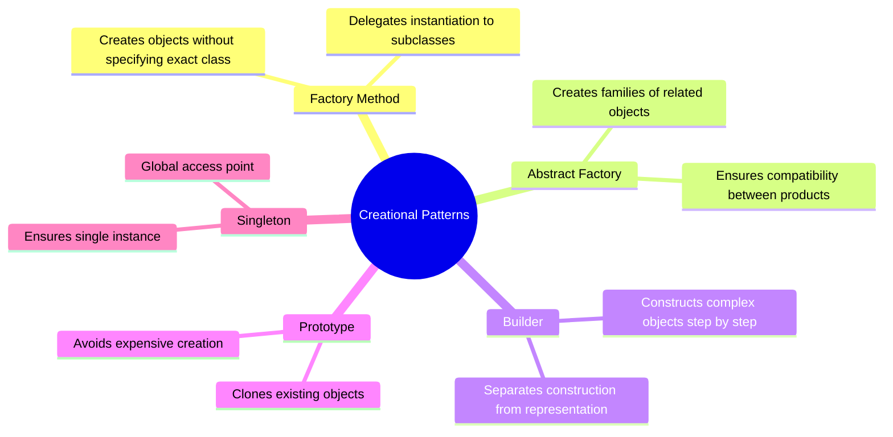
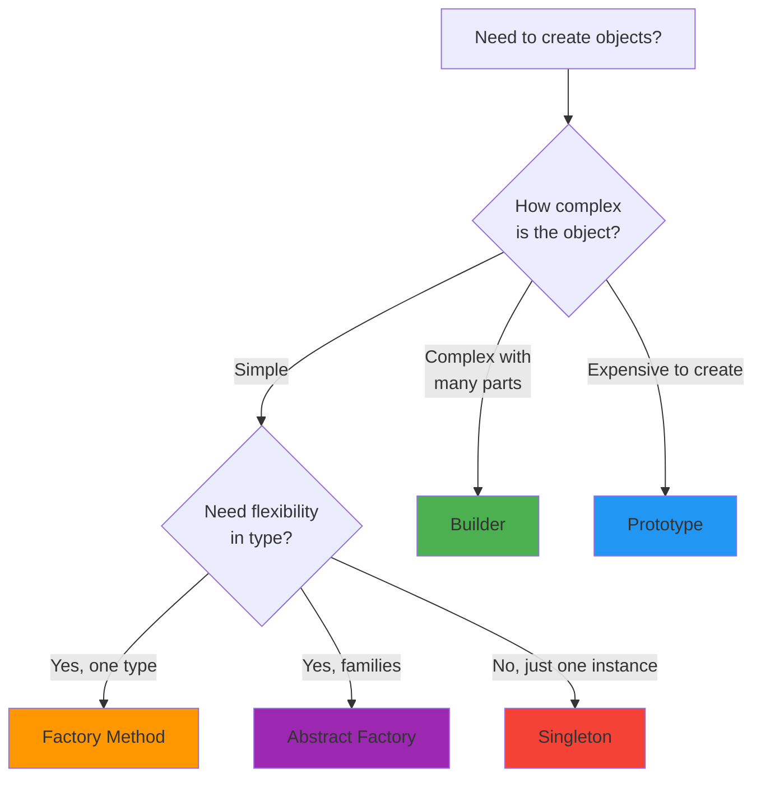

# Creational Patterns

Creational design patterns abstract the instantiation process. They help make a system independent of how its objects are created, composed, and represented.

## The Patterns

<Cards>
  <Card
    title="Factory Method"
    description="Define an interface for creating objects, but let subclasses decide which class to instantiate"
    href="/docs/architecture/patterns/creational/factory-method"
  />
  <Card
    title="Abstract Factory"
    description="Create families of related objects without specifying their concrete classes"
    href="/docs/architecture/patterns/creational/abstract-factory"
  />
  <Card
    title="Builder"
    description="Construct complex objects step by step, allowing different representations"
    href="/docs/architecture/patterns/creational/builder"
  />
  <Card
    title="Prototype"
    description="Create new objects by copying existing ones without depending on their classes"
    href="/docs/architecture/patterns/creational/prototype"
  />
  <Card
    title="Singleton"
    description="Ensure a class has only one instance with a global access point"
    href="/docs/architecture/patterns/creational/singleton"
  />
</Cards>

## Quick Comparison

| Pattern | Intent | Complexity | Frequency |
|---------|--------|------------|-----------|
| Factory Method | Defer instantiation to subclasses | ⭐⭐ | Very Common |
| Abstract Factory | Create families of objects | ⭐⭐⭐ | Common |
| Builder | Build complex objects step by step | ⭐⭐ | Common |
| Prototype | Clone objects | ⭐ | Less Common |
| Singleton | Single instance | ⭐ | Very Common |

## When to Use Which?

