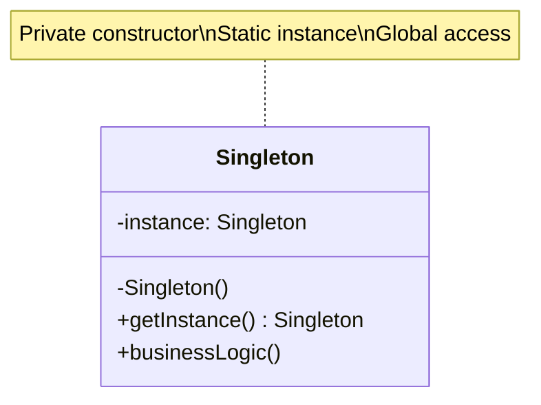
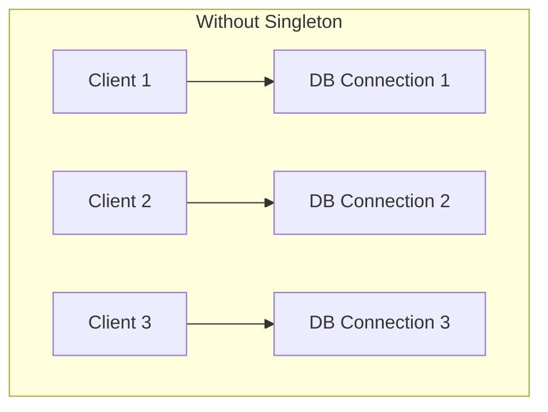
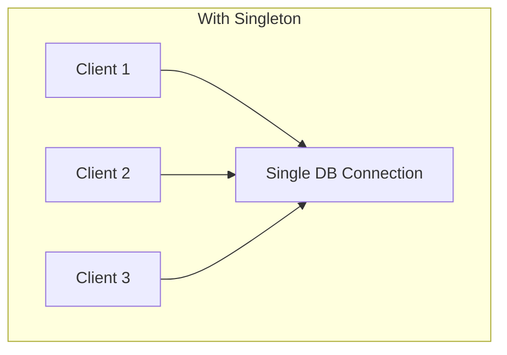
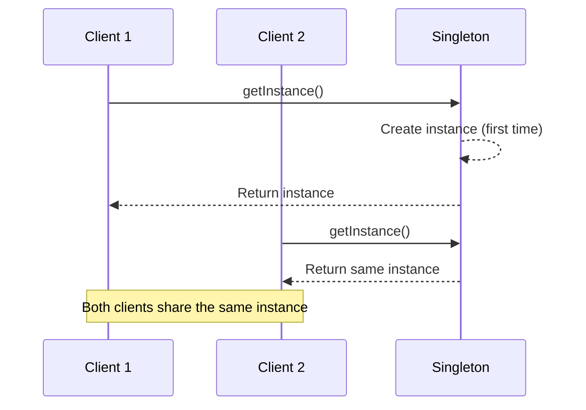
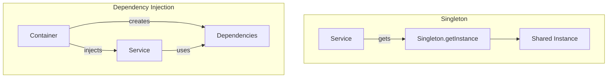

# Singleton Pattern

## Intent

**Singleton** is a creational design pattern that ensures a class has only one instance while providing a global access point to this instance.



---

## Problem It Solves

The Singleton pattern solves two problems (violating Single Responsibility Principle):

### 1. Ensure Single Instance

Some resources should only have one instance:
- Database connections
- Configuration managers
- Logging services
- Thread pools





### 2. Global Access Point

Provide a way to access the instance from anywhere in the code.

---

## Solution

All Singleton implementations share these steps:

1. **Private constructor** - prevent direct instantiation
2. **Static creation method** - acts as constructor, returns cached instance



---

<Callout type="warn">
  **Warning**: Singleton is considered an anti-pattern by many developers because:
  - It introduces global state
  - Makes unit testing difficult
  - Violates Single Responsibility Principle
  - Hides dependencies
  
  **Prefer Dependency Injection** when possible.
</Callout>

---

## Implementation

<Tabs items={["Module Pattern", "Closure Pattern", "Lazy Initialization", "Dependency Injection Alternative"]}>
  <Tab value="Module Pattern">
```ts
// In TypeScript/JavaScript, modules are naturally singletons
// This is the simplest and most idiomatic approach

// logger.ts - The module itself is the singleton
interface LogEntry {
  timestamp: Date;
  level: "debug" | "info" | "warn" | "error";
  message: string;
  context?: Record<string, unknown>;
}

type LogLevel = "debug" | "info" | "warn" | "error";

const logLevels: Record<LogLevel, number> = {
  debug: 0,
  info: 1,
  warn: 2,
  error: 3,
};

// Private state (module-scoped)
let currentLevel: LogLevel = "info";
const logs: LogEntry[] = [];

// Private function
const shouldLog = (level: LogLevel): boolean => {
  return logLevels[level] >= logLevels[currentLevel];
};

const formatEntry = (entry: LogEntry): string => {
  const timestamp = entry.timestamp.toISOString();
  const context = entry.context ? ` ${JSON.stringify(entry.context)}` : "";
  return `[${timestamp}] [${entry.level.toUpperCase()}] ${entry.message}${context}`;
};

// Public API (exported)
export const logger = {
  setLevel(level: LogLevel) {
    currentLevel = level;
  },

  debug(message: string, context?: Record<string, unknown>) {
    if (shouldLog("debug")) {
      const entry: LogEntry = { timestamp: new Date(), level: "debug", message, context };
      logs.push(entry);
      console.debug(formatEntry(entry));
    }
  },

  info(message: string, context?: Record<string, unknown>) {
    if (shouldLog("info")) {
      const entry: LogEntry = { timestamp: new Date(), level: "info", message, context };
      logs.push(entry);
      console.info(formatEntry(entry));
    }
  },

  warn(message: string, context?: Record<string, unknown>) {
    if (shouldLog("warn")) {
      const entry: LogEntry = { timestamp: new Date(), level: "warn", message, context };
      logs.push(entry);
      console.warn(formatEntry(entry));
    }
  },

  error(message: string, context?: Record<string, unknown>) {
    if (shouldLog("error")) {
      const entry: LogEntry = { timestamp: new Date(), level: "error", message, context };
      logs.push(entry);
      console.error(formatEntry(entry));
    }
  },

  getLogs(): readonly LogEntry[] {
    return [...logs];
  },

  clear() {
    logs.length = 0;
  },
};

// Usage - import from anywhere, always same instance
// import { logger } from './logger';

logger.setLevel("debug");
logger.info("Application started", { version: "1.0.0" });
logger.debug("Debug information");
logger.error("Something went wrong", { code: "ERR_001" });

console.log("Log count:", logger.getLogs().length);
```
  </Tab>
  <Tab value="Closure Pattern">
```ts
// Singleton with closure - more control over initialization

interface DatabaseConfig {
  host: string;
  port: number;
  database: string;
  maxConnections: number;
}

interface DatabaseConnection {
  query: <T>(sql: string, params?: unknown[]) => Promise<T[]>;
  execute: (sql: string, params?: unknown[]) => Promise<void>;
  transaction: <T>(fn: () => Promise<T>) => Promise<T>;
  close: () => Promise<void>;
  isConnected: () => boolean;
  getStats: () => { activeConnections: number; totalQueries: number };
}

// Singleton factory with closure
const createDatabaseSingleton = () => {
  let instance: DatabaseConnection | null = null;
  let config: DatabaseConfig | null = null;
  let connected = false;
  let totalQueries = 0;

  const initialize = async (cfg: DatabaseConfig): Promise<DatabaseConnection> => {
    if (instance) {
      console.warn("Database already initialized, returning existing instance");
      return instance;
    }

    config = cfg;
    console.log(`Connecting to ${cfg.host}:${cfg.port}/${cfg.database}...`);
    
    // Simulate connection delay
    await new Promise(resolve => setTimeout(resolve, 100));
    connected = true;
    console.log("Database connected successfully");

    instance = {
      query: async <T>(sql: string, params?: unknown[]): Promise<T[]> => {
        if (!connected) throw new Error("Database not connected");
        totalQueries++;
        console.log(`[Query #${totalQueries}] ${sql}`);
        return [] as T[];
      },

      execute: async (sql: string, params?: unknown[]) => {
        if (!connected) throw new Error("Database not connected");
        totalQueries++;
        console.log(`[Execute #${totalQueries}] ${sql}`);
      },

      transaction: async <T>(fn: () => Promise<T>): Promise<T> => {
        console.log("BEGIN TRANSACTION");
        try {
          const result = await fn();
          console.log("COMMIT");
          return result;
        } catch (error) {
          console.log("ROLLBACK");
          throw error;
        }
      },

      close: async () => {
        console.log("Closing database connection...");
        connected = false;
        instance = null;
      },

      isConnected: () => connected,

      getStats: () => ({
        activeConnections: connected ? 1 : 0,
        totalQueries,
      }),
    };

    return instance;
  };

  const getInstance = (): DatabaseConnection => {
    if (!instance) {
      throw new Error("Database not initialized. Call initialize() first.");
    }
    return instance;
  };

  return {
    initialize,
    getInstance,
    isInitialized: () => instance !== null,
  };
};

// Export singleton
const Database = createDatabaseSingleton();

// Usage
const main = async () => {
  // Initialize once at app start
  await Database.initialize({
    host: "localhost",
    port: 5432,
    database: "myapp",
    maxConnections: 10,
  });

  // Get instance anywhere in the app
  const db = Database.getInstance();
  
  await db.query("SELECT * FROM users");
  await db.execute("INSERT INTO logs (message) VALUES ($1)", ["User logged in"]);
  
  console.log("Stats:", db.getStats());
};

main();
```
  </Tab>
  <Tab value="Lazy Initialization">
```typescript
/**
 * Cache entry with TTL support
 * @description Wraps cached values with expiration timestamp
 * @typeParam T - Type of the cached value
 */
interface CacheEntry<T> {
  /** The cached value */
  value: T;
  /** Unix timestamp when entry expires */
  expires: number;
}

/**
 * Cache interface for singleton cache manager
 * @description In-memory cache with TTL support and automatic cleanup
 */
interface Cache {
  /** Get a value by key, returns undefined if expired or missing */
  get: <T>(key: string) => T | undefined;
  /** Set a value with optional TTL in seconds (default: 1 hour) */
  set: <T>(key: string, value: T, ttlSeconds?: number) => void;
  /** Delete a specific key */
  delete: (key: string) => boolean;
  /** Clear all entries */
  clear: () => void;
  /** Check if key exists and is not expired */
  has: (key: string) => boolean;
  /** Get number of entries in cache */
  size: () => number;
  /** Remove expired entries, returns count removed */
  cleanup: () => number;
}

/**
 * Creates a lazy-initialized cache singleton
 * @description Cache is created on first getInstance() call
 * @returns Singleton accessor with getInstance method
 */
const createCacheSingleton = () => {
  let instance: Cache | null = null;

  const createCache = (): Cache => {
    const store = new Map<string, CacheEntry<unknown>>();
    let cleanupInterval: ReturnType<typeof setInterval> | null = null;

    const cache: Cache = {
      get<T>(key: string): T | undefined {
        const entry = store.get(key);
        if (!entry) return undefined;
        
        if (Date.now() > entry.expires) {
          store.delete(key);
          return undefined;
        }
        
        return entry.value as T;
      },

      set<T>(key: string, value: T, ttlSeconds = 3600) {
        store.set(key, {
          value,
          expires: Date.now() + ttlSeconds * 1000,
        });
      },

      delete(key: string): boolean {
        return store.delete(key);
      },

      clear() {
        store.clear();
      },

      has(key: string): boolean {
        const entry = store.get(key);
        if (!entry) return false;
        if (Date.now() > entry.expires) {
          store.delete(key);
          return false;
        }
        return true;
      },

      size(): number {
        return store.size;
      },

      cleanup(): number {
        const now = Date.now();
        let cleaned = 0;
        for (const [key, entry] of store) {
          if (now > entry.expires) {
            store.delete(key);
            cleaned++;
          }
        }
        return cleaned;
      },
    };

    // Start cleanup interval
    cleanupInterval = setInterval(() => {
      const cleaned = cache.cleanup();
      if (cleaned > 0) {
        console.log(`Cache cleanup: removed ${cleaned} expired entries`);
      }
    }, 60000); // Every minute

    return cache;
  };

  return {
    /** Get or create the singleton cache instance */
    getInstance(): Cache {
      // Lazy initialization - create on first access
      if (!instance) {
        console.log("Creating cache instance...");
        instance = createCache();
      }
      return instance;
    },
  };
};

// Export singleton accessor
const CacheManager = createCacheSingleton();

// Usage: Same instance everywhere
const cache = CacheManager.getInstance();

cache.set("user:123", { name: "John", email: "john@example.com" }, 300);
cache.set("settings", { theme: "dark" }, 3600);

const user = cache.get<{ name: string; email: string }>("user:123");
console.log(user);
//          ^?

console.log("Cache size:", cache.size());
console.log("Has user:123:", cache.has("user:123"));
```
  </Tab>
  <Tab value="Dependency Injection Alternative">
```typescript
// @noErrors
// BETTER APPROACH: Dependency Injection
// Instead of Singleton, create instances and inject them

interface Logger {
  info: (message: string) => void;
  error: (message: string) => void;
}

interface Database {
  query: <T>(sql: string) => Promise<T[]>;
}

interface Cache {
  get: <T>(key: string) => T | undefined;
  set: <T>(key: string, value: T) => void;
}

// Define dependencies container
interface AppDependencies {
  logger: Logger;
  database: Database;
  cache: Cache;
}

// Create dependencies once at app initialization
const createDependencies = (): AppDependencies => {
  // Create logger
  const logger: Logger = {
    info: (message) => console.log(`[INFO] ${message}`),
    error: (message) => console.error(`[ERROR] ${message}`),
  };

  // Create database
  const database: Database = {
    query: async (sql: string) => {
      logger.info(`Executing query: ${sql}`);
      return [];
    },
  };

  // Create cache
  const cacheStore = new Map<string, unknown>();
  const cache: Cache = {
    get: <T>(key: string) => cacheStore.get(key) as T | undefined,
    set: <T>(key: string, value: T) => {
      cacheStore.set(key, value);
    },
  };

  return { logger, database, cache };
};

// Services receive dependencies via parameters (Dependency Injection)
const createUserService = (deps: Pick<AppDependencies, "logger" | "database" | "cache">) => {
  const { logger, database, cache } = deps;

  return {
    async getUser(id: string) {
      // Try cache first
      const cached = cache.get<{ id: string; name: string }>(`user:${id}`);
      if (cached) {
        logger.info(`Cache hit for user ${id}`);
        return cached;
      }

      // Fetch from database
      logger.info(`Fetching user ${id} from database`);
      const [user] = await database.query<{ id: string; name: string }>(
        `SELECT * FROM users WHERE id = '${id}'`
      );

      // Cache the result
      if (user) {
        cache.set(`user:${id}`, user);
      }

      return user;
    },

    async createUser(name: string, email: string) {
      logger.info(`Creating user: ${name}`);
      await database.query(`INSERT INTO users (name, email) VALUES ('${name}', '${email}')`);
    },
  };
};

const createOrderService = (deps: Pick<AppDependencies, "logger" | "database">) => {
  const { logger, database } = deps;

  return {
    async createOrder(userId: string, items: string[]) {
      logger.info(`Creating order for user ${userId}`);
      await database.query(`INSERT INTO orders (user_id, items) VALUES ('${userId}', '${items}')`);
    },
  };
};

// Application setup
const initializeApp = () => {
  // Create dependencies once
  const deps = createDependencies();

  // Create services with injected dependencies
  const userService = createUserService(deps);
  const orderService = createOrderService(deps);

  return {
    userService,
    orderService,
    // Expose logger for global use if needed
    logger: deps.logger,
  };
};

// Benefits of Dependency Injection:
// 1. Easy to test - just pass mock dependencies
const createTestDependencies = (): AppDependencies => ({
  logger: { info: () => {}, error: () => {} },
  database: { query: async () => [{ id: "1", name: "Test User" }] },
  cache: { 
    get: () => undefined, 
    set: () => {} 
  },
});

const testUserService = createUserService(createTestDependencies());

// 2. Dependencies are explicit - no hidden global state
// 3. Easy to swap implementations
// 4. Better separation of concerns
```
  </Tab>
</Tabs>

---

## When to Use

<Accordions>
  <Accordion title="✅ Use Singleton when...">
    - **Exactly one instance is needed**: Database connections, configuration, logging (though DI is often better)
    
    - **Lazy initialization is important**: When the instance is expensive and might not be needed
    
    - **Global access is truly necessary**: Some resources genuinely need global access
    
    - **Module-level singleton**: In JavaScript/TypeScript, use module pattern instead of traditional singleton
  </Accordion>
  
  <Accordion title="❌ Avoid Singleton when...">
    - **Testing is important**: Singletons make mocking and testing difficult
    
    - **Dependency Injection is possible**: DI provides the same benefits with better testability
    
    - **Multiple instances might be needed later**: Singleton assumes forever-single instance
    
    - **Hidden dependencies**: Singleton hides what a class depends on
    
    - **Global state causes issues**: Shared mutable state can cause bugs in concurrent environments
  </Accordion>
</Accordions>

---

## Singleton vs Dependency Injection



| Aspect | Singleton | Dependency Injection |
|--------|-----------|---------------------|
| **Testability** | Hard to mock | Easy to mock |
| **Dependencies** | Hidden | Explicit |
| **Coupling** | High (global) | Low (injected) |
| **Flexibility** | Fixed instance | Swappable |
| **Thread safety** | Must handle | Container handles |

---

## Real-World Applications

| Use Case | Pattern | Better Alternative |
|----------|---------|-------------------|
| **Logging** | Singleton | DI with single instance |
| **Configuration** | Module export | Environment/config loading |
| **Database Pool** | Singleton | DI with connection factory |
| **Cache** | Singleton | DI with cache service |
| **Event Bus** | Singleton | DI with event emitter |

---

## Summary

<Callout type="warn">
  **Key Takeaway**: While Singleton ensures a single instance, it introduces global state and testing difficulties. In modern TypeScript, prefer module-level singletons or Dependency Injection. Use traditional Singleton only when absolutely necessary.
</Callout>

### Pros
- ✅ Ensures single instance
- ✅ Global access point
- ✅ Lazy initialization possible
- ✅ Module pattern is natural in JS/TS

### Cons
- ❌ Violates Single Responsibility (creation + business logic)
- ❌ Makes unit testing difficult
- ❌ Hides dependencies
- ❌ Global state can cause issues
- ❌ Tight coupling throughout codebase
