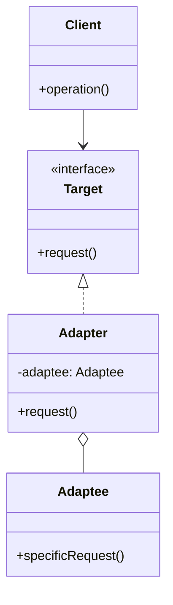
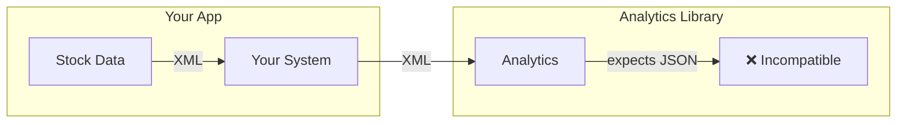
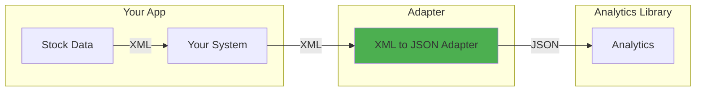
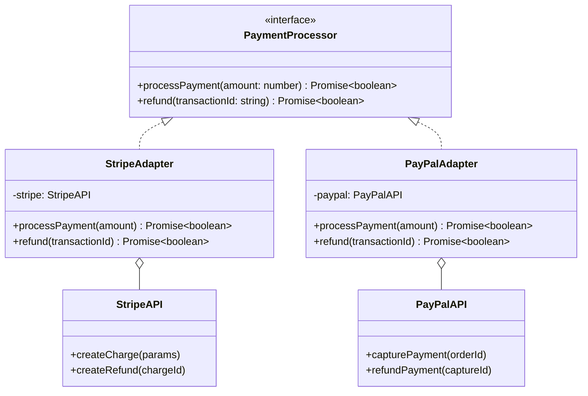

# Adapter Pattern

## Intent

**Adapter** is a structural design pattern that allows objects with incompatible interfaces to collaborate. It acts as a wrapper between two objects, catching calls for one object and transforming them to format and interface recognizable by the second object.



---

## Problem It Solves

Imagine you're building a stock market monitoring app. It downloads stock data in XML format from multiple sources, then displays nice charts and diagrams.

Later, you decide to integrate a smart analytics library. But it only works with JSON data.



You can't change the library (it's third-party). You could change your app to use JSON, but that might break existing code that relies on XML.

---

## Solution

Create an adapter that converts XML to JSON, wrapping the analytics library:



---

## Structure



---

## Implementation

<Tabs items={["Basic Adapter", "Third-Party Integration", "Multiple Adapters", "Real-World: API Adapter"]}>
  <Tab value="Basic Adapter">
```typescript
/**
 * Target interface - what your application expects
 * @description This is the interface your code works with
 */
interface Logger {
  /** Log with specified level */
  log: (level: "info" | "warn" | "error", message: string) => void;
  /** Log informational message */
  info: (message: string) => void;
  /** Log warning message */
  warn: (message: string) => void;
  /** Log error message */
  error: (message: string) => void;
}

/**
 * Adaptee - third-party logging library with different interface
 * @description This is an incompatible interface we need to adapt
 */
interface ThirdPartyLogger {
  /** Write log with numeric severity and timestamp */
  writeLog: (severity: number, msg: string, timestamp: Date) => void;
}

/**
 * Factory for creating third-party logger instance
 * @description Simulates an external library
 */
const createThirdPartyLogger = (): ThirdPartyLogger => ({
  writeLog: (severity: number, msg: string, timestamp: Date) => {
    const severityMap: Record<number, string> = {
      0: "DEBUG",
      1: "INFO",
      2: "WARNING",
      3: "ERROR",
    };
    console.log(`[${timestamp.toISOString()}] [${severityMap[severity]}] ${msg}`);
  },
});

/**
 * Adapter - wraps third-party logger to match our interface
 * @description Translates between Logger and ThirdPartyLogger APIs
 * @param thirdPartyLogger - The adaptee to wrap
 * @returns A Logger-compatible interface
 */
const createLoggerAdapter = (thirdPartyLogger: ThirdPartyLogger): Logger => {
  const severityMap: Record<string, number> = {
    info: 1,
    warn: 2,
    error: 3,
  };

  return {
    log: (level, message) => {
      thirdPartyLogger.writeLog(severityMap[level], message, new Date());
    },
    info: (message) => {
      thirdPartyLogger.writeLog(1, message, new Date());
    },
    warn: (message) => {
      thirdPartyLogger.writeLog(2, message, new Date());
    },
    error: (message) => {
      thirdPartyLogger.writeLog(3, message, new Date());
    },
  };
};

// Usage - your code works with Logger interface
const thirdParty = createThirdPartyLogger();
const logger = createLoggerAdapter(thirdParty);

logger.info("Application started");
logger.warn("Memory usage high");
logger.error("Connection failed");
//      ^?
```
  </Tab>
  <Tab value="Third-Party Integration">
```ts
// Your application's email interface
interface EmailService {
  send: (options: {
    to: string;
    subject: string;
    body: string;
    html?: string;
  }) => Promise<{ success: boolean; messageId: string }>;
  
  sendBulk: (options: {
    recipients: string[];
    subject: string;
    body: string;
  }) => Promise<{ success: boolean; sent: number; failed: number }>;
}

// SendGrid's API (third-party) - different interface
interface SendGridAPI {
  send: (msg: {
    to: string | string[];
    from: string;
    subject: string;
    text: string;
    html?: string;
  }) => Promise<{ statusCode: number; body: string }>;
}

const createSendGridMock = (): SendGridAPI => ({
  send: async (msg) => {
    console.log(`[SendGrid] Sending to: ${msg.to}`);
    return { statusCode: 202, body: "Queued" };
  },
});

// Mailgun's API (third-party) - different interface again
interface MailgunAPI {
  messages: () => {
    send: (domain: string, data: {
      from: string;
      to: string[];
      subject: string;
      text: string;
      html?: string;
    }) => Promise<{ id: string; message: string }>;
  };
}

const createMailgunMock = (): MailgunAPI => ({
  messages: () => ({
    send: async (domain, data) => {
      console.log(`[Mailgun] Sending via ${domain} to: ${data.to.join(", ")}`);
      return { id: `msg_${Date.now()}`, message: "Queued" };
    },
  }),
});

// SendGrid Adapter
const createSendGridAdapter = (
  sendgrid: SendGridAPI,
  fromEmail: string
): EmailService => ({
  send: async ({ to, subject, body, html }) => {
    const response = await sendgrid.send({
      to,
      from: fromEmail,
      subject,
      text: body,
      html,
    });
    
    return {
      success: response.statusCode === 202,
      messageId: `sg_${Date.now()}`,
    };
  },
  
  sendBulk: async ({ recipients, subject, body }) => {
    const response = await sendgrid.send({
      to: recipients,
      from: fromEmail,
      subject,
      text: body,
    });
    
    return {
      success: response.statusCode === 202,
      sent: recipients.length,
      failed: 0,
    };
  },
});

// Mailgun Adapter
const createMailgunAdapter = (
  mailgun: MailgunAPI,
  domain: string,
  fromEmail: string
): EmailService => ({
  send: async ({ to, subject, body, html }) => {
    const response = await mailgun.messages().send(domain, {
      from: fromEmail,
      to: [to],
      subject,
      text: body,
      html,
    });
    
    return {
      success: true,
      messageId: response.id,
    };
  },
  
  sendBulk: async ({ recipients, subject, body }) => {
    const response = await mailgun.messages().send(domain, {
      from: fromEmail,
      to: recipients,
      subject,
      text: body,
    });
    
    return {
      success: true,
      sent: recipients.length,
      failed: 0,
    };
  },
});

// Usage - your code works with EmailService
const getEmailService = (provider: "sendgrid" | "mailgun"): EmailService => {
  if (provider === "sendgrid") {
    return createSendGridAdapter(createSendGridMock(), "noreply@example.com");
  }
  return createMailgunAdapter(
    createMailgunMock(),
    "example.com",
    "noreply@example.com"
  );
};

const emailService = getEmailService("sendgrid");
await emailService.send({
  to: "user@example.com",
  subject: "Welcome!",
  body: "Thanks for signing up.",
});
```
  </Tab>
  <Tab value="Multiple Adapters">
```typescript
/**
 * Unified storage interface
 * @description Common interface for all storage backends
 */
interface StorageService {
  /** Get a value by key, returns null if not found */
  get: <T>(key: string) => Promise<T | null>;
  /** Set a value with optional TTL in seconds */
  set: <T>(key: string, value: T, ttl?: number) => Promise<void>;
  /** Delete a key, returns true if deleted */
  delete: (key: string) => Promise<boolean>;
  /** Check if key exists */
  exists: (key: string) => Promise<boolean>;
}

/**
 * Redis client interface (third-party)
 * @description Represents Redis client API
 */
interface RedisClient {
  get: (key: string) => Promise<string | null>;
  set: (key: string, value: string, options?: { EX?: number }) => Promise<"OK">;
  del: (key: string) => Promise<number>;
  exists: (key: string) => Promise<number>;
}

/**
 * S3 client interface (third-party)
 * @description Represents AWS S3 client API
 */
interface S3Client {
  getObject: (params: { Bucket: string; Key: string }) => Promise<{ Body: string }>;
  putObject: (params: { Bucket: string; Key: string; Body: string }) => Promise<void>;
  deleteObject: (params: { Bucket: string; Key: string }) => Promise<void>;
  headObject: (params: { Bucket: string; Key: string }) => Promise<{ ContentLength: number }>;
}

/**
 * Redis Adapter - adapts Redis to StorageService
 * @param redis - Redis client instance
 * @returns StorageService implementation using Redis
 */
const createRedisStorageAdapter = (redis: RedisClient): StorageService => ({
  get: async <T>(key: string): Promise<T | null> => {
    const value = await redis.get(key);
    if (!value) return null;
    return JSON.parse(value) as T;
  },
  
  set: async <T>(key: string, value: T, ttl?: number): Promise<void> => {
    const serialized = JSON.stringify(value);
    if (ttl) {
      await redis.set(key, serialized, { EX: ttl });
    } else {
      await redis.set(key, serialized);
    }
  },
  
  delete: async (key: string): Promise<boolean> => {
    const result = await redis.del(key);
    return result > 0;
  },
  
  exists: async (key: string): Promise<boolean> => {
    const result = await redis.exists(key);
    return result > 0;
  },
});

/**
 * S3 Adapter - adapts S3 to StorageService
 * @param s3 - S3 client instance
 * @param bucket - S3 bucket name
 * @returns StorageService implementation using S3
 */
const createS3StorageAdapter = (s3: S3Client, bucket: string): StorageService => ({
  get: async <T>(key: string): Promise<T | null> => {
    try {
      const response = await s3.getObject({ Bucket: bucket, Key: key });
      return JSON.parse(response.Body) as T;
    } catch {
      return null;
    }
  },
  
  set: async <T>(key: string, value: T): Promise<void> => {
    await s3.putObject({
      Bucket: bucket,
      Key: key,
      Body: JSON.stringify(value),
    });
  },
  
  delete: async (key: string): Promise<boolean> => {
    try {
      await s3.deleteObject({ Bucket: bucket, Key: key });
      return true;
    } catch {
      return false;
    }
  },
  
  exists: async (key: string): Promise<boolean> => {
    try {
      await s3.headObject({ Bucket: bucket, Key: key });
      return true;
    } catch {
      return false;
    }
  },
});

/**
 * Memory Adapter - in-memory storage for testing
 * @returns StorageService using Map as backend
 */
const createMemoryStorageAdapter = (): StorageService => {
  const store = new Map<string, { value: unknown; expires?: number }>();
  
  return {
    get: async <T>(key: string): Promise<T | null> => {
      const item = store.get(key);
      if (!item) return null;
      if (item.expires && Date.now() > item.expires) {
        store.delete(key);
        return null;
      }
      return item.value as T;
    },
    
    set: async <T>(key: string, value: T, ttl?: number): Promise<void> => {
      store.set(key, {
        value,
        expires: ttl ? Date.now() + ttl * 1000 : undefined,
      });
    },
    
    delete: async (key: string): Promise<boolean> => {
      return store.delete(key);
    },
    
    exists: async (key: string): Promise<boolean> => {
      return store.has(key);
    },
  };
};

// Usage - swap implementations easily
const storage = createMemoryStorageAdapter();

await storage.set("user:123", { name: "John", email: "john@example.com" });
const user = await storage.get<{ name: string; email: string }>("user:123");
console.log(user);
//          ^?
```
  </Tab>
  <Tab value="Real-World: API Adapter">
```ts
// Your application's HTTP client interface
interface HttpClient {
  get: <T>(url: string, config?: RequestConfig) => Promise<HttpResponse<T>>;
  post: <T>(url: string, data?: unknown, config?: RequestConfig) => Promise<HttpResponse<T>>;
  put: <T>(url: string, data?: unknown, config?: RequestConfig) => Promise<HttpResponse<T>>;
  delete: <T>(url: string, config?: RequestConfig) => Promise<HttpResponse<T>>;
}

interface RequestConfig {
  headers?: Record<string, string>;
  params?: Record<string, string>;
  timeout?: number;
}

interface HttpResponse<T> {
  data: T;
  status: number;
  headers: Record<string, string>;
}

// Fetch API Adapter
const createFetchAdapter = (baseUrl: string): HttpClient => {
  const request = async <T>(
    method: string,
    url: string,
    data?: unknown,
    config?: RequestConfig
  ): Promise<HttpResponse<T>> => {
    const fullUrl = new URL(url, baseUrl);
    
    if (config?.params) {
      Object.entries(config.params).forEach(([key, value]) => {
        fullUrl.searchParams.append(key, value);
      });
    }

    const controller = new AbortController();
    const timeoutId = config?.timeout
      ? setTimeout(() => controller.abort(), config.timeout)
      : undefined;

    try {
      const response = await fetch(fullUrl.toString(), {
        method,
        headers: {
          "Content-Type": "application/json",
          ...config?.headers,
        },
        body: data ? JSON.stringify(data) : undefined,
        signal: controller.signal,
      });

      const responseData = await response.json();
      const headers: Record<string, string> = {};
      response.headers.forEach((value, key) => {
        headers[key] = value;
      });

      return {
        data: responseData as T,
        status: response.status,
        headers,
      };
    } finally {
      if (timeoutId) clearTimeout(timeoutId);
    }
  };

  return {
    get: <T>(url: string, config?: RequestConfig) =>
      request<T>("GET", url, undefined, config),
    post: <T>(url: string, data?: unknown, config?: RequestConfig) =>
      request<T>("POST", url, data, config),
    put: <T>(url: string, data?: unknown, config?: RequestConfig) =>
      request<T>("PUT", url, data, config),
    delete: <T>(url: string, config?: RequestConfig) =>
      request<T>("DELETE", url, undefined, config),
  };
};

// Axios-like library adapter (if you wanted to swap)
interface AxiosInstance {
  request: (config: {
    method: string;
    url: string;
    data?: unknown;
    headers?: Record<string, string>;
    params?: Record<string, string>;
    timeout?: number;
  }) => Promise<{
    data: unknown;
    status: number;
    headers: Record<string, string>;
  }>;
}

const createAxiosAdapter = (axios: AxiosInstance): HttpClient => ({
  get: async <T>(url: string, config?: RequestConfig) => {
    const response = await axios.request({
      method: "GET",
      url,
      ...config,
    });
    return response as HttpResponse<T>;
  },
  post: async <T>(url: string, data?: unknown, config?: RequestConfig) => {
    const response = await axios.request({
      method: "POST",
      url,
      data,
      ...config,
    });
    return response as HttpResponse<T>;
  },
  put: async <T>(url: string, data?: unknown, config?: RequestConfig) => {
    const response = await axios.request({
      method: "PUT",
      url,
      data,
      ...config,
    });
    return response as HttpResponse<T>;
  },
  delete: async <T>(url: string, config?: RequestConfig) => {
    const response = await axios.request({
      method: "DELETE",
      url,
      ...config,
    });
    return response as HttpResponse<T>;
  },
});

// Usage
const httpClient = createFetchAdapter("https://api.example.com");

interface User {
  id: string;
  name: string;
  email: string;
}

const getUser = async (id: string): Promise<User> => {
  const response = await httpClient.get<User>(`/users/${id}`);
  return response.data;
};

const createUser = async (data: Omit<User, "id">): Promise<User> => {
  const response = await httpClient.post<User>("/users", data);
  return response.data;
};
```
  </Tab>
</Tabs>

---

## When to Use

<Accordions>
  <Accordion title="✅ Use Adapter when...">
    - **Incompatible interfaces**: When you want to use an existing class with an incompatible interface
    
    - **Third-party integration**: When integrating third-party libraries or APIs that don't match your interface
    
    - **Legacy code**: When working with legacy code that can't be modified
    
    - **Reusability**: When you want to create reusable code that works with unrelated classes
    
    - **Multiple implementations**: When you need to swap between different implementations
  </Accordion>
  
  <Accordion title="❌ Avoid Adapter when...">
    - **You control the source**: If you can modify the source class, just update its interface
    
    - **Simple conversion**: If the conversion is trivial, a simple function might suffice
    
    - **Too many adapters**: If you end up with too many adapters, consider redesigning
  </Accordion>
</Accordions>

---

## Adapter vs Other Patterns

| Pattern | Purpose |
|---------|---------|
| **Adapter** | Makes interfaces compatible (after design) |
| **Bridge** | Separates abstraction from implementation (before design) |
| **Decorator** | Adds behavior without changing interface |
| **Proxy** | Controls access with same interface |
| **Facade** | Simplifies a complex subsystem |

---

## Real-World Applications

| Application | Adapter Usage |
|-------------|---------------|
| **Payment Gateways** | Stripe, PayPal, Square adapters to unified interface |
| **Database ORMs** | Adapters for PostgreSQL, MySQL, SQLite |
| **Cloud Storage** | S3, GCS, Azure Blob adapters |
| **Email Providers** | SendGrid, Mailgun, SES adapters |
| **Logging Libraries** | Winston, Pino, Bunyan adapters |
| **HTTP Clients** | Fetch, Axios adapters |

---

## Summary

<Callout type="info">
  **Key Takeaway**: Adapter is one of the most commonly used patterns for integrating third-party code or legacy systems. It allows you to work with classes that have incompatible interfaces without modifying them.
</Callout>

### Pros
- ✅ Single Responsibility: Separate interface conversion from business logic
- ✅ Open/Closed: Add new adapters without changing existing code
- ✅ Reusability: Reuse existing classes with incompatible interfaces
- ✅ Flexibility: Swap implementations easily

### Cons
- ❌ Increased complexity with additional wrapper classes
- ❌ Sometimes simpler to modify the original class if possible
