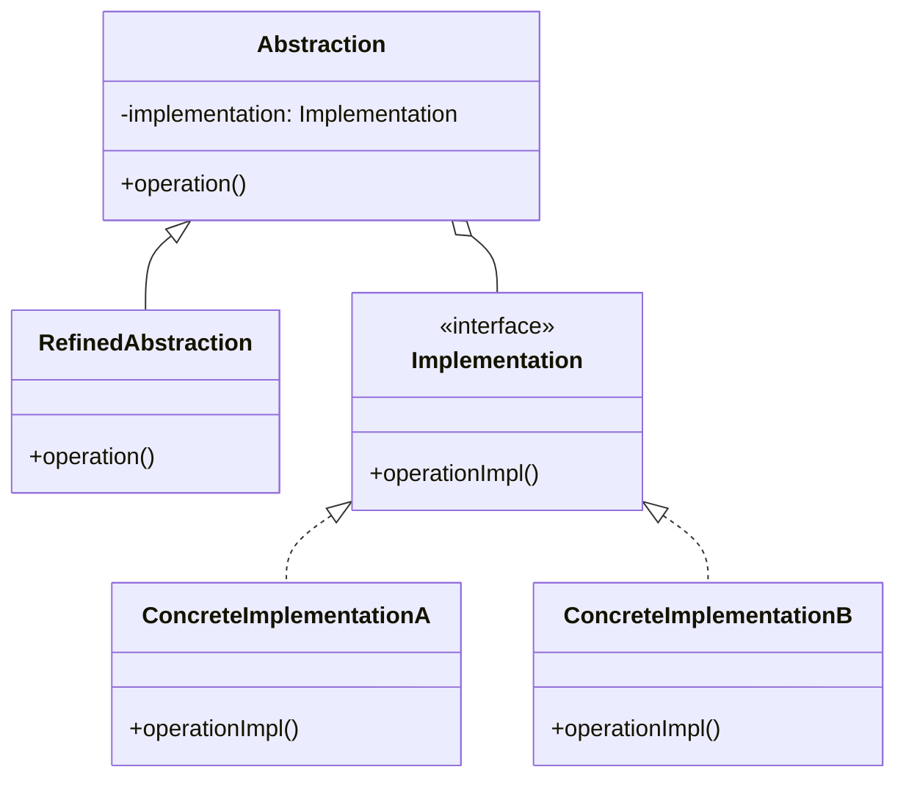
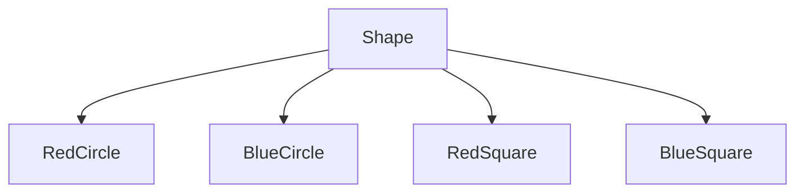
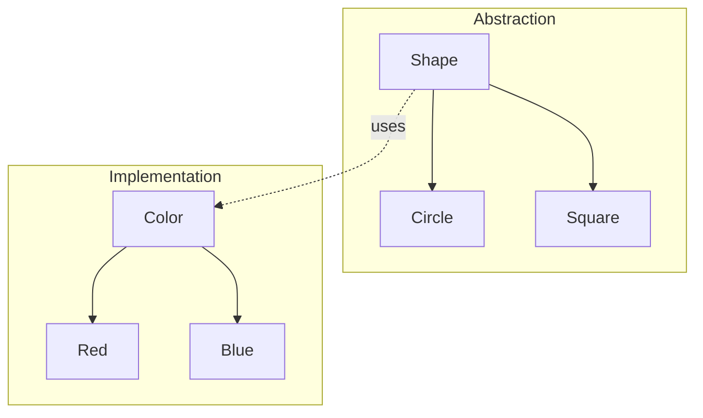
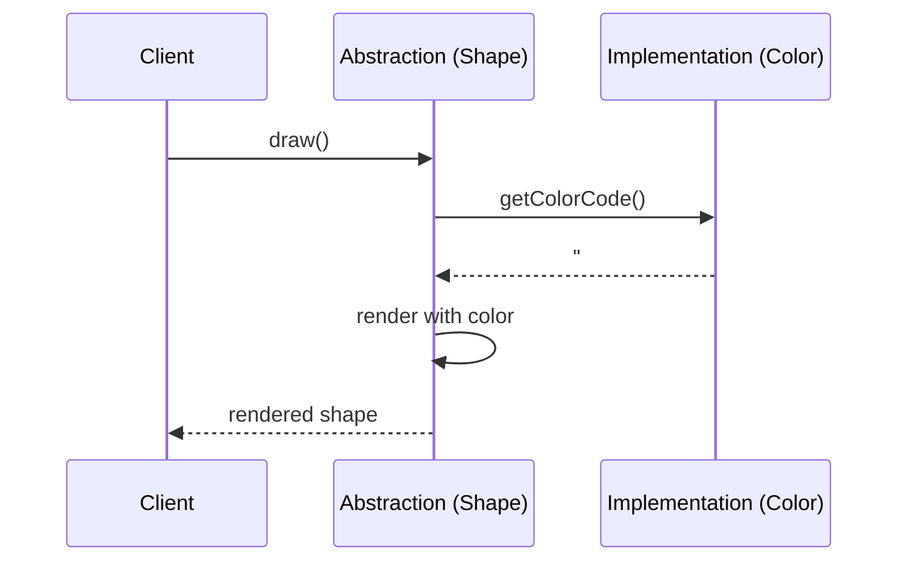
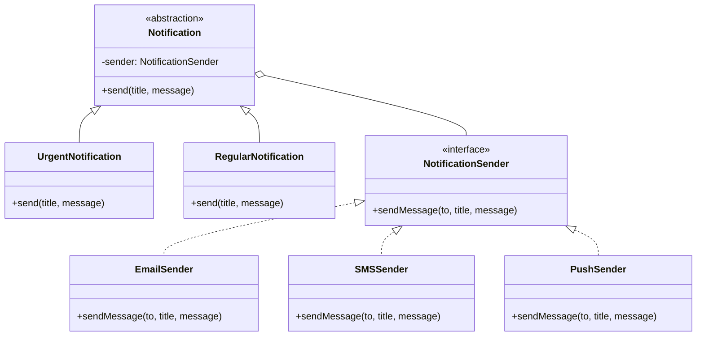

# Bridge Pattern

## Intent

**Bridge** is a structural design pattern that lets you split a large class or a set of closely related classes into two separate hierarchies—abstraction and implementation—which can be developed independently of each other.



---

## Problem It Solves

Imagine you have a `Shape` class with two subclasses: `Circle` and `Square`. Now you want to add colors: `Red` and `Blue`. Without Bridge, you'd need:



That's 4 classes. Adding a new shape or color means exponential growth!

With Bridge, you separate shape and color:



Now you have 4 classes that can be combined freely: 2 shapes × 2 colors = 4 combinations, but only 4 classes to maintain.

---

## Solution

Bridge suggests extracting dimensions of variation into separate class hierarchies:

1. **Abstraction** (Shape): High-level control layer
2. **Implementation** (Color): Low-level work layer

The abstraction delegates work to the implementation object.



---

## Structure



---

## Implementation

<Tabs items={["Basic Bridge", "UI Rendering", "Database Abstraction", "Real-World: Notifications"]}>
  <Tab value="Basic Bridge">
```typescript
/**
 * Implementation interface (the "bridge")
 * @description Defines how shapes are rendered to different outputs
 */
interface Renderer {
  /** Render a circle at position with radius */
  renderCircle: (x: number, y: number, radius: number) => void;
  /** Render a square at position with side length */
  renderSquare: (x: number, y: number, side: number) => void;
}

/**
 * SVG Renderer - outputs SVG markup
 * @description Concrete implementation for SVG rendering
 */
const createSVGRenderer = (): Renderer => ({
  renderCircle: (x, y, radius) => {
    console.log(`<circle cx="${x}" cy="${y}" r="${radius}" />`);
  },
  renderSquare: (x, y, side) => {
    console.log(`<rect x="${x}" y="${y}" width="${side}" height="${side}" />`);
  },
});

/**
 * Canvas Renderer - outputs Canvas API calls
 * @description Concrete implementation for Canvas 2D context
 */
const createCanvasRenderer = (): Renderer => ({
  renderCircle: (x, y, radius) => {
    console.log(`ctx.beginPath(); ctx.arc(${x}, ${y}, ${radius}, 0, Math.PI * 2); ctx.stroke();`);
  },
  renderSquare: (x, y, side) => {
    console.log(`ctx.strokeRect(${x}, ${y}, ${side}, ${side});`);
  },
});

/**
 * WebGL Renderer - outputs WebGL commands
 * @description Concrete implementation for WebGL context
 */
const createWebGLRenderer = (): Renderer => ({
  renderCircle: (x, y, radius) => {
    console.log(`[WebGL] Drawing circle at (${x}, ${y}) with radius ${radius}`);
  },
  renderSquare: (x, y, side) => {
    console.log(`[WebGL] Drawing square at (${x}, ${y}) with side ${side}`);
  },
});

/**
 * Shape abstraction - high-level shape operations
 * @description Uses a Renderer to draw itself (bridge pattern)
 */
interface Shape {
  /** The renderer used to draw this shape */
  renderer: Renderer;
  /** Draw the shape using the current renderer */
  draw: () => void;
  /** Resize the shape by a factor */
  resize: (factor: number) => void;
}

/**
 * Circle - refined abstraction
 * @description A circle shape that delegates rendering to a Renderer
 */
const createCircle = (x: number, y: number, radius: number, renderer: Renderer): Shape => {
  let currentRadius = radius;
  
  return {
    renderer,
    draw: () => {
      renderer.renderCircle(x, y, currentRadius);
    },
    resize: (factor) => {
      currentRadius *= factor;
    },
  };
};

/**
 * Square - refined abstraction  
 * @description A square shape that delegates rendering to a Renderer
 */
const createSquare = (x: number, y: number, side: number, renderer: Renderer): Shape => {
  let currentSide = side;
  
  return {
    renderer,
    draw: () => {
      renderer.renderSquare(x, y, currentSide);
    },
    resize: (factor) => {
      currentSide *= factor;
    },
  };
};

// Usage - combine any shape with any renderer
const svgRenderer = createSVGRenderer();
const canvasRenderer = createCanvasRenderer();

const svgCircle = createCircle(100, 100, 50, svgRenderer);
svgCircle.draw(); // SVG output

const canvasSquare = createSquare(200, 200, 100, canvasRenderer);
canvasSquare.draw(); // Canvas output

// Switch renderer at runtime
const webglRenderer = createWebGLRenderer();
const webglCircle = createCircle(150, 150, 75, webglRenderer);
webglCircle.draw();
//          ^?
```
  </Tab>
  <Tab value="UI Rendering">
```ts
// Implementation: Platform-specific rendering
interface UIImplementation {
  renderButton: (label: string, onClick: () => void) => string;
  renderInput: (placeholder: string, value: string) => string;
  renderModal: (title: string, content: string) => string;
  renderList: (items: string[]) => string;
}

// Web Implementation
const createWebUI = (): UIImplementation => ({
  renderButton: (label, onClick) => 
    `<button onclick="handleClick()">${label}</button>`,
  renderInput: (placeholder, value) => 
    `<input placeholder="${placeholder}" value="${value}" />`,
  renderModal: (title, content) => 
    `<div class="modal"><h2>${title}</h2><p>${content}</p></div>`,
  renderList: (items) => 
    `<ul>${items.map(i => `<li>${i}</li>`).join("")}</ul>`,
});

// React Native Implementation
const createMobileUI = (): UIImplementation => ({
  renderButton: (label, onClick) => 
    `<TouchableOpacity onPress={handlePress}><Text>${label}</Text></TouchableOpacity>`,
  renderInput: (placeholder, value) => 
    `<TextInput placeholder="${placeholder}" value="${value}" />`,
  renderModal: (title, content) => 
    `<Modal><View><Text style={styles.title}>${title}</Text><Text>${content}</Text></View></Modal>`,
  renderList: (items) => 
    `<FlatList data={[${items.map(i => `"${i}"`).join(",")}]} />`,
});

// Terminal Implementation
const createTerminalUI = (): UIImplementation => ({
  renderButton: (label) => `[ ${label} ]`,
  renderInput: (placeholder, value) => `> ${value || placeholder}: _`,
  renderModal: (title, content) => 
    `╔══════════════════╗\n║ ${title}\n╟──────────────────╢\n║ ${content}\n╚══════════════════╝`,
  renderList: (items) => items.map((i, idx) => `${idx + 1}. ${i}`).join("\n"),
});

// Abstraction: Form components
interface FormComponent {
  render: () => string;
}

interface LoginForm extends FormComponent {
  setEmail: (email: string) => void;
  setPassword: (password: string) => void;
  onSubmit: (handler: () => void) => void;
}

const createLoginForm = (ui: UIImplementation): LoginForm => {
  let email = "";
  let password = "";
  let submitHandler: () => void = () => {};
  
  return {
    setEmail: (e) => { email = e; },
    setPassword: (p) => { password = p; },
    onSubmit: (handler) => { submitHandler = handler; },
    render: () => {
      const emailInput = ui.renderInput("Email", email);
      const passwordInput = ui.renderInput("Password", password);
      const submitButton = ui.renderButton("Login", submitHandler);
      
      return `${emailInput}\n${passwordInput}\n${submitButton}`;
    },
  };
};

interface SettingsPanel extends FormComponent {
  setOptions: (options: string[]) => void;
}

const createSettingsPanel = (ui: UIImplementation): SettingsPanel => {
  let options: string[] = [];
  
  return {
    setOptions: (opts) => { options = opts; },
    render: () => {
      const modal = ui.renderModal("Settings", ui.renderList(options));
      const saveButton = ui.renderButton("Save", () => {});
      return `${modal}\n${saveButton}`;
    },
  };
};

// Usage - same components, different platforms
const webForm = createLoginForm(createWebUI());
webForm.setEmail("user@example.com");
console.log("Web:\n", webForm.render());

const mobileForm = createLoginForm(createMobileUI());
mobileForm.setEmail("user@example.com");
console.log("\nMobile:\n", mobileForm.render());

const terminalForm = createLoginForm(createTerminalUI());
terminalForm.setEmail("user@example.com");
console.log("\nTerminal:\n", terminalForm.render());
```
  </Tab>
  <Tab value="Database Abstraction">
```typescript
// @noErrors
// Implementation: Database drivers
interface DatabaseDriver {
  connect: () => Promise<void>;
  disconnect: () => Promise<void>;
  execute: (query: string, params?: unknown[]) => Promise<unknown[]>;
  beginTransaction: () => Promise<void>;
  commit: () => Promise<void>;
  rollback: () => Promise<void>;
}

// PostgreSQL Driver
const createPostgresDriver = (connectionString: string): DatabaseDriver => {
  let connected = false;
  
  return {
    connect: async () => {
      console.log(`[PostgreSQL] Connecting to ${connectionString}`);
      connected = true;
    },
    disconnect: async () => {
      console.log("[PostgreSQL] Disconnected");
      connected = false;
    },
    execute: async (query, params) => {
      console.log(`[PostgreSQL] ${query}`, params);
      return [];
    },
    beginTransaction: async () => {
      console.log("[PostgreSQL] BEGIN");
    },
    commit: async () => {
      console.log("[PostgreSQL] COMMIT");
    },
    rollback: async () => {
      console.log("[PostgreSQL] ROLLBACK");
    },
  };
};

// SQLite Driver
const createSQLiteDriver = (dbPath: string): DatabaseDriver => {
  return {
    connect: async () => {
      console.log(`[SQLite] Opening ${dbPath}`);
    },
    disconnect: async () => {
      console.log("[SQLite] Closed");
    },
    execute: async (query, params) => {
      console.log(`[SQLite] ${query}`, params);
      return [];
    },
    beginTransaction: async () => {
      console.log("[SQLite] BEGIN TRANSACTION");
    },
    commit: async () => {
      console.log("[SQLite] COMMIT");
    },
    rollback: async () => {
      console.log("[SQLite] ROLLBACK");
    },
  };
};

// Abstraction: Repository
interface Repository<T> {
  findById: (id: string) => Promise<T | null>;
  findAll: () => Promise<T[]>;
  create: (entity: Omit<T, "id">) => Promise<T>;
  update: (id: string, entity: Partial<T>) => Promise<T>;
  delete: (id: string) => Promise<boolean>;
}

interface User {
  id: string;
  name: string;
  email: string;
  createdAt: Date;
}

// Refined Abstraction: UserRepository
const createUserRepository = (driver: DatabaseDriver): Repository<User> => ({
  findById: async (id) => {
    const [user] = await driver.execute(
      "SELECT * FROM users WHERE id = $1",
      [id]
    );
    return user as User | null;
  },
  
  findAll: async () => {
    const users = await driver.execute("SELECT * FROM users");
    return users as User[];
  },
  
  create: async (entity) => {
    const id = crypto.randomUUID();
    await driver.execute(
      "INSERT INTO users (id, name, email, created_at) VALUES ($1, $2, $3, $4)",
      [id, entity.name, entity.email, new Date()]
    );
    return { id, ...entity, createdAt: new Date() } as User;
  },
  
  update: async (id, entity) => {
    const sets = Object.entries(entity)
      .map(([key], i) => `${key} = $${i + 2}`)
      .join(", ");
    await driver.execute(
      `UPDATE users SET ${sets} WHERE id = $1`,
      [id, ...Object.values(entity)]
    );
    return { id, ...entity } as User;
  },
  
  delete: async (id) => {
    await driver.execute("DELETE FROM users WHERE id = $1", [id]);
    return true;
  },
});

// Refined Abstraction: TransactionalRepository
const createTransactionalUserRepository = (
  driver: DatabaseDriver
): Repository<User> & { withTransaction: <T>(fn: () => Promise<T>) => Promise<T> } => {
  const base = createUserRepository(driver);
  
  return {
    ...base,
    withTransaction: async <T>(fn: () => Promise<T>): Promise<T> => {
      await driver.beginTransaction();
      try {
        const result = await fn();
        await driver.commit();
        return result;
      } catch (error) {
        await driver.rollback();
        throw error;
      }
    },
  };
};

// Usage
const postgresDriver = createPostgresDriver("postgresql://localhost/mydb");
const sqliteDriver = createSQLiteDriver("./test.db");

// Same repository abstraction, different drivers
const prodUserRepo = createTransactionalUserRepository(postgresDriver);
const testUserRepo = createUserRepository(sqliteDriver);

// Application code doesn't know which database is used
const createUserWithTransaction = async (repo: typeof prodUserRepo) => {
  return repo.withTransaction(async () => {
    const user = await repo.create({ name: "John", email: "john@example.com" });
    console.log("Created user:", user);
    return user;
  });
};
```
  </Tab>
  <Tab value="Real-World: Notifications">
```ts
// Implementation: Message delivery mechanisms
interface MessageSender {
  send: (recipient: string, subject: string, body: string) => Promise<{ id: string; status: string }>;
  getDeliveryStatus: (messageId: string) => Promise<string>;
}

// Email Sender
const createEmailSender = (apiKey: string): MessageSender => ({
  send: async (recipient, subject, body) => {
    console.log(`[Email] Sending to ${recipient}: ${subject}`);
    return { id: `email_${Date.now()}`, status: "sent" };
  },
  getDeliveryStatus: async (messageId) => {
    return "delivered";
  },
});

// SMS Sender
const createSMSSender = (accountSid: string): MessageSender => ({
  send: async (recipient, subject, body) => {
    console.log(`[SMS] Sending to ${recipient}: ${body.substring(0, 160)}`);
    return { id: `sms_${Date.now()}`, status: "queued" };
  },
  getDeliveryStatus: async (messageId) => {
    return "delivered";
  },
});

// Push Notification Sender
const createPushSender = (serverKey: string): MessageSender => ({
  send: async (recipient, subject, body) => {
    console.log(`[Push] Sending to device ${recipient}: ${subject}`);
    return { id: `push_${Date.now()}`, status: "sent" };
  },
  getDeliveryStatus: async (messageId) => {
    return "received";
  },
});

// Slack Sender
const createSlackSender = (webhookUrl: string): MessageSender => ({
  send: async (recipient, subject, body) => {
    console.log(`[Slack] Sending to #${recipient}: ${subject}`);
    return { id: `slack_${Date.now()}`, status: "sent" };
  },
  getDeliveryStatus: async (messageId) => {
    return "delivered";
  },
});

// Abstraction: Notification types
interface Notification {
  notify: (recipient: string) => Promise<void>;
}

// Regular Notification
const createRegularNotification = (
  sender: MessageSender,
  title: string,
  message: string
): Notification => ({
  notify: async (recipient) => {
    await sender.send(recipient, title, message);
    console.log(`Regular notification sent to ${recipient}`);
  },
});

// Urgent Notification (retries, multiple channels)
const createUrgentNotification = (
  primarySender: MessageSender,
  fallbackSender: MessageSender,
  title: string,
  message: string
): Notification => ({
  notify: async (recipient) => {
    const urgentTitle = `🚨 URGENT: ${title}`;
    const urgentMessage = `[REQUIRES IMMEDIATE ATTENTION]\n\n${message}`;
    
    // Try primary channel
    const result = await primarySender.send(recipient, urgentTitle, urgentMessage);
    
    // Also send via fallback for redundancy
    await fallbackSender.send(recipient, urgentTitle, urgentMessage);
    
    console.log(`Urgent notification sent to ${recipient} via multiple channels`);
  },
});

// Scheduled Notification
const createScheduledNotification = (
  sender: MessageSender,
  title: string,
  message: string,
  scheduledTime: Date
): Notification => ({
  notify: async (recipient) => {
    const delay = scheduledTime.getTime() - Date.now();
    if (delay > 0) {
      console.log(`Scheduling notification for ${scheduledTime.toISOString()}`);
      await new Promise(resolve => setTimeout(resolve, Math.min(delay, 1000)));
    }
    await sender.send(recipient, title, message);
    console.log(`Scheduled notification sent to ${recipient}`);
  },
});

// Batch Notification
const createBatchNotification = (
  sender: MessageSender,
  title: string,
  message: string
): Notification & { addRecipient: (r: string) => void } => {
  const recipients: string[] = [];
  
  return {
    addRecipient: (r) => recipients.push(r),
    notify: async () => {
      console.log(`Sending batch notification to ${recipients.length} recipients`);
      await Promise.all(
        recipients.map(r => sender.send(r, title, message))
      );
    },
  };
};

// Usage - mix any notification type with any sender
const emailSender = createEmailSender("api_key");
const smsSender = createSMSSender("account_sid");
const pushSender = createPushSender("server_key");
const slackSender = createSlackSender("webhook_url");

// Regular email notification
const welcomeEmail = createRegularNotification(
  emailSender,
  "Welcome to our platform!",
  "Thanks for signing up."
);
await welcomeEmail.notify("user@example.com");

// Urgent notification via email + SMS
const securityAlert = createUrgentNotification(
  emailSender,
  smsSender,
  "Security Alert",
  "Unusual login detected on your account."
);
await securityAlert.notify("user@example.com");

// Scheduled push notification
const reminder = createScheduledNotification(
  pushSender,
  "Meeting Reminder",
  "Your meeting starts in 15 minutes",
  new Date(Date.now() + 15 * 60 * 1000)
);

// Batch Slack notification
const announcement = createBatchNotification(
  slackSender,
  "System Maintenance",
  "Scheduled maintenance tonight at 10 PM"
);
announcement.addRecipient("engineering");
announcement.addRecipient("product");
announcement.addRecipient("general");
await announcement.notify(""); // recipient from batch list
```
  </Tab>
</Tabs>

---

## When to Use

<Accordions>
  <Accordion title="✅ Use Bridge when...">
    - **Two dimensions of variation**: When you have orthogonal dimensions that can vary independently (e.g., shapes × colors, platforms × features)
    
    - **Runtime switching**: When you need to switch implementations at runtime
    
    - **Platform independence**: When building cross-platform applications
    
    - **Avoiding class explosion**: When inheritance creates too many class combinations
    
    - **Hiding implementation details**: When you want to hide implementation from clients
  </Accordion>
  
  <Accordion title="❌ Avoid Bridge when...">
    - **Single dimension**: If you only have one dimension of variation, simpler patterns work
    
    - **Stable implementations**: If implementations rarely change
    
    - **Overkill**: For simple cases, it adds unnecessary complexity
  </Accordion>
</Accordions>

---

## Bridge vs Adapter

| Aspect | Bridge | Adapter |
|--------|--------|---------|
| **Intent** | Separate abstraction from implementation | Make incompatible interfaces work together |
| **When designed** | Up-front, before implementation | After the fact, to integrate existing code |
| **Flexibility** | Both hierarchies can evolve | Fixes existing interface mismatch |
| **Complexity** | Higher (two hierarchies) | Lower (single wrapper) |

---

## Real-World Applications

| Application | Bridge Usage |
|-------------|--------------|
| **Cross-platform apps** | Platform abstraction + Feature implementation |
| **Graphics libraries** | Shape abstraction + Renderer implementation |
| **Database layers** | Repository abstraction + Driver implementation |
| **Notification systems** | Notification type + Delivery channel |
| **Device drivers** | Device abstraction + OS implementation |

---

## Summary

<Callout type="info">
  **Key Takeaway**: Bridge is designed up-front to let two class hierarchies evolve independently. It's particularly useful when you have multiple orthogonal dimensions of variation.
</Callout>

### Pros
- ✅ Platform-independent abstractions and implementations
- ✅ Open/Closed: Extend either hierarchy independently
- ✅ Single Responsibility: Focus on high-level logic in abstraction
- ✅ Hide implementation details from clients

### Cons
- ❌ Increased complexity with two hierarchies
- ❌ Might be overkill for simple applications
