# Composite Pattern

## Intent

**Composite** is a structural design pattern that lets you compose objects into tree structures to represent part-whole hierarchies. Composite lets clients treat individual objects and compositions of objects uniformly.


---

## Problem It Solves

Imagine you're building a file system representation. You have files and folders. Folders can contain files or other folders. How do you calculate the total size?

Without Composite:


This creates complex conditional logic throughout your code. Every operation needs to handle files and folders differently.

---

## Solution

Composite pattern treats both files and folders through a common interface:

```mermaid
flowchart TD
    subgraph "Composite Structure"
        Folder1[📁 Root]
        Folder2[📁 src]
        Folder3[📁 docs]
        File1[📄 index.ts]
        File2[📄 app.ts]
        File3[📄 README.md]
        
        Folder1 --> Folder2
        Folder1 --> Folder3
        Folder2 --> File1
        Folder2 --> File2
        Folder3 --> File3
    end
    
    style Folder1 fill:#E3F2FD
    style Folder2 fill:#E3F2FD
    style Folder3 fill:#E3F2FD
```



Both files (leaves) and folders (composites) implement the same `getSize()` method. Folders delegate to their children and sum the results.

---

## Structure


---

## Implementation

<Tabs items={["File System", "UI Components", "Menu System", "Real-World: Org Chart"]}>
  <Tab value="File System">
```ts
// Component interface
interface FileSystemNode {
  name: string;
  getSize: () => number;
  isDirectory: () => boolean;
  print: (indent?: string) => void;
  find: (predicate: (node: FileSystemNode) => boolean) => FileSystemNode[];
}

// Leaf: File
const createFile = (name: string, size: number): FileSystemNode => ({
  name,
  getSize: () => size,
  isDirectory: () => false,
  print: (indent = "") => {
    console.log(`${indent}📄 ${name} (${size} bytes)`);
  },
  find: (predicate) => {
    const self: FileSystemNode = { name, getSize: () => size, isDirectory: () => false, print: () => {}, find: () => [] };
    return predicate(self) ? [self] : [];
  },
});

// Composite: Directory
const createDirectory = (name: string): FileSystemNode & {
  add: (node: FileSystemNode) => void;
  remove: (node: FileSystemNode) => void;
  getChildren: () => FileSystemNode[];
} => {
  const children: FileSystemNode[] = [];
  
  const directory: FileSystemNode & {
    add: (node: FileSystemNode) => void;
    remove: (node: FileSystemNode) => void;
    getChildren: () => FileSystemNode[];
  } = {
    name,
    getSize: () => children.reduce((sum, child) => sum + child.getSize(), 0),
    isDirectory: () => true,
    print: (indent = "") => {
      console.log(`${indent}📁 ${name}/`);
      children.forEach(child => child.print(indent + "  "));
    },
    find: (predicate) => {
      const results: FileSystemNode[] = [];
      if (predicate(directory)) {
        results.push(directory);
      }
      children.forEach(child => {
        results.push(...child.find(predicate));
      });
      return results;
    },
    add: (node) => {
      children.push(node);
    },
    remove: (node) => {
      const index = children.indexOf(node);
      if (index > -1) children.splice(index, 1);
    },
    getChildren: () => [...children],
  };
  
  return directory;
};

// Build a file system tree
const root = createDirectory("project");

const src = createDirectory("src");
src.add(createFile("index.ts", 1024));
src.add(createFile("app.ts", 2048));

const components = createDirectory("components");
components.add(createFile("Button.tsx", 512));
components.add(createFile("Modal.tsx", 1024));
src.add(components);

const docs = createDirectory("docs");
docs.add(createFile("README.md", 256));
docs.add(createFile("CHANGELOG.md", 512));

root.add(src);
root.add(docs);
root.add(createFile("package.json", 128));

// Operations work uniformly on files and directories
root.print();

const totalSize = root.getSize();

console.log("\nTotal size:", totalSize, "bytes");

// Find all TypeScript files
const tsFiles = root.find(node => node.name.endsWith(".ts"));
console.log("\nTypeScript files:", tsFiles.map(f => f.name));
```
  </Tab>
  <Tab value="UI Components">
```ts
// Component interface for UI elements
interface UIComponent {
  id: string;
  render: () => string;
  getBoundingBox: () => { width: number; height: number };
  onClick: (handler: () => void) => void;
}

// Leaf: Button
const createButton = (id: string, label: string, width = 100, height = 40): UIComponent => {
  let clickHandler: () => void = () => {};
  
  return {
    id,
    render: () => `<button id="${id}" style="width:${width}px;height:${height}px">${label}</button>`,
    getBoundingBox: () => ({ width, height }),
    onClick: (handler) => { clickHandler = handler; },
  };
};

// Leaf: Input
const createInput = (id: string, placeholder: string, width = 200, height = 36): UIComponent => {
  return {
    id,
    render: () => `<input id="${id}" placeholder="${placeholder}" style="width:${width}px;height:${height}px" />`,
    getBoundingBox: () => ({ width, height }),
    onClick: () => {},
  };
};

// Leaf: Text
const createText = (id: string, content: string, width = 150, height = 20): UIComponent => {
  return {
    id,
    render: () => `<span id="${id}" style="width:${width}px">${content}</span>`,
    getBoundingBox: () => ({ width, height }),
    onClick: () => {},
  };
};

// Composite: Container (Panel, Form, etc.)
type Layout = "vertical" | "horizontal" | "grid";

const createContainer = (
  id: string,
  layout: Layout = "vertical",
  padding = 10
): UIComponent & {
  add: (component: UIComponent) => void;
  remove: (id: string) => void;
  getChildren: () => UIComponent[];
} => {
  const children: UIComponent[] = [];
  
  const container: UIComponent & {
    add: (component: UIComponent) => void;
    remove: (id: string) => void;
    getChildren: () => UIComponent[];
  } = {
    id,
    render: () => {
      const direction = layout === "horizontal" ? "row" : "column";
      const childrenHtml = children.map(c => c.render()).join("\n  ");
      return `<div id="${id}" style="display:flex;flex-direction:${direction};padding:${padding}px;gap:${padding}px">
  ${childrenHtml}
</div>`;
    },
    getBoundingBox: () => {
      const childBoxes = children.map(c => c.getBoundingBox());
      
      if (layout === "horizontal") {
        return {
          width: childBoxes.reduce((sum, b) => sum + b.width, 0) + (children.length + 1) * padding,
          height: Math.max(...childBoxes.map(b => b.height), 0) + padding * 2,
        };
      }
      return {
        width: Math.max(...childBoxes.map(b => b.width), 0) + padding * 2,
        height: childBoxes.reduce((sum, b) => sum + b.height, 0) + (children.length + 1) * padding,
      };
    },
    onClick: (handler) => {
      children.forEach(c => c.onClick(handler));
    },
    add: (component) => {
      children.push(component);
    },
    remove: (targetId) => {
      const index = children.findIndex(c => c.id === targetId);
      if (index > -1) children.splice(index, 1);
    },
    getChildren: () => [...children],
  };
  
  return container;
};

// Build a complex form
const loginForm = createContainer("login-form", "vertical");

const headerRow = createContainer("header", "horizontal");
headerRow.add(createText("title", "Login to your account"));
loginForm.add(headerRow);

const emailRow = createContainer("email-row", "vertical");
emailRow.add(createText("email-label", "Email:"));
emailRow.add(createInput("email-input", "Enter your email"));
loginForm.add(emailRow);

const passwordRow = createContainer("password-row", "vertical");
passwordRow.add(createText("password-label", "Password:"));
passwordRow.add(createInput("password-input", "Enter your password"));
loginForm.add(passwordRow);

const buttonRow = createContainer("buttons", "horizontal");
buttonRow.add(createButton("cancel-btn", "Cancel"));
buttonRow.add(createButton("login-btn", "Login", 120));
loginForm.add(buttonRow);

// Render the entire component tree
console.log(loginForm.render());

// Get total bounding box
const box = loginForm.getBoundingBox();
console.log(`\nForm size: ${box.width}x${box.height}px`);
```
  </Tab>
  <Tab value="Menu System">
```ts
// Component: Menu item interface
interface MenuItem {
  name: string;
  getPrice: () => number;
  print: (indent?: string) => void;
  isVegetarian: () => boolean;
}

// Leaf: Simple menu item
const createSimpleItem = (
  name: string,
  price: number,
  vegetarian: boolean
): MenuItem => ({
  name,
  getPrice: () => price,
  print: (indent = "") => {
    const vegLabel = vegetarian ? " 🥬" : "";
    console.log(`${indent}• ${name}${vegLabel} - $${price.toFixed(2)}`);
  },
  isVegetarian: () => vegetarian,
});

// Composite: Combo meal or menu category
const createComboMeal = (
  name: string,
  discount: number = 0
): MenuItem & {
  add: (item: MenuItem) => void;
  getItems: () => MenuItem[];
} => {
  const items: MenuItem[] = [];
  
  return {
    name,
    getPrice: () => {
      const subtotal = items.reduce((sum, item) => sum + item.getPrice(), 0);
      return subtotal * (1 - discount);
    },
    print: (indent = "") => {
      console.log(`${indent}📦 ${name}:`);
      items.forEach(item => item.print(indent + "  "));
      const subtotal = items.reduce((sum, item) => sum + item.getPrice(), 0);
      if (discount > 0) {
        console.log(`${indent}  Subtotal: $${subtotal.toFixed(2)}`);
        console.log(`${indent}  Discount: -$${(subtotal * discount).toFixed(2)}`);
      }
    },
    isVegetarian: () => items.every(item => item.isVegetarian()),
    add: (item) => items.push(item),
    getItems: () => [...items],
  };
};

// Composite: Menu category
const createMenuCategory = (name: string): MenuItem & {
  add: (item: MenuItem) => void;
  getVegetarianItems: () => MenuItem[];
} => {
  const items: MenuItem[] = [];
  
  return {
    name,
    getPrice: () => items.reduce((sum, item) => sum + item.getPrice(), 0),
    print: (indent = "") => {
      console.log(`${indent}═══ ${name.toUpperCase()} ═══`);
      items.forEach(item => item.print(indent));
    },
    isVegetarian: () => items.every(item => item.isVegetarian()),
    add: (item) => items.push(item),
    getVegetarianItems: () => items.filter(item => item.isVegetarian()),
  };
};

// Build a restaurant menu
const menu = createMenuCategory("Main Menu");

// Appetizers
const appetizers = createMenuCategory("Appetizers");
appetizers.add(createSimpleItem("Spring Rolls", 5.99, true));
appetizers.add(createSimpleItem("Buffalo Wings", 8.99, false));
appetizers.add(createSimpleItem("Garlic Bread", 4.99, true));
menu.add(appetizers);

// Main Courses
const mains = createMenuCategory("Main Courses");
mains.add(createSimpleItem("Grilled Salmon", 18.99, false));
mains.add(createSimpleItem("Vegetable Stir Fry", 14.99, true));
mains.add(createSimpleItem("Beef Burger", 12.99, false));

// Combo meal
const lunchSpecial = createComboMeal("Lunch Special (15% off)", 0.15);
lunchSpecial.add(createSimpleItem("Soup of the Day", 4.99, true));
lunchSpecial.add(createSimpleItem("Caesar Salad", 7.99, true));
lunchSpecial.add(createSimpleItem("Iced Tea", 2.99, true));
mains.add(lunchSpecial);

menu.add(mains);

// Desserts
const desserts = createMenuCategory("Desserts");
desserts.add(createSimpleItem("Chocolate Cake", 6.99, true));
desserts.add(createSimpleItem("Ice Cream Sundae", 5.99, true));
menu.add(desserts);

// Print entire menu
menu.print();

// Calculate total menu value
console.log(`\nTotal menu value: $${menu.getPrice().toFixed(2)}`);

// Get vegetarian options
console.log("\n🥬 Vegetarian options:");
const vegItems = appetizers.getVegetarianItems();
vegItems.forEach(item => console.log(`  • ${item.name}`));
```
  </Tab>
  <Tab value="Real-World: Org Chart">
```ts
// Component: Organization member
interface OrgMember {
  id: string;
  name: string;
  title: string;
  getSalaryBudget: () => number;
  getHeadcount: () => number;
  findByTitle: (title: string) => OrgMember[];
  print: (indent?: string) => void;
}

// Leaf: Individual contributor
const createEmployee = (
  id: string,
  name: string,
  title: string,
  salary: number
): OrgMember => ({
  id,
  name,
  title,
  getSalaryBudget: () => salary,
  getHeadcount: () => 1,
  findByTitle: (searchTitle) => 
    title.toLowerCase().includes(searchTitle.toLowerCase()) 
      ? [{ id, name, title, getSalaryBudget: () => salary, getHeadcount: () => 1, findByTitle: () => [], print: () => {} }] 
      : [],
  print: (indent = "") => {
    console.log(`${indent}👤 ${name} - ${title} ($${salary.toLocaleString()})`);
  },
});

// Composite: Manager with direct reports
const createManager = (
  id: string,
  name: string,
  title: string,
  salary: number
): OrgMember & {
  addReport: (member: OrgMember) => void;
  removeReport: (memberId: string) => void;
  getDirectReports: () => OrgMember[];
} => {
  const directReports: OrgMember[] = [];
  
  const manager: OrgMember & {
    addReport: (member: OrgMember) => void;
    removeReport: (memberId: string) => void;
    getDirectReports: () => OrgMember[];
  } = {
    id,
    name,
    title,
    getSalaryBudget: () => {
      const reportsBudget = directReports.reduce((sum, r) => sum + r.getSalaryBudget(), 0);
      return salary + reportsBudget;
    },
    getHeadcount: () => {
      return 1 + directReports.reduce((sum, r) => sum + r.getHeadcount(), 0);
    },
    findByTitle: (searchTitle) => {
      const results: OrgMember[] = [];
      if (title.toLowerCase().includes(searchTitle.toLowerCase())) {
        results.push(manager);
      }
      directReports.forEach(report => {
        results.push(...report.findByTitle(searchTitle));
      });
      return results;
    },
    print: (indent = "") => {
      const budget = manager.getSalaryBudget();
      const count = manager.getHeadcount();
      console.log(`${indent}👔 ${name} - ${title}`);
      console.log(`${indent}   Budget: $${budget.toLocaleString()} | Team: ${count} people`);
      directReports.forEach(report => report.print(indent + "   "));
    },
    addReport: (member) => {
      directReports.push(member);
    },
    removeReport: (memberId) => {
      const index = directReports.findIndex(r => r.id === memberId);
      if (index > -1) directReports.splice(index, 1);
    },
    getDirectReports: () => [...directReports],
  };
  
  return manager;
};

// Build organization structure
const ceo = createManager("ceo", "Alice Johnson", "CEO", 500000);

// Engineering department
const vpEng = createManager("vp-eng", "Bob Smith", "VP of Engineering", 300000);

const engManager1 = createManager("eng-mgr-1", "Carol White", "Engineering Manager", 180000);
engManager1.addReport(createEmployee("dev-1", "David Lee", "Senior Developer", 150000));
engManager1.addReport(createEmployee("dev-2", "Eve Brown", "Developer", 120000));
engManager1.addReport(createEmployee("dev-3", "Frank Wilson", "Junior Developer", 80000));

const engManager2 = createManager("eng-mgr-2", "Grace Kim", "Engineering Manager", 180000);
engManager2.addReport(createEmployee("dev-4", "Henry Zhang", "Senior Developer", 150000));
engManager2.addReport(createEmployee("dev-5", "Iris Patel", "Developer", 120000));

vpEng.addReport(engManager1);
vpEng.addReport(engManager2);
vpEng.addReport(createEmployee("devops-1", "Jack Murphy", "DevOps Engineer", 140000));

// Product department
const vpProduct = createManager("vp-prod", "Karen Davis", "VP of Product", 280000);
vpProduct.addReport(createEmployee("pm-1", "Leo Martinez", "Senior PM", 160000));
vpProduct.addReport(createEmployee("pm-2", "Maria Garcia", "PM", 130000));
vpProduct.addReport(createEmployee("design-1", "Nick Taylor", "Senior Designer", 140000));

ceo.addReport(vpEng);
ceo.addReport(vpProduct);
ceo.addReport(createEmployee("cfo", "Oscar Anderson", "CFO", 350000));

// Print org chart
console.log("=== ORGANIZATION CHART ===\n");
ceo.print();

// Calculate total company headcount and budget
console.log("\n=== COMPANY STATS ===");
console.log(`Total headcount: ${ceo.getHeadcount()}`);
console.log(`Total salary budget: $${ceo.getSalaryBudget().toLocaleString()}`);

// Find all managers
console.log("\n=== ALL MANAGERS ===");
const managers = ceo.findByTitle("Manager");
managers.forEach(m => console.log(`• ${m.name} - ${m.title}`));

// Engineering department budget
console.log("\n=== ENGINEERING BUDGET ===");
console.log(`VP Engineering org budget: $${vpEng.getSalaryBudget().toLocaleString()}`);
console.log(`VP Engineering org headcount: ${vpEng.getHeadcount()}`);
```
  </Tab>
</Tabs>

---

## When to Use

<Accordions>
  <Accordion title="✅ Use Composite when...">
    - **Tree structures**: When you need to implement a tree-like object structure
    
    - **Uniform treatment**: When you want clients to treat both simple and complex elements uniformly
    
    - **Part-whole hierarchies**: When you have part-whole hierarchies (files/folders, menus, org charts)
    
    - **Recursive composition**: When objects can be composed of other objects of the same type
    
    - **Aggregate operations**: When you need to perform operations on an entire structure
  </Accordion>
  
  <Accordion title="❌ Avoid Composite when...">
    - **Flat structures**: When your objects don't form natural hierarchies
    
    - **Different behaviors**: When leaves and composites need very different interfaces
    
    - **Type safety concerns**: When you need strict type checking on what can contain what
  </Accordion>
</Accordions>

---

## Composite Variants


---

## Real-World Applications

| Application | Composite Usage |
|-------------|-----------------|
| **File Systems** | Files and directories |
| **UI Frameworks** | Widgets and containers (React, Flutter) |
| **Document Editors** | Paragraphs, sections, documents |
| **Graphics** | Shapes and groups of shapes |
| **Org Charts** | Employees and managers |
| **Menu Systems** | Items and categories |
| **Expression Trees** | Operands and operators |

---

## Summary

<Callout type="info">
  **Key Takeaway**: Composite allows you to work with tree structures by treating individual objects and compositions uniformly. The pattern is everywhere in UI frameworks and file systems.
</Callout>

### Pros
- ✅ Work with complex tree structures conveniently
- ✅ Open/Closed: Add new component types without breaking existing code
- ✅ Simplifies client code by treating all elements uniformly
- ✅ Easy to add new leaf or composite types

### Cons
- ❌ Can make design overly general
- ❌ Hard to restrict composite contents to certain types
- ❌ Leaf implementations may have dummy methods for add/remove
