# Decorator Pattern

## Intent

**Decorator** is a structural design pattern that lets you attach new behaviors to objects by placing these objects inside special wrapper objects that contain the behaviors.


---

## Problem It Solves

Imagine you're building a notification system. You start with email notifications. Then you need to add SMS, Slack, and push notifications. But what if someone wants to receive email + SMS? Or all four?

Without Decorator:


Class explosion! 2^n combinations for n notification types.

---

## Solution

Wrap the base notifier with decorator layers:

```mermaid
flowchart LR
    subgraph "Decorated Stack"
        A[Slack Decorator] --> B[SMS Decorator]
        B --> C[Email Notifier]
    end
    
    D[send notification] --> A
    A -->|wrap| B
    B -->|wrap| C
    C -->|send email| E[✉️]
    B -->|send SMS| F[📱]
    A -->|send Slack| G[💬]
```



Each decorator adds its behavior and delegates to the wrapped component.

---

## Structure


---

## Implementation

<Tabs items={["Basic Decorator", "HTTP Middleware", "Logging Decorator", "Real-World: Caching"]}>
  <Tab value="Basic Decorator">
```typescript
/**
 * Component interface - base for all coffee types
 * @description Both concrete coffees and decorators implement this
 */
interface Coffee {
  /** Get the total cost of the coffee */
  getCost: () => number;
  /** Get a description of the coffee */
  getDescription: () => string;
  /** Get list of all ingredients */
  getIngredients: () => string[];
}

/**
 * Concrete Component - Espresso
 * @description Base coffee type (1 shot of espresso)
 */
const createEspresso = (): Coffee => ({
  getCost: () => 2.00,
  getDescription: () => "Espresso",
  getIngredients: () => ["espresso"],
});

/**
 * Concrete Component - Americano
 * @description Espresso diluted with hot water
 */
const createAmericano = (): Coffee => ({
  getCost: () => 2.50,
  getDescription: () => "Americano",
  getIngredients: () => ["espresso", "water"],
});

/**
 * Base Decorator - wraps a coffee with default passthrough
 * @param coffee - The coffee to wrap
 */
const createCoffeeDecorator = (coffee: Coffee): Coffee => ({
  getCost: () => coffee.getCost(),
  getDescription: () => coffee.getDescription(),
  getIngredients: () => coffee.getIngredients(),
});

/**
 * Milk decorator - adds milk to coffee
 * @param coffee - The coffee to enhance
 */
const withMilk = (coffee: Coffee): Coffee => ({
  getCost: () => coffee.getCost() + 0.50,
  getDescription: () => `${coffee.getDescription()} + Milk`,
  getIngredients: () => [...coffee.getIngredients(), "milk"],
});

/**
 * Vanilla decorator - adds vanilla syrup
 * @param coffee - The coffee to enhance
 */
const withVanilla = (coffee: Coffee): Coffee => ({
  getCost: () => coffee.getCost() + 0.75,
  getDescription: () => `${coffee.getDescription()} + Vanilla`,
  getIngredients: () => [...coffee.getIngredients(), "vanilla syrup"],
});

/**
 * Whipped cream decorator - adds whipped cream topping
 * @param coffee - The coffee to enhance
 */
const withWhippedCream = (coffee: Coffee): Coffee => ({
  getCost: () => coffee.getCost() + 0.60,
  getDescription: () => `${coffee.getDescription()} + Whipped Cream`,
  getIngredients: () => [...coffee.getIngredients(), "whipped cream"],
});

/**
 * Extra shot decorator - adds additional espresso shot
 * @param coffee - The coffee to enhance
 */
const withExtraShot = (coffee: Coffee): Coffee => ({
  getCost: () => coffee.getCost() + 0.80,
  getDescription: () => `${coffee.getDescription()} + Extra Shot`,
  getIngredients: () => [...coffee.getIngredients(), "espresso"],
});

/**
 * Decaf decorator - replaces regular espresso with decaf
 * @param coffee - The coffee to modify
 */
const decaf = (coffee: Coffee): Coffee => ({
  getCost: () => coffee.getCost() + 0.25,
  getDescription: () => `Decaf ${coffee.getDescription()}`,
  getIngredients: () => coffee.getIngredients().map(i => 
    i === "espresso" ? "decaf espresso" : i
  ),
});

// Usage - compose decorators to build complex orders
const myOrder = withWhippedCream(
  withVanilla(
    withMilk(
      createEspresso()
    )
  )
);

console.log("Order:", myOrder.getDescription());
console.log("Cost: $" + myOrder.getCost().toFixed(2));
console.log("Ingredients:", myOrder.getIngredients());
//                          ^?

// Decaf vanilla latte with extra shot (ironic but possible!)
const complexOrder = withExtraShot(
  withVanilla(
    withMilk(
      decaf(
        createAmericano()
      )
    )
  )
);

console.log("\nComplex order:", complexOrder.getDescription());
console.log("Cost: $" + complexOrder.getCost().toFixed(2));
```
  </Tab>
  <Tab value="HTTP Middleware">
```typescript
// Component interface
interface HttpHandler {
  handle: (request: Request) => Promise<Response>;
}

interface Request {
  method: string;
  path: string;
  headers: Record<string, string>;
  body?: unknown;
  userId?: string;
  startTime?: number;
}

interface Response {
  status: number;
  body: unknown;
  headers: Record<string, string>;
}

// Base handler (endpoint)
const createApiHandler = (handler: (req: Request) => Promise<Response>): HttpHandler => ({
  handle: handler,
});

// Decorator: Logging middleware
const withLogging = (next: HttpHandler): HttpHandler => ({
  handle: async (request) => {
    const startTime = Date.now();
    console.log(`[${new Date().toISOString()}] → ${request.method} ${request.path}`);
    
    const response = await next.handle({ ...request, startTime });
    
    const duration = Date.now() - startTime;
    console.log(`[${new Date().toISOString()}] ← ${response.status} (${duration}ms)`);
    
    return response;
  },
});

// Decorator: Authentication middleware
const withAuth = (next: HttpHandler): HttpHandler => ({
  handle: async (request) => {
    const authHeader = request.headers["authorization"];
    
    if (!authHeader?.startsWith("Bearer ")) {
      return {
        status: 401,
        body: { error: "Unauthorized" },
        headers: {},
      };
    }
    
    const token = authHeader.slice(7);
    // Simulate token validation
    const userId = token === "valid-token" ? "user-123" : null;
    
    if (!userId) {
      return {
        status: 401,
        body: { error: "Invalid token" },
        headers: {},
      };
    }
    
    return next.handle({ ...request, userId });
  },
});

// Decorator: Rate limiting middleware
const withRateLimit = (maxRequests: number, windowMs: number) => {
  const requests = new Map<string, number[]>();
  
  return (next: HttpHandler): HttpHandler => ({
    handle: async (request) => {
      const key = request.userId || request.headers["x-forwarded-for"] || "anonymous";
      const now = Date.now();
      const windowStart = now - windowMs;
      
      const userRequests = (requests.get(key) || []).filter(t => t > windowStart);
      
      if (userRequests.length >= maxRequests) {
        return {
          status: 429,
          body: { error: "Too many requests" },
          headers: { "Retry-After": String(Math.ceil(windowMs / 1000)) },
        };
      }
      
      userRequests.push(now);
      requests.set(key, userRequests);
      
      return next.handle(request);
    },
  });
};

// Decorator: Error handling middleware
const withErrorHandling = (next: HttpHandler): HttpHandler => ({
  handle: async (request) => {
    try {
      return await next.handle(request);
    } catch (error) {
      console.error("Handler error:", error);
      return {
        status: 500,
        body: { error: "Internal server error" },
        headers: {},
      };
    }
  },
});

// Decorator: Response compression
const withCompression = (next: HttpHandler): HttpHandler => ({
  handle: async (request) => {
    const response = await next.handle(request);
    
    // Add compression header (in real implementation, would compress body)
    return {
      ...response,
      headers: {
        ...response.headers,
        "Content-Encoding": "gzip",
      },
    };
  },
});

// Decorator: CORS middleware
const withCors = (allowedOrigins: string[]) => (next: HttpHandler): HttpHandler => ({
  handle: async (request) => {
    const origin = request.headers["origin"];
    
    const response = await next.handle(request);
    
    if (allowedOrigins.includes(origin) || allowedOrigins.includes("*")) {
      return {
        ...response,
        headers: {
          ...response.headers,
          "Access-Control-Allow-Origin": origin || "*",
          "Access-Control-Allow-Methods": "GET, POST, PUT, DELETE",
          "Access-Control-Allow-Headers": "Content-Type, Authorization",
        },
      };
    }
    
    return response;
  },
});

// Actual endpoint handler
const getUserHandler = createApiHandler(async (request) => {
  return {
    status: 200,
    body: { id: request.userId, name: "John Doe" },
    headers: { "Content-Type": "application/json" },
  };
});

// Compose middlewares (order matters!)
const decoratedHandler = withLogging(
  withErrorHandling(
    withCors(["https://example.com"])(
      withRateLimit(100, 60000)(
        withAuth(
          withCompression(
            getUserHandler
          )
        )
      )
    )
  )
);

// Usage
const testRequest: Request = {
  method: "GET",
  path: "/api/user",
  headers: {
    authorization: "Bearer valid-token",
    origin: "https://example.com",
  },
};

const response = await decoratedHandler.handle(testRequest);
console.log("Response:", response);
//                       ^?
```
  </Tab>
  <Tab value="Logging Decorator">
```typescript
// @noErrors
// Component interface
interface Service {
  execute: (...args: unknown[]) => Promise<unknown>;
  name: string;
}

// Decorator factory for function wrapping
type DecoratorFn<T> = (target: T, methodName: string) => T;

// Logging decorator
const withMethodLogging = <T extends (...args: unknown[]) => Promise<unknown>>(
  fn: T,
  methodName: string
): T => {
  return (async (...args: unknown[]) => {
    console.log(`[LOG] Calling ${methodName} with:`, args);
    const startTime = Date.now();
    
    try {
      const result = await fn(...args);
      const duration = Date.now() - startTime;
      console.log(`[LOG] ${methodName} returned in ${duration}ms:`, result);
      return result;
    } catch (error) {
      console.error(`[LOG] ${methodName} threw error:`, error);
      throw error;
    }
  }) as T;
};

// Retry decorator
const withRetry = <T extends (...args: unknown[]) => Promise<unknown>>(
  fn: T,
  maxRetries: number,
  delay: number
): T => {
  return (async (...args: unknown[]) => {
    let lastError: Error | undefined;
    
    for (let attempt = 1; attempt <= maxRetries; attempt++) {
      try {
        return await fn(...args);
      } catch (error) {
        lastError = error as Error;
        console.log(`[RETRY] Attempt ${attempt}/${maxRetries} failed. Retrying in ${delay}ms...`);
        
        if (attempt < maxRetries) {
          await new Promise(resolve => setTimeout(resolve, delay));
        }
      }
    }
    
    throw lastError;
  }) as T;
};

// Timeout decorator
const withTimeout = <T extends (...args: unknown[]) => Promise<unknown>>(
  fn: T,
  timeoutMs: number
): T => {
  return (async (...args: unknown[]) => {
    const timeoutPromise = new Promise((_, reject) => {
      setTimeout(() => reject(new Error(`Timeout after ${timeoutMs}ms`)), timeoutMs);
    });
    
    return Promise.race([fn(...args), timeoutPromise]);
  }) as T;
};

// Memoization decorator
const withMemoization = <T extends (...args: unknown[]) => Promise<unknown>>(
  fn: T,
  keyFn: (...args: unknown[]) => string = (...args) => JSON.stringify(args)
): T => {
  const cache = new Map<string, { value: unknown; timestamp: number }>();
  const TTL = 60000; // 1 minute
  
  return (async (...args: unknown[]) => {
    const key = keyFn(...args);
    const cached = cache.get(key);
    
    if (cached && Date.now() - cached.timestamp < TTL) {
      console.log(`[CACHE] Hit for key: ${key}`);
      return cached.value;
    }
    
    console.log(`[CACHE] Miss for key: ${key}`);
    const result = await fn(...args);
    cache.set(key, { value: result, timestamp: Date.now() });
    return result;
  }) as T;
};

// Validation decorator
const withValidation = <T extends (...args: unknown[]) => Promise<unknown>>(
  fn: T,
  validator: (...args: unknown[]) => boolean,
  errorMessage: string
): T => {
  return (async (...args: unknown[]) => {
    if (!validator(...args)) {
      throw new Error(`Validation failed: ${errorMessage}`);
    }
    return fn(...args);
  }) as T;
};

// Example service
const fetchUser = async (userId: string): Promise<{ id: string; name: string }> => {
  // Simulate API call
  await new Promise(resolve => setTimeout(resolve, 100));
  
  if (Math.random() > 0.7) {
    throw new Error("Network error");
  }
  
  return { id: userId, name: `User ${userId}` };
};

// Apply decorators
const decoratedFetchUser = withMethodLogging(
  withRetry(
    withTimeout(
      withMemoization(
        withValidation(
          fetchUser,
          (userId) => typeof userId === "string" && userId.length > 0,
          "userId must be a non-empty string"
        )
      ),
      5000
    ),
    3,
    1000
  ),
  "fetchUser"
);

// Usage
const user = await decoratedFetchUser("123");
console.log("Result:", user);

// Second call uses cache
const cachedUser = await decoratedFetchUser("123");
console.log("Cached result:", cachedUser);
//                            ^?
```
  </Tab>
  <Tab value="Real-World: Caching">
```typescript
// Component interface: Data fetcher
interface DataFetcher<T> {
  fetch: (key: string) => Promise<T | null>;
  fetchMany: (keys: string[]) => Promise<Map<string, T>>;
  invalidate: (key: string) => Promise<void>;
  invalidateAll: () => Promise<void>;
}

// Concrete Component: Database fetcher
const createDatabaseFetcher = <T>(): DataFetcher<T> => {
  const db = new Map<string, T>(); // Simulated database
  
  return {
    fetch: async (key) => {
      console.log(`[DB] Fetching ${key}`);
      await new Promise(resolve => setTimeout(resolve, 50)); // Simulate latency
      return db.get(key) || null;
    },
    fetchMany: async (keys) => {
      console.log(`[DB] Fetching ${keys.length} keys`);
      await new Promise(resolve => setTimeout(resolve, 50 * keys.length));
      const result = new Map<string, T>();
      keys.forEach(key => {
        const value = db.get(key);
        if (value) result.set(key, value);
      });
      return result;
    },
    invalidate: async () => {},
    invalidateAll: async () => {},
  };
};

// Decorator: In-memory cache layer
const withMemoryCache = <T>(
  fetcher: DataFetcher<T>,
  ttlMs: number = 60000
): DataFetcher<T> => {
  const cache = new Map<string, { value: T; expiresAt: number }>();
  
  const isExpired = (key: string): boolean => {
    const cached = cache.get(key);
    return !cached || Date.now() > cached.expiresAt;
  };
  
  return {
    fetch: async (key) => {
      if (!isExpired(key)) {
        console.log(`[MEMORY] Cache hit: ${key}`);
        return cache.get(key)!.value;
      }
      
      console.log(`[MEMORY] Cache miss: ${key}`);
      const value = await fetcher.fetch(key);
      
      if (value !== null) {
        cache.set(key, { value, expiresAt: Date.now() + ttlMs });
      }
      
      return value;
    },
    fetchMany: async (keys) => {
      const result = new Map<string, T>();
      const missingKeys: string[] = [];
      
      for (const key of keys) {
        if (!isExpired(key)) {
          result.set(key, cache.get(key)!.value);
        } else {
          missingKeys.push(key);
        }
      }
      
      if (missingKeys.length > 0) {
        const fetched = await fetcher.fetchMany(missingKeys);
        fetched.forEach((value, key) => {
          result.set(key, value);
          cache.set(key, { value, expiresAt: Date.now() + ttlMs });
        });
      }
      
      console.log(`[MEMORY] ${keys.length - missingKeys.length} hits, ${missingKeys.length} misses`);
      return result;
    },
    invalidate: async (key) => {
      cache.delete(key);
      await fetcher.invalidate(key);
    },
    invalidateAll: async () => {
      cache.clear();
      await fetcher.invalidateAll();
    },
  };
};

// Decorator: Redis cache layer (simulated)
const withRedisCache = <T>(
  fetcher: DataFetcher<T>,
  ttlSeconds: number = 300
): DataFetcher<T> => {
  const redis = new Map<string, string>(); // Simulated Redis
  
  return {
    fetch: async (key) => {
      const cached = redis.get(key);
      
      if (cached) {
        console.log(`[REDIS] Cache hit: ${key}`);
        return JSON.parse(cached) as T;
      }
      
      console.log(`[REDIS] Cache miss: ${key}`);
      const value = await fetcher.fetch(key);
      
      if (value !== null) {
        redis.set(key, JSON.stringify(value));
        // In real Redis: await redis.setex(key, ttlSeconds, JSON.stringify(value));
      }
      
      return value;
    },
    fetchMany: async (keys) => {
      const result = new Map<string, T>();
      const missingKeys: string[] = [];
      
      for (const key of keys) {
        const cached = redis.get(key);
        if (cached) {
          result.set(key, JSON.parse(cached));
        } else {
          missingKeys.push(key);
        }
      }
      
      if (missingKeys.length > 0) {
        const fetched = await fetcher.fetchMany(missingKeys);
        fetched.forEach((value, key) => {
          result.set(key, value);
          redis.set(key, JSON.stringify(value));
        });
      }
      
      console.log(`[REDIS] ${keys.length - missingKeys.length} hits, ${missingKeys.length} misses`);
      return result;
    },
    invalidate: async (key) => {
      redis.delete(key);
      await fetcher.invalidate(key);
    },
    invalidateAll: async () => {
      redis.clear();
      await fetcher.invalidateAll();
    },
  };
};

// Decorator: Metrics collection
const withMetrics = <T>(fetcher: DataFetcher<T>): DataFetcher<T> & { getMetrics: () => unknown } => {
  const metrics = {
    fetchCount: 0,
    fetchManyCount: 0,
    invalidateCount: 0,
    totalFetchTime: 0,
  };
  
  return {
    fetch: async (key) => {
      const start = Date.now();
      metrics.fetchCount++;
      const result = await fetcher.fetch(key);
      metrics.totalFetchTime += Date.now() - start;
      return result;
    },
    fetchMany: async (keys) => {
      const start = Date.now();
      metrics.fetchManyCount++;
      const result = await fetcher.fetchMany(keys);
      metrics.totalFetchTime += Date.now() - start;
      return result;
    },
    invalidate: async (key) => {
      metrics.invalidateCount++;
      await fetcher.invalidate(key);
    },
    invalidateAll: async () => {
      metrics.invalidateCount++;
      await fetcher.invalidateAll();
    },
    getMetrics: () => ({
      ...metrics,
      avgFetchTime: metrics.totalFetchTime / (metrics.fetchCount + metrics.fetchManyCount || 1),
    }),
  };
};

// Compose cache layers: Memory -> Redis -> Database
interface User {
  id: string;
  name: string;
  email: string;
}

const dbFetcher = createDatabaseFetcher<User>();

const cachedFetcher = withMetrics(
  withMemoryCache(      // L1: Fast memory cache (1 minute TTL)
    withRedisCache(     // L2: Redis cache (5 minute TTL)
      dbFetcher         // L3: Database
    ),
    60000
  )
);

// Usage
const user1 = await cachedFetcher.fetch("user:123");
const user2 = await cachedFetcher.fetch("user:123"); // Memory cache hit
const user3 = await cachedFetcher.fetch("user:123"); // Memory cache hit

console.log("\nMetrics:", cachedFetcher.getMetrics());
```
  </Tab>
</Tabs>

---

## When to Use

<Accordions>
  <Accordion title="✅ Use Decorator when...">
    - **Dynamic behavior**: When you need to add behaviors to objects dynamically without affecting others
    
    - **Combining behaviors**: When behaviors need to be combined in various ways
    
    - **Avoiding subclass explosion**: When inheritance creates too many combinations
    
    - **Wrapper chains**: When you need to wrap objects in multiple layers (middleware, caching)
    
    - **Open/Closed Principle**: When you want to extend functionality without modifying existing code
  </Accordion>
  
  <Accordion title="❌ Avoid Decorator when...">
    - **Order matters critically**: When decorator order is hard to manage
    
    - **Simple cases**: When you have few, stable behaviors
    
    - **Deep stacks**: When too many decorators hurt performance or debugging
  </Accordion>
</Accordions>

---

## Decorator vs Other Patterns

| Pattern | Purpose |
|---------|---------|
| **Decorator** | Adds responsibilities without changing interface |
| **Adapter** | Changes interface to make incompatible objects work |
| **Proxy** | Controls access with same interface |
| **Strategy** | Changes algorithm implementation |
| **Chain of Responsibility** | Passes request through handlers |

---

## Real-World Applications

| Application | Decorator Usage |
|-------------|-----------------|
| **Middleware** | Express.js, Hono middleware stacks |
| **Streams** | Node.js stream transformations |
| **Caching** | Multi-level cache (Memory → Redis → DB) |
| **Logging** | Adding logging without modifying code |
| **Authentication** | Wrapping handlers with auth checks |
| **Compression** | Adding compression to responses |
| **TypeScript** | Method decorators (@Log, @Memoize) |

---

## Summary

<Callout type="info">
  **Key Takeaway**: Decorator lets you add behavior to objects dynamically by wrapping them. It's the foundation of middleware patterns and is especially useful when you need flexible combinations of features.
</Callout>

### Pros
- ✅ Extend behavior without modifying existing code
- ✅ Combine behaviors in flexible ways
- ✅ Single Responsibility: Divide behavior into separate decorators
- ✅ Add/remove responsibilities at runtime

### Cons
- ❌ Hard to remove a specific decorator from the middle of the stack
- ❌ Initial configuration code can look complex
- ❌ Deep stacks can be hard to debug
