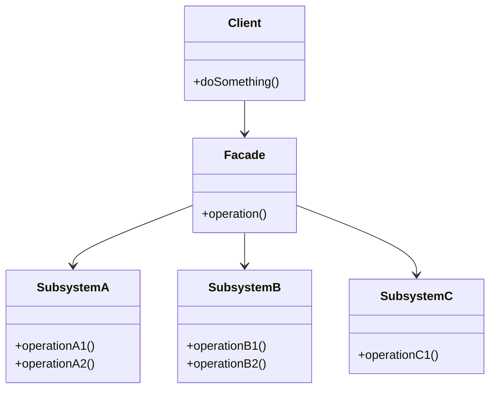
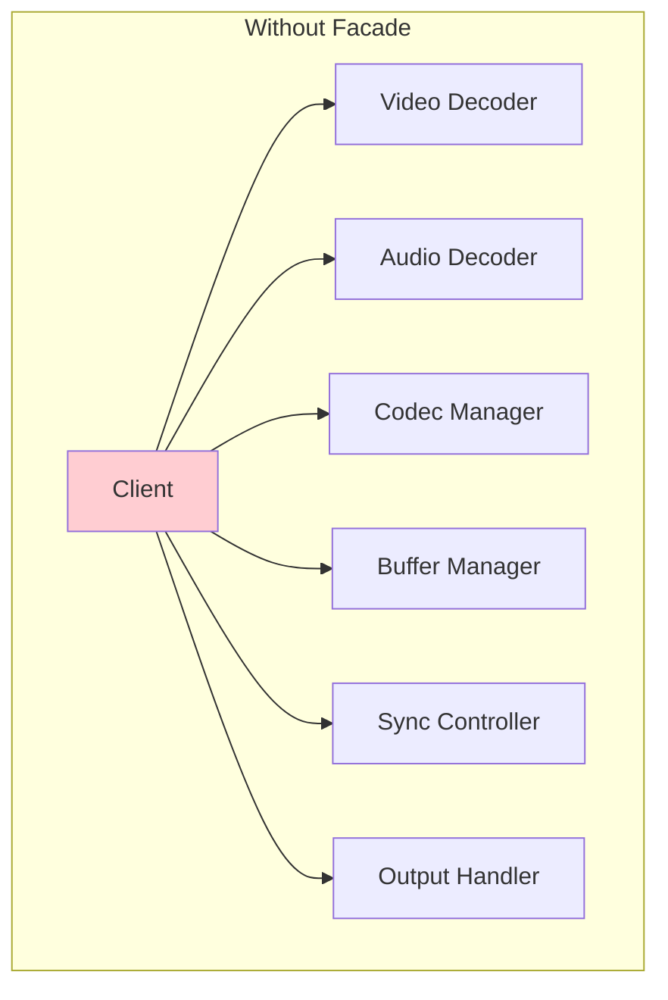
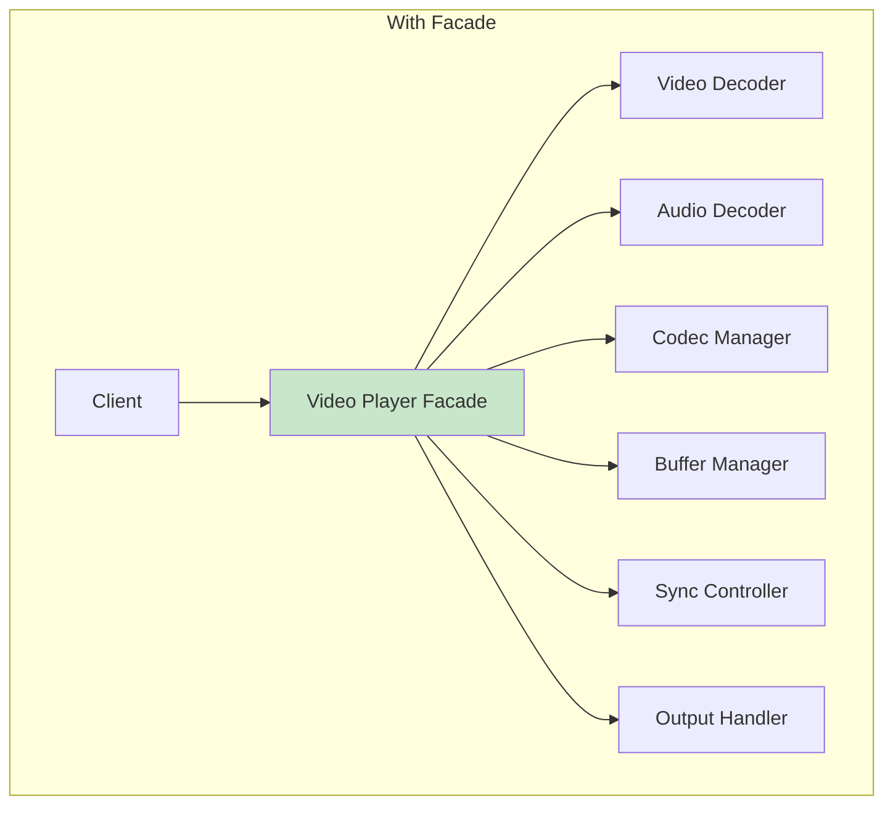
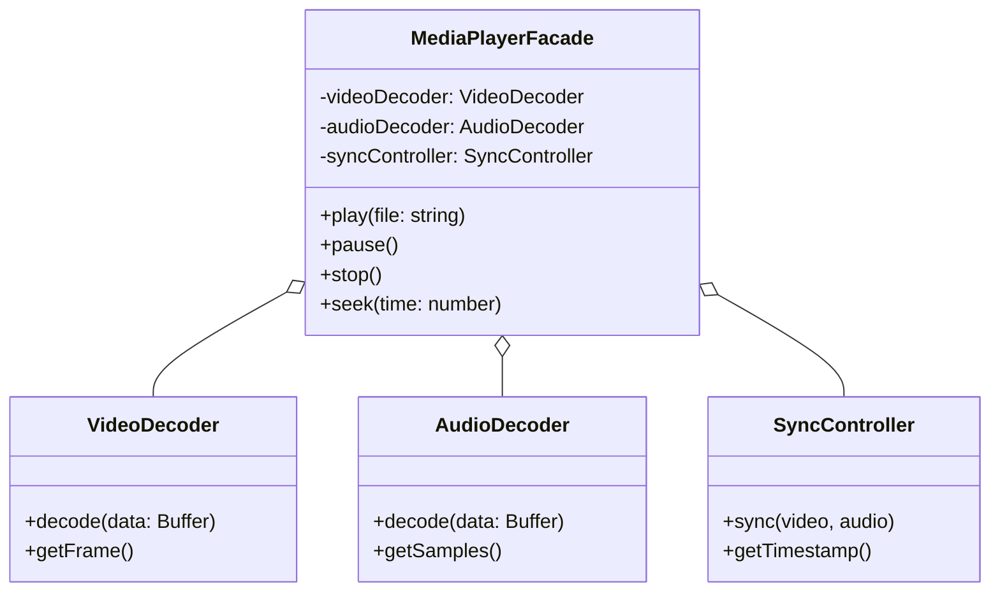

# Facade Pattern

## Intent

**Facade** is a structural design pattern that provides a simplified interface to a library, a framework, or any other complex set of classes.



---

## Problem It Solves

Imagine you need to work with a complex library or framework that has dozens of classes and intricate dependencies. Your code becomes tightly coupled to implementation details:



This creates several problems:
- **Complexity**: Client must understand all subsystem classes
- **Coupling**: Changes in subsystems break client code
- **Maintenance**: Hard to refactor subsystems

---

## Solution

Create a facade that provides a simple interface to the complex subsystem:



The facade:
1. Provides a simple interface for common use cases
2. Delegates work to subsystem objects
3. Coordinates subsystem interactions

---

## Structure



---

## Implementation

<Tabs items={["Media Converter", "E-commerce Checkout", "Cloud Services", "Real-World: Email Service"]}>
  <Tab value="Media Converter">
```typescript
/**
 * Subsystem: Video processing
 * Handles video encoding, decoding, and frame manipulation
 */
interface VideoProcessor {
  /** Load video file from path */
  load: (path: string) => Promise<void>;
  /** Decode video frames to raw format */
  decode: () => Promise<Buffer>;
  /** Encode video to specified format */
  encode: (format: "mp4" | "webm" | "avi") => Promise<Buffer>;
  /** Get video metadata */
  getMetadata: () => { width: number; height: number; duration: number; fps: number };
}

/**
 * Subsystem: Audio processing
 * Handles audio extraction, encoding, and manipulation
 */
interface AudioProcessor {
  /** Extract audio track from video */
  extractFromVideo: (videoData: Buffer) => Promise<Buffer>;
  /** Encode audio to specified format */
  encode: (format: "mp3" | "aac" | "wav") => Promise<Buffer>;
  /** Adjust audio volume */
  adjustVolume: (level: number) => void;
  /** Get audio metadata */
  getMetadata: () => { bitrate: number; channels: number; sampleRate: number };
}

/**
 * Subsystem: Compression
 * Handles file compression and optimization
 */
interface CompressionEngine {
  /** Compress data with specified quality */
  compress: (data: Buffer, quality: number) => Promise<Buffer>;
  /** Estimate output size */
  estimateSize: (data: Buffer, quality: number) => number;
}

/**
 * Subsystem: File system operations
 * Handles reading and writing files
 */
interface FileSystem {
  /** Read file from disk */
  read: (path: string) => Promise<Buffer>;
  /** Write file to disk */
  write: (path: string, data: Buffer) => Promise<void>;
  /** Check if file exists */
  exists: (path: string) => boolean;
}

// Subsystem implementations
const createVideoProcessor = (): VideoProcessor => {
  let metadata = { width: 1920, height: 1080, duration: 0, fps: 30 };
  
  return {
    load: async (path) => {
      console.log(`[Video] Loading ${path}...`);
      metadata.duration = 120; // Simulated
    },
    decode: async () => {
      console.log("[Video] Decoding frames...");
      return Buffer.from("video-data");
    },
    encode: async (format) => {
      console.log(`[Video] Encoding to ${format}...`);
      return Buffer.from(`encoded-${format}`);
    },
    getMetadata: () => metadata,
  };
};

const createAudioProcessor = (): AudioProcessor => ({
  extractFromVideo: async (videoData) => {
    console.log("[Audio] Extracting audio track...");
    return Buffer.from("audio-data");
  },
  encode: async (format) => {
    console.log(`[Audio] Encoding to ${format}...`);
    return Buffer.from(`encoded-${format}`);
  },
  adjustVolume: (level) => {
    console.log(`[Audio] Adjusting volume to ${level}%`);
  },
  getMetadata: () => ({ bitrate: 320, channels: 2, sampleRate: 44100 }),
});

const createCompressionEngine = (): CompressionEngine => ({
  compress: async (data, quality) => {
    console.log(`[Compression] Compressing at ${quality}% quality...`);
    return Buffer.from("compressed-data");
  },
  estimateSize: (data, quality) => Math.floor(data.length * (quality / 100)),
});

const createFileSystem = (): FileSystem => ({
  read: async (path) => {
    console.log(`[FS] Reading ${path}...`);
    return Buffer.from("file-content");
  },
  write: async (path, data) => {
    console.log(`[FS] Writing ${path} (${data.length} bytes)...`);
  },
  exists: (path) => true,
});

/**
 * Media Converter Facade
 * Provides a simple interface to convert media files
 * @description Hides complexity of video/audio processing, compression, and file I/O
 */
interface MediaConverterFacade {
  /** Convert video to another format with optional quality setting */
  convertVideo: (input: string, output: string, format: "mp4" | "webm" | "avi", quality?: number) => Promise<void>;
  /** Extract audio from video file */
  extractAudio: (input: string, output: string, format: "mp3" | "aac" | "wav") => Promise<void>;
  /** Get information about a media file */
  getInfo: (path: string) => Promise<{ video: ReturnType<VideoProcessor["getMetadata"]>; audio: ReturnType<AudioProcessor["getMetadata"]> }>;
}

const createMediaConverter = (): MediaConverterFacade => {
  // Initialize subsystems
  const video = createVideoProcessor();
  const audio = createAudioProcessor();
  const compression = createCompressionEngine();
  const fs = createFileSystem();

  return {
    convertVideo: async (input, output, format, quality = 80) => {
      console.log(`\n=== Converting ${input} to ${format} ===`);
      
      // Complex orchestration hidden behind simple interface
      await video.load(input);
      const decoded = await video.decode();
      const audioTrack = await audio.extractFromVideo(decoded);
      
      const encodedVideo = await video.encode(format);
      const encodedAudio = await audio.encode("aac");
      
      const compressed = await compression.compress(
        Buffer.concat([encodedVideo, encodedAudio]),
        quality
      );
      
      await fs.write(output, compressed);
      console.log(`=== Conversion complete ===\n`);
    },

    extractAudio: async (input, output, format) => {
      console.log(`\n=== Extracting audio from ${input} ===`);
      
      await video.load(input);
      const decoded = await video.decode();
      const audioTrack = await audio.extractFromVideo(decoded);
      const encoded = await audio.encode(format);
      
      await fs.write(output, encoded);
      console.log(`=== Extraction complete ===\n`);
    },

    getInfo: async (path) => {
      await video.load(path);
      return {
        video: video.getMetadata(),
        audio: audio.getMetadata(),
      };
    },
  };
};

// Usage - simple interface hides all complexity
const converter = createMediaConverter();

await converter.convertVideo("input.mov", "output.mp4", "mp4", 75);
await converter.extractAudio("video.mp4", "audio.mp3", "mp3");

const info = await converter.getInfo("video.mp4");
console.log("Video info:", info);
//                         ^?
```
  </Tab>
  <Tab value="E-commerce Checkout">
```ts
/**
 * Subsystem: Inventory management
 */
interface InventoryService {
  /** Check if items are available */
  checkAvailability: (items: { productId: string; quantity: number }[]) => Promise<boolean>;
  /** Reserve items for checkout */
  reserve: (items: { productId: string; quantity: number }[], orderId: string) => Promise<void>;
  /** Release reserved items */
  release: (orderId: string) => Promise<void>;
}

/**
 * Subsystem: Payment processing
 */
interface PaymentService {
  /** Validate payment method */
  validatePaymentMethod: (method: PaymentMethod) => Promise<boolean>;
  /** Process payment */
  charge: (amount: number, method: PaymentMethod) => Promise<{ transactionId: string; status: string }>;
  /** Refund payment */
  refund: (transactionId: string, amount: number) => Promise<void>;
}

/**
 * Subsystem: Shipping
 */
interface ShippingService {
  /** Calculate shipping cost */
  calculateCost: (address: Address, items: CartItem[]) => Promise<number>;
  /** Get available shipping methods */
  getAvailableMethods: (address: Address) => Promise<ShippingMethod[]>;
  /** Create shipment */
  createShipment: (orderId: string, address: Address, method: ShippingMethod) => Promise<string>;
}

/**
 * Subsystem: Tax calculation
 */
interface TaxService {
  /** Calculate tax for order */
  calculate: (subtotal: number, address: Address) => Promise<{ tax: number; breakdown: TaxBreakdown[] }>;
}

/**
 * Subsystem: Notifications
 */
interface NotificationService {
  /** Send order confirmation */
  sendOrderConfirmation: (email: string, order: Order) => Promise<void>;
  /** Send shipping notification */
  sendShippingNotification: (email: string, trackingNumber: string) => Promise<void>;
}

// Types
interface PaymentMethod {
  type: "card" | "paypal" | "bank";
  details: Record<string, string>;
}

interface Address {
  street: string;
  city: string;
  state: string;
  zip: string;
  country: string;
}

interface CartItem {
  productId: string;
  name: string;
  price: number;
  quantity: number;
}

interface ShippingMethod {
  id: string;
  name: string;
  estimatedDays: number;
  price: number;
}

interface TaxBreakdown {
  type: string;
  rate: number;
  amount: number;
}

interface Order {
  id: string;
  items: CartItem[];
  subtotal: number;
  tax: number;
  shipping: number;
  total: number;
  status: string;
}

/**
 * Checkout Facade
 * Simplifies the complex checkout process
 * @description Orchestrates inventory, payment, shipping, tax, and notifications
 */
interface CheckoutFacade {
  /** Calculate order totals before checkout */
  calculateTotals: (items: CartItem[], address: Address, shippingMethod: ShippingMethod) => Promise<{
    subtotal: number;
    tax: number;
    shipping: number;
    total: number;
  }>;
  
  /** Process complete checkout */
  checkout: (options: {
    items: CartItem[];
    address: Address;
    shippingMethod: ShippingMethod;
    paymentMethod: PaymentMethod;
    email: string;
  }) => Promise<Order>;
  
  /** Cancel and refund order */
  cancelOrder: (orderId: string, transactionId: string) => Promise<void>;
}

const createCheckoutFacade = (
  inventory: InventoryService,
  payment: PaymentService,
  shipping: ShippingService,
  tax: TaxService,
  notifications: NotificationService
): CheckoutFacade => ({
  calculateTotals: async (items, address, shippingMethod) => {
    const subtotal = items.reduce((sum, item) => sum + item.price * item.quantity, 0);
    const { tax: taxAmount } = await tax.calculate(subtotal, address);
    const shippingCost = await shipping.calculateCost(address, items);

    return {
      subtotal,
      tax: taxAmount,
      shipping: shippingMethod.price,
      total: subtotal + taxAmount + shippingMethod.price,
    };
  },

  checkout: async ({ items, address, shippingMethod, paymentMethod, email }) => {
    const orderId = `ORD-${Date.now()}`;

    // 1. Check inventory
    const available = await inventory.checkAvailability(
      items.map(i => ({ productId: i.productId, quantity: i.quantity }))
    );
    if (!available) {
      throw new Error("Some items are not available");
    }

    // 2. Reserve inventory
    await inventory.reserve(
      items.map(i => ({ productId: i.productId, quantity: i.quantity })),
      orderId
    );

    try {
      // 3. Calculate totals
      const totals = await this.calculateTotals(items, address, shippingMethod);

      // 4. Validate and process payment
      const validPayment = await payment.validatePaymentMethod(paymentMethod);
      if (!validPayment) {
        throw new Error("Invalid payment method");
      }

      const { transactionId } = await payment.charge(totals.total, paymentMethod);

      // 5. Create shipment
      const trackingNumber = await shipping.createShipment(orderId, address, shippingMethod);

      // 6. Create order
      const order: Order = {
        id: orderId,
        items,
        ...totals,
        status: "confirmed",
      };

      // 7. Send notifications
      await notifications.sendOrderConfirmation(email, order);

      return order;
    } catch (error) {
      // Rollback on failure
      await inventory.release(orderId);
      throw error;
    }
  },

  cancelOrder: async (orderId, transactionId) => {
    await inventory.release(orderId);
    await payment.refund(transactionId, 0); // Full refund
  },
});

// Usage - complex checkout simplified to one call
const checkout: CheckoutFacade = {} as CheckoutFacade; // Injected

const order = await checkout.checkout({
  items: [
    { productId: "PROD-1", name: "Widget", price: 29.99, quantity: 2 },
    { productId: "PROD-2", name: "Gadget", price: 49.99, quantity: 1 },
  ],
  address: {
    street: "123 Main St",
    city: "Springfield",
    state: "IL",
    zip: "62701",
    country: "US",
  },
  shippingMethod: { id: "standard", name: "Standard", estimatedDays: 5, price: 5.99 },
  paymentMethod: { type: "card", details: { number: "****1234" } },
  email: "customer@example.com",
});

console.log("Order placed:", order.id);
```
  </Tab>
  <Tab value="Cloud Services">
```ts
/**
 * Subsystem: Compute (EC2-like)
 */
interface ComputeService {
  launchInstance: (config: InstanceConfig) => Promise<string>;
  terminateInstance: (instanceId: string) => Promise<void>;
  getInstanceStatus: (instanceId: string) => Promise<string>;
}

/**
 * Subsystem: Storage (S3-like)
 */
interface StorageService {
  createBucket: (name: string) => Promise<void>;
  uploadFile: (bucket: string, key: string, data: Buffer) => Promise<string>;
  getSignedUrl: (bucket: string, key: string) => Promise<string>;
}

/**
 * Subsystem: Database (RDS-like)
 */
interface DatabaseService {
  createDatabase: (config: DatabaseConfig) => Promise<string>;
  getConnectionString: (dbId: string) => Promise<string>;
  createBackup: (dbId: string) => Promise<string>;
}

/**
 * Subsystem: Networking (VPC-like)
 */
interface NetworkingService {
  createVPC: (cidr: string) => Promise<string>;
  createSubnet: (vpcId: string, cidr: string, zone: string) => Promise<string>;
  createSecurityGroup: (vpcId: string, rules: SecurityRule[]) => Promise<string>;
}

/**
 * Subsystem: DNS (Route53-like)
 */
interface DnsService {
  createRecord: (domain: string, type: string, value: string) => Promise<void>;
  deleteRecord: (domain: string, type: string) => Promise<void>;
}

// Types
interface InstanceConfig {
  type: string;
  ami: string;
  securityGroupId: string;
  subnetId: string;
}

interface DatabaseConfig {
  engine: "postgres" | "mysql";
  instanceClass: string;
  storage: number;
  subnetIds: string[];
}

interface SecurityRule {
  port: number;
  protocol: "tcp" | "udp";
  source: string;
}

/**
 * Cloud Infrastructure Facade
 * Simplifies provisioning of complete application stacks
 * @description Orchestrates compute, storage, database, networking, and DNS services
 */
interface CloudFacade {
  /** Provision complete web application stack */
  provisionWebApp: (config: WebAppConfig) => Promise<WebAppResources>;
  /** Tear down all resources */
  destroyWebApp: (resources: WebAppResources) => Promise<void>;
  /** Get stack status */
  getStackStatus: (resources: WebAppResources) => Promise<StackStatus>;
}

interface WebAppConfig {
  name: string;
  domain: string;
  instanceType: string;
  instanceCount: number;
  databaseEngine: "postgres" | "mysql";
  databaseSize: number;
}

interface WebAppResources {
  vpcId: string;
  subnetIds: string[];
  securityGroupId: string;
  instanceIds: string[];
  databaseId: string;
  bucketName: string;
}

interface StackStatus {
  compute: string[];
  database: string;
  healthy: boolean;
}

const createCloudFacade = (
  compute: ComputeService,
  storage: StorageService,
  database: DatabaseService,
  networking: NetworkingService,
  dns: DnsService
): CloudFacade => ({
  provisionWebApp: async (config) => {
    console.log(`\n=== Provisioning ${config.name} ===`);

    // 1. Create networking
    console.log("Creating VPC and subnets...");
    const vpcId = await networking.createVPC("10.0.0.0/16");
    const subnet1 = await networking.createSubnet(vpcId, "10.0.1.0/24", "us-east-1a");
    const subnet2 = await networking.createSubnet(vpcId, "10.0.2.0/24", "us-east-1b");
    const subnetIds = [subnet1, subnet2];

    // 2. Create security group
    console.log("Creating security group...");
    const securityGroupId = await networking.createSecurityGroup(vpcId, [
      { port: 80, protocol: "tcp", source: "0.0.0.0/0" },
      { port: 443, protocol: "tcp", source: "0.0.0.0/0" },
      { port: 22, protocol: "tcp", source: "10.0.0.0/16" },
    ]);

    // 3. Create database
    console.log("Creating database...");
    const databaseId = await database.createDatabase({
      engine: config.databaseEngine,
      instanceClass: "db.t3.medium",
      storage: config.databaseSize,
      subnetIds,
    });

    // 4. Create storage bucket
    console.log("Creating storage bucket...");
    const bucketName = `${config.name}-assets`;
    await storage.createBucket(bucketName);

    // 5. Launch instances
    console.log(`Launching ${config.instanceCount} instances...`);
    const instanceIds: string[] = [];
    for (let i = 0; i < config.instanceCount; i++) {
      const id = await compute.launchInstance({
        type: config.instanceType,
        ami: "ami-12345678",
        securityGroupId,
        subnetId: subnetIds[i % subnetIds.length],
      });
      instanceIds.push(id);
    }

    // 6. Configure DNS
    console.log("Configuring DNS...");
    await dns.createRecord(config.domain, "A", "load-balancer-ip");

    console.log(`=== ${config.name} provisioned ===\n`);

    return {
      vpcId,
      subnetIds,
      securityGroupId,
      instanceIds,
      databaseId,
      bucketName,
    };
  },

  destroyWebApp: async (resources) => {
    console.log("\n=== Destroying resources ===");
    
    // Destroy in reverse order
    for (const id of resources.instanceIds) {
      await compute.terminateInstance(id);
    }
    
    console.log("=== Resources destroyed ===\n");
  },

  getStackStatus: async (resources) => {
    const computeStatuses = await Promise.all(
      resources.instanceIds.map(id => compute.getInstanceStatus(id))
    );
    
    const dbStatus = await database.getConnectionString(resources.databaseId);

    return {
      compute: computeStatuses,
      database: dbStatus ? "running" : "stopped",
      healthy: computeStatuses.every(s => s === "running"),
    };
  },
});

// Usage - provision entire stack with one call
const cloud: CloudFacade = {} as CloudFacade; // Injected

const resources = await cloud.provisionWebApp({
  name: "my-app",
  domain: "myapp.example.com",
  instanceType: "t3.medium",
  instanceCount: 2,
  databaseEngine: "postgres",
  databaseSize: 100,
});

const status = await cloud.getStackStatus(resources);
console.log("Stack status:", status);
```
  </Tab>
  <Tab value="Real-World: Email Service">
```ts
/**
 * Subsystem: Template engine
 */
interface TemplateEngine {
  /** Compile template with variables */
  compile: (template: string, variables: Record<string, unknown>) => string;
  /** Load template from storage */
  loadTemplate: (name: string) => Promise<string>;
}

/**
 * Subsystem: SMTP sender
 */
interface SmtpSender {
  /** Send raw email */
  send: (options: { from: string; to: string; subject: string; html: string; text: string }) => Promise<string>;
  /** Verify email address */
  verify: (email: string) => Promise<boolean>;
}

/**
 * Subsystem: Analytics
 */
interface EmailAnalytics {
  /** Track email sent */
  trackSent: (messageId: string, recipient: string) => void;
  /** Track email opened */
  trackOpened: (messageId: string) => void;
  /** Get delivery stats */
  getStats: (startDate: Date, endDate: Date) => Promise<EmailStats>;
}

/**
 * Subsystem: Queue
 */
interface EmailQueue {
  /** Add email to queue */
  enqueue: (email: QueuedEmail) => Promise<string>;
  /** Process queued emails */
  process: (batchSize: number) => Promise<void>;
}

// Types
interface EmailStats {
  sent: number;
  delivered: number;
  opened: number;
  clicked: number;
  bounced: number;
}

interface QueuedEmail {
  to: string;
  template: string;
  variables: Record<string, unknown>;
  scheduledFor?: Date;
}

/**
 * Email Service Facade
 * Provides simple interface for sending templated emails
 * @description Orchestrates template rendering, SMTP sending, analytics, and queuing
 */
interface EmailFacade {
  /** Send email immediately using template */
  send: (options: {
    to: string;
    template: string;
    variables: Record<string, unknown>;
  }) => Promise<{ messageId: string; success: boolean }>;

  /** Send bulk emails (queued) */
  sendBulk: (options: {
    recipients: string[];
    template: string;
    variables: Record<string, unknown>;
  }) => Promise<{ queued: number; jobId: string }>;

  /** Schedule email for later */
  schedule: (options: {
    to: string;
    template: string;
    variables: Record<string, unknown>;
    sendAt: Date;
  }) => Promise<{ jobId: string }>;

  /** Get delivery statistics */
  getDeliveryStats: (days: number) => Promise<EmailStats>;
}

const createEmailFacade = (
  templates: TemplateEngine,
  smtp: SmtpSender,
  analytics: EmailAnalytics,
  queue: EmailQueue,
  config: { fromAddress: string; fromName: string }
): EmailFacade => ({
  send: async ({ to, template, variables }) => {
    // 1. Load and compile template
    const templateContent = await templates.loadTemplate(template);
    const html = templates.compile(templateContent, variables);
    const text = html.replace(/<[^>]*>/g, ""); // Strip HTML for text version

    // 2. Extract subject from template or variables
    const subject = (variables.subject as string) || `Message from ${config.fromName}`;

    // 3. Send email
    const messageId = await smtp.send({
      from: `${config.fromName} <${config.fromAddress}>`,
      to,
      subject,
      html,
      text,
    });

    // 4. Track analytics
    analytics.trackSent(messageId, to);

    return { messageId, success: true };
  },

  sendBulk: async ({ recipients, template, variables }) => {
    const jobId = `bulk-${Date.now()}`;

    // Queue all emails for processing
    for (const recipient of recipients) {
      await queue.enqueue({
        to: recipient,
        template,
        variables,
      });
    }

    // Start processing in background
    queue.process(100); // Process 100 at a time

    return { queued: recipients.length, jobId };
  },

  schedule: async ({ to, template, variables, sendAt }) => {
    const jobId = await queue.enqueue({
      to,
      template,
      variables,
      scheduledFor: sendAt,
    });

    return { jobId };
  },

  getDeliveryStats: async (days) => {
    const endDate = new Date();
    const startDate = new Date();
    startDate.setDate(startDate.getDate() - days);

    return analytics.getStats(startDate, endDate);
  },
});

// Usage - simple email sending
const email: EmailFacade = {} as EmailFacade; // Injected

// Send welcome email
await email.send({
  to: "user@example.com",
  template: "welcome",
  variables: {
    subject: "Welcome to Our Platform!",
    userName: "John",
    activationLink: "https://example.com/activate/abc123",
  },
});

// Send newsletter to many users
await email.sendBulk({
  recipients: ["user1@example.com", "user2@example.com", "user3@example.com"],
  template: "newsletter",
  variables: {
    subject: "Monthly Newsletter - December 2024",
    month: "December",
  },
});

// Schedule reminder
await email.schedule({
  to: "user@example.com",
  template: "reminder",
  variables: {
    subject: "Your trial expires tomorrow",
    expiryDate: "2024-12-15",
  },
  sendAt: new Date("2024-12-14T09:00:00"),
});

const stats = await email.getDeliveryStats(30);
console.log("Last 30 days:", stats);
```
  </Tab>
</Tabs>

---

## When to Use

<Accordions>
  <Accordion title="✅ Use Facade when...">
    - **Complex subsystems**: When you need to work with a complex library or framework
    
    - **Layered architecture**: When you want to define entry points to each level of a subsystem
    
    - **Decoupling**: When you want to decouple clients from subsystem implementation details
    
    - **Legacy systems**: When wrapping legacy code with a cleaner interface
    
    - **API simplification**: When providing a simple API for common use cases
  </Accordion>
  
  <Accordion title="❌ Avoid Facade when...">
    - **Simple subsystems**: When the subsystem is already simple enough
    
    - **Full control needed**: When clients need fine-grained control over subsystem behavior
    
    - **God object risk**: When facade grows to do too many unrelated things
  </Accordion>
</Accordions>

---

## Facade vs Other Patterns

| Pattern | Purpose |
|---------|---------|
| **Facade** | Simplifies interface to complex subsystem |
| **Adapter** | Converts one interface to another |
| **Mediator** | Centralizes communication between objects |
| **Proxy** | Controls access to an object |

---

## Real-World Applications

| Application | Facade Usage |
|-------------|--------------|
| **jQuery** | Simplifies DOM manipulation |
| **ORM Libraries** | Simplifies database operations |
| **AWS SDK** | Simplifies cloud service interactions |
| **Payment Gateways** | Simplifies payment processing |
| **Build Tools** | Simplifies complex build pipelines |

---

## Summary

<Callout type="info">
  **Key Takeaway**: Facade provides a simple interface to a complex subsystem. It doesn't add new functionality but makes existing functionality easier to use.
</Callout>

### Pros
- ✅ Isolates clients from subsystem complexity
- ✅ Promotes weak coupling
- ✅ Provides convenient methods for common tasks
- ✅ Can wrap legacy systems

### Cons
- ❌ Can become a god object if not careful
- ❌ May limit access to advanced subsystem features
- ❌ Additional layer of abstraction
