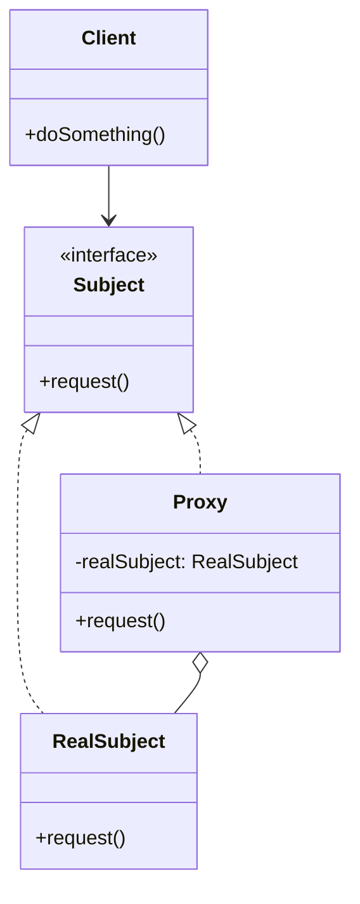
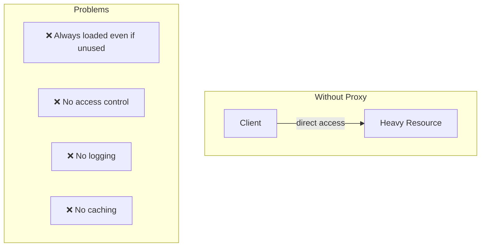
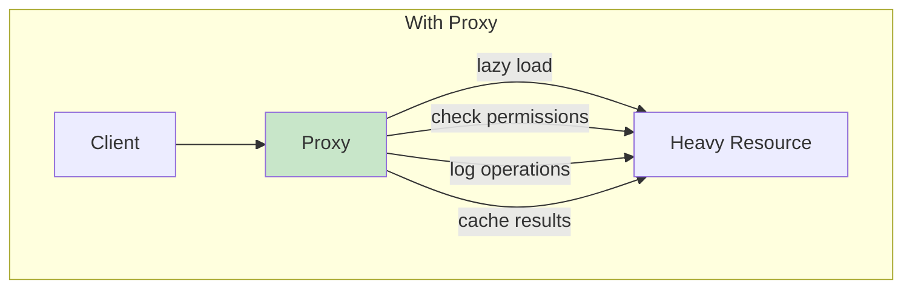
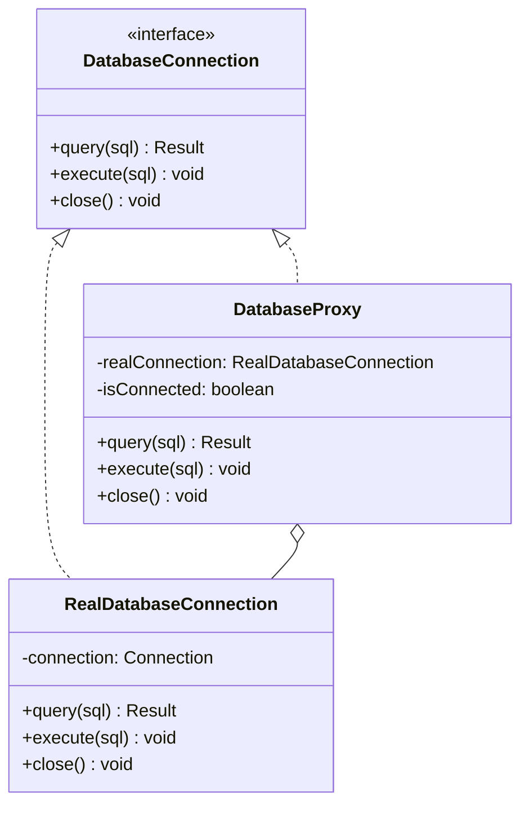

# Proxy Pattern

## Intent

**Proxy** is a structural design pattern that provides a substitute or placeholder for another object. A proxy controls access to the original object, allowing you to perform something either before or after the request gets through to the original object.



---

## Problem It Solves

Sometimes you need to control access to an object:

- **Lazy initialization**: Object is expensive to create but rarely used
- **Access control**: Check permissions before allowing operations
- **Logging**: Track all operations on an object
- **Caching**: Avoid repeated expensive operations
- **Remote access**: Object lives on a remote server



---

## Solution

Create a proxy that has the same interface as the original object:



The proxy can:
1. Control when the real object is created (lazy initialization)
2. Check permissions before forwarding requests
3. Log all operations
4. Cache results for repeated requests

---

## Types of Proxies


---

## Structure



---

## Implementation

<Tabs items={["Virtual Proxy", "Protection Proxy", "Caching Proxy", "Real-World: API Client"]}>
  <Tab value="Virtual Proxy">
```typescript
/**
 * Service interface
 * @description Defines the contract for the service and its proxy
 */
interface ImageLoader {
  /** Get image dimensions without loading full image */
  getDimensions: () => { width: number; height: number };
  /** Load and return the full image data */
  load: () => Promise<ImageData>;
  /** Check if image is loaded */
  isLoaded: () => boolean;
  /** Get file size in bytes */
  getFileSize: () => number;
}

/**
 * Image data representation
 */
interface ImageData {
  readonly width: number;
  readonly height: number;
  readonly data: Uint8Array;
  readonly format: "png" | "jpeg" | "webp";
}

/**
 * Real Subject: Actual image loader
 * @description Loads image data from disk/network (expensive operation)
 */
const createRealImageLoader = (path: string): ImageLoader => {
  // Simulate loading metadata (quick)
  const metadata = {
    width: 1920,
    height: 1080,
    fileSize: 2_500_000, // 2.5MB
  };

  let imageData: ImageData | null = null;

  return {
    getDimensions: () => ({ width: metadata.width, height: metadata.height }),

    load: async () => {
      if (imageData) return imageData;

      console.log(`[RealImageLoader] Loading image from ${path}...`);
      // Simulate expensive loading operation
      await new Promise(resolve => setTimeout(resolve, 1000));

      imageData = {
        width: metadata.width,
        height: metadata.height,
        data: new Uint8Array(metadata.fileSize),
        format: "jpeg",
      };

      console.log(`[RealImageLoader] Image loaded: ${metadata.fileSize} bytes`);
      return imageData;
    },

    isLoaded: () => imageData !== null,

    getFileSize: () => metadata.fileSize,
  };
};

/**
 * Virtual Proxy: Delays expensive object creation
 * @description Only creates real loader when actually needed
 */
const createImageProxy = (path: string): ImageLoader => {
  let realLoader: ImageLoader | null = null;

  // Quick metadata without loading real image
  const quickMetadata = {
    width: 1920,
    height: 1080,
    fileSize: 2_500_000,
  };

  const getRealLoader = () => {
    if (!realLoader) {
      console.log(`[Proxy] Creating real loader for ${path}`);
      realLoader = createRealImageLoader(path);
    }
    return realLoader;
  };

  return {
    // These methods don't need the real loader
    getDimensions: () => {
      console.log(`[Proxy] Returning cached dimensions`);
      return { width: quickMetadata.width, height: quickMetadata.height };
    },

    getFileSize: () => {
      console.log(`[Proxy] Returning cached file size`);
      return quickMetadata.fileSize;
    },

    isLoaded: () => realLoader?.isLoaded() ?? false,

    // Only this method needs the real loader
    load: async () => {
      return getRealLoader().load();
    },
  };
};

/**
 * Image gallery using virtual proxies
 */
interface ImageGallery {
  /** Add image to gallery */
  addImage: (path: string) => void;
  /** Get thumbnail info (doesn't load full image) */
  getThumbnailInfo: (index: number) => { width: number; height: number; size: number };
  /** Load full image when user clicks */
  loadImage: (index: number) => Promise<ImageData>;
  /** Get gallery statistics */
  getStats: () => { total: number; loaded: number; memoryUsed: number };
}

const createImageGallery = (): ImageGallery => {
  const images: ImageLoader[] = [];

  return {
    addImage: (path) => {
      // Create proxy instead of loading real image
      images.push(createImageProxy(path));
      console.log(`[Gallery] Added image: ${path} (not loaded yet)`);
    },

    getThumbnailInfo: (index) => {
      const image = images[index];
      // This uses cached metadata, no expensive loading
      return {
        ...image.getDimensions(),
        size: image.getFileSize(),
      };
    },

    loadImage: async (index) => {
      console.log(`[Gallery] User requested image ${index}`);
      // Only now do we load the real image
      return images[index].load();
    },

    getStats: () => {
      const loaded = images.filter(img => img.isLoaded()).length;
      const memoryUsed = images
        .filter(img => img.isLoaded())
        .reduce((sum, img) => sum + img.getFileSize(), 0);

      return { total: images.length, loaded, memoryUsed };
    },
  };
};

// Usage
const gallery = createImageGallery();

// Add 100 images - none are actually loaded!
for (let i = 0; i < 100; i++) {
  gallery.addImage(`/photos/image-${i}.jpg`);
}

console.log("\n--- Gallery created with 100 images ---");
console.log("Stats:", gallery.getStats());
//                    ^?
// { total: 100, loaded: 0, memoryUsed: 0 }

// Get thumbnail info - still no loading
const thumb = gallery.getThumbnailInfo(0);
console.log("\nThumbnail info:", thumb);

// User clicks image - NOW it loads
console.log("\n--- User clicks image 0 ---");
const imageData = await gallery.loadImage(0);
console.log("Image data received:", imageData.width, "x", imageData.height);

console.log("\nStats after loading:", gallery.getStats());
// { total: 100, loaded: 1, memoryUsed: 2500000 }
```
  </Tab>
  <Tab value="Protection Proxy">
```typescript
/**
 * User roles for access control
 */
type UserRole = "admin" | "editor" | "viewer";

/**
 * User context for permission checks
 */
interface UserContext {
  readonly id: string;
  readonly role: UserRole;
  readonly permissions: string[];
}

/**
 * Document service interface
 * @description Operations that need access control
 */
interface DocumentService {
  /** Read document content */
  read: (docId: string) => Promise<{ content: string; metadata: object }>;
  /** Write document content */
  write: (docId: string, content: string) => Promise<void>;
  /** Delete document */
  delete: (docId: string) => Promise<void>;
  /** Share document with another user */
  share: (docId: string, userId: string, permission: "read" | "write") => Promise<void>;
  /** Get document history */
  getHistory: (docId: string) => Promise<{ version: number; timestamp: Date; author: string }[]>;
}

/**
 * Real Document Service
 * @description Actual implementation without security
 */
const createRealDocumentService = (): DocumentService => {
  const documents = new Map<string, { content: string; metadata: object }>();

  return {
    read: async (docId) => {
      console.log(`[Service] Reading document ${docId}`);
      return documents.get(docId) || { content: "", metadata: {} };
    },
    write: async (docId, content) => {
      console.log(`[Service] Writing to document ${docId}`);
      documents.set(docId, { content, metadata: { updatedAt: new Date() } });
    },
    delete: async (docId) => {
      console.log(`[Service] Deleting document ${docId}`);
      documents.delete(docId);
    },
    share: async (docId, userId, permission) => {
      console.log(`[Service] Sharing ${docId} with ${userId} (${permission})`);
    },
    getHistory: async (docId) => {
      console.log(`[Service] Getting history for ${docId}`);
      return [];
    },
  };
};

/**
 * Permission definitions
 */
const rolePermissions: Record<UserRole, string[]> = {
  admin: ["read", "write", "delete", "share", "history"],
  editor: ["read", "write", "history"],
  viewer: ["read"],
};

/**
 * Protection Proxy: Controls access based on user permissions
 * @description Checks permissions before allowing operations
 */
const createDocumentProxy = (
  realService: DocumentService,
  getUser: () => UserContext
): DocumentService => {
  const checkPermission = (required: string): void => {
    const user = getUser();
    const allowed = rolePermissions[user.role];

    if (!allowed.includes(required)) {
      throw new Error(
        `Access denied: User ${user.id} (${user.role}) lacks '${required}' permission`
      );
    }

    console.log(`[Proxy] Permission check passed: ${user.id} has '${required}'`);
  };

  const logAccess = (operation: string, docId: string): void => {
    const user = getUser();
    console.log(`[Audit] ${new Date().toISOString()} - ${user.id} performed ${operation} on ${docId}`);
  };

  return {
    read: async (docId) => {
      checkPermission("read");
      logAccess("read", docId);
      return realService.read(docId);
    },

    write: async (docId, content) => {
      checkPermission("write");
      logAccess("write", docId);
      return realService.write(docId, content);
    },

    delete: async (docId) => {
      checkPermission("delete");
      logAccess("delete", docId);
      return realService.delete(docId);
    },

    share: async (docId, userId, permission) => {
      checkPermission("share");
      logAccess("share", docId);
      return realService.share(docId, userId, permission);
    },

    getHistory: async (docId) => {
      checkPermission("history");
      logAccess("history", docId);
      return realService.getHistory(docId);
    },
  };
};

// Usage
const realService = createRealDocumentService();

// Current user context (would come from auth system)
let currentUser: UserContext = {
  id: "user-123",
  role: "editor",
  permissions: [],
};

const documents = createDocumentProxy(realService, () => currentUser);

// Editor can read and write
console.log("=== Editor Actions ===");
await documents.write("doc-1", "Hello World");
await documents.read("doc-1");

// Editor cannot delete
console.log("\n=== Editor tries to delete ===");
try {
  await documents.delete("doc-1");
} catch (error) {
  console.log("Caught:", (error as Error).message);
}

// Switch to admin
currentUser = { id: "admin-1", role: "admin", permissions: [] };
console.log("\n=== Admin Actions ===");
await documents.delete("doc-1"); // Works!
await documents.share("doc-2", "user-456", "read"); // Works!

// Switch to viewer
currentUser = { id: "viewer-1", role: "viewer", permissions: [] };
console.log("\n=== Viewer Actions ===");
await documents.read("doc-2"); // Works
try {
  await documents.write("doc-2", "Hacked!"); // Fails
} catch (error) {
  console.log("Caught:", (error as Error).message);
}
```
  </Tab>
  <Tab value="Caching Proxy">
```typescript
/**
 * API response type
 */
interface ApiResponse<T> {
  data: T;
  status: number;
  headers: Record<string, string>;
}

/**
 * Weather data type
 */
interface WeatherData {
  location: string;
  temperature: number;
  humidity: number;
  conditions: string;
  updatedAt: string;
}

/**
 * Weather API interface
 * @description Contract for weather data fetching
 */
interface WeatherApi {
  /** Get current weather for location */
  getCurrent: (location: string) => Promise<ApiResponse<WeatherData>>;
  /** Get forecast for location */
  getForecast: (location: string, days: number) => Promise<ApiResponse<WeatherData[]>>;
  /** Clear all caches */
  clearCache?: () => void;
  /** Get cache statistics */
  getCacheStats?: () => { hits: number; misses: number; size: number };
}

/**
 * Real Weather API
 * @description Simulates expensive API calls
 */
const createRealWeatherApi = (): WeatherApi => ({
  getCurrent: async (location) => {
    console.log(`[API] Fetching current weather for ${location}...`);
    // Simulate API latency
    await new Promise(resolve => setTimeout(resolve, 500));

    return {
      data: {
        location,
        temperature: Math.round(15 + Math.random() * 20),
        humidity: Math.round(40 + Math.random() * 40),
        conditions: ["Sunny", "Cloudy", "Rainy"][Math.floor(Math.random() * 3)],
        updatedAt: new Date().toISOString(),
      },
      status: 200,
      headers: { "x-request-id": `req-${Date.now()}` },
    };
  },

  getForecast: async (location, days) => {
    console.log(`[API] Fetching ${days}-day forecast for ${location}...`);
    await new Promise(resolve => setTimeout(resolve, 800));

    const forecast: WeatherData[] = [];
    for (let i = 0; i < days; i++) {
      forecast.push({
        location,
        temperature: Math.round(15 + Math.random() * 20),
        humidity: Math.round(40 + Math.random() * 40),
        conditions: ["Sunny", "Cloudy", "Rainy"][Math.floor(Math.random() * 3)],
        updatedAt: new Date(Date.now() + i * 86400000).toISOString(),
      });
    }

    return {
      data: forecast,
      status: 200,
      headers: { "x-request-id": `req-${Date.now()}` },
    };
  },
});

/**
 * Cache entry with TTL
 */
interface CacheEntry<T> {
  data: T;
  expiresAt: number;
}

/**
 * Caching Proxy: Caches API responses
 * @description Reduces API calls by caching responses with TTL
 */
const createCachingWeatherProxy = (
  realApi: WeatherApi,
  options: { ttlMs: number } = { ttlMs: 60000 }
): WeatherApi => {
  const cache = new Map<string, CacheEntry<unknown>>();
  let hits = 0;
  let misses = 0;

  const getCacheKey = (method: string, ...args: unknown[]) =>
    `${method}:${JSON.stringify(args)}`;

  const getFromCache = <T>(key: string): T | null => {
    const entry = cache.get(key);
    
    if (!entry) {
      misses++;
      return null;
    }

    if (Date.now() > entry.expiresAt) {
      cache.delete(key);
      misses++;
      return null;
    }

    hits++;
    console.log(`[Cache] HIT for ${key}`);
    return entry.data as T;
  };

  const setCache = <T>(key: string, data: T): void => {
    cache.set(key, {
      data,
      expiresAt: Date.now() + options.ttlMs,
    });
    console.log(`[Cache] Stored ${key} (TTL: ${options.ttlMs}ms)`);
  };

  return {
    getCurrent: async (location) => {
      const key = getCacheKey("getCurrent", location);
      
      const cached = getFromCache<ApiResponse<WeatherData>>(key);
      if (cached) return cached;

      console.log(`[Cache] MISS for ${key}`);
      const response = await realApi.getCurrent(location);
      setCache(key, response);
      return response;
    },

    getForecast: async (location, days) => {
      const key = getCacheKey("getForecast", location, days);
      
      const cached = getFromCache<ApiResponse<WeatherData[]>>(key);
      if (cached) return cached;

      console.log(`[Cache] MISS for ${key}`);
      const response = await realApi.getForecast(location, days);
      setCache(key, response);
      return response;
    },

    clearCache: () => {
      cache.clear();
      console.log("[Cache] Cleared all entries");
    },

    getCacheStats: () => ({
      hits,
      misses,
      size: cache.size,
    }),
  };
};

// Usage
const realApi = createRealWeatherApi();
const weatherApi = createCachingWeatherProxy(realApi, { ttlMs: 30000 }); // 30 second cache

console.log("=== First requests (cache misses) ===");
const ny1 = await weatherApi.getCurrent("New York");
console.log("NY Weather:", ny1.data.temperature + "°C");

const la1 = await weatherApi.getCurrent("Los Angeles");
console.log("LA Weather:", la1.data.temperature + "°C");

console.log("\n=== Repeated requests (cache hits) ===");
const ny2 = await weatherApi.getCurrent("New York"); // Cached!
console.log("NY Weather:", ny2.data.temperature + "°C");

const la2 = await weatherApi.getCurrent("Los Angeles"); // Cached!
console.log("LA Weather:", la2.data.temperature + "°C");

console.log("\n=== Cache Statistics ===");
console.log(weatherApi.getCacheStats?.());
// { hits: 2, misses: 2, size: 2 }
```
  </Tab>
  <Tab value="Real-World: API Client">
```ts
/**
 * HTTP methods
 */
type HttpMethod = "GET" | "POST" | "PUT" | "DELETE" | "PATCH";

/**
 * Request configuration
 */
interface RequestConfig {
  headers?: Record<string, string>;
  params?: Record<string, string>;
  body?: unknown;
  timeout?: number;
}

/**
 * HTTP Client interface
 * @description Base contract for HTTP operations
 */
interface HttpClient {
  request: <T>(method: HttpMethod, url: string, config?: RequestConfig) => Promise<T>;
  get: <T>(url: string, config?: RequestConfig) => Promise<T>;
  post: <T>(url: string, body?: unknown, config?: RequestConfig) => Promise<T>;
  put: <T>(url: string, body?: unknown, config?: RequestConfig) => Promise<T>;
  delete: <T>(url: string, config?: RequestConfig) => Promise<T>;
}

/**
 * Real HTTP Client implementation
 */
const createRealHttpClient = (baseUrl: string): HttpClient => {
  const request = async <T>(method: HttpMethod, url: string, config: RequestConfig = {}): Promise<T> => {
    const fullUrl = new URL(url, baseUrl);
    
    if (config.params) {
      Object.entries(config.params).forEach(([key, value]) => {
        fullUrl.searchParams.append(key, value);
      });
    }

    console.log(`[HTTP] ${method} ${fullUrl.toString()}`);

    const response = await fetch(fullUrl.toString(), {
      method,
      headers: {
        "Content-Type": "application/json",
        ...config.headers,
      },
      body: config.body ? JSON.stringify(config.body) : undefined,
    });

    if (!response.ok) {
      throw new Error(`HTTP ${response.status}: ${response.statusText}`);
    }

    return response.json() as T;
  };

  return {
    request,
    get: (url, config) => request("GET", url, config),
    post: (url, body, config) => request("POST", url, { ...config, body }),
    put: (url, body, config) => request("PUT", url, { ...config, body }),
    delete: (url, config) => request("DELETE", url, config),
  };
};

/**
 * Logging Proxy: Logs all HTTP operations
 */
const withLogging = (client: HttpClient): HttpClient => {
  const logRequest = (method: HttpMethod, url: string, config?: RequestConfig) => {
    console.log(`[Log] → ${method} ${url}`, config?.body ? `Body: ${JSON.stringify(config.body)}` : "");
  };

  const logResponse = <T>(method: HttpMethod, url: string, data: T, duration: number) => {
    console.log(`[Log] ← ${method} ${url} (${duration}ms)`, typeof data === "object" ? "" : data);
  };

  const wrap = <T>(method: HttpMethod, url: string, promise: Promise<T>, config?: RequestConfig): Promise<T> => {
    const start = Date.now();
    logRequest(method, url, config);
    
    return promise.then(data => {
      logResponse(method, url, data, Date.now() - start);
      return data;
    });
  };

  return {
    request: (method, url, config) => wrap(method, url, client.request(method, url, config), config),
    get: (url, config) => wrap("GET", url, client.get(url, config), config),
    post: (url, body, config) => wrap("POST", url, client.post(url, body, config), { ...config, body }),
    put: (url, body, config) => wrap("PUT", url, client.put(url, body, config), { ...config, body }),
    delete: (url, config) => wrap("DELETE", url, client.delete(url, config), config),
  };
};

/**
 * Retry Proxy: Retries failed requests
 */
const withRetry = (client: HttpClient, maxRetries = 3, delayMs = 1000): HttpClient => {
  const retryRequest = async <T>(
    fn: () => Promise<T>,
    method: HttpMethod,
    url: string,
    attempt = 1
  ): Promise<T> => {
    try {
      return await fn();
    } catch (error) {
      if (attempt >= maxRetries) {
        console.log(`[Retry] ${method} ${url} failed after ${maxRetries} attempts`);
        throw error;
      }
      
      console.log(`[Retry] ${method} ${url} attempt ${attempt} failed, retrying in ${delayMs}ms...`);
      await new Promise(resolve => setTimeout(resolve, delayMs));
      return retryRequest(fn, method, url, attempt + 1);
    }
  };

  return {
    request: (method, url, config) => retryRequest(() => client.request(method, url, config), method, url),
    get: (url, config) => retryRequest(() => client.get(url, config), "GET", url),
    post: (url, body, config) => retryRequest(() => client.post(url, body, config), "POST", url),
    put: (url, body, config) => retryRequest(() => client.put(url, body, config), "PUT", url),
    delete: (url, config) => retryRequest(() => client.delete(url, config), "DELETE", url),
  };
};

/**
 * Auth Proxy: Adds authentication headers
 */
const withAuth = (client: HttpClient, getToken: () => string | null): HttpClient => {
  const addAuthHeader = (config: RequestConfig = {}): RequestConfig => {
    const token = getToken();
    if (!token) return config;

    return {
      ...config,
      headers: {
        ...config.headers,
        Authorization: `Bearer ${token}`,
      },
    };
  };

  return {
    request: (method, url, config) => client.request(method, url, addAuthHeader(config)),
    get: (url, config) => client.get(url, addAuthHeader(config)),
    post: (url, body, config) => client.post(url, body, addAuthHeader(config)),
    put: (url, body, config) => client.put(url, body, addAuthHeader(config)),
    delete: (url, config) => client.delete(url, addAuthHeader(config)),
  };
};

/**
 * Rate Limiting Proxy: Prevents too many requests
 */
const withRateLimit = (client: HttpClient, maxRequests: number, windowMs: number): HttpClient => {
  const requests: number[] = [];

  const checkRateLimit = async (): Promise<void> => {
    const now = Date.now();
    const windowStart = now - windowMs;
    
    // Remove old requests
    while (requests.length > 0 && requests[0] < windowStart) {
      requests.shift();
    }

    if (requests.length >= maxRequests) {
      const waitTime = requests[0] + windowMs - now;
      console.log(`[RateLimit] Limit reached, waiting ${waitTime}ms...`);
      await new Promise(resolve => setTimeout(resolve, waitTime));
      return checkRateLimit();
    }

    requests.push(now);
  };

  const wrapWithLimit = async <T>(fn: () => Promise<T>): Promise<T> => {
    await checkRateLimit();
    return fn();
  };

  return {
    request: (method, url, config) => wrapWithLimit(() => client.request(method, url, config)),
    get: (url, config) => wrapWithLimit(() => client.get(url, config)),
    post: (url, body, config) => wrapWithLimit(() => client.post(url, body, config)),
    put: (url, body, config) => wrapWithLimit(() => client.put(url, body, config)),
    delete: (url, config) => wrapWithLimit(() => client.delete(url, config)),
  };
};

// Usage - compose proxies for full-featured client
let authToken: string | null = "my-jwt-token";

const apiClient = withRateLimit(
  withRetry(
    withLogging(
      withAuth(
        createRealHttpClient("https://api.example.com"),
        () => authToken
      )
    ),
    3,      // max retries
    1000    // retry delay
  ),
  10,       // max requests
  60000     // per minute
);

// All requests now have: auth, logging, retry, and rate limiting
interface User {
  id: string;
  name: string;
  email: string;
}

const users = await apiClient.get<User[]>("/users");
const newUser = await apiClient.post<User>("/users", { name: "John", email: "john@example.com" });
await apiClient.delete(`/users/${newUser.id}`);
```
  </Tab>
</Tabs>

---

## When to Use

<Accordions>
  <Accordion title="✅ Use Proxy when...">
    - **Lazy initialization**: Object is expensive to create
    
    - **Access control**: Need to check permissions before operations
    
    - **Logging/Auditing**: Need to track all operations
    
    - **Caching**: Want to cache expensive operation results
    
    - **Remote objects**: Object exists on remote server
    
    - **Smart references**: Need reference counting or cleanup
  </Accordion>
  
  <Accordion title="❌ Avoid Proxy when...">
    - **Simple objects**: When overhead isn't justified
    
    - **Performance critical**: When proxy adds unacceptable latency
    
    - **Over-engineering**: When direct access is sufficient
  </Accordion>
</Accordions>

---

## Proxy vs Other Patterns

| Pattern | Purpose |
|---------|---------|
| **Proxy** | Controls access to object |
| **Decorator** | Adds responsibilities to object |
| **Adapter** | Changes object's interface |
| **Facade** | Simplifies complex subsystem |

Key difference: Proxy controls access with the **same interface**, while Decorator adds behavior.

---

## Real-World Applications

| Application | Proxy Usage |
|-------------|-------------|
| **ORMs** | Lazy loading of relations |
| **API Clients** | Caching, retry, auth |
| **React** | React.lazy for code splitting |
| **Vue** | Reactivity system |
| **Network** | Reverse proxies (nginx) |
| **Security** | Authentication proxies |

---

## Summary

<Callout type="info">
  **Key Takeaway**: Proxy provides a surrogate for another object to control access. Use it for lazy loading, access control, logging, caching, or remote access.
</Callout>

### Pros
- ✅ Control object lifecycle without clients knowing
- ✅ Works even when real object isn't ready
- ✅ Open/Closed: Add new proxies without changing object
- ✅ Composable: Stack multiple proxies

### Cons
- ❌ Response might be delayed
- ❌ Code can become complex with many proxies
- ❌ Debugging can be harder
