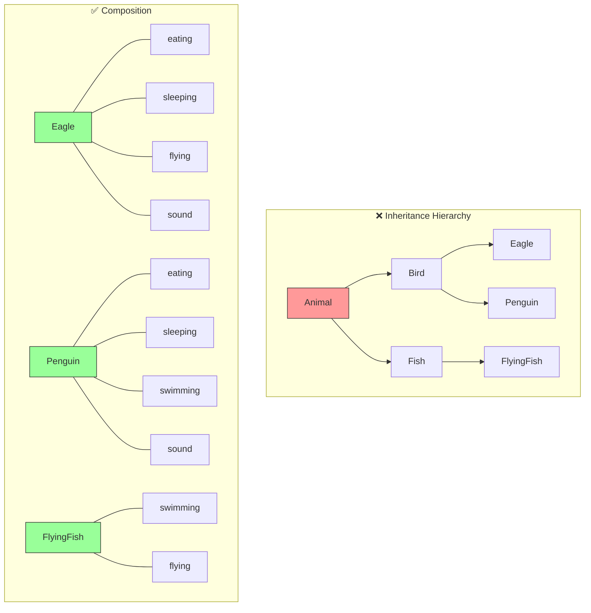
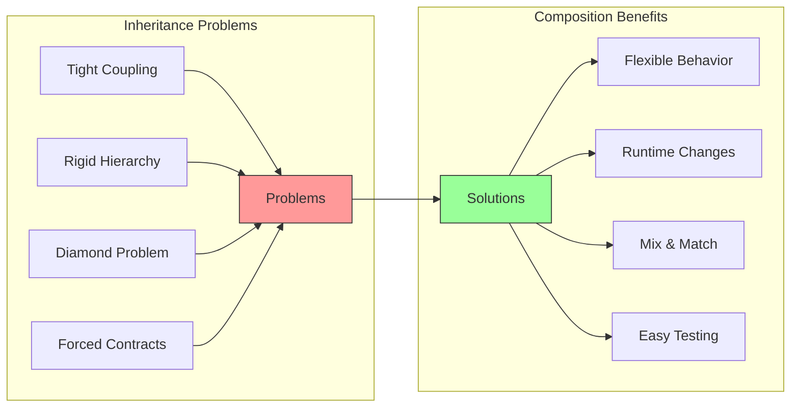

# Composition Over Inheritance

**Favor object composition over class inheritance.** This principle suggests building complex behavior by combining simple, focused objects rather than extending classes through inheritance hierarchies.

<Callout type="info">
"Inheritance is not for code reuse. Inheritance is for polymorphism. If you want code reuse, use composition." - Design Patterns: Elements of Reusable Object-Oriented Software
</Callout>

## The Problem

Inheritance creates tight coupling and rigid hierarchies that are difficult to change. Problems include:

- **Fragile base class problem**: Changes to parent classes break child classes
- **Deep hierarchies**: Hard to understand and maintain
- **Inflexible**: Can't change behavior at runtime
- **Multiple inheritance issues**: Diamond problem, conflicting methods
- **Forced contracts**: Inheriting unwanted methods and properties

### ❌ BAD: Deep Inheritance Hierarchy

<Tabs items={["TypeScript"]}>
<Tab value="TypeScript">
```typescript
// Classic inheritance anti-pattern

class Animal {
  protected name: string;
  
  constructor(name: string) {
    this.name = name;
  }
  
  eat(): void {
    console.log(`${this.name} is eating`);
  }
  
  sleep(): void {
    console.log(`${this.name} is sleeping`);
  }
  
  // Problem: Not all animals make sounds!
  makeSound(): void {
    console.log(`${this.name} makes a sound`);
  }
}

class Bird extends Animal {
  fly(): void {
    console.log(`${this.name} is flying`);
  }
}

// Problem: Penguins can't fly!
class Penguin extends Bird {
  fly(): void {
    throw new Error("Penguins can't fly!"); // Violates LSP
  }
  
  swim(): void {
    console.log(`${this.name} is swimming`);
  }
}

// Problem: What about flying fish? Swimming birds?
// The hierarchy becomes a mess of exceptions

class FlyingFish extends Animal {
  // Wait, Fish should extend Animal, but we need fly()...
  fly(): void {
    console.log(`${this.name} glides through air`);
  }
  
  swim(): void {
    console.log(`${this.name} is swimming`);
  }
}

// Now we have duplication between FlyingFish and Penguin for swim()
// And duplication between FlyingFish and Bird for fly()

// What about a robot bird? It doesn't eat or sleep...
class RobotBird extends Bird {
  eat(): void {
    // Does nothing - robots don't eat
    // But we're forced to have this method!
  }
  
  sleep(): void {
    // Does nothing - robots don't sleep
  }
  
  recharge(): void {
    console.log(`${this.name} is recharging`);
  }
}
```
</Tab>
</Tabs>

**Problems with this hierarchy:**
- Penguin inherits `fly()` but can't fly
- Code duplication between unrelated classes
- RobotBird has meaningless `eat()` and `sleep()` methods
- Adding new capabilities requires restructuring the hierarchy
- Can't mix and match behaviors

## The Solution

Use composition to build objects from smaller, focused behaviors. Each behavior is a separate function or object that can be combined as needed.

### ✅ GOOD: Composition with Behaviors

<Tabs items={["TypeScript"]}>
<Tab value="TypeScript">
```typescript
// Define behaviors as separate functions

interface Entity {
  name: string;
}

// Behavior: Can eat
const withEating = <T extends Entity>(entity: T) => ({
  ...entity,
  eat: () => console.log(`${entity.name} is eating`),
});

// Behavior: Can sleep
const withSleeping = <T extends Entity>(entity: T) => ({
  ...entity,
  sleep: () => console.log(`${entity.name} is sleeping`),
});

// Behavior: Can fly
const withFlying = <T extends Entity>(entity: T) => ({
  ...entity,
  fly: () => console.log(`${entity.name} is flying`),
});

// Behavior: Can swim
const withSwimming = <T extends Entity>(entity: T) => ({
  ...entity,
  swim: () => console.log(`${entity.name} is swimming`),
});

// Behavior: Can make sound
const withSound = <T extends Entity>(sound: string) => (entity: T) => ({
  ...entity,
  makeSound: () => console.log(`${entity.name} says: ${sound}`),
});

// Behavior: Can recharge (for robots)
const withRecharging = <T extends Entity>(entity: T) => ({
  ...entity,
  recharge: () => console.log(`${entity.name} is recharging`),
});

// Now compose animals with exactly the behaviors they need

// Eagle: eats, sleeps, flies, makes sound
const createEagle = (name: string) => {
  const base: Entity = { name };
  return withSound("Screech!")(
    withFlying(
      withSleeping(
        withEating(base)
      )
    )
  );
};

// Penguin: eats, sleeps, swims, makes sound (no flying!)
const createPenguin = (name: string) => {
  const base: Entity = { name };
  return withSound("Honk!")(
    withSwimming(
      withSleeping(
        withEating(base)
      )
    )
  );
};

// Flying fish: swims, flies (no eating/sleeping if we don't want)
const createFlyingFish = (name: string) => {
  const base: Entity = { name };
  return withFlying(withSwimming(base));
};

// Robot bird: flies, recharges (no biological needs)
const createRobotBird = (name: string) => {
  const base: Entity = { name };
  return withRecharging(withFlying(base));
};

// Usage
const eagle = createEagle("Eddie the Eagle");
eagle.eat();       // Eddie the Eagle is eating
eagle.fly();       // Eddie the Eagle is flying
eagle.makeSound(); // Eddie the Eagle says: Screech!

const penguin = createPenguin("Pete the Penguin");
penguin.swim();    // Pete the Penguin is swimming
// penguin.fly(); // ✅ TypeScript error - fly doesn't exist!

const robot = createRobotBird("R2-Bird");
robot.fly();       // R2-Bird is flying
robot.recharge();  // R2-Bird is recharging
// robot.eat();    // ✅ TypeScript error - eat doesn't exist!
```
</Tab>
</Tabs>

**Benefits:**
- Each entity has exactly the behaviors it needs
- No forced inheritance of unwanted methods
- Easy to add new behaviors without changing existing code
- TypeScript enforces correct behavior at compile time
- Behaviors are reusable across unrelated entities

## Composition Visualization



## Real-World Example: Game Characters

### ❌ BAD: Inheritance-Based Characters

<Tabs items={["TypeScript"]}>
<Tab value="TypeScript">
```typescript
// Inheritance nightmare in game development

class Character {
  health: number = 100;
  
  takeDamage(amount: number): void {
    this.health -= amount;
  }
}

class MovableCharacter extends Character {
  x: number = 0;
  y: number = 0;
  
  move(dx: number, dy: number): void {
    this.x += dx;
    this.y += dy;
  }
}

class FlyingCharacter extends MovableCharacter {
  altitude: number = 0;
  
  fly(height: number): void {
    this.altitude = height;
  }
}

class ShootingCharacter extends MovableCharacter {
  ammo: number = 100;
  
  shoot(): void {
    if (this.ammo > 0) {
      this.ammo--;
      console.log("Bang!");
    }
  }
}

// Problem: What about a flying shooter?
// Can't extend both FlyingCharacter AND ShootingCharacter!

// Forced to pick one and duplicate code
class FlyingShooter extends FlyingCharacter {
  ammo: number = 100;
  
  // Duplicated from ShootingCharacter
  shoot(): void {
    if (this.ammo > 0) {
      this.ammo--;
      console.log("Bang!");
    }
  }
}

// What about a turret that shoots but doesn't move?
class Turret extends Character {
  ammo: number = 100;
  
  // More duplication!
  shoot(): void {
    if (this.ammo > 0) {
      this.ammo--;
      console.log("Bang!");
    }
  }
}
```
</Tab>
</Tabs>

### ✅ GOOD: Composition-Based Characters

<Tabs items={["TypeScript"]}>
<Tab value="TypeScript">
```typescript
// Composable game character system

interface Character {
  id: string;
  name: string;
}

// Component types
interface Position {
  x: number;
  y: number;
}

interface HealthComponent {
  health: number;
  maxHealth: number;
  takeDamage: (amount: number) => void;
  heal: (amount: number) => void;
  isDead: () => boolean;
}

interface MovementComponent {
  position: Position;
  speed: number;
  move: (dx: number, dy: number) => void;
  teleport: (x: number, y: number) => void;
}

interface FlyingComponent {
  altitude: number;
  fly: (height: number) => void;
  land: () => void;
}

interface ShootingComponent {
  ammo: number;
  maxAmmo: number;
  shoot: () => boolean;
  reload: () => void;
}

// Component factories
const withHealth = (
  maxHealth: number
): HealthComponent => {
  let health = maxHealth;
  
  return {
    health,
    maxHealth,
    takeDamage: (amount: number) => {
      health = Math.max(0, health - amount);
    },
    heal: (amount: number) => {
      health = Math.min(maxHealth, health + amount);
    },
    isDead: () => health <= 0,
  };
};

const withMovement = (
  speed: number,
  startX = 0,
  startY = 0
): MovementComponent => {
  const position = { x: startX, y: startY };
  
  return {
    position,
    speed,
    move: (dx: number, dy: number) => {
      position.x += dx * speed;
      position.y += dy * speed;
    },
    teleport: (x: number, y: number) => {
      position.x = x;
      position.y = y;
    },
  };
};

const withFlying = (): FlyingComponent => {
  let altitude = 0;
  
  return {
    altitude,
    fly: (height: number) => {
      altitude = Math.max(0, height);
    },
    land: () => {
      altitude = 0;
    },
  };
};

const withShooting = (maxAmmo: number): ShootingComponent => {
  let ammo = maxAmmo;
  
  return {
    ammo,
    maxAmmo,
    shoot: () => {
      if (ammo > 0) {
        ammo--;
        console.log("Bang!");
        return true;
      }
      return false;
    },
    reload: () => {
      ammo = maxAmmo;
    },
  };
};

// Character factories - compose exactly what we need

const createSoldier = (id: string, name: string) => ({
  id,
  name,
  type: "soldier" as const,
  ...withHealth(100),
  ...withMovement(1.0),
  ...withShooting(30),
});

const createJetpackSoldier = (id: string, name: string) => ({
  id,
  name,
  type: "jetpack-soldier" as const,
  ...withHealth(80), // Less health, more mobility
  ...withMovement(1.2),
  ...withFlying(),
  ...withShooting(20),
});

const createTurret = (id: string, name: string) => ({
  id,
  name,
  type: "turret" as const,
  ...withHealth(200),
  // No movement!
  ...withShooting(100),
});

const createScout = (id: string, name: string) => ({
  id,
  name,
  type: "scout" as const,
  ...withHealth(60),
  ...withMovement(2.0), // Fast!
  // No shooting - scouts don't fight
});

const createDrone = (id: string, name: string) => ({
  id,
  name,
  type: "drone" as const,
  ...withHealth(30),
  ...withMovement(1.5),
  ...withFlying(),
  // Can spot enemies but can't shoot
});

// Usage
const soldier = createSoldier("1", "John");
soldier.move(1, 0);
soldier.shoot();
soldier.takeDamage(20);

const jetpack = createJetpackSoldier("2", "Jane");
jetpack.fly(100);
jetpack.shoot();
jetpack.land();

const turret = createTurret("3", "Tower-1");
turret.shoot();
// turret.move(1, 0); // ✅ TypeScript error - turrets can't move!

const scout = createScout("4", "Speedy");
scout.move(5, 5);
// scout.shoot(); // ✅ TypeScript error - scouts can't shoot!
```
</Tab>
</Tabs>

## Composition Patterns

<Accordions>
<Accordion title="Mixin Pattern">

Combine multiple behaviors into a single object:

```typescript
// Type-safe mixin function
type Constructor<T = {}> = new (...args: any[]) => T;

const Timestamped = <TBase extends Constructor>(Base: TBase) => {
  return class extends Base {
    createdAt = new Date();
    updatedAt = new Date();
    
    touch() {
      this.updatedAt = new Date();
    }
  };
};

const Serializable = <TBase extends Constructor>(Base: TBase) => {
  return class extends Base {
    toJSON() {
      return JSON.stringify(this);
    }
    
    static fromJSON(json: string) {
      return JSON.parse(json);
    }
  };
};

// Base class
class Entity {
  constructor(public id: string) {}
}

// Compose mixins
class User extends Timestamped(Serializable(Entity)) {
  constructor(id: string, public name: string) {
    super(id);
  }
}

const user = new User("1", "Alice");
user.touch(); // From Timestamped
user.toJSON(); // From Serializable
```

</Accordion>

<Accordion title="Strategy Pattern">

Inject behavior via composition:

```typescript
// Define strategy interfaces
interface PricingStrategy {
  calculatePrice(basePrice: number, quantity: number): number;
}

interface ShippingStrategy {
  calculateShipping(weight: number, distance: number): number;
}

// Strategy implementations
const regularPricing: PricingStrategy = {
  calculatePrice: (basePrice, quantity) => basePrice * quantity,
};

const bulkPricing: PricingStrategy = {
  calculatePrice: (basePrice, quantity) => {
    const discount = quantity >= 10 ? 0.1 : 0;
    return basePrice * quantity * (1 - discount);
  },
};

const standardShipping: ShippingStrategy = {
  calculateShipping: (weight, distance) => weight * 0.5 + distance * 0.1,
};

const expressShipping: ShippingStrategy = {
  calculateShipping: (weight, distance) => (weight * 0.5 + distance * 0.1) * 2,
};

// Order composed with strategies
const createOrder = (
  pricing: PricingStrategy,
  shipping: ShippingStrategy
) => ({
  items: [] as Array<{ price: number; quantity: number; weight: number }>,
  
  addItem(price: number, quantity: number, weight: number) {
    this.items.push({ price, quantity, weight });
  },
  
  getTotal(distance: number) {
    const subtotal = this.items.reduce(
      (sum, item) => sum + pricing.calculatePrice(item.price, item.quantity),
      0
    );
    
    const totalWeight = this.items.reduce((sum, item) => sum + item.weight, 0);
    const shippingCost = shipping.calculateShipping(totalWeight, distance);
    
    return subtotal + shippingCost;
  },
});

// Create orders with different behaviors
const regularOrder = createOrder(regularPricing, standardShipping);
const bulkExpressOrder = createOrder(bulkPricing, expressShipping);
```

</Accordion>

<Accordion title="Decorator Pattern">

Wrap objects to add behavior:

```typescript
interface Logger {
  log(message: string): void;
}

// Base logger
const createConsoleLogger = (): Logger => ({
  log: (message: string) => console.log(message),
});

// Decorator: Add timestamps
const withTimestamp = (logger: Logger): Logger => ({
  log: (message: string) => {
    const timestamp = new Date().toISOString();
    logger.log(`[${timestamp}] ${message}`);
  },
});

// Decorator: Add log levels
const withLevel = (level: string) => (logger: Logger): Logger => ({
  log: (message: string) => {
    logger.log(`[${level}] ${message}`);
  },
});

// Decorator: Add prefix
const withPrefix = (prefix: string) => (logger: Logger): Logger => ({
  log: (message: string) => {
    logger.log(`${prefix}: ${message}`);
  },
});

// Compose decorators
const logger = withPrefix("MyApp")(
  withLevel("INFO")(
    withTimestamp(
      createConsoleLogger()
    )
  )
);

logger.log("Application started");
// Output: MyApp: [INFO] [2024-01-15T10:30:00.000Z] Application started
```

</Accordion>
</Accordions>

## When to Use Each Approach

| Scenario | Use Inheritance | Use Composition |
|----------|-----------------|-----------------|
| "Is-a" relationship (truly) | ✅ | ❌ |
| Shared behavior across types | ❌ | ✅ |
| Behavior varies at runtime | ❌ | ✅ |
| Multiple behaviors needed | ❌ | ✅ |
| Framework requires it | ✅ | ❌ |
| Deep hierarchy needed | ❌ | ✅ |
| Single level of extension | ✅ | ✅ |

<Callout type="warn">
**Rule of thumb:** If you find yourself creating more than 2 levels of inheritance, or if child classes are overriding parent methods to do nothing, switch to composition.
</Callout>

## Summary



## Related Principles

- **[DIP](/docs/architecture/clean/principles/dip)** - Depend on abstractions, which enables composition
- **[ISP](/docs/architecture/clean/principles/isp)** - Small interfaces compose better
- **[OCP](/docs/architecture/clean/principles/ocp)** - Composition enables extension without modification
- **[SRP](/docs/architecture/clean/principles/srp)** - Each composed unit has one responsibility
