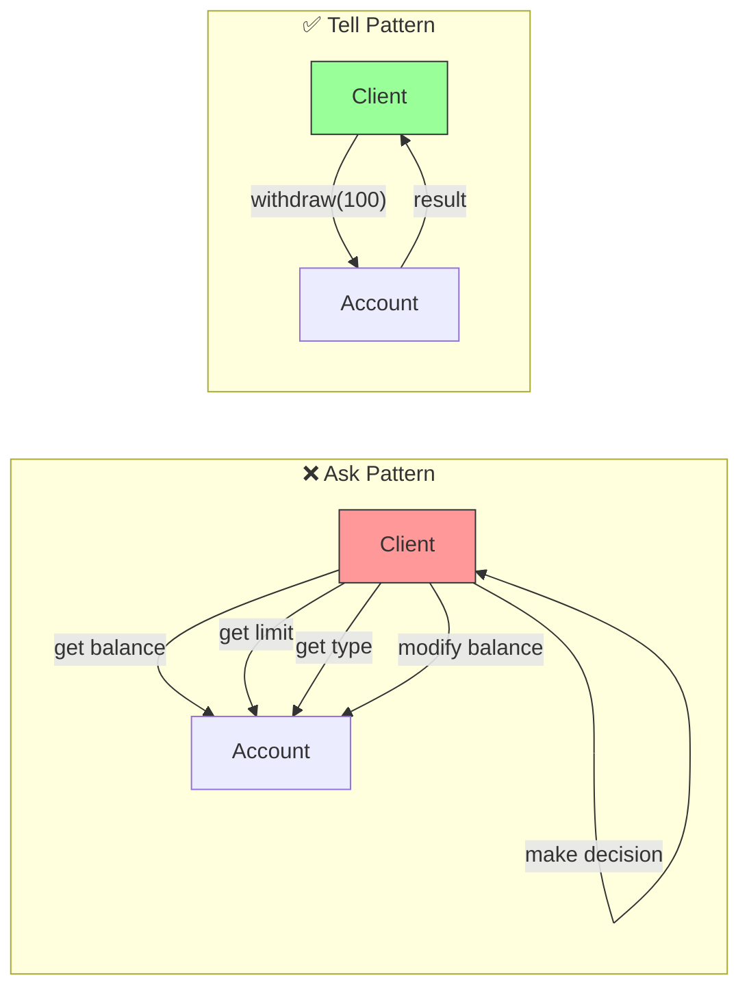
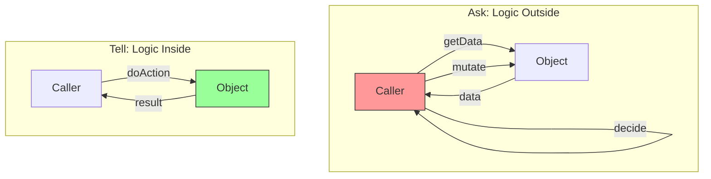

# Tell, Don't Ask

**Tell objects what to do instead of asking them for data and making decisions for them.** This principle emphasizes that objects should encapsulate both data and the behavior that operates on that data.

<Callout type="info">
"Procedural code gets information then makes decisions. Object-oriented code tells objects to do things." - Alec Sharp
</Callout>

## The Problem

When you ask an object for its internal state and then make decisions based on that state, you're putting the logic in the wrong place. This leads to:

- **Violated encapsulation**: Internal state exposed to the outside
- **Duplicated logic**: Same decision logic repeated in multiple places
- **Tight coupling**: Caller depends on internal structure
- **Difficult maintenance**: Changes require updating multiple locations

### ❌ BAD: Ask Then Decide

<Tabs items={["TypeScript"]}>
<Tab value="TypeScript">
```typescript
// Asking for data and making decisions externally

interface BankAccount {
  balance: number;
  overdraftLimit: number;
  accountType: "savings" | "checking";
  isLocked: boolean;
}

// ❌ BAD: External function making decisions about account
const withdraw = (account: BankAccount, amount: number): boolean => {
  // Ask for data
  if (account.isLocked) {
    console.log("Account is locked");
    return false;
  }

  // Ask for more data, make decisions
  if (account.accountType === "savings") {
    // Savings accounts have different rules
    if (account.balance < amount) {
      console.log("Insufficient funds in savings");
      return false;
    }
  } else {
    // Checking accounts can use overdraft
    if (account.balance + account.overdraftLimit < amount) {
      console.log("Exceeds overdraft limit");
      return false;
    }
  }

  // Mutate state directly
  account.balance -= amount;
  return true;
};

// ❌ BAD: More asking and deciding
const getTransactionFee = (account: BankAccount, amount: number): number => {
  // Same pattern: ask for type, make decision
  if (account.accountType === "savings") {
    return amount > 1000 ? 0 : 5;
  } else {
    return account.balance > 10000 ? 0 : 3;
  }
};

// ❌ BAD: Logic about account scattered everywhere
const canTransferTo = (
  from: BankAccount,
  to: BankAccount,
  amount: number
): boolean => {
  // Asking both accounts for their internals
  if (from.isLocked || to.isLocked) return false;
  if (from.balance < amount && from.accountType === "savings") return false;
  if (from.balance + from.overdraftLimit < amount) return false;
  return true;
};
```
</Tab>
</Tabs>

**Problems:**
- Business logic about accounts is spread across multiple functions
- Every function needs to understand account internals
- Adding a new account type requires changes everywhere
- Account invariants might be violated by direct mutation

## The Solution

Let the object make its own decisions. Tell it what you want, and let it figure out how to do it.

### ✅ GOOD: Tell Objects What To Do

<Tabs items={["TypeScript"]}>
<Tab value="TypeScript">
```typescript
// Tell objects what to do, let them decide how

interface WithdrawalResult {
  success: boolean;
  newBalance?: number;
  error?: string;
}

interface TransferResult {
  success: boolean;
  error?: string;
}

// Account encapsulates its own rules
const createBankAccount = (
  initialBalance: number,
  overdraftLimit: number,
  accountType: "savings" | "checking"
) => {
  let balance = initialBalance;
  let isLocked = false;

  return {
    // Tell the account to withdraw - it decides if it can
    withdraw: (amount: number): WithdrawalResult => {
      if (isLocked) {
        return { success: false, error: "Account is locked" };
      }

      const availableFunds =
        accountType === "checking" ? balance + overdraftLimit : balance;

      if (amount > availableFunds) {
        return { success: false, error: "Insufficient funds" };
      }

      balance -= amount;
      return { success: true, newBalance: balance };
    },

    // Tell the account to deposit - it handles the logic
    deposit: (amount: number): WithdrawalResult => {
      if (isLocked) {
        return { success: false, error: "Account is locked" };
      }

      if (amount <= 0) {
        return { success: false, error: "Invalid amount" };
      }

      balance += amount;
      return { success: true, newBalance: balance };
    },

    // Tell the account to calculate its fee - it knows its rules
    calculateTransactionFee: (amount: number): number => {
      if (accountType === "savings") {
        return amount > 1000 ? 0 : 5;
      }
      return balance > 10000 ? 0 : 3;
    },

    // Tell the account to transfer - it coordinates with another account
    transferTo: (
      targetAccount: ReturnType<typeof createBankAccount>,
      amount: number
    ): TransferResult => {
      const withdrawResult = this.withdraw(amount);

      if (!withdrawResult.success) {
        return { success: false, error: withdrawResult.error };
      }

      const depositResult = targetAccount.deposit(amount);

      if (!depositResult.success) {
        // Rollback
        balance += amount;
        return { success: false, error: depositResult.error };
      }

      return { success: true };
    },

    // Tell the account to lock itself
    lock: (): void => {
      isLocked = true;
    },

    // Tell the account to unlock itself
    unlock: (): void => {
      isLocked = false;
    },

    // Only expose what's truly needed
    getBalance: (): number => balance,
    isAccountLocked: (): boolean => isLocked,
  };
};

// Usage - we TELL the account what to do
const savings = createBankAccount(1000, 0, "savings");
const checking = createBankAccount(500, 200, "checking");

// Tell savings to withdraw
const result = savings.withdraw(100);
if (result.success) {
  console.log(`New balance: ${result.newBalance}`);
}

// Tell savings to transfer to checking
savings.transferTo(checking, 200);

// Tell account to calculate its own fee
const fee = savings.calculateTransactionFee(500);
```
</Tab>
</Tabs>

**Benefits:**
- All account logic is in one place
- Easy to add new account types
- Caller doesn't need to know internal rules
- Account invariants are protected

## Tell Don't Ask Visualization



## Real-World Example: Shopping Cart

### ❌ BAD: Asking Cart for Data

<Tabs items={["TypeScript"]}>
<Tab value="TypeScript">
```typescript
// Ask-style shopping cart

interface CartItem {
  productId: string;
  name: string;
  price: number;
  quantity: number;
  category: string;
}

interface ShoppingCart {
  items: CartItem[];
  couponCode?: string;
  membershipLevel: "regular" | "premium" | "vip";
}

// ❌ BAD: External function asking cart for everything
const calculateTotal = (cart: ShoppingCart): number => {
  let total = 0;

  // Ask for items, iterate externally
  for (const item of cart.items) {
    total += item.price * item.quantity;
  }

  // Ask for membership, apply discount
  if (cart.membershipLevel === "premium") {
    total *= 0.95; // 5% discount
  } else if (cart.membershipLevel === "vip") {
    total *= 0.9; // 10% discount
  }

  // Ask for coupon, apply if present
  if (cart.couponCode === "SAVE10") {
    total -= 10;
  }

  return total;
};

// ❌ BAD: More external logic
const hasElectronics = (cart: ShoppingCart): boolean => {
  return cart.items.some((item) => item.category === "electronics");
};

const getShippingCost = (cart: ShoppingCart): number => {
  // Ask for total
  const total = calculateTotal(cart);

  // Ask for items to check categories
  if (hasElectronics(cart)) {
    return 15; // Electronics need special shipping
  }

  return total > 50 ? 0 : 10; // Free shipping over $50
};
```
</Tab>
</Tabs>

### ✅ GOOD: Telling Cart What to Do

<Tabs items={["TypeScript"]}>
<Tab value="TypeScript">
```typescript
// Tell-style shopping cart

interface Product {
  id: string;
  name: string;
  price: number;
  category: string;
}

interface CartItemInfo {
  product: Product;
  quantity: number;
}

const createShoppingCart = (
  membershipLevel: "regular" | "premium" | "vip" = "regular"
) => {
  const items = new Map<string, CartItemInfo>();
  let couponCode: string | null = null;

  // Private helper - cart's internal logic
  const getMembershipDiscount = (): number => {
    switch (membershipLevel) {
      case "vip":
        return 0.1;
      case "premium":
        return 0.05;
      default:
        return 0;
    }
  };

  const getCouponDiscount = (): number => {
    if (couponCode === "SAVE10") return 10;
    if (couponCode === "SAVE20") return 20;
    return 0;
  };

  return {
    // Tell cart to add item - it handles the logic
    addItem: (product: Product, quantity: number = 1): void => {
      const existing = items.get(product.id);
      if (existing) {
        existing.quantity += quantity;
      } else {
        items.set(product.id, { product, quantity });
      }
    },

    // Tell cart to remove item
    removeItem: (productId: string): boolean => {
      return items.delete(productId);
    },

    // Tell cart to update quantity
    updateQuantity: (productId: string, quantity: number): boolean => {
      const item = items.get(productId);
      if (!item) return false;

      if (quantity <= 0) {
        items.delete(productId);
      } else {
        item.quantity = quantity;
      }
      return true;
    },

    // Tell cart to apply coupon - it validates
    applyCoupon: (code: string): boolean => {
      const validCoupons = ["SAVE10", "SAVE20"];
      if (validCoupons.includes(code)) {
        couponCode = code;
        return true;
      }
      return false;
    },

    // Tell cart to calculate its total - it knows the rules
    getTotal: (): number => {
      let subtotal = 0;
      for (const { product, quantity } of items.values()) {
        subtotal += product.price * quantity;
      }

      // Apply membership discount
      subtotal *= 1 - getMembershipDiscount();

      // Apply coupon
      subtotal -= getCouponDiscount();

      return Math.max(0, subtotal);
    },

    // Tell cart to calculate shipping - it knows its contents
    getShippingCost: (): number => {
      const total = this.getTotal();
      const hasElectronics = Array.from(items.values()).some(
        ({ product }) => product.category === "electronics"
      );

      if (hasElectronics) return 15;
      return total > 50 ? 0 : 10;
    },

    // Tell cart to provide a summary
    getSummary: () => ({
      itemCount: Array.from(items.values()).reduce(
        (sum, { quantity }) => sum + quantity,
        0
      ),
      subtotal: this.getTotal(),
      shipping: this.getShippingCost(),
      total: this.getTotal() + this.getShippingCost(),
    }),

    // Tell cart to check if it's empty
    isEmpty: (): boolean => items.size === 0,

    // Tell cart to clear itself
    clear: (): void => {
      items.clear();
      couponCode = null;
    },
  };
};

// Usage - Tell the cart what to do
const cart = createShoppingCart("premium");

cart.addItem({ id: "1", name: "Book", price: 29.99, category: "books" }, 2);
cart.addItem({ id: "2", name: "Laptop", price: 999, category: "electronics" });
cart.applyCoupon("SAVE10");

const summary = cart.getSummary();
console.log(`Total: $${summary.total}`);
```
</Tab>
</Tabs>

## Identifying "Ask" Patterns

<Accordions>
<Accordion title="Warning Signs">

Look for these code smells that indicate you're asking instead of telling:

```typescript
// ❌ Chained getters
if (order.getCustomer().getAddress().getCountry() === "US") {
  // Apply US tax
}

// ❌ Feature envy - function knows too much about another object
const calculateBonus = (employee: Employee) => {
  if (employee.department === "Sales") {
    return employee.salary * employee.salesPerformance * 0.1;
  }
  return employee.salary * 0.05;
};

// ❌ Null checks on retrieved data
const discount = customer.getDiscount();
if (discount !== null && discount.isActive && discount.percentage > 0) {
  total *= 1 - discount.percentage;
}

// ❌ Instanceof/type checks
if (shape.type === "circle") {
  area = Math.PI * shape.radius ** 2;
} else if (shape.type === "rectangle") {
  area = shape.width * shape.height;
}
```

</Accordion>

<Accordion title="How to Refactor">

Transform "ask" code to "tell" code:

```typescript
// ✅ Tell order to check shipping
order.isShippingToUS(); // Order knows its customer's address

// ✅ Tell employee to calculate their bonus
employee.calculateBonus(); // Employee knows their department rules

// ✅ Tell customer to apply their discount
customer.applyDiscountTo(total); // Customer manages their own discounts

// ✅ Tell shape to calculate its area
shape.calculateArea(); // Shape knows its own geometry
```

</Accordion>

<Accordion title="When Asking is OK">

Asking is acceptable when:

- Displaying data to users (read-only views)
- Serializing/deserializing objects
- Logging and debugging
- Working with pure data structures (DTOs)
- Functional transformations on collections

```typescript
// OK: Displaying to user
const displayUser = (user: User): string => {
  return `${user.getName()} (${user.getEmail()})`;
};

// OK: Pure data mapping
const productIds = orders.map((order) => order.getProductId());

// OK: DTO for API response
const userDTO = {
  id: user.getId(),
  name: user.getName(),
  email: user.getEmail(),
};
```

</Accordion>
</Accordions>

## Summary

| Ask Pattern | Tell Pattern |
|-------------|--------------|
| Get data, make decision | Send command with parameters |
| Logic in caller | Logic in object |
| Object is passive data | Object is active participant |
| Exposed internals | Encapsulated behavior |
| Scattered logic | Centralized logic |



<Callout type="warn">
Remember: If you find yourself writing code that gets data from an object, makes a decision, and then tells the object what to do based on that decision - you're doing it wrong. Push that decision into the object itself.
</Callout>

## Related Principles

- **[Law of Demeter](/docs/architecture/clean/principles/lod)** - Only talk to immediate friends
- **[SRP](/docs/architecture/clean/principles/srp)** - Each object handles its own responsibility
- **[OCP](/docs/architecture/clean/principles/ocp)** - Tell enables extension through new commands
