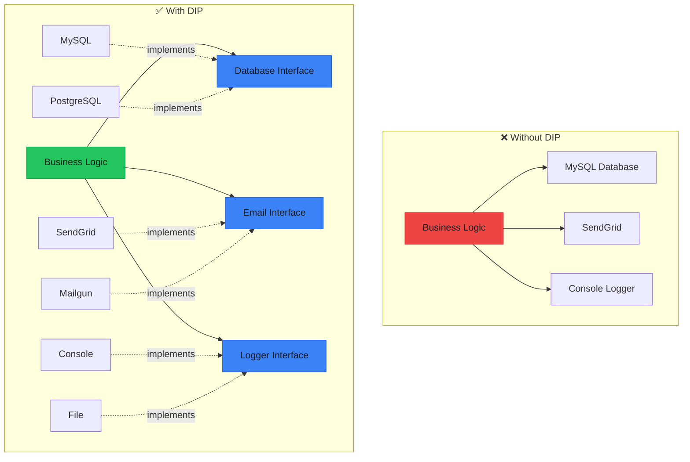
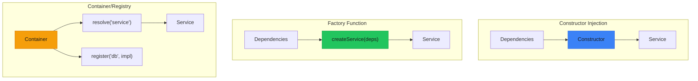

# Dependency Inversion Principle (DIP)

> **"High-level modules should not depend on low-level modules. Both should depend on abstractions. Abstractions should not depend on details. Details should depend on abstractions."** — Robert C. Martin

The Dependency Inversion Principle inverts the traditional dependency flow. Instead of high-level business logic depending on low-level implementation details, both depend on stable abstractions.



---

## The Problem

### Direct Dependencies on Implementations

When high-level modules directly depend on low-level modules, changes to infrastructure require changes to business logic.

```typescript
/**
 * ❌ BAD: Business logic directly depends on implementations
 * 
 * Problems:
 * 1. Can't test without real MySQL and SendGrid
 * 2. Can't switch to PostgreSQL without changing UserService
 * 3. Can't switch to Mailgun without changing UserService
 * 4. Business logic mixed with infrastructure details
 */

// Low-level: Concrete MySQL implementation
const MySQLDatabase = {
  connectionString: "mysql://localhost:3306/mydb",
  
  connect() {
    console.log(`Connecting to ${this.connectionString}`);
  },
  
  query(sql: string) {
    console.log(`MySQL Query: ${sql}`);
    return [];
  },
  
  disconnect() {
    console.log("Disconnecting from MySQL");
  },
};

// Low-level: Concrete SendGrid implementation
const SendGridEmailer = {
  apiKey: "sg_api_key_123",
  
  send(to: string, subject: string, body: string) {
    console.log(`SendGrid: Sending "${subject}" to ${to}`);
    // Uses SendGrid-specific API
  },
};

// Low-level: Concrete console logger
const ConsoleLogger = {
  log(level: string, message: string) {
    console.log(`[${level}] ${message}`);
  },
};

// High-level: Business logic DIRECTLY depends on low-level implementations
const createUserService = () => ({
  async register(email: string, name: string) {
    // 🚨 Direct dependency on MySQL
    MySQLDatabase.connect();
    
    // 🚨 Direct dependency on MySQL query syntax
    const existing = MySQLDatabase.query(`SELECT * FROM users WHERE email = '${email}'`);
    if (existing.length > 0) {
      throw new Error("Email already exists");
    }
    
    // 🚨 Direct dependency on MySQL
    MySQLDatabase.query(`INSERT INTO users (email, name) VALUES ('${email}', '${name}')`);
    
    // 🚨 Direct dependency on Console
    ConsoleLogger.log("INFO", `User registered: ${email}`);
    
    // 🚨 Direct dependency on SendGrid
    SendGridEmailer.send(email, "Welcome!", `Hello ${name}!`);
    
    MySQLDatabase.disconnect();
    
    return { email, name };
  },
});

// Testing is nearly impossible:
// - Need real MySQL database
// - Need real SendGrid account
// - Console output pollutes tests
// - Can't verify email was "sent"
```

---

## The Solution

### Depend on Abstractions (Interfaces)

<Tabs items={["Define Abstractions", "Implement Abstractions", "Compose at Root", "Testing with Mocks"]}>
<Tab value="Define Abstractions">

```typescript
/**
 * ✅ GOOD: Define abstractions (interfaces) first
 * 
 * These abstractions live at the BUSINESS level
 * They describe WHAT we need, not HOW it's done
 */

// --- Database Abstraction ---
export interface Database {
  connect: () => Promise<void>;
  disconnect: () => Promise<void>;
  query: <T>(sql: string, params?: unknown[]) => Promise<T[]>;
  execute: (sql: string, params?: unknown[]) => Promise<{ affectedRows: number }>;
  transaction: <T>(fn: () => Promise<T>) => Promise<T>;
}

// --- Email Service Abstraction ---
export interface EmailService {
  send: (options: {
    to: string;
    subject: string;
    body: string;
    html?: string;
    attachments?: { filename: string; content: Buffer }[];
  }) => Promise<{ messageId: string }>;
  
  sendBatch: (messages: Array<{
    to: string;
    subject: string;
    body: string;
  }>) => Promise<{ sent: number; failed: number }>;
}

// --- Logger Abstraction ---
export interface Logger {
  debug: (message: string, meta?: Record<string, unknown>) => void;
  info: (message: string, meta?: Record<string, unknown>) => void;
  warn: (message: string, meta?: Record<string, unknown>) => void;
  error: (message: string, error?: Error) => void;
}

// --- User Repository Abstraction ---
// Even higher-level abstraction that uses Database
export interface User {
  id: string;
  email: string;
  name: string;
  passwordHash: string;
  createdAt: Date;
}

export interface UserRepository {
  findById: (id: string) => Promise<User | null>;
  findByEmail: (email: string) => Promise<User | null>;
  create: (user: Omit<User, "id" | "createdAt">) => Promise<User>;
  update: (id: string, data: Partial<User>) => Promise<User>;
  delete: (id: string) => Promise<void>;
  exists: (email: string) => Promise<boolean>;
}

// --- Password Hasher Abstraction ---
export interface PasswordHasher {
  hash: (password: string) => Promise<string>;
  verify: (password: string, hash: string) => Promise<boolean>;
}

// --- Event Bus Abstraction ---
export interface EventBus {
  publish: (event: string, payload: unknown) => Promise<void>;
  subscribe: (event: string, handler: (payload: unknown) => Promise<void>) => void;
}
```

</Tab>
<Tab value="Implement Abstractions">

```typescript
interface Database {
  connect: () => Promise<void>;
  disconnect: () => Promise<void>;
  query: <T>(sql: string, params?: unknown[]) => Promise<T[]>;
  execute: (sql: string, params?: unknown[]) => Promise<{ affectedRows: number }>;
  transaction: <T>(fn: () => Promise<T>) => Promise<T>;
}

interface EmailService {
  send: (options: {
    to: string;
    subject: string;
    body: string;
    html?: string;
  }) => Promise<{ messageId: string }>;
  
  sendBatch: (messages: Array<{
    to: string;
    subject: string;
    body: string;
  }>) => Promise<{ sent: number; failed: number }>;
}

interface Logger {
  debug: (message: string, meta?: Record<string, unknown>) => void;
  info: (message: string, meta?: Record<string, unknown>) => void;
  warn: (message: string, meta?: Record<string, unknown>) => void;
  error: (message: string, error?: Error) => void;
}
// ---cut---
/**
 * ✅ GOOD: Implementations depend on abstractions
 * Multiple implementations can exist for each abstraction
 */

// --- MySQL Implementation ---
export const createMySQLDatabase = (connectionString: string): Database => ({
  async connect() {
    console.log(`MySQL: Connecting to ${connectionString}`);
  },
  
  async disconnect() {
    console.log("MySQL: Disconnecting");
  },
  
  async query<T>(sql: string, params?: unknown[]): Promise<T[]> {
    console.log(`MySQL: ${sql}`, params);
    return [] as T[];
  },
  
  async execute(sql: string, params?: unknown[]) {
    console.log(`MySQL: ${sql}`, params);
    return { affectedRows: 1 };
  },
  
  async transaction<T>(fn: () => Promise<T>): Promise<T> {
    console.log("MySQL: BEGIN TRANSACTION");
    try {
      const result = await fn();
      console.log("MySQL: COMMIT");
      return result;
    } catch (error) {
      console.log("MySQL: ROLLBACK");
      throw error;
    }
  },
});

// --- PostgreSQL Implementation ---
export const createPostgreSQLDatabase = (connectionString: string): Database => ({
  async connect() {
    console.log(`PostgreSQL: Connecting to ${connectionString}`);
  },
  
  async disconnect() {
    console.log("PostgreSQL: Disconnecting");
  },
  
  async query<T>(sql: string, params?: unknown[]): Promise<T[]> {
    console.log(`PostgreSQL: ${sql}`, params);
    return [] as T[];
  },
  
  async execute(sql: string, params?: unknown[]) {
    console.log(`PostgreSQL: ${sql}`, params);
    return { affectedRows: 1 };
  },
  
  async transaction<T>(fn: () => Promise<T>): Promise<T> {
    console.log("PostgreSQL: BEGIN");
    try {
      const result = await fn();
      console.log("PostgreSQL: COMMIT");
      return result;
    } catch (error) {
      console.log("PostgreSQL: ROLLBACK");
      throw error;
    }
  },
});

// --- SendGrid Implementation ---
export const createSendGridEmailer = (apiKey: string): EmailService => ({
  async send({ to, subject, body, html }) {
    console.log(`SendGrid [${apiKey.slice(0, 8)}...]: "${subject}" -> ${to}`);
    return { messageId: `sg_${Date.now()}` };
  },
  
  async sendBatch(messages) {
    console.log(`SendGrid: Sending batch of ${messages.length}`);
    return { sent: messages.length, failed: 0 };
  },
});

// --- Mailgun Implementation ---
export const createMailgunEmailer = (apiKey: string, domain: string): EmailService => ({
  async send({ to, subject, body }) {
    console.log(`Mailgun [${domain}]: "${subject}" -> ${to}`);
    return { messageId: `mg_${Date.now()}` };
  },
  
  async sendBatch(messages) {
    console.log(`Mailgun: Sending batch of ${messages.length}`);
    return { sent: messages.length, failed: 0 };
  },
});

// --- Console Logger Implementation ---
export const createConsoleLogger = (prefix: string = ""): Logger => ({
  debug(message, meta) {
    console.debug(`${prefix}[DEBUG] ${message}`, meta ?? "");
  },
  info(message, meta) {
    console.info(`${prefix}[INFO] ${message}`, meta ?? "");
  },
  warn(message, meta) {
    console.warn(`${prefix}[WARN] ${message}`, meta ?? "");
  },
  error(message, error) {
    console.error(`${prefix}[ERROR] ${message}`, error?.stack ?? "");
  },
});

// --- File Logger Implementation ---
export const createFileLogger = (filePath: string): Logger => {
  const write = (level: string, message: string, meta?: unknown) => {
    const line = JSON.stringify({
      timestamp: new Date().toISOString(),
      level,
      message,
      meta,
    });
    console.log(`[File: ${filePath}] ${line}`);
    // In real implementation: fs.appendFile(filePath, line + '\n')
  };
  
  return {
    debug(message, meta) { write("DEBUG", message, meta); },
    info(message, meta) { write("INFO", message, meta); },
    warn(message, meta) { write("WARN", message, meta); },
    error(message, error) { write("ERROR", message, { error: error?.message }); },
  };
};
```

</Tab>
<Tab value="Compose at Root">

```typescript
interface Database {
  connect: () => Promise<void>;
  disconnect: () => Promise<void>;
  query: <T>(sql: string, params?: unknown[]) => Promise<T[]>;
  execute: (sql: string, params?: unknown[]) => Promise<{ affectedRows: number }>;
}

interface EmailService {
  send: (options: { to: string; subject: string; body: string }) => Promise<{ messageId: string }>;
}

interface Logger {
  debug: (message: string, meta?: Record<string, unknown>) => void;
  info: (message: string, meta?: Record<string, unknown>) => void;
  warn: (message: string, meta?: Record<string, unknown>) => void;
  error: (message: string, error?: Error) => void;
}

interface User {
  id: string;
  email: string;
  name: string;
  passwordHash: string;
  createdAt: Date;
}

interface UserRepository {
  findById: (id: string) => Promise<User | null>;
  findByEmail: (email: string) => Promise<User | null>;
  create: (user: Omit<User, "id" | "createdAt">) => Promise<User>;
  update: (id: string, data: Partial<User>) => Promise<User>;
  delete: (id: string) => Promise<void>;
  exists: (email: string) => Promise<boolean>;
}

interface PasswordHasher {
  hash: (password: string) => Promise<string>;
  verify: (password: string, hash: string) => Promise<boolean>;
}

const createMySQLDatabase = (connectionString: string): Database => ({
  async connect() {},
  async disconnect() {},
  async query<T>(): Promise<T[]> { return []; },
  async execute() { return { affectedRows: 1 }; },
});

const createPostgreSQLDatabase = (connectionString: string): Database => ({
  async connect() {},
  async disconnect() {},
  async query<T>(): Promise<T[]> { return []; },
  async execute() { return { affectedRows: 1 }; },
});

const createSendGridEmailer = (apiKey: string): EmailService => ({
  async send() { return { messageId: "sg_123" }; },
});

const createMailgunEmailer = (apiKey: string, domain: string): EmailService => ({
  async send() { return { messageId: "mg_123" }; },
});

const createConsoleLogger = (prefix: string = ""): Logger => ({
  debug() {},
  info() {},
  warn() {},
  error() {},
});

const createFileLogger = (path: string): Logger => ({
  debug() {},
  info() {},
  warn() {},
  error() {},
});
// ---cut---
/**
 * ✅ GOOD: Compose dependencies at application root
 * 
 * The "Composition Root" is where all dependencies are wired together
 * This is the ONLY place that knows about concrete implementations
 */

// --- User Repository (depends on Database abstraction) ---
const createUserRepository = (db: Database): UserRepository => ({
  async findById(id) {
    const results = await db.query<User>(
      "SELECT * FROM users WHERE id = $1",
      [id]
    );
    return results[0] ?? null;
  },
  
  async findByEmail(email) {
    const results = await db.query<User>(
      "SELECT * FROM users WHERE email = $1",
      [email]
    );
    return results[0] ?? null;
  },
  
  async create(user) {
    const id = `user_${Date.now()}`;
    await db.execute(
      "INSERT INTO users (id, email, name, password_hash) VALUES ($1, $2, $3, $4)",
      [id, user.email, user.name, user.passwordHash]
    );
    return { ...user, id, createdAt: new Date() };
  },
  
  async update(id, data) {
    // Build update query dynamically
    const results = await db.query<User>("SELECT * FROM users WHERE id = $1", [id]);
    return { ...results[0], ...data } as User;
  },
  
  async delete(id) {
    await db.execute("DELETE FROM users WHERE id = $1", [id]);
  },
  
  async exists(email) {
    const results = await db.query("SELECT 1 FROM users WHERE email = $1", [email]);
    return results.length > 0;
  },
});

// --- Password Hasher ---
const createPasswordHasher = (): PasswordHasher => ({
  async hash(password) {
    return `hashed_${password}_${Date.now()}`;
  },
  async verify(password, hash) {
    return hash.startsWith(`hashed_${password}_`);
  },
});

// --- User Service (depends on abstractions) ---
interface UserServiceDeps {
  userRepository: UserRepository;
  passwordHasher: PasswordHasher;
  emailService: EmailService;
  logger: Logger;
}

const createUserService = (deps: UserServiceDeps) => ({
  async register(email: string, name: string, password: string) {
    const { userRepository, passwordHasher, emailService, logger } = deps;
    
    logger.info("Registering user", { email });
    
    // Check existing
    if (await userRepository.exists(email)) {
      logger.warn("Registration failed: email exists", { email });
      throw new Error("Email already registered");
    }
    
    // Hash password
    const passwordHash = await passwordHasher.hash(password);
    
    // Create user
    const user = await userRepository.create({ email, name, passwordHash });
    logger.info("User created", { userId: user.id });
    
    // Send welcome email
    await emailService.send({
      to: email,
      subject: "Welcome!",
      body: `Hello ${name}, welcome aboard!`,
    });
    logger.info("Welcome email sent", { email });
    
    return user;
  },
});

// --- Composition Root: Wire everything together ---
type Environment = "development" | "production" | "test";

const createApplication = (env: Environment) => {
  // Choose implementations based on environment
  const db = env === "production"
    ? createPostgreSQLDatabase(process.env.DATABASE_URL ?? "")
    : createMySQLDatabase("mysql://localhost/dev");
  
  const emailService = env === "production"
    ? createSendGridEmailer(process.env.SENDGRID_KEY ?? "")
    : createMailgunEmailer("dev_key", "sandbox.mailgun.org");
  
  const logger = env === "production"
    ? createFileLogger("/var/log/app.log")
    : createConsoleLogger("[Dev] ");
  
  // Create repositories
  const userRepository = createUserRepository(db);
  const passwordHasher = createPasswordHasher();
  
  // Create services
  const userService = createUserService({
    userRepository,
    passwordHasher,
    emailService,
    logger,
  });
  
  return {
    db,
    userService,
    async start() {
      await db.connect();
      logger.info("Application started", { env });
    },
    async stop() {
      await db.disconnect();
      logger.info("Application stopped");
    },
  };
};

// Usage
const app = createApplication("development");
await app.start();
await app.userService.register("alice@example.com", "Alice", "password123");
await app.stop();
```

</Tab>
<Tab value="Testing with Mocks">

```typescript
interface User {
  id: string;
  email: string;
  name: string;
  passwordHash: string;
  createdAt: Date;
}

interface UserRepository {
  findById: (id: string) => Promise<User | null>;
  findByEmail: (email: string) => Promise<User | null>;
  create: (user: Omit<User, "id" | "createdAt">) => Promise<User>;
  exists: (email: string) => Promise<boolean>;
}

interface PasswordHasher {
  hash: (password: string) => Promise<string>;
  verify: (password: string, hash: string) => Promise<boolean>;
}

interface EmailService {
  send: (options: { to: string; subject: string; body: string }) => Promise<{ messageId: string }>;
}

interface Logger {
  debug: (message: string, meta?: Record<string, unknown>) => void;
  info: (message: string, meta?: Record<string, unknown>) => void;
  warn: (message: string, meta?: Record<string, unknown>) => void;
  error: (message: string, error?: Error) => void;
}

interface UserServiceDeps {
  userRepository: UserRepository;
  passwordHasher: PasswordHasher;
  emailService: EmailService;
  logger: Logger;
}

const createUserService = (deps: UserServiceDeps) => ({
  async register(email: string, name: string, password: string) {
    const { userRepository, passwordHasher, emailService, logger } = deps;
    
    logger.info("Registering user", { email });
    
    if (await userRepository.exists(email)) {
      logger.warn("Registration failed: email exists", { email });
      throw new Error("Email already registered");
    }
    
    const passwordHash = await passwordHasher.hash(password);
    const user = await userRepository.create({ email, name, passwordHash });
    logger.info("User created", { userId: user.id });
    
    await emailService.send({
      to: email,
      subject: "Welcome!",
      body: `Hello ${name}, welcome aboard!`,
    });
    logger.info("Welcome email sent", { email });
    
    return user;
  },
});
// ---cut---
/**
 * ✅ GOOD: Testing with mock implementations
 * 
 * DIP makes testing trivial - just inject mocks!
 */

// --- Mock implementations for testing ---
const createMockUserRepository = (): UserRepository & {
  users: Map<string, User>;
  reset: () => void;
} => {
  const users = new Map<string, User>();
  
  return {
    users,
    reset() {
      users.clear();
    },
    
    async findById(id) {
      return users.get(id) ?? null;
    },
    
    async findByEmail(email) {
      for (const user of users.values()) {
        if (user.email === email) return user;
      }
      return null;
    },
    
    async create(user) {
      const newUser: User = {
        ...user,
        id: `user_${Date.now()}`,
        createdAt: new Date(),
      };
      users.set(newUser.id, newUser);
      return newUser;
    },
    
    async exists(email) {
      for (const user of users.values()) {
        if (user.email === email) return true;
      }
      return false;
    },
  };
};

const createMockEmailService = (): EmailService & {
  sentEmails: { to: string; subject: string; body: string }[];
  reset: () => void;
} => {
  const sentEmails: { to: string; subject: string; body: string }[] = [];
  
  return {
    sentEmails,
    reset() {
      sentEmails.length = 0;
    },
    
    async send({ to, subject, body }) {
      sentEmails.push({ to, subject, body });
      return { messageId: `mock_${Date.now()}` };
    },
  };
};

const createMockLogger = (): Logger & {
  logs: { level: string; message: string }[];
  reset: () => void;
} => {
  const logs: { level: string; message: string }[] = [];
  
  return {
    logs,
    reset() {
      logs.length = 0;
    },
    debug(message) { logs.push({ level: "debug", message }); },
    info(message) { logs.push({ level: "info", message }); },
    warn(message) { logs.push({ level: "warn", message }); },
    error(message) { logs.push({ level: "error", message }); },
  };
};

const createMockPasswordHasher = (): PasswordHasher => ({
  async hash(password) {
    return `mock_hash_${password}`;
  },
  async verify(password, hash) {
    return hash === `mock_hash_${password}`;
  },
});

// --- Test suite ---
const runTests = async () => {
  console.log("Running tests...\n");
  
  // Create mocks
  const mockRepo = createMockUserRepository();
  const mockEmail = createMockEmailService();
  const mockLogger = createMockLogger();
  const mockHasher = createMockPasswordHasher();
  
  // Create service with mocks
  const userService = createUserService({
    userRepository: mockRepo,
    emailService: mockEmail,
    logger: mockLogger,
    passwordHasher: mockHasher,
  });
  
  // Test 1: Successful registration
  console.log("Test 1: Successful registration");
  mockRepo.reset();
  mockEmail.reset();
  
  const user = await userService.register("test@example.com", "Test User", "password123");
  
  console.assert(user.email === "test@example.com", "Email should match");
  console.assert(user.name === "Test User", "Name should match");
  console.assert(mockEmail.sentEmails.length === 1, "Should send one email");
  console.assert(mockEmail.sentEmails[0].to === "test@example.com", "Email recipient should match");
  console.log("✅ Test 1 passed\n");
  
  // Test 2: Duplicate email rejection
  console.log("Test 2: Duplicate email rejection");
  
  try {
    await userService.register("test@example.com", "Another User", "password456");
    console.assert(false, "Should have thrown error");
  } catch (error) {
    console.assert((error as Error).message === "Email already registered", "Error message should match");
  }
  console.log("✅ Test 2 passed\n");
  
  // Test 3: Logging verification
  console.log("Test 3: Logging verification");
  mockLogger.reset();
  mockRepo.reset();
  mockEmail.reset();
  
  await userService.register("new@example.com", "New User", "pass");
  
  const infoLogs = mockLogger.logs.filter(l => l.level === "info");
  console.assert(infoLogs.length >= 2, "Should have at least 2 info logs");
  console.log("✅ Test 3 passed\n");
  
  console.log("All tests passed! ✨");
};

runTests();
```

</Tab>
</Tabs>

---

## Real-World Example: Order Processing System

```typescript
/**
 * ✅ GOOD: Complete order processing with DIP
 * 
 * High-level policy: Order processing workflow
 * Low-level details: Payment gateways, shipping providers, notifications
 */

// --- Abstractions ---
interface Order {
  id: string;
  customerId: string;
  items: { productId: string; quantity: number; price: number }[];
  total: number;
  status: "pending" | "paid" | "shipped" | "delivered" | "cancelled";
}

interface PaymentResult {
  success: boolean;
  transactionId?: string;
  error?: string;
}

interface PaymentGateway {
  charge: (customerId: string, amount: number, currency: string) => Promise<PaymentResult>;
  refund: (transactionId: string, amount: number) => Promise<PaymentResult>;
}

interface ShippingLabel {
  trackingNumber: string;
  carrier: string;
  estimatedDelivery: Date;
  labelUrl: string;
}

interface ShippingProvider {
  createLabel: (order: Order, address: string) => Promise<ShippingLabel>;
  getTrackingInfo: (trackingNumber: string) => Promise<{ status: string; location?: string }>;
  cancelShipment: (trackingNumber: string) => Promise<boolean>;
}

interface InventoryService {
  checkAvailability: (productId: string, quantity: number) => Promise<boolean>;
  reserve: (productId: string, quantity: number) => Promise<boolean>;
  release: (productId: string, quantity: number) => Promise<void>;
  commit: (productId: string, quantity: number) => Promise<void>;
}

interface NotificationService {
  sendOrderConfirmation: (customerId: string, order: Order) => Promise<void>;
  sendShippingNotification: (customerId: string, order: Order, label: ShippingLabel) => Promise<void>;
  sendDeliveryNotification: (customerId: string, order: Order) => Promise<void>;
}

interface OrderRepository {
  save: (order: Order) => Promise<Order>;
  findById: (id: string) => Promise<Order | null>;
  updateStatus: (id: string, status: Order["status"]) => Promise<void>;
}

interface Logger {
  info: (message: string, meta?: Record<string, unknown>) => void;
  error: (message: string, error?: Error) => void;
}

// --- Order Processing Service (High-Level Policy) ---
interface OrderProcessorDeps {
  orderRepository: OrderRepository;
  paymentGateway: PaymentGateway;
  shippingProvider: ShippingProvider;
  inventoryService: InventoryService;
  notificationService: NotificationService;
  logger: Logger;
}

const createOrderProcessor = (deps: OrderProcessorDeps) => {
  const {
    orderRepository,
    paymentGateway,
    shippingProvider,
    inventoryService,
    notificationService,
    logger,
  } = deps;
  
  return {
    async processOrder(order: Order, shippingAddress: string): Promise<Order> {
      logger.info("Processing order", { orderId: order.id });
      
      // Step 1: Check and reserve inventory
      for (const item of order.items) {
        const available = await inventoryService.checkAvailability(
          item.productId,
          item.quantity
        );
        
        if (!available) {
          throw new Error(`Product ${item.productId} not available`);
        }
        
        await inventoryService.reserve(item.productId, item.quantity);
      }
      
      // Step 2: Process payment
      const paymentResult = await paymentGateway.charge(
        order.customerId,
        order.total,
        "USD"
      );
      
      if (!paymentResult.success) {
        // Release reserved inventory
        for (const item of order.items) {
          await inventoryService.release(item.productId, item.quantity);
        }
        throw new Error(`Payment failed: ${paymentResult.error}`);
      }
      
      // Step 3: Commit inventory
      for (const item of order.items) {
        await inventoryService.commit(item.productId, item.quantity);
      }
      
      // Step 4: Update order status
      order.status = "paid";
      await orderRepository.updateStatus(order.id, "paid");
      
      // Step 5: Send confirmation
      await notificationService.sendOrderConfirmation(order.customerId, order);
      
      logger.info("Order processed successfully", {
        orderId: order.id,
        transactionId: paymentResult.transactionId,
      });
      
      return order;
    },
    
    async shipOrder(orderId: string, shippingAddress: string): Promise<ShippingLabel> {
      const order = await orderRepository.findById(orderId);
      
      if (!order) {
        throw new Error(`Order ${orderId} not found`);
      }
      
      if (order.status !== "paid") {
        throw new Error(`Order ${orderId} is not ready for shipping`);
      }
      
      // Create shipping label
      const label = await shippingProvider.createLabel(order, shippingAddress);
      
      // Update order status
      await orderRepository.updateStatus(orderId, "shipped");
      
      // Notify customer
      await notificationService.sendShippingNotification(
        order.customerId,
        order,
        label
      );
      
      logger.info("Order shipped", {
        orderId,
        trackingNumber: label.trackingNumber,
      });
      
      return label;
    },
    
    async cancelOrder(orderId: string, reason: string): Promise<void> {
      const order = await orderRepository.findById(orderId);
      
      if (!order) {
        throw new Error(`Order ${orderId} not found`);
      }
      
      if (order.status === "delivered") {
        throw new Error("Cannot cancel delivered order");
      }
      
      // If paid, process refund
      if (order.status === "paid" || order.status === "shipped") {
        // Note: Would need transactionId stored on order in real impl
        logger.info("Processing refund", { orderId });
      }
      
      // Release inventory if not yet shipped
      if (order.status === "pending" || order.status === "paid") {
        for (const item of order.items) {
          await inventoryService.release(item.productId, item.quantity);
        }
      }
      
      await orderRepository.updateStatus(orderId, "cancelled");
      logger.info("Order cancelled", { orderId, reason });
    },
  };
};

// --- Implementations ---

// Stripe payment gateway
const createStripeGateway = (apiKey: string): PaymentGateway => ({
  async charge(customerId, amount, currency) {
    console.log(`Stripe: Charging ${currency} ${amount} for ${customerId}`);
    return { success: true, transactionId: `stripe_${Date.now()}` };
  },
  async refund(transactionId, amount) {
    console.log(`Stripe: Refunding ${amount} for ${transactionId}`);
    return { success: true, transactionId: `refund_${Date.now()}` };
  },
});

// PayPal payment gateway
const createPayPalGateway = (clientId: string): PaymentGateway => ({
  async charge(customerId, amount, currency) {
    console.log(`PayPal: Charging ${currency} ${amount} for ${customerId}`);
    return { success: true, transactionId: `paypal_${Date.now()}` };
  },
  async refund(transactionId, amount) {
    console.log(`PayPal: Refunding ${amount} for ${transactionId}`);
    return { success: true, transactionId: `refund_${Date.now()}` };
  },
});

// FedEx shipping
const createFedExProvider = (accountNumber: string): ShippingProvider => ({
  async createLabel(order, address) {
    console.log(`FedEx: Creating label for order ${order.id} to ${address}`);
    return {
      trackingNumber: `FX${Date.now()}`,
      carrier: "FedEx",
      estimatedDelivery: new Date(Date.now() + 3 * 24 * 60 * 60 * 1000),
      labelUrl: `https://fedex.com/label/${order.id}`,
    };
  },
  async getTrackingInfo(trackingNumber) {
    return { status: "In Transit", location: "Memphis, TN" };
  },
  async cancelShipment(trackingNumber) {
    console.log(`FedEx: Cancelling ${trackingNumber}`);
    return true;
  },
});

// UPS shipping
const createUPSProvider = (accessKey: string): ShippingProvider => ({
  async createLabel(order, address) {
    console.log(`UPS: Creating label for order ${order.id} to ${address}`);
    return {
      trackingNumber: `1Z${Date.now()}`,
      carrier: "UPS",
      estimatedDelivery: new Date(Date.now() + 2 * 24 * 60 * 60 * 1000),
      labelUrl: `https://ups.com/label/${order.id}`,
    };
  },
  async getTrackingInfo(trackingNumber) {
    return { status: "Out for Delivery", location: "Local Facility" };
  },
  async cancelShipment(trackingNumber) {
    console.log(`UPS: Cancelling ${trackingNumber}`);
    return true;
  },
});

// --- Composition Root ---
const createOrderSystem = (config: {
  paymentProvider: "stripe" | "paypal";
  shippingProvider: "fedex" | "ups";
}) => {
  // Choose implementations based on config
  const paymentGateway = config.paymentProvider === "stripe"
    ? createStripeGateway(process.env.STRIPE_KEY ?? "")
    : createPayPalGateway(process.env.PAYPAL_CLIENT ?? "");
  
  const shippingProvider = config.shippingProvider === "fedex"
    ? createFedExProvider(process.env.FEDEX_ACCOUNT ?? "")
    : createUPSProvider(process.env.UPS_KEY ?? "");
  
  // Create other dependencies...
  const orderRepository: OrderRepository = {
    async save(order) { return order; },
    async findById(id) { return null; },
    async updateStatus(id, status) {},
  };
  
  const inventoryService: InventoryService = {
    async checkAvailability() { return true; },
    async reserve() { return true; },
    async release() {},
    async commit() {},
  };
  
  const notificationService: NotificationService = {
    async sendOrderConfirmation() {},
    async sendShippingNotification() {},
    async sendDeliveryNotification() {},
  };
  
  const logger: Logger = {
    info(msg, meta) { console.log(`[INFO] ${msg}`, meta); },
    error(msg, err) { console.error(`[ERROR] ${msg}`, err); },
  };
  
  return createOrderProcessor({
    orderRepository,
    paymentGateway,
    shippingProvider,
    inventoryService,
    notificationService,
    logger,
  });
};

// Usage - switch providers with configuration!
const processor = createOrderSystem({
  paymentProvider: "stripe",
  shippingProvider: "ups",
});
```

---

## Dependency Injection Patterns



---

## Use Cases & Problem Solving

<Accordions>
<Accordion title="When to Apply DIP">

### Apply DIP When:

1. **Testing is difficult** - Need real databases/services for tests
2. **Changing implementations is hard** - Switching from MySQL to PostgreSQL
3. **Code is tightly coupled** - Business logic imports infrastructure
4. **Multiple environments differ** - Dev, staging, production need different configs
5. **Third-party services might change** - Email providers, payment gateways

</Accordion>

<Accordion title="DIP Violation Symptoms">

### Red Flags:

```typescript
// ❌ Importing concrete implementations in business logic
// import { MySQLDatabase } from './infrastructure/mysql';
// import { SendGrid } from '@sendgrid/mail';

// ❌ Using 'new' for infrastructure in business code
const db = { query: () => {} }; // new MySQLDatabase()

// ❌ Hardcoded configurations
const apiKey = "sk_live_123456";

// ❌ Static method calls to infrastructure
// MySQLDatabase.query(...)
// SendGrid.send(...)
```

</Accordion>

<Accordion title="Layered Architecture with DIP">

### Clean Layer Dependencies:

```
┌─────────────────────────────────────┐
│         Presentation Layer          │
│    (Controllers, API Routes)        │
├─────────────────────────────────────┤
│         Application Layer           │
│    (Use Cases, Services)            │
├─────────────────────────────────────┤
│          Domain Layer               │
│    (Entities, Business Rules)       │
├─────────────────────────────────────┤
│       Infrastructure Layer          │
│    (DB, Email, External APIs)       │
└─────────────────────────────────────┘

Dependency Flow:
- Presentation → Application → Domain ← Infrastructure
- Domain defines interfaces
- Infrastructure implements interfaces
- Everything depends inward, not outward
```

</Accordion>

<Accordion title="Common Abstractions">

### What to Abstract:

| Category | Interface | Implementations |
|----------|-----------|-----------------|
| **Persistence** | `Repository` | InMemory, SQL, NoSQL |
| **Messaging** | `EventBus` | InProcess, Redis, Kafka |
| **Email** | `EmailService` | SendGrid, Mailgun, SES |
| **Storage** | `FileStorage` | Local, S3, GCS |
| **Cache** | `CacheService` | Memory, Redis, Memcached |
| **Logging** | `Logger` | Console, File, CloudWatch |
| **Auth** | `AuthProvider` | JWT, OAuth, Session |
| **Payment** | `PaymentGateway` | Stripe, PayPal, Square |

</Accordion>
</Accordions>

---

## Summary

| Aspect | Without DIP | With DIP |
|--------|------------|----------|
| **Testing** | Need real services | Mock everything |
| **Flexibility** | Hard to change providers | Swap implementations |
| **Coupling** | Tight coupling | Loose coupling |
| **Deployment** | One configuration | Environment-specific |
| **Team Work** | Blocked by infrastructure | Work in parallel |

<Callout type="info" title="Key Takeaway">
**DIP is about direction of dependencies**, not just using interfaces. High-level business logic should NEVER depend on low-level infrastructure details. Both should depend on abstractions that are owned by the high-level layer.
</Callout>

## Related Principles

- **[Open/Closed](/docs/architecture/clean/principles/ocp)** - DIP enables extension via abstraction
- **[Interface Segregation](/docs/architecture/clean/principles/isp)** - Smaller interfaces are easier to implement
- **[Single Responsibility](/docs/architecture/clean/principles/srp)** - Focused modules are easier to abstract
