# Open/Closed Principle (OCP)

> **"Software entities (classes, modules, functions) should be open for extension but closed for modification."** — Bertrand Meyer

The Open/Closed Principle means you should be able to add new functionality without changing existing code. This protects stable, tested code from bugs introduced by modifications.

```mermaid
graph TB
    subgraph "❌ Violation"
        Code[Existing Code]
        New1[New Feature 1] -.->|modifies| Code
        New2[New Feature 2] -.->|modifies| Code
        New3[New Feature 3] -.->|modifies| Code
    end
    
    subgraph "✅ OCP Applied"
        Base[Base Abstraction]
        Ext1[Extension 1] --> Base
        Ext2[Extension 2] --> Base
        Ext3[Extension 3] --> Base
    end
    
    style Code fill:#ef4444,stroke:#dc2626,color:#1a1a1a
    style Base fill:#22c55e,stroke:#16a34a,color:#1a1a1a
```



---

## The Problem

### The Never-Ending Switch Statement

When you need to add new variations, you're forced to modify existing code, which can introduce bugs in previously working functionality.

```typescript
/**
 * ❌ BAD: Adding new payment methods requires modifying this function
 * 
 * Every new payment type requires:
 * 1. Adding a new case to the switch
 * 2. Modifying the PaymentType union
 * 3. Re-testing ALL existing cases
 * 4. Risk of breaking existing functionality
 */
type PaymentType = "credit_card" | "paypal" | "bank_transfer";

interface PaymentRequest {
  type: PaymentType;
  amount: number;
  currency: string;
  // Type-specific fields pollute the interface
  cardNumber?: string;
  cardExpiry?: string;
  cardCvv?: string;
  paypalEmail?: string;
  paypalToken?: string;
  bankAccount?: string;
  bankRouting?: string;
}

const processPayment = (request: PaymentRequest): string => {
  switch (request.type) {
    case "credit_card":
      if (!request.cardNumber || !request.cardExpiry || !request.cardCvv) {
        throw new Error("Missing card details");
      }
      // Credit card processing logic...
      return `Charged $${request.amount} to card ending in ${request.cardNumber.slice(-4)}`;
      
    case "paypal":
      if (!request.paypalEmail || !request.paypalToken) {
        throw new Error("Missing PayPal details");
      }
      // PayPal processing logic...
      return `Charged $${request.amount} via PayPal to ${request.paypalEmail}`;
      
    case "bank_transfer":
      if (!request.bankAccount || !request.bankRouting) {
        throw new Error("Missing bank details");
      }
      // Bank transfer logic...
      return `Transferred $${request.amount} to bank account ${request.bankAccount}`;
      
    // To add Apple Pay, you must:
    // 1. Add "apple_pay" to PaymentType
    // 2. Add applePayToken to PaymentRequest
    // 3. Add a new case here
    // 4. Retest the entire function
    // 5. Hope you didn't break anything
      
    default:
      // TypeScript can't guarantee exhaustiveness as we add types
      throw new Error(`Unknown payment type: ${request.type}`);
  }
};

// Same problem in discount calculations
type DiscountType = "percentage" | "fixed" | "bogo";

const calculateDiscount = (type: DiscountType, price: number, value: number): number => {
  switch (type) {
    case "percentage":
      return price * (value / 100);
    case "fixed":
      return Math.min(value, price);
    case "bogo":
      return price / 2;
    default:
      return 0;
  }
};
```

---

## The Solution

### Strategy Pattern for Extension

<Tabs items={["Payment Strategies", "Discount Strategies", "Plugin Architecture", "Decorator Pattern"]}>
<Tab value="Payment Strategies">

```typescript
/**
 * ✅ GOOD: Open for extension via new strategy implementations
 * The PaymentService is CLOSED - never needs to change
 */

// --- Payment Strategy Interface ---
interface PaymentResult {
  success: boolean;
  transactionId: string;
  message: string;
  fee: number;
}

interface PaymentStrategy {
  readonly type: string;
  readonly name: string;
  validate: () => boolean;
  process: () => Promise<PaymentResult>;
  getReceipt: () => string;
  calculateFee: (amount: number) => number;
}

// --- Credit Card Strategy ---
interface CreditCardData {
  cardNumber: string;
  expiryMonth: number;
  expiryYear: number;
  cvv: string;
  cardholderName: string;
}

const createCreditCardPayment = (
  data: CreditCardData,
  amount: number,
  currency: string
): PaymentStrategy => ({
  type: "credit_card",
  name: "Credit Card",
  
  validate() {
    const { cardNumber, cvv, expiryMonth, expiryYear } = data;
    
    // Luhn algorithm check (simplified)
    if (cardNumber.replace(/\s/g, "").length !== 16) return false;
    if (cvv.length < 3 || cvv.length > 4) return false;
    
    const now = new Date();
    const expiry = new Date(expiryYear, expiryMonth - 1);
    if (expiry < now) return false;
    
    return true;
  },
  
  async process() {
    // Simulate API call to payment gateway
    await new Promise(resolve => setTimeout(resolve, 100));
    
    const last4 = data.cardNumber.slice(-4);
    return {
      success: true,
      transactionId: `cc_${Date.now()}_${Math.random().toString(36).slice(2, 8)}`,
      message: `Charged ${currency} ${amount.toFixed(2)} to card ending in ${last4}`,
      fee: this.calculateFee(amount),
    };
  },
  
  getReceipt() {
    return `Credit Card Payment: ${currency} ${amount.toFixed(2)} to ${data.cardholderName}`;
  },
  
  calculateFee(amt) {
    return amt * 0.029 + 0.30; // 2.9% + $0.30
  },
});

// --- PayPal Strategy ---
interface PayPalData {
  email: string;
  authToken: string;
}

const createPayPalPayment = (
  data: PayPalData,
  amount: number,
  currency: string
): PaymentStrategy => ({
  type: "paypal",
  name: "PayPal",
  
  validate() {
    return data.email.includes("@") && data.authToken.length > 0;
  },
  
  async process() {
    await new Promise(resolve => setTimeout(resolve, 150));
    
    return {
      success: true,
      transactionId: `pp_${Date.now()}_${Math.random().toString(36).slice(2, 8)}`,
      message: `Charged ${currency} ${amount.toFixed(2)} via PayPal to ${data.email}`,
      fee: this.calculateFee(amount),
    };
  },
  
  getReceipt() {
    return `PayPal Payment: ${currency} ${amount.toFixed(2)} to ${data.email}`;
  },
  
  calculateFee(amt) {
    return amt * 0.034 + 0.30; // 3.4% + $0.30
  },
});

// --- NEW: Apple Pay Strategy (Added without modifying existing code!) ---
interface ApplePayData {
  paymentToken: string;
  merchantId: string;
  transactionId: string;
}

const createApplePayPayment = (
  data: ApplePayData,
  amount: number,
  currency: string
): PaymentStrategy => ({
  type: "apple_pay",
  name: "Apple Pay",
  
  validate() {
    return (
      data.paymentToken.length > 0 &&
      data.merchantId.length > 0 &&
      data.transactionId.length > 0
    );
  },
  
  async process() {
    await new Promise(resolve => setTimeout(resolve, 80));
    
    return {
      success: true,
      transactionId: `ap_${Date.now()}_${data.transactionId.slice(0, 8)}`,
      message: `Charged ${currency} ${amount.toFixed(2)} via Apple Pay`,
      fee: this.calculateFee(amount),
    };
  },
  
  getReceipt() {
    return `Apple Pay Payment: ${currency} ${amount.toFixed(2)}`;
  },
  
  calculateFee(amt) {
    return amt * 0.015; // 1.5% (lower because Apple handles fraud)
  },
});

// --- NEW: Crypto Strategy (Added without modifying existing code!) ---
interface CryptoData {
  walletAddress: string;
  network: "ethereum" | "bitcoin" | "solana";
  signature: string;
}

const createCryptoPayment = (
  data: CryptoData,
  amount: number,
  currency: string
): PaymentStrategy => ({
  type: "crypto",
  name: `Crypto (${data.network})`,
  
  validate() {
    const addressPatterns = {
      ethereum: /^0x[a-fA-F0-9]{40}$/,
      bitcoin: /^[13][a-km-zA-HJ-NP-Z1-9]{25,34}$/,
      solana: /^[1-9A-HJ-NP-Za-km-z]{32,44}$/,
    };
    
    return addressPatterns[data.network].test(data.walletAddress);
  },
  
  async process() {
    await new Promise(resolve => setTimeout(resolve, 200));
    
    return {
      success: true,
      transactionId: `crypto_${data.network}_${Date.now()}`,
      message: `Received ${currency} ${amount.toFixed(2)} in ${data.network}`,
      fee: this.calculateFee(amount),
    };
  },
  
  getReceipt() {
    return `Crypto Payment (${data.network}): ${currency} ${amount.toFixed(2)}`;
  },
  
  calculateFee(amt) {
    return amt * 0.01; // 1% flat
  },
});

// --- Payment Service (CLOSED for modification) ---
interface PaymentService {
  processPayment: (strategy: PaymentStrategy) => Promise<PaymentResult>;
  validatePayment: (strategy: PaymentStrategy) => boolean;
}

const createPaymentService = (): PaymentService => ({
  // This method NEVER changes when adding new payment types
  async processPayment(strategy) {
    console.log(`Processing ${strategy.name} payment...`);
    
    if (!this.validatePayment(strategy)) {
      return {
        success: false,
        transactionId: "",
        message: `Validation failed for ${strategy.name}`,
        fee: 0,
      };
    }
    
    const result = await strategy.process();
    console.log(`Receipt: ${strategy.getReceipt()}`);
    
    return result;
  },
  
  validatePayment(strategy) {
    return strategy.validate();
  },
});

// --- Usage ---
const paymentService = createPaymentService();

// Process credit card
const ccPayment = createCreditCardPayment(
  {
    cardNumber: "4111111111111111",
    expiryMonth: 12,
    expiryYear: 2025,
    cvv: "123",
    cardholderName: "John Doe",
  },
  99.99,
  "USD"
);

// Process Apple Pay (new, no changes to PaymentService!)
const applePayPayment = createApplePayPayment(
  {
    paymentToken: "token_abc123",
    merchantId: "merchant_xyz",
    transactionId: "txn_789",
  },
  49.99,
  "USD"
);

// Process crypto (new, no changes to PaymentService!)
const cryptoPayment = createCryptoPayment(
  {
    walletAddress: "0x742d35Cc6634C0532925a3b844Bc9e7595f",
    network: "ethereum",
    signature: "sig_123",
  },
  199.99,
  "USD"
);

// All work with the same, unchanged service
await paymentService.processPayment(ccPayment);
await paymentService.processPayment(applePayPayment);
await paymentService.processPayment(cryptoPayment);
```

</Tab>
<Tab value="Discount Strategies">

```typescript
/**
 * ✅ GOOD: Extensible discount system
 */

// --- Discount Strategy Interface ---
interface DiscountStrategy {
  readonly type: string;
  readonly description: string;
  calculate: (price: number, quantity: number) => number;
  isApplicable: (price: number, quantity: number) => boolean;
}

// --- Percentage Discount ---
const createPercentageDiscount = (
  percentage: number,
  minPurchase: number = 0
): DiscountStrategy => ({
  type: "percentage",
  description: `${percentage}% off${minPurchase > 0 ? ` (min $${minPurchase})` : ""}`,
  
  calculate(price, quantity) {
    const total = price * quantity;
    return total * (percentage / 100);
  },
  
  isApplicable(price, quantity) {
    return price * quantity >= minPurchase;
  },
});

// --- Fixed Amount Discount ---
const createFixedDiscount = (
  amount: number,
  minPurchase: number = 0
): DiscountStrategy => ({
  type: "fixed",
  description: `$${amount} off${minPurchase > 0 ? ` (min $${minPurchase})` : ""}`,
  
  calculate(price, quantity) {
    const total = price * quantity;
    return Math.min(amount, total); // Don't discount more than total
  },
  
  isApplicable(price, quantity) {
    return price * quantity >= minPurchase;
  },
});

// --- Buy One Get One (BOGO) ---
const createBogoDiscount = (
  buyQuantity: number,
  freeQuantity: number
): DiscountStrategy => ({
  type: "bogo",
  description: `Buy ${buyQuantity}, get ${freeQuantity} free`,
  
  calculate(price, quantity) {
    const sets = Math.floor(quantity / (buyQuantity + freeQuantity));
    const freeItems = sets * freeQuantity;
    return freeItems * price;
  },
  
  isApplicable(_price, quantity) {
    return quantity >= buyQuantity + freeQuantity;
  },
});

// --- NEW: Tiered Discount (Added without modifying existing code!) ---
interface Tier {
  minQuantity: number;
  percentage: number;
}

const createTieredDiscount = (tiers: Tier[]): DiscountStrategy => {
  const sortedTiers = [...tiers].sort((a, b) => b.minQuantity - a.minQuantity);
  
  return {
    type: "tiered",
    description: `Tiered: ${tiers.map(t => `${t.percentage}% off ${t.minQuantity}+`).join(", ")}`,
    
    calculate(price, quantity) {
      const applicableTier = sortedTiers.find(t => quantity >= t.minQuantity);
      if (!applicableTier) return 0;
      
      return price * quantity * (applicableTier.percentage / 100);
    },
    
    isApplicable(_price, quantity) {
      return quantity >= sortedTiers[sortedTiers.length - 1].minQuantity;
    },
  };
};

// --- NEW: Bundle Discount (Added without modifying existing code!) ---
const createBundleDiscount = (
  bundleSize: number,
  bundlePrice: number
): DiscountStrategy => ({
  type: "bundle",
  description: `${bundleSize} for $${bundlePrice}`,
  
  calculate(price, quantity) {
    const bundles = Math.floor(quantity / bundleSize);
    const regularPrice = bundles * bundleSize * price;
    const bundledPrice = bundles * bundlePrice;
    return regularPrice - bundledPrice;
  },
  
  isApplicable(_price, quantity) {
    return quantity >= bundleSize;
  },
});

// --- Discount Calculator (CLOSED for modification) ---
interface DiscountCalculator {
  applyBestDiscount: (discounts: DiscountStrategy[], price: number, quantity: number) => {
    discount: number;
    appliedDiscount: DiscountStrategy | null;
  };
  applyAllDiscounts: (discounts: DiscountStrategy[], price: number, quantity: number) => {
    totalDiscount: number;
    appliedDiscounts: DiscountStrategy[];
  };
}

const createDiscountCalculator = (): DiscountCalculator => ({
  applyBestDiscount(discounts, price, quantity) {
    let bestDiscount = 0;
    let bestStrategy: DiscountStrategy | null = null;
    
    for (const strategy of discounts) {
      if (strategy.isApplicable(price, quantity)) {
        const discount = strategy.calculate(price, quantity);
        if (discount > bestDiscount) {
          bestDiscount = discount;
          bestStrategy = strategy;
        }
      }
    }
    
    return { discount: bestDiscount, appliedDiscount: bestStrategy };
  },
  
  applyAllDiscounts(discounts, price, quantity) {
    const applied: DiscountStrategy[] = [];
    let totalDiscount = 0;
    
    for (const strategy of discounts) {
      if (strategy.isApplicable(price, quantity)) {
        totalDiscount += strategy.calculate(price, quantity);
        applied.push(strategy);
      }
    }
    
    return { totalDiscount, appliedDiscounts: applied };
  },
});

// --- Usage ---
const calculator = createDiscountCalculator();

const availableDiscounts = [
  createPercentageDiscount(10, 50),       // 10% off orders $50+
  createFixedDiscount(15, 100),           // $15 off orders $100+
  createBogoDiscount(2, 1),               // Buy 2 get 1 free
  createTieredDiscount([                  // Volume discount
    { minQuantity: 10, percentage: 5 },
    { minQuantity: 25, percentage: 10 },
    { minQuantity: 50, percentage: 15 },
  ]),
  createBundleDiscount(4, 29.99),         // 4 for $29.99
];

const { discount, appliedDiscount } = calculator.applyBestDiscount(
  availableDiscounts,
  12.99,
  6
);

console.log(`Best discount: $${discount.toFixed(2)}`);
console.log(`Applied: ${appliedDiscount?.description}`);
```

</Tab>
<Tab value="Plugin Architecture">

```typescript
/**
 * ✅ GOOD: Plugin architecture - ultimate OCP
 */

// --- Plugin Interface ---
interface Plugin {
  readonly name: string;
  readonly version: string;
  initialize: () => Promise<void>;
  destroy: () => Promise<void>;
}

interface LoggerPlugin extends Plugin {
  log: (level: "info" | "warn" | "error", message: string, meta?: Record<string, unknown>) => void;
}

interface AuthPlugin extends Plugin {
  authenticate: (credentials: { username: string; password: string }) => Promise<{ userId: string; token: string } | null>;
  validateToken: (token: string) => Promise<boolean>;
}

interface CachePlugin extends Plugin {
  get: <T>(key: string) => Promise<T | null>;
  set: <T>(key: string, value: T, ttlSeconds?: number) => Promise<void>;
  delete: (key: string) => Promise<void>;
}

// --- Plugin Registry (CLOSED for modification) ---
interface PluginRegistry {
  register: <T extends Plugin>(type: string, plugin: T) => void;
  get: <T extends Plugin>(type: string) => T | null;
  getAll: () => Plugin[];
  initializeAll: () => Promise<void>;
  destroyAll: () => Promise<void>;
}

const createPluginRegistry = (): PluginRegistry => {
  const plugins = new Map<string, Plugin>();
  
  return {
    register<T extends Plugin>(type: string, plugin: T) {
      console.log(`Registering plugin: ${plugin.name} v${plugin.version}`);
      plugins.set(type, plugin);
    },
    
    get<T extends Plugin>(type: string): T | null {
      return (plugins.get(type) as T) ?? null;
    },
    
    getAll() {
      return Array.from(plugins.values());
    },
    
    async initializeAll() {
      for (const plugin of plugins.values()) {
        console.log(`Initializing: ${plugin.name}`);
        await plugin.initialize();
      }
    },
    
    async destroyAll() {
      for (const plugin of plugins.values()) {
        console.log(`Destroying: ${plugin.name}`);
        await plugin.destroy();
      }
    },
  };
};

// --- Console Logger Plugin ---
const createConsoleLoggerPlugin = (): LoggerPlugin => ({
  name: "ConsoleLogger",
  version: "1.0.0",
  
  async initialize() {
    console.log("Console logger initialized");
  },
  
  async destroy() {
    console.log("Console logger destroyed");
  },
  
  log(level, message, meta) {
    const timestamp = new Date().toISOString();
    const metaStr = meta ? ` ${JSON.stringify(meta)}` : "";
    console[level](`[${timestamp}] [${level.toUpperCase()}] ${message}${metaStr}`);
  },
});

// --- In-Memory Cache Plugin ---
const createMemoryCachePlugin = (): CachePlugin => {
  const cache = new Map<string, { value: unknown; expiresAt: number }>();
  
  return {
    name: "MemoryCache",
    version: "1.0.0",
    
    async initialize() {
      console.log("Memory cache initialized");
    },
    
    async destroy() {
      cache.clear();
      console.log("Memory cache cleared and destroyed");
    },
    
    async get<T>(key: string): Promise<T | null> {
      const entry = cache.get(key);
      if (!entry) return null;
      
      if (Date.now() > entry.expiresAt) {
        cache.delete(key);
        return null;
      }
      
      return entry.value as T;
    },
    
    async set<T>(key: string, value: T, ttlSeconds = 300) {
      cache.set(key, {
        value,
        expiresAt: Date.now() + ttlSeconds * 1000,
      });
    },
    
    async delete(key: string) {
      cache.delete(key);
    },
  };
};

// --- JWT Auth Plugin ---
const createJwtAuthPlugin = (secretKey: string): AuthPlugin => {
  const tokens = new Map<string, { userId: string; expiresAt: number }>();
  
  return {
    name: "JwtAuth",
    version: "1.0.0",
    
    async initialize() {
      console.log("JWT auth initialized");
    },
    
    async destroy() {
      tokens.clear();
      console.log("JWT auth destroyed, all tokens invalidated");
    },
    
    async authenticate(credentials) {
      // Simplified - real impl would check database
      if (credentials.username && credentials.password) {
        const token = `jwt_${Date.now()}_${Math.random().toString(36)}`;
        const userId = `user_${credentials.username}`;
        
        tokens.set(token, {
          userId,
          expiresAt: Date.now() + 3600000, // 1 hour
        });
        
        return { userId, token };
      }
      return null;
    },
    
    async validateToken(token) {
      const entry = tokens.get(token);
      if (!entry) return false;
      
      if (Date.now() > entry.expiresAt) {
        tokens.delete(token);
        return false;
      }
      
      return true;
    },
  };
};

// --- Application using plugins ---
const createApplication = (registry: PluginRegistry) => ({
  async start() {
    await registry.initializeAll();
    
    const logger = registry.get<LoggerPlugin>("logger");
    logger?.log("info", "Application started", { plugins: registry.getAll().length });
  },
  
  async stop() {
    const logger = registry.get<LoggerPlugin>("logger");
    logger?.log("info", "Application stopping...");
    
    await registry.destroyAll();
  },
  
  async login(username: string, password: string) {
    const auth = registry.get<AuthPlugin>("auth");
    const logger = registry.get<LoggerPlugin>("logger");
    const cache = registry.get<CachePlugin>("cache");
    
    if (!auth) throw new Error("Auth plugin not registered");
    
    // Check cache first
    const cachedToken = await cache?.get<string>(`auth:${username}`);
    if (cachedToken) {
      logger?.log("info", "Using cached token", { username });
      return { userId: username, token: cachedToken };
    }
    
    // Authenticate
    const result = await auth.authenticate({ username, password });
    
    if (result) {
      logger?.log("info", "Login successful", { userId: result.userId });
      await cache?.set(`auth:${username}`, result.token, 3600);
      return result;
    }
    
    logger?.log("warn", "Login failed", { username });
    return null;
  },
});

// --- Bootstrap ---
const registry = createPluginRegistry();

// Register plugins (extend functionality without modifying app!)
registry.register("logger", createConsoleLoggerPlugin());
registry.register("cache", createMemoryCachePlugin());
registry.register("auth", createJwtAuthPlugin("secret-key-123"));

const app = createApplication(registry);
await app.start();
await app.login("john", "password123");
await app.stop();
```

</Tab>
<Tab value="Decorator Pattern">

```typescript
/**
 * ✅ GOOD: Decorator pattern - extend behavior without modification
 */

// --- Base Interface ---
interface DataService {
  get: (key: string) => Promise<string | null>;
  set: (key: string, value: string) => Promise<void>;
  delete: (key: string) => Promise<void>;
}

// --- Base Implementation ---
const createBaseDataService = (): DataService => {
  const data = new Map<string, string>();
  
  return {
    async get(key) {
      return data.get(key) ?? null;
    },
    
    async set(key, value) {
      data.set(key, value);
    },
    
    async delete(key) {
      data.delete(key);
    },
  };
};

// --- Logging Decorator ---
const withLogging = (service: DataService, prefix: string = ""): DataService => ({
  async get(key) {
    console.log(`${prefix}[GET] key="${key}"`);
    const result = await service.get(key);
    console.log(`${prefix}[GET] result=${result ? `"${result}"` : "null"}`);
    return result;
  },
  
  async set(key, value) {
    console.log(`${prefix}[SET] key="${key}" value="${value}"`);
    await service.set(key, value);
  },
  
  async delete(key) {
    console.log(`${prefix}[DELETE] key="${key}"`);
    await service.delete(key);
  },
});

// --- Caching Decorator ---
const withCaching = (
  service: DataService,
  ttlMs: number = 60000
): DataService => {
  const cache = new Map<string, { value: string; expiresAt: number }>();
  
  return {
    async get(key) {
      const cached = cache.get(key);
      
      if (cached && Date.now() < cached.expiresAt) {
        console.log(`[CACHE HIT] key="${key}"`);
        return cached.value;
      }
      
      console.log(`[CACHE MISS] key="${key}"`);
      const value = await service.get(key);
      
      if (value !== null) {
        cache.set(key, { value, expiresAt: Date.now() + ttlMs });
      }
      
      return value;
    },
    
    async set(key, value) {
      cache.set(key, { value, expiresAt: Date.now() + ttlMs });
      await service.set(key, value);
    },
    
    async delete(key) {
      cache.delete(key);
      await service.delete(key);
    },
  };
};

// --- Retry Decorator ---
const withRetry = (
  service: DataService,
  maxRetries: number = 3,
  delayMs: number = 100
): DataService => {
  const retry = async <T>(fn: () => Promise<T>): Promise<T> => {
    let lastError: Error | null = null;
    
    for (let attempt = 1; attempt <= maxRetries; attempt++) {
      try {
        return await fn();
      } catch (error) {
        lastError = error as Error;
        console.log(`[RETRY] Attempt ${attempt} failed, retrying in ${delayMs}ms...`);
        await new Promise(resolve => setTimeout(resolve, delayMs));
      }
    }
    
    throw lastError;
  };
  
  return {
    async get(key) {
      return retry(() => service.get(key));
    },
    
    async set(key, value) {
      await retry(() => service.set(key, value));
    },
    
    async delete(key) {
      await retry(() => service.delete(key));
    },
  };
};

// --- Metrics Decorator ---
const withMetrics = (service: DataService): DataService => {
  const metrics = {
    gets: 0,
    sets: 0,
    deletes: 0,
    errors: 0,
    totalLatencyMs: 0,
  };
  
  const track = async <T>(
    operation: "gets" | "sets" | "deletes",
    fn: () => Promise<T>
  ): Promise<T> => {
    const start = Date.now();
    try {
      const result = await fn();
      metrics[operation]++;
      metrics.totalLatencyMs += Date.now() - start;
      return result;
    } catch (error) {
      metrics.errors++;
      throw error;
    }
  };
  
  return {
    async get(key) {
      return track("gets", () => service.get(key));
    },
    
    async set(key, value) {
      await track("sets", () => service.set(key, value));
    },
    
    async delete(key) {
      await track("deletes", () => service.delete(key));
    },
  };
};

// --- Compose Decorators ---
// Base service is never modified, just wrapped!
const baseService = createBaseDataService();

// Add features by stacking decorators
const enhancedService = withMetrics(
  withRetry(
    withCaching(
      withLogging(baseService, "[DataService] "),
      30000 // 30 second cache
    ),
    3, // 3 retries
    100 // 100ms delay
  )
);

// Use the enhanced service
await enhancedService.set("user:1", "Alice");
await enhancedService.get("user:1"); // Logged, cached, tracked
await enhancedService.get("user:1"); // Cache hit!
```

</Tab>
</Tabs>

---

## Real-World Example: Notification System

```typescript
/**
 * ✅ GOOD: Extensible notification system
 * Adding new notification channels doesn't modify existing code
 */

// --- Notification Channel Interface ---
interface NotificationResult {
  success: boolean;
  channelId: string;
  messageId?: string;
  error?: string;
}

interface NotificationChannel {
  readonly id: string;
  readonly name: string;
  readonly priority: number;
  isEnabled: () => boolean;
  canHandle: (recipientId: string) => Promise<boolean>;
  send: (recipientId: string, message: {
    title: string;
    body: string;
    data?: Record<string, unknown>;
  }) => Promise<NotificationResult>;
}

// --- Email Channel ---
const createEmailChannel = (config: {
  apiKey: string;
  from: string;
}): NotificationChannel => ({
  id: "email",
  name: "Email",
  priority: 1,
  
  isEnabled() {
    return config.apiKey.length > 0;
  },
  
  async canHandle(recipientId) {
    // Check if user has email
    return recipientId.includes("@") || recipientId.startsWith("user_");
  },
  
  async send(recipientId, message) {
    console.log(`📧 Sending email to ${recipientId}: ${message.title}`);
    
    return {
      success: true,
      channelId: this.id,
      messageId: `email_${Date.now()}`,
    };
  },
});

// --- SMS Channel ---
const createSmsChannel = (config: {
  accountSid: string;
  authToken: string;
  fromNumber: string;
}): NotificationChannel => ({
  id: "sms",
  name: "SMS",
  priority: 2,
  
  isEnabled() {
    return config.accountSid.length > 0 && config.authToken.length > 0;
  },
  
  async canHandle(recipientId) {
    // Check if user has phone number
    return /^\+\d{10,15}$/.test(recipientId);
  },
  
  async send(recipientId, message) {
    console.log(`📱 Sending SMS to ${recipientId}: ${message.body.slice(0, 160)}`);
    
    return {
      success: true,
      channelId: this.id,
      messageId: `sms_${Date.now()}`,
    };
  },
});

// --- Push Notification Channel ---
const createPushChannel = (config: {
  serverKey: string;
}): NotificationChannel => ({
  id: "push",
  name: "Push Notification",
  priority: 3,
  
  isEnabled() {
    return config.serverKey.length > 0;
  },
  
  async canHandle(recipientId) {
    // Check if user has device token
    return recipientId.startsWith("device_");
  },
  
  async send(recipientId, message) {
    console.log(`🔔 Sending push to ${recipientId}: ${message.title}`);
    
    return {
      success: true,
      channelId: this.id,
      messageId: `push_${Date.now()}`,
    };
  },
});

// --- NEW: Slack Channel (Added without modifying existing code!) ---
const createSlackChannel = (config: {
  webhookUrl: string;
}): NotificationChannel => ({
  id: "slack",
  name: "Slack",
  priority: 4,
  
  isEnabled() {
    return config.webhookUrl.startsWith("https://hooks.slack.com/");
  },
  
  async canHandle(recipientId) {
    return recipientId.startsWith("slack_");
  },
  
  async send(recipientId, message) {
    console.log(`💬 Sending Slack message to ${recipientId}: ${message.title}`);
    
    return {
      success: true,
      channelId: this.id,
      messageId: `slack_${Date.now()}`,
    };
  },
});

// --- Notification Service (CLOSED for modification) ---
interface NotificationService {
  registerChannel: (channel: NotificationChannel) => void;
  notify: (recipientId: string, message: {
    title: string;
    body: string;
    data?: Record<string, unknown>;
  }) => Promise<NotificationResult[]>;
  notifyAll: (recipientIds: string[], message: {
    title: string;
    body: string;
    data?: Record<string, unknown>;
  }) => Promise<Map<string, NotificationResult[]>>;
}

const createNotificationService = (): NotificationService => {
  const channels: NotificationChannel[] = [];
  
  return {
    registerChannel(channel) {
      if (channel.isEnabled()) {
        channels.push(channel);
        channels.sort((a, b) => a.priority - b.priority);
        console.log(`Registered channel: ${channel.name} (priority ${channel.priority})`);
      } else {
        console.log(`Channel disabled: ${channel.name}`);
      }
    },
    
    // This method NEVER changes when adding new channels
    async notify(recipientId, message) {
      const results: NotificationResult[] = [];
      
      for (const channel of channels) {
        if (await channel.canHandle(recipientId)) {
          const result = await channel.send(recipientId, message);
          results.push(result);
          
          if (result.success) {
            break; // Stop after first successful delivery
          }
        }
      }
      
      return results;
    },
    
    async notifyAll(recipientIds, message) {
      const results = new Map<string, NotificationResult[]>();
      
      await Promise.all(
        recipientIds.map(async (id) => {
          const result = await this.notify(id, message);
          results.set(id, result);
        })
      );
      
      return results;
    },
  };
};

// --- Usage ---
const notificationService = createNotificationService();

// Register channels
notificationService.registerChannel(createEmailChannel({
  apiKey: "sendgrid_key",
  from: "noreply@example.com",
}));

notificationService.registerChannel(createSmsChannel({
  accountSid: "twilio_sid",
  authToken: "twilio_token",
  fromNumber: "+15551234567",
}));

notificationService.registerChannel(createPushChannel({
  serverKey: "firebase_key",
}));

// New channel - no changes to NotificationService!
notificationService.registerChannel(createSlackChannel({
  webhookUrl: "https://hooks.slack.com/services/xxx",
}));

// Send notifications
await notificationService.notify("user@example.com", {
  title: "Welcome!",
  body: "Thanks for signing up.",
});

await notificationService.notify("+15559876543", {
  title: "Order Shipped",
  body: "Your order is on its way!",
});
```

---

## Use Cases & Problem Solving

<Accordions>
<Accordion title="When to Apply OCP">

### Apply OCP When:

1. **You see switch statements** that grow with each new type
2. **Adding features requires modifying core code**
3. **Testing becomes difficult** because everything is coupled
4. **Multiple teams work** on different features
5. **You need plugin/extension architecture**

</Accordion>

<Accordion title="Common OCP Patterns">

### Patterns That Enable OCP:

| Pattern | Use Case |
|---------|----------|
| **Strategy** | Interchangeable algorithms |
| **Decorator** | Adding behavior without modification |
| **Template Method** | Define skeleton, vary steps |
| **Observer** | React to changes without coupling |
| **Plugin** | Third-party extensions |
| **Factory** | Create objects without specifying class |

</Accordion>

<Accordion title="OCP Violation Symptoms">

### Red Flags:

```typescript
// ❌ Growing switch statements
const handleEvent = (type: string) => {
  switch (type) {
    case "click": // Added month 1
    case "hover": // Added month 2
    case "scroll": // Added month 3
    case "resize": // Added month 4
    // ... keeps growing
  }
};

// ❌ Type checking with instanceof or typeof
const process = (item: unknown) => {
  if (typeof item === "string") { }
  else if (typeof item === "number") { }
  else if (Array.isArray(item)) { }
  // ... keeps growing
};

// ❌ Modifying tested code for new features
// "I need to add a new payment type, so I'll edit the payment processor"
```

</Accordion>

<Accordion title="Refactoring to OCP">

### Step-by-Step:

1. **Identify the variation point** - What changes frequently?
2. **Define an abstraction** - Interface for the varying behavior
3. **Extract implementations** - Move each case to its own module
4. **Create a registry/factory** - Manage implementations
5. **Inject dependencies** - Pass implementations, not create them
6. **Test independently** - Each implementation is isolated

</Accordion>
</Accordions>

---

## Summary

| Aspect | Without OCP | With OCP |
|--------|------------|----------|
| **Adding Features** | Modify existing code | Add new code |
| **Testing** | Re-test everything | Test only new code |
| **Risk** | Break existing functionality | Existing code untouched |
| **Team Work** | Merge conflicts | Independent work |
| **Maintenance** | Growing complexity | Modular, focused code |

<Callout type="info" title="Key Takeaway">
**OCP doesn't mean you never modify code** - it means you design code so that new features are added through extension (new code) rather than modification (changing existing code). The goal is to protect stable, tested code from unnecessary changes.
</Callout>

## Related Principles

- **[Single Responsibility](/docs/architecture/clean/principles/srp)** - Makes OCP easier to apply
- **[Liskov Substitution](/docs/architecture/clean/principles/lsp)** - Ensures extensions are substitutable
- **[Dependency Inversion](/docs/architecture/clean/principles/dip)** - Enables extension through abstraction
