# Single Responsibility Principle (SRP)

> **"A class should have only one reason to change."** — Robert C. Martin

The Single Responsibility Principle states that a module, class, or function should be responsible for only one thing. When a component has multiple responsibilities, changes to one can unintentionally affect the others.

```mermaid
graph TB
    subgraph "❌ Violation"
        God[God Class]
        God --> R1[User Management]
        God --> R2[Email Sending]
        God --> R3[Data Validation]
        God --> R4[Database Access]
        God --> R5[Logging]
    end
    
    subgraph "✅ SRP Applied"
        UC[User Service]
        UC --> UM[User Manager]
        UC --> ES[Email Service]
        UC --> V[Validator]
        UC --> R[Repository]
        UC --> L[Logger]
    end
    
    style God fill:#ef4444,stroke:#dc2626,color:#1a1a1a
    style UC fill:#22c55e,stroke:#16a34a,color:#1a1a1a
```



---

## The Problem

### God Class Anti-Pattern

A "God Class" is a class that knows too much or does too much. It violates SRP by combining multiple responsibilities.

```typescript
/**
 * ❌ BAD: This class has too many responsibilities
 * 
 * Responsibilities mixed together:
 * 1. User data management
 * 2. Input validation
 * 3. Database persistence
 * 4. Email notifications
 * 5. Password hashing
 * 6. Session management
 */
interface UserData {
  id: string;
  name: string;
  email: string;
  password: string;
}

const createUserService = () => {
  const users = new Map<string, UserData>();
  const sessions = new Map<string, string>();
  
  return {
    // Responsibility 1: Data management + Validation
    createUser(data: { name: string; email: string; password: string }) {
      // Validation mixed with business logic
      if (!data.email.includes("@")) {
        throw new Error("Invalid email format");
      }
      if (data.password.length < 8) {
        throw new Error("Password must be at least 8 characters");
      }
      if (data.name.length < 2) {
        throw new Error("Name too short");
      }
      
      // Check for existing user (database concern)
      for (const user of users.values()) {
        if (user.email === data.email) {
          throw new Error("Email already exists");
        }
      }
      
      // Password hashing (security concern)
      const hashedPassword = `hashed_${data.password}_${Date.now()}`;
      
      // Create user
      const user: UserData = {
        id: `user_${Date.now()}`,
        name: data.name,
        email: data.email,
        password: hashedPassword,
      };
      
      // Save to database (persistence concern)
      users.set(user.id, user);
      
      // Send welcome email (notification concern)
      console.log(`📧 Sending welcome email to ${data.email}`);
      console.log(`Subject: Welcome to our platform!`);
      console.log(`Body: Hello ${data.name}, thanks for joining!`);
      
      // Log the action (logging concern)
      console.log(`[${new Date().toISOString()}] User created: ${user.id}`);
      
      return user;
    },
    
    // Same mixed responsibilities continue...
    updateUser(id: string, data: Partial<UserData>) {
      const user = users.get(id);
      if (!user) throw new Error("User not found");
      
      // Validation again (duplicated)
      if (data.email && !data.email.includes("@")) {
        throw new Error("Invalid email format");
      }
      
      const updated = { ...user, ...data };
      users.set(id, updated);
      
      // Notification again (duplicated)
      console.log(`📧 Sending update notification to ${updated.email}`);
      
      // Logging again (duplicated)
      console.log(`[${new Date().toISOString()}] User updated: ${id}`);
      
      return updated;
    },
    
    login(email: string, password: string) {
      // Find user (database concern)
      let foundUser: UserData | null = null;
      for (const user of users.values()) {
        if (user.email === email) {
          foundUser = user;
          break;
        }
      }
      
      if (!foundUser) throw new Error("User not found");
      
      // Verify password (security concern)
      const expectedHash = `hashed_${password}_`;
      if (!foundUser.password.startsWith(expectedHash.slice(0, -1))) {
        throw new Error("Invalid password");
      }
      
      // Create session (session management concern)
      const sessionId = `session_${Date.now()}`;
      sessions.set(sessionId, foundUser.id);
      
      // Log login (logging concern)
      console.log(`[${new Date().toISOString()}] User logged in: ${foundUser.id}`);
      
      return { sessionId, user: foundUser };
    },
    
    // Even more mixed concerns...
    deleteUser(id: string) {
      const user = users.get(id);
      if (!user) throw new Error("User not found");
      
      users.delete(id);
      
      // Clean up sessions
      for (const [sessionId, userId] of sessions.entries()) {
        if (userId === id) sessions.delete(sessionId);
      }
      
      // Send goodbye email
      console.log(`📧 Sending account deletion email to ${user.email}`);
      
      // Log deletion
      console.log(`[${new Date().toISOString()}] User deleted: ${id}`);
    },
  };
};

// Problems with this approach:
// 1. Hard to test - can't test email without creating users
// 2. Hard to modify - changing email format affects all methods
// 3. Hard to reuse - can't use validation elsewhere
// 4. Hard to maintain - 200+ lines in one file
// 5. Hard to extend - adding SMS notifications requires changing everything
```

---

## The Solution

### Separate Responsibilities into Focused Modules

<Tabs items={["Types", "Validation", "Repository", "Notifications", "Security", "Orchestration"]}>
<Tab value="Types">

```typescript
/**
 * ✅ GOOD: Types are their own concern
 */

// Domain types
export interface User {
  readonly id: string;
  readonly name: string;
  readonly email: string;
  readonly passwordHash: string;
  readonly createdAt: Date;
  readonly updatedAt: Date;
}

export interface CreateUserInput {
  readonly name: string;
  readonly email: string;
  readonly password: string;
}

export interface UpdateUserInput {
  readonly name?: string;
  readonly email?: string;
}

export interface LoginInput {
  readonly email: string;
  readonly password: string;
}

export interface Session {
  readonly id: string;
  readonly userId: string;
  readonly createdAt: Date;
  readonly expiresAt: Date;
}

// Result types
export type Result<T, E = Error> = 
  | { success: true; data: T }
  | { success: false; error: E };
```

</Tab>
<Tab value="Validation">

```typescript
interface CreateUserInput {
  readonly name: string;
  readonly email: string;
  readonly password: string;
}

interface UpdateUserInput {
  readonly name?: string;
  readonly email?: string;
}

// ---cut---
/**
 * ✅ GOOD: Validation is its own concern
 * 
 * Single Responsibility: Input validation
 */

export interface ValidationError {
  readonly field: string;
  readonly message: string;
  readonly code: string;
}

export interface ValidationResult {
  readonly valid: boolean;
  readonly errors: ValidationError[];
}

// Individual validators - each has ONE job
const validateEmail = (email: string): ValidationError | null => {
  if (!email) {
    return { field: "email", message: "Email is required", code: "REQUIRED" };
  }
  if (!email.includes("@") || !email.includes(".")) {
    return { field: "email", message: "Invalid email format", code: "INVALID_FORMAT" };
  }
  if (email.length > 255) {
    return { field: "email", message: "Email too long", code: "TOO_LONG" };
  }
  return null;
};

const validatePassword = (password: string): ValidationError | null => {
  if (!password) {
    return { field: "password", message: "Password is required", code: "REQUIRED" };
  }
  if (password.length < 8) {
    return { field: "password", message: "Password must be at least 8 characters", code: "TOO_SHORT" };
  }
  if (password.length > 128) {
    return { field: "password", message: "Password too long", code: "TOO_LONG" };
  }
  if (!/[A-Z]/.test(password)) {
    return { field: "password", message: "Password must contain uppercase letter", code: "MISSING_UPPERCASE" };
  }
  if (!/[0-9]/.test(password)) {
    return { field: "password", message: "Password must contain a number", code: "MISSING_NUMBER" };
  }
  return null;
};

const validateName = (name: string): ValidationError | null => {
  if (!name) {
    return { field: "name", message: "Name is required", code: "REQUIRED" };
  }
  if (name.length < 2) {
    return { field: "name", message: "Name must be at least 2 characters", code: "TOO_SHORT" };
  }
  if (name.length > 100) {
    return { field: "name", message: "Name too long", code: "TOO_LONG" };
  }
  return null;
};

// Compose validators
export const createUserValidator = () => ({
  validateCreateUser(input: CreateUserInput): ValidationResult {
    const errors = [
      validateName(input.name),
      validateEmail(input.email),
      validatePassword(input.password),
    ].filter((e): e is ValidationError => e !== null);
    
    return { valid: errors.length === 0, errors };
  },
  
  validateUpdateUser(input: UpdateUserInput): ValidationResult {
    const errors: ValidationError[] = [];
    
    if (input.name !== undefined) {
      const nameError = validateName(input.name);
      if (nameError) errors.push(nameError);
    }
    
    if (input.email !== undefined) {
      const emailError = validateEmail(input.email);
      if (emailError) errors.push(emailError);
    }
    
    return { valid: errors.length === 0, errors };
  },
});

// Usage
const validator = createUserValidator();
const result = validator.validateCreateUser({
  name: "A", // Too short
  email: "invalid", // Missing @
  password: "short", // Too short, no uppercase, no number
});

if (!result.valid) {
  console.log("Validation errors:", result.errors);
}
```

</Tab>
<Tab value="Repository">

```typescript
interface User {
  readonly id: string;
  readonly name: string;
  readonly email: string;
  readonly passwordHash: string;
  readonly createdAt: Date;
  readonly updatedAt: Date;
}

interface CreateUserInput {
  readonly name: string;
  readonly email: string;
  readonly password: string;
}

interface UpdateUserInput {
  readonly name?: string;
  readonly email?: string;
}

// ---cut---
/**
 * ✅ GOOD: Data persistence is its own concern
 * 
 * Single Responsibility: Database operations
 */

export interface UserRepository {
  findById: (id: string) => Promise<User | null>;
  findByEmail: (email: string) => Promise<User | null>;
  save: (user: User) => Promise<User>;
  update: (id: string, data: Partial<User>) => Promise<User>;
  delete: (id: string) => Promise<void>;
  exists: (email: string) => Promise<boolean>;
}

// In-memory implementation
export const createInMemoryUserRepository = (): UserRepository => {
  const users = new Map<string, User>();
  
  return {
    async findById(id) {
      return users.get(id) ?? null;
    },
    
    async findByEmail(email) {
      const normalizedEmail = email.toLowerCase();
      for (const user of users.values()) {
        if (user.email.toLowerCase() === normalizedEmail) {
          return user;
        }
      }
      return null;
    },
    
    async save(user) {
      users.set(user.id, user);
      return user;
    },
    
    async update(id, data) {
      const existing = users.get(id);
      if (!existing) {
        throw new Error(`User not found: ${id}`);
      }
      
      const updated: User = {
        ...existing,
        ...data,
        updatedAt: new Date(),
      };
      
      users.set(id, updated);
      return updated;
    },
    
    async delete(id) {
      if (!users.has(id)) {
        throw new Error(`User not found: ${id}`);
      }
      users.delete(id);
    },
    
    async exists(email) {
      const user = await this.findByEmail(email);
      return user !== null;
    },
  };
};

// PostgreSQL implementation (same interface, different storage)
export const createPostgresUserRepository = (connectionString: string): UserRepository => {
  // Real database implementation...
  return {
    async findById(id) {
      // SELECT * FROM users WHERE id = $1
      return null;
    },
    async findByEmail(email) {
      // SELECT * FROM users WHERE LOWER(email) = LOWER($1)
      return null;
    },
    async save(user) {
      // INSERT INTO users...
      return user;
    },
    async update(id, data) {
      // UPDATE users SET ... WHERE id = $1
      return data as User;
    },
    async delete(id) {
      // DELETE FROM users WHERE id = $1
    },
    async exists(email) {
      // SELECT EXISTS(SELECT 1 FROM users WHERE LOWER(email) = LOWER($1))
      return false;
    },
  };
};
```

</Tab>
<Tab value="Notifications">

```typescript
interface User {
  readonly id: string;
  readonly name: string;
  readonly email: string;
  readonly passwordHash: string;
  readonly createdAt: Date;
  readonly updatedAt: Date;
}
// ---cut---
/**
 * ✅ GOOD: Notifications are their own concern
 * 
 * Single Responsibility: Sending notifications
 */

export interface EmailOptions {
  to: string;
  subject: string;
  body: string;
  html?: string;
}

export interface EmailService {
  send: (options: EmailOptions) => Promise<void>;
}

// Console implementation (for development)
export const createConsoleEmailService = (): EmailService => ({
  async send({ to, subject, body }) {
    console.log("━".repeat(50));
    console.log(`📧 EMAIL TO: ${to}`);
    console.log(`   SUBJECT: ${subject}`);
    console.log(`   BODY: ${body}`);
    console.log("━".repeat(50));
  },
});

// Real email implementation
export const createSendGridEmailService = (apiKey: string): EmailService => ({
  async send({ to, subject, body, html }) {
    // Real SendGrid API call...
    console.log(`SendGrid: Sending "${subject}" to ${to}`);
  },
});

// User-specific notification templates
export interface UserNotificationService {
  sendWelcomeEmail: (user: User) => Promise<void>;
  sendPasswordResetEmail: (user: User, resetToken: string) => Promise<void>;
  sendAccountDeletedEmail: (user: User) => Promise<void>;
  sendEmailVerification: (user: User, verifyToken: string) => Promise<void>;
}

export const createUserNotificationService = (
  emailService: EmailService
): UserNotificationService => ({
  async sendWelcomeEmail(user) {
    await emailService.send({
      to: user.email,
      subject: "Welcome to Our Platform!",
      body: `Hello ${user.name},\n\nWelcome aboard! We're excited to have you.`,
      html: `<h1>Hello ${user.name}!</h1><p>Welcome aboard! We're excited to have you.</p>`,
    });
  },
  
  async sendPasswordResetEmail(user, resetToken) {
    const resetLink = `https://example.com/reset?token=${resetToken}`;
    await emailService.send({
      to: user.email,
      subject: "Password Reset Request",
      body: `Hi ${user.name},\n\nClick here to reset your password: ${resetLink}`,
    });
  },
  
  async sendAccountDeletedEmail(user) {
    await emailService.send({
      to: user.email,
      subject: "Account Deleted",
      body: `Hi ${user.name},\n\nYour account has been deleted. We're sorry to see you go.`,
    });
  },
  
  async sendEmailVerification(user, verifyToken) {
    const verifyLink = `https://example.com/verify?token=${verifyToken}`;
    await emailService.send({
      to: user.email,
      subject: "Verify Your Email",
      body: `Hi ${user.name},\n\nPlease verify your email: ${verifyLink}`,
    });
  },
});
```

</Tab>
<Tab value="Security">

```typescript
/**
 * ✅ GOOD: Security operations are their own concern
 * 
 * Single Responsibility: Password hashing and verification
 */

export interface PasswordHasher {
  hash: (password: string) => Promise<string>;
  verify: (password: string, hash: string) => Promise<boolean>;
}

// Simple implementation (use bcrypt or argon2 in production!)
export const createPasswordHasher = (): PasswordHasher => ({
  async hash(password) {
    // In production: return bcrypt.hash(password, 12)
    const salt = Math.random().toString(36).substring(2);
    return `hashed:${salt}:${password}`;
  },
  
  async verify(password, hash) {
    // In production: return bcrypt.compare(password, hash)
    const parts = hash.split(":");
    if (parts.length !== 3) return false;
    return parts[2] === password;
  },
});

// Bcrypt implementation
export const createBcryptPasswordHasher = (): PasswordHasher => ({
  async hash(password) {
    // const bcrypt = require('bcrypt');
    // return bcrypt.hash(password, 12);
    return `bcrypt_hash_${password}`;
  },
  
  async verify(password, hash) {
    // const bcrypt = require('bcrypt');
    // return bcrypt.compare(password, hash);
    return hash === `bcrypt_hash_${password}`;
  },
});

/**
 * Session management is ALSO its own concern
 */
export interface Session {
  id: string;
  userId: string;
  createdAt: Date;
  expiresAt: Date;
}

export interface SessionService {
  create: (userId: string, durationMs?: number) => Promise<Session>;
  validate: (sessionId: string) => Promise<Session | null>;
  revoke: (sessionId: string) => Promise<void>;
  revokeAllForUser: (userId: string) => Promise<void>;
}

export const createSessionService = (): SessionService => {
  const sessions = new Map<string, Session>();
  const DEFAULT_DURATION = 24 * 60 * 60 * 1000; // 24 hours
  
  return {
    async create(userId, durationMs = DEFAULT_DURATION) {
      const session: Session = {
        id: `session_${Date.now()}_${Math.random().toString(36)}`,
        userId,
        createdAt: new Date(),
        expiresAt: new Date(Date.now() + durationMs),
      };
      
      sessions.set(session.id, session);
      return session;
    },
    
    async validate(sessionId) {
      const session = sessions.get(sessionId);
      if (!session) return null;
      
      if (new Date() > session.expiresAt) {
        sessions.delete(sessionId);
        return null;
      }
      
      return session;
    },
    
    async revoke(sessionId) {
      sessions.delete(sessionId);
    },
    
    async revokeAllForUser(userId) {
      for (const [id, session] of sessions.entries()) {
        if (session.userId === userId) {
          sessions.delete(id);
        }
      }
    },
  };
};
```

</Tab>
<Tab value="Orchestration">

```typescript
interface User {
  readonly id: string;
  readonly name: string;
  readonly email: string;
  readonly passwordHash: string;
  readonly createdAt: Date;
  readonly updatedAt: Date;
}

interface CreateUserInput {
  readonly name: string;
  readonly email: string;
  readonly password: string;
}

interface ValidationResult {
  readonly valid: boolean;
  readonly errors: { field: string; message: string }[];
}

interface UserRepository {
  findById: (id: string) => Promise<User | null>;
  findByEmail: (email: string) => Promise<User | null>;
  save: (user: User) => Promise<User>;
  exists: (email: string) => Promise<boolean>;
}

interface PasswordHasher {
  hash: (password: string) => Promise<string>;
  verify: (password: string, hash: string) => Promise<boolean>;
}

interface UserNotificationService {
  sendWelcomeEmail: (user: User) => Promise<void>;
}

interface Logger {
  info: (message: string, meta?: Record<string, unknown>) => void;
  error: (message: string, error?: Error) => void;
}

// ---cut---
/**
 * ✅ GOOD: Orchestration layer - coordinates single-purpose modules
 * 
 * Single Responsibility: Coordinating the registration flow
 */

interface RegisterUserDeps {
  validator: { validateCreateUser: (input: CreateUserInput) => ValidationResult };
  userRepository: UserRepository;
  passwordHasher: PasswordHasher;
  notifications: UserNotificationService;
  logger: Logger;
}

type RegisterResult = 
  | { success: true; user: User }
  | { success: false; error: string; code: string };

export const createRegisterUserUseCase = (deps: RegisterUserDeps) => {
  const { validator, userRepository, passwordHasher, notifications, logger } = deps;
  
  return async (input: CreateUserInput): Promise<RegisterResult> => {
    // Step 1: Validate input (delegates to validator)
    const validation = validator.validateCreateUser(input);
    if (!validation.valid) {
      logger.info("Registration validation failed", { errors: validation.errors });
      return {
        success: false,
        error: validation.errors.map(e => e.message).join(", "),
        code: "VALIDATION_ERROR",
      };
    }
    
    // Step 2: Check for existing user (delegates to repository)
    const exists = await userRepository.exists(input.email);
    if (exists) {
      logger.info("Registration failed: email exists", { email: input.email });
      return {
        success: false,
        error: "Email already registered",
        code: "EMAIL_EXISTS",
      };
    }
    
    // Step 3: Hash password (delegates to hasher)
    const passwordHash = await passwordHasher.hash(input.password);
    
    // Step 4: Create user entity
    const user: User = {
      id: `user_${Date.now()}`,
      name: input.name,
      email: input.email.toLowerCase(),
      passwordHash,
      createdAt: new Date(),
      updatedAt: new Date(),
    };
    
    // Step 5: Persist user (delegates to repository)
    await userRepository.save(user);
    logger.info("User created", { userId: user.id });
    
    // Step 6: Send notification (delegates to notification service)
    // Fire and forget - don't fail registration if email fails
    notifications.sendWelcomeEmail(user).catch(err => {
      logger.error("Failed to send welcome email", err as Error);
    });
    
    return { success: true, user };
  };
};

// Each dependency is easily testable and replaceable!
```

</Tab>
</Tabs>

---

## Real-World Example: E-Commerce Order Processing

```typescript
/**
 * ✅ SRP in action: E-commerce order processing
 * Each module has ONE responsibility
 */

// --- Types ---
interface OrderItem {
  productId: string;
  quantity: number;
  unitPrice: number;
}

interface Order {
  id: string;
  customerId: string;
  items: OrderItem[];
  status: "pending" | "paid" | "shipped" | "delivered";
  total: number;
  createdAt: Date;
}

interface Customer {
  id: string;
  email: string;
  name: string;
}

// --- Price Calculator (ONE job: calculate prices) ---
const createPriceCalculator = () => ({
  calculateSubtotal(items: OrderItem[]): number {
    return items.reduce((sum, item) => sum + item.unitPrice * item.quantity, 0);
  },
  
  calculateTax(subtotal: number, taxRate: number = 0.08): number {
    return subtotal * taxRate;
  },
  
  calculateShipping(items: OrderItem[]): number {
    const totalQuantity = items.reduce((sum, item) => sum + item.quantity, 0);
    return totalQuantity > 5 ? 0 : 9.99; // Free shipping over 5 items
  },
  
  calculateTotal(items: OrderItem[], taxRate?: number): number {
    const subtotal = this.calculateSubtotal(items);
    const tax = this.calculateTax(subtotal, taxRate);
    const shipping = this.calculateShipping(items);
    return subtotal + tax + shipping;
  },
});

// --- Inventory Checker (ONE job: check stock) ---
interface InventoryService {
  checkAvailability: (productId: string, quantity: number) => Promise<boolean>;
  reserve: (productId: string, quantity: number) => Promise<void>;
  release: (productId: string, quantity: number) => Promise<void>;
}

const createInventoryService = (): InventoryService => {
  const stock = new Map<string, number>([
    ["prod_1", 100],
    ["prod_2", 50],
    ["prod_3", 25],
  ]);
  
  const reserved = new Map<string, number>();
  
  return {
    async checkAvailability(productId, quantity) {
      const available = (stock.get(productId) ?? 0) - (reserved.get(productId) ?? 0);
      return available >= quantity;
    },
    
    async reserve(productId, quantity) {
      const current = reserved.get(productId) ?? 0;
      reserved.set(productId, current + quantity);
    },
    
    async release(productId, quantity) {
      const current = reserved.get(productId) ?? 0;
      reserved.set(productId, Math.max(0, current - quantity));
    },
  };
};

// --- Payment Processor (ONE job: handle payments) ---
interface PaymentResult {
  success: boolean;
  transactionId?: string;
  error?: string;
}

interface PaymentService {
  charge: (customerId: string, amount: number) => Promise<PaymentResult>;
  refund: (transactionId: string, amount: number) => Promise<PaymentResult>;
}

const createPaymentService = (): PaymentService => ({
  async charge(customerId, amount) {
    // Simulate payment processing
    console.log(`💳 Charging $${amount.toFixed(2)} to customer ${customerId}`);
    
    // Random success/failure for demo
    const success = Math.random() > 0.1;
    
    return success
      ? { success: true, transactionId: `txn_${Date.now()}` }
      : { success: false, error: "Payment declined" };
  },
  
  async refund(transactionId, amount) {
    console.log(`💰 Refunding $${amount.toFixed(2)} for ${transactionId}`);
    return { success: true, transactionId: `refund_${Date.now()}` };
  },
});

// --- Order Repository (ONE job: persist orders) ---
interface OrderRepository {
  save: (order: Order) => Promise<Order>;
  findById: (id: string) => Promise<Order | null>;
  updateStatus: (id: string, status: Order["status"]) => Promise<void>;
}

const createOrderRepository = (): OrderRepository => {
  const orders = new Map<string, Order>();
  
  return {
    async save(order) {
      orders.set(order.id, order);
      return order;
    },
    
    async findById(id) {
      return orders.get(id) ?? null;
    },
    
    async updateStatus(id, status) {
      const order = orders.get(id);
      if (order) {
        orders.set(id, { ...order, status });
      }
    },
  };
};

// --- Order Notification (ONE job: send order-related emails) ---
interface OrderNotificationService {
  sendOrderConfirmation: (order: Order, customer: Customer) => Promise<void>;
  sendShippingNotification: (order: Order, customer: Customer, trackingNumber: string) => Promise<void>;
}

const createOrderNotificationService = (): OrderNotificationService => ({
  async sendOrderConfirmation(order, customer) {
    console.log(`📧 Order confirmation sent to ${customer.email} for order ${order.id}`);
  },
  
  async sendShippingNotification(order, customer, trackingNumber) {
    console.log(`📧 Shipping notification sent to ${customer.email}: ${trackingNumber}`);
  },
});

// --- Order Use Case (Orchestrates the flow) ---
interface PlaceOrderDeps {
  priceCalculator: ReturnType<typeof createPriceCalculator>;
  inventory: InventoryService;
  payment: PaymentService;
  orderRepository: OrderRepository;
  notifications: OrderNotificationService;
}

type PlaceOrderResult = 
  | { success: true; order: Order }
  | { success: false; error: string };

const createPlaceOrderUseCase = (deps: PlaceOrderDeps) => {
  const { priceCalculator, inventory, payment, orderRepository, notifications } = deps;
  
  return async (
    customer: Customer,
    items: OrderItem[]
  ): Promise<PlaceOrderResult> => {
    // Step 1: Check inventory for all items
    for (const item of items) {
      const available = await inventory.checkAvailability(item.productId, item.quantity);
      if (!available) {
        return { success: false, error: `Product ${item.productId} not available` };
      }
    }
    
    // Step 2: Reserve inventory
    for (const item of items) {
      await inventory.reserve(item.productId, item.quantity);
    }
    
    // Step 3: Calculate total
    const total = priceCalculator.calculateTotal(items);
    
    // Step 4: Process payment
    const paymentResult = await payment.charge(customer.id, total);
    
    if (!paymentResult.success) {
      // Release reserved inventory
      for (const item of items) {
        await inventory.release(item.productId, item.quantity);
      }
      return { success: false, error: paymentResult.error ?? "Payment failed" };
    }
    
    // Step 5: Create and save order
    const order: Order = {
      id: `order_${Date.now()}`,
      customerId: customer.id,
      items,
      status: "paid",
      total,
      createdAt: new Date(),
    };
    
    await orderRepository.save(order);
    
    // Step 6: Send confirmation (fire and forget)
    notifications.sendOrderConfirmation(order, customer).catch(console.error);
    
    return { success: true, order };
  };
};
```

---

## Use Cases & Problem Solving

<Accordions>
<Accordion title="When to Apply SRP">

### Apply SRP When:

1. **A module is hard to test** - If you need to mock many things, it has too many responsibilities
2. **Changes ripple through the codebase** - If modifying one feature breaks unrelated features
3. **The file is very long** - 500+ lines often indicates mixed concerns
4. **You're duplicating code** - Same logic appearing in multiple places
5. **Multiple developers conflict** - Different teams need to modify the same file

</Accordion>

<Accordion title="Common SRP Violations">

### Red Flags:

```typescript
// ❌ Methods that do unrelated things
const userService = {
  createUser: () => {},
  sendEmail: () => {},      // Different concern!
  generateReport: () => {}, // Different concern!
  backupDatabase: () => {}, // Different concern!
};

// ❌ "And" in the name
const validateAndSave = () => {};      // Two responsibilities
const fetchAndTransform = () => {};    // Two responsibilities
const parseAndStore = () => {};        // Two responsibilities

// ❌ Utility classes with unrelated methods
const Utils = {
  formatDate: () => {},
  hashPassword: () => {},
  sendNotification: () => {},
  calculateTax: () => {},
};
```

</Accordion>

<Accordion title="Testing Benefits">

### Why SRP Makes Testing Easier:

```typescript
interface UserRepository {
  save: (user: { id: string; email: string }) => Promise<void>;
  findByEmail: (email: string) => Promise<{ id: string; email: string } | null>;
}

interface EmailService {
  send: (options: { to: string; subject: string; body: string }) => Promise<void>;
}

interface PasswordHasher {
  hash: (password: string) => Promise<string>;
}

// ---cut---
// With SRP, each component can be tested in isolation

// Test validation WITHOUT database
const testValidation = () => {
  const validator = {
    validate: (email: string) => email.includes("@"),
  };
  
  console.assert(validator.validate("test@example.com") === true);
  console.assert(validator.validate("invalid") === false);
};

// Test repository WITHOUT email service
const testRepository = async () => {
  const mockRepo: UserRepository = {
    async save(user) { /* mock */ },
    async findByEmail(email) { return null; },
  };
  
  const result = await mockRepo.findByEmail("test@example.com");
  console.assert(result === null);
};

// Test email WITHOUT database
const testEmailService = async () => {
  const sentEmails: string[] = [];
  
  const mockEmailService: EmailService = {
    async send({ to }) {
      sentEmails.push(to);
    },
  };
  
  await mockEmailService.send({ to: "user@example.com", subject: "Test", body: "Hi" });
  console.assert(sentEmails.length === 1);
};
```

</Accordion>

<Accordion title="Refactoring to SRP">

### Step-by-Step Refactoring:

1. **Identify responsibilities** - List everything the module does
2. **Group related functions** - Find natural clusters
3. **Extract interfaces** - Define contracts for each group
4. **Create focused modules** - Move code to new modules
5. **Wire together** - Use dependency injection
6. **Test independently** - Verify each module works alone

</Accordion>
</Accordions>

---

## Summary

| Aspect | Without SRP | With SRP |
|--------|------------|----------|
| **Testing** | Need full integration tests | Unit tests for each module |
| **Changes** | Ripple effects everywhere | Isolated to one module |
| **Reusability** | Can't reuse parts | Each module is reusable |
| **Team Work** | Merge conflicts | Independent development |
| **Understanding** | Read entire file | Focus on one concern |

<Callout type="info" title="Key Takeaway">
**SRP is not about having tiny classes** - it's about having classes/modules with a single, clear purpose. The test is: "Can you describe what this module does without using 'and'?"
</Callout>

## Related Principles

- **[Open/Closed Principle](/docs/architecture/clean/principles/ocp)** - SRP makes OCP easier to apply
- **[Interface Segregation](/docs/architecture/clean/principles/isp)** - SRP for interfaces
- **[Separation of Concerns](/docs/architecture/clean/principles/separation-of-concerns)** - Higher-level SRP
