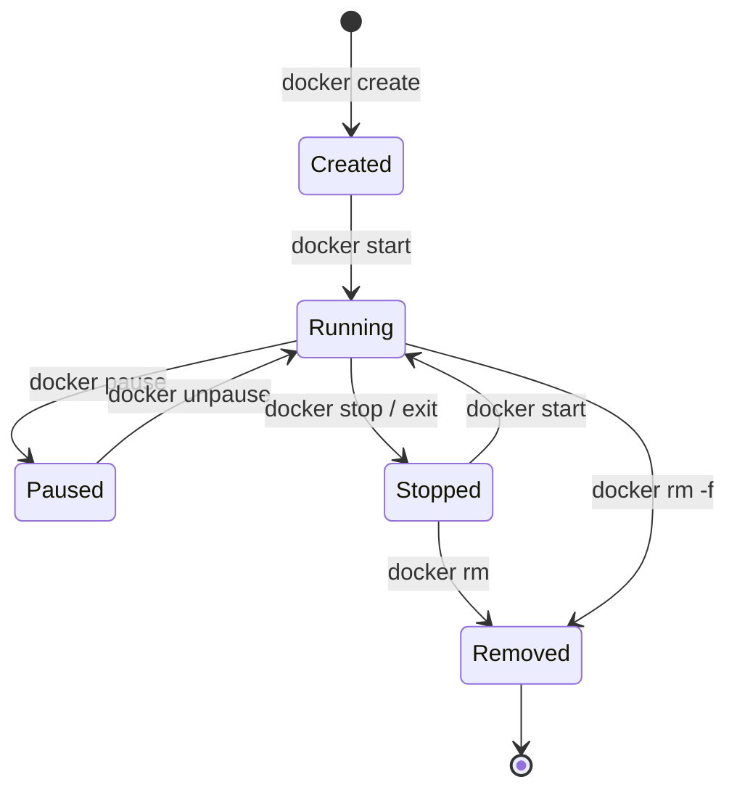
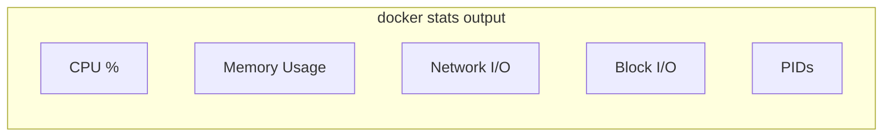

Containers are runnable instances of Docker images. This guide covers all essential commands for managing the container lifecycle.

## Container Lifecycle



## docker run

Create and start a new container.

```bash
# Basic usage
docker run nginx:alpine

# Common options
docker run -d \                    # Detached mode
  --name webserver \               # Container name
  -p 8080:80 \                     # Port mapping
  -v $(pwd)/html:/usr/share/nginx/html \  # Volume mount
  -e MY_VAR=value \                # Environment variable
  --restart unless-stopped \       # Restart policy
  nginx:alpine
```

### Run Options

<Tabs items={['Basic', 'Networking', 'Resources', 'Advanced']}>
<Tab value="Basic">
```bash
# Run in background (detached)
docker run -d nginx:alpine

# Run interactively with TTY
docker run -it ubuntu bash

# Remove container after exit
docker run --rm alpine echo "Hello"

# Set container name
docker run --name my-container nginx:alpine

# Set hostname
docker run --hostname webserver nginx:alpine

# Set working directory
docker run -w /app node:20 npm start

# Override command
docker run nginx:alpine cat /etc/nginx/nginx.conf

# Override entrypoint
docker run --entrypoint sh nginx:alpine -c "echo Hello"
```
</Tab>
<Tab value="Networking">
```bash
# Map port HOST:CONTAINER
docker run -p 8080:80 nginx:alpine

# Map to specific interface
docker run -p 127.0.0.1:8080:80 nginx:alpine

# Map all exposed ports randomly
docker run -P nginx:alpine

# Use host network
docker run --network host nginx:alpine

# Connect to custom network
docker run --network my-network nginx:alpine

# Add DNS server
docker run --dns 8.8.8.8 nginx:alpine

# Add host entry
docker run --add-host host.docker.internal:host-gateway nginx:alpine
```
</Tab>
<Tab value="Resources">
```bash
# Limit memory
docker run -m 512m nginx:alpine

# Limit CPU
docker run --cpus 0.5 nginx:alpine

# Limit CPU shares (relative)
docker run --cpu-shares 512 nginx:alpine

# Set memory + swap
docker run -m 512m --memory-swap 1g nginx:alpine

# Set OOM kill priority
docker run --oom-score-adj -500 nginx:alpine

# Limit PIDs
docker run --pids-limit 100 nginx:alpine
```
</Tab>
<Tab value="Advanced">
```bash
# Run as specific user
docker run --user 1000:1000 nginx:alpine

# Read-only filesystem
docker run --read-only nginx:alpine

# Add capability
docker run --cap-add NET_ADMIN nginx:alpine

# Drop capability
docker run --cap-drop ALL nginx:alpine

# Run privileged (avoid in production)
docker run --privileged nginx:alpine

# Set security options
docker run --security-opt no-new-privileges nginx:alpine

# Mount tmpfs
docker run --tmpfs /tmp nginx:alpine
```
</Tab>
</Tabs>

### Environment Variables

```bash
# Single variable
docker run -e NODE_ENV=production myapp

# From file
docker run --env-file .env myapp

# Multiple variables
docker run -e VAR1=value1 -e VAR2=value2 myapp

# Pass from shell (no value = use shell's value)
docker run -e HOME myapp
```

### Volume Mounts

```bash
# Bind mount (host path)
docker run -v /host/path:/container/path nginx

# Named volume
docker run -v myvolume:/data nginx

# Read-only mount
docker run -v /host/path:/container/path:ro nginx

# Anonymous volume
docker run -v /data nginx

# tmpfs mount
docker run --tmpfs /tmp:size=100m nginx
```

## docker ps

List containers.

```bash
# List running containers
docker ps

# List all containers
docker ps -a

# List container IDs only
docker ps -q

# Filter containers
docker ps -f "status=exited"
docker ps -f "name=web"
docker ps -f "ancestor=nginx"

# Show sizes
docker ps -s

# Format output
docker ps --format "table {{.Names}}\t{{.Status}}\t{{.Ports}}"
```

### Filter Options

| Filter | Description | Example |
|--------|-------------|---------|
| `id` | Container ID | `-f "id=abc123"` |
| `name` | Container name | `-f "name=web"` |
| `status` | Container status | `-f "status=running"` |
| `ancestor` | Image name | `-f "ancestor=nginx"` |
| `label` | Label | `-f "label=env=prod"` |
| `network` | Network name | `-f "network=mynet"` |
| `volume` | Volume name | `-f "volume=mydata"` |

## Container Lifecycle Commands

<Tabs items={['Start/Stop', 'Create', 'Remove']}>
<Tab value="Start/Stop">
```bash
# Stop container (SIGTERM, then SIGKILL after timeout)
docker stop container_name
docker stop -t 30 container_name  # 30 second timeout

# Start stopped container
docker start container_name

# Restart container
docker restart container_name

# Pause container (freeze processes)
docker pause container_name

# Unpause container
docker unpause container_name

# Send signal to container
docker kill container_name
docker kill -s SIGINT container_name

# Wait for container to exit
docker wait container_name
```
</Tab>
<Tab value="Create">
```bash
# Create without starting
docker create --name mycontainer nginx:alpine

# Start created container
docker start mycontainer

# Create with all options (same as run)
docker create \
  --name mycontainer \
  -p 8080:80 \
  -v mydata:/data \
  nginx:alpine
```
</Tab>
<Tab value="Remove">
```bash
# Remove stopped container
docker rm container_name

# Force remove running container
docker rm -f container_name

# Remove container and its volumes
docker rm -v container_name

# Remove all stopped containers
docker container prune

# Remove all containers (running and stopped)
docker rm -f $(docker ps -aq)
```
</Tab>
</Tabs>

## docker exec

Execute commands in running containers.

```bash
# Run command
docker exec container_name ls -la

# Interactive shell
docker exec -it container_name sh
docker exec -it container_name bash

# Run as different user
docker exec -u root container_name whoami

# Set environment variable
docker exec -e MY_VAR=value container_name printenv

# Set working directory
docker exec -w /app container_name pwd

# Detached execution
docker exec -d container_name touch /tmp/file
```

## docker logs

View container output.

```bash
# View logs
docker logs container_name

# Follow logs (stream)
docker logs -f container_name

# Show timestamps
docker logs -t container_name

# Tail last N lines
docker logs --tail 100 container_name

# Logs since timestamp
docker logs --since 2024-01-01T00:00:00 container_name

# Logs since duration
docker logs --since 10m container_name

# Logs until timestamp
docker logs --until 2024-01-01T12:00:00 container_name

# Combined options
docker logs -f --tail 50 --since 1h container_name
```

## docker inspect

View detailed container information.

```bash
# Full inspection
docker inspect container_name

# Format specific field
docker inspect --format '{{.State.Status}}' container_name

# Get IP address
docker inspect --format '{{.NetworkSettings.IPAddress}}' container_name

# Get mount points
docker inspect --format '{{json .Mounts}}' container_name | jq

# Get environment variables
docker inspect --format '{{json .Config.Env}}' container_name | jq

# Multiple containers
docker inspect container1 container2
```

### Common Inspect Paths

| Path | Description |
|------|-------------|
| `.State.Status` | Container status |
| `.State.Running` | Is running (bool) |
| `.State.StartedAt` | Start timestamp |
| `.NetworkSettings.IPAddress` | IP address |
| `.NetworkSettings.Ports` | Port mappings |
| `.Config.Env` | Environment variables |
| `.Mounts` | Volume mounts |
| `.HostConfig.Memory` | Memory limit |

## docker cp

Copy files between container and host.

```bash
# Copy from container to host
docker cp container_name:/path/to/file ./local/path

# Copy from host to container
docker cp ./local/file container_name:/path/in/container

# Copy directory
docker cp container_name:/var/log ./logs

# Copy to/from stdin/stdout
docker cp container_name:/file - > backup.tar
tar -c file | docker cp - container_name:/path
```

## docker stats

View real-time resource usage.

```bash
# Live stats for all containers
docker stats

# Stats for specific containers
docker stats container1 container2

# One-time snapshot (no stream)
docker stats --no-stream

# Format output
docker stats --format "table {{.Name}}\t{{.CPUPerc}}\t{{.MemUsage}}"
```



## docker top

View running processes in container.

```bash
# Default process list
docker top container_name

# Custom ps options
docker top container_name -aux
docker top container_name -eo pid,user,cmd
```

## docker diff

View filesystem changes.

```bash
# Show changed files
docker diff container_name

# Output:
# A = Added
# C = Changed
# D = Deleted
```

## docker commit

Create image from container changes.

```bash
# Commit container to new image
docker commit container_name new_image:tag

# With message and author
docker commit \
  -m "Added custom config" \
  -a "Author Name" \
  container_name new_image:tag

# Change command
docker commit --change='CMD ["nginx"]' container_name new_image:tag
```

<Callout type="warn" title="Best Practice">
Prefer Dockerfiles over `docker commit`. Commits don't document how the image was built.
</Callout>

## docker attach

Attach to running container's STDIN/STDOUT.

```bash
# Attach to container
docker attach container_name

# Detach without stopping (Ctrl+P, Ctrl+Q)
docker attach --detach-keys="ctrl-d" container_name
```

## docker rename

Rename a container.

```bash
docker rename old_name new_name
```

## docker update

Update container configuration.

```bash
# Update memory limit
docker update --memory 1g container_name

# Update CPU
docker update --cpus 2 container_name

# Update restart policy
docker update --restart unless-stopped container_name

# Update multiple containers
docker update --memory 512m container1 container2
```

## Batch Operations

```bash
# Stop all running containers
docker stop $(docker ps -q)

# Remove all stopped containers
docker rm $(docker ps -aq -f "status=exited")

# Remove all containers
docker rm -f $(docker ps -aq)

# Restart all containers
docker restart $(docker ps -q)

# Kill all running containers
docker kill $(docker ps -q)
```
