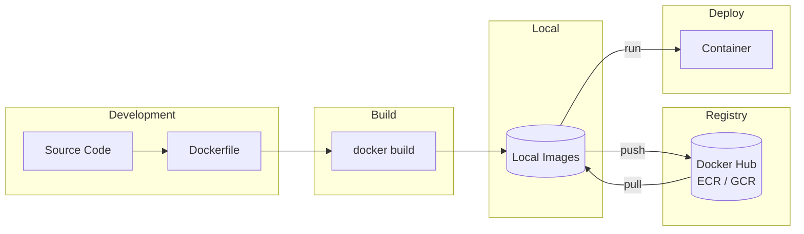
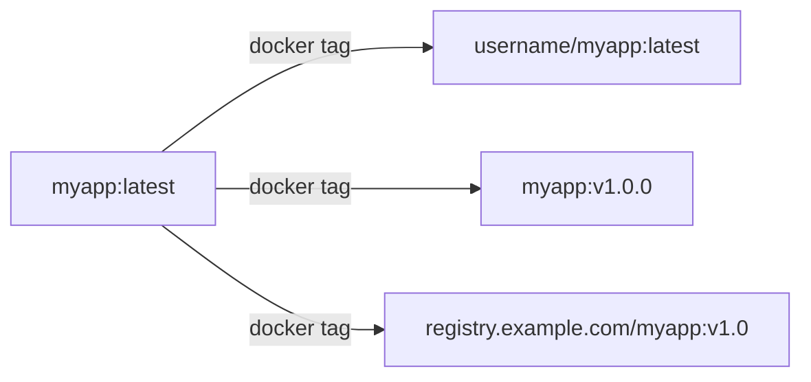
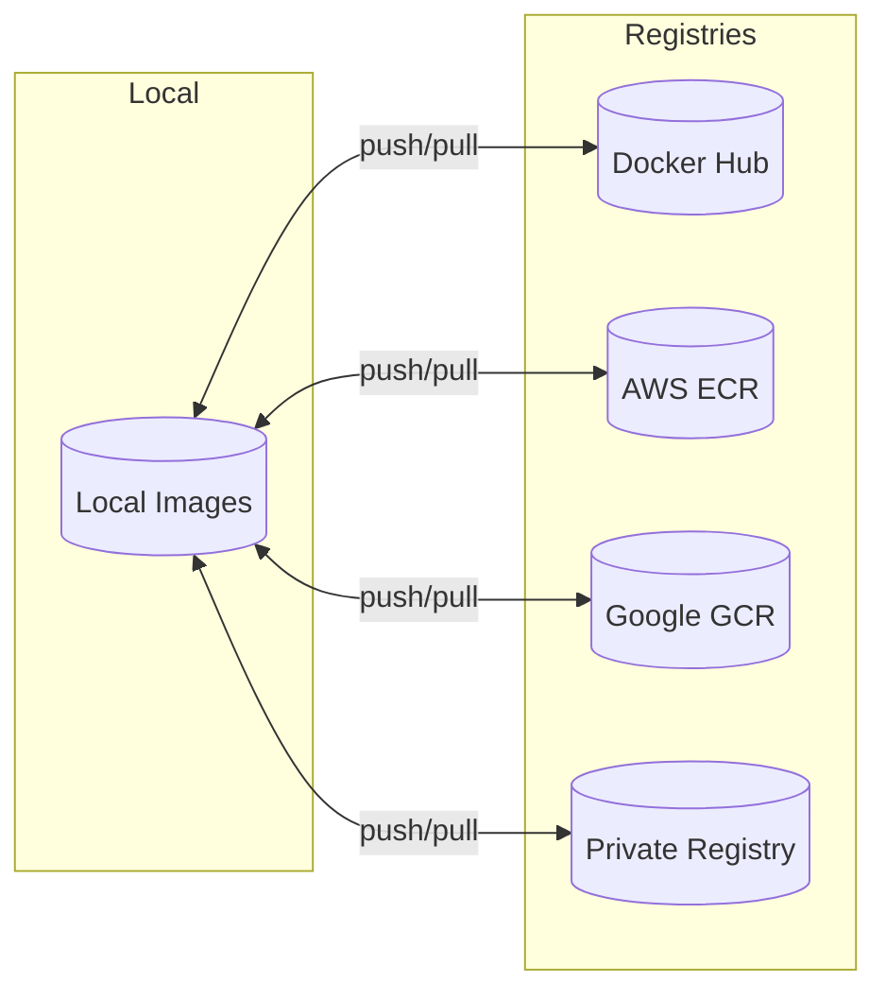

Docker images are the blueprints for containers. This guide covers building, managing, and distributing images.

## Image Workflow



## docker build

Build an image from a Dockerfile.

<Tabs items={['Basic', 'Build Args', 'Advanced']}>
<Tab value="Basic">
```bash
# Build from current directory
docker build -t myapp:latest .

# Build with specific Dockerfile
docker build -f Dockerfile.prod -t myapp:prod .

# Build from URL
docker build -t myapp https://github.com/user/repo.git

# Build from tar archive
docker build -t myapp - < archive.tar.gz
```
</Tab>
<Tab value="Build Args">
```bash
# Pass build argument
docker build --build-arg NODE_VERSION=20 -t myapp .

# Multiple build args
docker build \
  --build-arg NODE_VERSION=20 \
  --build-arg NPM_TOKEN=$NPM_TOKEN \
  -t myapp .

# Build args from file
docker build --build-arg-file args.txt -t myapp .
```
</Tab>
<Tab value="Advanced">
```bash
# Build specific target stage
docker build --target builder -t myapp:builder .

# No cache (rebuild everything)
docker build --no-cache -t myapp .

# Pull latest base images
docker build --pull -t myapp .

# Use BuildKit (recommended)
DOCKER_BUILDKIT=1 docker build -t myapp .

# Output build progress
docker build --progress=plain -t myapp .

# Export cache
docker build \
  --cache-from myapp:latest \
  --cache-to type=inline \
  -t myapp .

# Multi-platform build
docker buildx build \
  --platform linux/amd64,linux/arm64 \
  -t myapp:latest .
```
</Tab>
</Tabs>

### Build Options

| Option | Description |
|--------|-------------|
| `-t, --tag` | Name and tag (name:tag) |
| `-f, --file` | Dockerfile path |
| `--target` | Build specific stage |
| `--build-arg` | Set build-time variable |
| `--no-cache` | Don't use cache |
| `--pull` | Always pull base image |
| `--platform` | Target platform |
| `--progress` | Progress output type |
| `--secret` | Build-time secret |
| `--ssh` | SSH agent socket |

### Build Secrets

```bash
# Pass secret file
docker build --secret id=mysecret,src=./secret.txt -t myapp .

# In Dockerfile
RUN --mount=type=secret,id=mysecret cat /run/secrets/mysecret
```

## docker images

List images.

```bash
# List all images
docker images

# List with full IDs
docker images --no-trunc

# List image IDs only
docker images -q

# Filter images
docker images -f "dangling=true"
docker images -f "reference=nginx*"
docker images -f "before=nginx:latest"

# Format output
docker images --format "table {{.Repository}}\t{{.Tag}}\t{{.Size}}"

# Show digests
docker images --digests
```

### Filter Options

| Filter | Description | Example |
|--------|-------------|---------|
| `dangling` | Untagged images | `-f "dangling=true"` |
| `reference` | Image reference pattern | `-f "reference=nginx*"` |
| `before` | Images before this one | `-f "before=nginx:1.20"` |
| `since` | Images after this one | `-f "since=nginx:1.18"` |
| `label` | Image with label | `-f "label=env=prod"` |

## docker pull

Download image from registry.

```bash
# Pull latest
docker pull nginx

# Pull specific tag
docker pull nginx:1.25-alpine

# Pull by digest (immutable)
docker pull nginx@sha256:abc123...

# Pull from different registry
docker pull gcr.io/project/image:tag
docker pull registry.example.com/myapp:v1.0

# Pull all tags
docker pull -a nginx

# Pull specific platform
docker pull --platform linux/arm64 nginx:alpine
```

## docker push

Upload image to registry.

```bash
# Login to registry first
docker login
docker login registry.example.com

# Push image
docker push myregistry/myapp:latest

# Push all tags
docker push -a myregistry/myapp
```

## docker tag

Create a new tag for an image.

```bash
# Tag for Docker Hub
docker tag myapp:latest username/myapp:latest

# Tag for private registry
docker tag myapp:latest registry.example.com/myapp:v1.0

# Tag with multiple versions
docker tag myapp:latest myapp:v1.0.0
docker tag myapp:latest myapp:v1.0
docker tag myapp:latest myapp:v1
```



## docker rmi

Remove images.

```bash
# Remove single image
docker rmi nginx:alpine

# Remove multiple images
docker rmi image1:tag image2:tag

# Force remove (even if container exists)
docker rmi -f nginx:alpine

# Remove by image ID
docker rmi abc123

# Remove dangling images
docker image prune

# Remove all unused images
docker image prune -a

# Remove with filter
docker image prune -f "until=24h"
```

## docker history

View image layer history.

```bash
# Show history
docker history nginx:alpine

# Full output (no truncation)
docker history --no-trunc nginx:alpine

# Format output
docker history --format "{{.CreatedBy}}" nginx:alpine

# Human-readable sizes
docker history -H nginx:alpine
```

## docker inspect

View detailed image information.

```bash
# Full inspection
docker inspect nginx:alpine

# Get specific field
docker inspect --format '{{.Config.ExposedPorts}}' nginx:alpine

# Get labels
docker inspect --format '{{json .Config.Labels}}' nginx:alpine | jq

# Get environment variables
docker inspect --format '{{json .Config.Env}}' nginx:alpine | jq

# Get architecture
docker inspect --format '{{.Architecture}}' nginx:alpine
```

## docker save / docker load

Export and import images as tar archives.

```bash
# Save image to tar file
docker save -o nginx.tar nginx:alpine

# Save multiple images
docker save -o images.tar nginx:alpine redis:alpine

# Save to stdout (pipe)
docker save nginx:alpine | gzip > nginx.tar.gz

# Load image from tar
docker load -i nginx.tar

# Load from stdin
docker load < nginx.tar.gz
```

Use cases:
- Transfer images between systems without registry
- Backup images
- Air-gapped deployments

## docker import / docker export

Export container filesystem and import as image.

```bash
# Export container filesystem
docker export container_name > container.tar

# Import as new image
docker import container.tar newimage:tag

# Import with changes
docker import --change='CMD ["/bin/bash"]' container.tar newimage:tag
```

<Callout type="info" title="save vs export">
- `docker save`: Saves image layers and metadata
- `docker export`: Saves container filesystem (flattened)
</Callout>

## Image Management Best Practices

<Accordions>
<Accordion title="Use specific tags, not latest">
```bash
# ✅ Good
docker pull nginx:1.25.3-alpine

# ❌ Bad
docker pull nginx:latest
```
</Accordion>
<Accordion title="Use digests for immutability">
```bash
# ✅ Immutable reference
docker pull nginx@sha256:abc123...

# ❌ Tag can change
docker pull nginx:latest
```
</Accordion>
<Accordion title="Clean up regularly">
```bash
# Remove dangling images
docker image prune

# Remove all unused images
docker image prune -a

# Remove images older than 24h
docker image prune -a -f "until=24h"
```
</Accordion>
<Accordion title="Use multi-stage builds">
```dockerfile
# Build stage
FROM node:20 AS builder
RUN npm run build

# Production stage (smaller)
FROM node:20-alpine
COPY --from=builder /app/dist ./dist
```
</Accordion>
</Accordions>

## Registry Operations



### Docker Hub

```bash
# Login
docker login

# Push
docker push username/image:tag

# Pull
docker pull username/image:tag
```

### Private Registry

```bash
# Login to private registry
docker login registry.example.com

# Tag for registry
docker tag myapp registry.example.com/myapp:v1.0

# Push
docker push registry.example.com/myapp:v1.0

# Pull
docker pull registry.example.com/myapp:v1.0
```

### AWS ECR

```bash
# Get login token
aws ecr get-login-password --region us-east-1 | \
  docker login --username AWS --password-stdin \
  123456789.dkr.ecr.us-east-1.amazonaws.com

# Tag and push
docker tag myapp:latest 123456789.dkr.ecr.us-east-1.amazonaws.com/myapp:latest
docker push 123456789.dkr.ecr.us-east-1.amazonaws.com/myapp:latest
```

## docker search

Search Docker Hub.

```bash
# Search images
docker search nginx

# Limit results
docker search --limit 5 nginx

# Filter by stars
docker search --filter stars=100 nginx

# Official images only
docker search --filter is-official=true nginx
```

## Batch Operations

```bash
# Remove all images
docker rmi $(docker images -q)

# Remove all dangling images
docker rmi $(docker images -f "dangling=true" -q)

# Remove images by pattern
docker rmi $(docker images --filter "reference=myapp*" -q)

# Pull multiple images
for img in nginx:alpine redis:alpine postgres:16; do
  docker pull $img
done
```
