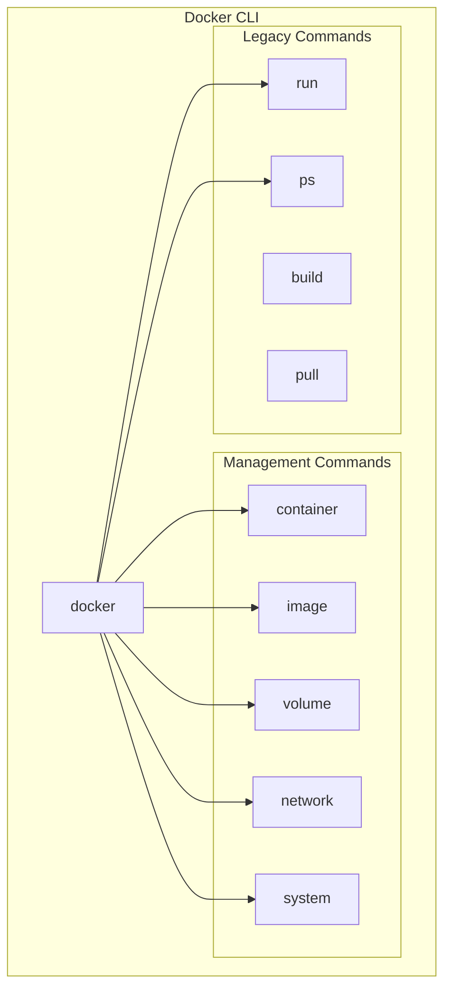
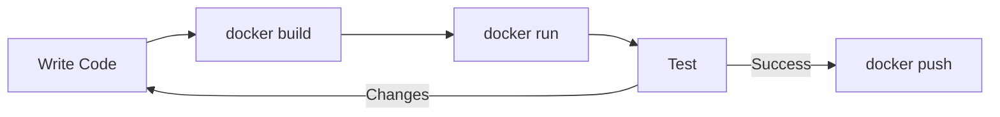

The Docker CLI is your primary interface for interacting with Docker. This guide covers essential commands for container and image management, debugging, and system administration.

<Callout type="info" title="Command Structure">
Docker commands follow the pattern: `docker [object] [command] [options]`
Example: `docker container ls --all`
</Callout>

## Command Structure



## Quick Navigation

<Cards>
  <Card title="Container Commands" href="/docs/docker/cli/containers" description="Run, start, stop, and manage containers" />
  <Card title="Image Commands" href="/docs/docker/cli/images" description="Build, pull, push, and manage images" />
  <Card title="System Commands" href="/docs/docker/cli/system" description="Cleanup, monitoring, and administration" />
</Cards>

## Essential Commands Overview

<Tabs items={['Containers', 'Images', 'Networks', 'Volumes']}>
<Tab value="Containers">
```bash
# Run a container
docker run -d -p 8080:80 --name web nginx:alpine

# List containers
docker ps          # Running only
docker ps -a       # All containers

# Container lifecycle
docker start web
docker stop web
docker restart web
docker rm web

# Interact with container
docker exec -it web sh
docker logs -f web
docker inspect web
```
</Tab>
<Tab value="Images">
```bash
# Pull image
docker pull nginx:alpine

# Build image
docker build -t myapp:latest .

# List images
docker images

# Tag image
docker tag myapp:latest myregistry/myapp:v1.0

# Push image
docker push myregistry/myapp:v1.0

# Remove image
docker rmi nginx:alpine
```
</Tab>
<Tab value="Networks">
```bash
# List networks
docker network ls

# Create network
docker network create mynetwork

# Connect container
docker network connect mynetwork container_name

# Disconnect container
docker network disconnect mynetwork container_name

# Inspect network
docker network inspect mynetwork

# Remove network
docker network rm mynetwork
```
</Tab>
<Tab value="Volumes">
```bash
# List volumes
docker volume ls

# Create volume
docker volume create mydata

# Inspect volume
docker volume inspect mydata

# Remove volume
docker volume rm mydata

# Prune unused volumes
docker volume prune
```
</Tab>
</Tabs>

## Common Workflows

### Running a Web Server

```bash
# Run nginx with port mapping
docker run -d \
  --name webserver \
  -p 8080:80 \
  -v $(pwd)/html:/usr/share/nginx/html:ro \
  nginx:alpine

# Check it's running
docker ps

# View logs
docker logs webserver

# Stop and remove
docker stop webserver && docker rm webserver
```

### Building and Running an Application

```bash
# Build image
docker build -t myapp:latest .

# Run container
docker run -d \
  --name myapp \
  -p 3000:3000 \
  -e NODE_ENV=production \
  myapp:latest

# Check logs
docker logs -f myapp

# Execute command inside
docker exec -it myapp sh
```

### Development Workflow



```bash
# Build with no cache
docker build --no-cache -t myapp:dev .

# Run with volume mount for hot reload
docker run -d \
  --name myapp-dev \
  -p 3000:3000 \
  -v $(pwd):/app \
  -v /app/node_modules \
  myapp:dev npm run dev

# Follow logs
docker logs -f myapp-dev

# Rebuild and restart
docker stop myapp-dev && docker rm myapp-dev
docker build -t myapp:dev . && docker run -d --name myapp-dev ...
```

## Command Quick Reference

### Container Commands

| Command | Description |
|---------|-------------|
| `docker run` | Create and start container |
| `docker start` | Start stopped container |
| `docker stop` | Stop running container |
| `docker restart` | Restart container |
| `docker rm` | Remove container |
| `docker exec` | Execute command in container |
| `docker logs` | View container logs |
| `docker inspect` | Detailed container info |
| `docker cp` | Copy files to/from container |
| `docker stats` | Container resource usage |

### Image Commands

| Command | Description |
|---------|-------------|
| `docker build` | Build image from Dockerfile |
| `docker pull` | Download image from registry |
| `docker push` | Upload image to registry |
| `docker images` | List local images |
| `docker rmi` | Remove image |
| `docker tag` | Tag image |
| `docker history` | Show image layers |
| `docker save` | Export image to tar |
| `docker load` | Import image from tar |

### System Commands

| Command | Description |
|---------|-------------|
| `docker system df` | Disk usage |
| `docker system prune` | Remove unused data |
| `docker info` | System-wide information |
| `docker version` | Docker version info |

## Global Options

```bash
# Specify Docker host
docker -H tcp://host:2375 ps

# Debug mode
docker --debug ps

# Use different config
docker --config ~/.docker/alt ps

# Format output as JSON
docker ps --format json
```

## Output Formatting

Use `--format` with Go templates for custom output.

```bash
# List container names and status
docker ps --format "table {{.Names}}\t{{.Status}}"

# JSON output
docker ps --format json

# Custom template
docker ps --format "{{.ID}}: {{.Image}} ({{.Status}})"

# Inspect specific field
docker inspect --format '{{.NetworkSettings.IPAddress}}' container_name
```

### Common Format Fields

| Field | Description |
|-------|-------------|
| `.ID` | Container ID |
| `.Names` | Container name |
| `.Image` | Image name |
| `.Status` | Container status |
| `.Ports` | Port mappings |
| `.Size` | Container size |
| `.CreatedAt` | Creation time |

## Shell Completion

```bash
# Bash (add to ~/.bashrc)
source <(docker completion bash)

# Zsh (add to ~/.zshrc)
source <(docker completion zsh)

# Fish
docker completion fish | source
```

## Aliases for Productivity

```bash
# Add to ~/.bashrc or ~/.zshrc
alias d='docker'
alias dc='docker compose'
alias dps='docker ps'
alias dpsa='docker ps -a'
alias dimg='docker images'
alias drm='docker rm'
alias drmi='docker rmi'
alias dexec='docker exec -it'
alias dlogs='docker logs -f'
alias dprune='docker system prune -af'
```

## Next Steps

<Cards>
  <Card title="Container Commands" href="/docs/docker/cli/containers" description="Deep dive into container management" />
  <Card title="Image Commands" href="/docs/docker/cli/images" description="Building and managing images" />
  <Card title="System Commands" href="/docs/docker/cli/system" description="Cleanup and maintenance" />
</Cards>
