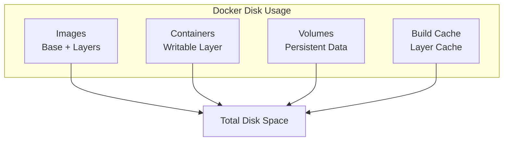
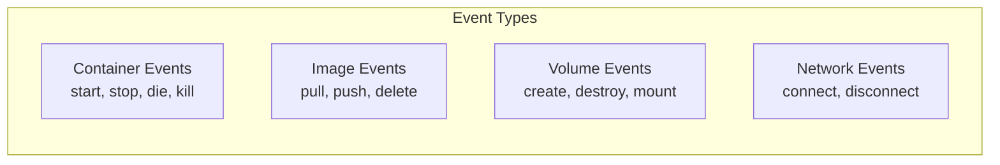

System commands help you manage Docker resources, monitor disk usage, and maintain a clean Docker environment.

## docker system

### Disk Usage

```bash
# Show disk usage summary
docker system df

# Detailed disk usage
docker system df -v

# Format output
docker system df --format "table {{.Type}}\t{{.Size}}\t{{.Reclaimable}}"
```



### System Prune

Remove unused data.

```bash
# Remove unused data (interactive)
docker system prune

# Remove without confirmation
docker system prune -f

# Remove unused data including volumes
docker system prune --volumes

# Remove all unused images (not just dangling)
docker system prune -a

# Remove data older than 24 hours
docker system prune -a --filter "until=24h"

# Remove everything (dangerous!)
docker system prune -a --volumes -f
```

| Pruned | `prune` | `prune -a` | `prune --volumes` |
|--------|---------|------------|-------------------|
| Stopped containers | ✅ | ✅ | ✅ |
| Unused networks | ✅ | ✅ | ✅ |
| Dangling images | ✅ | ✅ | ✅ |
| Unused images | ❌ | ✅ | ✅ |
| Unused volumes | ❌ | ❌ | ✅ |
| Build cache | ✅ | ✅ | ✅ |

<Callout type="warn" title="Data Loss Warning">
`docker system prune --volumes` removes unused volumes. Make sure you have backups before running.
</Callout>

### System Info

```bash
# System-wide information
docker system info

# Specific information with format
docker system info --format '{{.ServerVersion}}'
docker system info --format '{{json .RegistryConfig}}' | jq
```

## Individual Prune Commands

```bash
# Remove stopped containers
docker container prune

# Remove dangling images
docker image prune

# Remove all unused images
docker image prune -a

# Remove unused volumes
docker volume prune

# Remove unused networks
docker network prune

# Remove build cache
docker builder prune

# Remove all build cache
docker builder prune -a
```

### With Filters

```bash
# Prune containers older than 24h
docker container prune --filter "until=24h"

# Prune images without label
docker image prune --filter "label!=keep"

# Prune volumes not labeled 'important'
docker volume prune --filter "label!=important"
```

## docker info

Display system-wide information.

```bash
# Full info
docker info

# Specific fields
docker info --format '{{.ServerVersion}}'
docker info --format '{{.OperatingSystem}}'
docker info --format '{{.Architecture}}'
docker info --format '{{.NCPU}}'
docker info --format '{{.MemTotal}}'
docker info --format '{{.DockerRootDir}}'
```

### Key Information

| Field | Description |
|-------|-------------|
| `ServerVersion` | Docker daemon version |
| `OperatingSystem` | Host OS |
| `Architecture` | CPU architecture |
| `NCPU` | Number of CPUs |
| `MemTotal` | Total memory |
| `DockerRootDir` | Docker data directory |
| `StorageDriver` | Storage driver (overlay2) |
| `Registry` | Default registry |

## docker version

Display version information.

```bash
# Show version
docker version

# Client version only
docker version --format '{{.Client.Version}}'

# Server version
docker version --format '{{.Server.Version}}'

# JSON output
docker version --format json
```

## docker events

Monitor Docker events in real-time.

```bash
# Stream all events
docker events

# Filter by container
docker events --filter "container=web"

# Filter by event type
docker events --filter "event=start"
docker events --filter "event=stop"

# Filter by type
docker events --filter "type=container"
docker events --filter "type=image"
docker events --filter "type=volume"

# Events since timestamp
docker events --since "2024-01-01T00:00:00"

# Events until now minus 1 hour
docker events --until "1h"

# Format output
docker events --format '{{.Type}}: {{.Action}} {{.Actor.Attributes.name}}'
```

### Event Types



## docker context

Manage Docker contexts (multiple Docker hosts).

```bash
# List contexts
docker context ls

# Show current context
docker context show

# Create context for remote host
docker context create remote --docker "host=ssh://user@host"

# Use different context
docker context use remote

# Run command in specific context
docker --context remote ps

# Remove context
docker context rm remote
```

## docker login / logout

Authenticate with registries.

```bash
# Login to Docker Hub
docker login

# Login to private registry
docker login registry.example.com

# Login with username
docker login -u username

# Login with token from stdin
echo $TOKEN | docker login -u username --password-stdin

# Logout
docker logout
docker logout registry.example.com
```

## Monitoring and Debugging

### Resource Monitoring

```bash
# Live stats for all containers
docker stats

# Stats for specific containers
docker stats web api db

# One-time stats (no stream)
docker stats --no-stream

# Format output
docker stats --format "table {{.Name}}\t{{.CPUPerc}}\t{{.MemUsage}}\t{{.NetIO}}"
```

### Debug Commands

```bash
# Check Docker daemon logs (systemd)
journalctl -u docker.service

# Docker daemon debug mode
dockerd --debug

# Inspect container
docker inspect container_name

# Get container IP
docker inspect -f '{{range.NetworkSettings.Networks}}{{.IPAddress}}{{end}}' container_name

# Check container processes
docker top container_name

# View filesystem changes
docker diff container_name
```

## Maintenance Scripts

### Daily Cleanup Script

```bash
#!/bin/bash
# cleanup.sh - Daily Docker cleanup

echo "Docker Cleanup - $(date)"

# Remove stopped containers older than 1 day
docker container prune -f --filter "until=24h"

# Remove dangling images
docker image prune -f

# Remove unused networks
docker network prune -f

# Show disk usage
docker system df

echo "Cleanup complete"
```

### Full Reset Script

```bash
#!/bin/bash
# reset.sh - Complete Docker reset (DANGEROUS!)

echo "WARNING: This will remove ALL Docker data!"
read -p "Are you sure? (yes/no): " confirm

if [ "$confirm" = "yes" ]; then
    # Stop all containers
    docker stop $(docker ps -q) 2>/dev/null
    
    # Remove everything
    docker system prune -a --volumes -f
    
    echo "Docker reset complete"
else
    echo "Aborted"
fi
```

### Health Check Script

```bash
#!/bin/bash
# healthcheck.sh - Check Docker health

echo "=== Docker Health Check ==="

# Docker version
echo -e "\n--- Version ---"
docker version --format 'Client: {{.Client.Version}}\nServer: {{.Server.Version}}'

# Running containers
echo -e "\n--- Running Containers ---"
docker ps --format "table {{.Names}}\t{{.Status}}\t{{.Ports}}"

# Disk usage
echo -e "\n--- Disk Usage ---"
docker system df

# Unhealthy containers
echo -e "\n--- Unhealthy Containers ---"
docker ps --filter "health=unhealthy" --format "{{.Names}}: {{.Status}}"
```

## Environment Variables

| Variable | Description |
|----------|-------------|
| `DOCKER_HOST` | Docker daemon socket |
| `DOCKER_CONFIG` | Config directory |
| `DOCKER_CERT_PATH` | TLS cert directory |
| `DOCKER_TLS_VERIFY` | Enable TLS verification |
| `DOCKER_BUILDKIT` | Enable BuildKit |
| `COMPOSE_PROJECT_NAME` | Compose project name |

```bash
# Use remote Docker host
export DOCKER_HOST=tcp://192.168.1.100:2375

# Enable BuildKit
export DOCKER_BUILDKIT=1

# Custom config location
export DOCKER_CONFIG=~/.docker-alt
```

## Troubleshooting

<Accordions>
<Accordion title="Docker daemon not running">
```bash
# Check daemon status
sudo systemctl status docker

# Start daemon
sudo systemctl start docker

# Enable on boot
sudo systemctl enable docker
```
</Accordion>
<Accordion title="Permission denied">
```bash
# Add user to docker group
sudo usermod -aG docker $USER

# Apply changes (logout and login, or)
newgrp docker
```
</Accordion>
<Accordion title="No space left on device">
```bash
# Check disk usage
docker system df

# Aggressive cleanup
docker system prune -a --volumes -f

# Check Docker root dir size
du -sh /var/lib/docker
```
</Accordion>
<Accordion title="Cannot connect to registry">
```bash
# Check DNS
nslookup registry.example.com

# Check connectivity
curl -v https://registry.example.com/v2/

# Login with debug
docker --debug login registry.example.com
```
</Accordion>
</Accordions>
