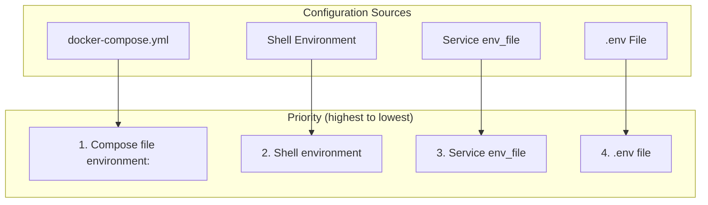
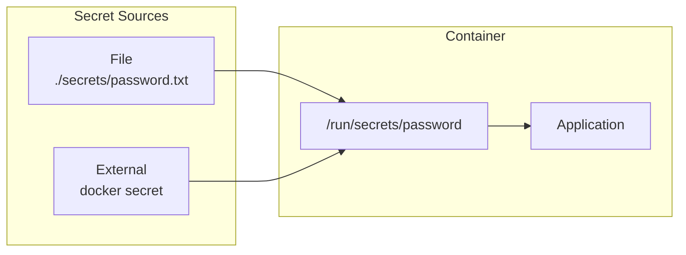

Docker Compose provides multiple ways to configure your application through environment variables, env files, and secrets. Understanding these options is crucial for secure and flexible deployments.

## Environment Variables



## Setting Environment Variables

<Tabs items={['In Compose File', 'From File', 'From Shell']}>
<Tab value="In Compose File">
```yaml
services:
  api:
    image: myapi:latest
    environment:
      # Key-value pairs
      - NODE_ENV=production
      - PORT=3000
      - DATABASE_URL=postgres://db:5432/app
      
      # Or as a map
      # environment:
      #   NODE_ENV: production
      #   PORT: 3000
```
</Tab>
<Tab value="From File">
```yaml
services:
  api:
    image: myapi:latest
    env_file:
      # Single file
      - .env
      
      # Multiple files (loaded in order)
      - .env
      - .env.local
      - .env.${ENVIRONMENT:-development}
```

```bash
# .env
NODE_ENV=production
DATABASE_URL=postgres://user:pass@db:5432/app
API_KEY=secret123
```
</Tab>
<Tab value="From Shell">
```bash
# Pass from shell
export DATABASE_URL=postgres://localhost:5432/app
docker compose up
```

```yaml
# Reference in compose file
services:
  api:
    environment:
      # Pass through from shell
      - DATABASE_URL
      
      # With default value
      - PORT=${PORT:-3000}
```
</Tab>
</Tabs>

## Variable Substitution

Use variables in your Compose file with shell-style syntax.

```yaml
services:
  web:
    image: myapp:${TAG:-latest}
    ports:
      - "${HOST_PORT:-8080}:${CONTAINER_PORT:-80}"
    environment:
      - DATABASE_URL=${DATABASE_URL}
      - LOG_LEVEL=${LOG_LEVEL:-info}
```

### Substitution Syntax

| Syntax | Description |
|--------|-------------|
| `${VAR}` | Value of VAR, error if unset |
| `${VAR:-default}` | Value of VAR, or `default` if unset/empty |
| `${VAR-default}` | Value of VAR, or `default` if unset |
| `${VAR:?error}` | Value of VAR, error with message if unset/empty |
| `${VAR?error}` | Value of VAR, error with message if unset |

```yaml
services:
  db:
    image: postgres:${POSTGRES_VERSION:-16}-alpine
    environment:
      # Required variable
      - POSTGRES_PASSWORD=${DB_PASSWORD:?Database password required}
      
      # Optional with default
      - POSTGRES_USER=${DB_USER:-postgres}
      - POSTGRES_DB=${DB_NAME:-app}
```

## The .env File

The `.env` file in the same directory as `docker-compose.yml` is automatically loaded.

```bash
# .env
COMPOSE_PROJECT_NAME=myproject
TAG=v1.2.3
NODE_ENV=production
DATABASE_URL=postgres://user:password@db:5432/myapp

# These are used for variable substitution in compose file
HOST_PORT=8080
POSTGRES_VERSION=16
```

<Callout type="warn" title="Security">
Never commit `.env` files with secrets to version control. Add `.env` to `.gitignore`.
</Callout>

### Multiple Environment Files

```yaml
services:
  api:
    env_file:
      - .env                    # Base configuration
      - .env.${ENV:-dev}        # Environment-specific
      - .env.local              # Local overrides (gitignored)
```

```bash
# .env.dev
DATABASE_URL=postgres://localhost:5432/app_dev
DEBUG=true

# .env.prod
DATABASE_URL=postgres://prod-db:5432/app
DEBUG=false
```

## Secrets Management

For sensitive data, use Docker secrets instead of environment variables.

<Tabs items={['File Secrets', 'External Secrets', 'In Services']}>
<Tab value="File Secrets">
```yaml
services:
  db:
    image: postgres:16-alpine
    environment:
      - POSTGRES_PASSWORD_FILE=/run/secrets/db_password
    secrets:
      - db_password

secrets:
  db_password:
    file: ./secrets/db_password.txt
```

```bash
# ./secrets/db_password.txt
mysupersecretpassword
```
</Tab>
<Tab value="External Secrets">
```yaml
services:
  api:
    secrets:
      - api_key
      - db_password

secrets:
  api_key:
    external: true
  db_password:
    external: true
    name: production_db_password
```

```bash
# Create external secrets
echo "secret123" | docker secret create api_key -
echo "dbpass" | docker secret create production_db_password -
```
</Tab>
<Tab value="In Services">
```yaml
services:
  api:
    image: myapi:latest
    secrets:
      - source: api_key
        target: /run/secrets/api_key
        uid: '1000'
        gid: '1000'
        mode: 0400
```

```javascript
// Reading secret in application
const fs = require('fs');
const apiKey = fs.readFileSync('/run/secrets/api_key', 'utf8').trim();
```
</Tab>
</Tabs>



## Configuration Files

Use configs for non-sensitive configuration files.

```yaml
services:
  nginx:
    image: nginx:alpine
    configs:
      - source: nginx_config
        target: /etc/nginx/nginx.conf

configs:
  nginx_config:
    file: ./nginx.conf
```

## Environment by Profile

Use profiles to manage environment-specific services.

```yaml
services:
  api:
    image: myapi:latest
    environment:
      - NODE_ENV=production

  api-dev:
    image: myapi:latest
    profiles:
      - development
    environment:
      - NODE_ENV=development
      - DEBUG=true
    volumes:
      - .:/app

  db:
    image: postgres:16-alpine
    
  adminer:
    image: adminer
    profiles:
      - development
    ports:
      - "8080:8080"
```

```bash
# Production (default)
docker compose up -d

# Development with debug tools
docker compose --profile development up -d
```

## Environment Patterns

### Development vs Production

<Tabs items={['Base', 'Development', 'Production']}>
<Tab value="Base">
```yaml
# docker-compose.yml
services:
  api:
    build: .
    environment:
      - NODE_ENV
      - DATABASE_URL
      - REDIS_URL
    depends_on:
      - db
      - redis

  db:
    image: postgres:16-alpine
    environment:
      - POSTGRES_PASSWORD=${DB_PASSWORD}

  redis:
    image: redis:7-alpine
```
</Tab>
<Tab value="Development">
```yaml
# docker-compose.override.yml (auto-loaded)
services:
  api:
    build:
      target: development
    volumes:
      - .:/app
      - /app/node_modules
    environment:
      - NODE_ENV=development
      - DEBUG=true
    ports:
      - "3000:3000"
      - "9229:9229"  # Debug port

  db:
    ports:
      - "5432:5432"
```
</Tab>
<Tab value="Production">
```yaml
# docker-compose.prod.yml
services:
  api:
    build:
      target: production
    environment:
      - NODE_ENV=production
    env_file:
      - .env.production
    deploy:
      replicas: 3
      resources:
        limits:
          cpus: '1'
          memory: 1G

  db:
    environment:
      - POSTGRES_PASSWORD_FILE=/run/secrets/db_password
    secrets:
      - db_password

secrets:
  db_password:
    external: true
```
</Tab>
</Tabs>

### 12-Factor App Pattern

```yaml
services:
  api:
    image: myapi:${VERSION:-latest}
    environment:
      # All config via environment
      - PORT=${PORT:-3000}
      - DATABASE_URL=${DATABASE_URL}
      - REDIS_URL=${REDIS_URL}
      - LOG_LEVEL=${LOG_LEVEL:-info}
      - API_KEY=${API_KEY}
    
    # Or use env_file for cleaner compose file
    env_file:
      - .env.${ENVIRONMENT:-development}
```

## Best Practices

<Accordions>
<Accordion title="Use env_file for many variables">
```yaml
# ✅ Good: Clean compose file
services:
  api:
    env_file:
      - .env

# ❌ Bad: Cluttered compose file
services:
  api:
    environment:
      - VAR1=value1
      - VAR2=value2
      - VAR3=value3
      # ... many more
```
</Accordion>
<Accordion title="Use defaults for optional variables">
```yaml
services:
  api:
    environment:
      - PORT=${PORT:-3000}
      - LOG_LEVEL=${LOG_LEVEL:-info}
```
</Accordion>
<Accordion title="Use secrets for sensitive data">
```yaml
# ✅ Good: Use secrets
secrets:
  db_password:
    file: ./secrets/db_password.txt

# ❌ Bad: Password in environment
environment:
  - DB_PASSWORD=mysecretpassword
```
</Accordion>
<Accordion title="Validate required variables">
```yaml
services:
  api:
    environment:
      # Error if not set
      - DATABASE_URL=${DATABASE_URL:?DATABASE_URL is required}
```
</Accordion>
</Accordions>

## Debugging Environment

```bash
# View effective configuration
docker compose config

# View environment for a service
docker compose exec api env

# Check variable substitution
docker compose config | grep -A5 "environment"

# Run with debug output
docker compose --verbose up
```

## Common Issues

| Issue | Cause | Solution |
|-------|-------|----------|
| Variable not substituted | Not in shell or .env | Add to .env or export |
| Empty variable | Unset in shell | Use `:-default` syntax |
| Secret not found | Wrong path | Check mount at /run/secrets |
| Config not loading | Wrong file name | Must be exact `.env` |
