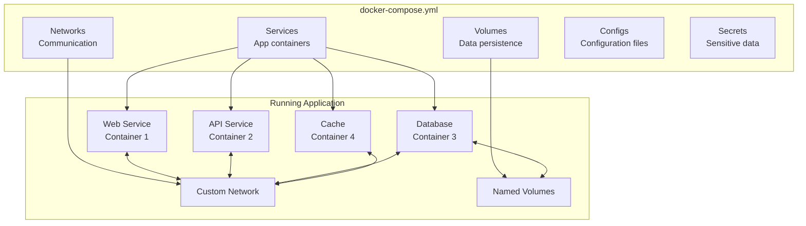
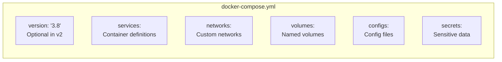
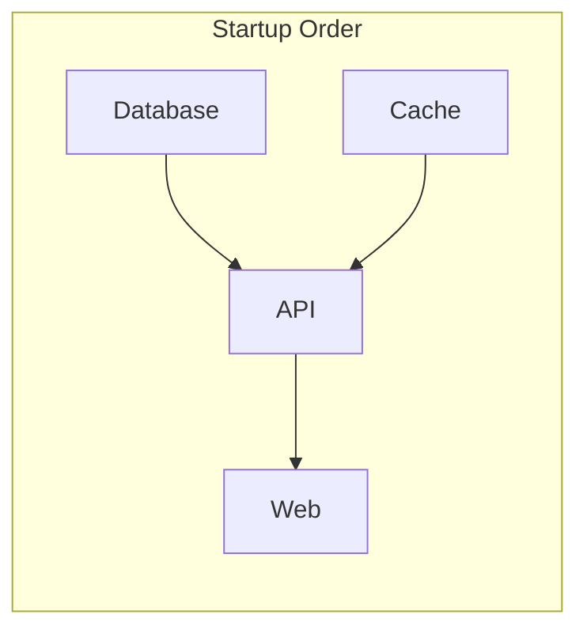

**Docker Compose** is a tool for defining and running multi-container Docker applications. Using a YAML file, you configure your application's services, networks, and volumes, then create and start all services with a single command.

<Callout type="info" title="Compose V2">
Docker Compose V2 is now integrated into Docker CLI as `docker compose` (without hyphen). The standalone `docker-compose` is deprecated.
</Callout>

## Compose Architecture



## Quick Navigation

<Cards>
  <Card title="Services" href="/docs/docker/compose/services" description="Define application containers" />
  <Card title="Networking" href="/docs/docker/compose/networking" description="Container communication" />
  <Card title="Volumes" href="/docs/docker/compose/volumes" description="Data persistence" />
  <Card title="Environment" href="/docs/docker/compose/environment" description="Configuration management" />
</Cards>

## Basic Compose File

<Tabs items={['Simple', 'Full Stack', 'Development']}>
<Tab value="Simple">
```yaml
# docker-compose.yml
services:
  web:
    image: nginx:alpine
    ports:
      - "8080:80"
    volumes:
      - ./html:/usr/share/nginx/html:ro
```

```bash
# Start services
docker compose up -d

# View logs
docker compose logs -f

# Stop services
docker compose down
```
</Tab>
<Tab value="Full Stack">
```yaml
# docker-compose.yml
services:
  frontend:
    build: ./frontend
    ports:
      - "3000:3000"
    depends_on:
      - api
    environment:
      - API_URL=http://api:8080

  api:
    build: ./api
    ports:
      - "8080:8080"
    depends_on:
      db:
        condition: service_healthy
    environment:
      - DATABASE_URL=postgres://user:pass@db:5432/app

  db:
    image: postgres:16-alpine
    volumes:
      - postgres_data:/var/lib/postgresql/data
    environment:
      - POSTGRES_USER=user
      - POSTGRES_PASSWORD=pass
      - POSTGRES_DB=app
    healthcheck:
      test: ["CMD-SHELL", "pg_isready -U user -d app"]
      interval: 10s
      timeout: 5s
      retries: 5

  redis:
    image: redis:7-alpine
    volumes:
      - redis_data:/data

volumes:
  postgres_data:
  redis_data:
```
</Tab>
<Tab value="Development">
```yaml
# docker-compose.dev.yml
services:
  app:
    build:
      context: .
      target: development
    ports:
      - "3000:3000"
    volumes:
      - .:/app
      - /app/node_modules
    environment:
      - NODE_ENV=development
    command: npm run dev

  db:
    image: postgres:16-alpine
    ports:
      - "5432:5432"
    volumes:
      - postgres_dev:/var/lib/postgresql/data
    environment:
      - POSTGRES_USER=dev
      - POSTGRES_PASSWORD=dev
      - POSTGRES_DB=app_dev

volumes:
  postgres_dev:
```

```bash
# Run with development config
docker compose -f docker-compose.dev.yml up
```
</Tab>
</Tabs>

## Compose File Structure



| Section | Purpose | Example |
|---------|---------|---------|
| `services` | Define containers | `web`, `api`, `db` |
| `networks` | Custom networks | `frontend`, `backend` |
| `volumes` | Named volumes | `db_data`, `uploads` |
| `configs` | Config files | `nginx.conf` |
| `secrets` | Sensitive data | `db_password` |

## Essential Commands

<Tabs items={['Lifecycle', 'Monitoring', 'Management']}>
<Tab value="Lifecycle">
```bash
# Start services in background
docker compose up -d

# Start specific service
docker compose up -d web

# Stop services
docker compose stop

# Stop and remove containers, networks
docker compose down

# Stop and remove volumes too
docker compose down -v

# Rebuild and start
docker compose up -d --build

# Force recreate containers
docker compose up -d --force-recreate
```
</Tab>
<Tab value="Monitoring">
```bash
# List running services
docker compose ps

# View logs
docker compose logs

# Follow logs
docker compose logs -f

# Logs for specific service
docker compose logs -f web

# Service stats
docker compose top
```
</Tab>
<Tab value="Management">
```bash
# Execute command in service
docker compose exec web sh

# Run one-off command
docker compose run --rm web npm test

# Scale services
docker compose up -d --scale web=3

# Pull latest images
docker compose pull

# Build images
docker compose build

# View config
docker compose config
```
</Tab>
</Tabs>

## Service Configuration

```yaml
services:
  web:
    # Image or build
    image: nginx:alpine
    # OR
    build:
      context: .
      dockerfile: Dockerfile
      target: production
      args:
        - NODE_ENV=production

    # Container settings
    container_name: my-web
    hostname: web
    restart: unless-stopped

    # Networking
    ports:
      - "8080:80"
    expose:
      - "9090"
    networks:
      - frontend

    # Storage
    volumes:
      - ./html:/usr/share/nginx/html:ro
      - logs:/var/log/nginx

    # Environment
    environment:
      - NODE_ENV=production
    env_file:
      - .env

    # Dependencies
    depends_on:
      api:
        condition: service_healthy

    # Health check
    healthcheck:
      test: ["CMD", "curl", "-f", "http://localhost"]
      interval: 30s
      timeout: 10s
      retries: 3
      start_period: 40s

    # Resource limits
    deploy:
      resources:
        limits:
          cpus: '0.5'
          memory: 512M
        reservations:
          cpus: '0.25'
          memory: 256M
```

## Dependency Management



```yaml
services:
  web:
    depends_on:
      api:
        condition: service_healthy

  api:
    depends_on:
      db:
        condition: service_healthy
      redis:
        condition: service_started

  db:
    healthcheck:
      test: ["CMD-SHELL", "pg_isready -U postgres"]
      interval: 5s
      timeout: 5s
      retries: 5

  redis:
    image: redis:7-alpine
```

| Condition | Description |
|-----------|-------------|
| `service_started` | Wait for container to start |
| `service_healthy` | Wait for healthcheck to pass |
| `service_completed_successfully` | Wait for container to exit 0 |

## Multiple Compose Files

```bash
# Override base config
docker compose -f docker-compose.yml -f docker-compose.override.yml up

# Production config
docker compose -f docker-compose.yml -f docker-compose.prod.yml up -d

# Development config
docker compose -f docker-compose.yml -f docker-compose.dev.yml up
```

<Tabs items={['Base', 'Override (Dev)', 'Production']}>
<Tab value="Base">
```yaml
# docker-compose.yml (base)
services:
  web:
    build: .
    
  db:
    image: postgres:16-alpine
    volumes:
      - postgres_data:/var/lib/postgresql/data

volumes:
  postgres_data:
```
</Tab>
<Tab value="Override (Dev)">
```yaml
# docker-compose.override.yml (auto-loaded)
services:
  web:
    build:
      target: development
    ports:
      - "3000:3000"
    volumes:
      - .:/app
    environment:
      - DEBUG=true
    
  db:
    ports:
      - "5432:5432"
```
</Tab>
<Tab value="Production">
```yaml
# docker-compose.prod.yml
services:
  web:
    build:
      target: production
    restart: always
    deploy:
      replicas: 3
    
  db:
    restart: always
    environment:
      - POSTGRES_PASSWORD_FILE=/run/secrets/db_password
    secrets:
      - db_password

secrets:
  db_password:
    external: true
```
</Tab>
</Tabs>

## Profiles

Use profiles to selectively start services.

```yaml
services:
  web:
    image: nginx:alpine
    # Always starts

  api:
    build: ./api
    # Always starts

  db:
    image: postgres:16-alpine
    # Always starts

  adminer:
    image: adminer
    profiles:
      - debug
    ports:
      - "8080:8080"

  prometheus:
    image: prom/prometheus
    profiles:
      - monitoring

  grafana:
    image: grafana/grafana
    profiles:
      - monitoring
```

```bash
# Start default services
docker compose up -d

# Start with debug profile
docker compose --profile debug up -d

# Start with monitoring profile
docker compose --profile monitoring up -d

# Start with multiple profiles
docker compose --profile debug --profile monitoring up -d
```

## Best Practices

<Callout type="warn" title="Production Considerations">
Follow these best practices for production deployments.
</Callout>

<Accordions>
<Accordion title="Use specific image tags">
```yaml
# ✅ Good
services:
  db:
    image: postgres:16.1-alpine

# ❌ Bad
services:
  db:
    image: postgres:latest
```
</Accordion>
<Accordion title="Use environment files for secrets">
```yaml
# ✅ Good
services:
  api:
    env_file:
      - .env.local  # gitignored

# ❌ Bad
services:
  api:
    environment:
      - DB_PASSWORD=secret123
```
</Accordion>
<Accordion title="Define health checks">
```yaml
services:
  api:
    healthcheck:
      test: ["CMD", "curl", "-f", "http://localhost/health"]
      interval: 30s
      timeout: 10s
      retries: 3
```
</Accordion>
<Accordion title="Set resource limits">
```yaml
services:
  api:
    deploy:
      resources:
        limits:
          cpus: '1'
          memory: 1G
```
</Accordion>
</Accordions>

## Next Steps

<Cards>
  <Card title="Services" href="/docs/docker/compose/services" description="Deep dive into service configuration" />
  <Card title="Networking" href="/docs/docker/compose/networking" description="Container communication setup" />
  <Card title="Volumes" href="/docs/docker/compose/volumes" description="Data persistence strategies" />
  <Card title="Environment" href="/docs/docker/compose/environment" description="Environment and secrets management" />
</Cards>
