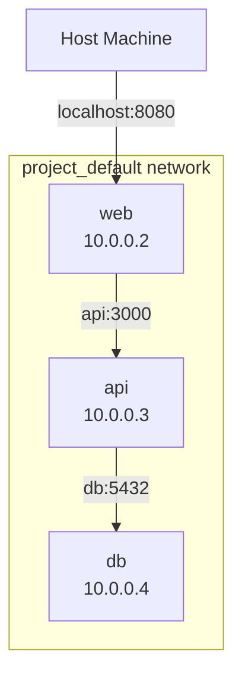
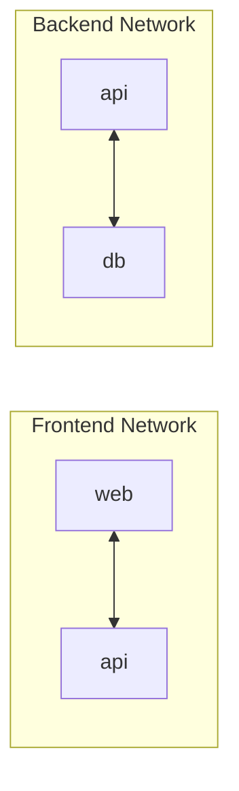
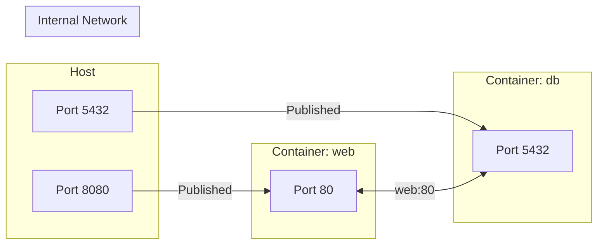
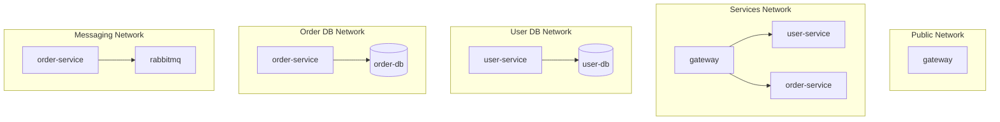

Docker Compose automatically creates a default network for your application, enabling containers to communicate using service names as hostnames.

## Default Networking



When you run `docker compose up`, Compose creates a default network named `{project}_default`. All services join this network and can reach each other by service name.

```yaml
# docker-compose.yml
services:
  web:
    image: nginx:alpine
    ports:
      - "8080:80"

  api:
    image: myapi:latest
    # Can reach db at "db:5432"

  db:
    image: postgres:16-alpine
    # Accessible at hostname "db"
```

```bash
# From api container
curl http://web:80      # Access web service
psql -h db -U postgres  # Access database
```

## Custom Networks

Define custom networks for network isolation and control.

<Tabs items={['Basic', 'Multiple Networks', 'External Networks']}>
<Tab value="Basic">
```yaml
services:
  web:
    networks:
      - frontend

  api:
    networks:
      - frontend
      - backend

  db:
    networks:
      - backend

networks:
  frontend:
  backend:
```


</Tab>
<Tab value="Multiple Networks">
```yaml
services:
  proxy:
    image: traefik:v2
    networks:
      - proxy
    ports:
      - "80:80"

  web:
    image: nginx:alpine
    networks:
      - proxy
      - internal

  api:
    image: myapi:latest
    networks:
      - internal
      - database

  db:
    image: postgres:16-alpine
    networks:
      - database

networks:
  proxy:
    name: proxy-network
  internal:
  database:
```
</Tab>
<Tab value="External Networks">
```yaml
# Connect to pre-existing network
services:
  app:
    networks:
      - existing_network

networks:
  existing_network:
    external: true
    name: my-existing-network

# Create if doesn't exist
networks:
  shared:
    name: shared-network
```

```bash
# Create external network first
docker network create my-existing-network
```
</Tab>
</Tabs>

## Network Configuration

```yaml
networks:
  frontend:
    # Network name (default: project_networkname)
    name: my-frontend-network
    
    # Network driver
    driver: bridge
    
    # Driver options
    driver_opts:
      com.docker.network.bridge.name: br-frontend
    
    # Enable IPv6
    enable_ipv6: true
    
    # Custom subnet
    ipam:
      driver: default
      config:
        - subnet: 172.28.0.0/16
          ip_range: 172.28.5.0/24
          gateway: 172.28.5.254

  internal-only:
    # No external connectivity
    internal: true
```

### Network Drivers

| Driver | Description | Use Case |
|--------|-------------|----------|
| `bridge` | Default, isolated network | Most applications |
| `host` | Use host's network stack | Performance-critical |
| `overlay` | Multi-host networking | Docker Swarm |
| `macvlan` | Assign MAC address | Legacy applications |
| `none` | No networking | Isolated containers |

## Service Network Configuration

```yaml
services:
  api:
    networks:
      backend:
        # Static IP address
        ipv4_address: 172.28.0.10
        ipv6_address: 2001:db8::10
        
        # Network aliases
        aliases:
          - api-server
          - backend-api
        
        # Priority (lower = connected first)
        priority: 100
```

## DNS and Hostnames

```yaml
services:
  web:
    # Custom hostname
    hostname: webserver
    
    # Domain name
    domainname: example.com
    
    # Additional DNS servers
    dns:
      - 8.8.8.8
      - 8.8.4.4
    
    # DNS search domains
    dns_search:
      - example.com
      - internal.example.com
    
    # Custom host entries
    extra_hosts:
      - "host.docker.internal:host-gateway"
      - "api.local:192.168.1.100"
```

## Port Mapping



```yaml
services:
  web:
    ports:
      # HOST:CONTAINER
      - "8080:80"
      
      # Bind to specific interface
      - "127.0.0.1:8080:80"
      
      # Random host port
      - "80"
      
      # Port range
      - "8080-8090:80-90"
      
      # UDP
      - "53:53/udp"
      
      # Long syntax
      - target: 80
        published: 8080
        protocol: tcp
        mode: host
    
    # Internal only (not published to host)
    expose:
      - "3000"
      - "9090"
```

## Network Isolation Patterns

### Frontend/Backend Isolation

```yaml
services:
  # Public-facing proxy
  nginx:
    image: nginx:alpine
    ports:
      - "80:80"
    networks:
      - frontend

  # Application layer
  api:
    image: myapi:latest
    networks:
      - frontend  # Receives requests from nginx
      - backend   # Connects to database

  # Database layer (isolated)
  db:
    image: postgres:16-alpine
    networks:
      - backend   # Only accessible from api

networks:
  frontend:
  backend:
    internal: true  # No external access
```

### Microservices Pattern

```yaml
services:
  gateway:
    networks:
      - public
      - services

  user-service:
    networks:
      - services
      - user-db

  order-service:
    networks:
      - services
      - order-db
      - messaging

  user-db:
    networks:
      - user-db

  order-db:
    networks:
      - order-db

  rabbitmq:
    networks:
      - messaging

networks:
  public:
  services:
    internal: true
  user-db:
    internal: true
  order-db:
    internal: true
  messaging:
    internal: true
```



## Connecting to Host Services

```yaml
services:
  app:
    extra_hosts:
      # Access host machine services
      - "host.docker.internal:host-gateway"
    environment:
      # Connect to service on host
      - DATABASE_URL=postgres://host.docker.internal:5432/mydb
```

<Callout type="info" title="host.docker.internal">
`host.docker.internal` resolves to the host machine. Use `host-gateway` as the IP on Linux.
</Callout>

## Network Commands

```bash
# List networks
docker network ls

# Inspect network
docker network inspect project_default

# Connect running container
docker network connect mynetwork container_name

# Disconnect container
docker network disconnect mynetwork container_name

# Create network manually
docker network create --driver bridge my-network

# Remove unused networks
docker network prune
```

## Debugging Network Issues

```bash
# Check container's networks
docker inspect container_name --format='{{json .NetworkSettings.Networks}}'

# Check DNS resolution
docker compose exec web nslookup api

# Test connectivity
docker compose exec web ping api
docker compose exec web curl http://api:3000

# View network details
docker network inspect project_default
```

### Common Issues

| Issue | Cause | Solution |
|-------|-------|----------|
| Can't reach service | Different networks | Add service to same network |
| DNS not resolving | Service not running | Check `docker compose ps` |
| Connection refused | Wrong port | Check exposed/published ports |
| Timeout | Firewall/security group | Check host firewall rules |
