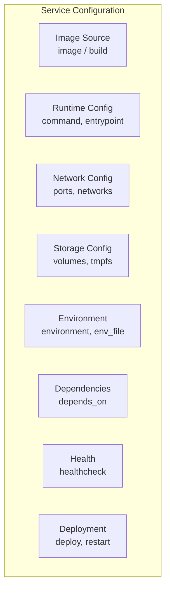
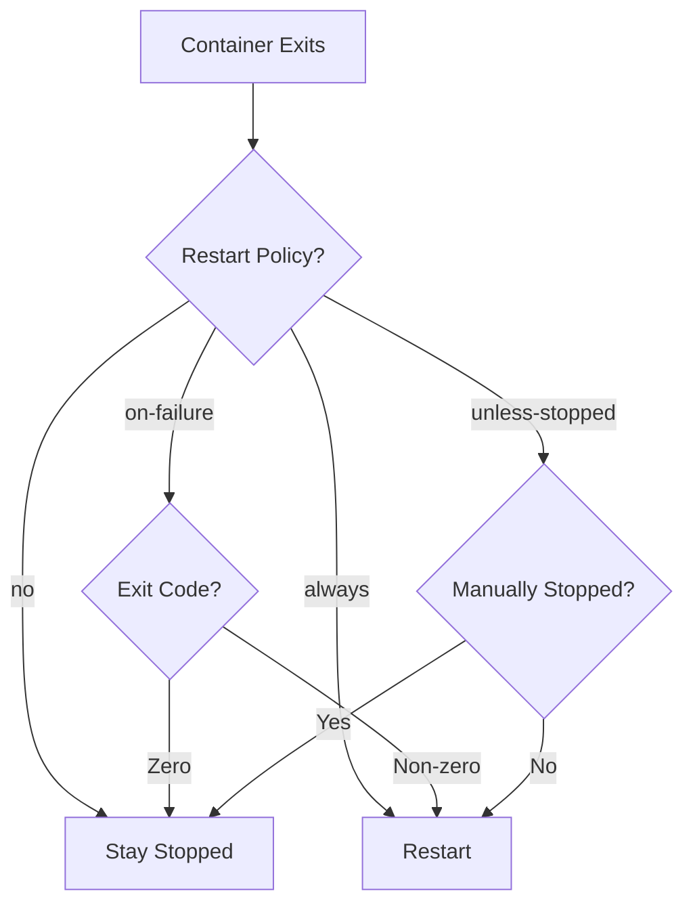
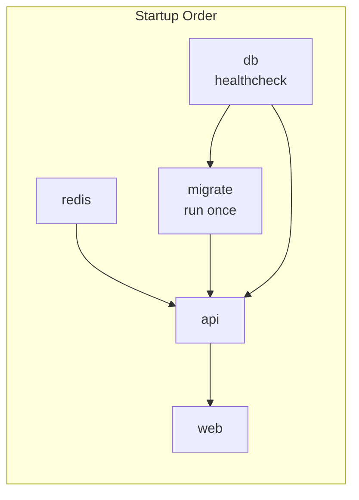

Services are the core building blocks of a Docker Compose application. Each service runs one container (or multiple replicas) based on an image or build context.

## Service Definition



## Image vs Build

<Tabs items={['Using Image', 'Using Build', 'Build with Args']}>
<Tab value="Using Image">
```yaml
services:
  # Use pre-built image
  nginx:
    image: nginx:1.25-alpine

  # Use image with specific digest
  postgres:
    image: postgres@sha256:abc123...

  # Use private registry
  api:
    image: registry.example.com/myapp:v1.0.0
```
</Tab>
<Tab value="Using Build">
```yaml
services:
  api:
    # Simple build from Dockerfile
    build: ./api

    # Detailed build configuration
    build:
      context: ./api
      dockerfile: Dockerfile.prod
      target: production
      
  web:
    build:
      context: .
      dockerfile: docker/web/Dockerfile
```
</Tab>
<Tab value="Build with Args">
```yaml
services:
  app:
    build:
      context: .
      dockerfile: Dockerfile
      args:
        - NODE_VERSION=20
        - BUILD_DATE=${BUILD_DATE}
      target: production
      cache_from:
        - myapp:latest
      labels:
        - "com.example.version=1.0.0"
```
</Tab>
</Tabs>

## Container Configuration

### Command and Entrypoint

```yaml
services:
  app:
    image: node:20-alpine
    
    # Override CMD
    command: npm run dev
    # OR as array
    command: ["npm", "run", "dev"]
    
    # Override ENTRYPOINT
    entrypoint: /custom-entrypoint.sh
    # OR as array
    entrypoint: ["/bin/sh", "-c"]
    
    # Working directory
    working_dir: /app
    
    # User
    user: node
    # OR with group
    user: "1000:1000"
```

### Container Naming

```yaml
services:
  web:
    image: nginx:alpine
    
    # Custom container name
    container_name: my-nginx
    
    # Hostname inside container
    hostname: webserver
    
    # Domain name
    domainname: example.com
```

<Callout type="warn" title="Container Names">
Using `container_name` prevents scaling. Compose auto-generates names like `project_service_1` by default.
</Callout>

### Restart Policies

```yaml
services:
  web:
    restart: "no"           # Never restart (default)
    
  api:
    restart: always         # Always restart
    
  worker:
    restart: on-failure     # Restart on non-zero exit
    
  db:
    restart: unless-stopped # Restart unless manually stopped
```



## Port Configuration

```yaml
services:
  web:
    ports:
      # Short syntax: HOST:CONTAINER
      - "8080:80"
      
      # Specify host IP
      - "127.0.0.1:8080:80"
      
      # Range of ports
      - "8080-8090:80-90"
      
      # UDP protocol
      - "53:53/udp"
      
      # Long syntax
      - target: 80
        published: 8080
        protocol: tcp
        mode: host

    # Expose without publishing (internal only)
    expose:
      - "3000"
      - "8080"
```

| Syntax | Meaning |
|--------|---------|
| `"8080:80"` | Map host 8080 to container 80 |
| `"80"` | Map random host port to container 80 |
| `"127.0.0.1:8080:80"` | Bind to localhost only |
| `"8080:80/udp"` | UDP protocol |

## Dependencies

```yaml
services:
  web:
    depends_on:
      - api
      - redis

  api:
    depends_on:
      db:
        condition: service_healthy
      redis:
        condition: service_started
      migrate:
        condition: service_completed_successfully

  db:
    image: postgres:16-alpine
    healthcheck:
      test: ["CMD-SHELL", "pg_isready -U postgres"]
      interval: 5s
      timeout: 5s
      retries: 5

  migrate:
    image: myapp:latest
    command: npm run migrate
    depends_on:
      db:
        condition: service_healthy
```



## Health Checks

```yaml
services:
  api:
    healthcheck:
      # Test command
      test: ["CMD", "curl", "-f", "http://localhost:3000/health"]
      # OR shell form
      test: curl -f http://localhost:3000/health || exit 1
      
      # Timing configuration
      interval: 30s      # Time between checks
      timeout: 10s       # Timeout for check
      retries: 3         # Failures before unhealthy
      start_period: 40s  # Grace period on startup
      start_interval: 5s # Interval during start period

  db:
    image: postgres:16-alpine
    healthcheck:
      test: ["CMD-SHELL", "pg_isready -U ${POSTGRES_USER:-postgres}"]
      interval: 10s
      timeout: 5s
      retries: 5

  redis:
    image: redis:7-alpine
    healthcheck:
      test: ["CMD", "redis-cli", "ping"]
      interval: 10s
      timeout: 5s
      retries: 5
```

### Disable Health Check

```yaml
services:
  app:
    healthcheck:
      disable: true
```

## Resource Limits

```yaml
services:
  api:
    deploy:
      resources:
        # Maximum resources
        limits:
          cpus: '0.5'
          memory: 512M
          pids: 100
        
        # Reserved resources
        reservations:
          cpus: '0.25'
          memory: 256M
          devices:
            - capabilities: [gpu]
```

<Callout type="info" title="Compose V2">
In Compose V2, use `deploy.resources` for resource limits. The old `mem_limit` and `cpus` keys are deprecated.
</Callout>

## Scaling Services

```yaml
services:
  web:
    image: nginx:alpine
    deploy:
      replicas: 3
    ports:
      - "8080-8082:80"  # Port range for replicas
```

```bash
# Scale at runtime
docker compose up -d --scale web=5

# Scale multiple services
docker compose up -d --scale web=3 --scale worker=2
```

<Callout type="warn" title="Scaling Limitations">
Cannot scale services with `container_name` or static port mappings. Use port ranges or remove fixed ports.
</Callout>

## Labels and Logging

```yaml
services:
  api:
    labels:
      - "traefik.enable=true"
      - "traefik.http.routers.api.rule=Host(`api.example.com`)"
    
    logging:
      driver: json-file
      options:
        max-size: "10m"
        max-file: "3"
        
  syslog-service:
    logging:
      driver: syslog
      options:
        syslog-address: "tcp://192.168.0.1:514"
```

## Init and Privileged

```yaml
services:
  app:
    # Use init process (handles zombie processes)
    init: true
    
  tools:
    # Run with elevated privileges (avoid in production)
    privileged: true
    
  network-debug:
    # Add specific capabilities
    cap_add:
      - NET_ADMIN
    cap_drop:
      - ALL
```

## Temporary Filesystems

```yaml
services:
  api:
    # tmpfs mounts (memory-backed)
    tmpfs:
      - /tmp
      - /run:size=100M,uid=1000

    # Shared memory size
    shm_size: 256M
```

## Complete Service Example

```yaml
services:
  api:
    # Build configuration
    build:
      context: .
      dockerfile: Dockerfile
      target: production
      args:
        - NODE_VERSION=20
    
    # Alternative: use image
    # image: myregistry.com/api:v1.0.0
    
    # Container settings
    container_name: api-server
    hostname: api
    restart: unless-stopped
    init: true
    
    # Runtime configuration
    command: ["node", "dist/server.js"]
    working_dir: /app
    user: node
    
    # Networking
    ports:
      - "3000:3000"
    expose:
      - "9090"
    networks:
      - backend
      - frontend
    
    # Storage
    volumes:
      - ./logs:/app/logs
      - uploads:/app/uploads
    tmpfs:
      - /tmp
    
    # Environment
    environment:
      - NODE_ENV=production
    env_file:
      - .env.production
    
    # Dependencies
    depends_on:
      db:
        condition: service_healthy
      redis:
        condition: service_started
    
    # Health check
    healthcheck:
      test: ["CMD", "curl", "-f", "http://localhost:3000/health"]
      interval: 30s
      timeout: 10s
      retries: 3
      start_period: 40s
    
    # Resources
    deploy:
      resources:
        limits:
          cpus: '1'
          memory: 1G
        reservations:
          cpus: '0.5'
          memory: 512M
    
    # Logging
    logging:
      driver: json-file
      options:
        max-size: "10m"
        max-file: "3"
    
    # Labels
    labels:
      - "com.example.service=api"
      - "traefik.enable=true"
```
