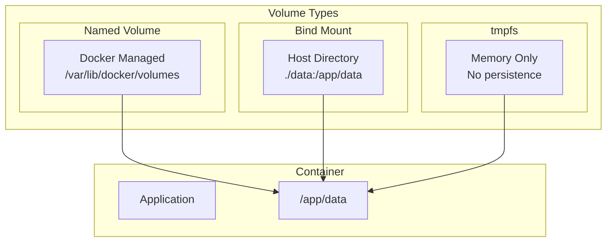
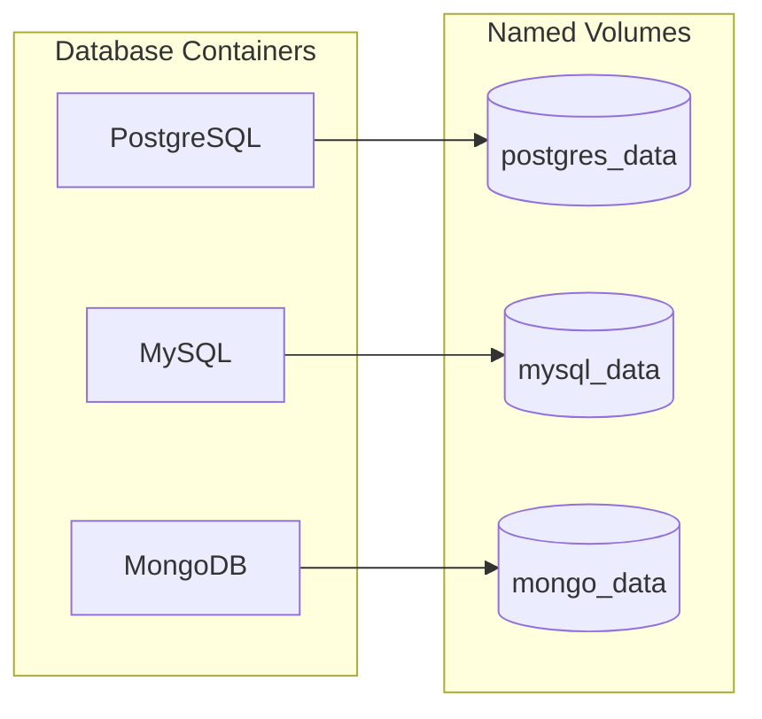

Volumes provide persistent storage for containers. Data in volumes persists even when containers are removed, making them essential for databases and stateful applications.

## Volume Types



| Type | Persistence | Performance | Use Case |
|------|-------------|-------------|----------|
| Named Volume | ✅ Persists | Fast | Databases, production |
| Bind Mount | ✅ Persists | Host dependent | Development, config |
| tmpfs | ❌ Memory only | Very fast | Temporary/sensitive data |

## Named Volumes

Named volumes are managed by Docker and persist data across container lifecycles.

<Tabs items={['Basic', 'With Options', 'External']}>
<Tab value="Basic">
```yaml
services:
  db:
    image: postgres:16-alpine
    volumes:
      - postgres_data:/var/lib/postgresql/data

  redis:
    image: redis:7-alpine
    volumes:
      - redis_data:/data

volumes:
  postgres_data:
  redis_data:
```
</Tab>
<Tab value="With Options">
```yaml
services:
  db:
    image: postgres:16-alpine
    volumes:
      - postgres_data:/var/lib/postgresql/data

volumes:
  postgres_data:
    # Custom name
    name: my-postgres-data
    
    # Volume driver
    driver: local
    
    # Driver options
    driver_opts:
      type: none
      device: /data/postgres
      o: bind
    
    # Labels
    labels:
      - "com.example.project=myapp"
      - "com.example.environment=production"
```
</Tab>
<Tab value="External">
```yaml
# Use pre-existing volume
services:
  db:
    volumes:
      - existing_volume:/var/lib/postgresql/data

volumes:
  existing_volume:
    external: true
    name: my-existing-volume
```

```bash
# Create external volume first
docker volume create my-existing-volume
```
</Tab>
</Tabs>

## Bind Mounts

Bind mounts map a host directory to a container path. Ideal for development workflows.

```yaml
services:
  web:
    build: .
    volumes:
      # Short syntax: HOST:CONTAINER
      - ./src:/app/src
      
      # Read-only
      - ./config:/app/config:ro
      
      # Long syntax
      - type: bind
        source: ./logs
        target: /app/logs
        read_only: false

  nginx:
    image: nginx:alpine
    volumes:
      - ./nginx.conf:/etc/nginx/nginx.conf:ro
      - ./html:/usr/share/nginx/html:ro
```

### Development Hot Reload

```yaml
services:
  app:
    build:
      context: .
      target: development
    volumes:
      # Mount source code
      - .:/app
      # Preserve node_modules from image
      - /app/node_modules
    command: npm run dev
```

<Callout type="warn" title="Node Modules">
Exclude `node_modules` from bind mount to use the container's dependencies instead of host's.
</Callout>

## tmpfs Mounts

tmpfs mounts store data in memory. Data is lost when the container stops.

```yaml
services:
  app:
    image: myapp:latest
    tmpfs:
      # Simple
      - /tmp
      
      # With options
      - /run:size=100M,uid=1000
    
    # Alternative long syntax
    volumes:
      - type: tmpfs
        target: /app/cache
        tmpfs:
          size: 100000000  # 100MB
          mode: 1777
```

Use cases for tmpfs:
- Temporary files
- Sensitive data (credentials, tokens)
- High-performance caching

## Volume Syntax Comparison

<Tabs items={['Short Syntax', 'Long Syntax']}>
<Tab value="Short Syntax">
```yaml
services:
  app:
    volumes:
      # Named volume
      - data:/app/data
      
      # Bind mount
      - ./src:/app/src
      
      # Read-only
      - ./config:/app/config:ro
      
      # Anonymous volume
      - /app/temp
```
</Tab>
<Tab value="Long Syntax">
```yaml
services:
  app:
    volumes:
      # Named volume
      - type: volume
        source: data
        target: /app/data
        volume:
          nocopy: true
      
      # Bind mount
      - type: bind
        source: ./src
        target: /app/src
        bind:
          create_host_path: true
      
      # tmpfs
      - type: tmpfs
        target: /app/cache
        tmpfs:
          size: 104857600

volumes:
  data:
```
</Tab>
</Tabs>

## Volume Options

| Option | Description | Example |
|--------|-------------|---------|
| `ro` | Read-only | `./config:/app/config:ro` |
| `rw` | Read-write (default) | `./data:/app/data:rw` |
| `cached` | Host authoritative (macOS) | `./src:/app/src:cached` |
| `delegated` | Container authoritative | `./data:/app/data:delegated` |
| `consistent` | Full consistency (slow) | `./src:/app/src:consistent` |

## Database Volume Patterns



<Tabs items={['PostgreSQL', 'MySQL', 'MongoDB', 'Redis']}>
<Tab value="PostgreSQL">
```yaml
services:
  postgres:
    image: postgres:16-alpine
    volumes:
      - postgres_data:/var/lib/postgresql/data
      - ./init.sql:/docker-entrypoint-initdb.d/init.sql:ro
    environment:
      - POSTGRES_PASSWORD=secret

volumes:
  postgres_data:
```
</Tab>
<Tab value="MySQL">
```yaml
services:
  mysql:
    image: mysql:8
    volumes:
      - mysql_data:/var/lib/mysql
      - ./init:/docker-entrypoint-initdb.d:ro
      - ./my.cnf:/etc/mysql/conf.d/my.cnf:ro
    environment:
      - MYSQL_ROOT_PASSWORD=secret

volumes:
  mysql_data:
```
</Tab>
<Tab value="MongoDB">
```yaml
services:
  mongo:
    image: mongo:7
    volumes:
      - mongo_data:/data/db
      - mongo_config:/data/configdb
    environment:
      - MONGO_INITDB_ROOT_USERNAME=root
      - MONGO_INITDB_ROOT_PASSWORD=secret

volumes:
  mongo_data:
  mongo_config:
```
</Tab>
<Tab value="Redis">
```yaml
services:
  redis:
    image: redis:7-alpine
    command: redis-server --appendonly yes
    volumes:
      - redis_data:/data

volumes:
  redis_data:
```
</Tab>
</Tabs>

## Sharing Volumes Between Services

```yaml
services:
  # Generator writes to shared volume
  generator:
    image: myapp:latest
    command: generate-reports
    volumes:
      - reports:/app/output

  # Web server reads from shared volume
  nginx:
    image: nginx:alpine
    volumes:
      - reports:/usr/share/nginx/html:ro
    depends_on:
      - generator

volumes:
  reports:
```

## Backup and Restore

```bash
# Backup volume to tar file
docker run --rm \
  -v postgres_data:/data \
  -v $(pwd):/backup \
  alpine tar cvf /backup/postgres_backup.tar /data

# Restore volume from tar file
docker run --rm \
  -v postgres_data:/data \
  -v $(pwd):/backup \
  alpine sh -c "cd /data && tar xvf /backup/postgres_backup.tar --strip 1"
```

### Database-specific Backup

```yaml
services:
  db:
    image: postgres:16-alpine
    volumes:
      - postgres_data:/var/lib/postgresql/data

  backup:
    image: postgres:16-alpine
    volumes:
      - ./backups:/backups
    command: >
      sh -c "pg_dump -h db -U postgres mydb > /backups/backup_$$(date +%Y%m%d).sql"
    depends_on:
      - db
    profiles:
      - backup

volumes:
  postgres_data:
```

```bash
# Run backup
docker compose --profile backup run --rm backup
```

## Volume Commands

```bash
# List volumes
docker volume ls

# Inspect volume
docker volume inspect postgres_data

# Create volume
docker volume create my-volume

# Remove volume
docker volume rm my-volume

# Remove unused volumes
docker volume prune

# Remove all unused volumes (including named)
docker volume prune -a
```

## Best Practices

<Accordions>
<Accordion title="Use named volumes for databases">
```yaml
# ✅ Good: Named volume managed by Docker
volumes:
  - postgres_data:/var/lib/postgresql/data

# ❌ Bad: Bind mount for database
volumes:
  - ./data:/var/lib/postgresql/data
```
</Accordion>
<Accordion title="Use bind mounts for development">
```yaml
# ✅ Good: Live code reloading
services:
  app:
    volumes:
      - ./src:/app/src
      - /app/node_modules  # Exclude node_modules
```
</Accordion>
<Accordion title="Make config files read-only">
```yaml
# ✅ Good: Prevent accidental modifications
volumes:
  - ./nginx.conf:/etc/nginx/nginx.conf:ro
```
</Accordion>
<Accordion title="Use tmpfs for sensitive data">
```yaml
# ✅ Good: Credentials don't persist
tmpfs:
  - /app/secrets
```
</Accordion>
</Accordions>

## Common Issues

| Issue | Cause | Solution |
|-------|-------|----------|
| Permission denied | UID mismatch | Set correct ownership or user |
| Data not persisting | Using anonymous volume | Use named volume |
| Slow on macOS | File sync overhead | Use `:cached` or `:delegated` |
| Volume not found | Typo in volume name | Check volume names |
