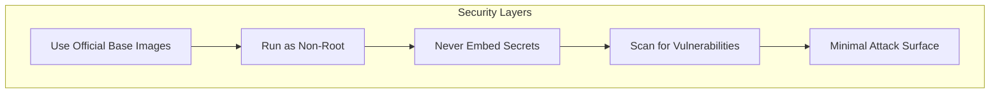
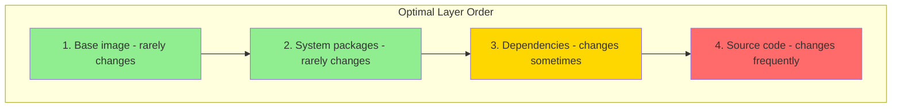

Follow these best practices to create secure, efficient, and maintainable Docker images.

## Security Best Practices



### Run as Non-Root User

<Tabs items={['Alpine', 'Debian/Ubuntu', 'Node.js']}>
<Tab value="Alpine">
```dockerfile
FROM alpine:3.19

# Create non-root user
RUN addgroup -g 1001 -S app && \
    adduser -S -u 1001 -G app app

# Set ownership
COPY --chown=app:app . /app

# Switch to non-root user
USER app

CMD ["/app/myapp"]
```
</Tab>
<Tab value="Debian/Ubuntu">
```dockerfile
FROM debian:bookworm-slim

# Create non-root user
RUN groupadd -r app && useradd -r -g app app

# Create app directory with proper permissions
RUN mkdir -p /app && chown -R app:app /app

USER app
WORKDIR /app

CMD ["./myapp"]
```
</Tab>
<Tab value="Node.js">
```dockerfile
FROM node:20-alpine

WORKDIR /app

# Use built-in node user
COPY --chown=node:node . .
RUN npm ci --only=production

USER node

CMD ["node", "server.js"]
```
</Tab>
</Tabs>

<Callout type="warn" title="Root is Dangerous">
Running as root inside a container can lead to privilege escalation if the container is compromised.
</Callout>

### Never Embed Secrets

```dockerfile
# ❌ NEVER do this
ENV API_KEY=secret123
COPY .env /app/.env
RUN echo "password" > /app/config

# ✅ Use build arguments for non-sensitive config
ARG NODE_ENV=production
ENV NODE_ENV=$NODE_ENV

# ✅ Use secrets at runtime
# docker run -e API_KEY=secret myapp
# docker run --secret id=my_secret myapp
```

### Use Specific Base Image Tags

```dockerfile
# ❌ Bad: Unpredictable, can break
FROM node:latest
FROM ubuntu

# ✅ Good: Specific version
FROM node:20.10.0-alpine3.19
FROM ubuntu:22.04

# ✅ Best: Use digest for immutability
FROM node:20-alpine@sha256:abc123...
```

### Minimize Attack Surface

```dockerfile
# ✅ Use minimal base images
FROM gcr.io/distroless/nodejs20-debian12
FROM alpine:3.19
FROM scratch

# ✅ Remove unnecessary packages
RUN apt-get update && \
    apt-get install -y --no-install-recommends curl && \
    apt-get clean && \
    rm -rf /var/lib/apt/lists/*

# ✅ Don't install development dependencies in production
RUN npm ci --only=production
```

## Optimization Best Practices

### Layer Caching



```dockerfile
# ✅ Optimal: Copy dependency files first
FROM node:20-alpine

WORKDIR /app

# Layer 1: Dependencies (cached unless package.json changes)
COPY package*.json ./
RUN npm ci

# Layer 2: Source code (rebuilt on every change)
COPY . .

# Layer 3: Build (rebuilt if source changes)
RUN npm run build

CMD ["npm", "start"]
```

### Reduce Image Size

<Accordions>
<Accordion title="Use multi-stage builds">
```dockerfile
# Build stage
FROM node:20 AS builder
WORKDIR /app
COPY . .
RUN npm ci && npm run build

# Production stage - much smaller
FROM node:20-alpine
WORKDIR /app
COPY --from=builder /app/dist ./dist
COPY --from=builder /app/node_modules ./node_modules
CMD ["node", "dist/server.js"]
```
</Accordion>
<Accordion title="Use Alpine or distroless images">
```dockerfile
# Alpine: ~5MB base
FROM node:20-alpine

# Distroless: No shell, minimal attack surface
FROM gcr.io/distroless/nodejs20-debian12

# Scratch: Empty, for static binaries
FROM scratch
```
</Accordion>
<Accordion title="Clean up in the same layer">
```dockerfile
# ✅ Good: Clean up in same RUN command
RUN apt-get update && \
    apt-get install -y curl && \
    apt-get clean && \
    rm -rf /var/lib/apt/lists/*

# ❌ Bad: Cleanup in separate layer doesn't reduce size
RUN apt-get update
RUN apt-get install -y curl
RUN rm -rf /var/lib/apt/lists/*  # Still in previous layers
```
</Accordion>
<Accordion title="Use .dockerignore">
```plaintext
# .dockerignore
node_modules
.git
.gitignore
*.md
Dockerfile*
docker-compose*
.env*
coverage
.nyc_output
dist
test
__tests__
```
</Accordion>
</Accordions>

### Minimize Layers

```dockerfile
# ❌ Bad: Multiple layers
RUN apt-get update
RUN apt-get install -y curl
RUN apt-get install -y wget
RUN apt-get clean

# ✅ Good: Single layer
RUN apt-get update && \
    apt-get install -y --no-install-recommends \
        curl \
        wget && \
    apt-get clean && \
    rm -rf /var/lib/apt/lists/*
```

## Maintainability Best Practices

### Use ARG for Versions

```dockerfile
ARG NODE_VERSION=20
ARG ALPINE_VERSION=3.19

FROM node:${NODE_VERSION}-alpine${ALPINE_VERSION}

# Document with labels
LABEL org.opencontainers.image.version="1.0.0"
LABEL org.opencontainers.image.source="https://github.com/user/repo"
```

### Use HEALTHCHECK

```dockerfile
# HTTP health check
HEALTHCHECK --interval=30s --timeout=3s --start-period=5s --retries=3 \
    CMD wget --no-verbose --tries=1 --spider http://localhost:3000/health || exit 1

# For minimal images without wget/curl
HEALTHCHECK --interval=30s --timeout=3s \
    CMD node -e "require('http').get('http://localhost:3000/health', (r) => process.exit(r.statusCode === 200 ? 0 : 1))"
```

### Document with Labels

```dockerfile
LABEL maintainer="team@example.com"
LABEL org.opencontainers.image.title="My Application"
LABEL org.opencontainers.image.description="A sample application"
LABEL org.opencontainers.image.version="1.0.0"
LABEL org.opencontainers.image.url="https://example.com"
LABEL org.opencontainers.image.source="https://github.com/user/repo"
LABEL org.opencontainers.image.licenses="MIT"
```

### Use ENTRYPOINT + CMD

```dockerfile
# ENTRYPOINT: The executable
# CMD: Default arguments

ENTRYPOINT ["node", "server.js"]
CMD ["--port", "3000"]

# Allows: docker run myapp --port 8080
```

## Common Anti-patterns

<Callout type="error" title="Avoid These Mistakes" />

| Anti-pattern | Problem | Solution |
|--------------|---------|----------|
| `FROM latest` | Unpredictable builds | Use specific tags |
| Running as root | Security risk | Use USER instruction |
| Secrets in image | Credentials exposed | Use runtime secrets |
| Large base images | Slow deploys | Use Alpine/distroless |
| Installing editors | Larger attack surface | Debug externally |
| Not using .dockerignore | Large build context | Create .dockerignore |
| Update without cleanup | Bloated layers | Clean in same RUN |

## Complete Example

```dockerfile
# Build arguments
ARG NODE_VERSION=20
ARG ALPINE_VERSION=3.19

# Stage 1: Dependencies
FROM node:${NODE_VERSION}-alpine${ALPINE_VERSION} AS deps
WORKDIR /app
COPY package*.json ./
RUN npm ci

# Stage 2: Builder
FROM deps AS builder
COPY . .
RUN npm run build

# Stage 3: Production
FROM node:${NODE_VERSION}-alpine${ALPINE_VERSION} AS production

# Labels
LABEL org.opencontainers.image.title="My App"
LABEL org.opencontainers.image.version="1.0.0"

# Environment
ENV NODE_ENV=production

WORKDIR /app

# Install production dependencies only
COPY package*.json ./
RUN npm ci --only=production && \
    npm cache clean --force

# Copy built application
COPY --from=builder /app/dist ./dist

# Create non-root user
RUN addgroup -g 1001 -S nodejs && \
    adduser -S nextjs -u 1001

# Set ownership and switch user
RUN chown -R nextjs:nodejs /app
USER nextjs

# Health check
HEALTHCHECK --interval=30s --timeout=3s --start-period=5s --retries=3 \
    CMD wget --no-verbose --tries=1 --spider http://localhost:3000/health || exit 1

EXPOSE 3000

ENTRYPOINT ["node"]
CMD ["dist/server.js"]
```
