A **Dockerfile** is a text document containing instructions to build a Docker image. Each instruction creates a layer in the image, making understanding and optimizing Dockerfiles crucial for efficient containerization.

<Callout type="info" title="Build Context">
When you run `docker build`, Docker sends the entire directory (build context) to the daemon. Use `.dockerignore` to exclude unnecessary files.
</Callout>

## Dockerfile Structure


## Quick Navigation

<Cards>
  <Card title="Instructions Reference" href="/docs/docker/dockerfile/instructions" description="Complete Dockerfile instruction guide" />
  <Card title="Multi-stage Builds" href="/docs/docker/dockerfile/multi-stage" description="Optimize image size with stages" />
  <Card title="Best Practices" href="/docs/docker/dockerfile/best-practices" description="Security and optimization tips" />
</Cards>

## Basic Dockerfile Example

<Tabs items={['Node.js', 'Python', 'Go', 'Java']}>
<Tab value="Node.js">
```dockerfile
# Use specific version for reproducibility
FROM node:20-alpine

# Set working directory
WORKDIR /app

# Copy package files first (leverage layer caching)
COPY package*.json ./

# Install dependencies
RUN npm ci --only=production

# Copy application code
COPY . .

# Create non-root user
RUN addgroup -g 1001 -S nodejs && \
    adduser -S nextjs -u 1001

# Switch to non-root user
USER nextjs

# Expose port
EXPOSE 3000

# Define startup command
CMD ["node", "server.js"]
```
</Tab>
<Tab value="Python">
```dockerfile
# Use slim base image
FROM python:3.12-slim

# Set environment variables
ENV PYTHONDONTWRITEBYTECODE=1 \
    PYTHONUNBUFFERED=1

# Set working directory
WORKDIR /app

# Install dependencies
COPY requirements.txt .
RUN pip install --no-cache-dir -r requirements.txt

# Copy application
COPY . .

# Create non-root user
RUN useradd --create-home --shell /bin/bash app
USER app

# Expose port
EXPOSE 8000

# Run application
CMD ["python", "-m", "uvicorn", "main:app", "--host", "0.0.0.0"]
```
</Tab>
<Tab value="Go">
```dockerfile
# Build stage
FROM golang:1.22-alpine AS builder

WORKDIR /app

# Copy go mod files
COPY go.mod go.sum ./
RUN go mod download

# Copy source and build
COPY . .
RUN CGO_ENABLED=0 GOOS=linux go build -o main .

# Runtime stage
FROM alpine:3.19

WORKDIR /app

# Copy binary from builder
COPY --from=builder /app/main .

# Create non-root user
RUN adduser -D -g '' appuser
USER appuser

EXPOSE 8080

CMD ["./main"]
```
</Tab>
<Tab value="Java">
```dockerfile
# Build stage
FROM eclipse-temurin:21-jdk-alpine AS builder

WORKDIR /app

# Copy maven files
COPY pom.xml .
COPY src ./src

# Build application
RUN ./mvnw package -DskipTests

# Runtime stage
FROM eclipse-temurin:21-jre-alpine

WORKDIR /app

# Copy JAR from builder
COPY --from=builder /app/target/*.jar app.jar

# Create non-root user
RUN addgroup -S spring && adduser -S spring -G spring
USER spring

EXPOSE 8080

ENTRYPOINT ["java", "-jar", "app.jar"]
```
</Tab>
</Tabs>

## Layer Caching

Docker caches layers to speed up builds. Understanding layer caching is essential for optimization.

```mermaid
flowchart LR
    subgraph "First Build"
        A1[FROM node:20] --> B1[COPY package.json]
        B1 --> C1[RUN npm install]
        C1 --> D1[COPY . .]
    end
    
    subgraph "Second Build (code change)"
        A2[FROM node:20<br/>✅ Cached] --> B2[COPY package.json<br/>✅ Cached]
        B2 --> C2[RUN npm install<br/>✅ Cached]
        C2 --> D2[COPY . .<br/>🔄 Rebuilt]
    end
```



<Callout type="warn" title="Cache Invalidation">
When a layer changes, all subsequent layers are rebuilt. Order instructions from least to most frequently changing.
</Callout>

### Optimal Layer Order

```dockerfile
# ✅ Good: Dependencies change less frequently
FROM node:20-alpine
WORKDIR /app

# 1. Copy dependency definitions first
COPY package*.json ./

# 2. Install dependencies (cached unless package.json changes)
RUN npm ci

# 3. Copy source code last (changes most frequently)
COPY . .

CMD ["npm", "start"]
```

```dockerfile
# ❌ Bad: Any file change invalidates npm install cache
FROM node:20-alpine
WORKDIR /app

# Source code changes invalidate everything below
COPY . .
RUN npm ci

CMD ["npm", "start"]
```

## Essential Instructions

| Instruction | Purpose | Example |
|-------------|---------|---------|
| `FROM` | Set base image | `FROM node:20-alpine` |
| `WORKDIR` | Set working directory | `WORKDIR /app` |
| `COPY` | Copy files from context | `COPY . .` |
| `ADD` | Copy with extraction/URLs | `ADD archive.tar.gz /app/` |
| `RUN` | Execute commands | `RUN npm install` |
| `ENV` | Set environment variables | `ENV NODE_ENV=production` |
| `ARG` | Build-time variables | `ARG VERSION=1.0` |
| `EXPOSE` | Document ports | `EXPOSE 3000` |
| `VOLUME` | Create mount point | `VOLUME /data` |
| `USER` | Set user for commands | `USER node` |
| `CMD` | Default command | `CMD ["npm", "start"]` |
| `ENTRYPOINT` | Container executable | `ENTRYPOINT ["node"]` |

## Building Images

<Steps>
<Step>
### Create a Dockerfile

```dockerfile
FROM nginx:alpine
COPY ./html /usr/share/nginx/html
EXPOSE 80
```
</Step>
<Step>
### Build the Image

```bash
# Basic build
docker build -t my-app .

# Build with tag
docker build -t my-app:1.0.0 .

# Build with build args
docker build --build-arg VERSION=1.0.0 -t my-app .

# Build with no cache
docker build --no-cache -t my-app .
```
</Step>
<Step>
### Verify the Image

```bash
# List images
docker images | grep my-app

# Inspect image
docker inspect my-app

# View image history
docker history my-app
```
</Step>
</Steps>

## .dockerignore

Exclude files from the build context to speed up builds and reduce image size.

```plaintext
# .dockerignore
node_modules
npm-debug.log
Dockerfile*
docker-compose*
.dockerignore
.git
.gitignore
.env
*.md
.DS_Store
coverage
.nyc_output
dist
```

<Callout type="info" title="Performance Impact">
A large build context slows down builds. Always use `.dockerignore` to exclude unnecessary files.
</Callout>

## Next Steps

<Cards>
  <Card title="Instructions Reference" href="/docs/docker/dockerfile/instructions" description="Deep dive into all Dockerfile instructions" />
  <Card title="Multi-stage Builds" href="/docs/docker/dockerfile/multi-stage" description="Create smaller production images" />
  <Card title="Best Practices" href="/docs/docker/dockerfile/best-practices" description="Security and optimization guidelines" />
</Cards>
