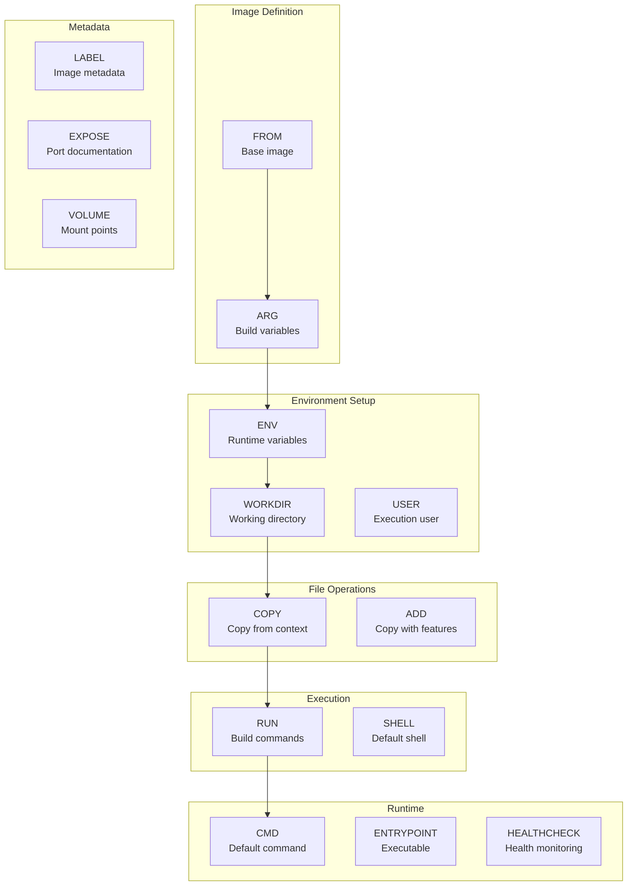
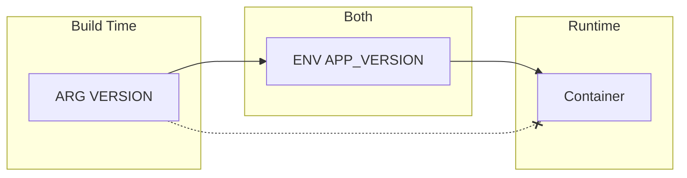
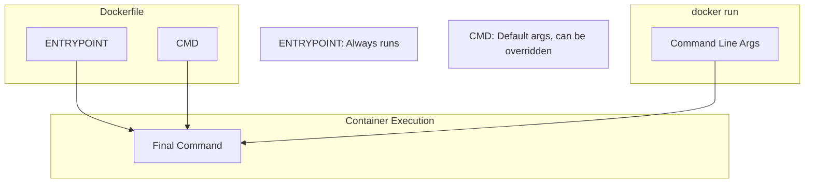
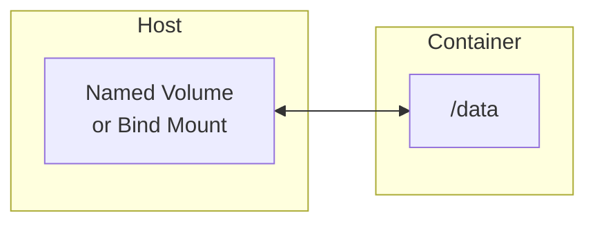

This reference covers all Dockerfile instructions with detailed examples and use cases.

## Build Instructions Flow



## FROM

Sets the base image for subsequent instructions.

<Tabs items={['Basic', 'Multi-stage', 'Scratch']}>
<Tab value="Basic">
```dockerfile
# Official image
FROM ubuntu:22.04

# Alpine variant (smaller)
FROM node:20-alpine

# Specific digest (immutable)
FROM nginx@sha256:abc123...

# Platform specific
FROM --platform=linux/amd64 node:20
```
</Tab>
<Tab value="Multi-stage">
```dockerfile
# Named stage for building
FROM node:20-alpine AS builder
WORKDIR /app
COPY . .
RUN npm run build

# Production stage
FROM nginx:alpine AS production
COPY --from=builder /app/dist /usr/share/nginx/html
```
</Tab>
<Tab value="Scratch">
```dockerfile
# Empty base image (for static binaries)
FROM scratch
COPY myapp /myapp
CMD ["/myapp"]
```
</Tab>
</Tabs>

<Callout type="warn" title="Image Tags">
Always use specific version tags in production. Avoid `latest` as it can change unexpectedly.
</Callout>

## ARG and ENV

<Tabs items={['ARG', 'ENV', 'Combined']}>
<Tab value="ARG">
**ARG** defines build-time variables that can be passed with `--build-arg`.

```dockerfile
# Define with default value
ARG NODE_VERSION=20
ARG APP_VERSION

# Use in instructions
FROM node:${NODE_VERSION}-alpine

# ARG after FROM needs redeclaration
ARG APP_VERSION
RUN echo "Building version ${APP_VERSION}"
```

```bash
# Build with arguments
docker build --build-arg APP_VERSION=1.0.0 -t myapp .
```
</Tab>
<Tab value="ENV">
**ENV** sets environment variables available at runtime.

```dockerfile
# Single variable
ENV NODE_ENV=production

# Multiple variables
ENV NODE_ENV=production \
    PORT=3000 \
    HOST=0.0.0.0

# Use in subsequent instructions
RUN echo "Environment: $NODE_ENV"
```
</Tab>
<Tab value="Combined">
```dockerfile
# ARG for build-time, ENV for runtime
ARG VERSION=latest
ENV APP_VERSION=${VERSION}

# Now APP_VERSION is available at runtime
# VERSION is only available during build
```


</Tab>
</Tabs>

## WORKDIR

Sets the working directory for subsequent instructions.

```dockerfile
# Create and set directory
WORKDIR /app

# Relative paths work too
WORKDIR src
# Now at /app/src

# Multiple WORKDIR instructions
WORKDIR /app
WORKDIR backend
WORKDIR api
# Now at /app/backend/api
```

<Callout type="info" title="Best Practice">
Always use `WORKDIR` instead of `RUN cd`. WORKDIR creates the directory if it doesn't exist.
</Callout>

## COPY and ADD

<Tabs items={['COPY', 'ADD', 'Comparison']}>
<Tab value="COPY">
**COPY** copies files from build context to image.

```dockerfile
# Copy single file
COPY package.json .

# Copy multiple files
COPY package.json package-lock.json ./

# Copy directory
COPY src/ ./src/

# Copy with glob patterns
COPY *.json ./

# Copy from previous stage
COPY --from=builder /app/dist ./dist

# Copy with ownership
COPY --chown=node:node . .
```
</Tab>
<Tab value="ADD">
**ADD** has additional features: URL downloads and tar extraction.

```dockerfile
# Auto-extract tar files
ADD archive.tar.gz /app/

# Download from URL (not recommended)
ADD https://example.com/file.txt /app/

# Same as COPY
ADD src/ ./src/
```

<Callout type="warn" title="Prefer COPY">
Use `COPY` unless you need tar extraction. `ADD` behavior can be unpredictable.
</Callout>
</Tab>
<Tab value="Comparison">
| Feature | COPY | ADD |
|---------|------|-----|
| Copy from context | ✅ | ✅ |
| Copy from stage | ✅ | ❌ |
| Set ownership | ✅ | ✅ |
| Extract tar files | ❌ | ✅ |
| Download URLs | ❌ | ✅ |
| Recommended | ✅ | Only for tar |
</Tab>
</Tabs>

## RUN

Executes commands during image build.

<Tabs items={['Shell Form', 'Exec Form', 'Best Practices']}>
<Tab value="Shell Form">
```dockerfile
# Shell form (runs in /bin/sh -c)
RUN apt-get update && apt-get install -y curl

# Environment variable expansion works
RUN echo "Home is $HOME"

# Pipe support
RUN curl -sL https://example.com | tar xz
```
</Tab>
<Tab value="Exec Form">
```dockerfile
# Exec form (no shell processing)
RUN ["apt-get", "install", "-y", "curl"]

# No variable expansion
RUN ["echo", "$HOME"]  # Prints literal $HOME

# Different shell
RUN ["/bin/bash", "-c", "echo Hello"]
```
</Tab>
<Tab value="Best Practices">
```dockerfile
# ✅ Combine commands to reduce layers
RUN apt-get update && \
    apt-get install -y --no-install-recommends \
        curl \
        wget \
        git && \
    rm -rf /var/lib/apt/lists/*

# ✅ Clean up in the same layer
RUN npm install && \
    npm cache clean --force

# ❌ Don't split update and install
RUN apt-get update
RUN apt-get install -y curl  # May use stale cache
```
</Tab>
</Tabs>

## CMD and ENTRYPOINT



<Tabs items={['CMD', 'ENTRYPOINT', 'Combined']}>
<Tab value="CMD">
```dockerfile
# Exec form (preferred)
CMD ["npm", "start"]

# Shell form
CMD npm start

# As ENTRYPOINT arguments
CMD ["--port", "3000"]
```

```bash
# CMD can be overridden
docker run myapp npm test  # Overrides CMD
```
</Tab>
<Tab value="ENTRYPOINT">
```dockerfile
# Exec form (preferred)
ENTRYPOINT ["node", "server.js"]

# Shell form (not recommended)
ENTRYPOINT node server.js
```

```bash
# ENTRYPOINT is always executed
docker run myapp  # Runs: node server.js
docker run myapp --port 3000  # Runs: node server.js --port 3000
```
</Tab>
<Tab value="Combined">
```dockerfile
# ENTRYPOINT + CMD pattern
ENTRYPOINT ["python", "app.py"]
CMD ["--host", "0.0.0.0"]

# Results in: python app.py --host 0.0.0.0
```

```bash
# Override CMD but keep ENTRYPOINT
docker run myapp --port 8080
# Runs: python app.py --port 8080

# Override ENTRYPOINT
docker run --entrypoint bash myapp
# Runs: bash
```

| Scenario | ENTRYPOINT | CMD | Result |
|----------|------------|-----|--------|
| Default | `["python"]` | `["app.py"]` | `python app.py` |
| Override CMD | `["python"]` | `["test.py"]` (runtime) | `python test.py` |
| Override both | `bash` (runtime) | - | `bash` |
</Tab>
</Tabs>

## USER

Sets the user for RUN, CMD, and ENTRYPOINT.

```dockerfile
# Create non-root user
RUN groupadd -r app && useradd -r -g app app

# Switch to user
USER app

# All subsequent commands run as 'app'
RUN whoami  # Output: app

# Can use UID:GID
USER 1000:1000
```

<Callout type="warn" title="Security">
Always run containers as non-root in production. Root inside container = root on host.
</Callout>

## EXPOSE

Documents which ports the container listens on.

```dockerfile
# Single port
EXPOSE 3000

# Multiple ports
EXPOSE 80 443

# With protocol
EXPOSE 80/tcp
EXPOSE 53/udp
```

<Callout type="info" title="Note">
EXPOSE doesn't publish the port. Use `-p` flag when running: `docker run -p 8080:80 myapp`
</Callout>

## VOLUME

Creates a mount point for external storage.

```dockerfile
# Single volume
VOLUME /data

# Multiple volumes
VOLUME ["/data", "/logs"]
```



## HEALTHCHECK

Defines how to check if the container is healthy.

```dockerfile
# HTTP health check
HEALTHCHECK --interval=30s --timeout=3s --start-period=5s --retries=3 \
    CMD curl -f http://localhost:3000/health || exit 1

# Custom script
HEALTHCHECK CMD /healthcheck.sh

# Disable health check
HEALTHCHECK NONE
```

| Option | Default | Description |
|--------|---------|-------------|
| `--interval` | 30s | Time between checks |
| `--timeout` | 30s | Check timeout |
| `--start-period` | 0s | Grace period on startup |
| `--retries` | 3 | Failures before unhealthy |

## LABEL

Adds metadata to the image.

```dockerfile
LABEL maintainer="dev@example.com"
LABEL version="1.0.0"
LABEL description="My application"

# Multiple labels
LABEL maintainer="dev@example.com" \
      version="1.0.0" \
      org.opencontainers.image.source="https://github.com/user/repo"
```

## SHELL

Changes the default shell.

```dockerfile
# Default: ["/bin/sh", "-c"]
SHELL ["/bin/bash", "-c"]

# Now RUN uses bash
RUN echo "Using bash: $BASH_VERSION"

# PowerShell on Windows
SHELL ["powershell", "-Command"]
```

## STOPSIGNAL

Sets the signal to stop the container.

```dockerfile
# Default is SIGTERM
STOPSIGNAL SIGTERM

# Use SIGINT for graceful shutdown
STOPSIGNAL SIGINT

# Can use signal number
STOPSIGNAL 9
```

## ONBUILD

Triggers instruction when image is used as base.

```dockerfile
# Base image Dockerfile
FROM node:20-alpine
ONBUILD COPY package*.json ./
ONBUILD RUN npm install
ONBUILD COPY . .

# Child image automatically runs ONBUILD instructions
FROM my-base-image
# COPY and RUN are executed automatically
```

<Callout type="warn" title="Use Sparingly">
ONBUILD can make debugging difficult. Document its usage clearly.
</Callout>
