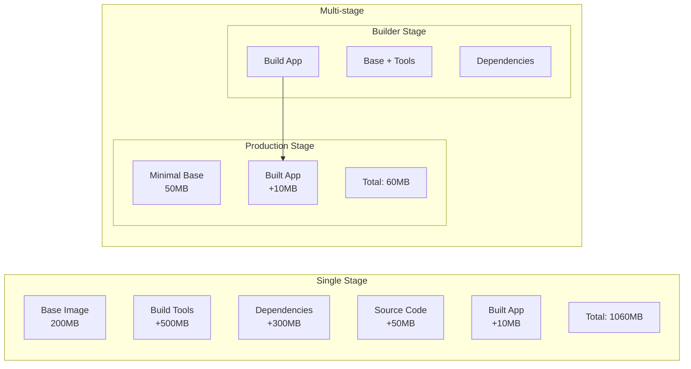
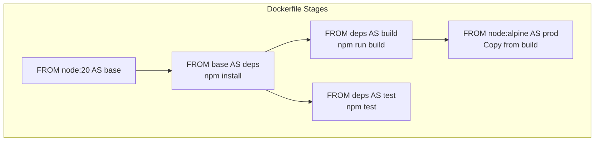

Multi-stage builds allow you to use multiple `FROM` statements in your Dockerfile. Each `FROM` starts a new build stage, and you can selectively copy artifacts from one stage to another, leaving behind everything you don't need.

## Why Multi-stage Builds?



<Callout type="info" title="Benefits">
- **Smaller images**: Only include what's needed at runtime
- **Improved security**: No build tools in production image
- **Faster deployments**: Smaller images transfer faster
- **Better caching**: Build dependencies cached separately
</Callout>

## Basic Multi-stage Example

<Tabs items={['Node.js', 'Go', 'Rust', 'Java']}>
<Tab value="Node.js">
```dockerfile
# Stage 1: Build
FROM node:20-alpine AS builder

WORKDIR /app

# Install dependencies
COPY package*.json ./
RUN npm ci

# Build application
COPY . .
RUN npm run build

# Stage 2: Production
FROM node:20-alpine AS production

WORKDIR /app

# Copy only production dependencies
COPY package*.json ./
RUN npm ci --only=production

# Copy built application from builder
COPY --from=builder /app/dist ./dist

# Create non-root user
RUN addgroup -g 1001 -S nodejs && \
    adduser -S nextjs -u 1001
USER nextjs

EXPOSE 3000
CMD ["node", "dist/server.js"]
```
</Tab>
<Tab value="Go">
```dockerfile
# Stage 1: Build
FROM golang:1.22-alpine AS builder

WORKDIR /app

# Download dependencies
COPY go.mod go.sum ./
RUN go mod download

# Build static binary
COPY . .
RUN CGO_ENABLED=0 GOOS=linux GOARCH=amd64 \
    go build -ldflags="-w -s" -o main .

# Stage 2: Production (scratch = empty image)
FROM scratch AS production

# Copy binary from builder
COPY --from=builder /app/main /main

# Copy CA certificates for HTTPS
COPY --from=builder /etc/ssl/certs/ca-certificates.crt /etc/ssl/certs/

EXPOSE 8080
ENTRYPOINT ["/main"]
```
</Tab>
<Tab value="Rust">
```dockerfile
# Stage 1: Build
FROM rust:1.75 AS builder

WORKDIR /app

# Create dummy project for dependency caching
COPY Cargo.toml Cargo.lock ./
RUN mkdir src && \
    echo "fn main() {}" > src/main.rs && \
    cargo build --release && \
    rm -rf src

# Build actual application
COPY src ./src
RUN touch src/main.rs && cargo build --release

# Stage 2: Production
FROM debian:bookworm-slim AS production

RUN apt-get update && \
    apt-get install -y --no-install-recommends ca-certificates && \
    rm -rf /var/lib/apt/lists/*

COPY --from=builder /app/target/release/myapp /usr/local/bin/

RUN useradd -r -s /bin/false appuser
USER appuser

EXPOSE 8080
CMD ["myapp"]
```
</Tab>
<Tab value="Java">
```dockerfile
# Stage 1: Build
FROM eclipse-temurin:21-jdk AS builder

WORKDIR /app

# Copy Maven wrapper and pom
COPY .mvn/ .mvn/
COPY mvnw pom.xml ./
RUN ./mvnw dependency:go-offline

# Build application
COPY src ./src
RUN ./mvnw package -DskipTests

# Extract layers for better caching
RUN java -Djarmode=layertools -jar target/*.jar extract

# Stage 2: Production
FROM eclipse-temurin:21-jre AS production

WORKDIR /app

# Copy extracted layers
COPY --from=builder /app/dependencies/ ./
COPY --from=builder /app/spring-boot-loader/ ./
COPY --from=builder /app/snapshot-dependencies/ ./
COPY --from=builder /app/application/ ./

RUN useradd -r -s /bin/false spring
USER spring

EXPOSE 8080
ENTRYPOINT ["java", "org.springframework.boot.loader.JarLauncher"]
```
</Tab>
</Tabs>

## Stage Naming and Referencing

```dockerfile
# Named stages
FROM node:20 AS build
FROM node:20 AS test
FROM node:20-alpine AS production

# Copy from named stage
COPY --from=build /app/dist ./dist

# Copy from external image
COPY --from=nginx:alpine /etc/nginx/nginx.conf /etc/nginx/

# Copy from specific stage by index (not recommended)
COPY --from=0 /app/dist ./dist
```

## Build Specific Stages

```bash
# Build only up to a specific stage
docker build --target builder -t myapp:builder .

# Build production stage (default: last stage)
docker build -t myapp:prod .

# Build test stage
docker build --target test -t myapp:test .
```



## Advanced Patterns

### Development vs Production

<Tabs items={['Dockerfile', 'Build Commands']}>
<Tab value="Dockerfile">
```dockerfile
# Base stage with common setup
FROM node:20-alpine AS base
WORKDIR /app
COPY package*.json ./

# Development stage
FROM base AS development
RUN npm install
COPY . .
CMD ["npm", "run", "dev"]

# Build stage
FROM base AS builder
RUN npm ci
COPY . .
RUN npm run build

# Production stage
FROM node:20-alpine AS production
WORKDIR /app
COPY package*.json ./
RUN npm ci --only=production
COPY --from=builder /app/dist ./dist
USER node
CMD ["node", "dist/server.js"]
```
</Tab>
<Tab value="Build Commands">
```bash
# Build for development
docker build --target development -t myapp:dev .

# Build for production
docker build --target production -t myapp:prod .

# Run development with hot reload
docker run -v $(pwd):/app -p 3000:3000 myapp:dev

# Run production
docker run -p 3000:3000 myapp:prod
```
</Tab>
</Tabs>

### Testing Stage

```dockerfile
# Dependencies stage
FROM node:20-alpine AS deps
WORKDIR /app
COPY package*.json ./
RUN npm ci

# Test stage
FROM deps AS test
COPY . .
RUN npm run lint
RUN npm run test

# Build stage (only runs if tests pass)
FROM deps AS builder
COPY . .
RUN npm run build

# Production stage
FROM node:20-alpine AS production
WORKDIR /app
COPY --from=builder /app/dist ./dist
COPY --from=deps /app/node_modules ./node_modules
CMD ["node", "dist/server.js"]
```

### Binary Extraction

```dockerfile
# Build statically linked binary
FROM golang:1.22-alpine AS builder
WORKDIR /app
COPY . .
RUN CGO_ENABLED=0 go build -o myapp .

# Use scratch (empty) image for minimal size
FROM scratch
COPY --from=builder /app/myapp /myapp
ENTRYPOINT ["/myapp"]
```

## Best Practices

<Accordions>
<Accordion title="Order stages from least to most specific">
```dockerfile
# ✅ Good: base → deps → build → test → prod
FROM node:20 AS base
FROM base AS deps
FROM deps AS build
FROM deps AS test  
FROM node:20-alpine AS production
```
</Accordion>
<Accordion title="Use consistent naming conventions">
```dockerfile
# ✅ Good: Clear, descriptive names
FROM node:20 AS builder
FROM node:20 AS tester
FROM node:20-alpine AS production

# ❌ Bad: Unclear names
FROM node:20 AS stage1
FROM node:20 AS stage2
```
</Accordion>
<Accordion title="Copy only what's needed">
```dockerfile
# ✅ Good: Copy specific artifacts
COPY --from=builder /app/dist ./dist
COPY --from=builder /app/package.json ./

# ❌ Bad: Copy everything
COPY --from=builder /app ./
```
</Accordion>
<Accordion title="Use smallest base for final stage">
```dockerfile
# ✅ Good: Alpine or distroless for production
FROM gcr.io/distroless/nodejs20-debian12
FROM node:20-alpine

# ❌ Bad: Full image for production
FROM node:20
```
</Accordion>
</Accordions>

## Image Size Comparison

| Language | Single Stage | Multi-stage | Reduction |
|----------|-------------|-------------|-----------|
| Node.js | ~1.2GB | ~150MB | 87% |
| Go | ~800MB | ~15MB | 98% |
| Rust | ~2GB | ~80MB | 96% |
| Java | ~700MB | ~300MB | 57% |

<Callout type="info" title="Go and Rust">
Go and Rust can compile to static binaries, allowing use of `scratch` (empty) base image for minimal size.
</Callout>

## Debugging Multi-stage Builds

```bash
# Build intermediate stage for debugging
docker build --target builder -t myapp:debug .

# Run shell in intermediate stage
docker run -it myapp:debug sh

# View build output
docker build --progress=plain -t myapp .

# Build with cache information
docker build --cache-from=myapp:builder -t myapp .
```
