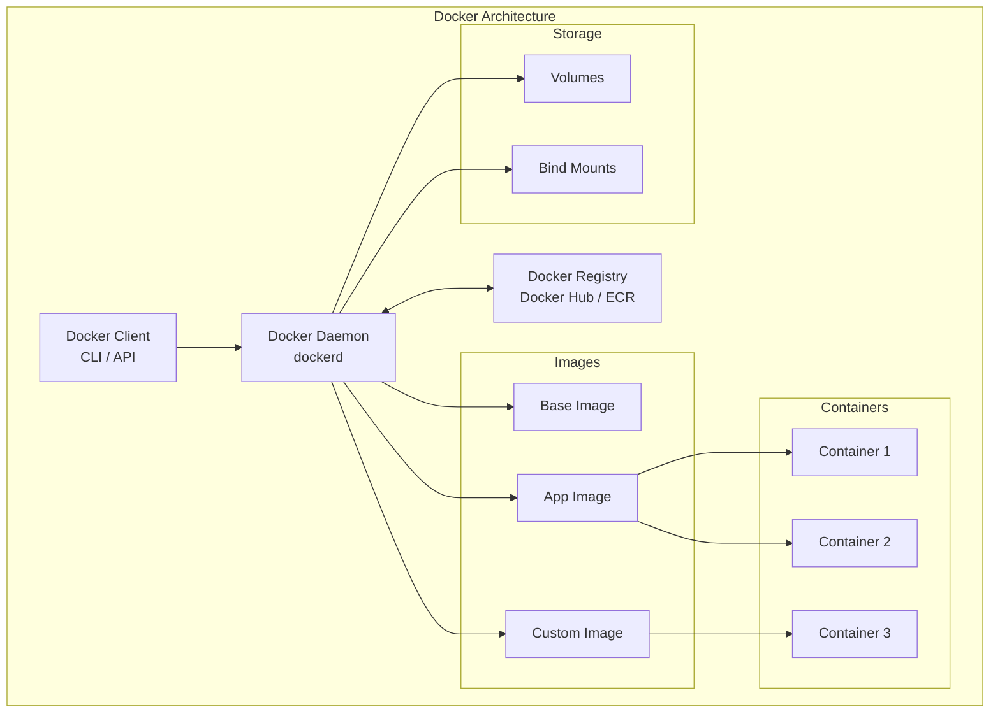
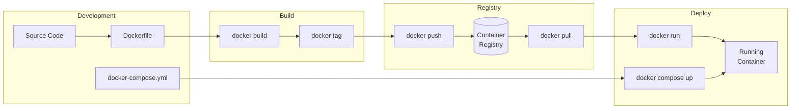
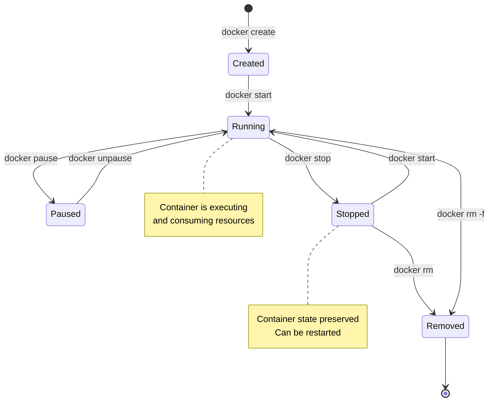

Welcome to the **Docker for Developers** documentation! This comprehensive guide covers everything from creating Dockerfiles to orchestrating multi-container applications with Docker Compose.

## What You'll Learn

This documentation covers:

- **Dockerfile**: Building optimized container images with best practices
- **Docker Compose**: Orchestrating multi-container applications
- **CLI Commands**: Essential Docker commands for daily workflows
- **Networking**: Container communication and network configuration
- **Volumes**: Data persistence and volume management
- **Security**: Best practices for secure container deployments

## Docker Architecture



## Prerequisites

Before diving in, you should have:

1. Docker Desktop or Docker Engine installed
2. Basic command line familiarity
3. Understanding of Linux fundamentals

<Callout type="info" title="Installation">
Install Docker from [docker.com](https://www.docker.com/get-started) or use your package manager.
</Callout>

## Quick Navigation

<Cards>
  <Card title="Dockerfile" href="/docs/docker/dockerfile" description="Build optimized container images" />
  <Card title="Docker Compose" href="/docs/docker/compose" description="Orchestrate multi-container apps" />
  <Card title="CLI Commands" href="/docs/docker/cli" description="Essential Docker commands" />
</Cards>

## Topic Overview

### Dockerfile
Master container image creation:
- **Base Images**: Choosing the right foundation
- **Instructions**: FROM, RUN, COPY, CMD, ENTRYPOINT
- **Multi-stage Builds**: Optimizing image size
- **Layer Caching**: Speeding up builds
- **Best Practices**: Security and optimization

### Docker Compose
Learn multi-container orchestration:
- **Services**: Defining application components
- **Networks**: Container communication
- **Volumes**: Data persistence
- **Environment Variables**: Configuration management
- **Profiles**: Environment-specific setups

### CLI Commands
Essential commands for daily workflows:
- **Container Management**: run, start, stop, rm
- **Image Management**: build, pull, push, tag
- **Inspection**: logs, exec, inspect
- **Cleanup**: prune, system df

## Docker Workflow



## Quick Start

<Steps>
<Step>
### Verify Installation

```bash
# Check Docker version
docker --version

# Check Docker Compose version
docker compose version

# Verify Docker is running
docker info
```
</Step>
<Step>
### Run Your First Container

```bash
# Run a simple container
docker run hello-world

# Run an interactive container
docker run -it ubuntu bash

# Run a web server
docker run -d -p 8080:80 nginx
```
</Step>
<Step>
### Build Your First Image

```dockerfile
# Dockerfile
FROM node:20-alpine
WORKDIR /app
COPY package*.json ./
RUN npm install
COPY . .
EXPOSE 3000
CMD ["npm", "start"]
```

```bash
# Build the image
docker build -t my-app .

# Run the container
docker run -d -p 3000:3000 my-app
```
</Step>
</Steps>

## Container Lifecycle



## Key Concepts

<Tabs items={['Images', 'Containers', 'Volumes', 'Networks']}>
<Tab value="Images">
**Images** are read-only templates used to create containers.

```bash
# List images
docker images

# Pull an image
docker pull nginx:alpine

# Remove an image
docker rmi nginx:alpine

# Build an image
docker build -t my-app:latest .
```

Images are built in layers, with each instruction in a Dockerfile creating a new layer.
</Tab>
<Tab value="Containers">
**Containers** are runnable instances of images.

```bash
# List running containers
docker ps

# List all containers
docker ps -a

# Start a container
docker start container_name

# Stop a container
docker stop container_name

# Remove a container
docker rm container_name
```

Containers are isolated processes that share the host OS kernel.
</Tab>
<Tab value="Volumes">
**Volumes** provide persistent storage for containers.

```bash
# Create a volume
docker volume create my-data

# List volumes
docker volume ls

# Mount a volume
docker run -v my-data:/app/data my-app

# Bind mount
docker run -v $(pwd):/app my-app
```

Volumes persist data even when containers are removed.
</Tab>
<Tab value="Networks">
**Networks** enable container communication.

```bash
# List networks
docker network ls

# Create a network
docker network create my-network

# Connect container to network
docker network connect my-network container_name

# Run container on specific network
docker run --network my-network my-app
```

Docker provides bridge, host, and overlay network drivers.
</Tab>
</Tabs>

## Best Practices Summary

<Callout type="warn" title="Production Considerations">
Always follow these best practices when deploying to production.
</Callout>

| Category | Best Practice |
|----------|---------------|
| **Images** | Use specific tags, not `latest` |
| **Security** | Run as non-root user |
| **Size** | Use multi-stage builds |
| **Caching** | Order Dockerfile instructions wisely |
| **Compose** | Use environment files for secrets |
| **Volumes** | Named volumes for persistent data |
| **Networks** | Custom networks for isolation |
| **Cleanup** | Regular pruning of unused resources |
