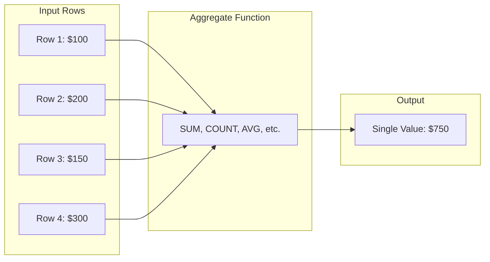
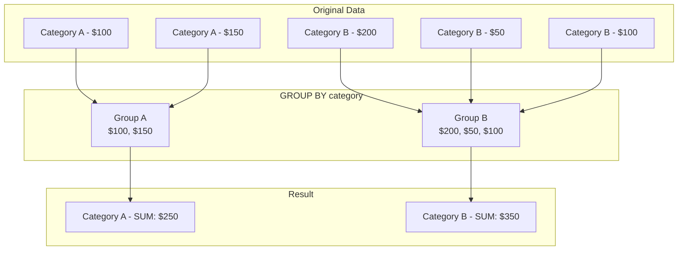
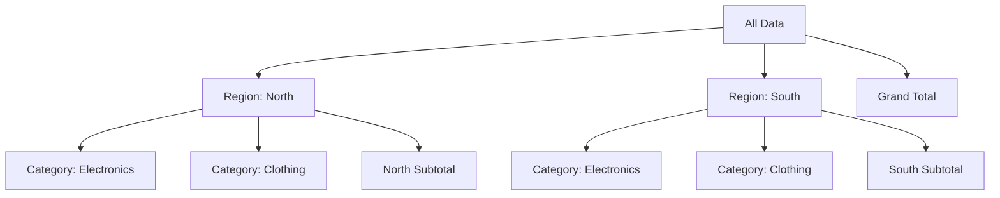

Aggregations transform multiple rows into summary values. They are essential for reporting, analytics, and data analysis.

## How Aggregation Works



## Aggregate Functions

<Tabs items={['COUNT', 'SUM', 'AVG', 'MIN/MAX', 'String Aggregation']}>
<Tab value="COUNT">
```sql
-- Count all rows
SELECT COUNT(*) AS total_orders FROM orders;

-- Count non-NULL values
SELECT COUNT(phone) AS customers_with_phone FROM customers;

-- Count distinct values
SELECT COUNT(DISTINCT category_id) AS unique_categories FROM products;

-- Count with condition
SELECT COUNT(*) FILTER (WHERE status = 'active') AS active_count -- PostgreSQL
FROM users;

SELECT COUNT(CASE WHEN status = 'active' THEN 1 END) AS active_count -- All DBs
FROM users;
```

| Function | Description | NULL Handling |
|----------|-------------|---------------|
| `COUNT(*)` | Count all rows | Includes NULLs |
| `COUNT(column)` | Count non-NULL values | Excludes NULLs |
| `COUNT(DISTINCT column)` | Count unique values | Excludes NULLs |
</Tab>
<Tab value="SUM">
```sql
-- Total of a column
SELECT SUM(total) AS total_revenue FROM orders;

-- Sum with condition
SELECT 
    SUM(total) AS total_revenue,
    SUM(CASE WHEN status = 'completed' THEN total ELSE 0 END) AS completed_revenue
FROM orders;

-- Sum of expression
SELECT SUM(quantity * price) AS total_value FROM order_items;
```

<Callout type="warn" title="NULL in SUM">
SUM ignores NULL values. If all values are NULL, the result is NULL (not 0).
Use `COALESCE(SUM(column), 0)` to default to 0.
</Callout>
</Tab>
<Tab value="AVG">
```sql
-- Average value
SELECT AVG(price) AS avg_price FROM products;

-- Average with precision
SELECT ROUND(AVG(price), 2) AS avg_price FROM products;

-- Weighted average
SELECT 
    SUM(price * quantity) / SUM(quantity) AS weighted_avg_price
FROM order_items;
```

<Callout type="info" title="AVG and Integers">
In some databases, AVG of integers returns an integer. Cast to decimal for precision:
`AVG(CAST(quantity AS DECIMAL))` or `AVG(quantity::DECIMAL)` in PostgreSQL.
</Callout>
</Tab>
<Tab value="MIN/MAX">
```sql
-- Minimum and maximum
SELECT 
    MIN(price) AS cheapest,
    MAX(price) AS most_expensive
FROM products;

-- For dates
SELECT 
    MIN(created_at) AS first_order,
    MAX(created_at) AS last_order
FROM orders;

-- For strings (alphabetical)
SELECT 
    MIN(name) AS first_alphabetically,
    MAX(name) AS last_alphabetically
FROM products;
```
</Tab>
<Tab value="String Aggregation">
```sql
-- PostgreSQL: STRING_AGG
SELECT 
    customer_id,
    STRING_AGG(product_name, ', ') AS products_ordered
FROM order_items
GROUP BY customer_id;

-- MySQL: GROUP_CONCAT
SELECT 
    customer_id,
    GROUP_CONCAT(product_name SEPARATOR ', ') AS products_ordered
FROM order_items
GROUP BY customer_id;

-- SQL Server: STRING_AGG (2017+)
SELECT 
    customer_id,
    STRING_AGG(product_name, ', ') AS products_ordered
FROM order_items
GROUP BY customer_id;

-- With ordering
SELECT 
    customer_id,
    STRING_AGG(product_name, ', ' ORDER BY product_name) AS products_ordered -- PostgreSQL
FROM order_items
GROUP BY customer_id;
```
</Tab>
</Tabs>

## GROUP BY

GROUP BY divides rows into groups and applies aggregate functions to each group.



<Tabs items={['Basic', 'Multiple Columns', 'Expressions', 'With Dates']}>
<Tab value="Basic">
```sql
-- Count orders per customer
SELECT 
    customer_id,
    COUNT(*) AS order_count,
    SUM(total) AS total_spent
FROM orders
GROUP BY customer_id;
```

| customer_id | order_count | total_spent |
|-------------|-------------|-------------|
| 1 | 5 | 1500.00 |
| 2 | 3 | 800.00 |
| 3 | 8 | 2200.00 |
</Tab>
<Tab value="Multiple Columns">
```sql
-- Sales by category and year
SELECT 
    category_id,
    EXTRACT(YEAR FROM created_at) AS year,
    COUNT(*) AS order_count,
    SUM(total) AS revenue
FROM orders o
JOIN order_items oi ON o.id = oi.order_id
GROUP BY category_id, EXTRACT(YEAR FROM created_at)
ORDER BY category_id, year;
```

| category_id | year | order_count | revenue |
|-------------|------|-------------|---------|
| 1 | 2023 | 150 | 45000.00 |
| 1 | 2024 | 200 | 62000.00 |
| 2 | 2023 | 80 | 24000.00 |
| 2 | 2024 | 120 | 38000.00 |
</Tab>
<Tab value="Expressions">
```sql
-- Group by expression
SELECT 
    CASE 
        WHEN price < 100 THEN 'Budget'
        WHEN price < 500 THEN 'Mid-range'
        ELSE 'Premium'
    END AS price_tier,
    COUNT(*) AS product_count,
    ROUND(AVG(price), 2) AS avg_price
FROM products
GROUP BY 
    CASE 
        WHEN price < 100 THEN 'Budget'
        WHEN price < 500 THEN 'Mid-range'
        ELSE 'Premium'
    END;
```
</Tab>
<Tab value="With Dates">
```sql
-- Monthly revenue
SELECT 
    DATE_TRUNC('month', created_at) AS month,  -- PostgreSQL
    -- DATE_FORMAT(created_at, '%Y-%m-01') AS month,  -- MySQL
    COUNT(*) AS order_count,
    SUM(total) AS revenue
FROM orders
GROUP BY DATE_TRUNC('month', created_at)
ORDER BY month;

-- Daily, weekly, monthly options
SELECT 
    DATE_TRUNC('day', created_at) AS day,
    DATE_TRUNC('week', created_at) AS week,
    DATE_TRUNC('month', created_at) AS month,
    COUNT(*)
FROM orders
GROUP BY 
    DATE_TRUNC('day', created_at),
    DATE_TRUNC('week', created_at),
    DATE_TRUNC('month', created_at);
```
</Tab>
</Tabs>

## HAVING vs WHERE


<Tabs items={['Comparison', 'WHERE', 'HAVING', 'Both']}>
<Tab value="Comparison">
| Clause | Purpose | Operates On | Aggregates |
|--------|---------|-------------|------------|
| `WHERE` | Filter rows before grouping | Individual rows | ❌ Cannot use |
| `HAVING` | Filter groups after grouping | Groups | ✅ Can use |

```sql
-- ❌ ERROR: Can't use aggregate in WHERE
SELECT customer_id, COUNT(*)
FROM orders
WHERE COUNT(*) > 5  -- ERROR!
GROUP BY customer_id;

-- ✅ CORRECT: Use HAVING for aggregate conditions
SELECT customer_id, COUNT(*)
FROM orders
GROUP BY customer_id
HAVING COUNT(*) > 5;
```
</Tab>
<Tab value="WHERE">
```sql
-- WHERE filters BEFORE grouping
SELECT 
    customer_id,
    COUNT(*) AS order_count,
    SUM(total) AS total_spent
FROM orders
WHERE status = 'completed'  -- Only count completed orders
GROUP BY customer_id;
```

Filter applied: Only rows with status = 'completed' are included in groups.
</Tab>
<Tab value="HAVING">
```sql
-- HAVING filters AFTER grouping
SELECT 
    customer_id,
    COUNT(*) AS order_count,
    SUM(total) AS total_spent
FROM orders
GROUP BY customer_id
HAVING COUNT(*) >= 5  -- Only show customers with 5+ orders
   AND SUM(total) > 1000;  -- AND spent over $1000
```

Filter applied: Groups (customers) are removed if they don't meet the criteria.
</Tab>
<Tab value="Both">
```sql
-- Use both for complex filtering
SELECT 
    category_id,
    COUNT(*) AS product_count,
    AVG(price) AS avg_price
FROM products
WHERE stock > 0          -- Only in-stock products (row filter)
GROUP BY category_id
HAVING COUNT(*) >= 5     -- Categories with 5+ products (group filter)
   AND AVG(price) > 100  -- And average price over $100
ORDER BY avg_price DESC;
```
</Tab>
</Tabs>

## Advanced Aggregation

### ROLLUP, CUBE, and GROUPING SETS

<Tabs items={['ROLLUP', 'CUBE', 'GROUPING SETS']}>
<Tab value="ROLLUP">
```sql
-- ROLLUP: Hierarchical subtotals
SELECT 
    COALESCE(region, 'ALL REGIONS') AS region,
    COALESCE(category, 'ALL CATEGORIES') AS category,
    SUM(sales) AS total_sales
FROM sales
GROUP BY ROLLUP(region, category);
```

| region | category | total_sales |
|--------|----------|-------------|
| North | Electronics | 10000 |
| North | Clothing | 5000 |
| North | ALL CATEGORIES | 15000 |
| South | Electronics | 8000 |
| South | Clothing | 6000 |
| South | ALL CATEGORIES | 14000 |
| ALL REGIONS | ALL CATEGORIES | 29000 |


</Tab>
<Tab value="CUBE">
```sql
-- CUBE: All possible combinations
SELECT 
    region,
    category,
    SUM(sales) AS total_sales
FROM sales
GROUP BY CUBE(region, category);
```

CUBE produces subtotals for:
- Each region + category combination
- Each region (all categories)
- Each category (all regions)
- Grand total

More combinations than ROLLUP!
</Tab>
<Tab value="GROUPING SETS">
```sql
-- GROUPING SETS: Specific combinations
SELECT 
    region,
    category,
    SUM(sales) AS total_sales
FROM sales
GROUP BY GROUPING SETS (
    (region, category),  -- Combination
    (region),            -- By region only
    (category),          -- By category only
    ()                   -- Grand total
);

-- Equivalent to CUBE(region, category)
```
</Tab>
</Tabs>

### Conditional Aggregation

```sql
-- Count by condition
SELECT 
    COUNT(*) AS total_orders,
    COUNT(*) FILTER (WHERE status = 'pending') AS pending_orders,    -- PostgreSQL
    COUNT(*) FILTER (WHERE status = 'completed') AS completed_orders,
    COUNT(*) FILTER (WHERE status = 'cancelled') AS cancelled_orders
FROM orders;

-- Works in all databases
SELECT 
    COUNT(*) AS total_orders,
    SUM(CASE WHEN status = 'pending' THEN 1 ELSE 0 END) AS pending_orders,
    SUM(CASE WHEN status = 'completed' THEN 1 ELSE 0 END) AS completed_orders,
    SUM(CASE WHEN status = 'cancelled' THEN 1 ELSE 0 END) AS cancelled_orders
FROM orders;

-- Revenue by payment method
SELECT 
    SUM(CASE WHEN payment_method = 'credit' THEN total ELSE 0 END) AS credit_revenue,
    SUM(CASE WHEN payment_method = 'debit' THEN total ELSE 0 END) AS debit_revenue,
    SUM(CASE WHEN payment_method = 'cash' THEN total ELSE 0 END) AS cash_revenue
FROM orders;
```

### Percentages and Ratios

```sql
-- Percentage of total
SELECT 
    category_id,
    SUM(price) AS category_total,
    ROUND(
        SUM(price) * 100.0 / (SELECT SUM(price) FROM products),
        2
    ) AS percentage_of_total
FROM products
GROUP BY category_id;

-- Using window function (more efficient)
SELECT 
    category_id,
    SUM(price) AS category_total,
    ROUND(
        SUM(price) * 100.0 / SUM(SUM(price)) OVER (),
        2
    ) AS percentage_of_total
FROM products
GROUP BY category_id;

-- Status distribution
SELECT 
    status,
    COUNT(*) AS count,
    ROUND(COUNT(*) * 100.0 / SUM(COUNT(*)) OVER (), 2) AS percentage
FROM orders
GROUP BY status;
```

## Common Patterns

<Accordions>
<Accordion title="Top N per Group">
```sql
-- Top 3 products per category by sales
WITH ranked_products AS (
    SELECT 
        p.category_id,
        p.name,
        SUM(oi.quantity) AS total_sold,
        ROW_NUMBER() OVER (
            PARTITION BY p.category_id 
            ORDER BY SUM(oi.quantity) DESC
        ) AS rank
    FROM products p
    JOIN order_items oi ON p.id = oi.product_id
    GROUP BY p.category_id, p.name
)
SELECT * FROM ranked_products WHERE rank <= 3;
```
</Accordion>
<Accordion title="Running Totals">
```sql
-- Running total by date
SELECT 
    DATE(created_at) AS order_date,
    SUM(total) AS daily_total,
    SUM(SUM(total)) OVER (ORDER BY DATE(created_at)) AS running_total
FROM orders
GROUP BY DATE(created_at)
ORDER BY order_date;
```
</Accordion>
<Accordion title="Moving Average">
```sql
-- 7-day moving average
SELECT 
    DATE(created_at) AS order_date,
    SUM(total) AS daily_total,
    AVG(SUM(total)) OVER (
        ORDER BY DATE(created_at)
        ROWS BETWEEN 6 PRECEDING AND CURRENT ROW
    ) AS moving_avg_7d
FROM orders
GROUP BY DATE(created_at)
ORDER BY order_date;
```
</Accordion>
<Accordion title="Year-over-Year Comparison">
```sql
-- YoY comparison
WITH yearly_sales AS (
    SELECT 
        EXTRACT(YEAR FROM created_at) AS year,
        EXTRACT(MONTH FROM created_at) AS month,
        SUM(total) AS revenue
    FROM orders
    GROUP BY 1, 2
)
SELECT 
    y2024.month,
    y2023.revenue AS revenue_2023,
    y2024.revenue AS revenue_2024,
    ROUND(
        (y2024.revenue - y2023.revenue) / y2023.revenue * 100,
        2
    ) AS yoy_growth_pct
FROM yearly_sales y2024
LEFT JOIN yearly_sales y2023 
    ON y2024.month = y2023.month 
    AND y2024.year = 2024 
    AND y2023.year = 2023
WHERE y2024.year = 2024;
```
</Accordion>
</Accordions>

## Best Practices

<Steps>
<Step>
### Include Non-Aggregated Columns in GROUP BY
All columns in SELECT that are not in aggregate functions must be in GROUP BY.

```sql
-- ❌ ERROR: 'name' not in GROUP BY
SELECT customer_id, name, COUNT(*)
FROM orders
GROUP BY customer_id;

-- ✅ CORRECT
SELECT customer_id, name, COUNT(*)
FROM orders
GROUP BY customer_id, name;
```
</Step>
<Step>
### Use HAVING Only for Aggregates
Don't use HAVING for conditions that could go in WHERE.

```sql
-- ❌ Inefficient: Filters after grouping
SELECT category_id, AVG(price)
FROM products
GROUP BY category_id
HAVING category_id = 1;

-- ✅ Efficient: Filters before grouping
SELECT category_id, AVG(price)
FROM products
WHERE category_id = 1
GROUP BY category_id;
```
</Step>
<Step>
### Handle NULL Values Explicitly
Aggregates ignore NULLs, which can lead to unexpected results.

```sql
-- COALESCE for NULL handling
SELECT 
    COALESCE(category_id, 0) AS category_id,
    COUNT(*) AS product_count
FROM products
GROUP BY COALESCE(category_id, 0);
```
</Step>
</Steps>

## Next Steps

<Cards>
  <Card title="Subqueries" href="/docs/sql/fundamentals/subqueries" description="Nested queries and CTEs" />
  <Card title="Window Functions" href="/docs/sql/fundamentals/window-functions" description="Analytics without grouping" />
</Cards>
