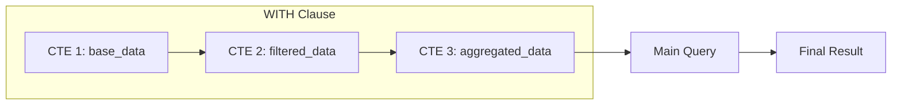
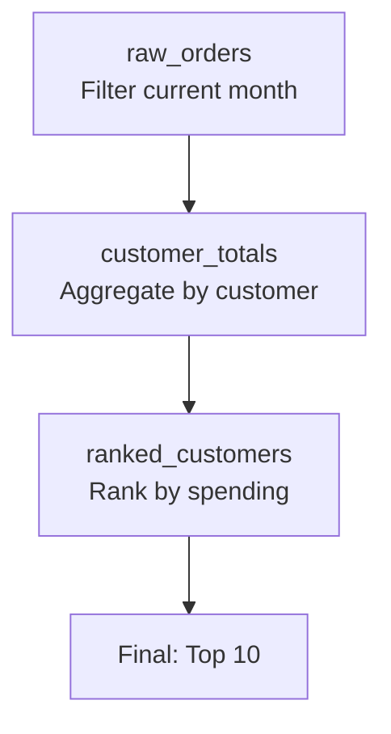
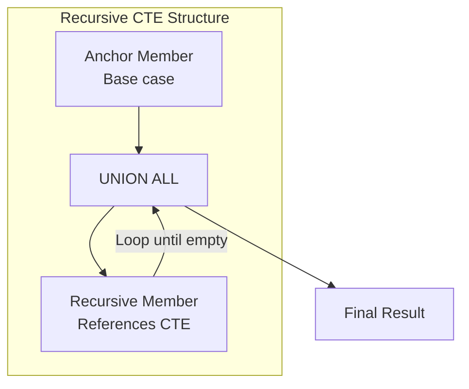
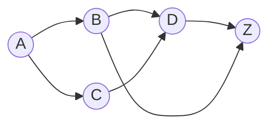

Common Table Expressions (CTEs) are named temporary result sets that exist within the scope of a single query. They make complex queries readable, maintainable, and reusable.

## CTE Structure



## Basic CTE Syntax

<Tabs items={['Single CTE', 'Multiple CTEs', 'Chained CTEs']}>
<Tab value="Single CTE">
```sql
-- Basic CTE structure
WITH cte_name AS (
    -- Query that defines the CTE
    SELECT column1, column2
    FROM some_table
    WHERE condition
)
-- Main query that uses the CTE
SELECT * FROM cte_name;

-- Example: High-value customers
WITH high_value_customers AS (
    SELECT 
        customer_id,
        SUM(total) AS total_spent
    FROM orders
    GROUP BY customer_id
    HAVING SUM(total) > 10000
)
SELECT 
    c.name,
    c.email,
    hvc.total_spent
FROM customers c
JOIN high_value_customers hvc ON c.id = hvc.customer_id
ORDER BY hvc.total_spent DESC;
```
</Tab>
<Tab value="Multiple CTEs">
```sql
-- Multiple CTEs separated by commas
WITH 
    active_users AS (
        SELECT id, name, email
        FROM users
        WHERE status = 'active'
    ),
    user_orders AS (
        SELECT 
            user_id,
            COUNT(*) AS order_count,
            SUM(total) AS total_spent
        FROM orders
        GROUP BY user_id
    ),
    user_products AS (
        SELECT 
            user_id,
            COUNT(DISTINCT product_id) AS unique_products
        FROM order_items
        GROUP BY user_id
    )
SELECT 
    au.name,
    au.email,
    COALESCE(uo.order_count, 0) AS orders,
    COALESCE(uo.total_spent, 0) AS spent,
    COALESCE(up.unique_products, 0) AS products
FROM active_users au
LEFT JOIN user_orders uo ON au.id = uo.user_id
LEFT JOIN user_products up ON au.id = up.user_id;
```
</Tab>
<Tab value="Chained CTEs">
```sql
-- Each CTE can reference previous CTEs
WITH 
    -- Step 1: Get raw data
    raw_orders AS (
        SELECT *
        FROM orders
        WHERE created_at >= DATE_TRUNC('month', CURRENT_DATE)
    ),
    -- Step 2: Aggregate (references raw_orders)
    customer_totals AS (
        SELECT 
            customer_id,
            COUNT(*) AS order_count,
            SUM(total) AS total_spent
        FROM raw_orders
        GROUP BY customer_id
    ),
    -- Step 3: Rank (references customer_totals)
    ranked_customers AS (
        SELECT 
            *,
            RANK() OVER (ORDER BY total_spent DESC) AS spending_rank
        FROM customer_totals
    )
-- Final query uses the last CTE
SELECT * FROM ranked_customers WHERE spending_rank <= 10;
```


</Tab>
</Tabs>

## CTE vs Subquery

<Callout type="info" title="When to Use CTEs">
- Complex queries with multiple levels of logic
- When the same subquery is used multiple times
- For self-documenting code with meaningful names
- When building queries incrementally
</Callout>

```sql
-- ❌ Subquery: Hard to read and understand
SELECT 
    c.name,
    c.email,
    (SELECT COUNT(*) FROM orders o WHERE o.customer_id = c.id) AS order_count,
    (SELECT SUM(total) FROM orders o WHERE o.customer_id = c.id) AS total_spent
FROM customers c
WHERE EXISTS (
    SELECT 1 FROM orders o 
    WHERE o.customer_id = c.id 
    AND o.total > (SELECT AVG(total) FROM orders)
);

-- ✅ CTE: Clear, readable, maintainable
WITH 
    order_stats AS (
        SELECT 
            customer_id,
            COUNT(*) AS order_count,
            SUM(total) AS total_spent
        FROM orders
        GROUP BY customer_id
    ),
    avg_order AS (
        SELECT AVG(total) AS avg_total FROM orders
    ),
    high_value_orders AS (
        SELECT DISTINCT customer_id
        FROM orders, avg_order
        WHERE total > avg_total
    )
SELECT 
    c.name,
    c.email,
    os.order_count,
    os.total_spent
FROM customers c
JOIN order_stats os ON c.id = os.customer_id
WHERE c.id IN (SELECT customer_id FROM high_value_orders);
```

| Aspect | Subquery | CTE |
|--------|----------|-----|
| Readability | Harder with nesting | Named, self-documenting |
| Reusability | Must repeat | Define once, use many times |
| Debugging | Hard to isolate | Easy to test each CTE |
| Performance | Potentially optimized | May materialize (depends on DB) |
| Recursion | Not possible | Supported |

## Recursive CTEs

Recursive CTEs can reference themselves, enabling hierarchical and graph traversals.



<Tabs items={['Syntax', 'Hierarchy', 'Number Series', 'Date Series', 'Graph Traversal']}>
<Tab value="Syntax">
```sql
-- Recursive CTE structure
WITH RECURSIVE cte_name AS (
    -- Anchor member (base case)
    SELECT initial_columns
    FROM initial_table
    WHERE base_condition
    
    UNION ALL
    
    -- Recursive member (references the CTE)
    SELECT derived_columns
    FROM cte_name
    JOIN other_table ON condition
    WHERE termination_condition
)
SELECT * FROM cte_name;
```

<Callout type="warn" title="Preventing Infinite Recursion">
Always include a termination condition in the recursive member.
Most databases have a default recursion limit (e.g., 100 in PostgreSQL).
</Callout>
</Tab>
<Tab value="Hierarchy">
```sql
-- Employee hierarchy (org chart)
WITH RECURSIVE org_chart AS (
    -- Anchor: Top-level managers (no manager)
    SELECT 
        id,
        name,
        manager_id,
        1 AS level,
        ARRAY[name] AS path  -- PostgreSQL array for path
    FROM employees
    WHERE manager_id IS NULL
    
    UNION ALL
    
    -- Recursive: Employees who report to someone in the chart
    SELECT 
        e.id,
        e.name,
        e.manager_id,
        oc.level + 1,
        oc.path || e.name  -- Append to path
    FROM employees e
    JOIN org_chart oc ON e.manager_id = oc.id
)
SELECT 
    id,
    REPEAT('  ', level - 1) || name AS indented_name,
    level,
    array_to_string(path, ' > ') AS reporting_chain
FROM org_chart
ORDER BY path;
```

Output:
```
id | indented_name    | level | reporting_chain
---|------------------|-------|------------------
1  | CEO              | 1     | CEO
2  |   VP Sales       | 2     | CEO > VP Sales
3  |     Sales Rep    | 3     | CEO > VP Sales > Sales Rep
4  |   VP Engineering | 2     | CEO > VP Engineering
5  |     Developer    | 3     | CEO > VP Engineering > Developer
```
</Tab>
<Tab value="Number Series">
```sql
-- Generate numbers 1 to 100
WITH RECURSIVE numbers AS (
    SELECT 1 AS n
    
    UNION ALL
    
    SELECT n + 1
    FROM numbers
    WHERE n < 100
)
SELECT * FROM numbers;

-- Fibonacci sequence
WITH RECURSIVE fibonacci AS (
    SELECT 1 AS n, 1 AS fib, 1 AS prev_fib
    
    UNION ALL
    
    SELECT 
        n + 1,
        fib + prev_fib,
        fib
    FROM fibonacci
    WHERE n < 20
)
SELECT n, fib FROM fibonacci;
```
</Tab>
<Tab value="Date Series">
```sql
-- Generate dates for a month
WITH RECURSIVE dates AS (
    SELECT DATE '2024-01-01' AS date
    
    UNION ALL
    
    SELECT date + INTERVAL '1 day'
    FROM dates
    WHERE date < DATE '2024-01-31'
)
SELECT date FROM dates;

-- Date series with business days only
WITH RECURSIVE business_dates AS (
    SELECT DATE '2024-01-01' AS date
    
    UNION ALL
    
    SELECT date + INTERVAL '1 day'
    FROM business_dates
    WHERE date < DATE '2024-01-31'
)
SELECT date
FROM business_dates
WHERE EXTRACT(DOW FROM date) NOT IN (0, 6);  -- Exclude weekends
```
</Tab>
<Tab value="Graph Traversal">
```sql
-- Find all paths from node A to node B
WITH RECURSIVE paths AS (
    -- Start from source node
    SELECT 
        from_node,
        to_node,
        ARRAY[from_node, to_node] AS path,
        edge_weight AS total_weight
    FROM edges
    WHERE from_node = 'A'
    
    UNION ALL
    
    -- Extend paths
    SELECT 
        p.from_node,
        e.to_node,
        p.path || e.to_node,
        p.total_weight + e.edge_weight
    FROM paths p
    JOIN edges e ON p.to_node = e.from_node
    WHERE NOT e.to_node = ANY(p.path)  -- Prevent cycles
)
SELECT 
    array_to_string(path, ' -> ') AS route,
    total_weight
FROM paths
WHERE to_node = 'Z'
ORDER BY total_weight;
```


</Tab>
</Tabs>

## Materialized CTEs

<Tabs items={['PostgreSQL', 'SQL Server', 'Best Practices']}>
<Tab value="PostgreSQL">
```sql
-- Force materialization (PostgreSQL 12+)
WITH customer_stats AS MATERIALIZED (
    SELECT 
        customer_id,
        COUNT(*) AS orders,
        SUM(total) AS spent
    FROM orders
    GROUP BY customer_id
)
SELECT * FROM customer_stats WHERE orders > 5
UNION ALL
SELECT * FROM customer_stats WHERE spent > 1000;

-- Prevent materialization (inline the CTE)
WITH customer_stats AS NOT MATERIALIZED (
    SELECT 
        customer_id,
        COUNT(*) AS orders,
        SUM(total) AS spent
    FROM orders
    GROUP BY customer_id
)
SELECT * FROM customer_stats WHERE orders > 5;
```
</Tab>
<Tab value="SQL Server">
```sql
-- SQL Server always inlines CTEs (no materialization control)
-- For materialization, use temp tables instead
SELECT 
    customer_id,
    COUNT(*) AS orders,
    SUM(total) AS spent
INTO #customer_stats
FROM orders
GROUP BY customer_id;

SELECT * FROM #customer_stats WHERE orders > 5
UNION ALL
SELECT * FROM #customer_stats WHERE spent > 1000;

DROP TABLE #customer_stats;
```
</Tab>
<Tab value="Best Practices">
**When to materialize:**
- CTE is used multiple times in the query
- CTE has expensive computation
- Query planner makes poor decisions

**When NOT to materialize:**
- CTE is used once
- Filtering can be pushed into CTE
- CTE is simple

```sql
-- ✅ Materialize: Used twice
WITH stats AS MATERIALIZED (
    SELECT category_id, AVG(price) AS avg_price
    FROM products
    GROUP BY category_id
)
SELECT * FROM products p
JOIN stats s ON p.category_id = s.category_id
WHERE p.price > s.avg_price
UNION ALL
SELECT * FROM products p
JOIN stats s ON p.category_id = s.category_id
WHERE p.price < s.avg_price * 0.5;

-- ✅ Inline: Simple filter that should be pushed down
WITH active_users AS NOT MATERIALIZED (
    SELECT * FROM users WHERE status = 'active'
)
SELECT * FROM active_users WHERE created_at > '2024-01-01';
```
</Tab>
</Tabs>

## CTE in Data Modification

<Tabs items={['INSERT with CTE', 'UPDATE with CTE', 'DELETE with CTE', 'UPSERT with CTE']}>
<Tab value="INSERT with CTE">
```sql
-- Insert calculated data
WITH monthly_totals AS (
    SELECT 
        customer_id,
        DATE_TRUNC('month', created_at) AS month,
        SUM(total) AS total
    FROM orders
    GROUP BY customer_id, DATE_TRUNC('month', created_at)
)
INSERT INTO customer_monthly_summary (customer_id, month, total)
SELECT * FROM monthly_totals
ON CONFLICT (customer_id, month) 
DO UPDATE SET total = EXCLUDED.total;
```
</Tab>
<Tab value="UPDATE with CTE">
```sql
-- Update with aggregated data
WITH category_avg AS (
    SELECT 
        category_id,
        AVG(price) AS avg_price
    FROM products
    GROUP BY category_id
)
UPDATE products p
SET is_above_average = (p.price > ca.avg_price)
FROM category_avg ca
WHERE p.category_id = ca.category_id;
```
</Tab>
<Tab value="DELETE with CTE">
```sql
-- Delete duplicates keeping the first
WITH duplicates AS (
    SELECT 
        id,
        ROW_NUMBER() OVER (
            PARTITION BY email 
            ORDER BY created_at
        ) AS rn
    FROM users
)
DELETE FROM users
WHERE id IN (
    SELECT id FROM duplicates WHERE rn > 1
);

-- PostgreSQL: Delete with RETURNING
WITH deleted_orders AS (
    DELETE FROM orders
    WHERE created_at < '2020-01-01'
    RETURNING *
)
INSERT INTO orders_archive
SELECT * FROM deleted_orders;
```
</Tab>
<Tab value="UPSERT with CTE">
```sql
-- PostgreSQL: Complex upsert with CTE
WITH new_data AS (
    SELECT 
        email,
        name,
        NOW() AS updated_at
    FROM staging_users
),
updated AS (
    UPDATE users u
    SET 
        name = nd.name,
        updated_at = nd.updated_at
    FROM new_data nd
    WHERE u.email = nd.email
    RETURNING u.email
)
INSERT INTO users (email, name, created_at, updated_at)
SELECT 
    email,
    name,
    NOW(),
    updated_at
FROM new_data nd
WHERE NOT EXISTS (
    SELECT 1 FROM updated u WHERE u.email = nd.email
);
```
</Tab>
</Tabs>

## Common Patterns

<Accordions>
<Accordion title="Running Totals">
```sql
WITH daily_sales AS (
    SELECT 
        DATE(created_at) AS sale_date,
        SUM(total) AS daily_total
    FROM orders
    GROUP BY DATE(created_at)
)
SELECT 
    sale_date,
    daily_total,
    SUM(daily_total) OVER (ORDER BY sale_date) AS running_total
FROM daily_sales
ORDER BY sale_date;
```
</Accordion>
<Accordion title="Gap and Island Detection">
```sql
-- Find gaps in sequential IDs
WITH id_ranges AS (
    SELECT 
        id,
        LEAD(id) OVER (ORDER BY id) AS next_id
    FROM products
)
SELECT 
    id + 1 AS gap_start,
    next_id - 1 AS gap_end
FROM id_ranges
WHERE next_id - id > 1;
```
</Accordion>
<Accordion title="Data Deduplication">
```sql
WITH ranked_records AS (
    SELECT 
        *,
        ROW_NUMBER() OVER (
            PARTITION BY email 
            ORDER BY created_at DESC
        ) AS rn
    FROM users
)
SELECT *
FROM ranked_records
WHERE rn = 1;
```
</Accordion>
<Accordion title="Pivot Data">
```sql
WITH monthly_data AS (
    SELECT 
        category_id,
        EXTRACT(MONTH FROM created_at) AS month,
        SUM(total) AS total
    FROM orders
    GROUP BY category_id, EXTRACT(MONTH FROM created_at)
)
SELECT 
    category_id,
    SUM(CASE WHEN month = 1 THEN total ELSE 0 END) AS jan,
    SUM(CASE WHEN month = 2 THEN total ELSE 0 END) AS feb,
    SUM(CASE WHEN month = 3 THEN total ELSE 0 END) AS mar
    -- ... more months
FROM monthly_data
GROUP BY category_id;
```
</Accordion>
</Accordions>

## Best Practices

<Steps>
<Step>
### Use Meaningful CTE Names
Name CTEs based on what they represent, not how they're used.

```sql
-- ❌ Poor naming
WITH t1 AS (...), t2 AS (...)

-- ✅ Descriptive naming
WITH active_subscriptions AS (...), monthly_revenue AS (...)
```
</Step>
<Step>
### Keep CTEs Focused
Each CTE should do one thing well.

```sql
-- ❌ Too much in one CTE
WITH everything AS (
    SELECT customer_id, SUM(total), COUNT(*), AVG(total), MAX(total)...
)

-- ✅ Focused CTEs
WITH customer_orders AS (...),
     customer_totals AS (...),
     customer_stats AS (...)
```
</Step>
<Step>
### Consider Execution Plans
Check if CTEs are being materialized when you don't want them to be.

```sql
EXPLAIN ANALYZE
WITH my_cte AS (...)
SELECT * FROM my_cte WHERE condition;
```
</Step>
<Step>
### Use Recursive CTEs for Hierarchies
Don't try to solve hierarchies with self-joins—use recursive CTEs.
</Step>
</Steps>

## Next Steps

<Cards>
  <Card title="Window Functions" href="/docs/sql/fundamentals/window-functions" description="Analytics over result sets" />
  <Card title="Query Optimization" href="/docs/sql/query-optimization" description="Make CTEs perform better" />
</Cards>
