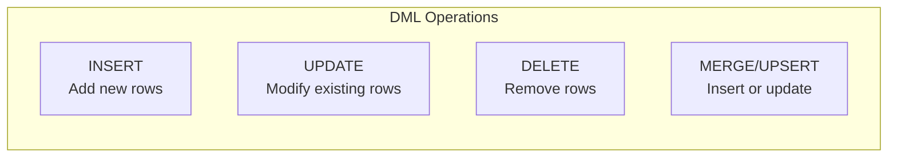

Data modification statements (DML) allow you to add, change, and remove data from database tables.

## Data Modification Overview



## INSERT Statement

<Tabs items={['Basic INSERT', 'Multiple Rows', 'INSERT SELECT', 'RETURNING', 'Default Values']}>
<Tab value="Basic INSERT">
```sql
-- Insert with all columns (order matters)
INSERT INTO products (id, name, price, category_id, created_at)
VALUES (1, 'Widget', 29.99, 5, NOW());

-- Insert specific columns (others get defaults or NULL)
INSERT INTO products (name, price)
VALUES ('Widget', 29.99);

-- Explicit default
INSERT INTO products (name, price, created_at)
VALUES ('Widget', 29.99, DEFAULT);
```

<Callout type="info" title="Always Specify Columns">
Always list column names explicitly. This protects against table schema changes breaking your queries.
</Callout>
</Tab>
<Tab value="Multiple Rows">
```sql
-- Insert multiple rows in one statement
INSERT INTO products (name, price, category_id)
VALUES 
    ('Widget', 29.99, 1),
    ('Gadget', 49.99, 1),
    ('Gizmo', 19.99, 2),
    ('Thingamajig', 99.99, 2);

-- Performance: Much faster than individual INSERTs
-- Single transaction, minimal network round-trips
```
</Tab>
<Tab value="INSERT SELECT">
```sql
-- Insert from another table
INSERT INTO products_archive (id, name, price, archived_at)
SELECT id, name, price, NOW()
FROM products
WHERE discontinued = true;

-- Insert with transformation
INSERT INTO monthly_sales (month, total_revenue, order_count)
SELECT 
    DATE_TRUNC('month', created_at),
    SUM(total),
    COUNT(*)
FROM orders
WHERE created_at >= '2024-01-01'
GROUP BY DATE_TRUNC('month', created_at);

-- Insert from join
INSERT INTO order_summaries (customer_id, customer_name, order_count)
SELECT 
    c.id,
    c.name,
    COUNT(o.id)
FROM customers c
LEFT JOIN orders o ON c.id = o.customer_id
GROUP BY c.id, c.name;
```
</Tab>
<Tab value="RETURNING">
```sql
-- PostgreSQL: Return inserted data
INSERT INTO products (name, price)
VALUES ('New Widget', 39.99)
RETURNING id, name, price, created_at;

-- Return all columns
INSERT INTO products (name, price)
VALUES ('New Widget', 39.99)
RETURNING *;

-- Use returned value in application
INSERT INTO orders (customer_id, total)
VALUES (123, 99.99)
RETURNING id;  -- Get the new order ID

-- SQL Server equivalent
INSERT INTO products (name, price)
OUTPUT INSERTED.id, INSERTED.name
VALUES ('New Widget', 39.99);
```
</Tab>
<Tab value="Default Values">
```sql
-- Use all defaults
INSERT INTO products DEFAULT VALUES;

-- Specific defaults
INSERT INTO products (name, price, status)
VALUES ('Widget', 29.99, DEFAULT);

-- Common default patterns in CREATE TABLE
CREATE TABLE products (
    id SERIAL PRIMARY KEY,
    name VARCHAR(255) NOT NULL,
    price DECIMAL(10,2) NOT NULL,
    status VARCHAR(20) DEFAULT 'draft',
    created_at TIMESTAMP DEFAULT CURRENT_TIMESTAMP,
    updated_at TIMESTAMP DEFAULT CURRENT_TIMESTAMP
);
```
</Tab>
</Tabs>

## UPDATE Statement

<Tabs items={['Basic UPDATE', 'Multiple Columns', 'Conditional', 'FROM Clause', 'RETURNING']}>
<Tab value="Basic UPDATE">
```sql
-- Update specific rows
UPDATE products
SET price = 34.99
WHERE id = 123;

-- Update with expression
UPDATE products
SET price = price * 1.10  -- 10% increase
WHERE category_id = 5;

-- Update to NULL
UPDATE customers
SET phone = NULL
WHERE phone = '';
```

<Callout type="error" title="Always Use WHERE">
Forgetting WHERE updates ALL rows in the table!
```sql
-- ⚠️ DANGEROUS: Updates EVERY product
UPDATE products SET price = 0;

-- ✅ Safe: Updates only matching rows
UPDATE products SET price = 0 WHERE id = 123;
```
</Callout>
</Tab>
<Tab value="Multiple Columns">
```sql
-- Update multiple columns
UPDATE products
SET 
    price = 39.99,
    name = 'Updated Widget',
    updated_at = NOW()
WHERE id = 123;

-- Update from expression
UPDATE orders
SET 
    total = subtotal + tax + shipping,
    updated_at = NOW(),
    status = CASE 
        WHEN total > 1000 THEN 'vip'
        ELSE 'standard'
    END
WHERE status = 'pending';
```
</Tab>
<Tab value="Conditional">
```sql
-- CASE in UPDATE
UPDATE products
SET status = CASE
    WHEN stock = 0 THEN 'out_of_stock'
    WHEN stock < 10 THEN 'low_stock'
    ELSE 'in_stock'
END;

-- Conditional update
UPDATE products
SET 
    price = CASE 
        WHEN category_id = 1 THEN price * 1.10
        WHEN category_id = 2 THEN price * 1.05
        ELSE price
    END,
    updated_at = NOW()
WHERE category_id IN (1, 2);
```
</Tab>
<Tab value="FROM Clause">
```sql
-- PostgreSQL: UPDATE with FROM
UPDATE products p
SET 
    category_name = c.name,
    updated_at = NOW()
FROM categories c
WHERE p.category_id = c.id;

-- Update based on aggregation
UPDATE products p
SET average_rating = stats.avg_rating
FROM (
    SELECT product_id, AVG(rating) AS avg_rating
    FROM reviews
    GROUP BY product_id
) stats
WHERE p.id = stats.product_id;

-- MySQL equivalent
UPDATE products p
JOIN categories c ON p.category_id = c.id
SET p.category_name = c.name;

-- SQL Server
UPDATE p
SET p.category_name = c.name
FROM products p
INNER JOIN categories c ON p.category_id = c.id;
```
</Tab>
<Tab value="RETURNING">
```sql
-- PostgreSQL: Return updated rows
UPDATE products
SET price = price * 1.10
WHERE category_id = 5
RETURNING id, name, price;

-- Get old and new values
UPDATE products
SET price = price * 1.10
WHERE id = 123
RETURNING 
    id,
    name,
    price AS new_price,
    price / 1.10 AS old_price;

-- SQL Server
UPDATE products
SET price = price * 1.10
OUTPUT 
    DELETED.price AS old_price,
    INSERTED.price AS new_price
WHERE category_id = 5;
```
</Tab>
</Tabs>

## DELETE Statement

<Tabs items={['Basic DELETE', 'With Subquery', 'USING/FROM', 'RETURNING', 'Truncate']}>
<Tab value="Basic DELETE">
```sql
-- Delete specific rows
DELETE FROM products
WHERE id = 123;

-- Delete multiple matching rows
DELETE FROM orders
WHERE created_at < '2020-01-01';

-- Delete with multiple conditions
DELETE FROM products
WHERE status = 'discontinued'
  AND stock = 0
  AND last_ordered < '2023-01-01';
```

<Callout type="error" title="Always Use WHERE">
Forgetting WHERE deletes ALL rows!
```sql
-- ⚠️ DANGEROUS: Deletes EVERYTHING
DELETE FROM products;

-- ✅ Safe: Deletes only matching rows
DELETE FROM products WHERE status = 'discontinued';
```
</Callout>
</Tab>
<Tab value="With Subquery">
```sql
-- Delete with subquery
DELETE FROM orders
WHERE customer_id IN (
    SELECT id FROM customers WHERE status = 'deleted'
);

-- Delete with EXISTS
DELETE FROM order_items
WHERE EXISTS (
    SELECT 1 FROM orders
    WHERE orders.id = order_items.order_id
    AND orders.status = 'cancelled'
);

-- Delete with NOT IN (careful with NULLs!)
DELETE FROM products
WHERE category_id NOT IN (
    SELECT id FROM categories WHERE id IS NOT NULL
);
```
</Tab>
<Tab value="USING/FROM">
```sql
-- PostgreSQL: DELETE with USING
DELETE FROM order_items oi
USING orders o
WHERE oi.order_id = o.id
  AND o.status = 'cancelled';

-- MySQL: DELETE with JOIN
DELETE oi
FROM order_items oi
INNER JOIN orders o ON oi.order_id = o.id
WHERE o.status = 'cancelled';

-- SQL Server: DELETE with FROM
DELETE oi
FROM order_items oi
INNER JOIN orders o ON oi.order_id = o.id
WHERE o.status = 'cancelled';
```
</Tab>
<Tab value="RETURNING">
```sql
-- PostgreSQL: Return deleted rows
DELETE FROM products
WHERE discontinued = true
RETURNING *;

-- Archive then delete
WITH deleted AS (
    DELETE FROM orders
    WHERE created_at < '2020-01-01'
    RETURNING *
)
INSERT INTO orders_archive
SELECT * FROM deleted;

-- SQL Server
DELETE FROM products
OUTPUT DELETED.*
WHERE discontinued = true;
```
</Tab>
<Tab value="Truncate">
```sql
-- TRUNCATE: Fast delete of all rows
TRUNCATE TABLE logs;

-- Faster than DELETE because:
-- - No WHERE clause evaluation
-- - No row-by-row deletion
-- - No triggers fired (usually)
-- - No transaction log for each row

-- TRUNCATE with foreign keys (PostgreSQL)
TRUNCATE TABLE orders CASCADE;  -- Also truncates referencing tables

-- Restart identity/sequence
TRUNCATE TABLE orders RESTART IDENTITY;

-- Differences from DELETE:
-- - Cannot use WHERE
-- - Cannot ROLLBACK in some databases
-- - Resets auto-increment
-- - Doesn't fire DELETE triggers
```
</Tab>
</Tabs>

## UPSERT / MERGE

Handle "insert or update" scenarios elegantly.

<Tabs items={['PostgreSQL', 'MySQL', 'SQL Server', 'SQLite']}>
<Tab value="PostgreSQL">
```sql
-- INSERT ... ON CONFLICT (UPSERT)
INSERT INTO products (id, name, price)
VALUES (123, 'Widget', 29.99)
ON CONFLICT (id) DO UPDATE SET
    name = EXCLUDED.name,
    price = EXCLUDED.price,
    updated_at = NOW();

-- Do nothing on conflict
INSERT INTO products (id, name, price)
VALUES (123, 'Widget', 29.99)
ON CONFLICT (id) DO NOTHING;

-- Conflict on unique constraint
INSERT INTO users (email, name)
VALUES ('user@example.com', 'John')
ON CONFLICT ON CONSTRAINT users_email_unique DO UPDATE SET
    name = EXCLUDED.name;

-- Conditional update
INSERT INTO products (id, name, price)
VALUES (123, 'Widget', 29.99)
ON CONFLICT (id) DO UPDATE SET
    price = EXCLUDED.price
WHERE products.price < EXCLUDED.price;  -- Only if new price is higher
```
</Tab>
<Tab value="MySQL">
```sql
-- INSERT ... ON DUPLICATE KEY UPDATE
INSERT INTO products (id, name, price)
VALUES (123, 'Widget', 29.99)
ON DUPLICATE KEY UPDATE
    name = VALUES(name),
    price = VALUES(price),
    updated_at = NOW();

-- Multiple rows
INSERT INTO products (id, name, price)
VALUES 
    (1, 'Widget', 29.99),
    (2, 'Gadget', 49.99)
ON DUPLICATE KEY UPDATE
    name = VALUES(name),
    price = VALUES(price);

-- REPLACE INTO (deletes then inserts)
REPLACE INTO products (id, name, price)
VALUES (123, 'Widget', 29.99);
-- ⚠️ Caution: This deletes and reinserts, which may:
--   - Change auto-increment IDs
--   - Fire DELETE + INSERT triggers
--   - Affect foreign key relationships
```
</Tab>
<Tab value="SQL Server">
```sql
-- MERGE statement
MERGE INTO products AS target
USING (
    SELECT 123 AS id, 'Widget' AS name, 29.99 AS price
) AS source
ON target.id = source.id
WHEN MATCHED THEN
    UPDATE SET
        name = source.name,
        price = source.price,
        updated_at = GETDATE()
WHEN NOT MATCHED THEN
    INSERT (id, name, price, created_at)
    VALUES (source.id, source.name, source.price, GETDATE());

-- MERGE with DELETE
MERGE INTO products AS target
USING staging_products AS source
ON target.id = source.id
WHEN MATCHED AND source.deleted = 1 THEN
    DELETE
WHEN MATCHED THEN
    UPDATE SET name = source.name, price = source.price
WHEN NOT MATCHED THEN
    INSERT (id, name, price) 
    VALUES (source.id, source.name, source.price);
```
</Tab>
<Tab value="SQLite">
```sql
-- INSERT OR REPLACE
INSERT OR REPLACE INTO products (id, name, price)
VALUES (123, 'Widget', 29.99);

-- INSERT OR IGNORE
INSERT OR IGNORE INTO products (id, name, price)
VALUES (123, 'Widget', 29.99);

-- UPSERT (SQLite 3.24+)
INSERT INTO products (id, name, price)
VALUES (123, 'Widget', 29.99)
ON CONFLICT(id) DO UPDATE SET
    name = excluded.name,
    price = excluded.price;
```
</Tab>
</Tabs>

## Bulk Operations

<Accordions>
<Accordion title="Bulk INSERT Performance">
```sql
-- ❌ Slow: Individual inserts
INSERT INTO products (name, price) VALUES ('A', 10);
INSERT INTO products (name, price) VALUES ('B', 20);
INSERT INTO products (name, price) VALUES ('C', 30);

-- ✅ Fast: Multi-row insert
INSERT INTO products (name, price)
VALUES ('A', 10), ('B', 20), ('C', 30);

-- ✅ Fast: INSERT SELECT for large datasets
INSERT INTO products_backup
SELECT * FROM products;

-- PostgreSQL: COPY for massive imports
COPY products (name, price, category_id)
FROM '/path/to/data.csv'
WITH (FORMAT csv, HEADER true);

-- Disable indexes before bulk load, rebuild after
ALTER TABLE products DISABLE TRIGGER ALL;
-- ... bulk insert ...
ALTER TABLE products ENABLE TRIGGER ALL;
REINDEX TABLE products;
```
</Accordion>
<Accordion title="Bulk UPDATE Performance">
```sql
-- ❌ Slow: Row-by-row updates
UPDATE products SET price = 10 WHERE id = 1;
UPDATE products SET price = 20 WHERE id = 2;
UPDATE products SET price = 30 WHERE id = 3;

-- ✅ Faster: Single UPDATE with CASE
UPDATE products
SET price = CASE id
    WHEN 1 THEN 10
    WHEN 2 THEN 20
    WHEN 3 THEN 30
END
WHERE id IN (1, 2, 3);

-- ✅ Best: UPDATE FROM staging table
CREATE TEMP TABLE price_updates (
    product_id INT PRIMARY KEY,
    new_price DECIMAL(10,2)
);

INSERT INTO price_updates VALUES (1, 10), (2, 20), (3, 30);

UPDATE products p
SET price = pu.new_price
FROM price_updates pu
WHERE p.id = pu.product_id;
```
</Accordion>
<Accordion title="Batch DELETE">
```sql
-- Delete in batches to avoid lock contention
-- PostgreSQL example
DO $$
DECLARE
    rows_deleted INT;
BEGIN
    LOOP
        DELETE FROM logs
        WHERE id IN (
            SELECT id FROM logs
            WHERE created_at < '2023-01-01'
            LIMIT 10000
        );
        
        GET DIAGNOSTICS rows_deleted = ROW_COUNT;
        
        IF rows_deleted = 0 THEN
            EXIT;
        END IF;
        
        COMMIT;  -- Release locks periodically
    END LOOP;
END $$;
```
</Accordion>
</Accordions>

## Safe Data Modification

<Steps>
<Step>
### Use Transactions
Wrap modifications in transactions for rollback capability.

```sql
BEGIN;

UPDATE accounts SET balance = balance - 100 WHERE id = 1;
UPDATE accounts SET balance = balance + 100 WHERE id = 2;

-- Verify before committing
SELECT * FROM accounts WHERE id IN (1, 2);

COMMIT;  -- or ROLLBACK if something looks wrong
```
</Step>
<Step>
### Test with SELECT First
Preview what will be affected before modifying.

```sql
-- Before DELETE
SELECT * FROM orders
WHERE created_at < '2020-01-01';
-- Review results, then:
DELETE FROM orders
WHERE created_at < '2020-01-01';

-- Before UPDATE
SELECT id, price, price * 1.1 AS new_price
FROM products
WHERE category_id = 5;
-- Review, then:
UPDATE products SET price = price * 1.1 WHERE category_id = 5;
```
</Step>
<Step>
### Use RETURNING/OUTPUT
Verify what was actually modified.

```sql
DELETE FROM products
WHERE discontinued = true
RETURNING id, name;  -- See exactly what was deleted
```
</Step>
<Step>
### Backup Critical Data
Archive before destructive operations.

```sql
-- Backup first
CREATE TABLE products_backup_20240101 AS
SELECT * FROM products;

-- Then modify
DELETE FROM products WHERE ...;
```
</Step>
</Steps>

## Best Practices

<Callout type="warn" title="Data Modification Safety">
1. **Always use WHERE** with UPDATE and DELETE
2. **Use transactions** for multi-statement operations
3. **Test queries with SELECT first** before modifying
4. **Back up data** before bulk operations
5. **Use RETURNING** to verify changes
6. **Consider foreign key impacts** (ON DELETE CASCADE)
</Callout>

```sql
-- Safe delete pattern
BEGIN;

-- Check what will be deleted
SELECT COUNT(*), MIN(created_at), MAX(created_at)
FROM orders
WHERE created_at < '2020-01-01';

-- Archive first
INSERT INTO orders_archive
SELECT * FROM orders
WHERE created_at < '2020-01-01';

-- Delete and verify
DELETE FROM orders
WHERE created_at < '2020-01-01'
RETURNING id;

-- Confirm or rollback
COMMIT;  -- or ROLLBACK;
```

## Next Steps

<Cards>
  <Card title="Transactions" href="/docs/sql/transactions" description="ACID properties and isolation levels" />
  <Card title="Database Design" href="/docs/sql/database-design" description="Schema design best practices" />
</Cards>
