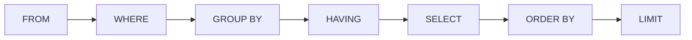
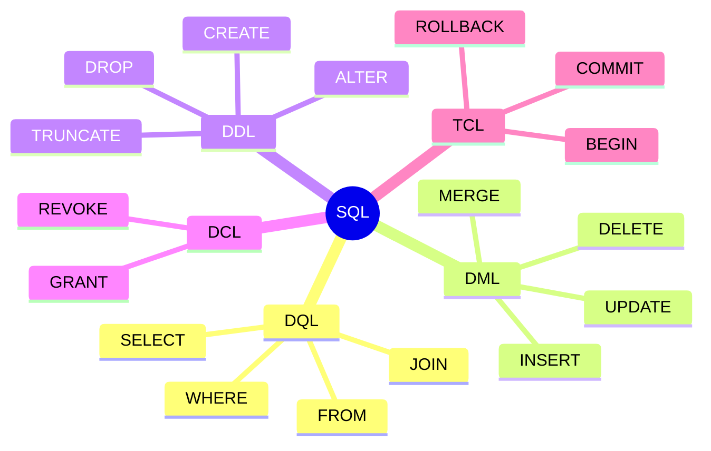
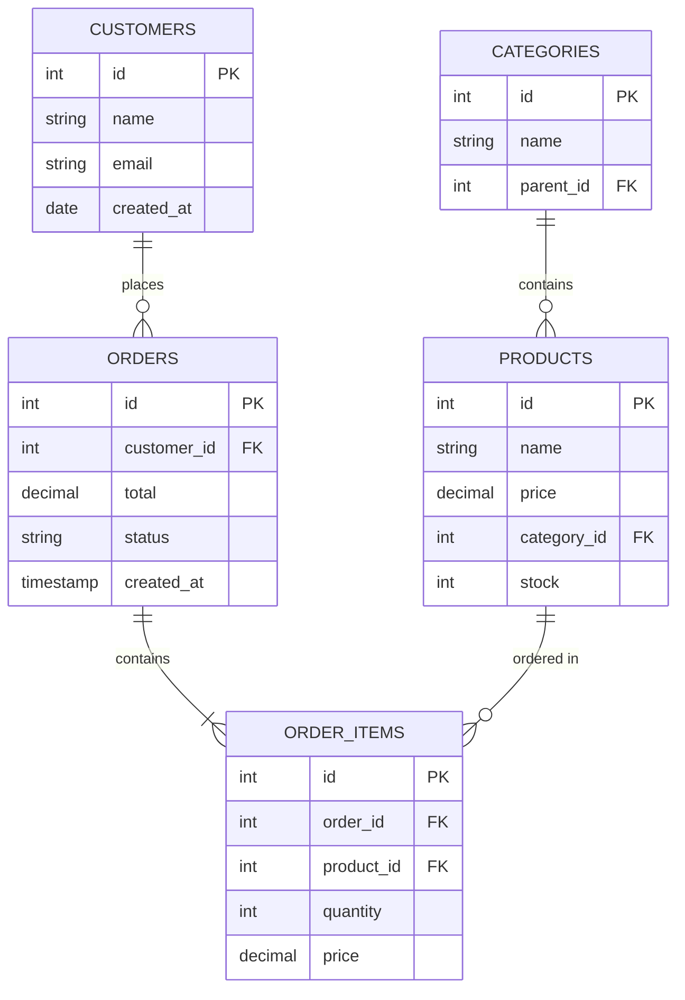

SQL (Structured Query Language) is the standard language for managing and manipulating relational databases. This section covers the foundational concepts that apply across all major database platforms.

<Callout type="info" title="Cross-Platform">
The SQL fundamentals covered here work across PostgreSQL, MySQL, and SQL Server with minimal syntax differences.
</Callout>

## How SQL Queries Work

When you execute a SQL query, the database follows a specific order of operations—different from how you write the query:



Understanding this execution order helps you write better queries and debug issues:

| Order | Clause | Purpose |
|-------|--------|---------|
| 1 | `FROM` / `JOIN` | Identify tables and combine rows |
| 2 | `WHERE` | Filter rows before grouping |
| 3 | `GROUP BY` | Group rows for aggregation |
| 4 | `HAVING` | Filter groups after aggregation |
| 5 | `SELECT` | Choose columns and compute expressions |
| 6 | `DISTINCT` | Remove duplicate rows |
| 7 | `ORDER BY` | Sort the result set |
| 8 | `LIMIT` / `OFFSET` | Restrict returned rows |

<Callout type="warn" title="Common Mistake">
You cannot use column aliases from SELECT in WHERE because WHERE is evaluated before SELECT.
</Callout>

## Quick Navigation

<Cards>
  <Card title="SELECT Statements" href="/docs/sql/fundamentals/select" description="Data retrieval, filtering, and sorting" />
  <Card title="JOINs" href="/docs/sql/fundamentals/joins" description="Combining data from multiple tables" />
  <Card title="Aggregations" href="/docs/sql/fundamentals/aggregations" description="GROUP BY, HAVING, and aggregate functions" />
  <Card title="Subqueries" href="/docs/sql/fundamentals/subqueries" description="Nested queries and CTEs" />
  <Card title="CTEs" href="/docs/sql/fundamentals/ctes" description="Common Table Expressions and recursive queries" />
  <Card title="Window Functions" href="/docs/sql/fundamentals/window-functions" description="Analytics and ranking functions" />
  <Card title="Data Modification" href="/docs/sql/fundamentals/data-modification" description="INSERT, UPDATE, DELETE, UPSERT operations" />
</Cards>

## SQL Statement Categories



<Tabs items={['DQL', 'DML', 'DDL', 'DCL']}>
<Tab value="DQL">
**Data Query Language** - Retrieve data from the database

```sql
SELECT column1, column2
FROM table_name
WHERE condition
ORDER BY column1;
```

DQL is the most commonly used category. The `SELECT` statement and all its clauses fall under DQL.
</Tab>
<Tab value="DML">
**Data Manipulation Language** - Modify data in tables

```sql
-- Insert new data
INSERT INTO users (name, email) VALUES ('John', 'john@example.com');

-- Update existing data
UPDATE users SET status = 'active' WHERE id = 1;

-- Delete data
DELETE FROM users WHERE status = 'inactive';
```
</Tab>
<Tab value="DDL">
**Data Definition Language** - Define database structure

```sql
-- Create table
CREATE TABLE users (
    id SERIAL PRIMARY KEY,
    name VARCHAR(100)
);

-- Modify table
ALTER TABLE users ADD COLUMN email VARCHAR(255);

-- Remove table
DROP TABLE users;
```
</Tab>
<Tab value="DCL">
**Data Control Language** - Control access permissions

```sql
-- Grant permissions
GRANT SELECT, INSERT ON users TO app_user;

-- Revoke permissions
REVOKE DELETE ON users FROM app_user;
```
</Tab>
</Tabs>

## Sample Database Schema

Throughout this documentation, we'll use this sample e-commerce schema:



<Accordions>
<Accordion title="Create Sample Tables">
```sql
-- Create tables
CREATE TABLE categories (
    id SERIAL PRIMARY KEY,
    name VARCHAR(100) NOT NULL,
    parent_id INTEGER REFERENCES categories(id)
);

CREATE TABLE products (
    id SERIAL PRIMARY KEY,
    name VARCHAR(255) NOT NULL,
    price DECIMAL(10, 2) NOT NULL,
    category_id INTEGER REFERENCES categories(id),
    stock INTEGER DEFAULT 0,
    created_at TIMESTAMP DEFAULT CURRENT_TIMESTAMP
);

CREATE TABLE customers (
    id SERIAL PRIMARY KEY,
    name VARCHAR(100) NOT NULL,
    email VARCHAR(255) UNIQUE NOT NULL,
    created_at TIMESTAMP DEFAULT CURRENT_TIMESTAMP
);

CREATE TABLE orders (
    id SERIAL PRIMARY KEY,
    customer_id INTEGER NOT NULL REFERENCES customers(id),
    total DECIMAL(10, 2) DEFAULT 0,
    status VARCHAR(20) DEFAULT 'pending',
    created_at TIMESTAMP DEFAULT CURRENT_TIMESTAMP
);

CREATE TABLE order_items (
    id SERIAL PRIMARY KEY,
    order_id INTEGER NOT NULL REFERENCES orders(id) ON DELETE CASCADE,
    product_id INTEGER NOT NULL REFERENCES products(id),
    quantity INTEGER NOT NULL CHECK (quantity > 0),
    price DECIMAL(10, 2) NOT NULL
);
```
</Accordion>
<Accordion title="Insert Sample Data">
```sql
-- Categories
INSERT INTO categories (name, parent_id) VALUES
    ('Electronics', NULL),
    ('Computers', 1),
    ('Phones', 1),
    ('Clothing', NULL);

-- Products
INSERT INTO products (name, price, category_id, stock) VALUES
    ('MacBook Pro', 2499.99, 2, 50),
    ('iPhone 15', 999.99, 3, 200),
    ('Samsung Galaxy', 899.99, 3, 150),
    ('Dell XPS', 1799.99, 2, 75),
    ('T-Shirt', 29.99, 4, 500);

-- Customers
INSERT INTO customers (name, email) VALUES
    ('John Doe', 'john@example.com'),
    ('Jane Smith', 'jane@example.com'),
    ('Bob Wilson', 'bob@example.com');

-- Orders
INSERT INTO orders (customer_id, total, status) VALUES
    (1, 2499.99, 'shipped'),
    (1, 999.99, 'delivered'),
    (2, 1899.98, 'pending'),
    (3, 29.99, 'processing');

-- Order Items
INSERT INTO order_items (order_id, product_id, quantity, price) VALUES
    (1, 1, 1, 2499.99),
    (2, 2, 1, 999.99),
    (3, 2, 1, 999.99),
    (3, 3, 1, 899.99),
    (4, 5, 1, 29.99);
```
</Accordion>
</Accordions>

## Learning Path

<Steps>
<Step>
### Start with SELECT
Learn how to retrieve data from single tables with filtering, sorting, and limiting results.

[Go to SELECT Statements →](/docs/sql/fundamentals/select)
</Step>
<Step>
### Master JOINs
Combine data from multiple tables using different JOIN types.

[Go to JOINs →](/docs/sql/fundamentals/joins)
</Step>
<Step>
### Aggregate Data
Use GROUP BY and aggregate functions to summarize data.

[Go to Aggregations →](/docs/sql/fundamentals/aggregations)
</Step>
<Step>
### Write Subqueries
Nest queries within queries for complex data retrieval.

[Go to Subqueries →](/docs/sql/fundamentals/subqueries)
</Step>
<Step>
### Use Window Functions
Perform calculations across related rows without grouping.

[Go to Window Functions →](/docs/sql/fundamentals/window-functions)
</Step>
</Steps>

## Quick Reference

### Basic SELECT Template

```sql
SELECT 
    column1,
    column2,
    aggregate_function(column3) AS alias
FROM table1
JOIN table2 ON table1.id = table2.foreign_id
WHERE condition
GROUP BY column1, column2
HAVING aggregate_condition
ORDER BY column1 DESC
LIMIT 10 OFFSET 20;
```

### Common Operators

| Operator | Description | Example |
|----------|-------------|---------|
| `=` | Equal to | `WHERE status = 'active'` |
| `<>` or `!=` | Not equal to | `WHERE status <> 'deleted'` |
| `>`, `<`, `>=`, `<=` | Comparison | `WHERE price > 100` |
| `BETWEEN` | Range (inclusive) | `WHERE price BETWEEN 10 AND 50` |
| `IN` | Match any in list | `WHERE status IN ('a', 'b')` |
| `LIKE` | Pattern matching | `WHERE name LIKE 'John%'` |
| `IS NULL` | Check for NULL | `WHERE phone IS NULL` |
| `AND`, `OR` | Logical operators | `WHERE a = 1 AND b = 2` |
| `NOT` | Negate condition | `WHERE NOT status = 'deleted'` |

### Pattern Matching

| Pattern | Matches |
|---------|---------|
| `%` | Any sequence of characters |
| `_` | Any single character |
| `LIKE 'a%'` | Starts with 'a' |
| `LIKE '%a'` | Ends with 'a' |
| `LIKE '%a%'` | Contains 'a' |
| `LIKE 'a_b'` | 'a' + any char + 'b' |
