JOINs combine rows from two or more tables based on related columns. They are essential for working with normalized databases where data is split across multiple tables.

## How JOINs Work

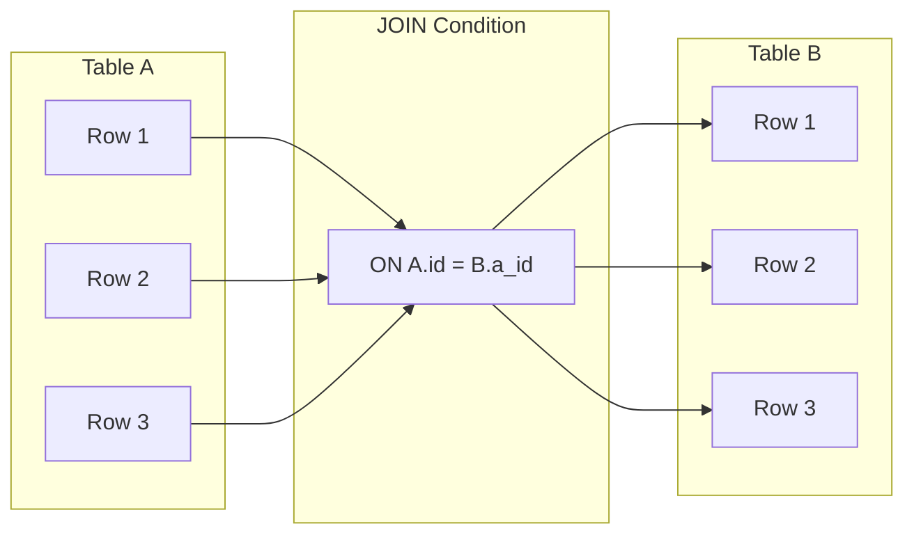

When you JOIN tables:
1. The database takes each row from the first table
2. Finds matching rows in the second table based on the JOIN condition
3. Combines matching rows into result rows

## Types of JOINs

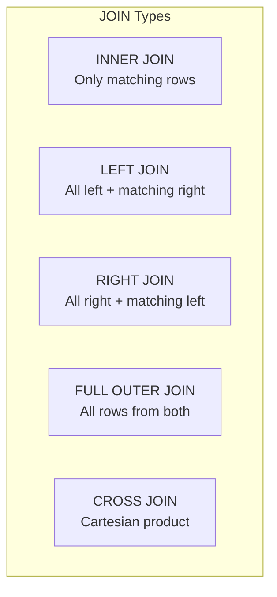

### Visual Comparison

<Tabs items={['INNER', 'LEFT', 'RIGHT', 'FULL OUTER', 'CROSS']}>
<Tab value="INNER">
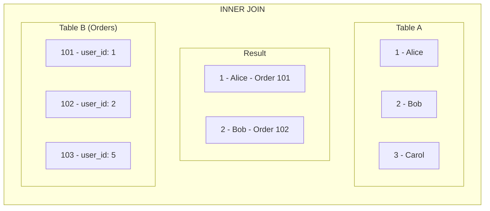

**Only returns rows with matches in BOTH tables.**

Carol (no orders) and Order 103 (user_id: 5 doesn't exist) are excluded.

```sql
SELECT u.name, o.id AS order_id
FROM users u
INNER JOIN orders o ON u.id = o.user_id;
```

| name | order_id |
|------|----------|
| Alice | 101 |
| Bob | 102 |
</Tab>
<Tab value="LEFT">
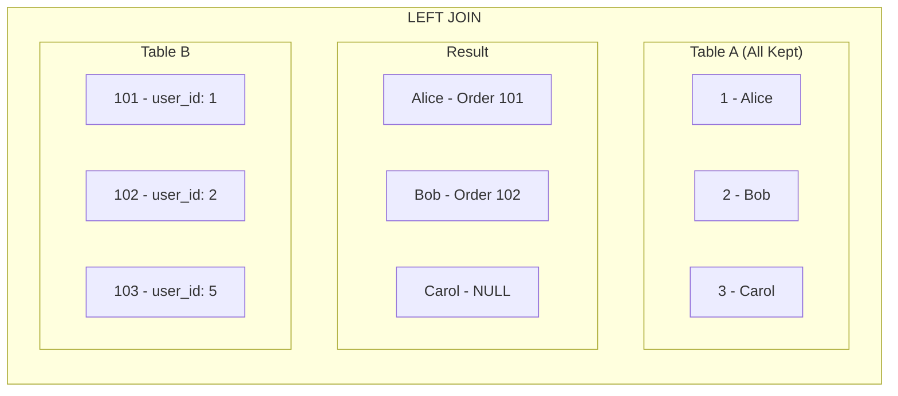

**Returns ALL rows from the LEFT table, with NULLs where no match exists.**

Carol is included with NULL order data.

```sql
SELECT u.name, o.id AS order_id
FROM users u
LEFT JOIN orders o ON u.id = o.user_id;
```

| name | order_id |
|------|----------|
| Alice | 101 |
| Bob | 102 |
| Carol | NULL |
</Tab>
<Tab value="RIGHT">
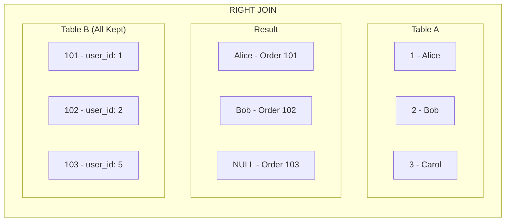

**Returns ALL rows from the RIGHT table, with NULLs where no match exists.**

Order 103 is included with NULL user data.

```sql
SELECT u.name, o.id AS order_id
FROM users u
RIGHT JOIN orders o ON u.id = o.user_id;
```

| name | order_id |
|------|----------|
| Alice | 101 |
| Bob | 102 |
| NULL | 103 |

<Callout type="info">
RIGHT JOIN is rarely used. You can always rewrite it as a LEFT JOIN by swapping table order.
</Callout>
</Tab>
<Tab value="FULL OUTER">
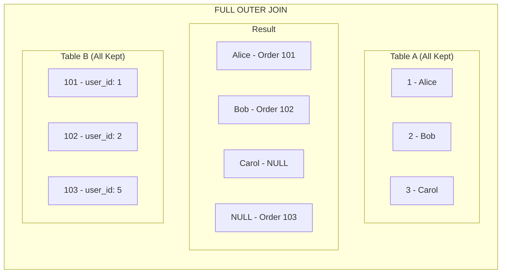

**Returns ALL rows from BOTH tables, with NULLs where no match exists.**

```sql
-- PostgreSQL / SQL Server
SELECT u.name, o.id AS order_id
FROM users u
FULL OUTER JOIN orders o ON u.id = o.user_id;
```

| name | order_id |
|------|----------|
| Alice | 101 |
| Bob | 102 |
| Carol | NULL |
| NULL | 103 |

<Callout type="warn" title="MySQL Note">
MySQL doesn't support FULL OUTER JOIN directly. Use UNION of LEFT and RIGHT JOINs.
</Callout>
</Tab>
<Tab value="CROSS">
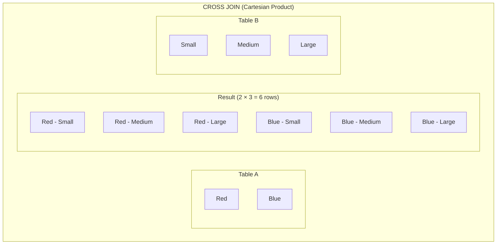

**Returns every combination of rows from both tables.**

```sql
SELECT c.name AS color, s.name AS size
FROM colors c
CROSS JOIN sizes s;
```

| color | size |
|-------|------|
| Red | Small |
| Red | Medium |
| Red | Large |
| Blue | Small |
| Blue | Medium |
| Blue | Large |

<Callout type="warn" title="Performance Warning">
CROSS JOIN produces M × N rows. Be careful with large tables!
</Callout>
</Tab>
</Tabs>

## JOIN Syntax

<Tabs items={['Explicit JOIN', 'Implicit JOIN', 'Multiple JOINs']}>
<Tab value="Explicit JOIN">
```sql
-- Modern, explicit JOIN syntax (recommended)
SELECT 
    c.name AS customer,
    o.id AS order_id,
    o.total
FROM customers c
INNER JOIN orders o ON c.id = o.customer_id;
```
</Tab>
<Tab value="Implicit JOIN">
```sql
-- Old-style implicit JOIN (avoid)
SELECT 
    c.name AS customer,
    o.id AS order_id,
    o.total
FROM customers c, orders o
WHERE c.id = o.customer_id;
```

<Callout type="error" title="Avoid Implicit JOINs">
Implicit JOINs are harder to read and easy to accidentally create a CROSS JOIN by forgetting the WHERE clause.
</Callout>
</Tab>
<Tab value="Multiple JOINs">
```sql
-- Chain multiple JOINs
SELECT 
    c.name AS customer,
    o.id AS order_id,
    p.name AS product,
    oi.quantity,
    oi.price
FROM customers c
INNER JOIN orders o ON c.id = o.customer_id
INNER JOIN order_items oi ON o.id = oi.order_id
INNER JOIN products p ON oi.product_id = p.id
WHERE o.status = 'completed';
```

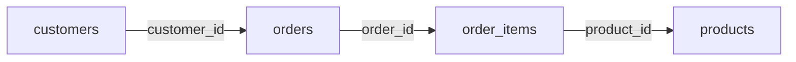
</Tab>
</Tabs>

## Self JOIN

Join a table to itself. Useful for hierarchical data or comparing rows within the same table.

<Tabs items={['Hierarchy', 'Comparisons', 'Pairs']}>
<Tab value="Hierarchy">
```sql
-- Employee hierarchy (manager relationship)
SELECT 
    e.name AS employee,
    m.name AS manager
FROM employees e
LEFT JOIN employees m ON e.manager_id = m.id;
```

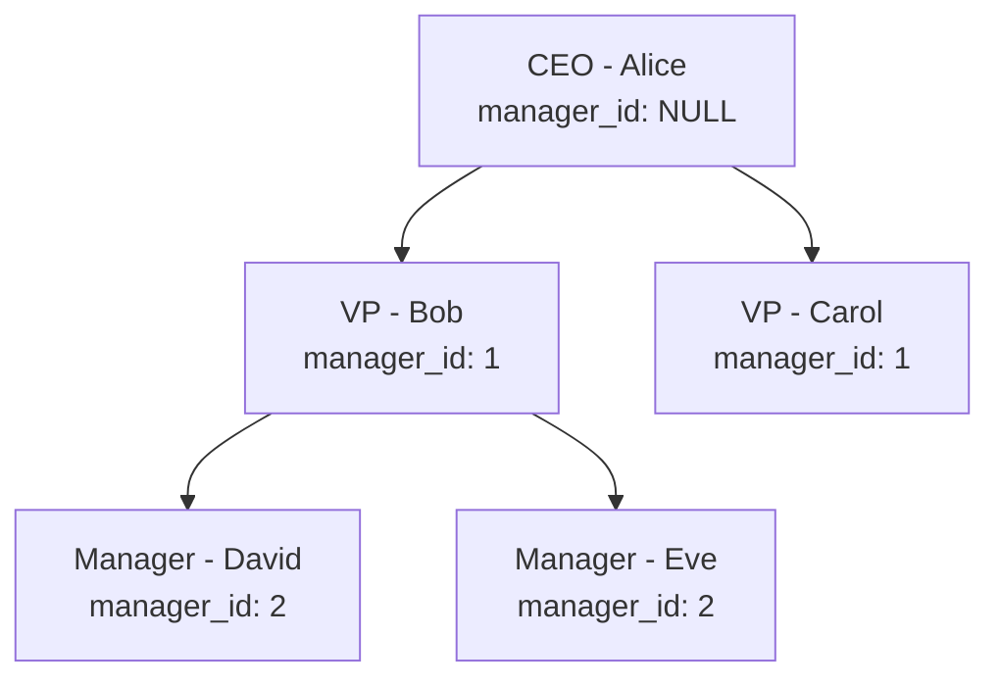

| employee | manager |
|----------|---------|
| Alice | NULL |
| Bob | Alice |
| Carol | Alice |
| David | Bob |
| Eve | Bob |
</Tab>
<Tab value="Comparisons">
```sql
-- Find products in the same category with different prices
SELECT 
    p1.name AS product1,
    p2.name AS product2,
    p1.price AS price1,
    p2.price AS price2,
    p1.category_id
FROM products p1
INNER JOIN products p2 
    ON p1.category_id = p2.category_id 
    AND p1.id < p2.id  -- Avoid duplicates and self-matches
WHERE p1.price <> p2.price;
```
</Tab>
<Tab value="Pairs">
```sql
-- Find all pairs of users in the same city
SELECT 
    u1.name AS user1,
    u2.name AS user2,
    u1.city
FROM users u1
INNER JOIN users u2 
    ON u1.city = u2.city 
    AND u1.id < u2.id;  -- Prevent (A,B) and (B,A) duplicates
```
</Tab>
</Tabs>

## Common Patterns

### Finding Missing Relationships

<Tabs items={['Customers without Orders', 'Products Never Ordered', 'Orphaned Records']}>
<Tab value="Customers without Orders">
```sql
-- LEFT JOIN + NULL check
SELECT c.id, c.name, c.email
FROM customers c
LEFT JOIN orders o ON c.id = o.customer_id
WHERE o.id IS NULL;
```

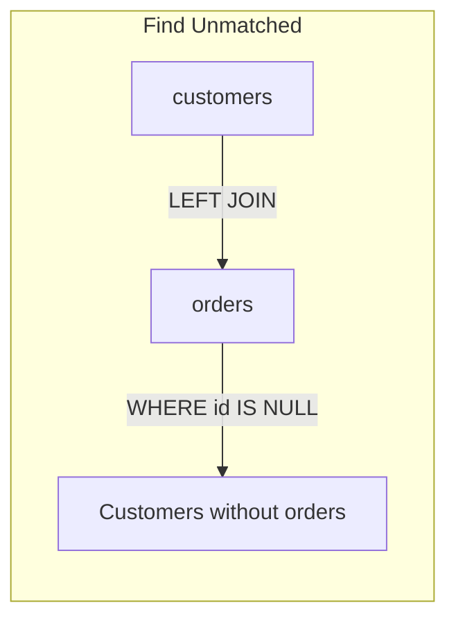
</Tab>
<Tab value="Products Never Ordered">
```sql
-- Using NOT EXISTS (often more efficient)
SELECT p.id, p.name
FROM products p
WHERE NOT EXISTS (
    SELECT 1 FROM order_items oi WHERE oi.product_id = p.id
);

-- Or using LEFT JOIN
SELECT p.id, p.name
FROM products p
LEFT JOIN order_items oi ON p.id = oi.product_id
WHERE oi.id IS NULL;
```
</Tab>
<Tab value="Orphaned Records">
```sql
-- Find orders with invalid customer_id
SELECT o.id, o.customer_id
FROM orders o
LEFT JOIN customers c ON o.customer_id = c.id
WHERE c.id IS NULL;
```
</Tab>
</Tabs>

### Latest Record Per Group

<Tabs items={['Subquery', 'Window Function', 'DISTINCT ON']}>
<Tab value="Subquery">
```sql
-- Latest order for each customer
SELECT c.name, o.*
FROM customers c
INNER JOIN orders o ON c.id = o.customer_id
WHERE o.created_at = (
    SELECT MAX(o2.created_at)
    FROM orders o2
    WHERE o2.customer_id = c.id
);
```
</Tab>
<Tab value="Window Function">
```sql
-- Using ROW_NUMBER
WITH ranked_orders AS (
    SELECT 
        o.*,
        ROW_NUMBER() OVER (
            PARTITION BY customer_id 
            ORDER BY created_at DESC
        ) AS rn
    FROM orders o
)
SELECT c.name, ro.*
FROM customers c
INNER JOIN ranked_orders ro ON c.id = ro.customer_id
WHERE ro.rn = 1;
```
</Tab>
<Tab value="DISTINCT ON">
```sql
-- PostgreSQL only
SELECT DISTINCT ON (o.customer_id) 
    c.name,
    o.*
FROM customers c
INNER JOIN orders o ON c.id = o.customer_id
ORDER BY o.customer_id, o.created_at DESC;
```
</Tab>
</Tabs>

## Performance Considerations

### Index Your JOIN Columns

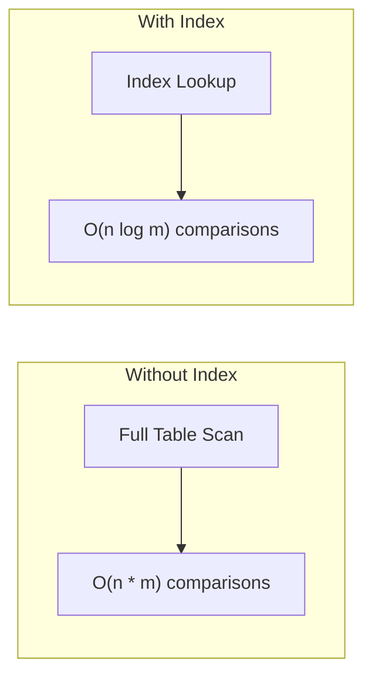

```sql
-- Foreign keys should be indexed
CREATE INDEX idx_orders_customer_id ON orders(customer_id);
CREATE INDEX idx_order_items_order_id ON order_items(order_id);
CREATE INDEX idx_order_items_product_id ON order_items(product_id);
```

### JOIN Order Matters

<Callout type="info" title="Query Optimizer">
Most databases reorder JOINs automatically for optimal performance. However, understanding the data distribution helps you write better queries.
</Callout>

```sql
-- Filter early to reduce rows before expensive JOINs
SELECT c.name, o.total
FROM customers c
INNER JOIN orders o ON c.id = o.customer_id
WHERE c.status = 'active'  -- Filter before joining
  AND o.created_at > '2024-01-01';
```

### Avoid N+1 Patterns

```sql
-- ❌ BAD: N+1 queries (application code)
-- 1. SELECT * FROM customers
-- 2. For each customer: SELECT * FROM orders WHERE customer_id = ?

-- ✅ GOOD: Single JOIN query
SELECT 
    c.id AS customer_id,
    c.name,
    o.id AS order_id,
    o.total
FROM customers c
LEFT JOIN orders o ON c.id = o.customer_id;
```

## Best Practices

<Steps>
<Step>
### Always Use Table Aliases
Make your queries readable and prevent ambiguous column references.

```sql
-- ✅ Good
SELECT c.name, o.total
FROM customers c
INNER JOIN orders o ON c.id = o.customer_id;

-- ❌ Avoid
SELECT customers.name, orders.total
FROM customers
INNER JOIN orders ON customers.id = orders.customer_id;
```
</Step>
<Step>
### Prefer LEFT JOIN over RIGHT JOIN
It's easier to read—the "main" table is always on the left.

```sql
-- ✅ Preferred
SELECT c.name, o.id
FROM customers c
LEFT JOIN orders o ON c.id = o.customer_id;

-- ❌ Avoid (harder to read)
SELECT c.name, o.id
FROM orders o
RIGHT JOIN customers c ON c.id = o.customer_id;
```
</Step>
<Step>
### Index Foreign Key Columns
Ensure fast lookups for JOIN conditions.

```sql
CREATE INDEX idx_orders_customer_id ON orders(customer_id);
```
</Step>
<Step>
### Be Explicit About JOIN Type
Always specify INNER, LEFT, RIGHT, or FULL OUTER.

```sql
-- ✅ Explicit
SELECT * FROM a INNER JOIN b ON a.id = b.a_id;

-- ❌ Implicit (defaults to INNER, but unclear)
SELECT * FROM a JOIN b ON a.id = b.a_id;
```
</Step>
</Steps>

## Next Steps

<Cards>
  <Card title="Aggregations" href="/docs/sql/fundamentals/aggregations" description="GROUP BY and aggregate functions" />
  <Card title="Subqueries" href="/docs/sql/fundamentals/subqueries" description="Nested queries and CTEs" />
</Cards>
