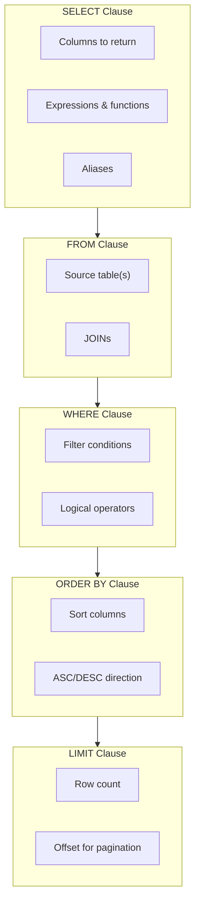
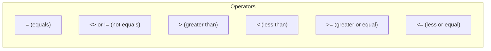
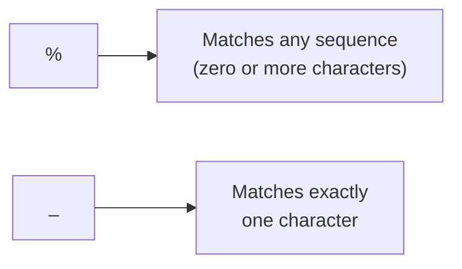
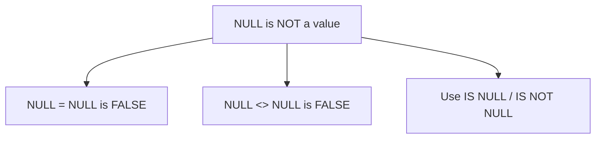
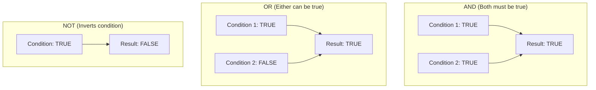
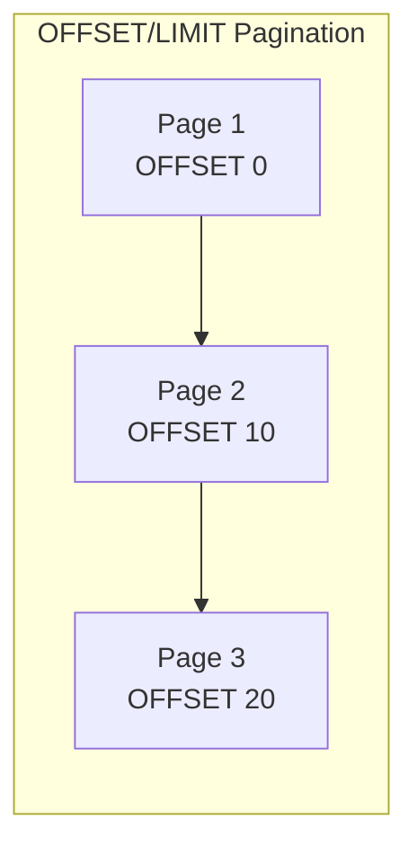

The `SELECT` statement is the most frequently used SQL command. It retrieves data from one or more tables and is the foundation of all data queries.

## Anatomy of a SELECT Statement



## Basic SELECT Syntax

<Tabs items={['All Columns', 'Specific Columns', 'With Aliases']}>
<Tab value="All Columns">
```sql
-- Select all columns (avoid in production)
SELECT * FROM products;
```

| id | name | price | category_id | stock |
|----|------|-------|-------------|-------|
| 1 | MacBook Pro | 2499.99 | 2 | 50 |
| 2 | iPhone 15 | 999.99 | 3 | 200 |
| 3 | Samsung Galaxy | 899.99 | 3 | 150 |

<Callout type="warn" title="Avoid SELECT *">
Using `SELECT *` is discouraged in production because:
- Returns unnecessary data (bandwidth/memory)
- Breaks applications when columns are added/removed
- Prevents covering index optimization
</Callout>
</Tab>
<Tab value="Specific Columns">
```sql
-- Select only needed columns
SELECT id, name, price FROM products;
```

| id | name | price |
|----|------|-------|
| 1 | MacBook Pro | 2499.99 |
| 2 | iPhone 15 | 999.99 |
| 3 | Samsung Galaxy | 899.99 |
</Tab>
<Tab value="With Aliases">
```sql
-- Use aliases for readability
SELECT 
    id AS product_id,
    name AS product_name,
    price AS unit_price,
    price * 1.1 AS price_with_tax
FROM products;
```

| product_id | product_name | unit_price | price_with_tax |
|------------|--------------|------------|----------------|
| 1 | MacBook Pro | 2499.99 | 2749.99 |
| 2 | iPhone 15 | 999.99 | 1099.99 |

<Callout type="info">
Use double quotes for aliases with spaces: `AS "Product Name"`
</Callout>
</Tab>
</Tabs>

## Filtering with WHERE

The `WHERE` clause filters rows based on conditions.

### Comparison Operators



<Tabs items={['Equality', 'Comparison', 'Range', 'List']}>
<Tab value="Equality">
```sql
-- Exact match
SELECT * FROM products WHERE category_id = 2;

-- Not equal
SELECT * FROM products WHERE category_id <> 2;
-- OR
SELECT * FROM products WHERE category_id != 2;
```
</Tab>
<Tab value="Comparison">
```sql
-- Greater than
SELECT * FROM products WHERE price > 1000;

-- Less than or equal
SELECT * FROM products WHERE stock <= 100;

-- Multiple conditions
SELECT * FROM products 
WHERE price > 500 AND stock > 0;
```
</Tab>
<Tab value="Range">
```sql
-- BETWEEN (inclusive)
SELECT * FROM products 
WHERE price BETWEEN 500 AND 1500;

-- Equivalent to:
SELECT * FROM products 
WHERE price >= 500 AND price <= 1500;

-- Date ranges
SELECT * FROM orders 
WHERE created_at BETWEEN '2024-01-01' AND '2024-12-31';
```

<Callout type="info">
`BETWEEN` is inclusive on both ends. For dates, be careful with timestamps—use explicit comparisons for precision.
</Callout>
</Tab>
<Tab value="List">
```sql
-- IN operator (match any in list)
SELECT * FROM products 
WHERE category_id IN (2, 3);

-- NOT IN
SELECT * FROM products 
WHERE category_id NOT IN (4, 5);

-- IN with subquery
SELECT * FROM products 
WHERE category_id IN (
    SELECT id FROM categories WHERE name LIKE 'Electronics%'
);
```
</Tab>
</Tabs>

### Pattern Matching with LIKE



<Tabs items={['Wildcards', 'Examples', 'Case Sensitivity']}>
<Tab value="Wildcards">
| Pattern | Description | Example | Matches |
|---------|-------------|---------|---------|
| `%` | Any characters | `'a%'` | apple, abc, a |
| `_` | Single character | `'a_c'` | abc, adc, a1c |
| `%_%` | At least one char | `'%a%'` | cat, apple, a |
</Tab>
<Tab value="Examples">
```sql
-- Starts with 'Mac'
SELECT * FROM products WHERE name LIKE 'Mac%';
-- Matches: MacBook Pro, Mac Mini, MacBook Air

-- Ends with 'Pro'
SELECT * FROM products WHERE name LIKE '%Pro';
-- Matches: MacBook Pro, iPad Pro

-- Contains 'Phone'
SELECT * FROM products WHERE name LIKE '%Phone%';
-- Matches: iPhone, Phone Case, Smartphone

-- Exactly 3 characters starting with 'a'
SELECT * FROM products WHERE name LIKE 'a__';
-- Matches: abc, app, air

-- Second character is 'a'
SELECT * FROM products WHERE name LIKE '_a%';
-- Matches: MacBook, Samsung, iPad
```
</Tab>
<Tab value="Case Sensitivity">
```sql
-- Case-sensitive by default in PostgreSQL
SELECT * FROM products WHERE name LIKE 'mac%';
-- Won't match 'MacBook'

-- Case-insensitive with ILIKE (PostgreSQL)
SELECT * FROM products WHERE name ILIKE 'mac%';
-- Matches: MacBook, macbook, MACBOOK

-- Case-insensitive in MySQL (by default)
SELECT * FROM products WHERE name LIKE 'mac%';
-- Matches: MacBook, macbook (depends on collation)

-- SQL Server
SELECT * FROM products WHERE name LIKE 'mac%';
-- Depends on collation (CI = case-insensitive)
```
</Tab>
</Tabs>

### NULL Handling

`NULL` represents missing or unknown values. It requires special handling.



<Tabs items={['IS NULL', 'IS NOT NULL', 'COALESCE']}>
<Tab value="IS NULL">
```sql
-- Find rows with NULL values
SELECT * FROM customers WHERE phone IS NULL;

-- This does NOT work!
SELECT * FROM customers WHERE phone = NULL;
-- Always returns empty result
```

<Callout type="error" title="Common Mistake">
Never use `= NULL` or `<> NULL`. Always use `IS NULL` or `IS NOT NULL`.
</Callout>
</Tab>
<Tab value="IS NOT NULL">
```sql
-- Find rows with non-NULL values
SELECT * FROM customers WHERE phone IS NOT NULL;

-- Combine with other conditions
SELECT * FROM customers 
WHERE phone IS NOT NULL AND status = 'active';
```
</Tab>
<Tab value="COALESCE">
```sql
-- Replace NULL with a default value
SELECT 
    name,
    COALESCE(phone, 'No phone') AS phone,
    COALESCE(email, 'No email') AS email
FROM customers;

-- COALESCE returns first non-NULL value
SELECT COALESCE(NULL, NULL, 'default');
-- Returns: 'default'

SELECT COALESCE(phone, mobile, work_phone, 'N/A') AS contact_number
FROM contacts;
```
</Tab>
</Tabs>

### Logical Operators

Combine multiple conditions with `AND`, `OR`, and `NOT`.



<Tabs items={['AND', 'OR', 'Complex Conditions']}>
<Tab value="AND">
```sql
-- Both conditions must be true
SELECT * FROM products 
WHERE price > 500 AND stock > 0;

-- Multiple ANDs
SELECT * FROM orders 
WHERE status = 'pending'
  AND total > 100
  AND created_at > '2024-01-01';
```
</Tab>
<Tab value="OR">
```sql
-- Either condition can be true
SELECT * FROM products 
WHERE category_id = 2 OR category_id = 3;

-- Better with IN
SELECT * FROM products 
WHERE category_id IN (2, 3);
```
</Tab>
<Tab value="Complex Conditions">
```sql
-- Use parentheses for clarity and correctness
SELECT * FROM products 
WHERE (category_id = 2 OR category_id = 3)
  AND price > 500
  AND stock > 0;

-- Without parentheses, this is different!
SELECT * FROM products 
WHERE category_id = 2 OR category_id = 3
  AND price > 500;
-- Equivalent to: category_id = 2 OR (category_id = 3 AND price > 500)
```

<Callout type="warn" title="Operator Precedence">
`AND` has higher precedence than `OR`. Always use parentheses to make your intent clear.
</Callout>
</Tab>
</Tabs>

## Sorting with ORDER BY

Sort results by one or more columns.

<Tabs items={['Basic Sorting', 'Multiple Columns', 'NULL Handling', 'Expressions']}>
<Tab value="Basic Sorting">
```sql
-- Ascending (default)
SELECT * FROM products ORDER BY price;
SELECT * FROM products ORDER BY price ASC;

-- Descending
SELECT * FROM products ORDER BY price DESC;

-- Alphabetical
SELECT * FROM products ORDER BY name;
```
</Tab>
<Tab value="Multiple Columns">
```sql
-- Sort by multiple columns
SELECT * FROM products 
ORDER BY category_id ASC, price DESC;

-- First sorts by category, then by price within each category
```

| category_id | name | price |
|-------------|------|-------|
| 2 | MacBook Pro | 2499.99 |
| 2 | Dell XPS | 1799.99 |
| 3 | iPhone 15 | 999.99 |
| 3 | Samsung Galaxy | 899.99 |
</Tab>
<Tab value="NULL Handling">
```sql
-- PostgreSQL: Control NULL position
SELECT * FROM customers ORDER BY phone NULLS LAST;
SELECT * FROM customers ORDER BY phone NULLS FIRST;

-- MySQL/SQL Server: NULLs typically sort first in ASC
-- Use COALESCE for control
SELECT * FROM customers 
ORDER BY COALESCE(phone, 'ZZZZ');  -- NULLs sort last

-- Or use CASE
SELECT * FROM customers 
ORDER BY CASE WHEN phone IS NULL THEN 1 ELSE 0 END, phone;
```
</Tab>
<Tab value="Expressions">
```sql
-- Sort by calculated value
SELECT name, price, stock, price * stock AS inventory_value
FROM products
ORDER BY price * stock DESC;

-- Sort by alias (supported in most databases)
SELECT name, price * stock AS inventory_value
FROM products
ORDER BY inventory_value DESC;

-- Sort by column position (not recommended)
SELECT name, price FROM products ORDER BY 2 DESC;
-- Sorts by second column (price)
```
</Tab>
</Tabs>

## Limiting Results

Restrict the number of rows returned.

<Tabs items={['PostgreSQL/MySQL', 'SQL Server', 'Pagination']}>
<Tab value="PostgreSQL/MySQL">
```sql
-- Get first 10 rows
SELECT * FROM products ORDER BY price DESC LIMIT 10;

-- Skip first 20 rows, get next 10
SELECT * FROM products ORDER BY id LIMIT 10 OFFSET 20;
```
</Tab>
<Tab value="SQL Server">
```sql
-- Get first 10 rows
SELECT TOP 10 * FROM products ORDER BY price DESC;

-- With OFFSET (SQL Server 2012+)
SELECT * FROM products
ORDER BY id
OFFSET 20 ROWS FETCH NEXT 10 ROWS ONLY;
```
</Tab>
<Tab value="Pagination">
```sql
-- Page calculation
-- Page 1: OFFSET 0, LIMIT 10
-- Page 2: OFFSET 10, LIMIT 10
-- Page 3: OFFSET 20, LIMIT 10
-- Formula: OFFSET = (page - 1) * page_size

-- PostgreSQL/MySQL
SELECT * FROM products
ORDER BY id
LIMIT 10 OFFSET 20;  -- Page 3

-- With total count
SELECT 
    *,
    COUNT(*) OVER() AS total_count
FROM products
ORDER BY id
LIMIT 10 OFFSET 20;
```



<Callout type="warn" title="Performance Warning">
Large OFFSET values are slow because the database must scan and discard rows. Use keyset pagination for better performance.
</Callout>

```sql
-- Keyset pagination (more efficient)
-- Instead of OFFSET, use WHERE with last seen value
SELECT * FROM products
WHERE id > 1000  -- Last ID from previous page
ORDER BY id
LIMIT 10;
```
</Tab>
</Tabs>

## DISTINCT Values

Remove duplicate rows from results.

<Tabs items={['Single Column', 'Multiple Columns', 'With Aggregates']}>
<Tab value="Single Column">
```sql
-- Get unique categories
SELECT DISTINCT category_id FROM products;

-- Get unique statuses
SELECT DISTINCT status FROM orders;
```

| status |
|--------|
| pending |
| processing |
| shipped |
| delivered |
</Tab>
<Tab value="Multiple Columns">
```sql
-- Unique combinations
SELECT DISTINCT category_id, status FROM products;
```

| category_id | status |
|-------------|--------|
| 2 | active |
| 2 | discontinued |
| 3 | active |
</Tab>
<Tab value="With Aggregates">
```sql
-- Count unique values
SELECT COUNT(DISTINCT category_id) AS unique_categories
FROM products;

-- Count unique vs total
SELECT 
    COUNT(*) AS total_products,
    COUNT(DISTINCT category_id) AS unique_categories
FROM products;
```
</Tab>
</Tabs>

## Computed Columns

Create new columns with expressions and functions.

<Tabs items={['Arithmetic', 'String Functions', 'Date Functions', 'Conditional']}>
<Tab value="Arithmetic">
```sql
SELECT 
    name,
    price,
    stock,
    price * stock AS inventory_value,
    price * 0.1 AS discount_amount,
    price * 0.9 AS discounted_price,
    ROUND(price * 1.08, 2) AS price_with_tax
FROM products;
```
</Tab>
<Tab value="String Functions">
```sql
-- PostgreSQL
SELECT 
    UPPER(name) AS upper_name,
    LOWER(name) AS lower_name,
    LENGTH(name) AS name_length,
    CONCAT(name, ' - $', price) AS display_name,
    LEFT(name, 10) AS short_name,
    SUBSTRING(name, 1, 5) AS prefix
FROM products;

-- MySQL
SELECT 
    UPPER(name),
    LOWER(name),
    CHAR_LENGTH(name),
    CONCAT(name, ' - $', price),
    LEFT(name, 10),
    SUBSTRING(name, 1, 5)
FROM products;
```
</Tab>
<Tab value="Date Functions">
```sql
-- PostgreSQL
SELECT 
    created_at,
    DATE(created_at) AS date_only,
    EXTRACT(YEAR FROM created_at) AS year,
    EXTRACT(MONTH FROM created_at) AS month,
    DATE_TRUNC('month', created_at) AS month_start,
    created_at + INTERVAL '7 days' AS week_later,
    NOW() - created_at AS age
FROM orders;

-- MySQL
SELECT 
    created_at,
    DATE(created_at),
    YEAR(created_at),
    MONTH(created_at),
    DATE_FORMAT(created_at, '%Y-%m'),
    DATE_ADD(created_at, INTERVAL 7 DAY),
    DATEDIFF(NOW(), created_at) AS days_old
FROM orders;
```
</Tab>
<Tab value="Conditional">
```sql
-- CASE expression
SELECT 
    name,
    price,
    CASE 
        WHEN price < 100 THEN 'Budget'
        WHEN price < 500 THEN 'Mid-range'
        WHEN price < 1500 THEN 'Premium'
        ELSE 'Luxury'
    END AS price_tier,
    CASE status
        WHEN 'pending' THEN 'Awaiting Processing'
        WHEN 'shipped' THEN 'On the Way'
        WHEN 'delivered' THEN 'Completed'
        ELSE 'Unknown'
    END AS status_label
FROM products;
```
</Tab>
</Tabs>

## Best Practices

<Steps>
<Step>
### Select Only Needed Columns
Always list specific columns instead of using `SELECT *`.

```sql
-- ❌ Avoid
SELECT * FROM products;

-- ✅ Better
SELECT id, name, price FROM products;
```
</Step>
<Step>
### Use Meaningful Aliases
Make your results readable with clear aliases.

```sql
SELECT 
    p.name AS product_name,
    c.name AS category_name,
    p.price AS unit_price
FROM products p
JOIN categories c ON p.category_id = c.id;
```
</Step>
<Step>
### Filter Early with WHERE
Reduce the dataset as early as possible.

```sql
-- ❌ Filter after fetching all data
SELECT * FROM orders;  -- Then filter in application

-- ✅ Filter in the database
SELECT * FROM orders WHERE status = 'pending';
```
</Step>
<Step>
### Always Use ORDER BY with LIMIT
Without ORDER BY, the order of rows is undefined.

```sql
-- ❌ Unpredictable results
SELECT * FROM products LIMIT 10;

-- ✅ Predictable results
SELECT * FROM products ORDER BY id LIMIT 10;
```
</Step>
</Steps>

## Next Steps

<Cards>
  <Card title="JOINs" href="/docs/sql/fundamentals/joins" description="Combine data from multiple tables" />
  <Card title="Aggregations" href="/docs/sql/fundamentals/aggregations" description="GROUP BY and aggregate functions" />
</Cards>
