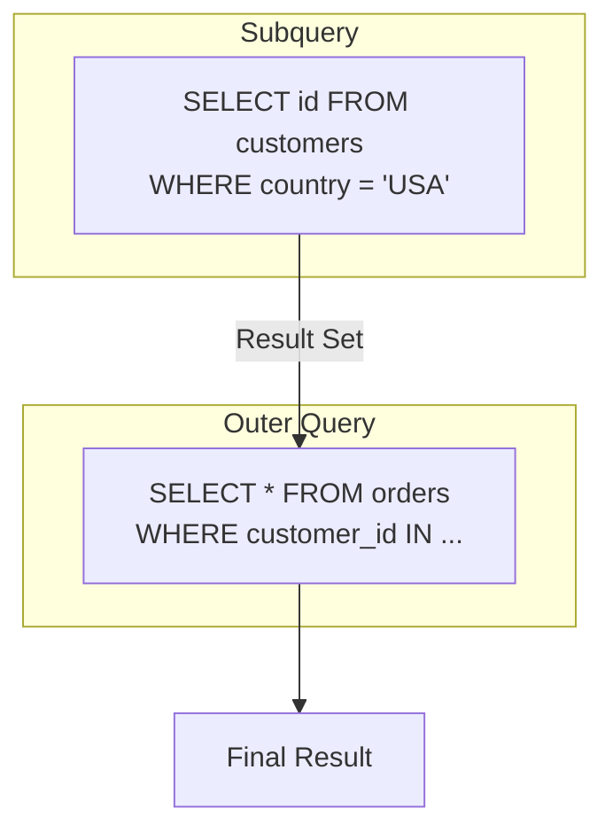
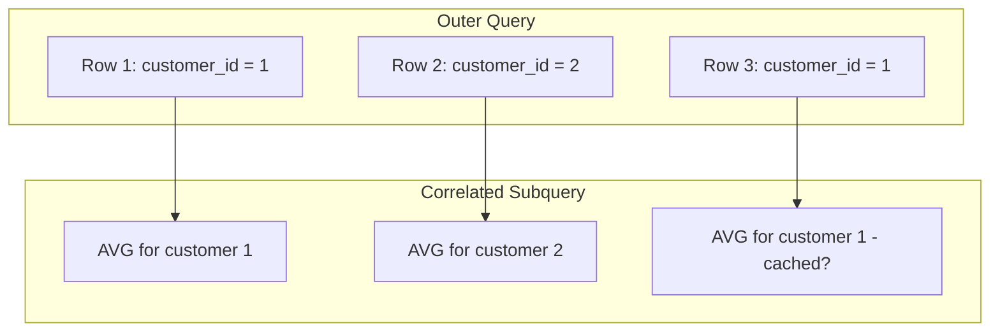
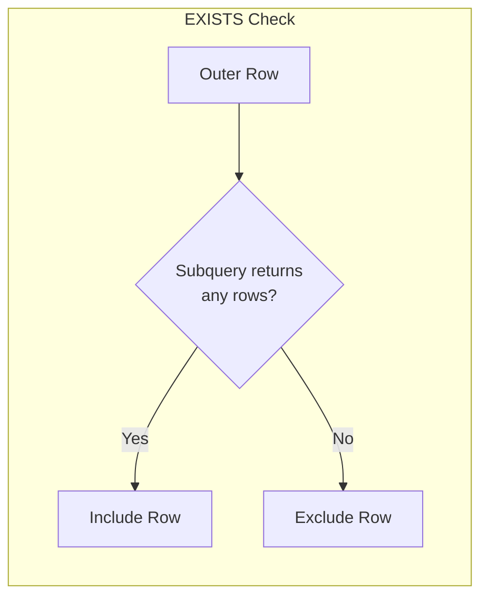

Subqueries (nested queries) are queries embedded within other queries. They allow you to build complex logic by breaking it into smaller, manageable pieces.

## Subquery Flow



## Types of Subqueries

<Tabs items={['Scalar', 'Row', 'Table', 'Correlated']}>
<Tab value="Scalar">
### Scalar Subquery
Returns a single value (one row, one column).

```sql
-- Get products above average price
SELECT name, price
FROM products
WHERE price > (
    SELECT AVG(price) FROM products
);

-- Use in SELECT clause
SELECT 
    name,
    price,
    price - (SELECT AVG(price) FROM products) AS diff_from_avg
FROM products;

-- Use in CASE expression
SELECT 
    name,
    price,
    CASE 
        WHEN price > (SELECT AVG(price) FROM products) THEN 'Above Average'
        ELSE 'Below Average'
    END AS price_category
FROM products;
```

<Callout type="warn" title="Scalar Subquery Rules">
If a scalar subquery returns more than one row or column, you'll get an error.
</Callout>
</Tab>
<Tab value="Row">
### Row Subquery
Returns a single row with multiple columns.

```sql
-- Compare entire row (PostgreSQL)
SELECT * FROM products
WHERE (category_id, price) = (
    SELECT category_id, MAX(price)
    FROM products
    GROUP BY category_id
    LIMIT 1
);

-- Row comparison with IN
SELECT * FROM orders
WHERE (customer_id, product_id) IN (
    SELECT customer_id, favorite_product_id
    FROM customer_preferences
);
```
</Tab>
<Tab value="Table">
### Table Subquery
Returns multiple rows and columns (a derived table).

```sql
-- Subquery in FROM clause (derived table)
SELECT 
    category_stats.category_id,
    category_stats.avg_price,
    p.name AS most_expensive
FROM (
    SELECT 
        category_id,
        AVG(price) AS avg_price,
        MAX(price) AS max_price
    FROM products
    GROUP BY category_id
) AS category_stats
JOIN products p 
    ON p.category_id = category_stats.category_id 
    AND p.price = category_stats.max_price;

-- Must have an alias
SELECT * FROM (
    SELECT customer_id, COUNT(*) AS order_count
    FROM orders
    GROUP BY customer_id
) AS customer_orders  -- Alias required
WHERE order_count > 5;
```
</Tab>
<Tab value="Correlated">
### Correlated Subquery
References columns from the outer query. Executes once per outer row.

```sql
-- Products priced above their category average
SELECT p.name, p.price, p.category_id
FROM products p
WHERE p.price > (
    SELECT AVG(p2.price)
    FROM products p2
    WHERE p2.category_id = p.category_id  -- References outer query
);

-- Orders above customer's average
SELECT o.id, o.total, o.customer_id
FROM orders o
WHERE o.total > (
    SELECT AVG(o2.total)
    FROM orders o2
    WHERE o2.customer_id = o.customer_id
);
```



<Callout type="warn" title="Performance Warning">
Correlated subqueries can be slow because they execute once per row.
Consider rewriting as JOINs or CTEs for better performance.
</Callout>
</Tab>
</Tabs>

## Subquery Operators

### EXISTS and NOT EXISTS



```sql
-- Customers with at least one order
SELECT c.id, c.name
FROM customers c
WHERE EXISTS (
    SELECT 1
    FROM orders o
    WHERE o.customer_id = c.id
);

-- Customers with NO orders
SELECT c.id, c.name
FROM customers c
WHERE NOT EXISTS (
    SELECT 1
    FROM orders o
    WHERE o.customer_id = c.id
);

-- Products never ordered
SELECT p.id, p.name
FROM products p
WHERE NOT EXISTS (
    SELECT 1
    FROM order_items oi
    WHERE oi.product_id = p.id
);
```

<Callout type="info" title="EXISTS Performance Tip">
EXISTS stops searching as soon as it finds one matching row.
Use `SELECT 1` or `SELECT *` - the column list doesn't matter.
EXISTS is often faster than IN for large subqueries.
</Callout>

### IN and NOT IN

```sql
-- Orders from USA customers
SELECT * FROM orders
WHERE customer_id IN (
    SELECT id FROM customers WHERE country = 'USA'
);

-- Products not in any order
SELECT * FROM products
WHERE id NOT IN (
    SELECT DISTINCT product_id 
    FROM order_items
    WHERE product_id IS NOT NULL  -- Important!
);
```

<Callout type="error" title="NOT IN and NULL Trap">
If the subquery returns any NULL values, NOT IN returns no results!

```sql
-- This returns NOTHING if any product_id is NULL:
SELECT * FROM products
WHERE id NOT IN (SELECT product_id FROM order_items);

-- Safe alternatives:
-- 1. Exclude NULLs explicitly
WHERE id NOT IN (SELECT product_id FROM order_items WHERE product_id IS NOT NULL);

-- 2. Use NOT EXISTS instead
WHERE NOT EXISTS (SELECT 1 FROM order_items WHERE product_id = products.id);
```
</Callout>

### ALL and ANY/SOME

```sql
-- Price greater than ALL categories' average (i.e., the maximum average)
SELECT * FROM products
WHERE price > ALL (
    SELECT AVG(price) FROM products GROUP BY category_id
);

-- Price greater than ANY category's average (i.e., at least one)
SELECT * FROM products
WHERE price > ANY (
    SELECT AVG(price) FROM products GROUP BY category_id
);

-- ANY is equivalent to SOME
SELECT * FROM products
WHERE price > SOME (
    SELECT AVG(price) FROM products GROUP BY category_id
);
```

| Operator | Description | Equivalent |
|----------|-------------|------------|
| `> ALL` | Greater than maximum | `> (SELECT MAX(...))` |
| `< ALL` | Less than minimum | `< (SELECT MIN(...))` |
| `= ALL` | Equal to all (all same value) | - |
| `> ANY` | Greater than minimum | `> (SELECT MIN(...))` |
| `< ANY` | Less than maximum | `< (SELECT MAX(...))` |
| `= ANY` | Equal to any | `IN (...)` |

## Subquery Locations

<Tabs items={['SELECT', 'FROM', 'WHERE', 'HAVING', 'INSERT/UPDATE']}>
<Tab value="SELECT">
```sql
-- Scalar subquery in SELECT
SELECT 
    p.name,
    p.price,
    (SELECT AVG(price) FROM products) AS avg_price,
    (SELECT COUNT(*) FROM order_items oi WHERE oi.product_id = p.id) AS times_ordered
FROM products p;

-- Correlated subquery in SELECT
SELECT 
    c.name,
    (SELECT COUNT(*) FROM orders o WHERE o.customer_id = c.id) AS order_count,
    (SELECT SUM(total) FROM orders o WHERE o.customer_id = c.id) AS total_spent
FROM customers c;
```
</Tab>
<Tab value="FROM">
```sql
-- Derived table
SELECT 
    t.category_id,
    t.total_products,
    t.avg_price
FROM (
    SELECT 
        category_id,
        COUNT(*) AS total_products,
        AVG(price) AS avg_price
    FROM products
    GROUP BY category_id
) AS t
WHERE t.avg_price > 100;

-- Multiple derived tables
SELECT 
    o.month,
    o.order_count,
    p.product_count
FROM (
    SELECT DATE_TRUNC('month', created_at) AS month, COUNT(*) AS order_count
    FROM orders
    GROUP BY 1
) AS o
JOIN (
    SELECT DATE_TRUNC('month', created_at) AS month, COUNT(*) AS product_count
    FROM products
    GROUP BY 1
) AS p ON o.month = p.month;
```
</Tab>
<Tab value="WHERE">
```sql
-- Scalar in WHERE
SELECT * FROM orders
WHERE total > (SELECT AVG(total) FROM orders);

-- IN list in WHERE
SELECT * FROM orders
WHERE customer_id IN (SELECT id FROM customers WHERE status = 'vip');

-- EXISTS in WHERE
SELECT * FROM customers c
WHERE EXISTS (
    SELECT 1 FROM orders o 
    WHERE o.customer_id = c.id AND o.total > 1000
);
```
</Tab>
<Tab value="HAVING">
```sql
-- Subquery in HAVING
SELECT 
    category_id,
    AVG(price) AS avg_price
FROM products
GROUP BY category_id
HAVING AVG(price) > (
    SELECT AVG(price) FROM products  -- Overall average
);

-- Categories with more products than average
SELECT 
    category_id,
    COUNT(*) AS product_count
FROM products
GROUP BY category_id
HAVING COUNT(*) > (
    SELECT AVG(cnt)
    FROM (
        SELECT COUNT(*) AS cnt
        FROM products
        GROUP BY category_id
    ) AS counts
);
```
</Tab>
<Tab value="INSERT/UPDATE">
```sql
-- INSERT from subquery
INSERT INTO order_archive (id, customer_id, total, created_at)
SELECT id, customer_id, total, created_at
FROM orders
WHERE created_at < '2023-01-01';

-- UPDATE with subquery
UPDATE products p
SET price = price * 1.1
WHERE category_id IN (
    SELECT id FROM categories WHERE name = 'Electronics'
);

-- UPDATE with correlated subquery
UPDATE products p
SET category_avg = (
    SELECT AVG(price) 
    FROM products p2 
    WHERE p2.category_id = p.category_id
);

-- DELETE with subquery
DELETE FROM orders
WHERE customer_id IN (
    SELECT id FROM customers WHERE status = 'deleted'
);
```
</Tab>
</Tabs>

## Subqueries vs CTEs

<Callout type="info" title="CTE vs Subquery">
CTEs (Common Table Expressions) are often cleaner than subqueries.
See the [CTEs page](/docs/sql/fundamentals/ctes) for detailed comparison.
</Callout>

```sql
-- Nested subqueries (hard to read)
SELECT * FROM (
    SELECT customer_id, SUM(total) AS total_spent
    FROM (
        SELECT * FROM orders WHERE status = 'completed'
    ) AS completed_orders
    GROUP BY customer_id
) AS customer_totals
WHERE total_spent > 1000;

-- Same logic with CTE (clearer)
WITH completed_orders AS (
    SELECT * FROM orders WHERE status = 'completed'
),
customer_totals AS (
    SELECT customer_id, SUM(total) AS total_spent
    FROM completed_orders
    GROUP BY customer_id
)
SELECT * FROM customer_totals WHERE total_spent > 1000;
```

## Performance Patterns

<Accordions>
<Accordion title="Rewriting Correlated Subqueries as JOINs">
```sql
-- ❌ Slow: Correlated subquery (executes per row)
SELECT p.name, p.price
FROM products p
WHERE p.price > (
    SELECT AVG(p2.price)
    FROM products p2
    WHERE p2.category_id = p.category_id
);

-- ✅ Faster: JOIN with derived table (executes once)
SELECT p.name, p.price
FROM products p
JOIN (
    SELECT category_id, AVG(price) AS avg_price
    FROM products
    GROUP BY category_id
) AS cat_avg ON p.category_id = cat_avg.category_id
WHERE p.price > cat_avg.avg_price;
```
</Accordion>
<Accordion title="IN vs EXISTS">
```sql
-- IN: Good for small subquery results
SELECT * FROM orders
WHERE customer_id IN (SELECT id FROM customers WHERE country = 'USA');

-- EXISTS: Better for large tables with indexes
SELECT * FROM orders o
WHERE EXISTS (
    SELECT 1 FROM customers c 
    WHERE c.id = o.customer_id AND c.country = 'USA'
);

-- Rule of thumb:
-- - Use IN when subquery result is small
-- - Use EXISTS when outer table is small and subquery table is large
-- - EXISTS can short-circuit (stops after first match)
```
</Accordion>
<Accordion title="LATERAL Subqueries (PostgreSQL)">
```sql
-- LATERAL allows correlated subquery in FROM
-- Get top 3 orders per customer
SELECT c.name, top_orders.*
FROM customers c
CROSS JOIN LATERAL (
    SELECT id, total
    FROM orders o
    WHERE o.customer_id = c.id
    ORDER BY total DESC
    LIMIT 3
) AS top_orders;

-- Without LATERAL, you'd need window functions or multiple subqueries
```
</Accordion>
</Accordions>

## Best Practices

<Steps>
<Step>
### Use CTEs for Readability
Replace deeply nested subqueries with CTEs.

```sql
-- ❌ Hard to read
SELECT * FROM (SELECT * FROM (SELECT ... ) t1 WHERE ...) t2;

-- ✅ Clear and maintainable
WITH step1 AS (...),
     step2 AS (SELECT * FROM step1 WHERE ...)
SELECT * FROM step2;
```
</Step>
<Step>
### Avoid NOT IN with Nullable Columns
Use NOT EXISTS or explicitly exclude NULLs.

```sql
-- ❌ May return nothing if NULLs present
WHERE id NOT IN (SELECT nullable_column FROM ...)

-- ✅ Safe alternatives
WHERE NOT EXISTS (SELECT 1 FROM ... WHERE id = outer.id)
WHERE id NOT IN (SELECT column FROM ... WHERE column IS NOT NULL)
```
</Step>
<Step>
### Consider EXISTS Over IN for Large Datasets
EXISTS can short-circuit and use indexes effectively.
</Step>
<Step>
### Rewrite Correlated Subqueries When Possible
JOINs and window functions are often more efficient.
</Step>
</Steps>

## Next Steps

<Cards>
  <Card title="CTEs" href="/docs/sql/fundamentals/ctes" description="Cleaner alternative to subqueries" />
  <Card title="Window Functions" href="/docs/sql/fundamentals/window-functions" description="Analytics without subqueries" />
</Cards>
