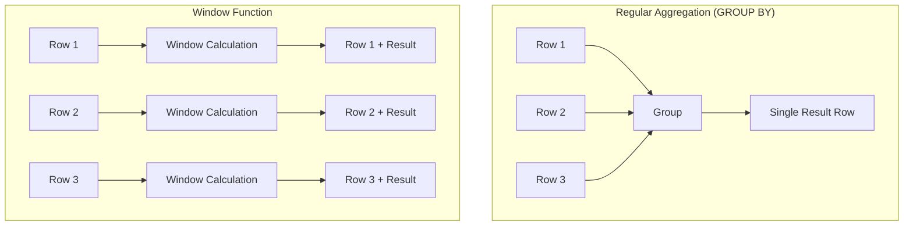
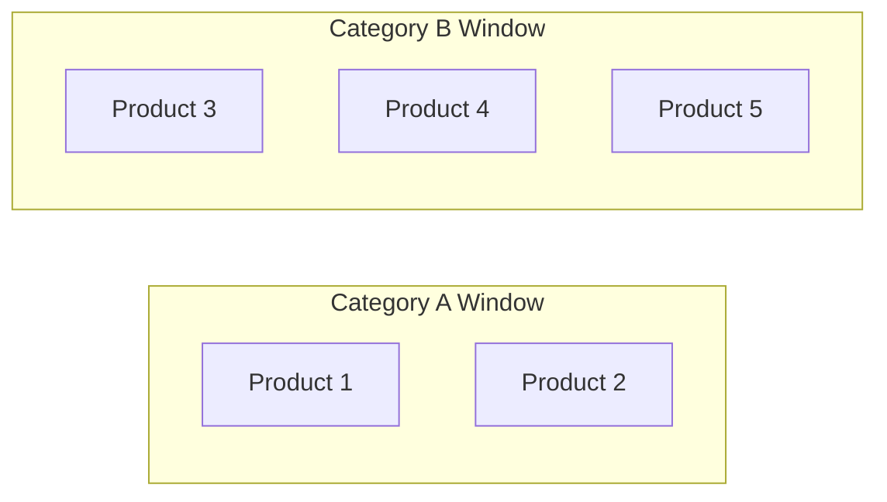
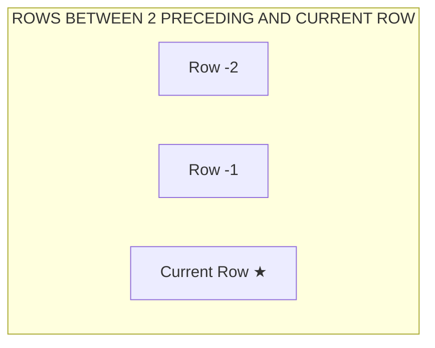

Window functions perform calculations across a set of rows related to the current row—without grouping them into a single output row. They're essential for rankings, running totals, moving averages, and comparisons.

## How Window Functions Work



## Window Function Syntax

```sql
function_name(expression) OVER (
    [PARTITION BY partition_expression]
    [ORDER BY sort_expression [ASC|DESC]]
    [frame_clause]
)
```

<Tabs items={['OVER', 'PARTITION BY', 'ORDER BY', 'Frame Clause']}>
<Tab value="OVER">
```sql
-- OVER() without options: entire result set is the window
SELECT 
    name,
    price,
    AVG(price) OVER() AS avg_all_products,
    price - AVG(price) OVER() AS diff_from_avg
FROM products;
```

| name | price | avg_all_products | diff_from_avg |
|------|-------|------------------|---------------|
| Widget | 50 | 100 | -50 |
| Gadget | 150 | 100 | 50 |
| Thing | 100 | 100 | 0 |
</Tab>
<Tab value="PARTITION BY">
```sql
-- PARTITION BY: Create separate windows for each group
SELECT 
    category_id,
    name,
    price,
    AVG(price) OVER(PARTITION BY category_id) AS category_avg,
    price - AVG(price) OVER(PARTITION BY category_id) AS diff_from_category_avg
FROM products;
```


</Tab>
<Tab value="ORDER BY">
```sql
-- ORDER BY: Define order within the window for running calculations
SELECT 
    created_at,
    total,
    SUM(total) OVER(ORDER BY created_at) AS running_total,
    ROW_NUMBER() OVER(ORDER BY created_at) AS row_num
FROM orders;
```

| created_at | total | running_total | row_num |
|------------|-------|---------------|---------|
| 2024-01-01 | 100 | 100 | 1 |
| 2024-01-02 | 150 | 250 | 2 |
| 2024-01-03 | 200 | 450 | 3 |
</Tab>
<Tab value="Frame Clause">
```sql
-- Frame: Define exactly which rows to include
SELECT 
    date,
    revenue,
    -- 3-day moving average (current row + 2 preceding)
    AVG(revenue) OVER(
        ORDER BY date 
        ROWS BETWEEN 2 PRECEDING AND CURRENT ROW
    ) AS moving_avg_3d,
    -- Sum of current row and next row
    SUM(revenue) OVER(
        ORDER BY date
        ROWS BETWEEN CURRENT ROW AND 1 FOLLOWING
    ) AS sum_with_next
FROM daily_sales;
```


</Tab>
</Tabs>

## Window Frame Types

<Tabs items={['ROWS', 'RANGE', 'GROUPS', 'Comparison']}>
<Tab value="ROWS">
```sql
-- ROWS: Physical rows
SELECT 
    date,
    revenue,
    -- Previous 2 physical rows + current
    SUM(revenue) OVER(
        ORDER BY date
        ROWS BETWEEN 2 PRECEDING AND CURRENT ROW
    ) AS sum_3_rows
FROM daily_sales;
```

Frame boundaries for ROWS:
- `UNBOUNDED PRECEDING`: Start of partition
- `n PRECEDING`: n rows before current
- `CURRENT ROW`: The current row
- `n FOLLOWING`: n rows after current
- `UNBOUNDED FOLLOWING`: End of partition
</Tab>
<Tab value="RANGE">
```sql
-- RANGE: Logical values (ties included)
SELECT 
    sale_date,
    amount,
    -- All rows with same date + preceding dates
    SUM(amount) OVER(
        ORDER BY sale_date
        RANGE BETWEEN UNBOUNDED PRECEDING AND CURRENT ROW
    ) AS running_total
FROM sales;
```

<Callout type="info" title="ROWS vs RANGE">
With ROWS, each physical row is separate.
With RANGE, rows with the same ORDER BY value are treated together.
</Callout>
</Tab>
<Tab value="GROUPS">
```sql
-- GROUPS: Groups of tied rows (PostgreSQL 11+)
SELECT 
    category,
    product,
    price,
    -- Average including 1 group before and 1 after
    AVG(price) OVER(
        ORDER BY category
        GROUPS BETWEEN 1 PRECEDING AND 1 FOLLOWING
    ) AS avg_nearby_categories
FROM products;
```
</Tab>
<Tab value="Comparison">
| Frame Type | Unit | Ties |
|------------|------|------|
| `ROWS` | Physical rows | Separate |
| `RANGE` | Value range | Included together |
| `GROUPS` | Groups of ties | Grouped |

```sql
-- Example with duplicate dates
-- Data: 2024-01-01 (x2), 2024-01-02 (x1)

-- ROWS BETWEEN 1 PRECEDING AND CURRENT ROW
-- Row 1: Only itself
-- Row 2 (same date): Rows 1-2
-- Row 3: Rows 2-3

-- RANGE BETWEEN 1 PRECEDING AND CURRENT ROW  
-- Row 1: Rows 1-2 (same date = same range)
-- Row 2: Rows 1-2
-- Row 3: Rows 1-3 (value-based range)
```
</Tab>
</Tabs>

## Ranking Functions

<Tabs items={['ROW_NUMBER', 'RANK', 'DENSE_RANK', 'NTILE', 'Comparison']}>
<Tab value="ROW_NUMBER">
```sql
-- Unique number for each row
SELECT 
    name,
    score,
    ROW_NUMBER() OVER(ORDER BY score DESC) AS row_num
FROM students;
```

| name | score | row_num |
|------|-------|---------|
| Alice | 95 | 1 |
| Bob | 90 | 2 |
| Charlie | 90 | 3 |
| Diana | 85 | 4 |

<Callout type="warn" title="Non-Deterministic">
With ties, ROW_NUMBER is non-deterministic unless you add a tiebreaker.
</Callout>
</Tab>
<Tab value="RANK">
```sql
-- Rank with gaps after ties
SELECT 
    name,
    score,
    RANK() OVER(ORDER BY score DESC) AS rank
FROM students;
```

| name | score | rank |
|------|-------|------|
| Alice | 95 | 1 |
| Bob | 90 | 2 |
| Charlie | 90 | 2 |
| Diana | 85 | 4 |

Note: Rank 3 is skipped because 2 people tied for 2nd.
</Tab>
<Tab value="DENSE_RANK">
```sql
-- Rank without gaps
SELECT 
    name,
    score,
    DENSE_RANK() OVER(ORDER BY score DESC) AS dense_rank
FROM students;
```

| name | score | dense_rank |
|------|-------|------------|
| Alice | 95 | 1 |
| Bob | 90 | 2 |
| Charlie | 90 | 2 |
| Diana | 85 | 3 |

Note: No gaps—Diana is 3rd, not 4th.
</Tab>
<Tab value="NTILE">
```sql
-- Divide into n buckets
SELECT 
    name,
    score,
    NTILE(4) OVER(ORDER BY score DESC) AS quartile
FROM students;
```

| name | score | quartile |
|------|-------|----------|
| Alice | 95 | 1 |
| Bob | 90 | 2 |
| Charlie | 85 | 3 |
| Diana | 80 | 4 |

Use cases: Percentiles, quartiles, deciles
</Tab>
<Tab value="Comparison">
| Function | Ties | Gaps | Use Case |
|----------|------|------|----------|
| `ROW_NUMBER` | Arbitrary | No | Unique IDs, pagination |
| `RANK` | Same rank | Yes | Competition rankings |
| `DENSE_RANK` | Same rank | No | Sequential rankings |
| `NTILE(n)` | N/A | N/A | Buckets/percentiles |

```sql
-- All together
SELECT 
    name,
    score,
    ROW_NUMBER() OVER(ORDER BY score DESC) AS row_num,
    RANK() OVER(ORDER BY score DESC) AS rank,
    DENSE_RANK() OVER(ORDER BY score DESC) AS dense_rank,
    NTILE(4) OVER(ORDER BY score DESC) AS quartile
FROM students;
```
</Tab>
</Tabs>

## Navigation Functions

<Tabs items={['LAG', 'LEAD', 'FIRST_VALUE', 'LAST_VALUE', 'NTH_VALUE']}>
<Tab value="LAG">
```sql
-- Access previous row's value
SELECT 
    date,
    revenue,
    LAG(revenue) OVER(ORDER BY date) AS prev_day_revenue,
    LAG(revenue, 7) OVER(ORDER BY date) AS week_ago_revenue,
    LAG(revenue, 1, 0) OVER(ORDER BY date) AS prev_or_zero  -- Default if no prev
FROM daily_sales;
```

| date | revenue | prev_day | week_ago |
|------|---------|----------|----------|
| Day 1 | 100 | NULL | NULL |
| Day 2 | 150 | 100 | NULL |
| Day 3 | 120 | 150 | NULL |
</Tab>
<Tab value="LEAD">
```sql
-- Access next row's value
SELECT 
    date,
    revenue,
    LEAD(revenue) OVER(ORDER BY date) AS next_day_revenue,
    LEAD(revenue, 7) OVER(ORDER BY date) AS next_week_revenue
FROM daily_sales;

-- Calculate day-over-day change
SELECT 
    date,
    revenue,
    revenue - LAG(revenue) OVER(ORDER BY date) AS dod_change,
    ROUND(
        (revenue - LAG(revenue) OVER(ORDER BY date)) * 100.0 
        / LAG(revenue) OVER(ORDER BY date), 
        2
    ) AS dod_pct_change
FROM daily_sales;
```
</Tab>
<Tab value="FIRST_VALUE">
```sql
-- First value in the window
SELECT 
    category_id,
    name,
    price,
    FIRST_VALUE(name) OVER(
        PARTITION BY category_id 
        ORDER BY price DESC
    ) AS most_expensive_in_category,
    FIRST_VALUE(price) OVER(
        PARTITION BY category_id 
        ORDER BY price DESC
    ) AS max_price_in_category
FROM products;
```
</Tab>
<Tab value="LAST_VALUE">
```sql
-- Last value in the window
-- ⚠️ Requires proper frame definition!
SELECT 
    category_id,
    name,
    price,
    LAST_VALUE(name) OVER(
        PARTITION BY category_id 
        ORDER BY price DESC
        ROWS BETWEEN UNBOUNDED PRECEDING AND UNBOUNDED FOLLOWING
    ) AS cheapest_in_category
FROM products;
```

<Callout type="error" title="LAST_VALUE Gotcha">
By default, the window frame ends at CURRENT ROW, not the partition end.
Always specify the full frame for LAST_VALUE!
</Callout>
</Tab>
<Tab value="NTH_VALUE">
```sql
-- Get the Nth value in the window
SELECT 
    category_id,
    name,
    price,
    NTH_VALUE(name, 2) OVER(
        PARTITION BY category_id 
        ORDER BY price DESC
        ROWS BETWEEN UNBOUNDED PRECEDING AND UNBOUNDED FOLLOWING
    ) AS second_most_expensive
FROM products;
```
</Tab>
</Tabs>

## Aggregate Window Functions

```sql
-- Any aggregate function can be used as a window function
SELECT 
    date,
    category_id,
    revenue,
    -- Aggregates over entire partition
    SUM(revenue) OVER(PARTITION BY category_id) AS category_total,
    AVG(revenue) OVER(PARTITION BY category_id) AS category_avg,
    COUNT(*) OVER(PARTITION BY category_id) AS category_count,
    -- Running aggregates
    SUM(revenue) OVER(
        PARTITION BY category_id 
        ORDER BY date
    ) AS running_total,
    AVG(revenue) OVER(
        PARTITION BY category_id 
        ORDER BY date
        ROWS BETWEEN 6 PRECEDING AND CURRENT ROW
    ) AS moving_avg_7d
FROM sales;
```

## Common Patterns

<Accordions>
<Accordion title="Pagination / Top N per Group">
```sql
-- Top 3 products per category
WITH ranked AS (
    SELECT 
        category_id,
        name,
        price,
        ROW_NUMBER() OVER(
            PARTITION BY category_id 
            ORDER BY price DESC
        ) AS rank
    FROM products
)
SELECT * FROM ranked WHERE rank <= 3;

-- Pagination (rows 11-20)
WITH numbered AS (
    SELECT 
        *,
        ROW_NUMBER() OVER(ORDER BY created_at DESC) AS row_num
    FROM products
)
SELECT * FROM numbered WHERE row_num BETWEEN 11 AND 20;
```
</Accordion>
<Accordion title="Running Total and Cumulative Sum">
```sql
-- Running total
SELECT 
    date,
    amount,
    SUM(amount) OVER(ORDER BY date) AS running_total,
    SUM(amount) OVER(
        ORDER BY date
        ROWS BETWEEN UNBOUNDED PRECEDING AND CURRENT ROW
    ) AS cumulative_sum
FROM transactions;

-- Running total by category
SELECT 
    category_id,
    date,
    amount,
    SUM(amount) OVER(
        PARTITION BY category_id 
        ORDER BY date
    ) AS category_running_total
FROM transactions;
```
</Accordion>
<Accordion title="Moving Average">
```sql
-- 7-day moving average
SELECT 
    date,
    revenue,
    AVG(revenue) OVER(
        ORDER BY date
        ROWS BETWEEN 6 PRECEDING AND CURRENT ROW
    ) AS ma_7d,
    AVG(revenue) OVER(
        ORDER BY date
        ROWS BETWEEN 29 PRECEDING AND CURRENT ROW
    ) AS ma_30d
FROM daily_sales;

-- Exponential-like weighted (approximate)
SELECT 
    date,
    revenue,
    (
        revenue * 0.5 +
        LAG(revenue, 1, revenue) OVER(ORDER BY date) * 0.3 +
        LAG(revenue, 2, revenue) OVER(ORDER BY date) * 0.2
    ) AS weighted_avg
FROM daily_sales;
```
</Accordion>
<Accordion title="Percent of Total">
```sql
-- Percentage of total
SELECT 
    category_id,
    name,
    price,
    ROUND(price * 100.0 / SUM(price) OVER(), 2) AS pct_of_total,
    ROUND(
        price * 100.0 / SUM(price) OVER(PARTITION BY category_id), 
        2
    ) AS pct_of_category
FROM products;
```
</Accordion>
<Accordion title="Gap Detection">
```sql
-- Find gaps in sequential IDs
SELECT 
    id,
    LEAD(id) OVER(ORDER BY id) AS next_id,
    LEAD(id) OVER(ORDER BY id) - id AS gap
FROM products
WHERE LEAD(id) OVER(ORDER BY id) - id > 1;

-- Find gaps in dates
SELECT 
    date,
    LEAD(date) OVER(ORDER BY date) AS next_date,
    LEAD(date) OVER(ORDER BY date) - date AS days_gap
FROM transactions
WHERE LEAD(date) OVER(ORDER BY date) - date > 1;
```
</Accordion>
<Accordion title="Year-over-Year Comparison">
```sql
WITH monthly_revenue AS (
    SELECT 
        DATE_TRUNC('month', date) AS month,
        SUM(revenue) AS revenue
    FROM sales
    GROUP BY 1
)
SELECT 
    month,
    revenue,
    LAG(revenue, 12) OVER(ORDER BY month) AS revenue_last_year,
    ROUND(
        (revenue - LAG(revenue, 12) OVER(ORDER BY month)) * 100.0 
        / LAG(revenue, 12) OVER(ORDER BY month),
        2
    ) AS yoy_growth_pct
FROM monthly_revenue;
```
</Accordion>
<Accordion title="Identifying Duplicates">
```sql
-- Mark duplicates
SELECT 
    *,
    ROW_NUMBER() OVER(
        PARTITION BY email 
        ORDER BY created_at
    ) AS duplicate_num
FROM users;

-- Keep only first occurrence
WITH numbered AS (
    SELECT 
        *,
        ROW_NUMBER() OVER(
            PARTITION BY email 
            ORDER BY created_at
        ) AS rn
    FROM users
)
SELECT * FROM numbered WHERE rn = 1;
```
</Accordion>
</Accordions>

## Named Window Definitions

```sql
-- Define once, use multiple times
SELECT 
    date,
    category_id,
    revenue,
    SUM(revenue) OVER category_window AS category_total,
    AVG(revenue) OVER category_window AS category_avg,
    RANK() OVER category_window AS category_rank
FROM sales
WINDOW category_window AS (
    PARTITION BY category_id 
    ORDER BY revenue DESC
);

-- Multiple named windows
SELECT 
    *,
    SUM(amount) OVER running AS running_total,
    AVG(amount) OVER moving AS moving_avg
FROM transactions
WINDOW 
    running AS (ORDER BY date),
    moving AS (ORDER BY date ROWS BETWEEN 6 PRECEDING AND CURRENT ROW);
```

## Performance Considerations

<Steps>
<Step>
### Add Indexes for ORDER BY Columns
Window functions benefit from indexes on the columns used in ORDER BY.

```sql
CREATE INDEX idx_orders_date ON orders(created_at);
CREATE INDEX idx_orders_customer_date ON orders(customer_id, created_at);
```
</Step>
<Step>
### Minimize Window Function Calls
Combine multiple window calculations using the same window.

```sql
-- ❌ Multiple window scans
SELECT 
    SUM(x) OVER(ORDER BY date),
    AVG(x) OVER(ORDER BY date),
    COUNT(x) OVER(ORDER BY date)
FROM t;

-- ✅ Named window (potentially one scan)
SELECT 
    SUM(x) OVER w,
    AVG(x) OVER w,
    COUNT(x) OVER w
FROM t
WINDOW w AS (ORDER BY date);
```
</Step>
<Step>
### Be Careful with ROWS vs RANGE
RANGE can be slower because it must handle ties.
</Step>
<Step>
### Filter After Window Calculation
Window functions execute after WHERE but before final SELECT.
Use CTEs or subqueries to filter on window results.

```sql
-- ✅ Filter window results in outer query
WITH ranked AS (
    SELECT *, RANK() OVER(ORDER BY score DESC) AS r
    FROM scores
)
SELECT * FROM ranked WHERE r <= 10;
```
</Step>
</Steps>

## Next Steps

<Cards>
  <Card title="Query Optimization" href="/docs/sql/query-optimization" description="Optimize window function queries" />
  <Card title="Data Modification" href="/docs/sql/fundamentals/data-modification" description="INSERT, UPDATE, DELETE statements" />
</Cards>
