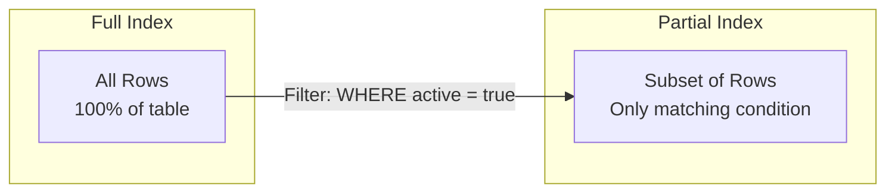
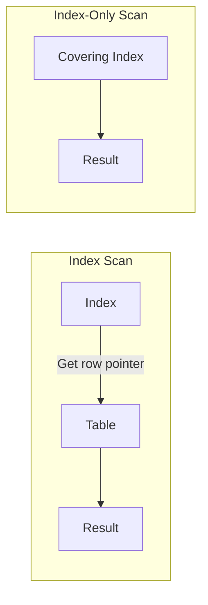
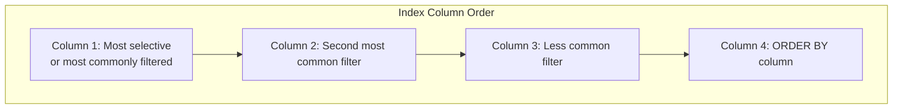

Beyond basic B-Tree and specialized indexes, databases offer advanced indexing techniques to optimize specific query patterns and reduce storage overhead.

## Partial Indexes

Partial indexes index only a subset of rows, based on a WHERE condition.



<Tabs items={['Basics', 'Common Patterns', 'Benefits']}>
<Tab value="Basics">
```sql
-- Index only active users
CREATE INDEX idx_active_users ON users(email)
WHERE status = 'active';

-- Index only recent orders
CREATE INDEX idx_recent_orders ON orders(customer_id)
WHERE created_at > '2024-01-01';

-- Index only non-null values
CREATE INDEX idx_phone ON customers(phone)
WHERE phone IS NOT NULL;

-- Query must match the partial condition
-- ✅ Uses partial index
SELECT * FROM users WHERE email = 'x@example.com' AND status = 'active';

-- ❌ Cannot use partial index (condition doesn't match)
SELECT * FROM users WHERE email = 'x@example.com';
```
</Tab>
<Tab value="Common Patterns">
```sql
-- Index only unprocessed items
CREATE INDEX idx_pending_orders ON orders(id)
WHERE status = 'pending';

-- Index soft-deleted records separately
CREATE INDEX idx_active_products ON products(category_id)
WHERE deleted_at IS NULL;

-- Index hot data (frequently accessed)
CREATE INDEX idx_recent_logs ON logs(event_type)
WHERE created_at > CURRENT_DATE - INTERVAL '7 days';

-- Index specific enum values
CREATE INDEX idx_vip_customers ON customers(email)
WHERE tier = 'vip';

-- Unique constraint on subset
CREATE UNIQUE INDEX idx_unique_active_email ON users(email)
WHERE status = 'active';
```

<Callout type="info" title="Unique Partial Indexes">
Partial unique indexes allow duplicates in non-indexed rows:
```sql
-- Allow multiple inactive emails, but active must be unique
CREATE UNIQUE INDEX idx_unique_active_email ON users(email)
WHERE status = 'active';
```
</Callout>
</Tab>
<Tab value="Benefits">
### Size Reduction

```sql
-- Full index: All 10 million rows
CREATE INDEX idx_orders_full ON orders(customer_id);
-- Size: 200 MB

-- Partial index: Only pending orders (50,000 rows)
CREATE INDEX idx_orders_pending ON orders(customer_id)
WHERE status = 'pending';
-- Size: 1 MB
```

### Improved Insert Performance

Less rows to index = faster inserts for rows that don't match the condition.

### More Efficient Queries

Smaller index = faster scans, better cache utilization.
</Tab>
</Tabs>

## Covering Indexes (INCLUDE)

Covering indexes include additional columns that aren't part of the index key, enabling index-only scans.



<Tabs items={['PostgreSQL', 'SQL Server', 'When to Use']}>
<Tab value="PostgreSQL">
```sql
-- Include columns not used for searching
CREATE INDEX idx_orders_covering ON orders(customer_id)
INCLUDE (total, status, created_at);

-- Query uses index-only scan
EXPLAIN ANALYZE
SELECT total, status FROM orders WHERE customer_id = 123;
-- Output: Index Only Scan using idx_orders_covering

-- All columns in SELECT and WHERE must be in index
-- ❌ Cannot use index-only scan (name not included)
SELECT name FROM orders WHERE customer_id = 123;
```
</Tab>
<Tab value="SQL Server">
```sql
-- SQL Server: INCLUDE clause
CREATE INDEX idx_orders_covering ON orders(customer_id)
INCLUDE (total, status, created_at);

-- Filtered covering index
CREATE INDEX idx_active_orders ON orders(customer_id)
INCLUDE (total, status)
WHERE status = 'active';
```
</Tab>
<Tab value="When to Use">
### ✅ Use Covering Indexes When:

| Scenario | Example |
|----------|---------|
| Frequent SELECT of few columns | Dashboard queries |
| Avoiding table lookups | High-performance reads |
| Index-only aggregations | `SELECT COUNT(*), SUM(total)` |

### ❌ Avoid When:

| Scenario | Reason |
|----------|--------|
| Many included columns | Large index size |
| Frequent updates to included columns | Index maintenance overhead |
| Included columns are wide | Memory/storage cost |

```sql
-- Check if query uses index-only scan
EXPLAIN (ANALYZE, BUFFERS)
SELECT total, status FROM orders WHERE customer_id = 123;

-- Look for:
-- "Index Only Scan" (PostgreSQL)
-- "Index Seek + Key Lookup" vs "Index Seek only" (SQL Server)
```
</Tab>
</Tabs>

## Expression Indexes

Index the result of an expression or function rather than a column directly.

<Tabs items={['Basic Expressions', 'Function Indexes', 'JSON Expressions']}>
<Tab value="Basic Expressions">
```sql
-- Index on lowercase email
CREATE INDEX idx_email_lower ON users(LOWER(email));

-- Query must use same expression
SELECT * FROM users WHERE LOWER(email) = 'user@example.com';

-- Index on date part
CREATE INDEX idx_order_year ON orders(EXTRACT(YEAR FROM created_at));

-- Query
SELECT * FROM orders WHERE EXTRACT(YEAR FROM created_at) = 2024;

-- Index on computed value
CREATE INDEX idx_order_total ON order_items(quantity * price);

-- Query
SELECT * FROM order_items WHERE quantity * price > 1000;
```
</Tab>
<Tab value="Function Indexes">
```sql
-- Index on custom function result
CREATE FUNCTION get_domain(email TEXT) RETURNS TEXT AS $$
    SELECT split_part(email, '@', 2);
$$ LANGUAGE SQL IMMUTABLE;

CREATE INDEX idx_email_domain ON users(get_domain(email));

-- Query by domain
SELECT * FROM users WHERE get_domain(email) = 'gmail.com';

-- IMMUTABLE requirement
-- Function MUST be IMMUTABLE (same input = same output always)
-- STABLE and VOLATILE functions cannot be indexed
```

<Callout type="warn" title="Function Immutability">
Only IMMUTABLE functions can be used in expression indexes. The function must always return the same result for the same input.
</Callout>
</Tab>
<Tab value="JSON Expressions">
```sql
-- Index specific JSON path
CREATE INDEX idx_user_email ON users((data->>'email'));
CREATE INDEX idx_user_age ON users(((data->>'age')::int));

-- Query
SELECT * FROM users WHERE data->>'email' = 'user@example.com';
SELECT * FROM users WHERE (data->>'age')::int > 21;

-- Index nested JSON
CREATE INDEX idx_address_city ON users((data->'address'->>'city'));

-- Query
SELECT * FROM users WHERE data->'address'->>'city' = 'New York';
```
</Tab>
</Tabs>

## Unique Indexes

<Tabs items={['Basic Unique', 'Partial Unique', 'Expression Unique']}>
<Tab value="Basic Unique">
```sql
-- Unique index
CREATE UNIQUE INDEX idx_users_email ON users(email);

-- Composite unique
CREATE UNIQUE INDEX idx_user_tenant ON users(tenant_id, email);

-- Equivalent to UNIQUE constraint
ALTER TABLE users ADD CONSTRAINT unique_email UNIQUE (email);
```
</Tab>
<Tab value="Partial Unique">
```sql
-- Unique only for active records
CREATE UNIQUE INDEX idx_active_email ON users(email)
WHERE status = 'active';

-- Allows: inactive users with duplicate emails
-- Prevents: active users with duplicate emails

-- Unique only for non-null
CREATE UNIQUE INDEX idx_unique_phone ON users(phone)
WHERE phone IS NOT NULL;
```
</Tab>
<Tab value="Expression Unique">
```sql
-- Case-insensitive unique
CREATE UNIQUE INDEX idx_email_unique_ci ON users(LOWER(email));

-- Prevents both 'User@Example.com' and 'user@example.com'

-- Unique on computed value
CREATE UNIQUE INDEX idx_unique_full_name 
ON users((first_name || ' ' || last_name));
```
</Tab>
</Tabs>

## Multi-Column Index Strategies



<Steps>
<Step>
### Leftmost Prefix Rule
Index (A, B, C) can efficiently serve queries on:
- A
- A, B
- A, B, C

But NOT efficiently on:
- B alone
- C alone
- B, C
</Step>
<Step>
### Equality Before Range
Put equality conditions before range conditions.

```sql
-- For query: WHERE status = 'active' AND created_at > '2024-01-01'
-- ✅ Good: (status, created_at)
CREATE INDEX idx_orders ON orders(status, created_at);

-- ❌ Less optimal: (created_at, status)
-- Range on first column limits use of second
```
</Step>
<Step>
### High Cardinality First
Put more selective columns first for better filtering.

```sql
-- user_id has high cardinality, status has low cardinality
-- ✅ More selective first
CREATE INDEX idx_orders ON orders(user_id, status);
```
</Step>
<Step>
### Consider Query Variations
Sometimes multiple indexes are better than one composite.

```sql
-- If you query by A, by B, and by A+B:
CREATE INDEX idx_a ON t(a);
CREATE INDEX idx_b ON t(b);
-- Database can combine with bitmap scan
```
</Step>
</Steps>

## Database-Specific Features

<Tabs items={['PostgreSQL', 'MySQL', 'SQL Server']}>
<Tab value="PostgreSQL">
```sql
-- BRIN (Block Range INdex) for large sorted tables
CREATE INDEX idx_logs_time ON logs USING BRIN (created_at);
-- Very small, great for append-only tables

-- SP-GiST for partitioned spaces
CREATE INDEX idx_ip ON networks USING SPGIST (ip_range inet_ops);

-- Bloom filter index
CREATE EXTENSION bloom;
CREATE INDEX idx_bloom ON t USING BLOOM (a, b, c);
-- Good for many-column equality searches

-- Concurrent index creation
CREATE INDEX CONCURRENTLY idx_email ON users(email);

-- Index with specific collation
CREATE INDEX idx_name ON users(name COLLATE "C");
```
</Tab>
<Tab value="MySQL">
```sql
-- Descending index (MySQL 8.0+)
CREATE INDEX idx_created ON orders(created_at DESC);

-- Functional index (MySQL 8.0.13+)
CREATE INDEX idx_email_lower ON users((LOWER(email)));

-- Invisible index (for testing)
ALTER TABLE users ALTER INDEX idx_email INVISIBLE;
-- Query won't use it, but it's still maintained

-- Prefix index for large columns
CREATE INDEX idx_description ON products(description(100));

-- InnoDB: Primary key is clustered
-- Secondary indexes include primary key automatically
```
</Tab>
<Tab value="SQL Server">
```sql
-- Columnstore index (for analytics)
CREATE NONCLUSTERED COLUMNSTORE INDEX idx_cs
ON orders(customer_id, total, created_at);

-- Filtered index
CREATE INDEX idx_pending ON orders(customer_id)
WHERE status = 'pending';

-- Index with online rebuild
ALTER INDEX idx_email ON users REBUILD WITH (ONLINE = ON);

-- Compressed index
CREATE INDEX idx_email ON users(email)
WITH (DATA_COMPRESSION = PAGE);

-- Computed column index
ALTER TABLE orders ADD total_with_tax AS (total * 1.1);
CREATE INDEX idx_total_tax ON orders(total_with_tax);
```
</Tab>
</Tabs>

## Index Maintenance

<Accordions>
<Accordion title="Monitoring Index Health">
```sql
-- PostgreSQL: Check index bloat
SELECT 
    schemaname || '.' || relname AS table,
    indexrelname AS index,
    pg_size_pretty(pg_relation_size(indexrelid)) AS size,
    idx_scan AS scans,
    idx_tup_read AS tuples_read,
    idx_tup_fetch AS tuples_fetched
FROM pg_stat_user_indexes
ORDER BY pg_relation_size(indexrelid) DESC;

-- Find unused indexes
SELECT indexrelname, idx_scan
FROM pg_stat_user_indexes
WHERE idx_scan = 0 AND indexrelname NOT LIKE 'pg_%';
```
</Accordion>
<Accordion title="Rebuilding Indexes">
```sql
-- PostgreSQL: Concurrent reindex
REINDEX INDEX CONCURRENTLY idx_name;
REINDEX TABLE CONCURRENTLY table_name;

-- MySQL: Optimize table (rebuilds indexes)
OPTIMIZE TABLE table_name;

-- SQL Server: Rebuild with online option
ALTER INDEX idx_name ON table_name REBUILD WITH (ONLINE = ON);
ALTER INDEX ALL ON table_name REBUILD;
```
</Accordion>
<Accordion title="Analyzing Index Usage">
```sql
-- PostgreSQL: Reset statistics
SELECT pg_stat_reset();

-- Run your workload, then check usage
SELECT indexrelname, idx_scan, idx_tup_read
FROM pg_stat_user_indexes
ORDER BY idx_scan DESC;

-- MySQL: Index usage stats
SELECT * FROM sys.schema_index_statistics
WHERE table_schema = 'your_database';

-- SQL Server: Missing index suggestions
SELECT * FROM sys.dm_db_missing_index_details;
```
</Accordion>
</Accordions>

## Best Practices Summary

<Callout type="info" title="Index Design Guidelines">
1. **Start with query patterns** - Index based on actual queries
2. **Use EXPLAIN** - Verify indexes are being used
3. **Monitor usage** - Remove unused indexes
4. **Consider writes** - More indexes = slower writes
5. **Partial for subsets** - Don't index what you don't query
6. **Covering for reads** - Include columns to avoid lookups
7. **Expression for transformations** - Index computed values
8. **Maintain regularly** - Rebuild bloated indexes
</Callout>

## Next Steps

<Cards>
  <Card title="Query Optimization" href="/docs/sql/query-optimization" description="Use indexes effectively in queries" />
  <Card title="PostgreSQL Guide" href="/docs/sql/postgresql" description="PostgreSQL-specific indexing" />
</Cards>
