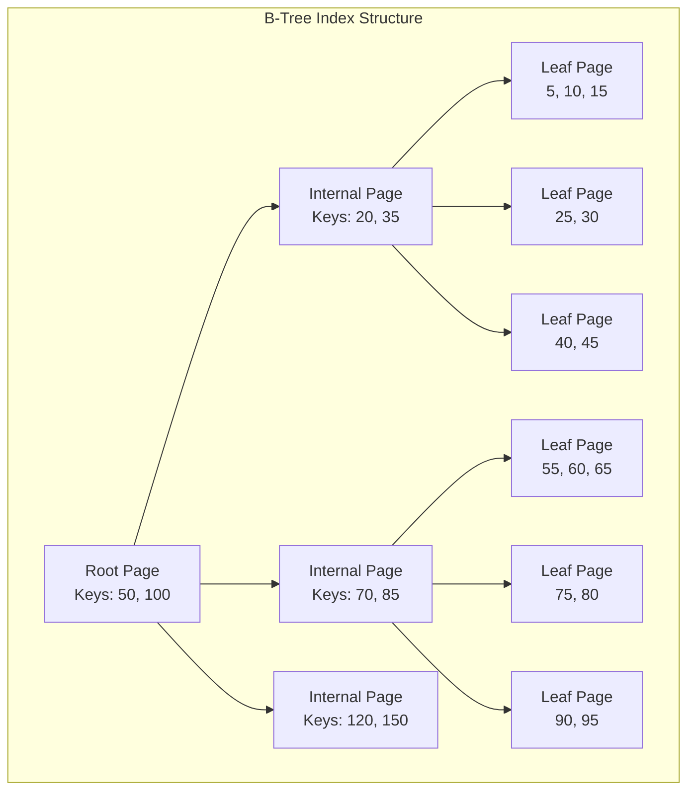
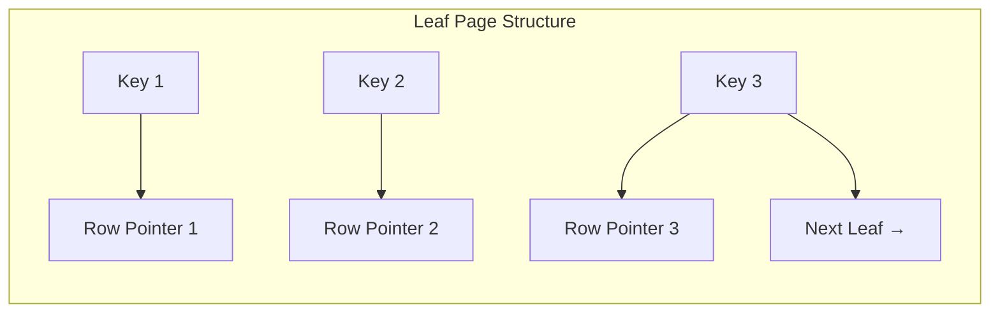
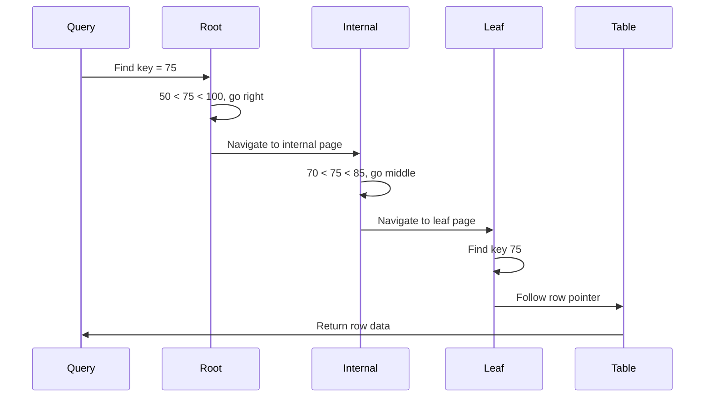
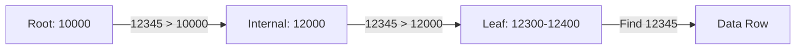
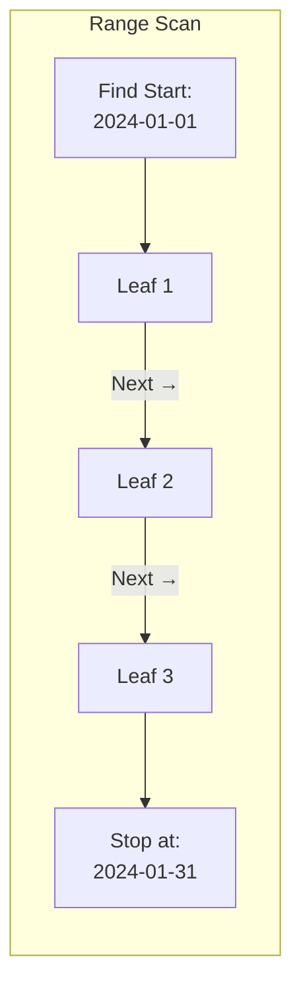
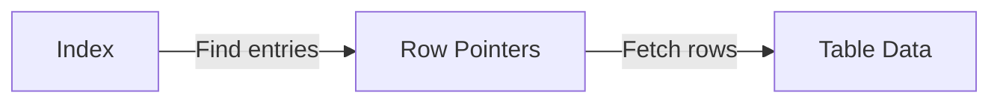
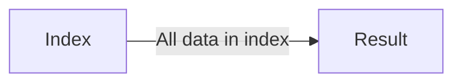
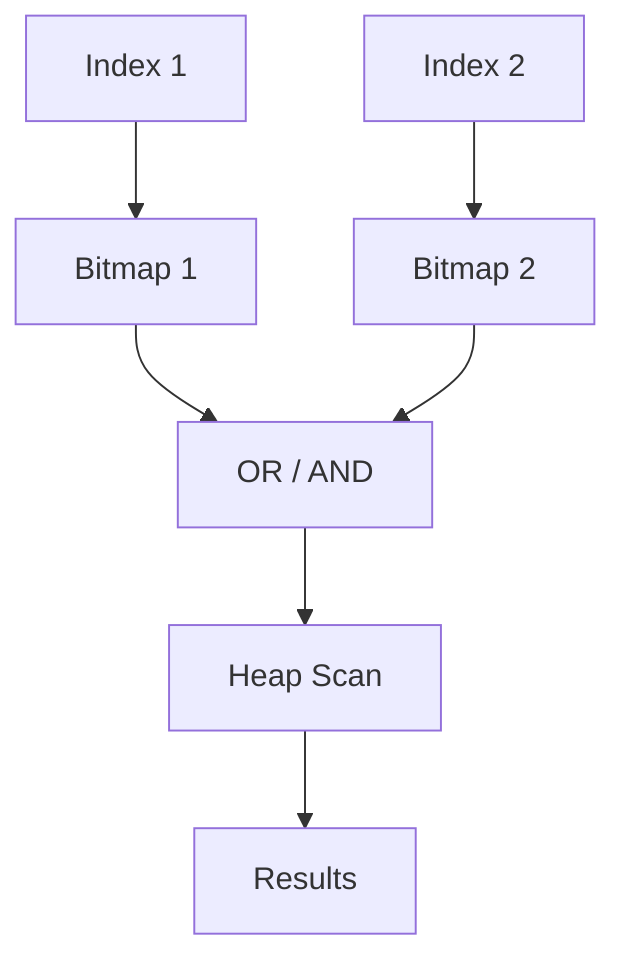
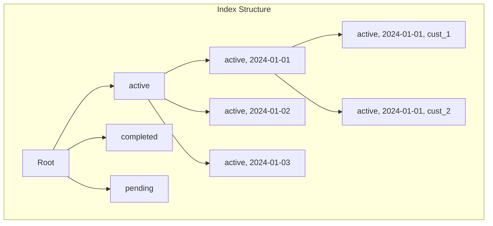

B-Tree (Balanced Tree) indexes are the default and most versatile index type in relational databases. Understanding how they work is essential for writing performant queries.

## B-Tree Structure



### Key Properties

<Tabs items={['Structure', 'Operations', 'Complexity']}>
<Tab value="Structure">
| Component | Description |
|-----------|-------------|
| **Root Page** | Top of the tree, entry point for all searches |
| **Internal Pages** | Navigation nodes, contain keys and child pointers |
| **Leaf Pages** | Contain actual index entries and row pointers |
| **Keys** | Indexed column values, sorted within each page |
| **Pointers** | References to child pages or table rows |


</Tab>
<Tab value="Operations">
### Search Operation



### Insert Operation

1. Search for correct leaf page
2. Insert key in sorted order
3. If page full, split page
4. Propagate splits up the tree if needed

### Delete Operation

1. Search for key in leaf page
2. Remove key
3. If page less than half full, merge with neighbor
4. Propagate merges up if needed
</Tab>
<Tab value="Complexity">
| Operation | Time Complexity | Description |
|-----------|-----------------|-------------|
| Search | O(log n) | Tree height is logarithmic |
| Insert | O(log n) | Find location + possible splits |
| Delete | O(log n) | Find location + possible merges |
| Range Scan | O(log n + k) | Find start + scan k results |

For a table with 1 billion rows:
- B-Tree height ≈ 4-5 levels
- Any lookup requires ≈ 4-5 page reads
- With caching, often just 1-2 disk reads
</Tab>
</Tabs>

## B-Tree Operations in Detail

### Equality Search

```sql
-- Exact match uses B-Tree efficiently
SELECT * FROM users WHERE id = 12345;
```



### Range Scan

```sql
-- B-Tree excels at range queries
SELECT * FROM orders 
WHERE created_at BETWEEN '2024-01-01' AND '2024-01-31';
```



<Callout type="info" title="Leaf Page Linking">
Leaf pages are linked together, allowing efficient range scans without returning to internal pages.
</Callout>

### Prefix Search

```sql
-- LIKE with prefix uses B-Tree
SELECT * FROM products WHERE name LIKE 'Apple%';

-- ❌ Cannot use B-Tree (starts with wildcard)
SELECT * FROM products WHERE name LIKE '%Apple';
```

## Index Scan Types

<Tabs items={['Index Scan', 'Index Only Scan', 'Bitmap Scan', 'Comparison']}>
<Tab value="Index Scan">
```sql
EXPLAIN ANALYZE
SELECT * FROM orders WHERE customer_id = 123;

-- Output:
-- Index Scan using idx_orders_customer on orders
--   Index Cond: (customer_id = 123)
```



**When used:**
- Need columns not in the index
- Relatively few rows returned
- Random access to table is acceptable
</Tab>
<Tab value="Index Only Scan">
```sql
-- All needed columns are in the index
CREATE INDEX idx_covering ON orders(customer_id) INCLUDE (total, status);

EXPLAIN ANALYZE
SELECT total, status FROM orders WHERE customer_id = 123;

-- Output:
-- Index Only Scan using idx_covering on orders
--   Index Cond: (customer_id = 123)
```



**Benefits:**
- No table access needed
- Much faster than Index Scan
- Requires visibility map for MVCC (PostgreSQL)
</Tab>
<Tab value="Bitmap Scan">
```sql
-- Multiple conditions on different indexes
EXPLAIN ANALYZE
SELECT * FROM orders 
WHERE status = 'active' OR customer_id IN (1, 2, 3);

-- Output:
-- Bitmap Heap Scan on orders
--   Recheck Cond: ((status = 'active') OR (customer_id = ANY('{1,2,3}')))
--   -> BitmapOr
--       -> Bitmap Index Scan on idx_status
--       -> Bitmap Index Scan on idx_customer
```



**When used:**
- Combining multiple indexes
- OR conditions
- Large result sets where random I/O is expensive
</Tab>
<Tab value="Comparison">
| Scan Type | Index Access | Table Access | Best For |
|-----------|--------------|--------------|----------|
| Sequential | None | Full | Small tables, no index |
| Index Scan | Random | Random | Few rows, need all columns |
| Index Only | Random | None | Covered queries |
| Bitmap | Batch | Sequential | Many rows, multiple indexes |

```sql
-- Force specific scan type (PostgreSQL)
SET enable_seqscan = off;
SET enable_indexscan = off;
SET enable_bitmapscan = off;
```
</Tab>
</Tabs>

## Composite B-Tree Indexes

### Column Order Matters

```sql
CREATE INDEX idx_orders ON orders(status, created_at, customer_id);
```



### Usable Query Patterns

```sql
-- ✅ Uses index: All prefix columns
SELECT * FROM orders WHERE status = 'active';
SELECT * FROM orders WHERE status = 'active' AND created_at > '2024-01-01';
SELECT * FROM orders 
WHERE status = 'active' AND created_at > '2024-01-01' AND customer_id = 123;

-- ✅ Uses index for status, then filter
SELECT * FROM orders WHERE status = 'active' AND customer_id = 123;

-- ⚠️ Less efficient: Skip first column
SELECT * FROM orders WHERE created_at > '2024-01-01';

-- ❌ Cannot use index efficiently
SELECT * FROM orders WHERE customer_id = 123;
```

### Ordering and Sorting

```sql
-- Index: (status, created_at DESC)
CREATE INDEX idx_orders_sorted ON orders(status, created_at DESC);

-- ✅ Uses index for ORDER BY
SELECT * FROM orders 
WHERE status = 'active' 
ORDER BY created_at DESC;

-- ✅ Also works
SELECT * FROM orders 
WHERE status = 'active' 
ORDER BY created_at ASC;  -- Backward scan

-- ❌ Cannot use single index
SELECT * FROM orders ORDER BY status ASC, created_at ASC;
-- If index is (status ASC, created_at DESC)
```

## B-Tree Limitations

<Callout type="warn" title="B-Tree Not Suitable For">
- **Full-text search**: Use GIN/GiST indexes instead
- **Pattern matching with leading wildcard**: `LIKE '%search%'`
- **Array containment**: Use GIN
- **Geometric/spatial data**: Use GiST/SP-GiST
- **Very large text columns**: High overhead
</Callout>

```sql
-- ❌ B-Tree cannot help with these
SELECT * FROM docs WHERE content LIKE '%search term%';
SELECT * FROM products WHERE tags @> ARRAY['electronics'];
SELECT * FROM locations WHERE point <-> '(0,0)' < 100;
```

## Performance Optimization

<Steps>
<Step>
### Choose Selective Columns First
Put high-cardinality columns at the beginning of composite indexes.

```sql
-- ✅ Good: customer_id has high cardinality
CREATE INDEX idx_orders ON orders(customer_id, status);

-- ❌ Poor: status has low cardinality
CREATE INDEX idx_orders ON orders(status, customer_id);
```
</Step>
<Step>
### Consider Index-Only Scans
Include frequently accessed columns to avoid table lookups.

```sql
CREATE INDEX idx_orders ON orders(customer_id) 
INCLUDE (total, status, created_at);
```
</Step>
<Step>
### Use Partial Indexes for Subsets
Index only the rows you query.

```sql
-- Only index active orders
CREATE INDEX idx_active_orders ON orders(customer_id) 
WHERE status = 'active';
```
</Step>
<Step>
### Monitor Index Bloat
B-Trees can become bloated after many updates/deletes.

```sql
-- PostgreSQL: Check bloat
SELECT 
    tablename,
    indexname,
    pg_size_pretty(pg_relation_size(indexrelid)) as size
FROM pg_stat_user_indexes
ORDER BY pg_relation_size(indexrelid) DESC;

-- Rebuild bloated index
REINDEX INDEX CONCURRENTLY idx_name;
```
</Step>
</Steps>

## Database-Specific B-Tree Features

<Tabs items={['PostgreSQL', 'MySQL', 'SQL Server']}>
<Tab value="PostgreSQL">
```sql
-- Deduplication (PostgreSQL 13+)
-- Automatically deduplicates duplicate keys

-- INCLUDE columns for covering indexes
CREATE INDEX idx ON orders(customer_id) 
INCLUDE (total, status);

-- Partial indexes
CREATE INDEX idx ON orders(customer_id) 
WHERE status = 'active';

-- Concurrent operations
CREATE INDEX CONCURRENTLY idx ON orders(customer_id);
REINDEX INDEX CONCURRENTLY idx;

-- Collation-specific indexes
CREATE INDEX idx ON users(name COLLATE "C");
```
</Tab>
<Tab value="MySQL">
```sql
-- InnoDB uses clustered index (primary key)
-- Secondary indexes store primary key values

-- Descending indexes (MySQL 8.0+)
CREATE INDEX idx ON orders(created_at DESC);

-- Invisible indexes (for testing)
CREATE INDEX idx ON orders(column) INVISIBLE;
ALTER INDEX idx ON orders INVISIBLE;

-- Prefix indexes for large columns
CREATE INDEX idx ON products(name(50));

-- Index hints
SELECT * FROM orders USE INDEX (idx_customer);
SELECT * FROM orders FORCE INDEX (idx_customer);
```
</Tab>
<Tab value="SQL Server">
```sql
-- Clustered vs Nonclustered
CREATE CLUSTERED INDEX idx ON orders(id);
CREATE NONCLUSTERED INDEX idx ON orders(customer_id);

-- Included columns
CREATE INDEX idx ON orders(customer_id) 
INCLUDE (total, status);

-- Filtered indexes
CREATE INDEX idx ON orders(customer_id) 
WHERE status = 'active';

-- Online index operations
CREATE INDEX idx ON orders(customer_id) 
WITH (ONLINE = ON);

-- Compression
CREATE INDEX idx ON orders(customer_id) 
WITH (DATA_COMPRESSION = PAGE);
```
</Tab>
</Tabs>

## Next Steps

<Cards>
  <Card title="Hash Indexes" href="/docs/sql/indexing/hash" description="When B-Tree isn't the best choice" />
  <Card title="GiST & GIN" href="/docs/sql/indexing/gist-gin" description="Full-text and specialized indexes" />
  <Card title="Query Optimization" href="/docs/sql/query-optimization" description="Using indexes effectively" />
</Cards>
