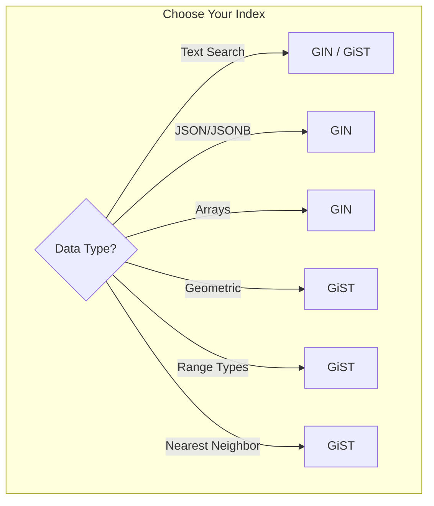
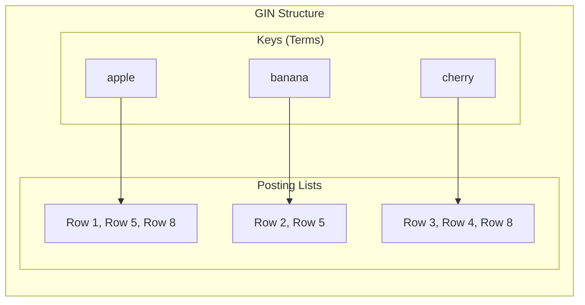
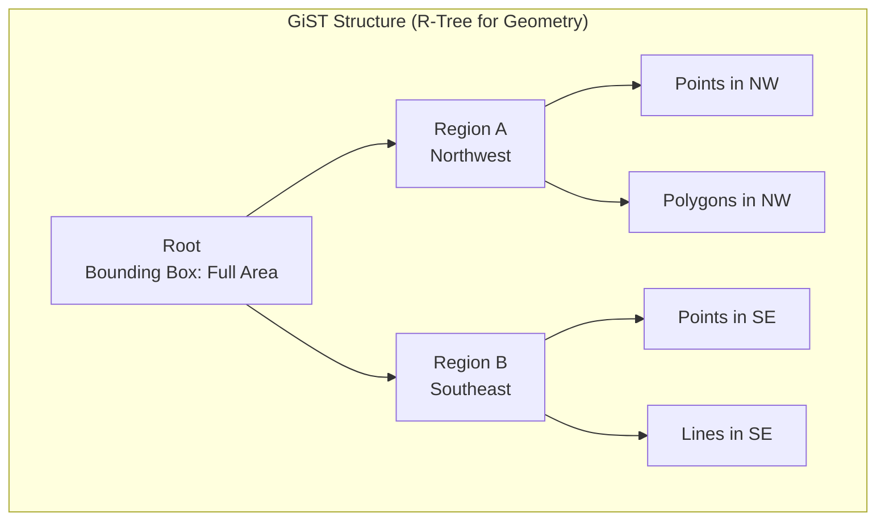
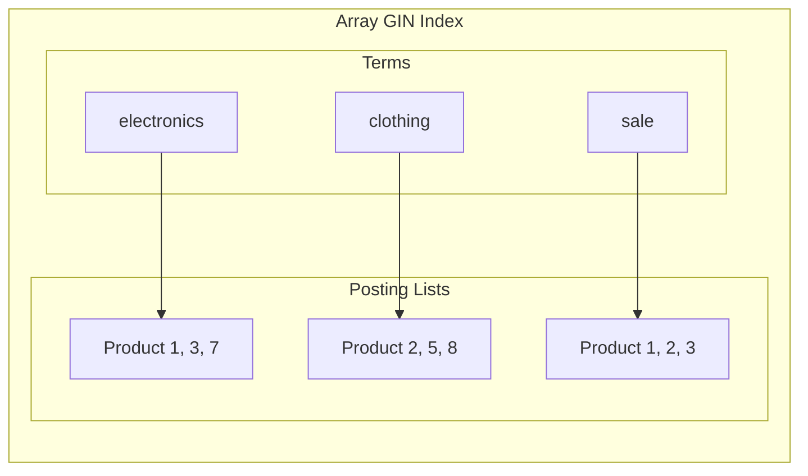

GiST (Generalized Search Tree) and GIN (Generalized Inverted Index) are specialized index types designed for complex data types that B-Tree cannot efficiently handle.

## Index Type Overview



<Tabs items={['GIN Overview', 'GiST Overview', 'Comparison']}>
<Tab value="GIN Overview">
### GIN (Generalized Inverted Index)



**Best for:**
- Full-text search
- Array containment queries
- JSONB queries
- Many keys per row

**Characteristics:**
- Inverted index structure
- Fast lookups for contained elements
- Slower to build/update
- Larger size on disk
</Tab>
<Tab value="GiST Overview">
### GiST (Generalized Search Tree)



**Best for:**
- Geometric/spatial data
- Range types
- Nearest-neighbor searches
- Full-text search (alternative)
- Exclusion constraints

**Characteristics:**
- Tree structure with lossy keys
- Supports complex operators
- Faster to update than GIN
- Smaller than GIN
</Tab>
<Tab value="Comparison">
| Aspect | GIN | GiST |
|--------|-----|------|
| **Structure** | Inverted index | Tree with bounding keys |
| **Build speed** | Slower | Faster |
| **Update speed** | Slower | Faster |
| **Lookup speed** | Faster | Slower |
| **Size** | Larger | Smaller |
| **Full-text** | Preferred | Alternative |
| **Geometry** | Not suitable | Preferred |
| **Arrays** | Preferred | Not suitable |
| **Nearest neighbor** | Not suitable | Preferred |
| **Exact match** | Faster | Slower |

<Callout type="info" title="General Rule">
- **GIN**: When you have many keys per row and exact containment queries
- **GiST**: When you need spatial, range, or nearest-neighbor queries
</Callout>
</Tab>
</Tabs>

## Full-Text Search Indexes

<Tabs items={['PostgreSQL', 'MySQL', 'SQL Server']}>
<Tab value="PostgreSQL">
```sql
-- Create tsvector column for search
ALTER TABLE articles ADD COLUMN search_vector tsvector;

UPDATE articles SET search_vector = 
    to_tsvector('english', coalesce(title, '') || ' ' || coalesce(body, ''));

-- GIN index (recommended for most cases)
CREATE INDEX idx_articles_search_gin 
ON articles USING GIN (search_vector);

-- GiST index (alternative, smaller but slower)
CREATE INDEX idx_articles_search_gist 
ON articles USING GiST (search_vector);

-- Query
SELECT title, ts_rank(search_vector, query) AS rank
FROM articles, to_tsquery('english', 'database & performance') query
WHERE search_vector @@ query
ORDER BY rank DESC;

-- Expression index (no separate column needed)
CREATE INDEX idx_articles_fts ON articles 
USING GIN (to_tsvector('english', title || ' ' || body));
```

<Callout type="info" title="GIN vs GiST for Full-Text">
- **GIN**: 3x faster for lookups, but 3x slower to update
- **GiST**: Faster updates, but slower lookups
- Use GIN for read-heavy workloads, GiST for write-heavy
</Callout>
</Tab>
<Tab value="MySQL">
```sql
-- Full-text index (InnoDB 5.6+)
CREATE FULLTEXT INDEX idx_articles_fulltext 
ON articles(title, body);

-- Query with natural language mode
SELECT *, MATCH(title, body) AGAINST('database performance') AS score
FROM articles
WHERE MATCH(title, body) AGAINST('database performance')
ORDER BY score DESC;

-- Query with boolean mode
SELECT *
FROM articles
WHERE MATCH(title, body) AGAINST('+database +performance -slow' IN BOOLEAN MODE);

-- Query expansion
SELECT *
FROM articles
WHERE MATCH(title, body) AGAINST('database' WITH QUERY EXPANSION);
```
</Tab>
<Tab value="SQL Server">
```sql
-- Create full-text catalog
CREATE FULLTEXT CATALOG ftCatalog AS DEFAULT;

-- Create full-text index
CREATE FULLTEXT INDEX ON articles(title, body)
KEY INDEX PK_articles
ON ftCatalog
WITH STOPLIST = SYSTEM;

-- Query with CONTAINS
SELECT * FROM articles
WHERE CONTAINS((title, body), 'database AND performance');

-- Query with FREETEXT (more flexible)
SELECT * FROM articles
WHERE FREETEXT((title, body), 'database performance optimization');

-- Ranked results
SELECT *, KEY_TBL.RANK
FROM articles
INNER JOIN CONTAINSTABLE(articles, (title, body), 'database') AS KEY_TBL
ON articles.id = KEY_TBL.[KEY]
ORDER BY KEY_TBL.RANK DESC;
```
</Tab>
</Tabs>

## JSON/JSONB Indexes

<Tabs items={['GIN for JSONB', 'Path Operators', 'Expression Indexes']}>
<Tab value="GIN for JSONB">
```sql
-- Full JSONB indexing
CREATE INDEX idx_data_gin ON documents USING GIN (data);

-- Supports these operators:
-- @> containment: '{"a": 1}' @> '{"a": 1}'
-- ? key exists: data ? 'key'
-- ?& all keys exist: data ?& array['a', 'b']
-- ?| any key exists: data ?| array['a', 'b']

-- Query examples
SELECT * FROM documents WHERE data @> '{"status": "active"}';
SELECT * FROM documents WHERE data ? 'email';
SELECT * FROM documents WHERE data ?& array['name', 'email'];
```
</Tab>
<Tab value="Path Operators">
```sql
-- Path operations index (smaller, more specific)
CREATE INDEX idx_data_path ON documents 
USING GIN (data jsonb_path_ops);

-- Only supports @> operator
-- But smaller and faster for containment queries
SELECT * FROM documents WHERE data @> '{"user": {"role": "admin"}}';

-- For specific path queries, use expression index
CREATE INDEX idx_data_status ON documents ((data->>'status'));
SELECT * FROM documents WHERE data->>'status' = 'active';
```
</Tab>
<Tab value="Expression Indexes">
```sql
-- Index specific JSON paths (B-Tree on expression)
CREATE INDEX idx_user_email ON users ((data->>'email'));
CREATE INDEX idx_user_age ON users (((data->>'age')::int));

-- Query efficiently
SELECT * FROM users WHERE data->>'email' = 'user@example.com';
SELECT * FROM users WHERE (data->>'age')::int > 21;

-- GIN on nested path
CREATE INDEX idx_tags ON products USING GIN ((data->'tags'));
SELECT * FROM products WHERE data->'tags' @> '"electronics"';
```
</Tab>
</Tabs>

## Array Indexes

```sql
-- GIN index on array column
CREATE INDEX idx_tags ON products USING GIN (tags);

-- Array operators supported
SELECT * FROM products WHERE tags @> ARRAY['electronics'];  -- Contains
SELECT * FROM products WHERE tags && ARRAY['sale', 'new'];  -- Overlaps
SELECT * FROM products WHERE tags <@ ARRAY['a', 'b', 'c'];  -- Contained by

-- GIN with specific operator class
CREATE INDEX idx_tags_ops ON products 
USING GIN (tags array_ops);
```



## Geometric/Spatial Indexes

<Tabs items={['Point Queries', 'Range Queries', 'PostGIS']}>
<Tab value="Point Queries">
```sql
-- GiST index for point data
CREATE INDEX idx_location ON places USING GiST (location);

-- Nearest neighbor (k-NN)
SELECT name, location <-> point(40.7128, -74.0060) AS distance
FROM places
ORDER BY location <-> point(40.7128, -74.0060)
LIMIT 10;

-- Within bounding box
SELECT * FROM places
WHERE location <@ box(point(40, -75), point(41, -73));

-- Distance within radius
SELECT * FROM places
WHERE location <-> point(40.7128, -74.0060) < 0.1;
```
</Tab>
<Tab value="Range Queries">
```sql
-- GiST for range types
CREATE TABLE reservations (
    id SERIAL PRIMARY KEY,
    room_id INT,
    during TSTZRANGE  -- timestamp range
);

CREATE INDEX idx_reservations_during 
ON reservations USING GiST (during);

-- Overlap query
SELECT * FROM reservations
WHERE during && tstzrange('2024-01-15', '2024-01-20');

-- Contains
SELECT * FROM reservations
WHERE during @> '2024-01-16 14:00:00'::timestamptz;

-- Exclusion constraint (no overlapping reservations)
ALTER TABLE reservations ADD CONSTRAINT no_overlap
EXCLUDE USING GiST (room_id WITH =, during WITH &&);
```
</Tab>
<Tab value="PostGIS">
```sql
-- PostGIS spatial index
CREATE INDEX idx_geom ON geographic_data USING GiST (geom);

-- Find points within polygon
SELECT * FROM points
WHERE ST_Within(geom, ST_GeomFromText('POLYGON((...))', 4326));

-- Find nearest neighbors
SELECT name, ST_Distance(geom, ST_MakePoint(-74.006, 40.7128)) AS dist
FROM places
ORDER BY geom <-> ST_MakePoint(-74.006, 40.7128)
LIMIT 10;

-- Find within distance (meters)
SELECT * FROM places
WHERE ST_DWithin(
    geom, 
    ST_SetSRID(ST_MakePoint(-74.006, 40.7128), 4326),
    1000  -- 1000 meters
);
```
</Tab>
</Tabs>

## Performance Tuning

<Tabs items={['GIN Tuning', 'GiST Tuning', 'Maintenance']}>
<Tab value="GIN Tuning">
```sql
-- Fast update mode (PostgreSQL)
-- Trades query speed for faster inserts
CREATE INDEX idx_fts ON articles USING GIN (search_vector)
WITH (fastupdate = on);  -- Default is on

-- gin_pending_list_limit controls pending list size
ALTER INDEX idx_fts SET (gin_pending_list_limit = 1024);

-- Disable fast update for read-heavy workloads
CREATE INDEX idx_fts ON articles USING GIN (search_vector)
WITH (fastupdate = off);

-- Check pending tuples
SELECT * FROM pg_stat_user_indexes WHERE indexrelname = 'idx_fts';
```
</Tab>
<Tab value="GiST Tuning">
```sql
-- Fillfactor for GiST
CREATE INDEX idx_geom ON places USING GiST (location)
WITH (fillfactor = 90);

-- Buffered builds for large tables
SET maintenance_work_mem = '1GB';
CREATE INDEX idx_geom ON large_table USING GiST (geom);

-- siglen for signature length (affects selectivity vs size)
CREATE INDEX idx_trgm ON texts USING GiST (content gist_trgm_ops(siglen=32));
```
</Tab>
<Tab value="Maintenance">
```sql
-- VACUUM to update visibility map
VACUUM ANALYZE table_name;

-- REINDEX bloated indexes
REINDEX INDEX CONCURRENTLY idx_fts;

-- Monitor index size
SELECT 
    indexrelname,
    pg_size_pretty(pg_relation_size(indexrelid)) as size,
    idx_scan,
    idx_tup_read
FROM pg_stat_user_indexes
WHERE indexrelname LIKE '%gin%' OR indexrelname LIKE '%gist%'
ORDER BY pg_relation_size(indexrelid) DESC;
```
</Tab>
</Tabs>

## Choosing the Right Index

<Steps>
<Step>
### Identify Your Query Pattern
What operators do you use most?

| Operator | Recommended Index |
|----------|------------------|
| `@@` (text search) | GIN (read-heavy) / GiST (write-heavy) |
| `@>`, `?`, `?&`, `?|` (JSON) | GIN |
| `@>`, `&&`, `<@` (arrays) | GIN |
| `<->` (nearest neighbor) | GiST |
| `&&` (range overlap) | GiST |
| `@>` (geometric containment) | GiST |
</Step>
<Step>
### Consider Write vs Read Ratio
- **Read-heavy**: Use GIN
- **Write-heavy**: Use GiST
- **Balanced**: Benchmark both
</Step>
<Step>
### Account for Size Constraints
GIN indexes are typically 2-3x larger than GiST.
</Step>
<Step>
### Test Performance
Always benchmark with real data and queries.

```sql
EXPLAIN (ANALYZE, BUFFERS)
SELECT * FROM articles 
WHERE search_vector @@ to_tsquery('database');
```
</Step>
</Steps>

## Summary Table

| Data Type | Recommended Index | Operators |
|-----------|------------------|-----------|
| tsvector (full-text) | GIN (reads) / GiST (writes) | `@@` |
| jsonb | GIN | `@>`, `?`, `?&`, `?|` |
| array | GIN | `@>`, `&&`, `<@` |
| geometry (point) | GiST | `<->`, `<@`, `~=` |
| geometry (polygon) | GiST | `&&`, `@>`, `<@` |
| range types | GiST | `&&`, `@>`, `<@`, `-|-` |
| trigram | GIN / GiST | `%`, `<->` |

## Next Steps

<Cards>
  <Card title="Advanced Indexes" href="/docs/sql/indexing/advanced" description="Partial, covering, and expression indexes" />
  <Card title="Query Optimization" href="/docs/sql/query-optimization" description="Using indexes effectively" />
</Cards>
