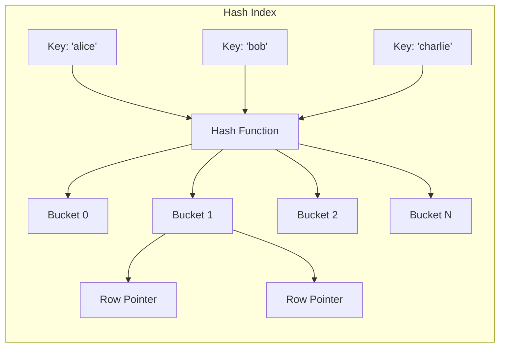
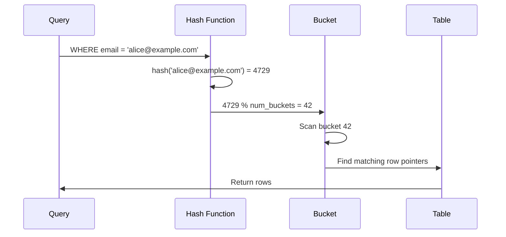
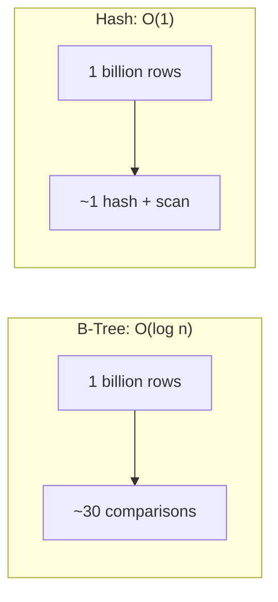
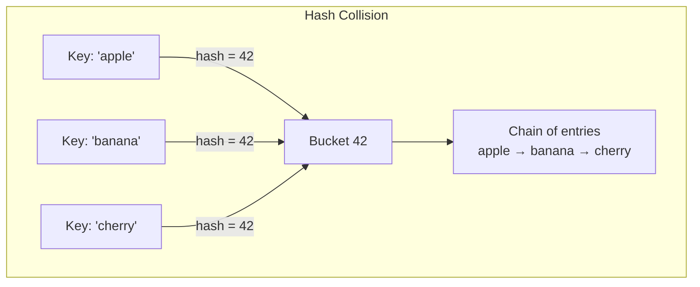

Hash indexes use a hash function to map keys to bucket locations, providing O(1) average-case lookups for equality comparisons.

## How Hash Indexes Work



### Hash Function Process



## Creating Hash Indexes

<Tabs items={['PostgreSQL', 'MySQL', 'SQL Server']}>
<Tab value="PostgreSQL">
```sql
-- Create hash index
CREATE INDEX idx_users_email_hash ON users USING HASH (email);

-- PostgreSQL 10+: Hash indexes are WAL-logged and crash-safe
-- Before PostgreSQL 10: Hash indexes were not recommended

-- Check index type
SELECT indexname, indexdef 
FROM pg_indexes 
WHERE tablename = 'users';
```

<Callout type="info" title="PostgreSQL Hash Index History">
Before PostgreSQL 10, hash indexes were not WAL-logged and could be corrupted after a crash. 
Since PostgreSQL 10, they are fully supported and safe to use.
</Callout>
</Tab>
<Tab value="MySQL">
```sql
-- MySQL: Hash indexes only available in MEMORY storage engine
CREATE TABLE users_memory (
    id INT PRIMARY KEY,
    email VARCHAR(255),
    INDEX USING HASH (email)
) ENGINE = MEMORY;

-- InnoDB uses adaptive hash index internally (automatic)
-- Show adaptive hash index status
SHOW ENGINE INNODB STATUS;

-- Cannot explicitly create hash index on InnoDB tables
-- InnoDB automatically creates adaptive hash indexes for frequently accessed pages
```

<Callout type="warn" title="MySQL InnoDB">
InnoDB doesn't support explicit hash indexes. It uses an internal "adaptive hash index" 
that automatically creates hash-like structures for hot data.
</Callout>
</Tab>
<Tab value="SQL Server">
```sql
-- SQL Server: Hash indexes for memory-optimized tables only
CREATE TABLE users_memory
(
    id INT NOT NULL PRIMARY KEY NONCLUSTERED HASH WITH (BUCKET_COUNT = 100000),
    email NVARCHAR(255) NOT NULL INDEX idx_email HASH WITH (BUCKET_COUNT = 100000)
) WITH (MEMORY_OPTIMIZED = ON);

-- Bucket count should be 1-2x expected unique values
-- Too few buckets = long chains = slow
-- Too many buckets = wasted memory
```
</Tab>
</Tabs>

## Hash vs B-Tree Comparison

<Tabs items={['Operations', 'Performance', 'Use Cases']}>
<Tab value="Operations">
| Operation | Hash Index | B-Tree Index |
|-----------|------------|--------------|
| Equality `=` | ✅ O(1) average | ✅ O(log n) |
| Range `<`, `>`, `BETWEEN` | ❌ Not supported | ✅ Efficient |
| `LIKE 'prefix%'` | ❌ Not supported | ✅ Efficient |
| `ORDER BY` | ❌ Not supported | ✅ Efficient |
| `MIN()` / `MAX()` | ❌ Full scan needed | ✅ First/last entry |
| `IS NULL` | ❌ Varies by DB | ✅ Supported |

```sql
-- Hash index works perfectly for:
SELECT * FROM users WHERE email = 'alice@example.com';

-- Hash index CANNOT help with:
SELECT * FROM users WHERE email LIKE 'alice%';
SELECT * FROM users WHERE created_at > '2024-01-01';
SELECT * FROM users ORDER BY email;
SELECT MIN(email) FROM users;
```
</Tab>
<Tab value="Performance">


| Metric | Hash | B-Tree |
|--------|------|--------|
| Equality lookup | Faster (O(1)) | Slower (O(log n)) |
| Memory usage | Higher (buckets) | Lower (pages) |
| Insert overhead | Lower | Higher (balancing) |
| Range queries | N/A | Efficient |
| Index size | Usually larger | Usually smaller |

<Callout type="info" title="When the Difference Matters">
For most workloads, B-Tree performance is excellent. Hash indexes provide meaningful 
improvement mainly for:
- Very large tables (billions of rows)
- High-concurrency equality lookups
- No need for range queries on the column
</Callout>
</Tab>
<Tab value="Use Cases">
### ✅ Good for Hash Indexes

```sql
-- Exact email lookups
SELECT * FROM users WHERE email = 'user@example.com';

-- Session token lookup
SELECT * FROM sessions WHERE token = 'abc123xyz';

-- UUID primary key lookups
SELECT * FROM entities WHERE uuid = 'a1b2c3d4-...';

-- High-cardinality equality checks
SELECT * FROM logs WHERE request_id = '12345';
```

### ❌ Not Suitable for Hash Indexes

```sql
-- Range queries
SELECT * FROM orders WHERE created_at > '2024-01-01';

-- Prefix matching
SELECT * FROM products WHERE sku LIKE 'ABC%';

-- Sorting
SELECT * FROM users ORDER BY email;

-- Low cardinality columns
SELECT * FROM orders WHERE status = 'pending';
```
</Tab>
</Tabs>

## Hash Collisions



When multiple keys hash to the same bucket:
1. All entries stored in the same bucket (chain)
2. Lookup scans the chain to find exact match
3. Too many collisions = degraded performance

<Callout type="warn" title="Bucket Count Matters">
In SQL Server memory-optimized tables, you specify bucket count:
- Too few buckets → Long chains → Slow lookups
- Too many buckets → Wasted memory
- Ideal: 1-2x the number of unique values
</Callout>

## Hash Index Limitations

<Accordions>
<Accordion title="No Range Queries">
```sql
-- ❌ Cannot use hash index
SELECT * FROM products WHERE price > 100;
SELECT * FROM products WHERE price BETWEEN 50 AND 100;

-- Must use B-Tree for range queries
CREATE INDEX idx_price_btree ON products(price);
```
</Accordion>
<Accordion title="No Ordering Support">
```sql
-- ❌ Hash index cannot help with ORDER BY
SELECT * FROM users ORDER BY email;

-- Must perform sort after retrieval
-- B-Tree can return rows in order
```
</Accordion>
<Accordion title="No Partial Matching">
```sql
-- ❌ Hash index cannot help with LIKE
SELECT * FROM products WHERE name LIKE 'Apple%';

-- Hash of 'Apple' ≠ hash of 'Apple iPhone'
-- Must use B-Tree or full-text index
```
</Accordion>
<Accordion title="No Multi-Column Queries">
```sql
-- Hash index on (a, b) only helps with exact (a, b) match
CREATE INDEX idx_hash ON t USING HASH (a, b);

-- ❌ Cannot use for just column 'a'
SELECT * FROM t WHERE a = 1;

-- ✅ Only works for both columns
SELECT * FROM t WHERE a = 1 AND b = 2;
```
</Accordion>
</Accordions>

## When to Use Hash Indexes

<Steps>
<Step>
### High-Volume Equality Lookups
When you have millions of exact-match queries per second.

```sql
-- Session/token lookups
SELECT * FROM sessions WHERE token = ?;

-- User authentication
SELECT * FROM users WHERE api_key = ?;
```
</Step>
<Step>
### Very Large Tables
When B-Tree depth becomes a bottleneck.

```sql
-- Tables with billions of rows
-- Hash: O(1) vs B-Tree: O(log n)
-- At 1 billion rows: 1 vs ~30 comparisons
```
</Step>
<Step>
### Memory-Optimized Scenarios
In-memory databases where hash indexes shine.

```sql
-- SQL Server In-Memory OLTP
-- Redis-like caching patterns
```
</Step>
<Step>
### No Range Query Requirements
Only when you're certain you'll never need range queries.
</Step>
</Steps>

## Practical Recommendations

<Callout type="info" title="General Guidance">
**For most use cases, B-Tree indexes are the better choice** because:
1. They support all query types
2. Performance difference is usually negligible
3. They're more flexible for future query patterns
4. They're better supported across databases

**Consider hash indexes only when:**
1. You have measured B-Tree performance as a bottleneck
2. You only need equality lookups
3. Your database fully supports hash indexes
4. You understand the maintenance implications
</Callout>

## Database Support Summary

| Database | Hash Index Support | Notes |
|----------|-------------------|-------|
| PostgreSQL | ✅ Full (10+) | `USING HASH`, WAL-logged since v10 |
| MySQL | ⚠️ MEMORY only | InnoDB uses adaptive hash internally |
| SQL Server | ⚠️ In-Memory only | Memory-optimized tables only |
| SQLite | ❌ Not supported | B-Tree only |
| Oracle | ❌ Not supported | Cluster tables only |

## Next Steps

<Cards>
  <Card title="GiST & GIN Indexes" href="/docs/sql/indexing/gist-gin" description="Full-text search and specialized data types" />
  <Card title="Advanced Indexes" href="/docs/sql/indexing/advanced" description="Partial, covering, and expression indexes" />
</Cards>
