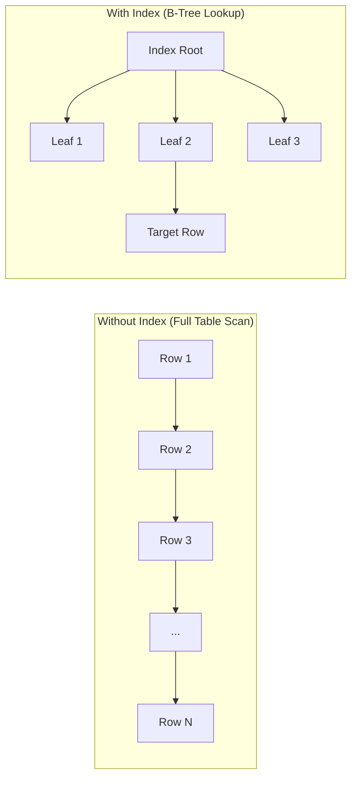
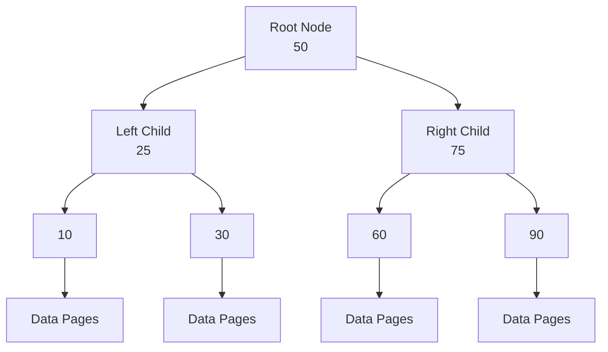
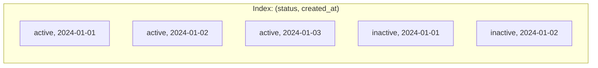

Indexes are database structures that improve query performance by allowing faster data retrieval. Like a book's index, they help the database find data without scanning every row.

## How Indexes Work



**Without an index**, the database performs a full table scan—checking every row.
**With an index**, the database uses a data structure to quickly locate the target rows.

## Index Types Overview

<Cards>
  <Card title="B-Tree Indexes" href="/docs/sql/indexing/btree" description="Default index type, great for equality and range queries" />
  <Card title="Hash Indexes" href="/docs/sql/indexing/hash" description="Optimized for equality comparisons only" />
  <Card title="GiST & GIN Indexes" href="/docs/sql/indexing/gist-gin" description="Full-text search and geometric data" />
  <Card title="Partial & Covering" href="/docs/sql/indexing/advanced" description="Partial indexes, covering indexes, and expression indexes" />
</Cards>

## Quick Reference

<Tabs items={['When to Index', 'When NOT to Index', 'Common Patterns']}>
<Tab value="When to Index">
### ✅ Add Indexes For

| Scenario | Example |
|----------|---------|
| **Primary keys** | Always indexed automatically |
| **Foreign keys** | `customer_id` in `orders` table |
| **WHERE clause columns** | `WHERE status = 'active'` |
| **JOIN conditions** | `ON orders.customer_id = customers.id` |
| **ORDER BY columns** | `ORDER BY created_at DESC` |
| **GROUP BY columns** | `GROUP BY category_id` |
| **Unique constraints** | `UNIQUE(email)` |
| **Frequently filtered data** | Status, date ranges, active flags |
</Tab>
<Tab value="When NOT to Index">
### ❌ Avoid Indexes For

| Scenario | Reason |
|----------|--------|
| **Small tables** | Full scan is faster than index lookup |
| **Frequently updated columns** | Index maintenance overhead |
| **Low cardinality columns** | Boolean, status with few values |
| **Columns rarely in WHERE** | Index unused, wastes space |
| **Columns with many NULLs** | Unless querying for NULLs |
| **Wide columns** | TEXT, large VARCHAR |
| **Tables with heavy INSERTs** | Slows down write operations |
</Tab>
<Tab value="Common Patterns">
```sql
-- Single-column index
CREATE INDEX idx_users_email ON users(email);

-- Composite index (column order matters!)
CREATE INDEX idx_orders_customer_status 
ON orders(customer_id, status);

-- Partial index (index subset of rows)
CREATE INDEX idx_active_users 
ON users(email) WHERE status = 'active';

-- Covering index (includes all needed columns)
CREATE INDEX idx_orders_covering 
ON orders(customer_id) INCLUDE (total, status);

-- Unique index
CREATE UNIQUE INDEX idx_users_email_unique 
ON users(email);

-- Descending index
CREATE INDEX idx_orders_date_desc 
ON orders(created_at DESC);
```
</Tab>
</Tabs>

## Index Fundamentals

### B-Tree Structure

B-Tree (Balanced Tree) is the default and most common index type:



<Callout type="info" title="B-Tree Properties">
- **Balanced**: All leaf nodes at same depth
- **Sorted**: Keys in order for range scans
- **Logarithmic**: O(log n) lookup time
- **Range-friendly**: Efficient for `<`, `>`, `BETWEEN`
</Callout>

### Composite Index Order

The order of columns in a composite index is crucial:



```sql
-- This index: (status, created_at)
CREATE INDEX idx_orders ON orders(status, created_at);

-- ✅ Uses index (leftmost column first)
SELECT * FROM orders WHERE status = 'active';
SELECT * FROM orders WHERE status = 'active' AND created_at > '2024-01-01';

-- ⚠️ May not use index efficiently (skips leftmost column)
SELECT * FROM orders WHERE created_at > '2024-01-01';

-- ❌ Cannot use for this ordering (column order mismatch)
SELECT * FROM orders ORDER BY created_at, status;
```

<Callout type="warn" title="Leftmost Prefix Rule">
A composite index `(A, B, C)` can be used for:
- Queries on `A` only
- Queries on `A, B`
- Queries on `A, B, C`

But NOT efficiently for:
- Queries on `B` only
- Queries on `C` only
- Queries on `B, C`
</Callout>

## Creating and Managing Indexes

<Tabs items={['CREATE INDEX', 'DROP INDEX', 'REINDEX', 'Analyze']}>
<Tab value="CREATE INDEX">
```sql
-- Basic index
CREATE INDEX idx_name ON table_name(column);

-- Unique index
CREATE UNIQUE INDEX idx_unique ON table_name(column);

-- Composite index
CREATE INDEX idx_composite ON table_name(col1, col2, col3);

-- Partial index
CREATE INDEX idx_partial ON table_name(column) 
WHERE condition;

-- Concurrent creation (PostgreSQL - doesn't block writes)
CREATE INDEX CONCURRENTLY idx_name ON table_name(column);

-- With specific method
CREATE INDEX idx_gin ON table_name USING GIN(column);

-- Include additional columns (PostgreSQL 11+)
CREATE INDEX idx_covering ON table_name(col1) INCLUDE (col2, col3);
```
</Tab>
<Tab value="DROP INDEX">
```sql
-- Drop index
DROP INDEX idx_name;

-- Drop if exists
DROP INDEX IF EXISTS idx_name;

-- PostgreSQL: Concurrent drop
DROP INDEX CONCURRENTLY idx_name;

-- MySQL: Specify table
ALTER TABLE table_name DROP INDEX idx_name;

-- SQL Server
DROP INDEX idx_name ON table_name;
```
</Tab>
<Tab value="REINDEX">
```sql
-- PostgreSQL: Rebuild index
REINDEX INDEX idx_name;

-- Rebuild all indexes on a table
REINDEX TABLE table_name;

-- Rebuild all indexes in database
REINDEX DATABASE database_name;

-- Concurrent reindex (PostgreSQL 12+)
REINDEX INDEX CONCURRENTLY idx_name;

-- MySQL: Analyze and optimize
ANALYZE TABLE table_name;
OPTIMIZE TABLE table_name;

-- SQL Server: Rebuild
ALTER INDEX idx_name ON table_name REBUILD;
ALTER INDEX ALL ON table_name REBUILD;
```
</Tab>
<Tab value="Analyze">
```sql
-- PostgreSQL: Update statistics
ANALYZE table_name;
ANALYZE table_name(column);

-- View index usage
SELECT 
    schemaname,
    tablename,
    indexname,
    idx_scan,
    idx_tup_read,
    idx_tup_fetch
FROM pg_stat_user_indexes
ORDER BY idx_scan DESC;

-- Find unused indexes
SELECT 
    indexrelname AS index_name,
    idx_scan AS times_used
FROM pg_stat_user_indexes
WHERE idx_scan = 0
AND indexrelname NOT LIKE 'pg_%';
```
</Tab>
</Tabs>

## Index Performance Analysis

### EXPLAIN ANALYZE

```sql
-- PostgreSQL
EXPLAIN ANALYZE
SELECT * FROM orders
WHERE customer_id = 123 AND status = 'active';

-- Output interpretation:
-- Index Scan using idx_orders_customer on orders  
--   (cost=0.29..8.31 rows=1 width=48) 
--   (actual time=0.015..0.016 rows=1 loops=1)
--   Index Cond: (customer_id = 123)
--   Filter: (status = 'active')
```

### Scan Types

| Scan Type | Description | Performance |
|-----------|-------------|-------------|
| **Seq Scan** | Full table scan | Slow on large tables |
| **Index Scan** | Uses index, fetches from table | Fast |
| **Index Only Scan** | Uses covering index only | Fastest |
| **Bitmap Scan** | Combines multiple indexes | Good for OR conditions |

## Best Practices

<Steps>
<Step>
### Start with EXPLAIN ANALYZE
Always analyze queries before adding indexes.

```sql
EXPLAIN ANALYZE SELECT * FROM orders WHERE customer_id = 123;
```
</Step>
<Step>
### Index Foreign Keys
JOINs on foreign keys are extremely common.

```sql
CREATE INDEX idx_orders_customer ON orders(customer_id);
CREATE INDEX idx_order_items_order ON order_items(order_id);
```
</Step>
<Step>
### Consider Query Patterns
Design indexes based on your actual queries, not assumptions.
</Step>
<Step>
### Monitor Index Usage
Remove unused indexes—they slow down writes.

```sql
-- Find unused indexes (PostgreSQL)
SELECT indexrelname, idx_scan
FROM pg_stat_user_indexes
WHERE idx_scan < 10;
```
</Step>
<Step>
### Balance Read vs Write Performance
More indexes = faster reads, slower writes.
</Step>
</Steps>

## Database-Specific Guides

<Cards>
  <Card title="PostgreSQL Indexes" href="/docs/sql/postgresql" description="GiST, GIN, BRIN, and advanced features" />
  <Card title="MySQL Indexes" href="/docs/sql/mysql" description="InnoDB clustered indexes, full-text" />
  <Card title="SQL Server Indexes" href="/docs/sql/mssql" description="Columnstore, filtered, and computed" />
</Cards>

## Next Steps

<Cards>
  <Card title="B-Tree Deep Dive" href="/docs/sql/indexing/btree" description="Understanding B-Tree indexes in detail" />
  <Card title="Query Optimization" href="/docs/sql/query-optimization" description="Optimize queries with proper indexing" />
</Cards>
