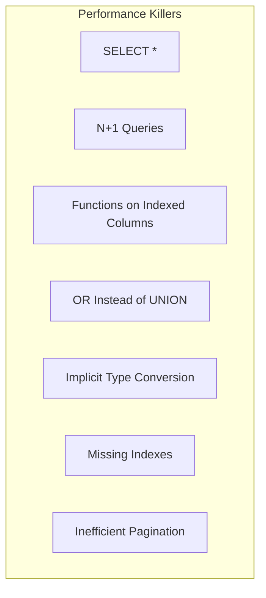
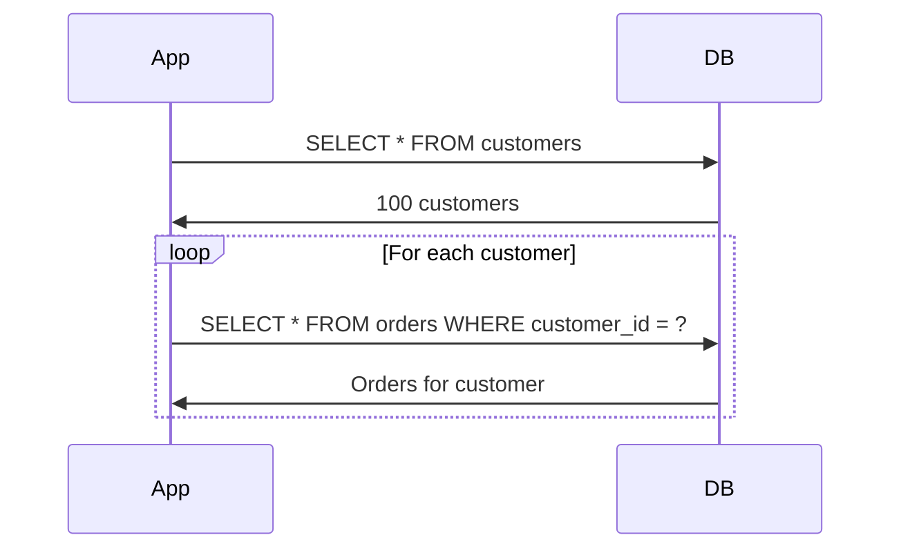
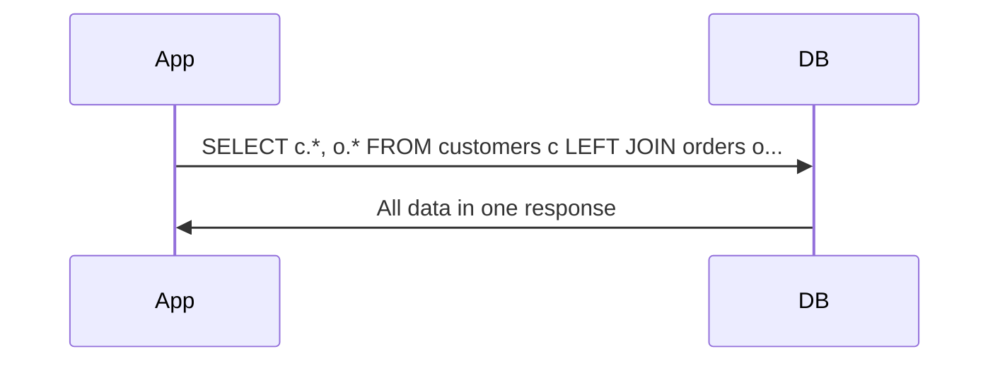
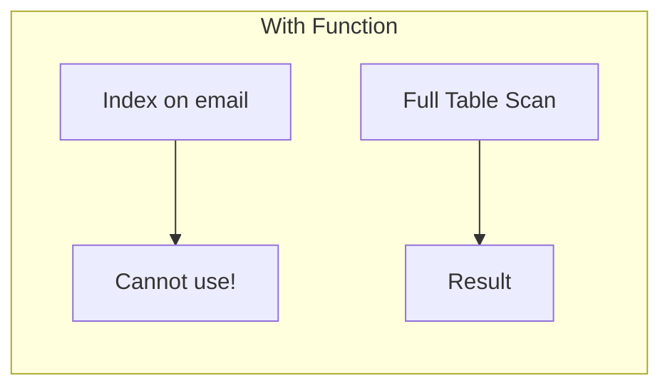
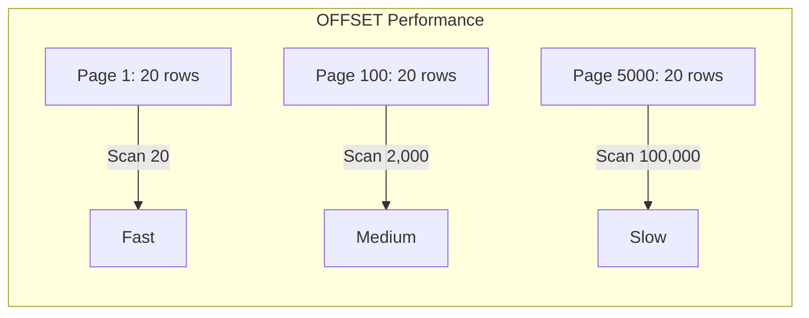

Understanding common SQL anti-patterns helps you write efficient queries from the start. These patterns appear repeatedly in slow-performing applications.

## The Deadly Seven



## 1. SELECT *

<Tabs items={['Problem', 'Solution', 'Impact']}>
<Tab value="Problem">
```sql
SELECT * FROM orders WHERE customer_id = 123; -- [!code error]

-- Why it's bad:
-- 1. Transfers unnecessary data
-- 2. Cannot use index-only scans
-- 3. Breaks if schema changes
-- 4. Includes large TEXT/BLOB columns
```
</Tab>
<Tab value="Solution">
```sql
SELECT id, total, status, created_at -- [!code highlight]
FROM orders
WHERE customer_id = 123;

-- With covering index, enables index-only scan
CREATE INDEX idx_orders_customer ON orders(customer_id) -- [!code ++]
INCLUDE (id, total, status, created_at); -- [!code ++]
```
</Tab>
<Tab value="Impact">
### Performance Difference

| Metric | SELECT * | Specific Columns |
|--------|----------|------------------|
| Data transferred | 100% | 20-50% |
| Memory usage | Higher | Lower |
| Network latency | Higher | Lower |
| Index-only scan | ❌ Never | ✅ Possible |
| Cache efficiency | Poor | Better |
</Tab>
</Tabs>

## 2. N+1 Query Problem

<Tabs items={['Problem', 'Solution', 'Detection']}>
<Tab value="Problem">
```python
# Application code:
customers = query("SELECT * FROM customers LIMIT 100")

for customer in customers: -- [!code error]
    orders = query(f""" -- [!code error]
        SELECT * FROM orders  -- [!code error]
        WHERE customer_id = {customer.id} -- [!code error]
    """) -- [!code error]
    # Process orders...

# Results in 101 queries:
# 1 for customers + 100 for orders
```


</Tab>
<Tab value="Solution">
```sql
-- Solution 1: JOIN
SELECT c.*, o.* -- [!code highlight]
FROM customers c -- [!code highlight]
LEFT JOIN orders o ON c.id = o.customer_id -- [!code highlight]
LIMIT 100;

-- Solution 2: Batch fetch
SELECT * FROM orders
WHERE customer_id IN (1, 2, 3, ... 100); -- [!code highlight]

-- Solution 3: Subquery
SELECT * FROM orders
WHERE customer_id IN ( -- [!code highlight]
    SELECT id FROM customers LIMIT 100 -- [!code highlight]
); -- [!code highlight]
```


</Tab>
<Tab value="Detection">
```sql
-- PostgreSQL: Find repeated queries
SELECT query, calls, mean_time
FROM pg_stat_statements
WHERE query LIKE '%customer_id = $1%'
ORDER BY calls DESC;

-- Look for:
-- - High call counts with similar query patterns
-- - Many queries with different literal values
-- - Sequential query execution patterns

-- MySQL: Enable general log temporarily
SET GLOBAL general_log = 'ON';
-- Check mysql.general_log table
```
</Tab>
</Tabs>

## 3. Functions on Indexed Columns

<Tabs items={['Problem', 'Solution', 'Common Cases']}>
<Tab value="Problem">
```sql
-- Function prevents index usage
SELECT * FROM users WHERE LOWER(email) = 'user@example.com'; -- [!code error]
SELECT * FROM orders WHERE YEAR(created_at) = 2024; -- [!code error]
SELECT * FROM products WHERE CONCAT(category, '-', name) = 'Electronics-Phone'; -- [!code error]
```


</Tab>
<Tab value="Solution">
```sql
-- Solution 1: Store normalized data
UPDATE users SET email = LOWER(email); -- [!code ++]
SELECT * FROM users WHERE email = 'user@example.com'; -- [!code highlight]

-- Solution 2: Expression index
CREATE INDEX idx_email_lower ON users(LOWER(email)); -- [!code ++]
SELECT * FROM users WHERE LOWER(email) = 'user@example.com';

-- Solution 3: Range instead of function
SELECT * FROM orders 
WHERE created_at >= '2024-01-01' -- [!code highlight]
  AND created_at < '2025-01-01'; -- [!code highlight]

-- Solution 4: Generated column
ALTER TABLE products ADD COLUMN full_key -- [!code ++]
  GENERATED ALWAYS AS (CONCAT(category, '-', name)) STORED; -- [!code ++]
CREATE INDEX idx_full_key ON products(full_key); -- [!code ++]
```
</Tab>
<Tab value="Common Cases">
| Anti-pattern | Better Approach |
|--------------|-----------------|
| `YEAR(date) = 2024` | `date >= '2024-01-01' AND date < '2025-01-01'` |
| `LOWER(email)` | Expression index or normalize data |
| `CAST(string AS INT)` | Store as proper type |
| `COALESCE(col, 0) = 0` | `col = 0 OR col IS NULL` |
| `col + 0 = 10` | `col = 10` |
| `SUBSTRING(col, 1, 3)` | Prefix index or separate column |
</Tab>
</Tabs>

## 4. Inefficient OR Conditions

<Tabs items={['Problem', 'Solution', 'When OR is OK']}>
<Tab value="Problem">
```sql
-- OR on different columns prevents optimal index use
SELECT * FROM products
WHERE category_id = 5 OR supplier_id = 10; -- [!code warning]

-- Database might:
-- 1. Do full table scan
-- 2. Do bitmap scans and combine (better)
-- 3. Use neither index efficiently
```
</Tab>
<Tab value="Solution">
```sql
-- Solution 1: UNION ALL (often faster)
SELECT * FROM products WHERE category_id = 5 -- [!code highlight]
UNION ALL -- [!code highlight]
SELECT * FROM products WHERE supplier_id = 10 AND category_id <> 5; -- [!code highlight]

-- Solution 2: UNION (deduplicates)
SELECT * FROM products WHERE category_id = 5
UNION
SELECT * FROM products WHERE supplier_id = 10;

-- Solution 3: Composite index (if pattern is common)
CREATE INDEX idx_category_supplier ON products(category_id, supplier_id); -- [!code ++]
```
</Tab>
<Tab value="When OR is OK">
```sql
-- ✅ OR on same column uses index
SELECT * FROM products
WHERE category_id = 5 OR category_id = 10;
-- Equivalent to: IN (5, 10)

-- ✅ OR with bitmap scans (PostgreSQL)
-- Database can combine multiple index scans
EXPLAIN ANALYZE
SELECT * FROM products
WHERE category_id = 5 OR supplier_id = 10;
-- Look for: BitmapOr with multiple Bitmap Index Scans
```
</Tab>
</Tabs>

## 5. Implicit Type Conversion

<Tabs items={['Problem', 'Solution', 'Detection']}>
<Tab value="Problem">
```sql
-- String compared to integer (Index on customer_id INTEGER)
SELECT * FROM orders WHERE customer_id = '123'; -- [!code error]
-- Database may cast every row's customer_id to string

-- Different string types
SELECT * FROM users WHERE phone = 12345; -- [!code error]
-- phone is VARCHAR

-- Date/timestamp mismatch
SELECT * FROM orders WHERE created_at = '2024-01-01'; -- [!code error]
-- created_at is TIMESTAMP, '2024-01-01' is DATE
```
</Tab>
<Tab value="Solution">
```sql
-- Match types exactly
SELECT * FROM orders WHERE customer_id = 123; -- [!code highlight]

-- Explicit casting
SELECT * FROM users WHERE phone = '12345'; -- [!code highlight]

-- Proper date handling
SELECT * FROM orders 
WHERE created_at >= '2024-01-01 00:00:00'::timestamp -- [!code highlight]
  AND created_at < '2024-01-02 00:00:00'::timestamp; -- [!code highlight]

-- Or use date range with expression index
SELECT * FROM orders 
WHERE created_at::date = '2024-01-01';
```
</Tab>
<Tab value="Detection">
```sql
-- Check column types
\d+ table_name

-- PostgreSQL: Look for implicit casts in EXPLAIN
EXPLAIN ANALYZE SELECT * FROM orders WHERE customer_id = '123';
-- May show: Filter: ((customer_id)::text = '123'::text)

-- Or check for seq scan where index expected
```
</Tab>
</Tabs>

## 6. Missing or Wrong Indexes

<Tabs items={['Problem', 'Solution', 'Finding Missing Indexes']}>
<Tab value="Problem">
```sql
-- No index on frequently filtered column
SELECT * FROM logs WHERE event_type = 'error'; -- [!code error]
-- Full table scan on millions of rows

-- Wrong column order in composite index
-- Index: (status, customer_id)
SELECT * FROM orders WHERE customer_id = 123; -- [!code warning]
-- Cannot efficiently use index (leftmost prefix rule)

-- Too many indexes
-- Every INSERT/UPDATE must maintain all indexes
-- More indexes = slower writes
```
</Tab>
<Tab value="Solution">
```sql
-- Index on filter columns
CREATE INDEX idx_logs_event_type ON logs(event_type); -- [!code ++]

-- Correct column order (query-driven)
-- For: WHERE customer_id = ? AND status = ?
CREATE INDEX idx_orders ON orders(customer_id, status); -- [!code ++]

-- Cover common queries
CREATE INDEX idx_orders_covering ON orders(customer_id) -- [!code ++]
INCLUDE (total, status); -- [!code ++]

-- Partial index for subset
CREATE INDEX idx_active_orders ON orders(customer_id) -- [!code ++]
WHERE status = 'active'; -- [!code ++]
```
</Tab>
<Tab value="Finding Missing Indexes">
```sql
-- PostgreSQL: Find missing indexes
SELECT 
    relname AS table,
    seq_scan,
    seq_tup_read,
    idx_scan,
    seq_tup_read / NULLIF(seq_scan, 0) AS avg_rows_per_scan
FROM pg_stat_user_tables
WHERE seq_scan > 0
ORDER BY seq_tup_read DESC;

-- High seq_tup_read with low idx_scan = missing index

-- MySQL: Analyze table
SHOW INDEX FROM table_name;
EXPLAIN SELECT ...; -- Look for full table scans

-- SQL Server: Missing index DMVs
SELECT * FROM sys.dm_db_missing_index_details;
```
</Tab>
</Tabs>

## 7. Inefficient Pagination

<Tabs items={['Problem', 'Solution', 'Best Practices']}>
<Tab value="Problem">
```sql
-- OFFSET-based pagination degrades with page number
SELECT * FROM products
ORDER BY created_at DESC
LIMIT 20 OFFSET 100000; -- [!code error]

-- Database must:
-- 1. Find 100,020 rows
-- 2. Sort them all
-- 3. Skip 100,000
-- 4. Return 20

-- Page 1: Fast
-- Page 5000: Very slow
```


</Tab>
<Tab value="Solution">
```sql
-- Cursor-based (keyset) pagination
-- First page
SELECT * FROM products
ORDER BY created_at DESC, id DESC
LIMIT 20;

-- Next page (use last row's values)
SELECT * FROM products
WHERE (created_at, id) < ('2024-01-15 10:00:00', 12345) -- [!code highlight]
ORDER BY created_at DESC, id DESC
LIMIT 20;

-- With index: (created_at DESC, id DESC)
-- Always O(1) regardless of page number
CREATE INDEX idx_products_cursor ON products(created_at DESC, id DESC); -- [!code ++]
```
</Tab>
<Tab value="Best Practices">
### Pagination Guidelines

| Scenario | Recommendation |
|----------|---------------|
| Infinite scroll | Cursor-based |
| API pagination | Cursor-based |
| Admin dashboard | Limit max page number |
| Search results | Consider search engine (Elasticsearch) |
| Reports | Export in batches |

```sql
-- ✅ Indexed columns for sorting
CREATE INDEX idx_products_date_id ON products(created_at DESC, id DESC);

-- ✅ Limit maximum offset
SELECT * FROM products
ORDER BY created_at DESC
LIMIT 20 OFFSET LEAST(1000, $offset);  -- Cap at 50 pages

-- ✅ Use estimated counts for UI
SELECT reltuples::bigint AS estimate
FROM pg_class WHERE relname = 'products';
-- Faster than COUNT(*) for display purposes
```
</Tab>
</Tabs>

## More Anti-patterns

<Accordions>
<Accordion title="COUNT(*) for Existence Check">
```sql
-- Counts all matching rows (slow!)
IF (SELECT COUNT(*) FROM orders WHERE customer_id = 123) > 0 THEN -- [!code --]
    -- do something
END IF;

-- Stop at first match
IF EXISTS (SELECT 1 FROM orders WHERE customer_id = 123) THEN -- [!code ++]
    -- do something
END IF;

-- Or use LIMIT
IF (SELECT 1 FROM orders WHERE customer_id = 123 LIMIT 1) IS NOT NULL THEN -- [!code ++]
    -- do something
END IF;
```
</Accordion>
<Accordion title="NOT IN with NULLs">
```sql
-- Returns no results if subquery has NULL!
SELECT * FROM products
WHERE category_id NOT IN ( -- [!code error]
    SELECT category_id FROM discontinued -- May contain NULL! -- [!code error]
); -- [!code error]

-- Exclude NULLs explicitly
SELECT * FROM products
WHERE category_id NOT IN (
    SELECT category_id FROM discontinued WHERE category_id IS NOT NULL -- [!code highlight]
);

-- Or use NOT EXISTS (preferred)
SELECT * FROM products p
WHERE NOT EXISTS ( -- [!code ++]
    SELECT 1 FROM discontinued d WHERE d.category_id = p.category_id -- [!code ++]
); -- [!code ++]
```
</Accordion>
<Accordion title="Correlated Subqueries">
```sql
-- Runs subquery for each row (slow!)
SELECT 
    p.name,
    (SELECT AVG(price) FROM products WHERE category_id = p.category_id) AS avg_price -- [!code error]
FROM products p;

-- Use JOIN with subquery
SELECT 
    p.name,
    c.avg_price
FROM products p
JOIN ( -- [!code highlight]
    SELECT category_id, AVG(price) AS avg_price -- [!code highlight]
    FROM products -- [!code highlight]
    GROUP BY category_id -- [!code highlight]
) c ON p.category_id = c.category_id; -- [!code highlight]

-- Or use window function (best)
SELECT 
    name,
    AVG(price) OVER (PARTITION BY category_id) AS avg_price -- [!code ++]
FROM products;
```
</Accordion>
<Accordion title="DISTINCT Instead of Proper JOINs">
```sql
-- DISTINCT hides a Cartesian product issue
SELECT DISTINCT c.name, c.email -- [!code error]
FROM customers c
JOIN orders o ON c.id = o.customer_id
JOIN order_items oi ON o.id = oi.order_id;
-- Creates huge intermediate result, then deduplicates

-- Use EXISTS if you just need customers with orders
SELECT c.name, c.email
FROM customers c
WHERE EXISTS (SELECT 1 FROM orders WHERE customer_id = c.id); -- [!code ++]

-- Or aggregate properly
SELECT c.name, c.email, COUNT(DISTINCT o.id) AS order_count
FROM customers c
JOIN orders o ON c.id = o.customer_id
GROUP BY c.id, c.name, c.email; -- [!code highlight]
```
</Accordion>
<Accordion title="Storing Comma-Separated Values">
```sql
-- Violates 1NF, cannot index, cannot join
CREATE TABLE products (
    id INT,
    tags VARCHAR(255) -- 'electronics,sale,featured' -- [!code error]
);

-- Queries become:
SELECT * FROM products WHERE tags LIKE '%sale%'; -- [!code error]
SELECT * FROM products WHERE FIND_IN_SET('sale', tags); -- [!code error]

-- Use proper junction table
CREATE TABLE product_tags ( -- [!code ++]
    product_id INT, -- [!code ++]
    tag VARCHAR(50), -- [!code ++]
    PRIMARY KEY (product_id, tag) -- [!code ++]
); -- [!code ++]

SELECT DISTINCT p.* FROM products p
JOIN product_tags pt ON p.id = pt.product_id
WHERE pt.tag = 'sale'; -- [!code highlight]

-- Or use array (PostgreSQL)
CREATE TABLE products (
    id INT,
    tags TEXT[] -- [!code ++]
);
CREATE INDEX idx_tags ON products USING GIN (tags); -- [!code ++]
SELECT * FROM products WHERE tags @> ARRAY['sale']; -- [!code highlight]
```
</Accordion>
</Accordions>

## Quick Reference

| Anti-pattern | Solution |
|--------------|----------|
| `SELECT *` | List specific columns |
| N+1 queries | JOIN or batch fetch |
| Function on indexed column | Expression index or restructure |
| OR on different columns | UNION or bitmap scan |
| Type mismatch | Match types exactly |
| Missing index | Add appropriate index |
| Large OFFSET | Cursor-based pagination |
| `COUNT(*) > 0` | `EXISTS` |
| `NOT IN` with NULLs | `NOT EXISTS` |
| Correlated subquery | JOIN or window function |
| `DISTINCT` hiding duplicates | Fix JOINs or use `EXISTS` |

## Next Steps

<Cards>
  <Card title="Query Optimization" href="/docs/sql/query-optimization" description="Full optimization guide" />
  <Card title="Indexing Strategies" href="/docs/sql/indexing" description="Proper index design" />
</Cards>
