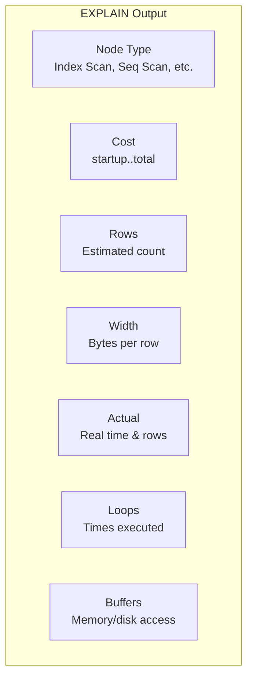
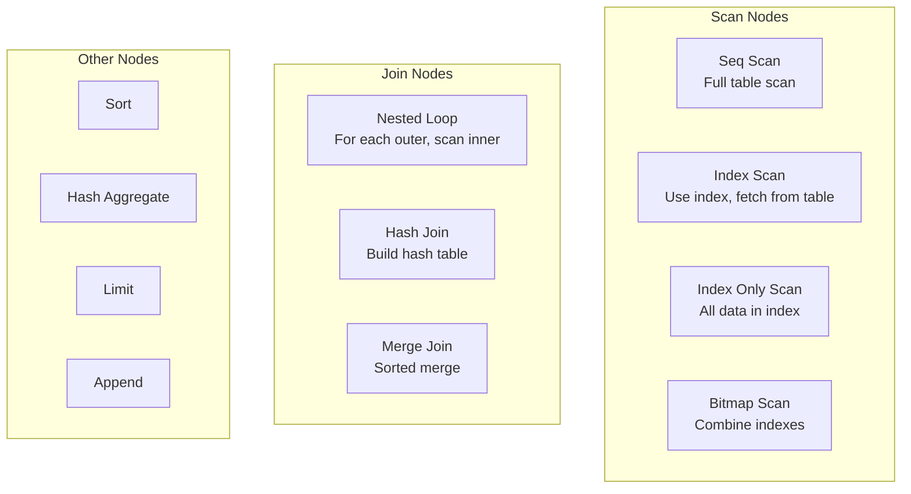
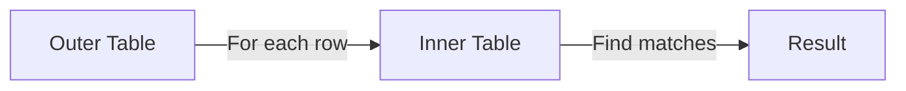
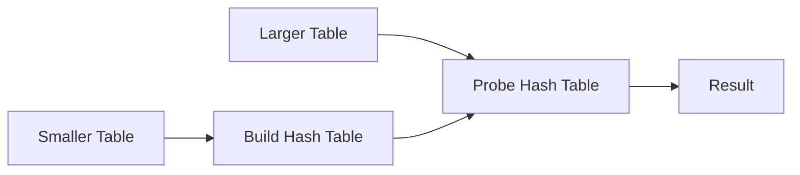
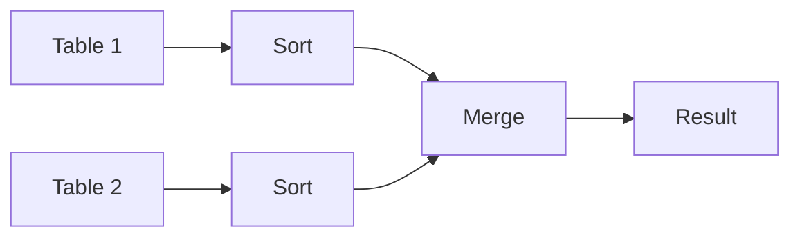
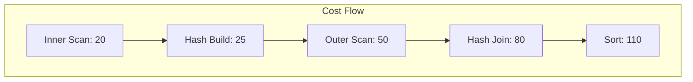

EXPLAIN is your primary tool for understanding how the database executes queries. Learning to read execution plans is essential for query optimization.

## EXPLAIN Basics

<Tabs items={['PostgreSQL', 'MySQL', 'SQL Server']}>
<Tab value="PostgreSQL">
```sql
-- Basic explain (estimated plan)
EXPLAIN SELECT * FROM orders WHERE customer_id = 123;

-- With actual execution times
EXPLAIN ANALYZE SELECT * FROM orders WHERE customer_id = 123;

-- With buffer/IO information
EXPLAIN (ANALYZE, BUFFERS) SELECT * FROM orders WHERE customer_id = 123;

-- Different output formats
EXPLAIN (FORMAT JSON) SELECT ...;
EXPLAIN (FORMAT YAML) SELECT ...;
EXPLAIN (FORMAT XML) SELECT ...;

-- All options
EXPLAIN (
    ANALYZE,      -- Actually run the query
    BUFFERS,      -- Show buffer usage
    COSTS,        -- Show cost estimates (default: on)
    TIMING,       -- Show actual timing (default: on with ANALYZE)
    VERBOSE,      -- Show additional info
    FORMAT TEXT   -- Output format
) SELECT ...;
```
</Tab>
<Tab value="MySQL">
```sql
-- Basic explain
EXPLAIN SELECT * FROM orders WHERE customer_id = 123;

-- With analyze (MySQL 8.0.18+)
EXPLAIN ANALYZE SELECT * FROM orders WHERE customer_id = 123;

-- Extended explain
EXPLAIN EXTENDED SELECT * FROM orders WHERE customer_id = 123;

-- JSON format (more details)
EXPLAIN FORMAT=JSON SELECT * FROM orders WHERE customer_id = 123;

-- Tree format (MySQL 8.0.16+)
EXPLAIN FORMAT=TREE SELECT * FROM orders WHERE customer_id = 123;
```
</Tab>
<Tab value="SQL Server">
```sql
-- Estimated execution plan
SET SHOWPLAN_ALL ON;
GO
SELECT * FROM orders WHERE customer_id = 123;
GO
SET SHOWPLAN_ALL OFF;

-- Actual execution plan with statistics
SET STATISTICS IO ON;
SET STATISTICS TIME ON;
SELECT * FROM orders WHERE customer_id = 123;

-- XML plan
SET SHOWPLAN_XML ON;
GO
SELECT * FROM orders WHERE customer_id = 123;
GO
SET SHOWPLAN_XML OFF;

-- In SSMS: Ctrl+L for estimated, Ctrl+M for actual plan
```
</Tab>
</Tabs>

## Reading PostgreSQL EXPLAIN Output

### Basic Structure

```sql
EXPLAIN ANALYZE SELECT * FROM orders WHERE customer_id = 123;
```

```sql title="EXPLAIN Output Breakdown"
Index Scan using idx_orders_customer on orders  (cost=0.42..8.44 rows=1 width=48) -- [!code highlight]
   (actual time=0.015..0.016 rows=1 loops=1) -- [!code highlight]
   Index Cond: (customer_id = 123)
   Buffers: shared hit=3
Planning Time: 0.085 ms
Execution Time: 0.032 ms
```

<Callout type="info" title="Understanding the Output">
| Component | Example | Meaning |
|-----------|---------|---------|
| **Node Type** | `Index Scan` | How data is accessed |
| **Index** | `idx_orders_customer` | Which index is used |
| **Cost** | `0.42..8.44` | Startup cost..total cost (arbitrary units) |
| **Rows** | `rows=1` | Estimated rows to return |
| **Width** | `width=48` | Average row size in bytes |
| **Actual Time** | `0.015..0.016` | Real execution time (ms) |
| **Actual Rows** | `rows=1` | Real rows returned |
| **Loops** | `loops=1` | Times this node executed |
| **Buffers** | `shared hit=3` | Pages read from cache |
</Callout>

### Key Components



<Tabs items={['Cost', 'Rows', 'Actual', 'Buffers']}>
<Tab value="Cost">
### Cost Explained

The cost is shown as `(cost=startup..total)`:

```sql title="Cost Example"
(cost=0.42..8.44 rows=1 width=48)
--    ^^^^ ^^^^ -- [!code highlight]
--    |    └─ Total cost to return all rows
--    └─ Startup cost (before first row)
```

| Part | Value | Meaning |
|------|-------|---------|
| **Startup** | `0.42` | Work before returning first row |
| **Total** | `8.44` | Total work to return all rows |

<Callout type="info" title="Cost Factors">
The optimizer uses `seq_page_cost`, `random_page_cost`, `cpu_tuple_cost`, and other parameters to calculate cost. You can view these:
```sql
SHOW seq_page_cost;       -- Default: 1.0 -- [!code highlight]
SHOW random_page_cost;    -- Default: 4.0 -- [!code highlight]
SHOW cpu_tuple_cost;      -- Default: 0.01 -- [!code highlight]
```
</Callout>

<Callout type="warn" title="Important">
Cost units are **arbitrary** - they're only useful for comparing plans within the same query, not across different queries.
</Callout>
</Tab>
<Tab value="Rows">
### Row Estimates

```sql title="Row Estimate"
(cost=0.42..8.44 rows=1 width=48)
```

The `rows=1` is the **estimated** number of rows this node will return.

**Why estimates matter:**
- Optimizer uses row estimates to choose plans
- Wrong estimates → wrong plan → slow queries

**Common causes of bad estimates:**
- Stale statistics (run `ANALYZE`)
- Correlated columns
- Complex expressions
- Non-uniform data distribution
</Tab>
<Tab value="Actual">
### Actual Execution (EXPLAIN ANALYZE only)

```sql title="Actual Metrics"
(actual time=0.015..0.016 rows=1 loops=1)
--           ^^^^^ ^^^^^ ^^^^ ^^^^^^^ -- [!code highlight]
--           |     |     |    └─ Times node executed
--           |     |     └─ Actual rows returned
--           |     └─ Time to return all rows (ms)
--           └─ Time to return first row (ms)
```

| Part | Value | Meaning |
|------|-------|---------|
| **Start time** | `0.015` | Time to return first row (ms) |
| **End time** | `0.016` | Time to return all rows (ms) |
| **Rows** | `1` | Actual rows returned |
| **Loops** | `1` | Times this node executed |

<Callout type="error" title="Red Flag: Estimate Mismatch">
When estimated and actual rows differ significantly:
```sql
Index Scan  (cost=... rows=100) (actual rows=10000) -- [!code error]
--                    ^^^^^^^          ^^^^^^^
--                    Expected 100     Got 10,000!
```
This means statistics are stale. Fix with:
```sql
ANALYZE table_name; -- [!code highlight]
```
</Callout>
</Tab>
<Tab value="Buffers">
### Buffer Usage (BUFFERS option)

```sql
EXPLAIN (ANALYZE, BUFFERS) SELECT ...;
```

```sql title="Buffer Statistics"
Buffers: shared hit=3 read=2 dirtied=0 written=0
--       ^^^^^^^^^^ ^^^^^^ -- [!code highlight]
--       From cache From disk (slow!)
```

| Metric | Meaning |
|--------|---------|
| **shared hit** | Pages found in cache ✅ Fast |
| **shared read** | Pages read from disk ⚠️ Slow |
| **dirtied** | Pages modified |
| **written** | Pages written to disk |

<Callout type="info">
**More hits = faster.** High `read` count means data isn't cached - consider if this is expected or if you need more `shared_buffers`.
</Callout>
</Tab>
</Tabs>

## Common Node Types



### Scan Types

<Accordions>
<Accordion title="Sequential Scan (Seq Scan)">
```sql
Seq Scan on orders  (cost=0.00..1234.00 rows=50000 width=48) -- [!code warning]
  Filter: (status = 'active')
  Rows Removed by Filter: 10000
```

**What it means:** Reading every row in the table.

**When it's OK:**
- Small tables
- Need most/all rows
- No useful index

**When it's a problem:**
- Large table, few rows needed
- Missing index
- Index exists but not used

**Solutions:**
```sql
CREATE INDEX idx_orders_status ON orders(status); -- [!code ++]

ANALYZE orders; -- Update statistics

SET enable_indexscan = on; -- Check if index is disabled
```
</Accordion>
<Accordion title="Index Scan">
```sql
Index Scan using idx_orders_customer on orders  (cost=0.42..8.44 rows=1 width=48) -- [!code highlight]
  Index Cond: (customer_id = 123)
```

**What it means:** 
1. Look up values in index
2. Fetch full row from table

**Good for:** Selective queries (few rows)
**Bad for:** Many rows (random I/O overhead)
</Accordion>
<Accordion title="Index Only Scan">
```sql
Index Only Scan using idx_covering on orders  (cost=0.42..8.44 rows=1 width=16) -- [!code highlight]
  Index Cond: (customer_id = 123)
  Heap Fetches: 0 -- No table access needed! -- [!code highlight]
```

**What it means:** All needed columns are in the index; no table access needed.

**Best case scenario!**

**Requirements:**
- All SELECT columns in index
- All WHERE columns in index
- Visibility map up to date (VACUUM)
</Accordion>
<Accordion title="Bitmap Scan">
```sql
Bitmap Heap Scan on orders  (cost=4.42..20.44 rows=10 width=48)
  Recheck Cond: (status = 'active')
  ->  Bitmap Index Scan on idx_orders_status -- [!code highlight]
        Index Cond: (status = 'active')
```

**What it means:**
1. Build bitmap of matching rows using index
2. Scan table pages in order
3. Recheck condition on each row

**Good for:**
- Medium selectivity
- Multiple index conditions (OR)
- Avoiding random I/O
</Accordion>
</Accordions>

### Join Types

<Accordions>
<Accordion title="Nested Loop">
```sql
Nested Loop  (cost=0.42..100.00 rows=100 width=96) -- [!code highlight]
  ->  Index Scan on customers  (cost=0.42..8.44 rows=10 width=48)
  ->  Index Scan on orders  (cost=0.42..8.44 rows=10 width=48)
        Index Cond: (customer_id = customers.id)
```



**How it works:** For each row in outer table, scan inner table.

**Good for:**
- Small outer table
- Index on inner join column
- LIMIT queries

**Complexity:** O(n × m) without index
</Accordion>
<Accordion title="Hash Join">
```sql
Hash Join  (cost=10.00..200.00 rows=1000 width=96) -- [!code highlight]
  Hash Cond: (orders.customer_id = customers.id)
  ->  Seq Scan on orders
  ->  Hash -- [!code focus]
        ->  Seq Scan on customers -- [!code focus]
```



**How it works:**
1. Build hash table from smaller table
2. Probe hash table for each row in larger table

**Good for:**
- Large tables
- No useful indexes
- Equality joins only

**Needs:** Enough `work_mem` for hash table
</Accordion>
<Accordion title="Merge Join">
```sql
Merge Join  (cost=100.00..200.00 rows=1000 width=96) -- [!code highlight]
  Merge Cond: (orders.customer_id = customers.id)
  ->  Sort on orders.customer_id -- [!code focus]
  ->  Sort on customers.id -- [!code focus]
```



**How it works:**
1. Sort both tables by join key
2. Merge sorted results

**Good for:**
- Large tables
- Data already sorted (index)
- Multiple equi-join conditions
</Accordion>
</Accordions>

## Interpreting Complex Plans

### Reading Plan Trees

```
Sort  (cost=100..110 rows=100)
  Sort Key: orders.created_at DESC
  ->  Hash Join  (cost=10..80 rows=100)
        Hash Cond: (orders.customer_id = customers.id)
        ->  Seq Scan on orders  (cost=0..50 rows=1000)
              Filter: (total > 100)
        ->  Hash
              ->  Index Scan on customers  (cost=0..20 rows=50)
                    Index Cond: (status = 'active')
```

**Read from inside out, bottom to top:**

1. Index Scan on `customers` → finds active customers
2. Hash → builds hash table from customers
3. Seq Scan on `orders` → filters orders > 100
4. Hash Join → matches orders to customers
5. Sort → sorts result by date

### Cost Accumulation



Parent node cost includes child costs.

## Troubleshooting Patterns

<Steps>
<Step>
### Pattern: Wrong Row Estimate

```sql
Index Scan (rows=100) (actual rows=50000) -- [!code error]
```

**Solution:**
```sql
ANALYZE table_name; -- [!code highlight]
-- Or for specific columns:
ANALYZE table_name(column_name);
```
</Step>
<Step>
### Pattern: Seq Scan on Large Table

```sql
Seq Scan on large_table (cost=0..100000) -- [!code warning]
  Filter: (indexed_column = 'value')
```

**Solutions:**
```sql
\di large_table -- Check if index exists

CREATE INDEX idx ON large_table(indexed_column); -- [!code ++]

ANALYZE large_table; -- Check statistics

-- Check for function on column
WHERE LOWER(column) = 'value' -- [!code --]
WHERE column = 'VALUE' -- [!code ++]
```
</Step>
<Step>
### Pattern: High Loops Count

```sql
Nested Loop (actual loops=100000) -- [!code error]
  ->  Seq Scan on table_a
  ->  Index Scan on table_b
```

**Solutions:**
```sql
CREATE INDEX idx ON table_b(join_column); -- [!code ++]

-- Or force hash join (if appropriate)
SET enable_nestloop = off;
```
</Step>
<Step>
### Pattern: Sort on Disk

```sql
Sort (Sort Method: external merge Disk: 50MB) -- [!code warning]
```

**Solutions:**
```sql
SET work_mem = '256MB'; -- [!code ++]

-- Or add index to avoid sort
CREATE INDEX idx ON table(sort_column); -- [!code ++]
```
</Step>
</Steps>

## Visual Tools

<Tabs items={['explain.depesz.com', 'pgAdmin', 'pev2']}>
<Tab value="explain.depesz.com">
### explain.depesz.com

1. Run `EXPLAIN (ANALYZE, BUFFERS, FORMAT TEXT)`
2. Copy output to https://explain.depesz.com
3. Get visual breakdown with problem areas highlighted

Features:
- Highlights slow nodes
- Shows exclusive vs inclusive time
- Color-codes by performance
</Tab>
<Tab value="pgAdmin">
### pgAdmin Graphical Explain

1. Open Query Tool
2. Write your query
3. Click "Explain Analyze" (F7)
4. View graphical plan

Features:
- Visual node representation
- Click nodes for details
- Shows data flow
</Tab>
<Tab value="pev2">
### pev2 (Postgres Explain Visualizer 2)

https://explain.dalibo.com/

1. Run `EXPLAIN (ANALYZE, BUFFERS, FORMAT JSON)`
2. Paste JSON output
3. Get interactive visualization

Features:
- Modern interface
- Statistics comparison
- Shareable links
</Tab>
</Tabs>

## Best Practices

<Callout type="info" title="EXPLAIN Checklist">
1. **Always use ANALYZE** for real data, not estimates
2. **Use BUFFERS** to see I/O patterns
3. **Compare estimated vs actual rows** to detect statistics issues
4. **Look for the most expensive nodes** first
5. **Check for sequential scans** on large tables
6. **Watch for high loop counts** in nested loops
7. **Monitor buffer reads vs hits** for caching efficiency
</Callout>

## Next Steps

<Cards>
  <Card title="Join Optimization" href="/docs/sql/query-optimization/joins" description="Optimize JOIN performance" />
  <Card title="Anti-patterns" href="/docs/sql/query-optimization/anti-patterns" description="Common mistakes to avoid" />
</Cards>
