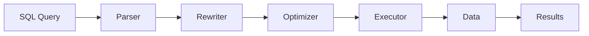
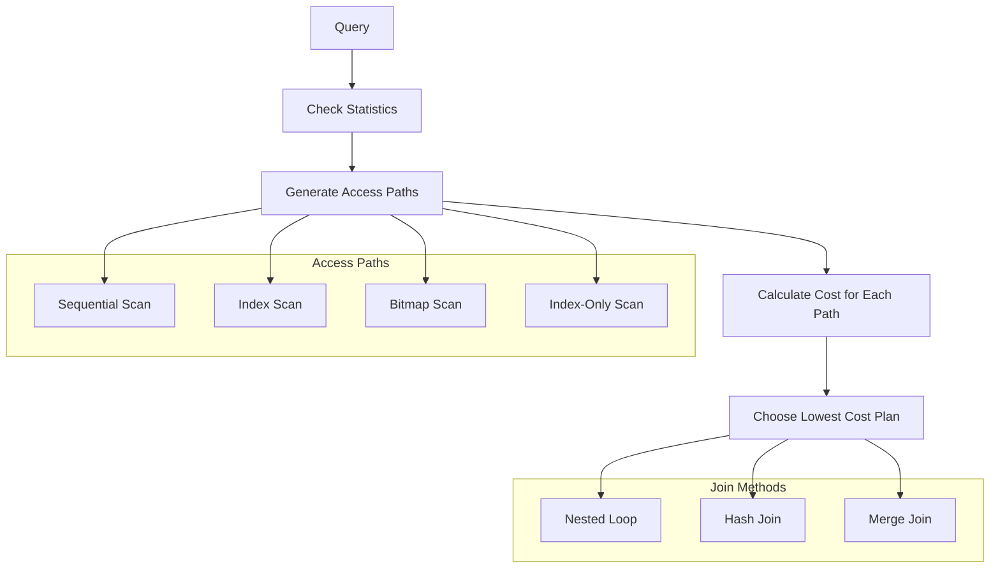

Query optimization is the art and science of writing SQL that executes efficiently. Understanding how databases process queries enables you to write performant code from the start.

## How Query Processing Works



<Steps>
<Step>
### Parsing
The database parses your SQL into an abstract syntax tree (AST), checking for syntax errors.
</Step>
<Step>
### Rewriting
Query is transformed: views expanded, rules applied, subqueries flattened.
</Step>
<Step>
### Optimization
The optimizer generates multiple execution plans and chooses the most efficient one based on statistics.
</Step>
<Step>
### Execution
The chosen plan is executed, accessing data through the most efficient path.
</Step>
</Steps>

## Quick Navigation

<Cards>
  <Card title="EXPLAIN Basics" href="/docs/sql/query-optimization/explain" description="Reading and understanding execution plans" />
  <Card title="Join Optimization" href="/docs/sql/query-optimization/joins" description="Optimizing JOIN performance" />
  <Card title="Subquery Optimization" href="/docs/sql/query-optimization/subqueries" description="Efficient subqueries and CTEs" />
  <Card title="Common Anti-patterns" href="/docs/sql/query-optimization/anti-patterns" description="Mistakes to avoid" />
</Cards>

## The Optimizer's Decision Process



## Quick Reference: Optimization Checklist

<Tabs items={['Before Writing', 'During Writing', 'After Writing']}>
<Tab value="Before Writing">
### Planning Phase

- [ ] Understand the data model and relationships
- [ ] Know the data volumes (rows, sizes)
- [ ] Identify which indexes exist
- [ ] Understand the query's purpose and frequency
- [ ] Consider if real-time is required or if caching is acceptable
</Tab>
<Tab value="During Writing">
### Writing Phase

- [ ] Select only needed columns (avoid `SELECT *`)
- [ ] Use appropriate JOIN types
- [ ] Add WHERE clauses to limit rows early
- [ ] Put most restrictive conditions first
- [ ] Use EXISTS instead of COUNT for existence checks
- [ ] Consider LIMIT if you need only a subset
</Tab>
<Tab value="After Writing">
### Verification Phase

- [ ] Run EXPLAIN ANALYZE to see actual execution
- [ ] Check if indexes are being used
- [ ] Compare estimated vs actual row counts
- [ ] Look for sequential scans on large tables
- [ ] Verify no unnecessary sorting or hashing
- [ ] Test with production-like data volumes
</Tab>
</Tabs>

## Essential Optimization Techniques

### 1. Use Indexes Effectively

```sql
-- ✅ Index can be used
SELECT * FROM orders WHERE customer_id = 123;

-- ❌ Index cannot be used (function on indexed column)
SELECT * FROM orders WHERE YEAR(created_at) = 2024;

-- ✅ Rewritten to use index
SELECT * FROM orders 
WHERE created_at >= '2024-01-01' 
  AND created_at < '2025-01-01';
```

### 2. Limit Data Early

```sql
-- ❌ Filters after joining all data
SELECT o.*, c.name
FROM orders o
JOIN customers c ON o.customer_id = c.id
WHERE o.created_at > '2024-01-01';

-- ✅ Filter before join (if optimizer doesn't do it)
SELECT o.*, c.name
FROM (
    SELECT * FROM orders WHERE created_at > '2024-01-01'
) o
JOIN customers c ON o.customer_id = c.id;
```

### 3. Choose the Right Join

```sql
-- Use EXISTS for existence checks (can short-circuit)
SELECT * FROM customers c
WHERE EXISTS (SELECT 1 FROM orders WHERE customer_id = c.id);

-- Use JOIN when you need data from both tables
SELECT c.*, o.total
FROM customers c
JOIN orders o ON c.id = o.customer_id;
```

### 4. Avoid N+1 Queries

```sql
-- ❌ N+1 Pattern (in application code)
customers = db.query("SELECT * FROM customers")
for customer in customers:
    orders = db.query(f"SELECT * FROM orders WHERE customer_id = {customer.id}")

-- ✅ Single query with JOIN
SELECT c.*, o.*
FROM customers c
LEFT JOIN orders o ON c.id = o.customer_id;

-- ✅ Or batch fetch
SELECT * FROM orders WHERE customer_id IN (1, 2, 3, 4, 5);
```

## Understanding Costs

<Callout type="info" title="What is Cost?">
Cost is an arbitrary unit representing the estimated resources (CPU, I/O, memory) needed to execute a query. Lower is better, but absolute values are meaningless—only compare costs for the same query.
</Callout>

| Scan Type | Relative Cost | When Used |
|-----------|---------------|-----------|
| Index-Only Scan | Lowest | All columns in index |
| Index Scan | Low | Few rows, random access OK |
| Bitmap Scan | Medium | Many rows, combines indexes |
| Sequential Scan | High | Most/all rows needed |

## Statistics Matter

The optimizer relies on table statistics to make decisions:

```sql
-- PostgreSQL: Update statistics
ANALYZE table_name;

-- MySQL: Update statistics
ANALYZE TABLE table_name;

-- SQL Server: Update statistics
UPDATE STATISTICS table_name;

-- View statistics
-- PostgreSQL
SELECT * FROM pg_stats WHERE tablename = 'orders';

-- Check when stats were last updated
SELECT relname, last_analyze, last_autoanalyze
FROM pg_stat_user_tables;
```

<Callout type="warn" title="Stale Statistics">
Stale statistics lead to poor query plans. The optimizer might choose a sequential scan when an index scan would be faster, or vice versa. Run ANALYZE after large data changes.
</Callout>

## Common Performance Problems

<Accordions>
<Accordion title="Sequential Scans on Large Tables">
```sql
-- Check for sequential scans
EXPLAIN ANALYZE SELECT * FROM orders WHERE status = 'pending';

-- If you see "Seq Scan" on a large table:
-- 1. Check if index exists
-- 2. Check if index is being used
-- 3. Check if statistics are up to date
-- 4. Check if the predicate allows index usage
```
</Accordion>
<Accordion title="High Row Estimates vs Actual">
```sql
-- EXPLAIN output shows estimates vs actual
-- Planning time: 0.5 ms
-- Execution time: 500 ms
-- Seq Scan (cost=0..1000 rows=100) (actual rows=50000)
--                        ^^^^^^^^          ^^^^^^^^^^^
--                        Estimated         Actual

-- Big difference = stale statistics
ANALYZE table_name;
```
</Accordion>
<Accordion title="Expensive Sorts">
```sql
-- Sort operations can be expensive
-- Look for "Sort Method: external merge Disk"

-- Solutions:
-- 1. Add index that matches ORDER BY
CREATE INDEX idx_orders_date ON orders(created_at DESC);

-- 2. Increase work_mem for in-memory sorts
SET work_mem = '256MB';
```
</Accordion>
<Accordion title="Nested Loop with High Loops">
```sql
-- Nested Loop (actual loops=100000)
-- This means the inner query ran 100,000 times

-- Solutions:
-- 1. Add index on join column
-- 2. Consider hash join (add memory)
-- 3. Restructure query to reduce outer rows
```
</Accordion>
</Accordions>

## Database-Specific Optimization

<Tabs items={['PostgreSQL', 'MySQL', 'SQL Server']}>
<Tab value="PostgreSQL">
```sql
-- Enable timing
\timing on

-- Detailed EXPLAIN
EXPLAIN (ANALYZE, BUFFERS, FORMAT TEXT) 
SELECT ...;

-- See actual I/O
EXPLAIN (ANALYZE, BUFFERS) SELECT ...;

-- Force specific plan (for testing)
SET enable_seqscan = off;
SET enable_indexscan = off;
SET enable_hashjoin = off;

-- Auto-explain for slow queries
LOAD 'auto_explain';
SET auto_explain.log_min_duration = '1s';
```
</Tab>
<Tab value="MySQL">
```sql
-- Analyze query
EXPLAIN SELECT ...;
EXPLAIN ANALYZE SELECT ...;  -- MySQL 8.0.18+

-- Show query profile
SET profiling = 1;
SELECT ...;
SHOW PROFILE FOR QUERY 1;

-- Optimizer hints
SELECT /*+ INDEX(orders idx_customer) */ *
FROM orders WHERE customer_id = 123;

-- Force index
SELECT * FROM orders FORCE INDEX (idx_customer)
WHERE customer_id = 123;
```
</Tab>
<Tab value="SQL Server">
```sql
-- Show execution plan
SET STATISTICS IO ON;
SET STATISTICS TIME ON;

-- Estimated plan
SET SHOWPLAN_ALL ON;
SELECT ...;
SET SHOWPLAN_ALL OFF;

-- Actual plan (graphical in SSMS)
SET STATISTICS PROFILE ON;
SELECT ...;

-- Query hints
SELECT * FROM orders WITH (INDEX(idx_customer))
WHERE customer_id = 123;

OPTION (RECOMPILE);
OPTION (OPTIMIZE FOR (@param = 'value'));
```
</Tab>
</Tabs>

## Performance Tuning Workflow

<Steps>
<Step>
### Identify Slow Queries
Enable slow query logging or use monitoring tools.

```sql
-- PostgreSQL: pg_stat_statements
SELECT query, calls, mean_time, total_time
FROM pg_stat_statements
ORDER BY total_time DESC
LIMIT 10;
```
</Step>
<Step>
### Analyze with EXPLAIN
Get the execution plan for the slow query.

```sql
EXPLAIN (ANALYZE, BUFFERS)
SELECT ...;
```
</Step>
<Step>
### Identify Bottlenecks
Look for:
- Sequential scans on large tables
- High loop counts
- Large sort operations
- Estimate vs actual mismatches
</Step>
<Step>
### Apply Optimizations
- Add missing indexes
- Rewrite query logic
- Update statistics
- Adjust database parameters
</Step>
<Step>
### Verify Improvement
Re-run EXPLAIN ANALYZE to confirm the fix.
</Step>
</Steps>

## Next Steps

<Cards>
  <Card title="EXPLAIN Deep Dive" href="/docs/sql/query-optimization/explain" description="Master execution plan analysis" />
  <Card title="Indexing Strategies" href="/docs/sql/indexing" description="Choose the right indexes" />
</Cards>
